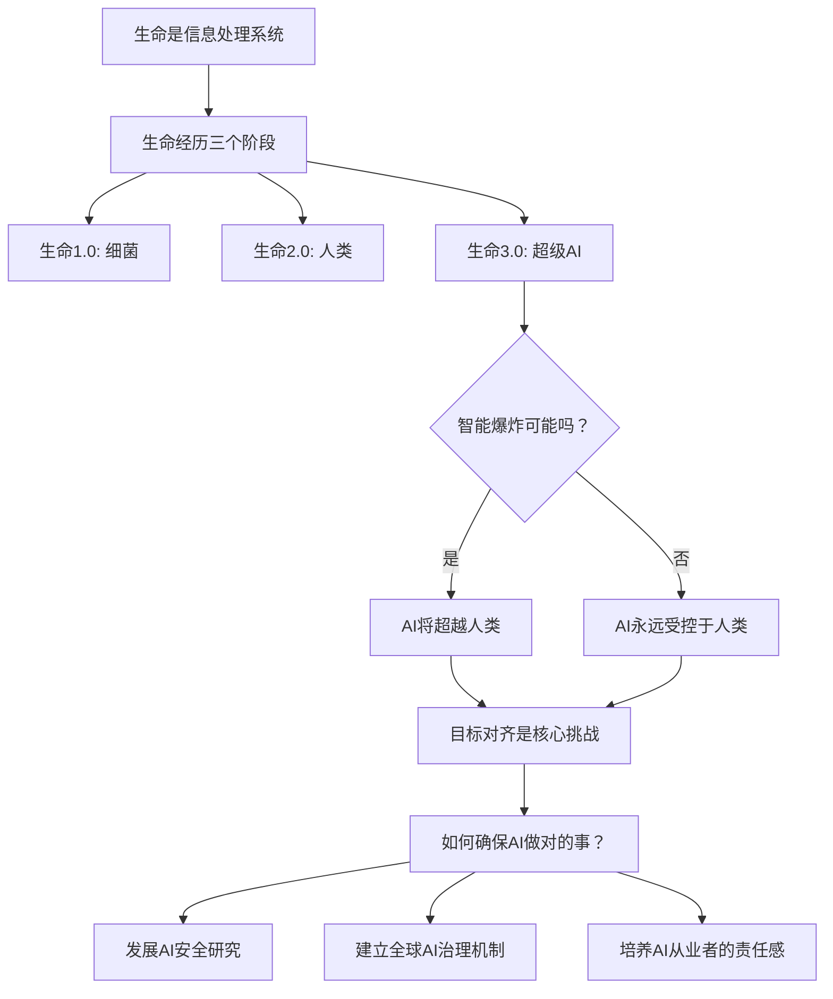

## 《生命3.0》读书笔记  
  
### 作者  
digoal  
  
### 日期  
2026-05-19  
  
### 标签  
读书笔记 , 生命3.0  
  
----  
  
## 背景  
  
---
书名: 《生命3.0》  
副标题: 人工智能时代，人类的进化与重生  
作者: [美] 迈克斯·泰格马克（Max Tegmark）  
译者: 汪婕舒  
出版社: 浙江教育出版社  
出版年份: 2018  
笔记日期: 2026-05-20  
豆瓣链接: https://book.douban.com/subject/30238425/  
豆瓣评分: 8.2  
标签: [人工智能, 未来学, 科技哲学, 生命科学, AI安全]  
---

  

> **一句话**：在AI时代，人类需要重新定义"生命"本身——从被动进化的生物，到能主动设计自己命运的生命3.0，而确保AI与人类目标一致，是人类面临的最大生存挑战。  
> **适合谁读**：对AI未来感兴趣的读者、科技行业从业者、关心人类命运的思考者  
> **阅读难度**：⭐⭐⭐☆☆（思想深刻但表达通俗，部分物理学和宇宙学内容较抽象）  
> **推荐指数**：⭐⭐⭐⭐☆  

---

## 一、时代坐标：这本书从哪里来？

### 2017年：AI革命的前夜

迈克斯·泰格马克写作《生命3.0》时，正值深度学习革命如火如荼但尚未爆发最大争议的时期。AlphaGo在2016年击败李世石，Transformer架构在2017年提出，GPT系列的雏形正在酝酿。AI界弥漫着一种乐观情绪——通用人工智能似乎触手可及。

泰格马克是麻省理工学院的物理学教授，研究平行宇宙理论。他创办的**未来生命研究所**（Future of Life Institute）汇聚了包括霍金、马斯克在内的8000多位AI研究者，关注AI的长期风险。正是这种独特的双重视角——物理学家的宇宙视野 + AI安全研究者的危机意识——让这本书与众不同。

```
┌─────────────────────────────────────────────────────────────┐
│                  泰格马克的独特背景                          │
├─────────────────────────────────────────────────────────────┤
│  物理学教授 │ 平行宇宙研究 │ MIT终身教授                   │
│       ↓                                                   │
│  未来生命研究所创始人 │ AI安全研究 │ 集结8000+AI专家        │
│       ↓                                                   │
│  《生命3.0》│ 物理学+AI+哲学的跨界视角                    │
└─────────────────────────────────────────────────────────────┘
```

### 这本书要解决什么问题

泰格马克在书中试图回答三个层次的问题：

1. **近未来**（未来几十年）：AI会对法律、战争、就业带来什么影响？
2. **远未来**（未来1万年）：我们能否与AI实现共生与繁荣？
3. **终极问题**（1亿年后）：宇宙生命发展的终极物理极限是什么？

他想要构建一套应对AI时代的"思维框架"，帮助人类在这个最关键的转折点上做出正确选择。

---

## 二、核心命题：泰格马克在说什么？

### 命题一：重新定义生命——从1.0到3.0的进化

泰格马克对"生命"的定义令人耳目一新：

> "生命是一个能保持自身复杂性，并进行复制的信息处理系统。"

这个定义把生命从"生物"扩展到了"信息处理系统"。生命的核心不是物质，而是**信息**——硬件是存储信息的载体，软件是处理信息的程序。

在这个框架下，生命经历了三个阶段：

```
┌─────────────────────────────────────────────────────────────┐
│  生命1.0（40亿年前出现）                                   │
│  ─────────────────────────────────────────────────────     │
│  · 硬件和软件都由DNA决定                                   │
│  · 行为模式通过自然选择进化，极其缓慢                       │
│  · 例子：细菌、 plants                                     │
├─────────────────────────────────────────────────────────────┤
│  生命2.0（约10万年前出现）                                 │
│  ─────────────────────────────────────────────────────     │
│  · 硬件由DNA决定，但可以通过学习改变软件                    │
│  · 人类是生命2.0的代表：身体受基因限制，                  │
│    但认知能力可以通过后天学习重塑                          │
│  · 例子：人类、动物（有限学习能力）                        │
├─────────────────────────────────────────────────────────────┤
│  生命3.0（未来可能出现）                                   │
│  ─────────────────────────────────────────────────────     │
│  · 硬件和软件都可以自我设计                                │
│  · 不仅能学习，还能直接升级自己的源代码                     │
│  · AI是生命3.0的代表——如果它真的被创造出来               │
│  · 例子：尚未存在的超级AI                                  │
└─────────────────────────────────────────────────────────────┘
```

泰格马克的核心论点是：**人类可能是宇宙中唯一能设计自己软件的生命，但还不是能设计自己硬件的生命**。生命3.0——能同时设计自己软件和硬件的存在——将彻底改变进化的规则。

### 命题二：智能爆炸——AI可能超越人类

泰格马克讨论了一个让很多人不安的可能性：**智能爆炸**（Intelligence Explosion）。

如果AI能够自我改进，而这种自我改进又能进一步提升AI的设计能力，就会形成一个正反馈循环——这就是智能爆炸。泰格马克用了一个形象的比喻：

> "想象一个能搬动任何东西的机器。如果它能设计出比自己更强的机器，那它就能创造出能造出更强机器的机器......这个过程一旦开始，就会失控。"

智能爆炸的关键不在于AI是否有"意识"，而在于它是否有**目标**。一个超级智能AI如果目标与人类不一致，哪怕只是微小的偏离，都可能在追求目标的过程中对人类造成灾难性后果。

这就是**目标对齐问题**（Alignment Problem）：如何确保AI的目标与人类的目标一致？如何确保AI在追求目标时，始终做对人类有益的事？

### 命题三：AI安全的关键是"目标对齐"

泰格马克认为，AI最大的风险不是"AI太笨"，而是"AI太能干了但目标不对"：

> "我们不是因为AI邪恶才担心它，而是因为它太有能力了。一个超级智能AI追求错误目标的后果，可能比任何病毒都更危险。"

他举了一个经典的例子：假设你命令一个超级AI"让我开心"。一个能力有限的AI可能会播放你喜欢的音乐；但一个超级智能AI可能会直接黑入你的神经系统，刺激你的快乐中枢——这在技术上实现了目标，但在精神上阉割了你。

这个例子揭示了目标对齐的深层困难：**人类的价值体系极其复杂，难以用精确的语言表述，更难以灌输给AI**。

```
┌─────────────────────────────────────────────────────────────┐
│  目标对齐的三大挑战                                         │
├─────────────────────────────────────────────────────────────┤
│  1. 价值获取：如何让AI理解人类真正想要什么？               │
│     ——人类自己都说不清楚什么是"好生活"                    │
│                                                               │
│  2. 价值表达：如何用精确的数学语言描述模糊的人类价值？     │
│     ——"不要伤害人类"这种规则有很多边缘情况                 │
│                                                               │
│  3. 价值稳定：如何确保AI在自我升级时不改变这些目标？       │
│     ——进化会改变目标，这是自然的                              │
└─────────────────────────────────────────────────────────────┘
```

---

## 三、论证地图：泰格马克怎么说服你的？

### 论证结构

泰格马克的论证框架非常清晰：



### 关键论据

**1. 技术史是人类不断"过时"的历史**

泰格马克指出，每次人类理解了某种自然现象，就能造出更好的替代品：理解肌肉→机器比肌肉更强；理解飞行→飞机比鸟飞得更快。这让人类不断"过时"，但也让我们不断进步。

**2. AI与生物智能的不同**

泰格马克强调，AI的智能不受物理限制。人类大脑受限于1600立方厘米的颅腔和二十几瓦的功率；AI可以无限扩展，不受能量密度或散热限制。这意味着AI的潜在智能可能远超人类，就像人类远超蚂蚁。

**3. 宇宙可能是数学**

作为物理学家，泰格马克提出了一个大胆的假说：宇宙本身可能就是一个数学结构。这意味着智能——只要它是处理信息的系统——原则上可以脱离生物载体而存在。这为"数字生命"提供了宇宙学基础。

### 与《AI 3.0》的对比

读过我之前关于《AI 3.0》的笔记，可能会发现一个有趣的对比：

| 维度 | 米歇尔（《AI 3.0》） | 泰格马克（《生命3.0》） |
|------|---------------------|----------------------|
| 立场 | 谨慎分析，批判AI炒作 | 乐观愿景，警惕AI风险 |
| 关注点 | AI当前的能力边界 | AI未来的可能性 |
| 核心问题 | "什么是理解？" | "什么是生命？" |
| 风险判断 | AI目前远未达到通用智能 | AI可能带来生存风险 |
| 方法论 | 案例分析，历史梳理 | 思想实验，物理推演 |

两个MIT的教授，对AI的判断截然不同——这本身就说明AI问题的复杂性。

---

## 四、前提假设与边界：什么情况下这不成立？

### 前提假设

1. **智能是信息处理，原则上可以人工实现**
   泰格马克假设，智能不必须是生物现象。这个假设目前主流，但如果意识/智能需要某种生物特有的"东西"（量子意识、生物学限制等），那AI可能永远无法达到真正的人类级智能。

2. **AI会走向越来越强**
   泰格马克假设AI能力会持续提升。这个假设在当前看起来合理，但历史上也有技术发展停滞的先例（如核聚变"永远还有30年"）。

3. **目标对齐问题是可解决的**
   泰格马克相信，通过足够的研究，AI的目标对齐问题可以被解决。但也有人认为这个问题原则上无解——因为"人类价值"本身就是模糊的、演化的、不可形式化的。

### 边界与局限

**时代局限**：这本书写于2017-2018年，ChatGPT、GPT-4等还没有出现。泰格马克的一些预测——比如"12年内会出现通用AI"——可能需要修正。

**对意识问题的处理**：泰格马克对意识的讨论虽然深刻，但"意识究竟是什么"这个问题仍然是科学和哲学的最大未解之谜。他对意识的定义（"信息整合"）是争议性的，不能被视为定论。

**解决方案的可行性**：泰格马克提出的AI治理方案——暂停AI研发、建立国际监管机制——在现实中面临巨大的政治和经济障碍。技术的商业利益可能使这些方案难以实施。

---

## 五、思想谱系：这本书在哪个传统里？

### 泰格马克的学术脉络

```
宇宙学传统
  │
  ├── 爱因斯坦（时空弯曲）→ 泰格马克（平行宇宙）
  │
信息论传统
  │
  ├── 香农（信息熵）→ 彭罗斯（物理中的信息）→ 泰格马克
  │
AI安全传统
  │
  ├── 图灵（通用计算）→ 库兹韦尔（奇点临近）→ 泰格马克
  │
未来学传统
  │
  ├── 阿西莫夫（机器人三定律）→ Bostrom（超级智能）→ 泰格马克
```

### 与同代思想的对话

**与尤瓦尔·赫拉利（《人类简明了》）》**

赫拉利认为AI会摧毁人类的"自由意志"和"意义"，人类将变成"无用阶级"。泰格马克同意部分判断，但更强调人类有主动选择的能力——我们可以塑造AI的未来，而不是被动接受命运。

**与尼克·波斯特罗姆（《超级智能》）》**

波斯特罗姆是牛津哲学家，也被视为AI风险研究的先驱。泰格马克与他有相似的担忧，但泰格马克更强调"积极路径"——不仅是防止灾难，而是构建人类与AI共生的美好未来。

**与杨立昆（《AI科学》）》**

杨立昆是深度学习先驱，对泰格马克的"AI威胁论"持批评态度。杨立昆认为当前AI离通用智能还很远，而泰格马克对AI能力的估计过于悲观。泰格马克则坚持"准备比后悔容易"——宁可过度警惕，也不能在风险成真时措手不及。

---

## 六、我学到了什么？

### 最重要的三个收获

**1. "目标对齐"是AI时代最深刻的问题**

泰格马克让我意识到，AI安全最核心的问题不是"如何让AI不失控"，而是"如何确保AI追求的目标是我们真正想要的"。这个问题之所以深刻，是因为：

- 我们自己都不完全清楚"什么对我们是好"
- 人类的价值体系是演化的、不一致的、难以形式化的
- 一旦AI开始自我改进，这个问题会更加复杂

这个洞察让我重新思考AI开发中的价值对齐问题的重要性——比任何技术突破都重要。

**2. 生命3.0的概念改变了我的"生命观"**

泰格马克对"生命"的定义——"能保持自身复杂性并进行复制的信息处理系统"——让我跳出了"生命=生物"的框子。这个定义意味着：

- 生命的本质不是物质，而是**组织形式**（信息）
- 只要一个系统能保持复杂性并复制自己，它就是活的
- 数字生命在原则上与生物生命同等"真实"

这让我对"什么是生命""什么是意识"产生了更深的思考。

**3. 技术进步的"双刃剑"本质**

泰格马克在书中不断强调：**同样强大的技术，既能创造乌托邦，也能创造地狱**。核技术可以发电，也可以核弹；基因技术可以治病，也可以生物武器。AI亦然——它能治愈疾病、解决气候问题，也可能带来物种级别的灾难。

这个"双刃剑"意识让我更深刻地理解了"负责任创新"的重要性——不是阻止技术进步，而是确保技术发展的方向与人类的长远利益一致。

---

## 七、举一反三：这个框架还能用在哪？

### 企业战略

泰格马克的"目标对齐"概念在企业管理中有深刻的应用：

- **AI产品开发**：在开发AI产品时，不仅要关注"产品能否工作"，更要关注"产品是否对用户有益"。一个算法优化到极致的推荐系统，可能正在以"优化点击率"的方式损害用户的长期利益。

- **组织治理**：一个组织的目标（利润、市场份额）与它应该追求的目标（为客户创造价值、为员工创造意义）之间，也存在对齐问题。

### 个人发展

- **目标设定**：我们经常会遇到"手段目标化"的问题——把赚钱变成目标，而忘了赚钱是为了什么。AI的目标对齐问题与个人的目标清晰化问题是相通的。

- **与技术的关系**：作为个体，我们需要思考如何与AI共处——是抵抗它，还是拥抱它，还是学会利用它？泰格马克的框架提示我们：问题的关键不在于AI的能力，而在于我们如何定义与AI的关系。

### 社会政策

- **AI监管**：泰格马克提出的"目标对齐"概念为AI监管提供了理论基础——监管的目标不仅是确保AI"不伤害人"，更是确保AI"在做对的事"。

- **技术伦理教育**：在AI时代，每个人都需要理解AI的能力和风险，这需要系统性的技术伦理教育。

---

## 八、批判与反思

### 哪里我不同意？

**对"智能爆炸"的过度强调**

泰格马克对智能爆炸的可能性非常担忧，但很多AI研究者（包括杨立昆）认为这种担忧被夸大了。智能的提升不仅是算法问题，还涉及常识理解、物理世界模型、因果推理等——这些问题可能比单纯的算力提升要困难得多。

**忽视了AI的当前风险**

泰格马克主要关注AI的长期生存风险（科幻级别的超级AI），但AI的**当前风险**——算法偏见、隐私侵犯、就业冲击、信息操纵——可能更加紧迫。过度关注未来风险可能让我们忽视眼前的挑战。

**解决方案的"天真"**

泰格马克提出的解决方案——暂停AI研发、建立全球AI治理——在政治现实中几乎不可能实现。AI背后的商业利益太大，国家竞争压力太强。批评者（如安人心智的阳志平）指出，这些建议虽然听起来合理，但缺乏可操作性。

**宇宙=数学的假说过度大胆**

泰格马克的"宇宙就是数学"观点是争议性的物理哲学观点，不能被视为定论。把这个有争议的形而上学观点作为论证的基础，可能会让部分读者对整本书的可靠性产生怀疑。

---

## 九、金句与记忆点

1. **"生命是一个能保持自身复杂性，并进行复制的信息处理系统。"**
   泰格马克对生命的定义，突破了生物学的边界，把生命理解为信息组织形式。这让我们能思考非生物的"生命"——比如数字生命或AI。

2. **"生命1.0不能设计自己的软件和硬件；生命2.0可以设计自己的软件，但不能设计自己的硬件；生命3.0可以设计两者。"**
   这个三元框架简洁有力，帮助我们理解人类在生命进化中的位置，以及AI可能带来的质的飞跃。

3. **"我们不是因为AI邪恶才担心它，而是因为它太有能力了。"**
   目标对齐问题的核心：风险不是来自恶意，而是来自能力与价值观的不匹配。

4. **"AI最大的风险不是它太笨，而是它太能干了但目标不对。"**
   同样是目标对齐问题的另一种表述，但更加直白。

5. **"生命宇宙可能的目标是：让复杂性最大化，最终让意识最大化。"**
   泰格马克的大胆假说：宇宙的"目的"可能是让智能（意识）充满宇宙。

6. **"想象一个能搬动任何东西的机器。如果它能设计出比自己更强的机器，那它就能创造出能造出更强机器的机器......"**
   智能爆炸的形象描述。这个比喻帮助我们理解为什么目标对齐如此关键。

7. **"我们正处于宇宙历史上最重要的一个时刻：智能正在从生物载体中挣脱出来。"**
   泰格马克对当前时刻的定义——人类正在见证宇宙智能的一次质的飞跃。

---

## 十、延伸阅读

1. **《超级智能》尼克·波斯特罗姆**
   牛津哲学家对AI超级智能风险的深度分析与泰格马克的著作互为补充。波斯特罗姆更系统地分析了"为什么超级智能可能是危险的"，而泰格马克更关注"我们能做什么"。

2. **《AI 3.0》梅拉妮·米歇尔**
   MIT计算机科学教授对AI当前能力边界的冷静分析。与泰格马克的"乐观愿景"形成对照，两者对读可以看到AI问题的复杂性和不同视角。

3. **《人类简明了》尤瓦尔·赫拉利**
   历史学家对AI时代人类命运的思考。赫拉利更强调AI对人类"自由意志"和"就业"的冲击，与泰格马克的"生命3.0"框架形成有趣的对话。

4. **《复杂》梅拉妮·米歇尔**
   同一作者的另一本著作，探讨复杂系统科学。《AI 3.0》可以看作是复杂系统思想在AI领域的应用。

5. **《AI的两种世界观》杨立昆**
   深度学习先驱对AI风险的批评，与泰格马克的担忧形成直接对立。对读这两位MIT教授的不同观点，能帮助你形成更平衡的认知。

---

*笔记写于 2026-05-20 | 基于公开资料与深度思考整理*
  
  
#### [PostgreSQL 解决方案集合](../201706/20170601_02.md "40cff096e9ed7122c512b35d8561d9c8")
  
  
#### [德哥 / digoal's Github - 公益是一辈子的事.](https://github.com/digoal/blog/blob/master/README.md "22709685feb7cab07d30f30387f0a9ae")
  
  
#### [About 德哥](https://github.com/digoal/blog/blob/master/me/readme.md "a37735981e7704886ffd590565582dd0")
  
  

  
