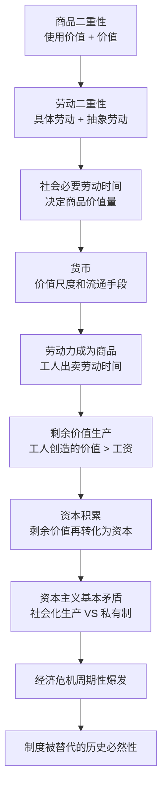
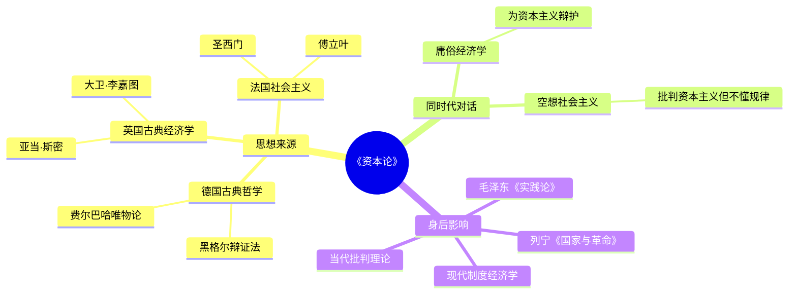

## 《资本论》读书笔记  
  
### 作者  
digoal  
  
### 日期  
2026-05-19  
  
### 标签  
读书笔记 , 资本论 
  
----  
  
## 背景  
  
---
书名: 《资本论》  
作者: [德]卡尔·马克思  
出版年份: 2018  
笔记日期: 2026-05-20  
豆瓣链接: https://book.douban.com/subject/27024399/  
豆瓣评分: 9.5  
标签: [政治经济学, 马克思主义, 资本主义批判, 社会科学, 哲学]  
---

  

> **一句话**：一部以"剩余价值"为核心，解剖资本主义生产方式如何运转、如何矛盾、如何终将自我毁灭的经济学巨著。  
> **适合谁读**：想理解现代经济运行逻辑、对职场焦虑有深层困惑、或者想搞清楚"资本家靠什么赚钱"的每一个人。  
> **阅读难度**：⭐⭐⭐⭐☆（专业性强，但核心逻辑可以小白也能掌握）  
> **推荐指数**：⭐⭐⭐⭐⭐  

---

## 一、时代坐标：这本书从哪里来？

### 马克思为什么要写《资本论》？

1818年出生于德国特里尔的马克思，最初是个哲学家兼记者。1842年在《莱茵报》工作期间，他亲眼目睹了摩泽尔河沿岸贫困农民的悲惨处境，开始思考一个根本问题：**为什么少数人富得流油，多数人却活得艰难？**

1844年在巴黎遇见恩格斯，是马克思人生的转折点。两人合写《神圣家族》，提出了无产阶级解放全人类的使命。但真正让马克思"下狠心"的，是他看到了当时资本主义社会最赤裸的剥削。

19世纪中叶的英国——世界工厂——工厂主富得惊人，而工人，包括妇女和儿童，在矿井和纺织厂里每天工作14-16小时，住贫民窟，拿勉强糊口的工资。马克思要把这个"秘密"用科学的方法揭示出来。

### 写作历程

```
1843年  开始研究政治经济学，阅读2000多册经济学著作
         ↓
1857年  写出《政治经济学批判大纲》（《资本论》第一稿）
         ↓
1867年  《资本论》第一卷正式出版
         ↓
1883年  马克思去世，第二、三卷由恩格斯整理出版
         ↓
1894年  《资本论》第三卷出版（恩格斯去世前完成）
```

**从开始研究到全部完成，整整40年。** 这不是一本赶工出来的书，是马克思毕生心血的结晶。

---

## 二、核心命题：马克思在说什么？

### 观点一：商品的秘密——劳动创造价值，但价值不归劳动者

马克思从"商品"这个最常见的东西入手。他问：**一件商品为什么值那么多钱？**

他的答案：**价值来源于劳动**。具体来说，是"社会必要劳动时间"——生产一件商品平均需要多少人类劳动。

但这里有个残酷的逻辑：
- 你劳动8小时，生产了一件商品
- 这件商品卖出后值8小时劳动的钱
- 但你拿到的工资只够"恢复劳动力"（吃饱、休息、养家）——比如只值4小时
- **另外4小时的价值，被资本家拿走了**

这"另外4小时"就是**剩余价值**，是资本主义利润的真正来源。

### 观点二：资本家赚的不是"管理工资"，是剥削所得

马克思驳斥了一种流行观点：资本家承担风险、投入管理，所以利润是合理回报。

他的论证：
1. 资本家投入的资本，一部分用于购买机器、原料（不变资本），这部分在生产中只是转移价值，不创造新价值
2. 只有用于购买劳动力的那部分资本（可变资本），才能增殖
3. 资本家的利润 = 工人劳动创造的价值 − 工人获得的工资
4. **这是一种无偿占有，本质是剥削**

### 观点三：资本主义内建一个"自杀程序"——基本矛盾

马克思提出了一个让资本家脊背发凉的命题：

```
生产的社会化（千千万万工人协作生产）
              VS.
生产资料的私有制（利润归少数资本家）
        ↓
矛盾：社会化大生产 VS 私人占有
        ↓
结果1：有效需求不足（劳动者买不起自己生产的商品）
        ↓
结果2：生产过剩 → 经济危机
        ↓
结果3：危机不断重复，资本主义制度性痼疾无法自我消除
```

马克思认为，这个矛盾是结构性的，资本主义无法从根本上解决，只能周期性地爆发危机，直至被新的制度取代。

---

## 三、论证地图：马克思怎么说服你的？



### 关键论证方式

**1. 从具体到抽象**：从我们每天接触的商品出发，一层层剥开，揭示底层规律。

**2. 逻辑与历史统一**：他的理论逻辑推演（商品→货币→资本→剩余价值）与资本主义实际发展历程一致。

**3. 数据支撑**：马克思引用了大量英国工厂调查报告、国会蓝皮书、官方统计数据。用事实说话，而非空洞理论。

**4. 经典案例**：其中对英国纺纱厂、煤矿的描述，具体到工人姓名、工时、工资，让剥削的残酷性跃然纸上。

---

## 四、前提假设与边界：什么情况下这不成立？

### 假设一：劳动力市场是"自由交易"

马克思描述的是劳动力与资本家的"公平交易"：工人"自愿"出卖劳动，资本家"公平"支付工资。

**批判**：这种"自由"建立在生存压力之上——如果一个人饿着肚子，他真的"自由"吗？当代研究显示，劳动者的议价能力在不同制度下差异巨大。

### 假设二：价值完全由劳动时间决定

马克思的劳动价值论在服务业、知识产权时代受到了挑战。**一个程序员开发的软件，和一个煤矿工人在地下挖煤，按照劳动时间衡量价值，是否合理？**

马克思的粉丝会说：软件的价值最终还是凝结着人类劳动——但这个解释力的边界在哪里，确实值得追问。

### 假设三：资本主义最终必然崩溃

这是争议最大的预言。马克思说危机是周期性的、必然的。但20世纪以来的资本主义进行了多次自我调整（福利制度、凯恩斯主义、再分配机制）。

**我的看法**：危机的确是资本主义的痼疾，但"必然崩溃"这个结论可能过于机械。资本主义有很强的自我修复能力，这种能力本身也是马克思应该研究的课题。

---

## 五、思想谱系：这本书在哪个传统里？



**马克思的核心创新**：
- 继承了斯密、李嘉图的劳动价值论，但加入了**剥削维度**（他们只研究价值如何决定，马克思追问价值被谁占有）
- 把黑格尔的辩证法倒转过来，应用到现实社会关系分析
- 不是纯学术，而是**批判的武器**——为无产阶级解放提供理论依据

---

## 六、我学到了什么？

### 认知颠覆一：工资不是"公平报酬"，是维持劳动力再生产的成本

以前我以为：工资高低反映你的能力和贡献。读了《资本论》后我的认知变了：

**工资的本质是维持你明天还能来上班的成本**。你的工资不是按你创造的价值来定的，而是按"让你活着、恢复过来继续劳动"需要多少钱来定的。

这解释了为什么老板总嫌你不够努力、为什么加班文化盛行：**因为你创造的一部分价值被拿走了，而拿走的人希望你创造更多。**

### 认知颠覆二：经济危机不是"意外"，是系统设计的产物

以前我以为：经济危机是贪婪的银行家或短视的政策造成的。马克思告诉我：

**危机是资本主义内生性的**，它不是因为谁做错了，而是因为这个制度**结构性地**制造了生产和消费的脱节。少数人占有的财富越多，多数人能够消费的能力就越弱，市场就萎缩，然后危机。

### 认知颠覆三："公平交易"从来不公平

马克思之前，我一直相信劳资关系是双向选择的市场行为。读了《资本论》，我意识到：

**当你没有生产资料（不能自己养活自己），而必须靠出售劳动力为生时，这个"交易"从一开始就是不对等的。**

---

## 七、举一反三：这个框架还能用在哪？

### 用法一：分析现代"996"工作制

马克思的剩余价值理论可以解释为什么老板希望你加班：

```
你的工资 = 恢复劳动力所需的价值
你的工作8小时，但...
如果你加班4小时:
  这4小时创造的价值 = 剩余价值
  被老板免费获得
```

996的本质是：**工人在为资本家创造无偿的剩余价值。** 理解了这一点，你就能看清"多劳多得"口号的真实含义。

### 用法二：理解现代金融资本的运作

马克思在《资本论》第三卷已经预见到"金融资本"的问题。他说：

> "一切资本主义生产方式的国家，都周期地患一种狂想病，企图不用生产过程作媒介而赚到钱。"

2008年金融危机、加密货币投机、Meme股票狂潮——都是这种"狂想病"的现代版本。

### 用法三：分析财富分配不平等

马克思揭示的"资本积累规律"——财富不断向少数人集中——在21世纪不仅没有消失，反而加剧了。

**用他的框架分析当代**：
- 全球最富1%人口拥有超过一半的财富
- 劳动收入增速长期低于资本收入增速
- 中产阶级萎缩，社会流动性下降

这不是市场失灵，而是资本主义正常运作的结果。

---

## 八、批判与反思

### 我不同意的：历史决定论的傲慢

马克思相信资本主义必然被社会主义/共产主义取代，这个结论有一种"历史铁律"的傲慢。

**问题在于**：人类有创造力，资本主义也在进化。20世纪的福利国家、凯恩斯主义、全球化——都证明这个制度有自我调整的能力。

马克思给出的是**批判工具**，而不是历史预言书。用它来诊断问题有价值，用它来预测未来则过于自信。

### 时代已经变了的部分

《资本论》写于工业时代，很多例子基于19世纪工厂。但**核心逻辑依然有效**：

- 数字时代，数据是新的生产资料，谁拥有数据？
- AI时代，机器替代人工的逻辑，和马克思分析的"机器排挤工人"一脉相承
- 平台资本主义（Uber、Airbnb）的运作逻辑，和马克思分析的"中间商赚取利润"如出一辙

### 这本书的局限性

1. **对人的能动性估计不足**：马克思倾向于把社会变革归因于经济规律，但他低估了意识形态、文化、制度对历史的影响
2. **缺乏对激励机制的分析**：他几乎不考虑创新激励、风险承担 reward，而这是企业家精神的来源
3. **忽视了经济的复杂性**：现实中的市场经济有信息不对称、有博弈论意义上的策略行为，这些在《资本论》中几乎看不到

---

## 九、金句与记忆点

### 1. "资本来到世间，每个毛孔都滴着血和肮脏的东西"

**解读**：马克思对资本原始积累的定性。这句话经常被引用来说明资本主义的道德原罪。但要理解，这指的是原始积累阶段，而非成熟资本主义。成熟的资本主义玩的是更"文明"的剥削。

### 2. "哲学家们只是用不同的方式解释世界，而问题在于改变世界"

**解读**：马克思的墓志铭。这句话浓缩了他的实践哲学立场——理论的价值在于指导行动，不在于自洽的逻辑。

### 3. "劳动创造价值，但劳动成果不属于劳动者"

**解读**：剩余价值理论的核心悖论。你拼命干活，但你创造的价值被拿走了。这是马克思对资本主义最精准的诊断。

### 4. "生产力发展到一定程度，就会要求生产关系的改变"

**解读**：历史唯物主义的核心。技术进步、生产力发展，不会自动带来公平——它要求制度跟上。否则就是马克思说的：生产的社会化 VS 私人占有制的矛盾。

### 5. "资本家只是资本的人格化"

**解读**：马克思区分了"人"和"角色"。资本家作为个人可能是好人，但作为"资本的人格化代表"，他必须服从积累的逻辑，否则就会被市场淘汰。

---

## 十、延伸阅读

### 1. 《共产党宣言》马克思 & 恩格斯
**推荐理由**：《资本论》的"通俗版"，两位作者用宣言的形式阐述了阶级斗争的历史必然性。语言更具煽动性，适合入门。

### 2. 《毛泽东选集》第一卷 毛泽东
**推荐理由**：毛泽东是马克思主义的实践者，他的《实践论》《矛盾论》是把唯物辩证法应用到中国革命实际的经典。帮助理解"如何用马克思的框架分析具体问题"。

### 3. 《国富论》亚当·斯密
**推荐理由**：马克思《资本论》直接对话的对象。想真正理解马克思，必须知道他在批判什么。斯密的"看不见的手"是古典经济学的骄傲。

### 4. 《21世纪资本论》托马斯·皮凯蒂
**推荐理由**：用法国的数据更新了马克思的财富分配分析，证明"资本回报率 > 经济增长率"这个规律在21世纪依然成立。是马克思精神的现代继承人。

### 5. 《劳动力与资本》的大众解读
**推荐理由**：如果觉得《资本论》太艰深，可以先读《资本论》的漫画版或图解版，建立整体框架后再读原著，会事半功倍。

---

*笔记写于 2026-05-20 | 基于公开资料与深度思考整理*  
  
  
#### [PostgreSQL 解决方案集合](../201706/20170601_02.md "40cff096e9ed7122c512b35d8561d9c8")
  
  
#### [德哥 / digoal's Github - 公益是一辈子的事.](https://github.com/digoal/blog/blob/master/README.md "22709685feb7cab07d30f30387f0a9ae")
  
  
#### [About 德哥](https://github.com/digoal/blog/blob/master/me/readme.md "a37735981e7704886ffd590565582dd0")
  
  

  
