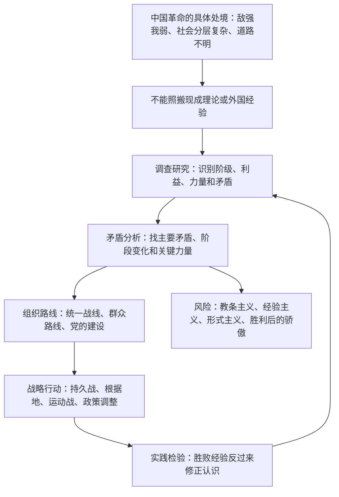

## 《毛泽东选集》读书笔记: 把抽象理论压进具体问题  
  
### 作者  
digoal  
  
### 日期  
2026-05-19  
  
### 标签  
读书笔记 , 毛泽东选集 
  
----  
  
## 背景  
  

> 一句话结论：《毛泽东选集》最值得读的不是口号，而是一套反复出现的方法：从实际矛盾出发，判断主要力量，组织可动员的人，选择阶段性策略，再用实践校正判断。    
> 适合谁读：想理解中国革命叙事、组织动员、战略判断、问题分析方法的人。    
> 我的评价：思想密度很高，但必须带着历史语境、版本意识和反思意识读；把它当万能管理学或简单政治崇拜，都会读偏。  

## 1. 书籍档案与资料来源

### 版本说明

本文以豆瓣“[毛泽东选集（1991版 普及本）](https://book.douban.com/series/75026)”四册丛书为基准。该页列出出版社为人民出版社、册数为 4，并说明 1991 年第二版于 1991 年 7 月 1 日正式出版发行，四册 ISBN 分别为第一卷 9787010009186、第二卷 9787010009193、第三卷 9787010009209、第四卷 9787010009216。

豆瓣各册页面也可交叉核对：第一卷页面列明作者毛泽东、人民出版社、1991-6-2、ISBN 9787010009186、页数 340；第二卷页面列明人民出版社、1991-12-01、ISBN 9787010009193；第三卷页面列明人民出版社、1991-6、ISBN 9787010009209；第四卷页面列明人民出版社、1991-6-1、ISBN 9787010009216。需要注意，豆瓣上同名“人民出版社1991版”存在不同条目和不同印次，个别 ISBN 与价格信息不完全一致；本文采用丛书页和四册普及本页面互证后的口径。

CNKI《中国改革开放新时期年鉴》条目《[〈毛泽东选集〉第一至四卷第二版出版发行](https://cnki.istiz.org.cn/kcms/detail/detail.aspx?dbcode=CYFD&dbname=CYFD&filename=N2015110019002007)》记录：根据中共中央决定，中共中央文献编辑委员会修订的第一至四卷第二版由人民出版社出版，从 1991 年 7 月 1 日起在全国新华书店发行；第二版保持第一版原有篇目，只增加《反对本本主义》一篇，并校订少量史实、错别字，修订题解和注释。

### 本文使用的主要资料

| 类型 | 来源 | 用途 |
|---|---|---|
| 豆瓣书目 | [1991版普及本丛书页](https://book.douban.com/series/75026)、[第一卷](https://book.douban.com/subject/2008436/)、[第二卷](https://book.douban.com/subject/1649039/)、[第三卷](https://book.douban.com/subject/1535512/)、[第四卷](https://book.douban.com/subject/1085872/) | 核对版本、出版社、ISBN、册数 |
| 出版史资料 | [CNKI 年鉴条目](https://cnki.istiz.org.cn/kcms/detail/detail.aspx?dbcode=CYFD&dbname=CYFD&filename=N2015110019002007) | 核对 1991 年第二版修订与发行 |
| 文本参考 | Marxists Internet Archive 英文版 [On Contradiction](https://www.marxists.org/reference/archive/mao/selected-works/volume-1/mswv1_17.htm)、[Selected Works Vol. II](https://www.marxists.org/reference/archive/mao/selected-works/volume-2/) | 辅助确认篇目结构与论证主题 |
| 研究与官方解读 | 共产党员网《[马克思主义中国化与中国实际马克思主义化](https://news.12371.cn/2013/12/19/ARTI1387444360221187.shtml)》、中国共产党新闻网《[毛泽东思想的时代价值及其现实意义](https://cpc.people.com.cn/n1/2024/0117/c443712-40160599.html)》等 | 理解“结合”“实事求是、群众路线、独立自主”等解释框架 |

资料限制：我没有调用完整纸书逐页校勘，书中例子主要依据公开书目、公开文本、通行篇目和可核验资料综合；涉及具体页码时不做逐页考据式断言。

## 2. 时代背景：这本书在回应什么问题

《毛泽东选集》前四卷主要覆盖 1925 年至 1949 年的新民主主义革命时期。豆瓣第一卷简介明确说，四卷本按中国共产党成立后所经历的历史时期和著作年月次序编辑：第一卷包括第一次国内革命战争时期和第二次国内革命战争时期著作，第二、三卷包括抗日战争时期著作，第四卷包括第三次国内革命战争时期著作。

它回应的核心问题不是“怎样写理论文章”，而是更紧迫的历史问题：

1. 在半殖民地半封建社会中，谁是革命对象，谁是朋友，谁是可争取对象？
2. 在力量弱小、敌强我弱、区域割据、战争长期化的局面中，怎样活下来并扩大力量？
3. 在统一战线、党内路线分歧、军事斗争、群众动员、文化宣传之间，怎样形成一套可执行的组织战略？
4. 在革命即将胜利时，怎样从战争组织转向政权组织，并预警胜利后的腐化、骄傲与脱离群众？

共产党员网一篇来自中共中央文献研究室来源的文章认为，毛泽东的重要历史贡献在于把马克思主义基本原理同中国革命具体实际结合起来，并指出教条主义和经验主义是这种结合的障碍。我的判断是，这正是《毛选》最核心的阅读入口：它不是抽象体系先行，而是问题压力先行。

## 3. 作者想表达什么

### 主命题

世界不是由现成公式解释的，而是由具体矛盾推动的；中国革命不能照搬外国模板，必须从中国社会结构、战争形态、群众状况和国际环境出发，找到自己的道路。

### 次级命题

| 层面 | 具体主张 |
|---|---|
| 认识论 | 没有调查，就没有发言权；认识来自实践，又要回到实践中检验。 |
| 方法论 | 分析问题要抓矛盾，抓主要矛盾和矛盾主要方面，避免片面、静止、孤立地看问题。 |
| 政治战略 | 分清敌友，建立统一战线，既联合又斗争。 |
| 军事战略 | 敌强我弱时，不能迷信速胜，也不能接受失败主义；持久战、运动战、游击战要服务于总体政治目标。 |
| 组织路线 | 依靠群众、组织群众、教育群众，也要从群众经验中集中正确意见。 |
| 文风与作风 | 反对党八股、反对空话、反对本本主义，强调问题、分析和解决。 |

### 隐含价值

《毛选》背后的价值排序很清楚：实践高于教条，组织高于散漫，群众动员高于少数精英密谋，战略耐心高于情绪化速胜，政治目标高于单纯军事胜负。

## 4. 作者如何证明：数据、案例、故事与概念

《毛选》的证据并不主要是现代社会科学意义上的统计数据，而是四类材料：

| 证据类型 | 代表篇目 | 作用 |
|---|---|---|
| 社会分类 | 《中国社会各阶级的分析》《湖南农民运动考察报告》 | 通过阶级、利益和行动能力划分政治力量。 |
| 战争经验 | 《中国革命战争的战略问题》《论持久战》 | 把敌我力量、空间、时间、士气、国际环境放进同一战略判断。 |
| 哲学概念 | 《实践论》《矛盾论》 | 为“调查、分析、实践检验”提供认识论和辩证法框架。 |
| 组织与文风批评 | 《改造我们的学习》《整顿党的作风》《反对党八股》 | 把思想方法落实到组织纪律、学习制度和表达方式。 |

它的强证据是：大量来自革命战争与组织实践的经验总结，能解释当时具体行动选择。它的弱点是：很多结论绑定于特定历史条件，不能不加转换地迁移到和平时期、市场经济、现代法治、个人职业选择或企业管理中。

## 5. 书中的三个浓缩例子

### 例子一：《反对本本主义》：先调查，再发言

- 书中发生了什么：这篇文章针对把上级文件、经典文本和抽象原则当成现成答案的倾向。1991 年第二版将其增入前四卷，CNKI 年鉴条目也记录了这一修订。豆瓣第一卷摘录页保留了“没有调查，没有发言权”这一核心句。
- 作者借它证明什么：正确策略不是坐在房间里想出来的，而是在调查对象的历史和现状之后形成的。
- 关键机制：把“发言权”绑定到“调查责任”，本质上是在组织内部建立认知纪律。
- 我的迁移理解：做产品、投资、战略、数据库故障定位，都不能拿抽象框架替代现场事实。框架的作用是指导提问，不是替代调查。

### 例子二：《论持久战》：在两种错误之间找到第三种判断

- 书中发生了什么：抗战初期，一边有亡国论，一边有速胜论。《论持久战》把日本和中国的强弱、大小、进步与退步、多助与寡助放在一起分析，提出战争将经历阶段性变化。Marxists 英文版第二卷目录也将《On Protracted War》列为核心篇目，并分出“为什么是持久战”“持久战的三个阶段”等结构。
- 作者借它证明什么：战略判断不能只看静态强弱，还要看矛盾双方在时间中的变化。
- 关键机制：弱者不是靠愿望取胜，而是靠空间、时间、群众动员、国际环境和敌我内部变化把局部劣势转化为长期优势。
- 我的迁移理解：遇到强对手时，最危险的不是承认弱，而是把弱理解成永恒状态；第二危险是把愿望当作速胜逻辑。

### 例子三：《反对党八股》：形式主义会遮蔽真实问题

- 书中发生了什么：第三卷豆瓣页面摘录了对“开中药铺”式文章的批评：看似条理很多，实则只是概念排列，没有提出、分析和解决问题。
- 作者借它证明什么：表达问题不是修辞问题，而是思想方法问题。没有抓住矛盾，文章越整齐，越可能掩盖空洞。
- 关键机制：形式主义让组织成员满足于标签、编号和套话，绕开真实矛盾。
- 我的迁移理解：现代组织里的 PPT、周报、OKR、复盘，也会出现“看起来很完整，实际上没有判断”的问题。判断质量比格式完整更重要。

## 6. 论证逻辑图



再压缩成一句话：

```text
现实问题 -> 调查 -> 矛盾分类 -> 主要矛盾 -> 阶段策略 -> 组织动员 -> 实践反馈 -> 再调查
```

## 7. 作者真正的思想

我的判断是，《毛选》真正要改变读者的，不是让读者记住某些结论，而是改变三个习惯：

1. 从“套公式”改成“看实际”：任何判断都要回到对象的历史、现状和内部结构。
2. 从“看表面”改成“看矛盾”：现象很多，但不是每个现象都同等重要；要找支配局势的矛盾。
3. 从“凭个人聪明”改成“组织化实践”：认识不是一个人的灵感，而是调查、集中、动员、执行、反馈的循环。

这也是为什么《毛选》常被读者觉得“方法论很强”：它把理论、调查、组织、表达和行动焊在一起。

## 8. 读完学到了什么

第一，战略不是预测未来，而是识别哪些条件会随行动改变。《论持久战》的强处不在“预言”，而在把时间变成战略变量。

第二，分类是行动的前提。《中国社会各阶级的分析》开篇式的问题意识，其实就是：谁支持，谁反对，谁可以争取，谁会摇摆。今天做产品定位、行业分析、社区运营，也要先做利益相关者分类。

第三，表达质量暴露思想质量。《反对党八股》批评的是空话、套话和概念堆砌。现代写作同样如此：如果一篇报告没有问题、没有矛盾、没有判断、没有行动建议，格式再完整也没价值。

第四，“实事求是”不是温和口号，而是一种很硬的认知约束：你不能因为立场正确，就免于事实检验。

## 9. 如何举一反三

| 书中思想 | 可迁移场景 | 使用方法 | 风险 |
|---|---|---|---|
| 没有调查，没有发言权 | 产品需求、客户访谈、故障诊断 | 先收集一手材料，再下判断 | 调查变成拖延决策的借口 |
| 主要矛盾 | 公司战略、项目治理、投资分析 | 从多个问题中找当前最制约结果的一个 | 把复杂系统过度简化 |
| 持久战 | 创业竞争、技术路线、长期学习 | 接受阶段性弱势，设计长期积累机制 | 用长期主义掩盖短期执行失败 |
| 统一战线 | 生态合作、组织变革、公共议题 | 区分核心盟友、可争取者、反对者 | 把合作对象工具化 |
| 反对党八股 | 写作、汇报、研究报告 | 每段都回答“问题是什么、证据是什么、判断是什么” | 过度追求锋利，忽略必要铺垫 |

一个实用检查清单：

```text
1. 我现在讨论的是事实、解释，还是立场？
2. 我有没有一手调查？没有的话，结论要降级。
3. 当前主要矛盾是什么？为什么不是别的？
4. 谁会支持、反对、观望？他们的利益结构是什么？
5. 如果判断错了，最早能从哪个信号发现？
```

## 10. 我的反思与讨论问题

我赞同的是：《毛选》对教条主义、主观主义、形式主义的批判仍有现实价值。它不断提醒人：不要用概念替代事实，不要用愿望替代战略，不要用格式替代问题。

我保留的是：革命战争语境中的“敌我”“斗争”“动员”逻辑，不能直接当作现代社会的通用方法。现代组织和公共生活还需要法治、程序、个体权利、专业分工和开放讨论。只学斗争性，不学调查、边界和纠错，会很危险。

我认为最值得讨论的三个问题：

1. 《毛选》的方法论价值，如何与现代科学方法、现代管理和法治框架结合？
2. “群众路线”如何避免变成对群众意愿的单向解释，而保留真实反馈？
3. “主要矛盾”分析如何防止被权力或偏见垄断解释权？

参考:  
https://www.marxists.org/chinese/maozedong/index.htm
   
   
  
#### [PostgreSQL 解决方案集合](../201706/20170601_02.md "40cff096e9ed7122c512b35d8561d9c8")
  
  
#### [德哥 / digoal's Github - 公益是一辈子的事.](https://github.com/digoal/blog/blob/master/README.md "22709685feb7cab07d30f30387f0a9ae")
  
  
#### [About 德哥](https://github.com/digoal/blog/blob/master/me/readme.md "a37735981e7704886ffd590565582dd0")
  
  

  
