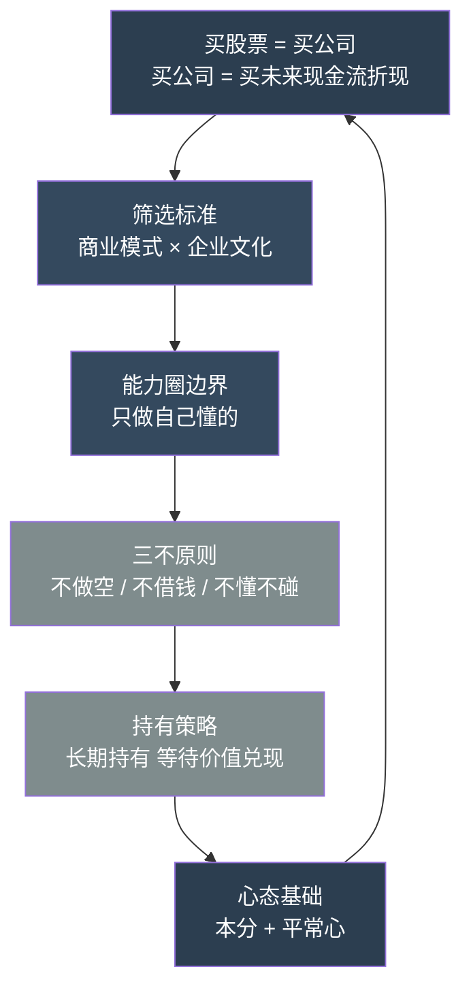

## 《大道》读书笔记: 段永平投资问答录  
  
### 作者  
digoal  
  
### 日期  
2026-05-20  
  
### 标签  
读书笔记 , 大道 
  
----  
  
## 背景  
  
---
书名: 《大道：段永平投资问答录》  
作者: 赵理亚（选）/ 芒格书院（编）  
出版年份: 2025年5月  
笔记日期: 2026-05-21  
出版社: 中信出版集团  
ISBN: 9787521774665  
标签: [价值投资, 商业哲学, 本分, 长期主义, 企业文化]  
---

  

> **一句话**：投资不是寻找下一个涨停板，而是找到一家值得陪伴二十年的好公司。  
> **适合谁读**：普通投资者、创业者、对商业本质感兴趣的人、正在被市场噪音淹没的任何人  
> **阅读难度**：⭐⭐☆☆☆（语言朴素，问答体，轻松好读）  
> **推荐指数**：⭐⭐⭐⭐⭐  

---

## 一、时代坐标：这本书从哪里来？

2006年，一个名叫"大道无形我有型"的账号出现在网易博客上。发帖者就是段永平——彼时他刚刚以62万美元拍下与巴菲特共进午餐的机会，正在把这顿饭学到的东西一点一点消化。

此后近二十年，他在网易博客、雪球等平台与无数网友对话：聊股票、聊企业、聊人生，从不收费，也从不推荐标的，只是把自己看问题的方式，一则一则地晒在阳光下。

这30万字的问答，最终被整理成你现在看到的这本书。

时代背景值得一说。2006年前后，中国股市正在经历一轮史诗级的大牛市；A股散户化程度极高，"打听消息、跟风操作、快进快出"是主流文化。与此同时，互联网正在让信息民主化，越来越多的普通人开始自己炒股，但"炒"这个字本身就说明了问题。

段永平的出现，是一种文化对冲。他用最口语化的方式，向茫茫多的散户和创业者传递一件反直觉的事：**投资不是智商竞赛，也不是信息战，更不是赌博，它是一件极其朴素的事——找到好公司，买入，等着。**

这本书出版于2025年5月，正值伯克希尔年度股东会前夕，5个月内加印6次、销量突破20万册。在一个充斥着"AI选股""量化对冲""每日涨停"噪音的时代，它的火爆本身就是一种市场投票——人们骨子里渴望的，还是那种简单但有效的确定性。

---

## 二、核心命题：作者在说什么？

### 观点一：买股票就是买公司，买公司就是买未来现金流折现

这是段永平整个思想体系的起点，也是他从巴菲特那里确认并内化的核心命题。

听起来是废话，但它有极强的过滤功能。

大多数人买股票，关注的是价格会不会涨。而段永平关注的是：这家公司未来若干年，能持续产生多少真实的净现金流？把这些钱折算到今天，是否比我付出的价格划算？

"未来"在这里不是指三五年，而是公司整个经营生命周期。这一帧移换，直接把90%的投机行为排除在外——因为投机者从来不关心一家企业能不能活过下一个十年。

段永平投资网易是个典型案例：2001年，网易因财务风波股价暴跌至每股0.8美元。市场极度恐慌，但他注意到一件事——网易账面上的现金比总市值还高，而游戏业务初露端倪。他懂游戏，他懂团队，他判断商业模式没有问题，于是满仓买入。6个月涨了20倍。

但他事后的反思同样发人深省：如果真的完全看懂，当时就应该把整个网易买下来——卖早了，是因为"懂"得还不够深。

### 观点二：商业模式第一，企业文化第二——两者缺一不可

这是段永平筛选企业的双重标准，他称之为"灵魂框架"。

**商业模式**：这家公司的护城河是什么？产品有没有差异化？用户的切换成本高不高？能不能持续产生自由现金流而不需要大量资本再投入？

**企业文化**：管理层是否诚信？公司的价值观能不能落实到日常行为？员工见到领导是否战战兢兢——如果是，这家公司迟早出问题。

他有一句让我印象很深的话：好的企业文化，是制度管不到的地方的守护者。你可以用制度约束员工不做某些事，但制度是有漏洞的——只有文化能填补那些空白。

两者的关系是：商业模式不成立，直接放弃；商业模式成立，但企业文化有问题，同样放弃——因为烂掉的文化最终会摧毁再好的护城河。

苹果是他持仓最久、最具代表性的标的之一。他看中的不只是iPhone的硬件优势，更是App Store生态带来的"用户越多、价值越高、迁移成本越大"的飞轮效应，以及苹果极致用户导向的企业文化。这个判断从2011年延续至今，持仓价值增长超过10倍。

### 观点三：投资的核心是"不为清单"——Stop Doing List

这是段永平思想中最反常识、也最有力量的部分。

他的三条铁律：**不做空、不借钱、不做不懂的东西**。

这三条规则，每一条都是用无数人的血泪验证的：

- 做空有理论上的无限损失，且长期方向与经济增长相悖；
- 借钱意味着你把自己的容错空间清零，一次黑天鹅就能终局；
- 不懂的东西，涨了是侥幸，跌了是必然。

但最珍贵的洞见，是他对"不懂"的坦然：他说自己能真正看懂的公司，也就苹果、腾讯、茅台这几家。绝大部分公司，他一样看不懂。区别只是——他看不懂，就不碰。

这句话需要极大的自我认知和克制。大多数投资者恰恰相反：越不懂，越想赌一把。

---

## 三、论证地图：逻辑结构



整个体系是自洽闭环的：用正确的认知框架找到正确的公司，用纪律性原则约束自己不犯大错，用"本分"的心态长期持有，等待企业价值兑现。利润，不过是水到渠成的结果。

段永平的论证方式以案例为主，辅以常识推导。他极少引用学术研究，也不爱数学公式，更喜欢用生活类比：

- 投机像狩猎，投资像种田——种田的人赢在心态，因为他们知道自己在做什么。
- 一家公司像一辆车，商业模式是发动机，企业文化是驾驶员——好发动机配了烂驾驶员，一样翻车。

这种讲法的优势是直白、有穿透力；局限也在这里——缺乏可量化验证的方法论，更像是"大智若愚"式的经验总结，对于没有企业经营背景的读者，理解门槛其实比看起来高。

---

## 四、前提假设与边界：什么情况下这不成立？

段永平的体系建立在几个前提假设上，这些假设在大多数时候成立，但并非放之四海而皆准。

**假设一：优质企业长期向上，时间是投资者的朋友。**

这在成熟市场（美股、港股龙头）基本成立，但在某些发展中市场或特定行业，优秀企业可能被政策、结构性因素或竞争破坏——时间有时候是敌人。

**假设二：普通投资者能够识别"好商业模式"和"好企业文化"。**

段永平能看懂苹果，是因为他自己做了多年消费电子；能看懂网易，是因为他做过游戏。这种判断力来自深厚的行业积累，并不是读几本书就能获得的。对于普通投资者，"不懂不碰"原则反而可能意味着——大部分股票都不该碰。

**假设三：企业的内在价值终将被市场发现。**

从长期来看，这个假设大概率成立。但"长期"可能是5年、10年，甚至更长。在这个过程中，你是否有足够的心理资本和财务余裕坚持下去，是一个被严重低估的门槛。

所以这本书的真正适用边界是：**有稳定现金流、不依赖投资收益维持生计、能在账面浮亏时保持理性的投资者**。它不是一本快速致富指南，也不适合用闲不住的钱去实践。

---

## 五、思想谱系：这本书站在谁的肩膀上？

```
巴菲特（买公司而非股票）
    ↓
芒格（商业模式 + 心理学 + 多元思维模型）
    ↓
段永平（本土化实践：本分 + 平常心 + 能力圈）
    ↓
黄峥（拼多多）/ OPPO / vivo / 小天才……
```

段永平不讳言自己是巴菲特的忠实学徒。但他做了一件很重要的事：他不是简单复制，而是把价值投资的内核，嫁接到了中国企业家文化的土壤里。

"本分"这个词是典型的中文语境产物——它比"integrity"（诚信）更厚重，比"discipline"（纪律）更温和，是一种融合了儒家伦理与朴素商业逻辑的价值观。在西方价值投资话语体系里，找不到完全对应的词。

这也是这本书区别于《穷查理宝典》《巴菲特致股东的信》的地方：它是在地的，有具体的中国市场案例（茅台、腾讯、拼多多），有中文语境下的道德讨论，有段永平作为企业经营者的第一视角。

他对后一代中国创业者的影响是实质性的。黄峥在创立拼多多之前曾向段永平请教，他把"Costco的实惠+迪士尼的愉悦"作为拼多多的商业模式定位，这个思路框架明显带有段式痕迹。

---

## 六、我学到了什么？

读完这本书，让我最深的触动不是某个具体的投资方法，而是一种思维方式的底层重置。

**第一个收获：错误比正确更值得管理。**

段永平的体系里，最重要的不是"找到好公司"，而是"别买烂公司"。他花在"不为清单"上的篇幅，远超选股方法论。这让我意识到，投资（甚至是人生决策）中，防御比进攻更重要——一次毁灭性的错误，可以把你多年的正确努力全部归零。

**第二个收获："懂"是最高的护城河。**

段永平说，他只在真正懂的领域出手。这种自我约束的代价是机会减少，但收益是错误率极低。这个道理在投资之外同样成立：你真正擅长的事情，比你勉强涉足的事情，往往给你带来10倍以上的回报。专注不是局限，而是杠杆。

**第三个收获："平常心"是认知能力，不是性格特质。**

我原本以为"平常心"是一种天生的性格，有人有，有人没有。读完这本书才理解——段永平的"平常心"，建立在对商业本质的深度理解之上。他不恐慌，是因为他知道公司的价值没有变；他不贪婪，是因为他知道价格偏离终将回归。没有认知支撑的"平常心"，只是麻木；有认知支撑的，才是真正的从容。

---

## 七、举一反三：这个框架还能用在哪？

段永平的投资框架，本质上是一套**以本质认知替代市场噪音**的决策体系。它可以迁移到很多场景：

**职业选择：** 选行业就像选公司——这个行业的"商业模式"（结构性增长潜力）好不好？这家公司的"企业文化"（价值观、晋升机制）健康吗？如果两者都差，不要因为薪水高就接受。

**个人能力建设：** 只在自己真正能做好的事情上深耕，其余的交给别人做（外包或合作），而不是因为别人赚钱就跟风进入不懂的领域——这正是"不懂不碰"原则在个人成长上的应用。

**合伙人选择：** 段永平说选人要"本分诚信比聪明重要，合适性比合格性重要"。在选合作伙伴、联合创始人时，这个标准比简历上的背景更可靠。

---

## 八、批判与反思

这本书有两处值得审视的地方。

**一、幸存者偏差。** 段永平的成功有其独特的前提条件：出身于消费电子产业、在中国市场野蛮生长最快的年代参与其中、有足够的财力进行集中下注。他的案例令人激动，但复制难度极高。普通读者能学到的是思维框架，而非具体操作——这点书中并未充分说明。

**二、方法论缺乏细化。** "商业模式"和"企业文化"作为筛选标准，依赖大量隐性经验，缺少可操作的评估流程。什么叫"看懂"商业模式？怎么判断企业文化的健康程度？书中给出的例子多，系统性工具少。对于没有经营背景的读者，这本书更像是一本指引方向的地图，而非可操作的导航仪。

但这或许正是段永平的刻意为之——他一再强调，真正的懂，需要时间和积累，不是看几页书就能获得的。这本书的价值，在于让你知道方向，而不是帮你走捷径。

---

## 九、金句与记忆点

1. **"投资不需要勇气。当你需要勇气的时候，你就已经危险了。"**
   ——真正看懂了的投资，是笃定，不是赌博。

2. **"投机像狩猎，投资像种田。"**
   ——猎人靠眼快手准，农民靠耐心和时间。长期来看，农民胜。

3. **"好的商业模式让你躺着赚钱，好的企业文化让你睡得着觉。"**
   ——段永平式的双重筛选标准，一个判断回报，一个判断风险。

4. **"利润不过是水到渠成的结果。"**
   ——做对的事，把事情做对，利润自然来。把利润当目标的公司，往往是最危险的。

5. **"不懂不碰，是我所有投资纪律中最重要的一条。"**
   ——能力圈的边界，是投资者最真实的护城河。

6. **"本分，就是做对的事情，把事情做对。"**
   ——听起来像废话，但真正做到，足以区分90%的人。

7. **"你的股票不知道你是谁，但你的决策知道你是谁。"**
   ——市场不会因为你焦虑就涨，但你的决策会因为焦虑而错。

---

## 十、延伸阅读

1. **《穷查理宝典》（Poor Charlie's Almanack）** / 查理·芒格
   段永平思想直接来源之一。芒格的多元思维模型与段永平的"本分"哲学高度互补，读完此书再看《大道》，会有双重共鸣。

2. **《巴菲特致股东的信》** / 沃伦·巴菲特
   段永平以巴菲特为师，这本书是理解其源头的必读文本。关于商业模式、护城河、管理层诚信的论述，与《大道》形成完美互照。

3. **《文明、现代化、价值投资与中国》** / 李录
   同为芒格书院出品，李录从宏观文明视角论证为何中国是价值投资的沃土，是《大道》的理论背景读本。

4. **《滚雪球：巴菲特和他的财富人生》** / 艾丽斯·施罗德
   若想了解巴菲特思想如何形成，这是最详尽的叙述。段永平在午餐上问巴菲特"投资中不可以做什么"，这个问题的脉络在这本书里有更完整的呈现。

5. **《从0到1》** / 彼得·蒂尔
   从商业模式角度，段永平强调护城河和差异化；蒂尔强调垄断和不竞争。两人思路异曲同工，一中一西，一守成一开拓，对照读来有趣。

---

*笔记写于 2026-05-21 | 基于公开资料与深度思考整理，不构成投资建议*
  
  
#### [PostgreSQL 解决方案集合](../201706/20170601_02.md "40cff096e9ed7122c512b35d8561d9c8")
  
  
#### [德哥 / digoal's Github - 公益是一辈子的事.](https://github.com/digoal/blog/blob/master/README.md "22709685feb7cab07d30f30387f0a9ae")
  
  
#### [About 德哥](https://github.com/digoal/blog/blob/master/me/readme.md "a37735981e7704886ffd590565582dd0")
  
  

  
