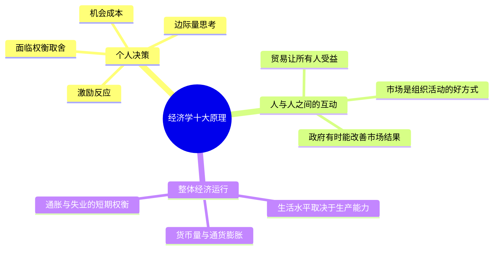

## 《经济学原理·微观经济学分册》读书笔记  
  
### 作者  
digoal  
  
### 日期  
2026-05-20  
  
### 标签  
读书笔记 , 经济学原理·微观经济学分册 
  
----  
  
## 背景  
  
---
书名: 《经济学原理·微观经济学分册》  
作者: N. 格里高利·曼昆（N. Gregory Mankiw）  
译者: 梁小民 / 梁砾  
出版年份: 2009（第5版中文版）  
笔记日期: 2026-05-21  
豆瓣链接: https://book.douban.com/subject/3723212/  
豆瓣评分: 9.3（第5版）  
标签: [经济学入门, 微观经济学, 教科书, 思维方式, 市场理论]  
---

  

> **一句话**：这不只是一本教科书，而是一套用来重新观看世界的眼镜。  
> **适合谁读**：对世界运转方式感到好奇的任何人；经济学零基础的学生；想建立独立思考框架的普通读者  
> **阅读难度**：⭐⭐☆☆☆（无需数学基础，只需耐心）  
> **推荐指数**：⭐⭐⭐⭐⭐  
  
---

## 一、时代坐标：这本书从哪里来？

1997年，哈佛大学经济学教授曼昆接到了一个命令：为大一新生设计一门经济学入门课。他翻遍市面上的教材，发现一个共同问题——那些书要么枯燥得像法律条文，要么数学密度高得让普通人望而却步。从萨缪尔森到斯蒂格利茨，经济学教科书的主流范式始终是"模型优先"，思想被掩盖在方程和图形之下。

曼昆决定反其道而行之。他把写作原则定为：**读者的时间是稀缺资源**，因此简明和有趣比全面更重要。1998年，第一版《经济学原理》出版，随即成为美国史上最畅销的经济学教材，第一年销售额就突破百万册。

此后，这本书随中国加入WTO、国内高校经济学教育大扩张的浪潮，由梁小民翻译引入中国，中文版累计销量突破500万册，豆瓣评分长期稳定在9分以上。可以说，过去二十多年里，**中国整整一代经济学人的思维底色，就是被这本书刷上去的**。

```
时间轴：这本书的诞生与传播

1998 ──────────────── 1999 ──────── 2001 ──────────────── 2009 ──── 今天
 │                       │              │                      │
第一版出版              梁小民中文       WTO后高校经济            第5版      全球9版
美国首年百万册          译本上市         学扩张浪潮              中文版     500万+中文册
```

曼昆写这本书的问题意识很朴素：**经济学应当是每个公民的基本素养，而不是经济学家的行话圈子**。这个起点，决定了这本书所有的取舍。

---

## 二、核心命题：作者在说什么？

微观经济学分册的核心，可以归结为三个层次递进的命题：

### 命题一：人是理性的，但理性是有边界的

曼昆提出的"经济学十大原理"中，第一条就是"人们面临权衡取舍"。这背后隐藏着一个深刻的前提假设——**"理性人"**（rational person）。理性人会系统全面地思考自己的选项，并追求自身利益的最大化。

这个假设是全书的地基。供需曲线、消费者剩余、生产决策……所有模型都建立在这个地基之上。但曼昆并非无知地假装人类完美，他花了大量篇幅讨论"边际思维"：人们做决策时，比较的不是"做与不做"的总代价，而是**再多一点点**带来的收益与成本之差。这是一个颇为微妙的洞见——真实的决策从来不是全有全无，而是每次在边界上的一小步。

### 命题二：市场有"无形之手"，但这只手并不总是灵巧的

曼昆深受亚当·斯密传统的影响。他的核心信念是：价格机制能够在无需中央指挥的情况下，协调数百万人的分散决策，把有限资源引导到最有价值的用途上——这就是斯密所说的"看不见的手"。

整本微观分册的叙事弧线，就是从这只"手"的精妙，到这只"手"的失灵：

- 外部性（污染、疫苗接种）：个人决策忽略了对他人的影响
- 公共品（国防、路灯）：市场无法解决搭便车问题
- 信息不对称（二手车市场）：买卖双方掌握的信息不同

**这本书难得的地方在于，它既赞美市场，又坦承市场会失灵**，而不是把市场神圣化或妖魔化。

### 命题三：效率与公平是一对永恒的张力

全书的第十大原理是："社会面临效率与平等之间的权衡取舍"。曼昆用了一个绝妙的比喻：重新分配收入就像用一个漏桶从富人那里打水再送给穷人——过程中总会有水漏掉（激励扭曲），所以我们必须决定，漏多少是可以接受的。

这个问题没有"正确答案"。曼昆没有替读者做决定，而是把问题诚实地摆在桌上：**这是价值判断，不是经济学能独自回答的问题**。这种克制，在同类教材中实属难得。

---

## 三、论证地图：作者怎么说服你的？



曼昆的论证风格有三个显著特征：

**① 案例先于模型。** 每个概念出现之前，先有一个贴近生活的故事。讲供需，他从披萨店和消费者的日常决策切入；讲外部性，他从吸烟和噪音出发。这让概念有了温度，而不只是抽象符号。

**② 图形替代公式。** 整本书几乎没有复杂的数学推导，最重要的工具是供需图和成本曲线图。这是一把双刃剑：极大降低了入门门槛，但也牺牲了严密性。

**③ 政策始终在场。** 每隔几章，就有一个"应用"案例研究，把经济学原理拉回到真实政策辩论中：最低工资是否制造失业？房租管制为什么会导致住房短缺？关税谁受益谁受损？这让读者始终感受到经济学是"活的"工具。

---

## 四、前提假设与边界：什么情况下这不成立？

这是读这本书最值得警惕的部分。

### 假设一："理性人"在现实中极为罕见

曼昆的所有模型都建立在理性人假设之上。但行为经济学（卡尼曼、塞勒等）的大量研究已经表明，人类系统性地偏离理性：我们过度自信，我们厌恶损失多于喜爱收益，我们被"框架效应"左右，我们在跨期决策中极度短视。如果理性人不存在，供需曲线的预测力就会打折扣。

曼昆在第5版及后续版本中虽然增加了行为经济学的内容，但总体上仍是修补性的，而非颠覆性的。

### 假设二：市场的"均衡"是静态的

供需分析告诉我们市场会趋向均衡价格。但真实的市场是动态的、路径依赖的，有赢者通吃效应（平台经济），有网络外部性（微信、iOS），这些情况下"均衡"的含义大不相同，甚至可能有多个均衡并存。曼昆对这类数字经济时代的新现象着墨有限。

### 假设三：政策分析忽视了制度背景

曼昆的论证往往假设政策能被有效执行，信息是透明的，官员是中性的。但在现实中（尤其是发展中国家），政策执行成本、寻租行为、制度路径依赖，都会让经济学教科书里的"应然"与现实的"实然"之间产生巨大裂缝。

---

## 五、思想谱系：这本书在哪个传统里？

曼昆是"新凯恩斯主义"的代表人物。这个学派的特点是：**用微观基础为凯恩斯宏观理论辩护**，承认市场有时会失灵，因此政府的适度干预是必要的——但同时保留了古典经济学对市场效率的基本信念。

```
经济学思想谱系（简化版）

亚当·斯密（看不见的手）
       │
 古典/新古典经济学
  （市场自发有序）
       │         │
  凯恩斯主义   芝加哥学派
  （政府干预）  （自由市场）
       │
  新凯恩斯主义 ← 曼昆的位置
  （微观基础 + 温和干预）
```

在经济学教科书的演化史上，曼昆承接了萨缪尔森《经济学》（1948）的传统，但大幅降低了数学门槛，更强调直觉和应用。批评者（如北大国发院的陈平教授）认为，以曼昆为代表的新古典综合体系，在2008年金融危机后已经显示出根本性的局限——它对金融不稳定、制度多样性、以及路径依赖缺乏系统性解释。

尽管如此，作为经济学思维的入门向导，这本书在同类中依然无可替代。

---

## 六、我学到了什么？

读完这本书最大的收获，不是"知道了什么"，而是**学会了一种提问方式**。

**收获一：机会成本是最容易被忽略的成本。** 每次做决定，我们不只是在花钱，更是在放弃时间和其他可能性。上班时间、周末、注意力——这些都是有机会成本的稀缺资源。一旦你开始这样思考，很多"免费"的事情就不再免费了。

**收获二：激励是最强大的杠杆。** 曼昆反复强调"人们对激励做出反应"。这个道理看似简单，却极难在实践中贯彻。许多政策失败，都源于设计者忽视了被规制者会如何"应对激励"而改变行为。一个好的制度设计者，首先是一个激励的设计者。

**收获三：权衡取舍无处不在，但承认它需要勇气。** 曼昆坦诚效率与公平之间永远存在张力，这比那些假装两者可以同时完美实现的论述要诚实得多。学会接受"没有免费午餐"，是成熟思考的开始。

---

## 七、举一反三：这个框架还能用在哪？

微观经济学的核心工具——**供需分析、边际思维、激励设计、成本收益比较**——远不只是分析"市场"的工具。

**职场决策**：跳槽的机会成本是什么？不只是当前薪水，还包括在现有公司积累的人脉、经验和晋升期权。算清楚这笔账，才能做出更理性的决定。

**公共政策分析**：下次看到一项政策倡议（比如限制短视频时长），可以问：这个政策会改变什么激励？谁会从中受益？谁会承担成本？有没有没被计算在内的外部效应？

**生活中的价格信号**：某个行业突然大量招人，说明这个行业短缺；某个商品价格暴跌，说明供过于求或者需求萎缩。价格是信息，学会"读价格"，相当于多了一套实时的市场情报系统。

---

## 八、批判与反思

### 这本书有一个温和但确实存在的意识形态立场

2011年，哈佛学生曾集体罢课，抗议曼昆的课程在不知不觉中把市场自由主义变成了"中性的科学共识"。德国经济学家博芬格（Peter Bofinger）也批评这本书制造了一种错觉：让学生以为书里描述的经济原理代表了整个经济学界的共识，而实际上，很多命题（比如关于贫富差距与经济增长的关系）在学界仍有巨大争议。

诚然，曼昆笔下的世界是干净的、均衡的、模型化的。真实的世界是混乱的、路径依赖的，充满了不完全信息和制度摩擦。这本书给你一副很好的眼镜，但要记住：**任何一副眼镜都会遮蔽某些东西**。

### 时代已经变了

这本书写于互联网泡沫之前，数字平台经济、算法定价、数据垄断这些现象，在书中几乎缺席。当"市场价格"由算法而非竞争者博弈产生，当平台以零价格吸引用户但从数据中变现，传统的供需分析框架就需要大幅扩展才能适用。

---

## 九、金句与记忆点

**1. "人们面临权衡取舍。"**（第一大原理）
这句废话一样的陈述，背后是整个经济学世界观：资源永远稀缺，选择永远有代价，没有任何好事是真正免费的。

**2. "某种东西的成本是为了得到它所放弃的东西。"**
机会成本的定义。一旦内化，你看待时间、金钱和精力的方式就会永久改变。

**3. "理性人靠考虑边际量来思考。"**
不要问"要不要上大学"，要问"再多念一学期值不值"；不要问"要不要运动"，要问"今天再多走半小时值不值"。

**4. "市场通常是组织经济活动的好方式。"**（注意"通常"二字）
曼昆没有说"总是"或"永远是"，这两个字的克制，是这本书少有的精确之处。

**5. "当市场失灵时，政府有时可以改善结果。"**（注意"有时"二字）
市场失灵不自动意味着政府干预有效。政府也会失灵，问题是：哪种失灵更小？

**6. "贸易能使每个人的状况更好。"**
比较优势原理：即使你在所有事情上都比别人强，专注于你相对优势最大的事情，再通过交易获取其他所需，双方都能受益。这个逻辑反直觉，但数学上无懈可击。

**7. "生活水平取决于一国的生产能力。"**
工资不是靠谈判争取来的，而是由生产率决定的。想提高收入，最终还是要回到提升自身或所在组织的生产能力上。

---

## 十、延伸阅读

**① 《思考，快与慢》— 丹尼尔·卡尼曼**
曼昆的"理性人"假设的最佳挑战者。行为经济学的奠基之作，告诉你人类真实的决策方式远比模型复杂。读完曼昆，再读这本，会获得一种立体感。

**② 《魔鬼经济学》— 史蒂芬·列维特**
曼昆的"应用视角"的极致版本。用经济学分析相扑选手作弊、毒品经销商的薪酬结构，证明经济学工具可以应用到任何领域。适合作为趣味补充。

**③ 《经济学》— 保罗·萨缪尔森**
曼昆的前辈，史上销量第一的经济学教科书。数学难度高一些，但对总体经济体系的把握更完整。读完曼昆，有余力可以继续挑战萨缪尔森。

**④ 《贫穷的本质》— 阿比吉特·班纳吉、埃斯特·迪弗洛**
两位2019年诺贝尔经济学奖得主的作品。关注曼昆框架难以分析的场景：制度不健全、信息极度匮乏、穷困陷阱。是对主流微观经济学的重要补充和挑战。

**⑤ 《国富论》— 亚当·斯密**
曼昆所有思想的源头。不需要全读，但至少要读第一卷关于分工和看不见的手的部分。读完才能理解，曼昆其实是在把斯密用现代语言重新讲了一遍。

  
  
  
#### [PostgreSQL 解决方案集合](../201706/20170601_02.md "40cff096e9ed7122c512b35d8561d9c8")
  
  
#### [德哥 / digoal's Github - 公益是一辈子的事.](https://github.com/digoal/blog/blob/master/README.md "22709685feb7cab07d30f30387f0a9ae")
  
  
#### [About 德哥](https://github.com/digoal/blog/blob/master/me/readme.md "a37735981e7704886ffd590565582dd0")
  
  

  
