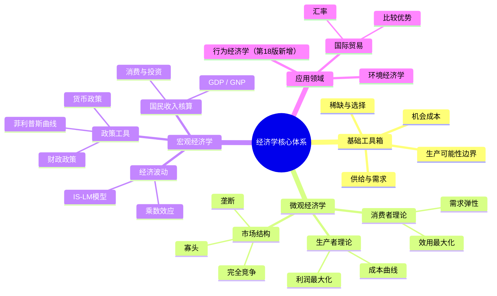

## 《经济学》读书笔记: 萨缪尔森留给世界的一把「认知钥匙」  
  
### 作者  
digoal  
  
### 日期  
2026-05-20  
  
### 标签  
读书笔记 , 经济学  
  
----  
  
## 背景  
  
---
书名: 《经济学（第18版）》  
作者: [美] 保罗·萨缪尔森 / [美] 威廉·诺德豪斯  
译者: 萧琛  
出版社: 人民邮电出版社  
出版年份: 2008（英文原版2005）  
笔记日期: 2026-05-21  
豆瓣链接: https://book.douban.com/subject/1297750/  
标签: [经济学, 微观经济学, 宏观经济学, 教科书, 混合经济, 凯恩斯主义]  
---
  
  
### ——萨缪尔森留给世界的一把「认知钥匙」

> **一句话**：用一本书重塑了全球几代人理解经济世界的方式。
> **适合谁读**：想系统入门经济学的学生；想补课的商界人士；对「政府与市场」关系困惑的普通人
> **阅读难度**：⭐⭐⭐☆☆（有数学但不恐怖，图表清晰）
> **推荐指数**：⭐⭐⭐⭐⭐

---

## 一、时代坐标：这本书从哪里来？

1948年，保罗·萨缪尔森在麻省理工学院的办公室里，接到了一个奇怪的任务：给工科本科生写一本经济学入门书。那一年，美国刚刚走出二战的硝烟，欧洲在马歇尔计划下艰难重建，苏联用计划经济的成绩让西方世界不安，凯恩斯刚去世两年，他那套「政府干预」的思想还在经济学界掀起轩然大波。

这是一个大问题悬而未决的年代：**资本主义市场经济，还能信任吗？**

1929年的大萧条在人们心中留下了创伤记忆。纯粹的自由放任曾经让世界经济崩溃。但完全的计划经济，又充满了苏联模式的威权气息。普通人和政策制定者都需要一套新语言，来理解眼前这个「既有市场又有政府」的混合世界。

萨缪尔森用三年时间写出了这本书。它的第一版问世后，迅速成为史上最畅销的经济学教科书，被翻译成40多种语言，影响了至少几十个国家的经济学教育整整半个世纪。到第18版（2005年），它已经走过57年，经历了滞胀、冷战终结、全球化、互联网泡沫……每一版都在悄悄进化，却始终保持着那个最初的野心：**让任何受过教育的人，都能读懂经济学这门学问。**

```
时间轴：《经济学》的进化轨迹

1948 ──── 第1版：为MIT工科生而写，第一次系统普及凯恩斯主义
  │
1961 ──── 第5版：正式提出「新古典综合」，微观+宏观框架定型
  │
1970 ──── 萨缪尔森获诺贝尔经济学奖（美国首位）
  │
1970s ─── 滞涨冲击新古典综合；书中开始引入货币主义反驳
  │
1985 ──── 诺德豪斯加入合著，引入更多环境经济学内容
  │
2005 ──── 第18版：新增行为经济学、网络经济学、国际外包
  │
2009 ──── 萨缪尔森逝世，享年94岁
```

---

## 二、核心命题：作者在说什么？

这本书不是一部论著，而是一张地图。但地图背后有三个灵魂命题。

### 命题一：稀缺是一切经济问题的根源

萨缪尔森从第一页就告诉你：经济学的起点，是一个残酷的事实——**资源是有限的，欲望是无限的。** 这个「稀缺性」制约，逼着任何社会都必须回答三个基本问题：

- **生产什么**（What）：蛋糕还是大炮？住宅还是高铁？
- **如何生产**（How）：劳动密集还是资本密集？
- **为谁生产**（For Whom）：分配给谁？穷人多一点还是富人多一点？

这三个问题，无论是计划经济还是市场经济，都无法回避。萨缪尔森用「生产可能性边界」这个图形，把这个道理讲得晶莹剔透——你不可能什么都要，必须做选择，必然付出机会成本。

这是整本书的地基：**经济学，本质上是研究「选择」的科学。**

### 命题二：混合经济是现代社会的真实形态

萨缪尔森最重要的政治经济判断，是他对「混合经济」的坚持。他拒绝了两个极端：纯粹的自由放任市场，和苏联式的全面计划经济。他认为，20世纪中叶以后，所有现代国家都活在一个「混合」状态里：

- **微观层面**：市场是主角，价格信号调配资源，竞争驱动效率
- **宏观层面**：政府不可或缺，用财政政策和货币政策熨平经济波动，提供公共品，纠正市场失灵

这个判断，在当时是激进的。它既让保守派觉得他太「左」（政府干预太多），又让左派觉得他太「右」（还在维护资本主义市场）。但这恰恰是他的贡献：**他描述了真实的世界，而不是意识形态的乌托邦。**

### 命题三：新古典综合——微观与宏观可以统一

在萨缪尔森之前，经济学是分裂的：有人研究价格和市场（微观），有人研究GDP和就业（宏观），两拨人几乎不说话。萨缪尔森提出了「新古典综合」：**只要政府通过宏观政策维持充分就业，那么微观层面的古典市场规律就依然有效。**

这个综合的意义在于，它第一次给经济学建立了一个统一的分析框架。「宏观经济学」这个词，在这本书问世之前甚至还不存在于经济学词典中。

---

## 三、论证地图：作者怎么说服你的？



萨缪尔森的论证策略，有几个鲜明特色：

**用图说话**：供求曲线、成本曲线、IS-LM图……这本书可能是经济学史上图表最密集的教材之一。他相信，一张画得好的图，胜过一千个方程。

**案例先行**：每个抽象概念出场之前，都有一个具体的现实场景。通货膨胀不是方程，而是你口袋里的钱变薄了。比较优势不是定理，而是为什么美国要从中国进口衬衫。

**历史感**：从1929年大萧条到石油危机，萨缪尔森不断用历史事件检验理论。这让这本书不只是教科书，更像一部经济思想的断代史。

---

## 四、前提假设与边界：什么情况下这不成立？

任何伟大的框架，都有它的前提假设。这本书的边界，在几十年的历史检验中逐渐显现：

**假设一：政府能够理性干预**
新古典综合的核心，是政府通过宏观政策稳定经济。但这个假设在1970年代被击穿了：面对石油危机带来的「滞涨」（既有通胀又有失业），政府发现自己两手都被捆住了。菲利普斯曲线崩溃，宏观政策失灵。

**假设二：人是理性的**
整本书的微观基础，是「理性经济人」假设——人们总是做出最优选择。但行为经济学（萨缪尔森在第18版里才开始引入）一再证明，人类充满系统性偏差：损失厌恶、锚定效应、过度自信……理性人只是一个有用的简化，并非现实。

**假设三：市场趋向均衡**
书中的供需分析，默认市场会找到均衡价格。但实际上，金融市场可以长期偏离均衡，2008年金融危机就是明证——那是这本第18版出版后不久发生的。

**边界小结**：这本书描述的，是一个「运作良好的混合经济」的运行逻辑。一旦遭遇金融危机、不平等激化、气候危机、技术颠覆，它能给出的答案就越来越有限。

---

## 五、思想谱系：这本书在哪个传统里？

```
经济学思想脉络（萨缪尔森的位置）

亚当·斯密（1776）：市场是"看不见的手"
       ↓
马歇尔（1890）：新古典微观经济学，供需分析
       ↓
凯恩斯（1936）：宏观经济学，政府干预
       ↓
萨缪尔森（1948）：新古典综合 = 微观(马歇尔) + 宏观(凯恩斯)
       ↓
    ┌──────────────────────┐
    │                    │
挑战者阵营              继承与发展
弗里德曼（货币主义）     曼昆、斯蒂格利茨等
理性预期学派            延续萨缪尔森框架
供给学派
```

萨缪尔森完成的，是经济学史上第三次伟大综合（前两次分别是穆勒和马歇尔的综合）。他的《经济分析基础》（1947）奠定了数学化经济学的方法论，《经济学》（1948起）则把这套工具普及给了全世界的学生。

他的思想传统属于「新古典综合派」，政治上倾向温和左翼——相信市场，但也相信政府有必要的作用。这与芝加哥学派的弗里德曼（强调市场万能、政府无为）形成了20世纪经济学最重要的辩论之一。值得一提的是，二者都是萨缪尔森那个时代的巨人，但方向相反。

---

## 六、我学到了什么？

读这本书，我最大的感受是：**它给了我一套看世界的「经济学眼镜」。** 戴上它，很多原本模糊的现实变得清晰可辨。

**收获一：机会成本改变了我的决策方式**
经济学告诉我，任何选择的真实成本，不是你花出去的钱，而是你放弃的最好选项。读研究生的成本，不只是学费，还有这三年如果去工作能赚到的钱和经验。这一点想通之后，我发现自己做选择变得更清醒了——不是更吝啬，而是更清楚自己在用什么换什么。

**收获二：供需模型是现实的简化，但非常有用**
萨缪尔森教会了我，供需模型不是「正确」的，它是「有用」的。它能解释80%的市场现象，剩下20%需要更复杂的工具。当媒体说「油价上涨是因为投机商操纵」，我现在会先问：供给和需求发生了什么变化？

**收获三：宏观经济学比你想的更「政治」**
这本书让我意识到，宏观经济政策永远是价值选择，不只是技术问题。要低通胀还是要低失业率？要经济增长还是要分配公平？这些问题，没有纯粹「科学」的答案。萨缪尔森的诚实在于，他承认这种张力，而不是假装经济学能解决所有问题。

---

## 七、举一反三：这个框架还能用在哪？

萨缪尔森建立的那套「成本-收益分析 + 边际思维」的方法，远比经济学本身走得更远：

**场景一：职场与个人决策**
要不要接受这份新工作？用边际分析想：这份新工作带来的额外收益（薪水、成长、人脉），能否覆盖额外成本（通勤、风险、放弃现有关系）？这比凭感觉更清晰。

**场景二：公共政策评估**
评估一项政策时，经济学框架要求你问：这项政策的受益者是谁？成本由谁承担？有没有更低成本的替代方案？这能防止被"听起来很好"的口号迷惑。

**场景三：理解新闻里的「失业率」「CPI」「GDP」**
读完这本书，你会发现财经新闻突然变得可读了。那些数字背后的逻辑，萨缪尔森早就给你装好了。

---

## 八、批判与反思

对于一本几乎被奉为圣经的教科书，批判是必要的清醒。

**批判一：它把「描述」包装成了「规律」**
萨缪尔森的许多模型，其实描述的是20世纪中叶美国经济的运行逻辑，但被呈现为普世真理。比较优势理论真的适用于所有发展阶段的国家吗？二战后美元霸权时代的宏观政策经验，能复制到今天吗？这本书在这点上不够谦虚。

**批判二：分配问题被严重低估**
这本书用了大量篇幅讲效率（资源配置），却对公平（谁得到了什么）着墨相对较少。在贫富差距被大量研究证明为当代核心问题的今天（皮凯蒂等人的工作），这个重心偏移显得格外明显。

**批判三：它在金融危机面前失语**
2008年的金融危机，让标准经济学教科书集体沉默。那次危机的根源——金融系统的内在不稳定性、杠杆的顺周期性、信息不对称与道德风险——在这本书中几乎没有充分讨论。这不全是萨缪尔森的错，但值得警惕：教科书描述的，是一个比现实更规则的世界。

**批判四：环境经济学太浅**
尽管第18版增加了环境经济学内容，但在气候危机已经重塑全球经济格局的今天，这部分显然已经远远不够。经济增长和生态边界之间的深层矛盾，这本书提供的答案仍然太乐观。

---

## 九、金句与记忆点

> **「经济学是研究人们和社会如何作出选择的学问。」**
>
> 这是整本书的第一句话的精神，也是最简洁的经济学定义。选择，意味着稀缺，意味着机会成本，意味着取舍。

---

> **「枪炮与黄油」**
>
> 生产可能性边界最著名的比喻。一个国家用同样的资源，可以多造枪炮（国防），也可以多生产黄油（民生），但两者不可兼得。这个比喻简单却深刻，它迫使你承认：任何政策选择都有代价。

---

> **「看不见的手」……还需要「看得见的手」**
>
> 萨缪尔森接受斯密的市场理论，但他认为必须补充凯恩斯的政府干预。这是他毕生的政治经济学立场，也是混合经济理论的核心。

---

> **「宏观经济学」这个词，在萨缪尔森的教科书出现之前，甚至不存在于经济学词典中。」**
>
> 这句话让人意识到他的贡献有多基础——他不只是普及了知识，他实际上在命名、构建一门学科的分支。

---

> **「节俭悖论（Paradox of Thrift）」**
>
> 对个人而言，节俭是美德；但所有人同时节俭，会减少总需求，导致经济衰退。这是凯恩斯主义宏观经济学最反直觉、也最重要的洞见之一，萨缪尔森将它发扬光大。

---

> **「菲利普斯曲线：通货膨胀与失业率之间的取舍」**
>
> 政府不能同时把通胀和失业都压低——这是宏观政策的核心困境，也是政治永恒的难题。

---

> **「比较优势，而非绝对优势，决定国际贸易的方向」**
>
> 即使你什么都做得比别人差，你仍然有理由参与国际贸易——做你相对优势最大的那件事。这个反直觉的结论，至今仍是全球化最有力的学术支撑之一。

---

## 十、延伸阅读

**① 《经济学原理》——曼昆**
萨缪尔森的直接继承者，更现代、更友好的入门书。如果觉得萨缪尔森密度太大，可以先读曼昆。

**② 《国富论》——亚当·斯密**
市场理论的源头。读萨缪尔森之后再读斯密，会有「祖先和后代」之间的对话感。

**③ 《就业、利息和货币通论》——凯恩斯**
萨缪尔森一生都在诠释凯恩斯。读原著，感受那种在大萧条阴影下写作的紧迫感。

**④ 《21世纪资本论》——托马斯·皮凯蒂**
直接挑战主流教科书对分配问题的忽视。作为萨缪尔森的对话者来读，格外有趣。

**⑤ 《思考，快与慢》——丹尼尔·卡尼曼**
行为经济学的普及读本，从心理学角度颠覆「理性经济人」假设。是对萨缪尔森微观基础的最重要挑战。

---

*笔记写于 2026-05-21 | 基于公开资料、学术评论与深度思考整理*
*萨缪尔森（1915-2009）走了，但他教会世界用一种语言谈论经济，这门语言还没有更好的替代品。*
  
  
#### [PostgreSQL 解决方案集合](../201706/20170601_02.md "40cff096e9ed7122c512b35d8561d9c8")
  
  
#### [德哥 / digoal's Github - 公益是一辈子的事.](https://github.com/digoal/blog/blob/master/README.md "22709685feb7cab07d30f30387f0a9ae")
  
  
#### [About 德哥](https://github.com/digoal/blog/blob/master/me/readme.md "a37735981e7704886ffd590565582dd0")
  
  

  
