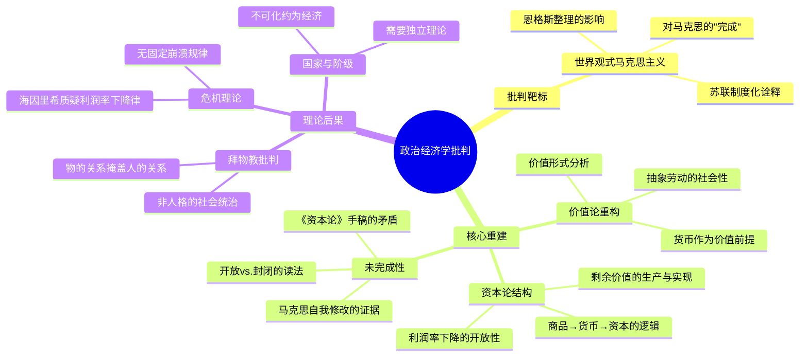

## 《政治经济学批判》读书笔记: 马克思〈资本论〉导论
  
### 作者  
digoal  
  
### 日期  
2026-05-20  
  
### 标签  
读书笔记 , 政治经济学批判：马克思〈资本论〉导论    
  
----  
  
## 背景  
  
---
书名: 《政治经济学批判：马克思〈资本论〉导论》  
作者: [德] 米夏埃尔·海因里希  
译者: 张义修 / 房誉  
出版社: 南京大学出版社  
出版年份: 2021  
笔记日期: 2025-05-21  
豆瓣链接: https://book.douban.com/subject/35018733/  
标签: [马克思主义, 政治经济学, 资本论, 价值理论, 批判理论]  
---

  

> **一句话**：这不是又一本《资本论》通俗解读——它是一把锋利的手术刀，专门用来切开我们以为早就知道的那个"马克思"。
>  
> **适合谁读**：对马克思有基础了解却感到疑惑的读者；想认真读《资本论》却不知从何入手的人；对当代左翼理论感兴趣的学生。
>  
> **阅读难度**：⭐⭐⭐⭐☆（概念密集，需要一定哲学和经济学背景）
>  
> **推荐指数**：⭐⭐⭐⭐⭐

---

## 一、时代坐标：这本书从哪里来？

2004年，这本书首次以德文出版，书名直白：《政治经济学批判：导论》。它出现的时机颇为微妙——苏联解体已过去十余年，曾经作为"现实社会主义"意识形态支撑的那套"马克思主义"正在余烬中熄灭，而另一种浪潮却在欧洲学院内悄然涌动。从1960年代起，一批西德学者——巴克豪斯（Backhaus）、赖歇尔特（Reichelt）等人——开始重返马克思原典，以批判"苏联正统诠释"为旗帜，发起了一场史称"新马克思阅读"（Neue Marx-Lektüre）的运动。海因里希正是这个传统在21世纪最有影响力的继承者。

这本书在德国持续印行，至今已逾九版，成为德国大学马克思主义学习小组的标准读物。中文版由折射集于2021年引进，进入了一个对马克思主义理论重新产生兴趣的语境——对于许多中国读者而言，《资本论》似乎早已"被读懂"，也正因如此，这本书的挑战才显得格外刺眼。

海因里希的问题意识只有一个：**我们真的读懂马克思了吗？**

```
时间轴：新马克思阅读的源流

1960s                1991              2004              2021
  │                   │                 │                 │
西德：巴克豪斯      海因里希博士论    《政治经济学批      中文版在华
赖歇尔特等人开      文《价值的科学》  判导论》(德文)      出版
始重读《资本论》    奠定理论基础       出版，德国九版      引发讨论
  │                   │                 │                 │
阿多诺、阿尔都        ←──────── 新马克思阅读传统 ──────────→
塞等西方马克思       
主义提供思想资源
```

---

## 二、核心命题：作者在说什么？

### 命题一：打倒"世界观式的马克思主义"

海因里希的第一个动作，是为他要批判的靶子命名——"**世界观式的马克思主义**"（Weltanschauungsmarxismus）。

这种马克思主义形态把马克思理论塑造成一套"无所不包的世界观"：历史唯物主义提供终极解释框架，劳动价值论论证剥削，危机理论预言资本主义崩溃，一切都已有现成答案。这种理解，在海因里希看来，源头正是恩格斯和考茨基对马克思遗稿的整理与诠释，经由苏联马克思列宁主义的制度化而定型。

问题在哪里？这种诠释把马克思的理论"完成"了，而马克思本人的《资本论》其实是一个**永远未竣工的计划**。海因里希参与编辑MEGA²（马克思恩格斯全集历史考证版），深知马克思的手稿里充满修改、矛盾与自我否定。把这样一个开放的思想遗产固化成意识形态，既是误读，也是遮蔽。

### 命题二：价值不是物的属性，货币才是价值存在的前提

这是全书理论上最硬核也最有争议的主张。

传统（"世界观式"）的读法把劳动价值论理解为：商品价值由生产它的**社会必要劳动时间**决定，这是一个可以在生产过程中独立确认的量。价值先于交换而存在，货币不过是价值的"外衣"。

海因里希的"**货币价值论**"却主张：价值不是物的内在属性，而是一种**社会关系**。私人劳动的产品必须通过交换——通过货币的中介——才能被"社会确认"为具有价值的商品。价值形成于交换过程，货币不是价值的符号，而是价值存在的**必要条件**。

这一转向的意义是巨大的：它使马克思的价值理论脱离了"实物经济"的框架，直接指向了金融资本主义时代的货币幻象与危机逻辑。

### 命题三：《资本论》的真正对象是"政治经济学批判"，而非替代性经济学

马克思的副标题写得清清楚楚："**政治经济学批判**"——不是"政治经济学"。

这个区别至关重要。斯密、李嘉图批判过旧经济学，但他们的批判是为了建立更好的经济学，接受了商品、货币、资本等范畴的自然性。马克思的批判更为彻底：他要追问的是，这些范畴本身——商品、价值、货币、资本——为什么会以这种形式存在？它们背后掩盖着怎样的社会关系？

这是一种**范畴批判**，而非仅仅是阶级立场的倒转。

---

## 三、论证地图：作者怎么说服你的？



海因里希的论证策略是典型的"文本＋解构"路线：他大量援引马克思原始手稿（尤其是MEGA²版本），指出流传已久的某些"马克思定论"在文本层面根本站不住脚，然后用"新马克思阅读"的框架重新诠释。

他处理**商品拜物教**一节尤为精彩——传统读法把拜物教理解为一种"意识形态幻觉"，揭穿它便可恢复"真实"的经济关系。海因里希则认为，拜物教不是错觉，而是资本主义社会关系的**客观表现形式**：人与人的社会关系真的是通过物与物的交换来运作的，这不是错觉，这就是结构现实。

---

## 四、前提假设与边界：什么情况下这不成立？

海因里希的体系建立在几个可以被追问的前提上：

**前提一：交换中心论**
他强调价值在交换中被"社会确认"，批评者（如保罗·伯克特）指出这可能低估了生产过程中劳动的角色，将马克思的理论拉向了一种"流通中心主义"，反而与马克思自己强调"生产决定"的立场相悖。

**前提二：文本优先论**
海因里希把MEGA²手稿视为更"真实"的马克思。但马克思的手稿本身充满矛盾——选择哪些手稿段落作为"证据"，本身就是一种诠释。他对利润率下降趋势的否定（认为马克思晚年已放弃该理论），在学术界引发了持续争论，谢富胜等中国学者对此提出了有力质疑。

**前提三：去历史化的倾向**
海因里希坚持《资本论》是抽象逻辑层面的分析，而非具体历史进程的描述。批评者认为，这使他的马克思走向了一种"纯粹资本主义"理论，难以直接回应现实阶级斗争与具体历史情境。

---

## 五、思想谱系：这本书在哪个传统里？

```
西方马克思主义根系
       │
  阿多诺(否定辩证法)──┐
  阿尔都塞(症候阅读)──┤
                       ↓
           新马克思阅读(Neue Marx-Lektüre)
           巴克豪斯 / 赖歇尔特（1960s-70s）
                       │
                       ↓
              海因里希（1957— ）
              《价值的科学》(1991)
              《政治经济学批判导论》(2004)
                       │
              ┌─────────────────┐
              ↓                 ↓
         对话：          对话：
         鲍尔斯基         日本宇野学派
         开放的马克思主义   价值形式主义
```

海因里希的思想上承阿多诺的"否定辩证法"——对任何封闭体系的批判——和阿尔都塞对马克思文本的精细阅读方法，同时与日本的价值形式研究传统（宇野弘藏路线）存在深刻共鸣，尽管路径不同。他的货币价值论，在当代还与"开放的马克思主义"学派、后操作主义（post-operaismo）等思潮形成了跨越大西洋的对话。

重要的是，他不是任何一个阵营的简单追随者。他对待马克思文本的态度"既忠实又批判"，这本身就是一种罕见的理论勇气。

---

## 六、我学到了什么？

读这本书最大的冲击，不是某个具体结论，而是一种**阅读姿态的革命**。

我们对马克思的了解，很大程度上是"二手的马克思"：经过恩格斯整理、考茨基诠释、苏联系统化、教科书简化的马克思。这些环节每一步都有其历史合理性，但叠加起来，结果就是一个被"完成"了的、失去内在张力的马克思。海因里希的贡献，是强迫我们回到那个**仍在思考、仍在修改、仍在矛盾中挣扎**的马克思。

其次，货币价值论让我重新理解了金融危机的逻辑。如果价值必须通过货币流通才能"实现"，那么金融系统就不是实体经济的附属物，而是价值存在方式本身的一部分。2008年危机之所以引发全球"重读马克思"的热潮，正因为海因里希式的马克思比任何实证经济学都更能解释那场危机的结构性根源。

第三，我学会了区分"批判政治经济学"与"替代性经济学"。这不是文字游戏，而是立场的根本差异。前者追问范畴的历史性，后者只想要更好的技术工具。

---

## 七、举一反三：这个框架还能用在哪？

**范畴批判的方法**不局限于经济学。海因里希对"商品"、"价值"、"货币"范畴的追问方式，本质上是一种**对"理所当然"的历史化**——追问：这个我们视为自然的范畴，什么时候开始存在？它掩盖了什么？这种方法可以用于：

- **法律研究**："合同"、"产权"、"法人"并非自然存在，它们在什么历史条件下以这种形式出现？
- **技术批判**：算法推荐、平台经济——这些新形式背后是否存在新的"价值形式"？抑或是旧范畴的延伸？
- **日常消费**：我们看一件商品标价时的那种"理所当然"，正是拜物教结构在运作——物的价格掩盖了生产它的社会关系网络。

---

## 八、批判与反思

### 海因里希的问题在哪里？

**其一，过度抽象的风险**。海因里希坚持《资本论》是"纯粹资本主义"的逻辑分析，刻意悬置具体历史与阶级斗争。这使理论极为精致，却与现实斗争保持了危险的距离。一个理论如果只能"理解资本主义"而不能"改变资本主义"，它的批判性在哪里？

**其二，对恩格斯的过度苛责**。把"世界观马克思主义"的责任主要归咎于恩格斯，在历史上显得简单化。恩格斯的整理固然有其局限，但也有其历史必要性——一个草稿中的马克思，如何能成为工人运动的理论武器？

**其三，文本解读的内在循环**。他批评传统读法"误读"马克思，却又用另一种解读来"纠正"——谁来判定谁的读法更接近马克思本意？海因里希自己也不可避免地带着诠释框架进入文本。正如一位中国学者所言："海因里希的论述与其说是在导读马克思，不如说是在进行他自己的理论创新。"

---

## 九、金句与记忆点

> **"马克思并不是想要提出一种替代性的'政治经济学'，而是要实现'政治经济学批判'。"**
>
> ——批判与替代的区别，是整本书的钥匙。不是要建立一门"更好"的经济学，而是要质疑经济学本身的范畴基础。

> **"世界观式的马克思主义"**
>
> ——海因里希为一种理论形态发明的命名：把马克思的理论封装成无所不包的世界观，用以解释一切。这种封闭性正是他要批判的靶心。

> **商品拜物教不是错觉，而是结构现实**
>
> ——物与物的交换关系，确实就是资本主义社会联系的存在方式。揭穿拜物教不是看穿幻觉，而是理解这种社会关系何以只能以物的形式出现。

> **价值是社会关系，不是物的属性**
>
> ——劳动产品不会自动"携带"价值，它必须进入交换，经由货币的社会确认，才成为"有价值的商品"。这一命题颠覆了把劳动时间视为价值本质的简单读法。

> **《资本论》是未完成的计划**
>
> ——马克思在世时只出版了第一卷，大量手稿充满矛盾与修改。把它作为一个"完成的体系"来教导，是对这种智识开放性的背叛。

---

## 十、延伸阅读

**1. 马克思，《资本论》第一卷（人民出版社版）**
读海因里希之后再读原典，你会发现第一章"商品"一节的密度与深度超乎预期。海因里希强调这一章"应该被特别仔细地阅读"，哪怕你以为自己早已读懂。

**2. 大卫·哈维，《资本论讲稿》（上海译文出版社）**
同为导论类著作，但哈维的路径更偏向历史地理唯物主义，与海因里希形成有趣对照——两人都是当代马克思研究的重要人物，却代表了完全不同的诠释传统。

**3. 赵磊，《走进〈资本论〉》**
中国学者视角，与海因里希的争议观点（如利润率下降趋势）形成正面对话，是理解国内外马克思主义研究分歧的好窗口。

**4. 汉斯-格奥尔格·巴克豪斯，《辩证法的问题》（相关论文集）**
新马克思阅读传统的奠基文献，海因里希思想的理论前驱。高难度，适合进阶。

**5. 海因里希，《卡尔·马克思与现代社会的诞生》（传记）**
了解马克思如何从一个激进青年成为《资本论》的作者，海因里希的传记写作同样批判而细腻。

---

```
思想影响示意图

《资本论》（1867）
      │
      ├──恩格斯整理→第二、三卷→正统解读
      │         ↓
      │    苏联马克思列宁主义→教科书马克思
      │
      └──原始手稿（MEGA²）→新马克思阅读
                              ↓
                        海因里希版马克思：
                        ・货币价值论
                        ・范畴批判
                        ・开放、未完成性
                              ↓
                    ┌─────────────────────┐
                    │                     │
                学术界争议            当代左翼思潮
                (伯克特批判等)        (金融危机后复兴)
```

---

*笔记写于 2025-05-21 | 基于公开资料与深度思考整理*
*主要参考：豆瓣书目信息、百度百科条目、知乎相关讨论、英文维基百科、Monthly Review书评、Marx & Philosophy Review书评*
  
  
#### [PostgreSQL 解决方案集合](../201706/20170601_02.md "40cff096e9ed7122c512b35d8561d9c8")
  
  
#### [德哥 / digoal's Github - 公益是一辈子的事.](https://github.com/digoal/blog/blob/master/README.md "22709685feb7cab07d30f30387f0a9ae")
  
  
#### [About 德哥](https://github.com/digoal/blog/blob/master/me/readme.md "a37735981e7704886ffd590565582dd0")
  
  

  
