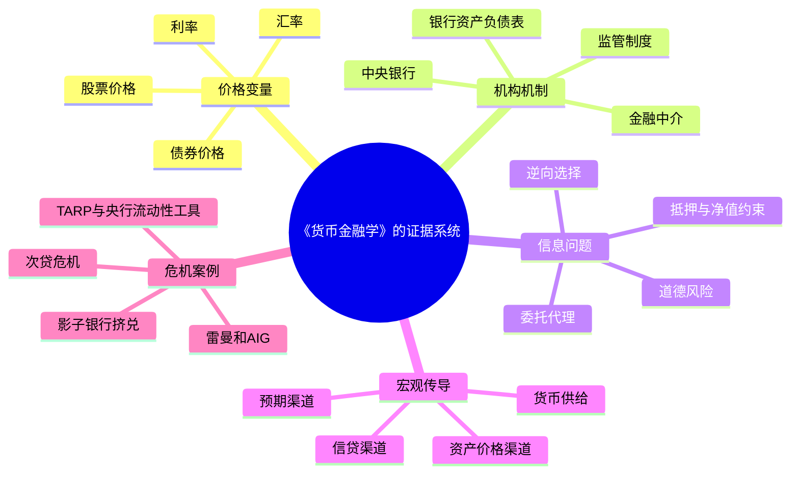
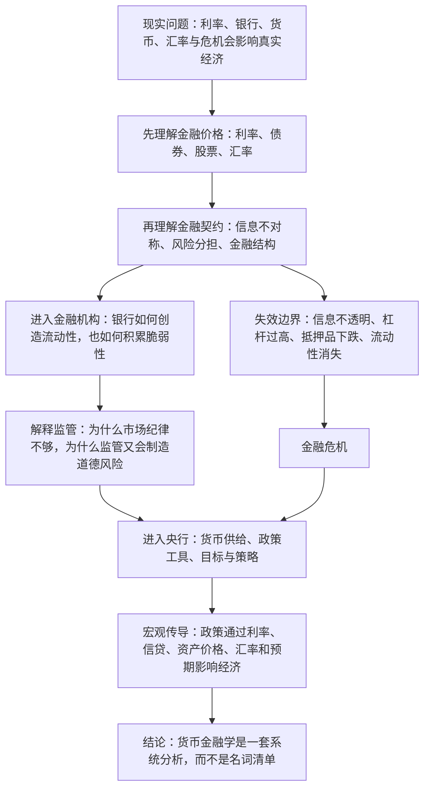

## 《货币金融学》读书笔记: 把金融世界看成一套“激励、信息与资产负债表”的系统
  
### 作者  
digoal  
  
### 日期  
2026-05-20  
  
### 标签  
读书笔记 , 货币金融学    
  
----  
  
## 背景  
  

> 一句话结论：米什金不是在教读者背金融名词，而是在训练一种判断方法：任何货币金融问题，都要同时看价格、信息、激励、资产负债表和制度约束。  
> 适合谁读：金融、经济、银行、投资、政策研究入门者；也适合想理解利率、银行、央行、危机和汇率之间关系的非专业读者。  
> 我的评价：作为教材，它的强项是统一框架和现实案例；弱项是美国制度和主流新凯恩斯主义视角较强，读者需要用中国金融实践和危机后新讨论来补充。  

## 1. 书籍档案与资料来源

### 书籍档案

| 项目 | 信息 |
|---|---|
| 中文书名 | 《货币金融学》 |
| 作者 | 弗雷德里克·S·米什金（Frederic S. Mishkin） |
| 译者 | 郑艳文 / 荆国勇 |
| 出版社 | 中国人民大学出版社 |
| 出版时间 | 2011 年 1 月 |
| ISBN | 9787300129266 |
| 页数 | 645 |
| 原作名 | *The Economics of Money, Banking & Financial Markets* |
| 丛书 | 经济科学译丛 |
| 版本提示 | 豆瓣页面与中文出版信息显示为 2011 年中文本；英文第 9 版出版于 2010 年，内容受 2007-2009 年金融危机影响较大。 |

### 资料来源与限制

这篇笔记依据公开资料、出版社/平台元数据、作者官方履历、英文版目录与米什金关于金融危机的公开论文综合写成。我没有读取这本中文 645 页版本的完整非公开正文，因此涉及具体章节细节时，只做框架性概括；涉及 2008 年危机案例时，优先引用米什金公开发表的论文与出版页面，而不是假装复述书中未公开段落。

主要来源：

- 豆瓣图书页确认中文出版信息、ISBN、页数、简介和读者评分：[《货币金融学》豆瓣页面](https://book.douban.com/subject/5939751/)。
- 哥伦比亚商学院作者页确认米什金职务、研究方向、纽约联储与美联储经历、主要著作：[Frederic Mishkin | Columbia Business School](https://business.columbia.edu/faculty/people/frederic-mishkin)。
- 美联储新闻稿确认米什金 2006-2008 年任美联储理事并于 2008 年 8 月 31 日离任：[Federal Reserve press release, May 28, 2008](https://www.federalreserve.gov/newsevents/pressreleases/other20080528a.htm)。
- Pearson 第 12 版前言 PDF 用于交叉确认作者履历与教材结构：[The Economics of Money, Banking, and Financial Markets, 12e preface](https://www.pearsonhighered.com/assets/preface/0/1/3/4/0134855388.pdf)。
- 米什金 2023 年 CV 用于确认本书版本演进：1986 年第一版，2010 年第 9 版，2022 年第 13 版：[Mishkin CV, July 2023](https://business.columbia.edu/sites/default/files-efs/person/cv/Mishkin%20CV%20July%202023.pdf)。
- YES24 英文第 9 版页面用于确认第 9 版目录和危机后修订背景：[The Economics of Money, Banking, and Financial Markets, 9/E](https://www.yes24.com/product/goods/3645074)。
- 米什金发表于 *Journal of Economic Perspectives* 的危机论文用于理解他对次贷危机、影子银行挤兑、雷曼、AIG、货币市场基金和 TARP 的分析：[Over the Cliff: From the Subprime to the Global Financial Crisis](https://business.columbia.edu/sites/default/files-efs/pubfiles/5186/mishkin_cliff.pdf)。
- Columbia Magazine 对 2008 年危机后教材修订的报道，用于理解“为什么第 9 版重要”：[Crash Course](https://magazine.columbia.edu/article/crash-course)。

## 2. 时代背景：这本书在回应什么问题

这本书的英文第一版出版于 1986 年。米什金 CV 显示，*The Economics of Money, Banking, and Financial Markets* 从 1986 年第一版一路更新到 2022 年第 13 版，几乎覆盖了现代金融体系从传统银行、金融自由化、通胀治理、全球资本流动，到影子银行和非常规货币政策的演进。

中文 2011 年版的特殊背景，是 2007-2009 年全球金融危机刚刚改写货币银行学的教学重点。豆瓣简介明确说，次贷危机及其引发的一系列事件“极大地改变了金融体系的结构与中央银行的运作模式”，本版相关内容做了大量改写，并增加了新的内容、应用和专栏。YES24 对英文第 9 版的介绍也强调，2008 年底的历史性金融事件改变了货币银行领域的图景，而米什金刚刚担任过美联储理事，具备解释当时争论的内部视角。

所以，这本书不是一本纯粹静态的“货币银行学概论”。它真正回应的问题是：

1. 为什么看似抽象的利率、货币供给、银行资本和汇率，会直接影响就业、收入、资产价格和金融危机？
2. 为什么金融体系不是简单的“资金中介”，而是一套高度依赖信息、信用、抵押品、监管和央行最后贷款人能力的制度网络？
3. 为什么金融创新既能提高效率，也会制造不透明杠杆、错配激励和系统性风险？
4. 为什么中央银行不能只盯住一个货币数量指标，而必须在通胀、产出、金融稳定、预期管理之间做权衡？

它在今天仍然重要，是因为 2020 年之后的全球经济继续被同一组问题支配：低利率与高通胀切换、央行扩表和缩表、银行挤兑数字化、房地产信用周期、美元流动性、汇率波动、财政与货币政策边界。这些问题的外观变了，但底层仍然是米什金反复训练的那套分析框架。

## 3. 作者想表达什么

### 主命题

我的概括是：金融体系不是货币、银行、市场和央行的零散拼盘，而是一套通过价格信号、信息生产、风险分担和制度约束来配置资源的系统；理解这个系统，必须从“经济学思维方式”而不是名词记忆出发。

豆瓣简介也概括了这一点：本书保留的基本优点是“建立一个统一的分析框架”，用基本经济学理论帮助学生理解金融市场结构、外汇市场、金融机构管理以及货币政策在经济中的作用。

### 次级主张

| 次级主张 | 含义 |
|---|---|
| 利率是核心价格 | 利率不只是“借钱成本”，也是跨期资源配置、资产估值、风险补偿和政策传导的中心变量。 |
| 金融市场依赖信息 | 逆向选择、道德风险、委托代理和信息不对称，解释了为什么金融中介、抵押、契约和监管不可或缺。 |
| 银行是脆弱而必要的机构 | 银行通过期限转换和流动性创造服务经济，但也因此天然暴露于挤兑和资产负债表冲击。 |
| 央行管理的是预期和约束 | 央行工具不仅影响货币数量，也通过利率、信用、资产价格、汇率和预期影响实体经济。 |
| 危机是机制失灵的集中爆发 | 金融危机通常不是一个坏消息造成的，而是杠杆、资产价格、流动性、信息不透明和政策反应共同作用的结果。 |

### 隐含价值观

米什金的基本价值观偏向主流制度经济学和货币经济学：市场是强大的资源配置机制，但金融市场有显著的市场失灵；监管和央行干预有必要，但干预本身会带来道德风险；全球化和金融发展有潜在收益，但前提是制度质量、监管能力和宏观稳定能够跟上。

## 4. 作者如何证明：数据、案例、故事与概念

这本书的证据不是靠单一故事推进，而是教材式的多层结构：

第 9 版目录能看出它的论证路径：先讲为什么研究货币、银行与金融市场，再讲金融体系和货币定义；随后进入利率、股票市场和有效市场；接着是金融结构、金融危机、银行管理、金融监管；再进入央行、货币供给、货币政策工具与策略；最后讨论外汇、国际金融体系、货币需求、IS-LM、总需求总供给、货币政策传导、通胀和理性预期。

这个顺序很重要：作者没有先讲“央行怎么印钱”，而是先让读者理解金融价格、金融契约和金融机构为什么存在。因为如果不理解信息不对称、期限错配和资产负债表，货币政策就会被误读成简单的“放水/收水”。

## 5. 书中的 1-3 个浓缩例子

### 例子一：影子银行挤兑如何把次贷损失放大成系统危机

- 书中/作者公开材料呈现了什么：米什金在 2011 年 *Journal of Economic Perspectives* 论文中把 2007-2009 年危机分为两个阶段。第一阶段源自美国次级住房抵押贷款相关证券损失；第二阶段在 2008 年 9 月后急剧恶化，雷曼破产、AIG 崩溃、Reserve Primary Fund 遭遇挤兑以及 TARP 审批受阻共同加剧了全球恐慌。
- 作者借它证明什么：金融危机不是“房贷坏账”这一单点问题，而是抵押品价值、短期融资、杠杆、流动性和信心共同塌缩。
- 关键机制：影子银行大量依赖回购等短期融资，用较长期、较复杂资产作抵押。一旦抵押品价值不确定，融资方提高折扣率，借款方被迫去杠杆并抛售资产，资产价格进一步下跌，形成反馈循环。
- 我的迁移理解：任何组织只要用短期负债支撑长期资产，都有类似脆弱性。银行如此，房地产企业如此，依赖短期续约融资的创业公司也如此。

### 例子二：利率不是一个数字，而是一组风险、期限和预期的合成价格

- 书中发生了什么：第 9 版目录中，利率相关内容连续占据第 4、5、6 章：理解利率、利率行为、利率风险结构与期限结构。这说明作者把利率视为进入金融市场的第一把钥匙。
- 作者借它证明什么：不要把“利率上升/下降”直接等同于“货币紧/松”。利率包含违约风险、流动性、税收待遇、期限溢价和通胀预期。
- 关键机制：同样叫“利率”，国债收益率、公司债收益率、银行贷款利率、同业拆借利率背后的风险结构不同；同一发行人不同期限的利率，又反映了市场对未来短期利率和风险补偿的预期。
- 我的迁移理解：做商业决策时，不要只问“融资利率是多少”，还要问期限是否匹配、还款现金流是否稳定、利率重定价风险由谁承担。

### 例子三：央行政策不是按按钮，而是通过传导链条影响经济

- 书中发生了什么：本书把央行、货币供给、政策工具、政策策略、货币需求、IS-LM、总需求总供给和传导机制拆成多个章节，说明政策效果要经过一连串中介环节。
- 作者借它证明什么：货币政策不是简单改变一个数量变量，而是通过利率、信贷、资产价格、汇率和预期等渠道影响总需求与通胀。
- 关键机制：政策利率变化首先影响短端金融价格，然后影响银行放贷、企业投资、居民消费、资产估值和汇率，再传导到产出和价格。每个环节都会受金融摩擦、资产负债表状况和预期影响。
- 我的迁移理解：判断政策效果，要看“传导是否通畅”。如果银行惜贷、企业不愿投资、居民资产负债表受损，即使政策利率下降，实体经济反应也可能有限。

## 6. 论证逻辑图

这套逻辑的核心是“从微观摩擦到宏观结果”。很多人谈金融时直接跳到央行和货币供给，米什金的路径更稳：先理解金融市场为什么不完美，再理解金融中介为什么存在，最后才讨论央行如何在一个不完美系统中做政策。

## 7. 前提假设与反方观点

| 前提假设 | 支撑材料 | 可能反例 | 我的判断 |
|---|---|---|---|
| 金融市场有系统性信息不对称，因此金融中介和监管有存在价值 | 本书目录把金融结构、危机、银行管理、监管作为核心部分；米什金研究方向也长期集中在货币政策、金融市场和宏观经济。 | 去中心化金融、充分披露制度、强市场纪律可能降低中介需求。 | 信息技术会改变中介形态，但不会消除信用评估、期限转换和风险治理问题。 |
| 货币政策可以影响实体经济，至少在短中期有效 | 本书大量讨论货币政策工具、策略和传导机制；米什金也发表过金融危机中货币政策有效性的研究。 | 流动性陷阱、资产负债表衰退、银行惜贷会削弱传导。 | 政策有效性不是常数，要看金融体系健康度和预期是否被锚定。 |
| 金融发展总体有益，但需要制度与监管配套 | 作者其他著作和研究涉及金融全球化、金融发展与宏观表现；哥伦比亚商学院页面列出其全球化和金融机构研究领域。 | 过快金融自由化可能带来资本外逃、资产泡沫和危机。 | 这条命题成立但有强前提：金融深化必须伴随透明度、法治、监管能力和宏观审慎工具。 |
| 主流经济学模型能提供有效分析框架 | 本书结构包含 IS-LM、总需求总供给、理性预期、有效市场等主流工具。 | 2008 年危机暴露了许多模型低估尾部风险、流动性螺旋和制度复杂性的缺陷。 | 模型适合做“思考骨架”，但不能替代资产负债表细读和制度细节。 |

### 重要反方观点

第一，奥地利学派或更市场主义的批评会认为，央行干预和最后贷款人安排本身制造了道德风险，让金融机构预期自己会被救助，从而更愿意冒险。

第二，明斯基式观点会认为，主流教材低估了金融体系内生不稳定性：稳定时期本身会鼓励杠杆、期限错配和风险错觉，危机不是外生冲击，而是繁荣阶段内生积累的结果。

第三，危机后的宏观金融研究会补充：仅用代表性主体和均衡模型难以解释金融网络、流动性挤兑、抵押品链条和非银行金融机构的系统风险。米什金第 9 版已经把危机纳入教材，但后续十多年研究仍在继续修正这套框架。

## 8. 作者真正的思想

米什金真正想改变的，不是读者记住多少金融术语，而是读者看世界的入口。

普通读者看到银行，会想到“存款和贷款”；米什金要你看到期限转换、资本约束、信用风险、流动性管理和监管套利。普通读者看到央行降息，会想到“钱变多”；米什金要你追问利率曲线、信用利差、银行风险偏好、资产价格、汇率和通胀预期。普通读者看到金融危机，会寻找一个罪魁祸首；米什金要你看一组机制如何互相放大。

所以，这本书的底层思想可以写成一句话：

> 金融不是钱的流动，而是信任、信息、期限和风险在制度中的流动；货币政策不是魔法，而是在这些约束里改变激励和预期。

## 9. 我读完学到了什么

第一，利率是金融系统的语法。不会拆解利率，就无法真正理解债券、股票、汇率、银行利润、房地产周期和央行政策。

第二，金融风险常常藏在资产负债表结构里，而不是利润表里。一个机构盈利很好，也可能因为短债长投、抵押品折价、流动性断裂而快速失败。

第三，金融监管的难点不是“要不要监管”，而是监管如何处理激励。救助太少会引发系统性崩溃，救助太多会强化道德风险；资本要求太低会鼓励杠杆，太高又可能压缩信用。

第四，货币政策传导不是线性管道，而是一张网络。政策利率只是起点，真正效果取决于银行、企业、居民、资本市场和外汇市场的共同反应。

第五，金融教材的价值不在于给答案，而在于训练问题清单。看到一个宏观金融事件，我现在会先问：价格信号是什么？谁的资产负债表受损？信息不对称在哪里？短期融资是否可持续？央行工具能否传导？

## 10. 如何举一反三

| 书中思想 | 可迁移场景 | 使用方法 | 风险 |
|---|---|---|---|
| 利率是跨期价格 | 企业融资、买房、债券投资 | 同时看名义利率、实际利率、期限、重定价和现金流匹配 | 只看低利率，忽视未来利率上行和再融资压力 |
| 信息不对称决定金融结构 | 风投、供应链金融、银行贷款 | 问“谁知道真实风险，谁承担最终损失” | 把信用问题误判成抵押品问题 |
| 资产负债表比叙事更诚实 | 房地产、地方债、平台企业 | 看短债、长期资产、现金流、抵押品折价和续融资能力 | 会低估政策支持或隐性担保 |
| 政策效果取决于传导 | 判断降息、降准、财政刺激 | 拆分银行、企业、居民和市场预期的反应链 | 把政策公告等同于政策结果 |
| 金融危机是反馈循环 | 风险管理、投资组合、企业经营 | 识别“价格下跌-抵押品缩水-被迫卖出-价格再跌”的链条 | 过度关注单点事件，忽略系统脆弱性 |

## 11. 我的反思与讨论问题

我同意米什金的地方，是他把货币金融学从“背概念”拉回到“看机制”。这对中文读者尤其有用，因为公共讨论里常把央行政策简化成“印钱”或“收水”，把金融危机简化成“坏人太贪婪”，把汇率简化成“强弱输赢”。米什金的框架能帮助我们看到更具体的链条。

我保留意见的地方，是这本教材的制度背景主要来自美国金融体系。中国金融体系有更强的银行主导、政府信用、资本项目管理、房地产抵押品权重和政策性金融特征。直接套用美国经验，可能会误判中国的政策传导和风险处置方式。

我还会补充一个危机后视角：2008 年之后，货币政策越来越和财政政策、金融稳定政策、宏观审慎监管交织在一起。央行不再只是调整短期利率的机构，也越来越像金融系统的流动性保险人和预期管理者。这会让教材中的传统边界变得模糊。

值得讨论的问题：

1. 如果金融危机往往来自期限错配和杠杆，那么金融创新究竟是在分散风险，还是在隐藏风险？
2. 央行救助危机时，如何区分“防止系统崩溃”和“奖励错误决策”？
3. 在中国语境下，货币政策传导最堵的环节是银行、企业、居民资产负债表，还是地方财政约束？
4. 利率市场化、资本市场发展和金融监管强化，三者是否可能同时推进？如果不能，优先级是什么？

## 12. 分享版：3-5 分钟讲稿

如果用 3-5 分钟介绍《货币金融学》，我会这样讲：

这本书表面上是一本教材，讲货币、银行、金融市场、央行、汇率和货币政策。但它真正有价值的地方，不是知识点多，而是给了我们一套看金融世界的框架。

米什金提醒我们，金融不是“钱从一个人流到另一个人”这么简单。金融系统处理的是五件事：价格、信息、风险、期限和制度。利率是价格，信用评级和抵押品是信息处理，银行和市场在分配风险，存短贷长制造期限转换，央行和监管则规定这个系统能承受多大杠杆、遇到危机时谁来兜底。

为什么这很重要？因为很多金融事件如果只看表面，很容易误判。央行降息，不等于实体经济一定会变好；还要看银行愿不愿放贷、企业愿不愿投资、居民资产负债表是否健康。房价下跌，也不只是资产价格问题；如果它影响抵押品价值，就会影响银行贷款、企业融资和地方财政。金融危机也不是某一个机构倒闭那么简单；2008 年危机的可怕之处，是抵押品下跌、短期融资收缩、被迫卖出资产、资产继续下跌，形成了反馈循环。

所以，我读这本书最大的收获是：以后看任何金融问题，都不要先站队，也不要先喊口号。先画资产负债表，找利率和信用利差，看信息不对称在哪里，问短期融资能不能续上，再判断央行政策能不能传导。金融学最有用的地方，不是预测明天涨跌，而是帮我们识别系统的脆弱点。

一句话总结：金融世界不是由钱驱动的，而是由信任、抵押品、期限和预期共同驱动的。

## 13. 来源与延伸阅读

1. 豆瓣图书：《货币金融学》，确认中文出版信息、ISBN、页数、内容简介与评分。https://book.douban.com/subject/5939751/
2. Columbia Business School: Frederic Mishkin，确认作者职务、研究方向、任职经历和主要著作。https://business.columbia.edu/faculty/people/frederic-mishkin
3. Federal Reserve Board press release, May 28, 2008，确认米什金 2006-2008 年美联储理事经历和离任信息。https://www.federalreserve.gov/newsevents/pressreleases/other20080528a.htm
4. Pearson Higher Education, *The Economics of Money, Banking, and Financial Markets*, 12e preface，确认作者履历和后续版本结构。https://www.pearsonhighered.com/assets/preface/0/1/3/4/0134855388.pdf
5. Frederic S. Mishkin CV, July 2023，确认本书版本演进与作者出版记录。https://business.columbia.edu/sites/default/files-efs/person/cv/Mishkin%20CV%20July%202023.pdf
6. YES24: *The Economics of Money, Banking, and Financial Markets, 9/E*，确认英文第 9 版出版信息、目录和危机后修订说明。https://www.yes24.com/product/goods/3645074
7. Frederic S. Mishkin, “Over the Cliff: From the Subprime to the Global Financial Crisis,” *Journal of Economic Perspectives*, 2011，用于理解作者对 2007-2009 年危机机制的分析。https://business.columbia.edu/sites/default/files-efs/pubfiles/5186/mishkin_cliff.pdf
8. Columbia Magazine, “Crash Course”，关于 2008 年危机如何推动米什金修订教材的报道。https://magazine.columbia.edu/article/crash-course

  
  
#### [PostgreSQL 解决方案集合](../201706/20170601_02.md "40cff096e9ed7122c512b35d8561d9c8")
  
  
#### [德哥 / digoal's Github - 公益是一辈子的事.](https://github.com/digoal/blog/blob/master/README.md "22709685feb7cab07d30f30387f0a9ae")
  
  
#### [About 德哥](https://github.com/digoal/blog/blob/master/me/readme.md "a37735981e7704886ffd590565582dd0")
  
  

  
