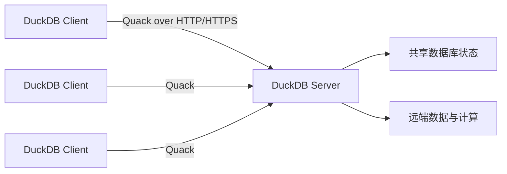
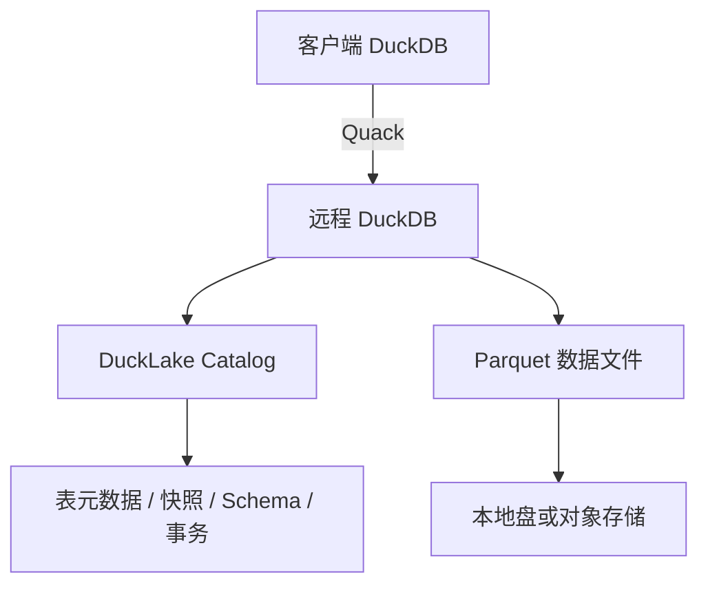
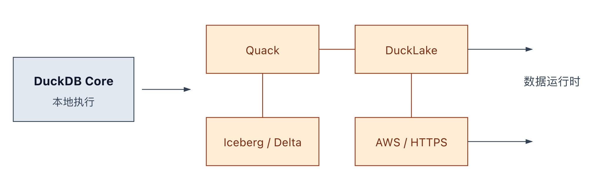

## DuckDB 决定要拆掉用户心中的这堵墙: 嵌入式数据库! 地盘又扩大了
  
### 作者  
digoal  
  
### 日期  
2026-05-20   
  
### 标签  
DuckDB , 嵌入式数据库 , cs 架构 , quack  
  
----  
  
## 背景  

> DuckDB 1.5.3 最值得关注的地方，是 Quack 成为 core extension，并开始和 DuckLake、Iceberg、AWS、HTTPS 等扩展能力连起来。DuckDB 正在从“本地嵌入式分析引擎”，走向一个更完整的数据运行时：本地可嵌入，远程可连接，湖仓可接入，云环境可部署。

DuckDB 过去最吸引人的地方，是简单。

不用部署服务器，不用申请集群，也不用先把数据搬进仓库。它直接嵌入 Python、R、命令行或应用进程，读 Parquet、CSV、JSON、Arrow、Pandas、S3，然后用 SQL 做分析。

这个模式让 DuckDB 很适合个人分析、Notebook、临时数据处理、嵌入式 BI、CI 数据校验和轻量数据工程。但使用场景变大后，几个问题会自然出现：

- 多个进程要同时读写同一份状态怎么办？
- 数据湖表的元数据、快照、schema、事务由谁协调？
- 企业环境里的 IAM、代理、防火墙、托管数据库怎么接入？
- DuckDB 的扩展能力如何安全、稳定地分发和治理？

DuckDB 1.5.3 的意义，就在于它集中回应了这些问题。

## Quack：让 DuckDB 多一种部署形态

Quack 是 DuckDB 的远程协议，可以让 DuckDB 实例之间通过 HTTP/HTTPS 通信。一个 DuckDB 进程可以作为 server 持有状态，其他 DuckDB 客户端通过 `quack:` 协议连接它。

这对 DuckDB 很关键。因为 DuckDB 原本的优势来自 in-process：执行就在应用进程里，没有传统数据库协议开销。但这个模型在多个进程并发写同一份数据库时并不自然。官方 Quack 发布文也解释过，DuckDB 在内存中维护大量状态，多进程同时修改会带来同步问题。

Quack 的做法是把可变状态集中到一个 DuckDB server 进程里，同时保留 DuckDB 客户端的使用体验。

官方基准显示，Quack 在 bulk transfer 和小写入场景里表现很强。这个结果需要按官方测试条件理解，但它说明 Quack 不是临时包一层 RPC，而是 DuckDB 团队认真设计的新协议。

不过也要注意边界：Quack 仍处 beta 状态，协议、函数名和默认行为可能变化，官方计划在 DuckDB v2.0 时发布生产就绪版本。

## DuckLake + Quack：更轻的湖仓控制面

DuckLake 的核心设计是把 lakehouse 元数据放进 SQL catalog，把表数据放在 Parquet 文件里。DuckLake 1.0 规格要求 catalog database 支持事务和主键约束，data storage 负责存 Parquet。

1.5.3 让 DuckLake 支持 DuckDB with Quack 作为 catalog database。也就是说，远程 DuckDB server 可以承担 DuckLake 的元数据控制角色。

这个组合很有意思：

- Quack 解决远程访问和共享状态。
- DuckLake 用 SQL 数据库管理湖仓元数据。
- Parquet 保持开放数据文件。
- DuckDB 继续负责高性能单节点分析。

这不意味着 DuckLake + Quack 会替代所有重型湖仓平台。它更适合一个中间地带：团队不想上复杂大数据平台，但又需要比单人本地分析更强的共享、写入和元数据管理能力。

## Iceberg、AWS、HTTPS：补齐生产摩擦

1.5.3 还带来一组看似分散、实际很重要的增强。

Iceberg 扩展支持了更多 DML/DDL 能力，包括 `MERGE INTO`、分区表 `INSERT`/`UPDATE`、ADBC CTAS、schema properties、`ALTER TABLE` 和 `GEOMETRY`。这让 DuckDB-Iceberg 更接近“参与开放表生命周期管理”，而不仅是读取开放表。

AWS 扩展增加了 IRSA 和 RDS/Aurora IAM 支持。这类能力不显眼，但对 Kubernetes、托管数据库和临时凭证环境很重要。

HTTPS/httpfs 相关的 `HTTP_PROXY` 支持也类似。企业环境里，扩展安装和网络访问经常必须经过代理。能不能顺利穿过这些基础设施，决定了工具能不能真正落地。

这些功能说明 DuckDB 正在处理生产环境里的真实摩擦：身份、网络、表格式、扩展安装、权限边界。

## 扩展已经成为 DuckDB 的主通道

DuckDB 1.0 公告里曾明确说，扩展可以增加 SQL 函数、文件格式、优化器等，同时保持核心精简。到了 1.5.3，这个方向已经很明显。

Quack 成为 core extension；DuckLake、Iceberg、AWS、HTTPS/httpfs 都通过扩展承载关键能力；jemalloc 进入 core；`DISABLE_EXTENSION_LOAD` 被修复，用于在编译时禁用扩展加载。

可以这样理解 DuckDB 的新边界：

<svg role="img" aria-label="DuckDB new boundary" viewBox="0 0 760 250" xmlns="http://www.w3.org/2000/svg">
  <rect x="30" y="70" width="150" height="80" fill="#e2e8f0" stroke="#334155"/>
  <text x="105" y="105" text-anchor="middle" font-size="15" font-weight="700" fill="#0f172a">DuckDB Core</text>
  <text x="105" y="130" text-anchor="middle" font-size="13" fill="#334155">本地执行</text>

  <path d="M190 110 H250" stroke="#334155" marker-end="url(#arrow)"/>

  <rect x="270" y="30" width="140" height="60" fill="#ffedd5" stroke="#9a3412"/>
  <text x="340" y="66" text-anchor="middle" font-size="14" fill="#7c2d12">Quack</text>

  <rect x="455" y="30" width="140" height="60" fill="#ffedd5" stroke="#9a3412"/>
  <text x="525" y="66" text-anchor="middle" font-size="14" fill="#7c2d12">DuckLake</text>

  <rect x="270" y="145" width="140" height="60" fill="#ffedd5" stroke="#9a3412"/>
  <text x="340" y="181" text-anchor="middle" font-size="14" fill="#7c2d12">Iceberg / Delta</text>

  <rect x="455" y="145" width="140" height="60" fill="#ffedd5" stroke="#9a3412"/>
  <text x="525" y="181" text-anchor="middle" font-size="14" fill="#7c2d12">AWS / HTTPS</text>

  <path d="M410 60 H455" stroke="#9a3412"/>
  <path d="M340 90 V145" stroke="#9a3412"/>
  <path d="M525 90 V145" stroke="#9a3412"/>
  <path d="M595 60 H675" stroke="#334155" marker-end="url(#arrow)"/>
  <path d="M595 175 H675" stroke="#334155" marker-end="url(#arrow)"/>
  <text x="700" y="105" text-anchor="middle" font-size="14" fill="#334155">数据运行时</text>

  <defs>
    <marker id="arrow" markerWidth="10" markerHeight="10" refX="8" refY="3" orient="auto">
      <path d="M0,0 L0,6 L9,3 z" fill="#334155"/>
    </marker>
  </defs>
</svg>
  
. 

DuckDB 的产品能力越来越不是单个核心二进制决定的，而是由核心引擎、核心扩展、社区扩展、远程协议、开放表格式和云环境适配共同决定。

## 最值得观察的信号

接下来判断 DuckDB 这条路线是否成立，可以看几个信号：

1. Quack 是否在 DuckDB v2.0 前后稳定下来。
2. Quack 是否获得更多客户端、BI 工具、浏览器和云部署支持。
3. DuckLake with Quack 是否进入真实团队场景，而不只是示例。
4. Iceberg/Delta 扩展是否继续补齐写入、DDL、schema evolution 和 catalog 互操作。
5. 企业环境能力是否继续增强，包括 IAM、代理、TLS、密钥、审计和扩展治理。

## 结语

DuckDB 1.5.3 的重点可以压缩成一句话：

> DuckDB 正在把“本地嵌入式分析”扩展成“可本地、可远程、可接湖仓、可进云环境”的数据运行时。

它还没有变成重型数据平台，也没必要变成那样。DuckDB 的优势仍然是轻、快、简单。但 Quack、DuckLake、Iceberg 和云环境能力连起来之后，它能进入的场景明显变多了。

这就是 1.5.3 真正值得关注的地方。

## 参考来源

- [DuckDB 1.5.3: Not an Ordinary Patch Release](https://duckdb.org/2026/05/20/announcing-duckdb-153)
- [Quack: The DuckDB Client-Server Protocol](https://duckdb.org/2026/05/12/quack-remote-protocol)
- [Quack Remote Protocol Documentation](https://duckdb.org/docs/current/quack/overview)
- [DuckLake v1.0: The Lakehouse Format Built on SQL Reaches Production-Readiness](https://ducklake.select/2026/04/13/ducklake-10/)
- [DuckLake Specification: Introduction](https://ducklake.select/docs/stable/specification/introduction)
- [Announcing DuckDB 1.0.0](https://www.duckdb.org/2024/06/03/announcing-duckdb-100)
- [DuckDB v1.5.3 GitHub Release Notes](https://github.com/duckdb/duckdb/releases/tag/v1.5.3)

  
  
#### [PostgreSQL 解决方案集合](../201706/20170601_02.md "40cff096e9ed7122c512b35d8561d9c8")
  
  
#### [德哥 / digoal's Github - 公益是一辈子的事.](https://github.com/digoal/blog/blob/master/README.md "22709685feb7cab07d30f30387f0a9ae")
  
  
#### [About 德哥](https://github.com/digoal/blog/blob/master/me/readme.md "a37735981e7704886ffd590565582dd0")
  
  

  
