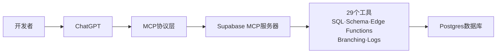

## 数据库成为AI的一等公民: Supabase集成ChatGPT的真正意义
  
### 作者  
digoal  
  
### 日期  
2026-05-21   
  
### 标签  
supabase , postgresql , chatgpt , mcp , db harness , 数据库 
  
----  
  
## 背景  
  

> 自然语言正在成为新的SQL，而MCP协议决定了谁能拿到这张船票。

2026年5月，Supabase官方集成进ChatGPT。表面看，这是一个"便利性提升"——开发者可以在ChatGPT里直接跑SQL、部署边缘函数。但这个事件的分量，远不止于此。

---

## 29个工具背后，是一次接口权力的转移

Supabase在ChatGPT里开放了29个工具，涵盖数据库操作、项目管理、分支迁移、边缘函数部署——这意味着**AI不再只是帮你写SQL的辅助工具，而是可以直接执行数据库基础设施层面的操作**。

这个转变的关键词是MCP（Model Context Protocol）。Anthropic在2024年底提出的这个协议，本质上是在解决一个根本问题：每个AI平台有各自的Function Calling格式，OpenAI、Anthropic、Google互不兼容——MCP要做的是成为AI世界的USB，让不同的AI工具能插进任何外部系统。

Supabase是第一个大规模押注这个协议的平台之一。这次集成进ChatGPT，意味着在ChatGPT的环境里，Supabase是默认的数据库选项——这对Supabase的战略意义，远超功能本身。

---

## 便利性只是副产品，真正的变化在于"AI可执行的边界"扩大了

之前的AI编程助手能做的，是在你描述需求后生成一段SQL代码，然后你复制粘贴到数据库执行。这是一个"建议-确认-执行"的三步流程。

Supabase集成之后，AI可以在对话里直接执行那些操作——Schema变更，AI直接跑；边缘函数部署，AI直接发。这中间省掉的不只是复制粘贴这个动作，而是**整个人工确认环节**。

随之而来的问题也很直接：**你愿意让AI直接在你的生产数据库上跑Schema变更吗？**

这个信任问题，才是Supabase这29个工具暴露出来的真正议题。GitHub已经在MCP服务器里加入了机密扫描，检测AI操作是否会把API密钥和凭证泄露出去。Supabase内置了三级安全体系，把危险操作（DROP TABLE之类）单独列为"破坏性"级别，需要二次确认。

这说明：整个行业正在从"AI生成代码，人类执行"转向"AI生成+执行，人类审计"。**可观测性和安全审计，会变成下一代数据库的标配能力。**

---

## MCP的赢家的诅咒

Supabase下注MCP，是一个聪明的策略——但这个策略有一个隐藏的假设：**MCP会成为行业标准**。

如果MCP成了，Supabase就是AI数据库的标配；如果MCP被另一个协议取代，Supabase的先发优势就成了沉没成本。

从目前看，这个赌注赢面不小。GitHub已经接入了MCP服务器，Google Drive、SharePoint、Teams这些微软系也在接入的路上。OpenAI在2025年6月正式宣布ChatGPT支持MCP协议。当行业最大的AI平台、最活跃的代码平台都站在MCP这边，这个协议的话语权已经很难被撼动了。

---

## 接下来该看什么

- MCP协议在企业侧的采纳率——有多少中型以上企业开始用MCP连接内部系统
- 各家数据库（PlanetScale、Neon、Firestore）是否会跟进推出MCP服务器
- AI执行数据库操作的出错率和人工介入比例——这是验证"AI真的能替代DBA执行权限"的核心指标

---

## 结论

Supabase集成进ChatGPT，表面上是一个产品功能，实际上是一个信号：**基础设施正在被重新定义——自然语言正在成为新的命令行，AI正在成为新的Shell**。

数据库、代码仓库、部署流水线……这些曾经需要人类用专门语言（SQL、Git、Dockerfile）操作的系统，未来将由AI通过MCP这类协议直接调用。Supabase站在了这个趋势的最前端，但这张船票的代价是——它必须赢，因为第二个进入这个生态位的玩家，不会有同样的战略位置。

---

## 参考来源

- [Supabase Is Now an Official ChatGPT App](https://supabase.com/blog/chatgpt-integration)（2026年5月8日）
- [MCP协议深度解析2026](https://blog.csdn.net/yonggeit/article/details/160904101)（CSDN，2026年5月16日）
- [GitHub推出MCP服务器集成](https://so.html5.qq.com/page/real/search_news?docid=70000021_8656a0ac35321952)（腾讯新闻，2026年5月18日）
- [ChatGPT新增开发者模式支持MCP](https://new.qq.com/rain/a/20250911A096Q500)（IT之家，2025年9月11日）
  
  
#### [PostgreSQL 解决方案集合](../201706/20170601_02.md "40cff096e9ed7122c512b35d8561d9c8")
  
  
#### [德哥 / digoal's Github - 公益是一辈子的事.](https://github.com/digoal/blog/blob/master/README.md "22709685feb7cab07d30f30387f0a9ae")
  
  
#### [About 德哥](https://github.com/digoal/blog/blob/master/me/readme.md "a37735981e7704886ffd590565582dd0")
  
  

  
