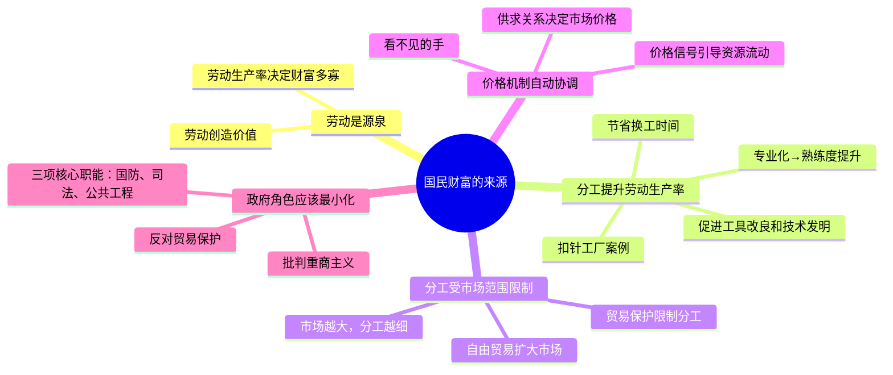

## 《国富论》读书笔记
  
### 作者  
digoal  
  
### 日期  
2026-05-21  
  
### 标签  
读书笔记 , 国富  
  
----  
  
## 背景  

---
书名: 《国富论》（The Wealth of Nations）  
作者: [英] 亚当·斯密  
译者: 唐日松 等  
出版社: 华夏出版社（2005年版）  
原版出版年份: 1776年  
笔记日期: 2026-05-21  
ISBN: 9787508036083  
标签: [经济学, 古典自由主义, 政治经济学, 分工, 市场, 启蒙思想]  
---

  

> **一句话**：一个道德哲学家用毕生观察写出的经济学宪法——它没有公式，却比任何公式都更接近真相。  
> **适合谁读**：想理解"市场到底是什么"的人；对经济学有偏见的人；读过凯恩斯但没读过斯密的人。  
> **阅读难度**：⭐⭐⭐⭐☆（篇幅巨大，逻辑严密，但语言生动）  
> **推荐指数**：⭐⭐⭐⭐⭐  

---

## 一、时代坐标：这本书从哪里来？

1776年3月9日，是人类历史上值得铭记的一天。

这一年发生了三件大事：詹姆斯·瓦特的蒸汽机进入批量生产，北美殖民地发表《独立宣言》，亚当·斯密出版《国富论》。巧合，还是时代的共鸣？也许二者皆有。一个旧世界正在崩塌，一个由机器、资本和自由个体构成的新世界正在成型，而斯密，站在这个转折点上，试图为新世界的运行立法。

斯密本是格拉斯哥大学的道德哲学教授，不折不扣的学者。这本书写作历时六年，修改三年，背后是数十年的观察、游历和思考。他游历法国，接触过重农学派的魁奈和杜尔阁；他观察英国工厂，看工人如何以近乎机械的重复动作换来养家糊口的报酬；他在苏格兰的港口看商人如何运货、计价、套利……这一切，最终凝结成726页厚重的文字。

他要解决一个根本问题：**国家的财富从哪里来？** 彼时流行的答案，要么是金银（重商主义），要么是土地（重农主义）。斯密说，都错了——财富来自**劳动**，来自劳动的分工与协作，来自一套允许个体自由追求利益的制度安排。

```
历史坐标轴

重商主义时代          斯密出版《国富论》        凯恩斯主义兴起
（16-17世纪）         1776年3月9日              1936年
    |                      |                        |
 金银=财富            劳动+分工=财富           市场+政府=均衡
 贸易顺差为王          看不见的手                看得见的手
    |                      |                        |
 重农主义时代         工业革命加速                大萧条冲击
（18世纪初）          北美独立                    自由主义危机
```

---

## 二、核心命题：作者在说什么？

《国富论》全书五篇，体量惊人，但核心论点其实可以提炼为三个相互嵌套的命题：

### 命题一：分工是财富的根源

斯密在第一章就亮出了底牌。他举了一个极为经典的例子——制针。一枚小小的针，涉及抽丝、拉直、切截、削尖、打磨、安装等十八道工序。一个人独立完成，一天或许造不出二十枚针；而当十个人各司其职、分工合作，一天可以生产四万八千枚以上。

这不只是效率问题，更是**文明问题**。斯密看到的是：分工推动专业化，专业化推动技术进步，技术进步推动生产力提升，最终富裕整个社会。他认为分工的深度取决于市场规模——市场越大，分工越细，财富越多。这是一个良性的飞轮，而自由贸易正是让这个飞轮转起来的风。

### 命题二："看不见的手"协调自利行为

这是《国富论》最著名、也最常被误读的概念。斯密说："屠夫、酿酒者和面包师傅，并不是因为想到我们的晚餐，才去做这些东西；他们这样做时，只想到自己的利益。"

但这里有一个关键的转折：**自利，并不等于损人。** 在竞争性市场中，每个追求自身利益的人，都被一只"看不见的手"引导着，无意间促进了社会整体的利益。价格机制就是这只手——短缺导致涨价，涨价吸引生产者，生产增加消除短缺，价格回归均衡。整个过程无需任何人的指挥，市场自己完成了资源配置。

这个洞见在今天听起来平常，在1776年却是革命性的。它从根本上质疑了国家干预经济的必要性。

### 命题三：重商主义是一场系统性骗局

斯密花了大量篇幅批判重商主义。他认为，把金银积累等同于财富是一个致命的混淆——金银只是财富的**符号**，真正的财富是可供消费的商品和服务。限制进口、补贴出口的贸易保护政策，表面上保护了本国生产者，实际上损害了广大消费者，最终拖累整个社会的财富增长。

他的逻辑链条清晰：**自由贸易 → 国际分工 → 各国专注于比较优势 → 全球财富总量增加**。这个逻辑，在250年后的今天依然构成国际贸易的理论基石。

---

## 三、论证地图：斯密怎么说服你的？



斯密的论证方式有几个鲜明特点：

**大量历史案例**：他不是在空谈理论，而是从英国、法国、荷兰、中国的贸易历史中提炼规律，让论点有血有肉。

**敏锐的日常观察**：制针工厂的案例不是他虚构的，而是实地考察的产物。这种从具体现象出发的归纳方式，让他的理论极具说服力。

**对反对意见的正面回应**：他没有回避重商主义者的论点，而是逐一拆解，这种论证的自信来自对材料的充分掌握。

---

## 四、前提假设与边界：什么情况下这不成立？

读《国富论》，需要留意斯密背后藏着的几个关键假设：

**假设一：竞争市场是常态。** 斯密的"看不见的手"只在竞争充分的市场里有效。一旦出现垄断，价格机制就会失灵——实际上斯密本人也批评了垄断，但他对垄断的系统性分析远不如他对竞争的分析深入。今天的科技巨头、平台经济，正是斯密框架应付起来最吃力的地方。

**假设二：信息是透明的。** 价格引导资源，前提是市场参与者能够获取足够的信息。信息不对称（买方和卖方掌握的信息不同）的问题，在斯密的框架里基本缺席，这要等到阿克洛夫、斯蒂格利茨一代人才被系统处理。

**假设三：外部性可以忽略。** 工厂的污染、金融的系统风险、碳排放……这些"一个人的行动伤害了不参与交易的人"的情况，在斯密的时代还不突出，但在今天已经是经济政策的核心难题。市场无法自动定价外部性，这是"看不见的手"最大的盲区。

这些假设并不能推翻斯密，但提醒我们：市场是解决经济问题的最强大工具，但不是唯一工具。

---

## 五、思想谱系：这本书在哪个传统里？

```
思想上游（斯密的来源）
    ├── 弗朗西斯·哈奇森（道德哲学）
    ├── 大卫·休谟（经验主义）
    └── 法国重农学派（魁奈、杜尔阁）

              ↓

     亚当·斯密《国富论》（1776）
     古典自由主义经济学的奠基

              ↓

思想下游（受斯密影响）
    ├── 大卫·李嘉图（比较优势理论，完善自由贸易论）
    ├── 约翰·斯图亚特·密尔（功利主义经济学）
    ├── 卡尔·马克思（继承劳动价值论，然后颠覆之）
    ├── 阿尔弗雷德·马歇尔（新古典经济学）
    └── 弗里德里希·哈耶克（20世纪自由市场最有力的捍卫者）
```

斯密是英国苏格兰启蒙运动的核心人物，他的经济学从来没有脱离道德哲学。他的另一部巨作《道德情操论》（1759年）探讨同情心与道德判断，与《国富论》构成了一个完整的人性理论——人既有同理心，也有自利心；社会道德靠同情心维系，市场效率靠自利心驱动。这两本书是一个整体，割裂来读，都会误解斯密。

19世纪德国历史学派提出"斯密问题"，认为两本书的人性假设相互矛盾。但这个批评今天大体被认为站不住脚——斯密只是描述了人类行为的两个不同侧面，而非两种矛盾的人性。

---

## 六、我学到了什么？

读《国富论》最大的震撼，不在于具体的经济理论，而在于**斯密看问题的方式**。

**第一个收获：财富是流量，不是存量。** 一个国家是否富裕，不看它的金库里有多少金子，而看它每年能生产多少商品和服务，能让多少人过上体面的生活。这个看起来朴素的道理，在1776年是需要与整个时代的偏见对抗的。今天我们用GDP衡量财富，背后的逻辑正是斯密奠定的。

**第二个收获：制度比勤劳更重要。** 斯密在书中提到中国，说中国是世界上土地最肥沃、人民最勤劳的国家，但却停滞了数百年。原因在于制度——当法律和制度无法保护私有产权、无法保障自由交换，再勤劳的人也无法将努力转化为持续的财富增长。这个判断在今天依然振聋发聩。

**第三个收获：自利与道德并不天然对立。** 我们常有一种直觉：追求个人利益是自私的，是道德上有瑕疵的。但斯密告诉我们，在有效的市场制度下，自利恰恰是推动社会进步的引擎。真正的问题不是消灭自利心，而是建立好的规则，让自利心的释放有利于而非损害他人。这个洞见，在今天的企业管理、公共政策设计中，都有深刻的应用价值。

---

## 七、举一反三：这个框架还能用在哪？

斯密的核心方法论——**从分工和激励结构理解任何系统的效率**——几乎可以迁移到任何组织场景：

**企业管理**：一家公司内部的部门分工，本质上是斯密逻辑的缩影。流水线、外包、平台经济，都是分工理论在不同技术条件下的演化。当你思考"这件事该自己做还是外包"时，你在用斯密的框架。

**职业选择**：专注于自己的比较优势，而非追求全能，是国际贸易理论对个人的启示。做你能做得最好（或者机会成本最低）的事，其他的交换给市场。

**政策评估**：每当政府出台某项干预政策，斯密式的追问是：这个干预是在弥补市场失灵，还是在制造新的扭曲？受益者是广大消费者，还是少数有组织的生产者利益集团？

---

## 八、批判与反思

《国富论》是伟大的，但也是有时代局限的。

**斯密低估了市场失灵的普遍性。** 他生活在一个相对简单的商品市场时代，没有遇到金融衍生品、系统性风险、网络效应……这些现象中，价格机制的自动修正能力极为有限，甚至会放大崩溃。2008年金融危机，就是"看不见的手"在复杂系统中彻底失灵的案例。

**劳动价值论的困境。** 斯密认为商品的价值由劳动决定，这个命题后来引发了巨大的理论争议。马克思继承并激进化了这个逻辑；边际革命则从另一个方向绕开了它——价值不由劳动投入决定，而由消费者的边际效用决定。今天主流经济学基本抛弃了劳动价值论，但斯密提出这个问题本身，依然有其意义。

**对不平等的忽视。** 斯密关注的是财富**总量**的增长，对财富**分配**的不平等着墨不多。市场可以有效扩大蛋糕，但不保证公平切分。250年后，不平等已经成为自由市场最严峻的政治挑战，这是斯密框架的一个重大盲区。

斯密值得批评，但更值得理解：他是用18世纪的工具，试图回答人类永恒的问题。他做到了一件了不起的事——把市场从神秘和道德谴责中解放出来，赋予它一个理性的解释框架。这本身，就是一场思想革命。

---

## 九、金句与记忆点

> **"分工的程度，总是受到交换能力大小的限制，也就是受到市场广狭的限制。"**
> 解析：市场规模决定了分工能走多深。这就是为什么开放市场、自由贸易对一国经济如此关键——它扩大了"市场"，从而扩大了分工的空间。

> **"屠夫、酿酒者和面包师傅，并不是因为想到我们的晚餐，才去做这些东西；他们这样做时，只想到自己的利益。"**
> 解析：这不是对自私的颂扬，而是对人性的务实接受。好的制度设计，不依赖人的高尚，而是利用人的自利。

> **"劳动是衡量一切商品交换价值的真实尺度。"**
> 解析：斯密劳动价值论的核心，为后来马克思的政治经济学批判提供了起点，也引发了经济学界最持久的理论争议之一。

> **"中国一向是世界上最富有的国家……然而，许久以来，它似乎就停滞于静止状态了。"**
> 解析：斯密的中国观折射出他的制度分析——财富增长需要制度土壤，光靠勤劳和资源远远不够。

> **"每个人都在力图应用他的资本，来使其产品得到最大的价值。一般地说，他并不企图增进公共福利，也不知道他所增进的公共福利为多少。被一只看不见的手引导着，去实现一种他并无意图实现的目的。"**
> 解析："看不见的手"只出现在《国富论》中这一处，却成了自由市场经济学最著名的隐喻。斯密自己恐怕也没想到，这句话会被后人引用250年。

---

## 十、延伸阅读

**《道德情操论》— 亚当·斯密**
先读这本，再读《国富论》，才能真正理解斯密。他不是一个冷酷的市场原教旨主义者，而是一个关心人类福祉的道德哲学家。

**《国家为什么会失败》— 达龙·阿西莫格鲁、詹姆斯·罗宾逊**
从制度经济学的视角，系统回答"为什么有的国家富有，有的国家贫穷"——这恰恰是斯密最初提出的问题，用现代数据和框架重新解答。

**《经济学原理》— 阿尔弗雷德·马歇尔**
新古典经济学的奠基作，将斯密的定性分析转化为数学框架，是理解现代主流经济学如何从斯密演化而来的关键文本。

**《就业、利息和货币通论》— 约翰·梅纳德·凯恩斯**
斯密的最大挑战者。他没有否定市场，但证明了市场在宏观层面会系统性失灵，政府干预是必要的。读完这本书，才真正理解斯密的边界在哪里。

**《资本论》（第一卷）— 卡尔·马克思**
马克思从斯密的劳动价值论出发，推导出完全相反的结论。无论你同意马克思与否，这本书都是理解斯密被如何继承和颠覆的必读文本。

---

*笔记写于 2026-05-21 | 基于公开资料与深度思考整理*
*参考资料：维基百科《国富论》词条、中国社会科学网、澎湃新闻、财新博客、知乎精选长评*
  
  
#### [PostgreSQL 解决方案集合](../201706/20170601_02.md "40cff096e9ed7122c512b35d8561d9c8")
  
  
#### [德哥 / digoal's Github - 公益是一辈子的事.](https://github.com/digoal/blog/blob/master/README.md "22709685feb7cab07d30f30387f0a9ae")
  
  
#### [About 德哥](https://github.com/digoal/blog/blob/master/me/readme.md "a37735981e7704886ffd590565582dd0")
  
  

  
