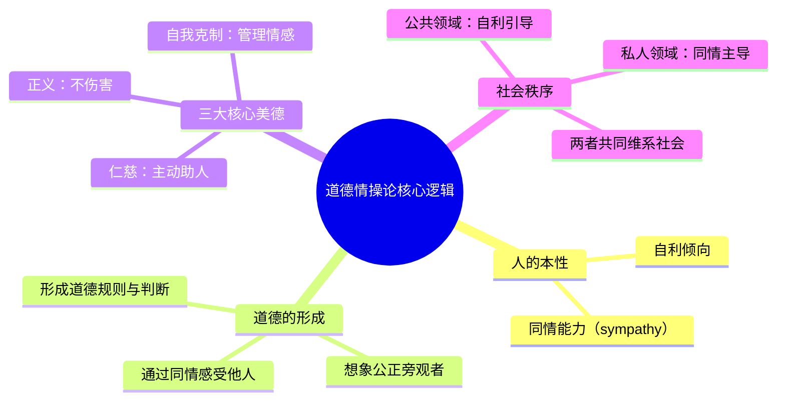
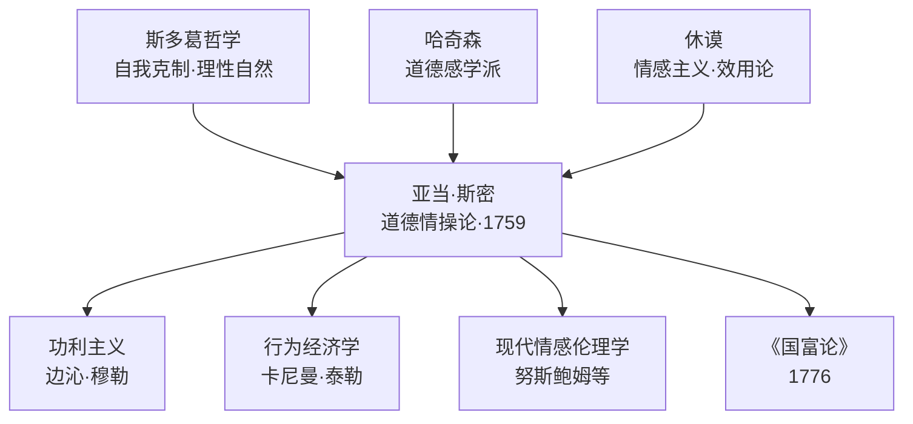

## 《道德情操论》读书笔记
  
### 作者  
digoal  
  
### 日期  
2026-05-21  
  
### 标签  
读书笔记 , 道德情操论    
  
----  
  
## 背景  
  
---
书名: 《道德情操论》  
作者: [英] 亚当·斯密  
出版年份: 1759（原著），2021（张春明译本）  
出版社: 经济管理出版社  
ISBN: 9787509680575  
笔记日期: 2026-05-21  
标签: [伦理学, 道德哲学, 经济思想史, 苏格兰启蒙运动, 情感主义]  
---

  

> **一句话**：人类道德的根基不是理性，不是戒律，而是我们天生就有的与他人「共情」的能力——以及那个住在每个人心中、冷静旁观自己行为的「公正的陌生人」。  
> **适合谁读**：对「人为什么会做好事」这个问题感到困惑的人；读过《国富论》想了解斯密全貌的人；对经济学与道德的关系感兴趣的人。  
> **阅读难度**：⭐⭐⭐⭐☆（18世纪英文哲学风格，中译版有一定门槛，建议对照多个译本）  
> **推荐指数**：⭐⭐⭐⭐⭐  

---

## 一、时代坐标：这本书从哪里来？

1759年，格拉斯哥大学的道德哲学教授亚当·斯密出版了他的第一部主要著作《道德情操论》。这一年，距法国大革命还有三十年，距《国富论》还有十七年。英国正处于工业革命的早期，城市扩张、贸易繁荣，旧有的封建道德秩序开始松动——人们越来越频繁地和陌生人打交道，越来越依赖市场而非血缘。

这带来了一个迫切的哲学问题：**如果人天生自私，社会秩序从何而来？道德约束是外部强加的（教会？国王？），还是人性本身就有某种内在的善？**

斯密所处的苏格兰启蒙运动正在激烈讨论这些问题。他的老师哈奇森（Francis Hutcheson）认为人有天生的「道德感」，他的好友休谟（David Hume）则把道德建立在「效用」和「同情」之上。斯密在继承这两人的基础上，走得更远——他要建造一套完整的、以同情为基石的道德体系。

值得注意的是：斯密一生对《道德情操论》修订了六次，直到去世前不久完成第六版的修订。《国富论》是在修《道德情操论》的过程中完成的。这意味着，在斯密心目中，**《道德情操论》才是他思想大厦的地基，《国富论》不过是这座大厦的一翼。**

```
时间轴：
1723 ──── 斯密生于苏格兰柯科迪
1748 ──── 在爱丁堡开始公开讲授修辞学
1751 ──── 就任格拉斯哥大学教授
1759 ──── 《道德情操论》第一版出版
1763 ──── 辞去教职，游历法国，结识魁奈、杜尔哥
1776 ──── 《国富论》出版
1790 ──── 去世前完成《道德情操论》第六版，同年辞世
```

---

## 二、核心命题：作者在说什么？

### 命题一：同情（Sympathy）是道德的第一块砖

斯密开篇第一句话就是一个挑衅：「无论人被认为有多自私，在他的本性中显然存在某些原理，使他对他人的命运产生兴趣，将他人的幸福视为自己的必需，尽管他除了看到它之外一无所得。」

这里的「同情」（sympathy）不是通俗意义上的「可怜别人」，而更接近**共情**（empathy）——我们能够想象自己处于他人处境，从而感受到他人的情感，不论喜怒哀乐。

斯密打了一个生动的比方：当我们看到一个人被虐待，我们会下意识地缩紧自己的身体。我们并没有直接受苦，但我们「进入」了他的感受。这种能力，是人类道德生活的起点。

### 命题二：「公正旁观者」——住在心中的道德裁判

这是斯密最精彩、最有原创性的概念。

我们为什么会感到羞耻或骄傲？因为我们在评价自己时，会习惯性地**想象一个没有利益牵涉的局外人**会怎么看我们的行为。斯密把这个想象中的人称为「公正的旁观者」（impartial spectator）。

这个旁观者不是神，也不是某个具体的人，而是我们在长期社会化过程中内化的一种道德视角。它就像一面镜子，让我们能够「从外部」看到自己的行为。

```
自我感受（主观）
       ↓ 反思
想象公正旁观者如何评价
       ↓ 内化
形成道德判断 → 调整行为
```

这个概念极其现代——它预示了弗洛伊德的「超我」，预示了乔治·米德（G.H. Mead）的「概化他人」，也和当代行为经济学中的「他人视角」研究高度吻合。

### 命题三：美德的三位一体——正义、仁慈与自我克制

在斯密看来，道德生活由三种核心美德支撑：

- **正义（Justice）**：不伤害他人。这是最低限度的道德要求，也是社会存续的底线。斯密认为正义可以强制执行。
- **仁慈（Beneficence）**：主动帮助他人。这是道德的更高层次，但不能强制，只能靠内心的同情驱动。
- **自我克制（Self-command）**：管理自己的情感与欲望。这是美德的根基，没有自我克制，同情会变成滥情，正义会变成冲动。

三者关系是：正义是社会运转的地板，仁慈是锦上添花的天花板，自我克制是贯穿始终的承重墙。

---

## 三、论证地图：作者怎么说服你的？



斯密的论证路径有几个特点值得注意：

**大量用心理学案例**。他不停地举例：人们为何尊敬富人？为何赞美英雄？为何对受害者的过度悲伤感到不自在？每个例子都像一次小小的心理实验，引导读者自我观察。

**不依赖神学或理性主义**。斯密刻意绕开了「上帝命令论」和「纯粹理性道德」，这在18世纪是相当大胆的。他把道德建立在可观察的人类情感上，使得道德哲学第一次真正具有「经验科学」的质地。

**论证有时流于循环**。批评者指出，斯密说道德源于公正旁观者的判断，但公正旁观者的判断标准又来自社会共识——这有点像在说「道德是因为大家都觉得这是道德」，缺乏终极锚点。

---

## 四、前提假设与边界：什么情况下这不成立？

### 假设一：人天生具有同情能力

斯密把同情视为人类的「自然情感」，几乎是普遍存在的。但这个假设今天受到了挑战——进化心理学发现，同情往往是「圈内偏向」的：我们对亲人、同族的同情远强于对陌生人。斯密也承认同情会随距离衰减，但他没有充分解决这个问题。

### 假设二：公正旁观者是中立的

斯密理论的一个核心弱点：这个「公正旁观者」实际上是被社会文化塑造的。在奴隶制社会，公正旁观者可能认为奴役他人是正常的。公正旁观者无法超越它所处的文化局限，这意味着斯密的道德体系在面对历史性的道德进步时，解释力不足——它能解释道德「维持」，但很难解释道德「革命」。

### 假设三：情感与理性可以自我协调

斯密相信，通过公正旁观者的内化反思，情感和理性可以达到平衡。但现代行为经济学（卡尼曼等人的研究）表明，人类的情感偏见系统性地扭曲理性判断，且很难通过自我反思纠正。斯密对人类自我克制能力的信心，可能过于乐观。

---

## 五、思想谱系：这本书在哪个传统里？



斯密深受**斯多葛派**影响，书中大量引用马可·奥勒留，强调自我克制和理性审视。他从**哈奇森**处继承了「道德感」的概念，从**休谟**处借来了情感主义的框架，但他不满足于休谟把道德归结为「效用」——因为效用无法解释我们为何同情失败者，而失败者对我们并无用处。

《道德情操论》对后世影响深远。努斯鲍姆（Martha Nussbaum）的情感伦理学直接引用斯密；行为经济学家们（Ashraf, Camerer, Loewenstein）专门写论文论证斯密是最早的「行为经济学家」——他的「公正旁观者」本质上是一种内部的「计划者」，对抗短视的冲动型「执行者」。

---

## 六、我学到了什么？

**第一：道德不是外部强加的，而是从人际关系中生长出来的。**斯密让我意识到，道德直觉并不神秘——它是我们在无数次与他人互动中，观察、模仿、被评价、被反馈，最终内化的一套感知系统。道德不是从天上掉下来的戒律，而是社会生活的沉淀物。这个视角让道德问题变得可以讨论、可以分析，而不是非此即彼的教条之争。

**第二：「公正旁观者」是一个极其有用的思维工具。**每当我面对道德困境，或者要做一个可能伤害他人的决策，斯密给了我一个实操方法：想象一个对我没有任何利益关联的理性旁观者，他会怎么评价我的行为？这不是完美的解法，但它强制我走出自我中心的视角，效果非常显著。

**第三：同情的「共鸣」原理解释了很多社会现象。**为什么人们迷恋富人和名人的生活？斯密说，因为我们想象自己在他们的位置，会感受到极大的愉悦，所以对他们产生了「同情式的羡慕」。这解释了消费主义、网红经济、身份焦虑——斯密在两百多年前就写清楚了。

---

## 七、举一反三：这个框架还能用在哪？

**产品设计与用户同理心**。斯密的「同情」逻辑对产品经理极有启发：真正理解用户，不是问他们「你想要什么」，而是身临其境地感受他们的处境、挫折和期待。这种「情境进入」正是设计思维的核心。

**职场冲突处理**。当你和同事或老板产生矛盾时，斯密的「公正旁观者」是很好的调解工具：暂时离开自己的立场，想象一个不了解内情的第三方，他会认为哪一方的行为更可辩护？这个练习往往能打破情绪僵局。

**理解「道德绑架」的本质**。所谓道德绑架，本质上是用一个不公正的「旁观者」——比如「你应该无私」——来要求他人。斯密提醒我们，真正公正的旁观者会考虑当事人的处境和能力，而不是用抽象标准要求所有人表现一致。

---

## 八、批判与反思

**最大的局限：文化相对性问题。** 斯密的道德体系本质上是社会共识的系统化，但社会共识本身可能是有偏见甚至是有害的。18世纪的英国社会存在殖民主义、对妇女的系统性压迫……斯密的「公正旁观者」对这些视而不见（或者说，他的旁观者本身也是那个时代的产物）。这是情感主义伦理学的根本困境：它能解释道德如何运行，但无法提供超越时代的道德标准。

**对自我克制的过度信任。** 斯密相信理性的公正旁观者能管住情感，但现代神经科学告诉我们，情感和理性的边界远比斯密想象的模糊。我们的「公正旁观者」常常被情绪劫持，而我们浑然不觉。这是《道德情操论》理论体系的一个软肋。

**阶级视角的缺失。** 斯密注意到人们倾向于钦佩富人、同情他们的处境，但他把这归为人性的一种自然偏差，却没有进一步追问：这种偏差是否被统治阶级系统性地利用和放大？这个问题留给了后来的马克思去回答。

---

## 九、金句与记忆点

> **「无论人被认为有多自私，在他的本性中显然存在某些原理，使他对他人的命运产生兴趣。」**
> ——斯密用这句话开篇，是对霍布斯「人对人是狼」的正面反击。人不是纯粹自私的，但这个「不自私」并不依赖上帝或理性，而是来自情感本身。

> **「我们渴望被爱，也渴望值得被爱。」**
> ——斯密认为这是人类行为的两大驱动力，前者是社会认可的欲望，后者是道德自尊的渴望。两者缺一不可。

> **「正义是社会大厦的主要支柱。」**
> ——仁慈可以缺失，社会还能勉强维系；但一旦正义崩塌，社会将在顷刻间土崩瓦解。一句话道出了法治的底层逻辑。

> **「贫困是可耻的，不是因为它使人痛苦，而是因为它使人不可见。」**（意译）
> ——斯密对社会排斥的洞察：真正的贫困之苦不是物质匮乏，而是被社会目光所忽视、所遗忘，这是同情体系失灵时最残酷的后果。

> **「公正旁观者不是一个真实的人，而是我们自己内心的理性声音。」**
> ——这句话点出了道德内化的本质：道德规范不需要外部执法者，当它成功内化之后，我们自己就是自己的法官。

---

## 十、延伸阅读

1. **《国富论》—— 亚当·斯密**
   读完《道德情操论》后读《国富论》，你会看到两书之间深刻的对话关系：同情→道德（私人领域）；自利→市场（公共领域）。两书合读，才是完整的斯密。

2. **《休谟的道德哲学》—— 大卫·休谟**（选读《道德原理研究》）
   斯密的直接对话者。休谟把道德建立在效用和同情上，斯密在此基础上做了重要修正。读完可以清楚理解「斯密问题」的思想背景。

3. **《善的脆弱性》—— 玛莎·努斯鲍姆**
   当代情感伦理学的代表作，努斯鲍姆继承并发展了斯密的情感主义传统，论证情感在道德判断中不可或缺的地位。

4. **《思考，快与慢》—— 丹尼尔·卡尼曼**
   从行为科学视角检验斯密的假设。卡尼曼的研究既印证了斯密对情感的重视，也揭示了斯密对「自我克制」和「公正旁观者」的过度乐观。

5. **《人性的善面：历史上的暴力减少》—— 史蒂芬·平克**（Better Angels of Our Nature）
   斯密式问题的历史答案：人类社会的道德确实在扩展，同理心的范围在慢慢拓宽——这为斯密的情感主义提供了宏观历史证据。

---

*笔记写于 2026-05-21 | 基于公开学术资料与深度思考整理，不代表任何机构观点*
  
  
#### [PostgreSQL 解决方案集合](../201706/20170601_02.md "40cff096e9ed7122c512b35d8561d9c8")
  
  
#### [德哥 / digoal's Github - 公益是一辈子的事.](https://github.com/digoal/blog/blob/master/README.md "22709685feb7cab07d30f30387f0a9ae")
  
  
#### [About 德哥](https://github.com/digoal/blog/blob/master/me/readme.md "a37735981e7704886ffd590565582dd0")
  
  

  
