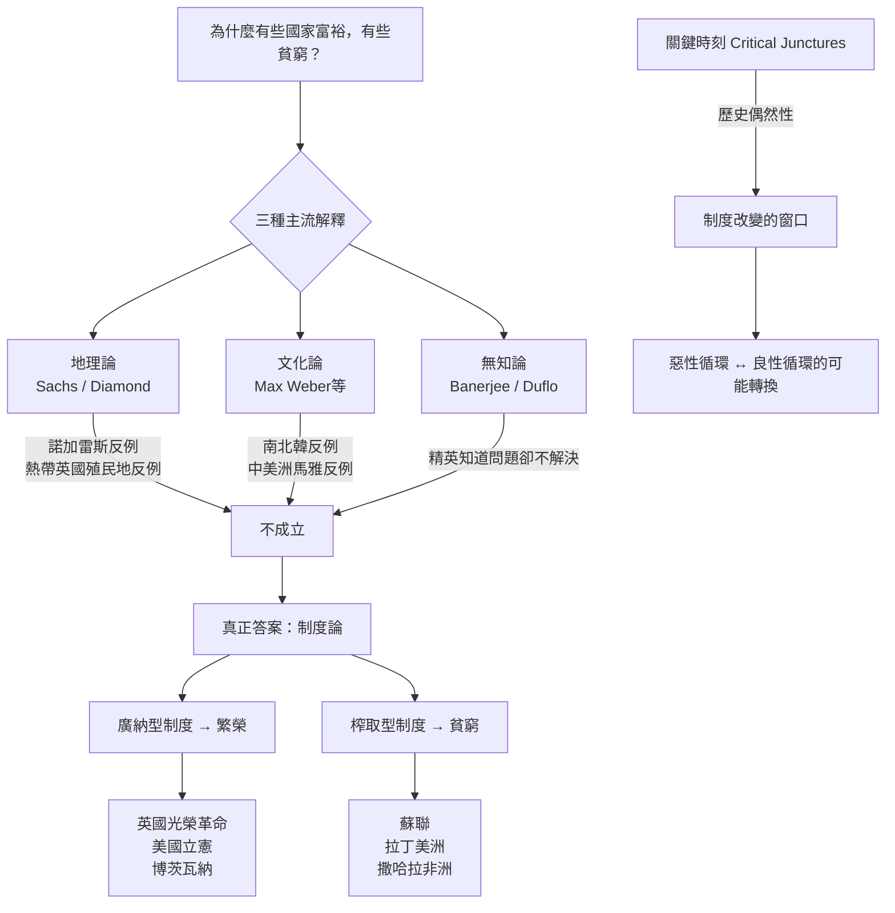

## 《國家為什麼會失敗: 權力、富裕與貧困的根源》读书笔记
  
### 作者  
digoal  
  
### 日期  
2026-05-21  
  
### 标签  
读书笔记 , 國家為什麼會失敗: 權力、富裕與貧困的根源    
  
----  
  
## 背景  
  
---
書名: 《國家為什麼會失敗：權力、富裕與貧困的根源》【諾貝爾獎紀念版】  
作者: 戴倫·艾塞默魯（Daron Acemoglu）/ 詹姆斯·羅賓森（James A. Robinson）  
出版社: 衛城出版  
出版年份: 2025-05-28（諾貝爾獎紀念版）  
原著出版年: 2012  
譯者: 吳國卿、鄧伯宸  
笔记日期: 2025-05-21  
ISBN: 9786267645352  
標籤: [政治經濟學, 制度論, 發展經濟學, 全球史, 諾貝爾獎]  
---

  

> **一句話**：國家的貧富，不是上天注定，不是地理宿命，而是「制度選擇」的結果——是人造出了貧窮，也是人可以終結貧窮。  
> **適合誰讀**：想理解世界貧富差距根源的人；對政治、歷史、經濟有興趣的讀者；正在思考台灣或任何社會走向的公民。  
> **閱讀難度**：⭐⭐⭐☆☆  
> **推薦指數**：⭐⭐⭐⭐⭐  
  
---

## 一、時代坐標：這本書從哪裡來？

2012年，《國家為什麼會失敗》問世於一個世界躁動的年代。埃及茉莉花革命剛剛落幕，解放廣場的群眾高喊著「終結貪腐」；中國以驚人速度崛起，西方媒體熱議「北京共識」是否將取代「華盛頓共識」；金融海嘯的後遺症尚未散去，從希臘到墨西哥，人們開始重新質問：究竟是什麼讓一些國家富裕，另一些永遠貧窮？

艾塞默魯是MIT的土耳其裔經濟學家，2005年已獲克拉克獎（被視為諾貝爾獎搖籃）；羅賓森則是哈佛的政治學者，長期田野調查非洲與拉丁美洲。兩人合作超過十五年，在學術圈的地基已深，這本書是他們將研究成果轉化為大眾讀物的嘗試——一次雄心勃勃的理論出擊。

2024年，兩人（連同Simon Johnson）因此研究獲得諾貝爾經濟學獎。本書的諾貝爾獎紀念版，在此背景下於台灣重新出版，恰逢台灣處於民主鞏固與地緣政治壓力的交叉點，格外具有現實意義。

```
時間軸：制度論的知識譜系

道格拉斯·諾斯（1993諾貝爾獎）
  → 奠定「制度決定經濟表現」的基礎框架
  
艾塞默魯 & 羅賓森（2001年關鍵論文）
  → 用殖民地死亡率作為工具變數，量化制度的因果效應
  
《國家為什麼會失敗》（2012）
  → 將制度論大眾化，挑戰地理論與文化論
  
2024 諾貝爾經濟學獎
  → 「制度如何形成並影響繁榮」正式獲得最高學術認可
```

---

## 二、核心命題：作者在說什麼？

### 命題一：決定貧富的是制度，不是命運

本書最核心的主張只有一個，但震撼力十足：**一個國家的窮富，根本原因不在地理、氣候、文化或種族，而在於它選擇了什麼樣的政治與經濟制度。**

諾加雷斯（Nogales）是最有說服力的開場：一座城市被美墨邊界一分為二，南北居民語言相同、祖先相同、氣候相同，但美國側的諾加雷斯年均所得是墨西哥側的三倍。唯一的差異，是邊界兩側適用不同的制度。

### 命題二：廣納型 vs. 榨取型——制度的兩種面孔

作者提出一套二分框架，成為全書的骨幹：

**廣納型制度（Inclusive Institutions）**
- 經濟面：保護財產權、執行合約、允許競爭，讓更多人分享機會
- 政治面：權力分散、法治健全、防止精英壟斷決策
- 結果：激勵創新、支持「創造性破壞」，帶來長期繁榮

**榨取型制度（Extractive Institutions）**
- 經濟面：資源被少數精英截取，多數人缺乏激勵
- 政治面：權力集中，精英保護自身利益，抵制任何可能威脅其地位的變革
- 結果：可以有短期增長（如蘇聯），但因缺乏創新動力，終將停滯或崩潰

### 命題三：歷史的偶然性——關鍵時刻決定路徑

制度不是一成不變的，但改變需要「關鍵時刻」（critical junctures）——重大歷史事件打破舊有均衡，使新制度有機會成形。英國的光榮革命（1688年）、美國的獨立建國，都是廣納型制度得以確立的關鍵時刻。問題在於，同樣的外部衝擊（如黑死病、殖民接觸），在不同地方卻帶來截然不同的制度結果——這正是歷史的偶然性在發揮作用。

---

## 三、論證地圖：作者怎麼說服你的？



**三步論證拆解：**

**第一步，排除競爭對手。** 全書第二章幾乎整個用來擊倒地理論和文化論。對地理論，作者用「同一緯度，不同命運」反駁；對文化論，用南北韓、中美洲馬雅文明的分化對照反駁。這一步雖然有些流於簡化，但方向是正確的。

**第二步，建立正面理論。** 廣納/榨取的二分架構清晰有力，並輔以大量歷史案例：威尼斯的商業共和國怎樣因統治精英關閉政治通道而衰落；英格蘭怎樣因為議會力量制衡王權而崛起；蘇聯的計劃式增長為何無法持續。

**第三步，解釋為何惡性循環難以打破。** 精英不肯讓渡權力，因為一旦放權，就無法保證自身的既得利益——這是一個政治承諾問題（commitment problem），是本書最有理論深度的一塊。

---

## 四、前提假設與邊界：什麼情況下這不成立？

本書提出了一個宏大而優美的理論，但優美往往意味著有所簡化。以下是我認為值得審視的三個前提：

**假設一：「廣納型制度」等同於自由民主政體**

作者的框架隱含了一個前提：廣納型制度基本上就是西方式民主法治。然而，東亞的例外令人困惑。新加坡在威權體制下創造了驚人的繁榮；台灣和南韓的起飛，也發生在並不那麼「廣納」的威權時期。對此，作者的標準回答是：這些國家後來都走向了更廣納的制度——但這個說法有點事後解釋的嫌疑。

**假設二：制度的自主性——制度是因還是果？**

作者強調制度是富裕的「原因」，但批評者指出：會不會是因為富裕，社會才有條件建立好制度？文化、地理、自然資源可能並非毫不重要，而是透過影響制度來間接影響繁榮。地理論者賈德·戴蒙就對本書提出了這樣的批評——他認為作者過於決絕地排除了地理因素的輔助角色。

**假設三：二分法是否過於粗糙？**

廣納型/榨取型是一條光譜，而非截然的二分。現實中大多數國家都處於灰色地帶：中國的市場經濟制度有廣納的成分，但政治制度保持高度榨取性。作者對中國增長的預測（終將因制度矛盾而停滯）在本書出版後十餘年裡顯得爭議不斷——中國的增長雖已放緩，但並未如預期般快速崩潰。

---

## 五、思想譜系：這本書站在誰的肩膀上？

本書最重要的知識先祖是諾貝爾獎得主**道格拉斯·諾斯（Douglass North）**——諾斯在1990年代奠定了「制度是經濟表現關鍵決定因素」的基礎框架，艾塞默魯與羅賓森在此基礎上加入了政治制度的維度，並提供了更嚴謹的因果識別策略（利用殖民者死亡率作為歷史工具變數）。

本書的論戰對象包括：支持地理論的**賈德·戴蒙**（《槍炮、病菌與鋼鐵》）與**傑弗里·薩克斯**；支持文化論的**馬克斯·韋伯**傳統；支持技術援助論的**班納吉與杜芙若**（2019諾貝爾獎得主）。

對後世的影響：本書和相關學術論文促使發展經濟學主流從「技術性政策干預」轉向「政治制度改革」，重新激活了「政治決定經濟」這一古老命題的現代學術生命。

---

## 六、我學到了什麼？

閱讀這本書，有三個收穫讓我久久無法放下。

**第一個收穫：貧窮是被製造的，不是命定的。**

這個洞見比乍看更具顛覆性。長期以來，「非洲天然貧困」「熱帶地區發展困難」這類說法在直覺上讓人覺得合理。但艾塞默魯和羅賓森告訴我們：那些繁榮與貧窮的差距，背後往往有精英集團主動構建的制度在維持。貧窮不是無能，是壓迫的結果。這個視角既殘酷又充滿行動潛力。

**第二個收穫：「創造性破壞」為什麼令統治者恐懼。**

書中有一個反覆出現的邏輯：榨取型制度的統治者往往反對創新，哪怕創新能讓整個社會更富有。原因在於創新同時會改變權力結構，而權力的喪失，對精英來說是不可接受的代價。這解釋了為什麼奧匈帝國曾經阻止鐵路建設（怕農奴得以流動），也解釋了為什麼一些現代威權政府積極推動經濟發展但嚴格控制政治空間——他們正在下一場制度的「精算賭博」。

**第三個收穫：台灣的位置，不只是地理上的。**

讀這本書時，我不斷想到台灣。台灣的制度轉型（從1987年解嚴到2000年政黨輪替）是一個相對和平的廣納化過程，這是難得的。但廣納型制度並非一勞永逸——作者明確指出，民主可能被「綁架」成為實質的權貴政治；法治可以退化。台灣的民主品質、司法獨立性、政治精英的自我約束，是每一代公民需要持續守護的東西。

---

## 七、舉一反三：這個框架還能用在哪？

**企業治理**：一家公司的「廣納型」意味著什麼？決策機制是否允許內部反對聲音，是否有制衡機制防止創辦人獨裁？許多家族企業在第一代創辦人離世後崩潰，正是因為「榨取型」公司治理——資源被少數人掌控，缺乏激勵人才留下的機制。

**城市發展**：為什麼有些城市（如台北、首爾、新加坡）能夠從二流城市躍升為全球樞紐，而另一些城市停滯不前？城市層級的制度設計——土地制度、居住自由、商業登記難易度——同樣適用這個框架。

**個人職涯**：在哪種組織環境下工作，你的創造力才能被廣納而非被榨取？一個健康的組織應當保護你的「財產權」（你的想法和成果歸你所有），並且擁有多元聲音的決策機制。

---

## 八、批判與反思

如果我要對本書提出批評，有三點我認為是真實的弱點：

**一、重複感過強。** 全書接近600頁，但核心論點其實在前三分之一已經表達完畢。後面的大量歷史案例有時讓人感覺在循環印證同一個結論，而非在深化理論。

**二、對「廣納性」的定義缺乏精確。** 廣納型制度究竟需要什麼條件才能成立？如果台灣、南韓、新加坡都算廣納型，那廣納性究竟是政治民主的特定形式，還是只要有足夠的財產保護就算？這個邊界在書中並不清晰。

**三、忽略了全球政治經濟的結構性因素。** 本書的分析框架是以民族國家為單位，但許多發展中國家的制度困境，與全球金融體系、殖民遺產的深層結構密切相關。單純要求「建立廣納型制度」，而不處理IMF貸款條件、跨國企業的角色，可能是一種方便的但過於單純化的政策建議。

---

## 九、金句與記忆點

**1. 「國家失敗，是因為它們有榨取性的經濟制度，而這些制度又被榨取性的政治制度所支撐。」**
→ 本書最核心的命題——政治與經濟制度是相互強化的，一種制度不能孤立改變。

**2. 「創造性破壞」（Creative Destruction）**
→ 借自熊彼得，意指真正的經濟發展必然顛覆舊的利益格局——而這正是榨取型政治精英最害怕的事。

**3. 諾加雷斯（Nogales）的開場**
→ 同一座城市，邊界兩側截然不同的命運——這是全書最有力的思想實驗。

**4. 「鐵律的關鍵時刻」**
→ 歷史不是線性的，制度可以在危機時刻被重塑，但機會稍縱即逝。理解何時是「關鍵時刻」，是一種政治智慧。

**5. 蘇聯增長的幻象**
→ 榨取型制度也可以動員資源創造短期增長（蘇聯的五年計劃），但缺乏創新激勵，終將停滯。外表的繁榮可能是深層制度脆弱的遮羞布。

**6. 「廣納型民主可能被綁架成實質上的權貴政治」**
→ 選舉不等於廣納型制度，民主的形式不等於民主的實質——這一提醒在民粹主義盛行的今天格外重要。

---

## 十、延伸閱讀

1. **《槍炮、病菌與鋼鐵》賈德·戴蒙**
   → 地理論的最佳代言作品，與本書形成直接思想對話，兩書一起讀，更能理解這場重要的學術爭論。

2. **《暴力與社會秩序》道格拉斯·諾斯、約翰·沃利斯、貝瑞·溫格斯特**
   → 本書的知識前輩，更細膻地分析「有限進入秩序」vs.「開放進入秩序」的歷史演變。

3. **《為什麼國家會失敗之後》艾塞默魯 & 羅賓森（Power and Progress / The Narrow Corridor）**
   → 作者後續的延伸之作，處理國家、社會與自由的動態平衡，是本書的進階版。

4. **《貧窮的本質》班納吉 & 杜芙若**
   → 從微觀角度切入貧窮問題，是本書宏觀制度論的有益互補——對本書持懷疑態度的讀者，讀完可以取得更完整的視野。

5. **《民主國家如何死亡》史蒂芬·李維茲基 & 盧肯·齊布拉特**
   → 聚焦廣納型制度的「退化」問題，研究民主怎樣從內部被侵蝕，是本書在當代政治焦慮中的最佳配套讀物。

---

*筆記寫於 2025-05-21 | 基於公開書評、學術資料與深度思考整理*
*本筆記引用之學術觀點均來自公開發表的書評與作者著作，不代表對任何具體政治立場的背書*
  
  
#### [PostgreSQL 解决方案集合](../201706/20170601_02.md "40cff096e9ed7122c512b35d8561d9c8")
  
  
#### [德哥 / digoal's Github - 公益是一辈子的事.](https://github.com/digoal/blog/blob/master/README.md "22709685feb7cab07d30f30387f0a9ae")
  
  
#### [About 德哥](https://github.com/digoal/blog/blob/master/me/readme.md "a37735981e7704886ffd590565582dd0")
  
  

  
