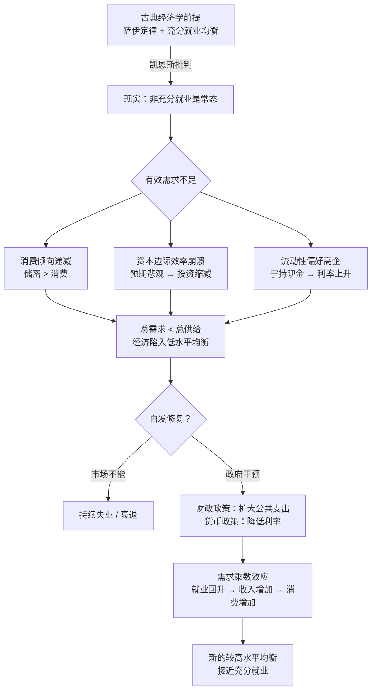
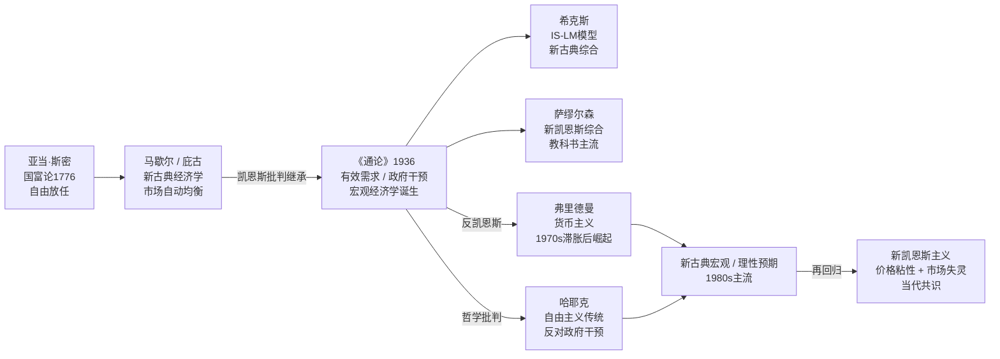

## 《就业、利息和货币通论》读书笔记
  
### 作者  
digoal  
  
### 日期  
2026-05-21  
  
### 标签  
读书笔记 , 就业、利息和货币通论     
  
----  
  
## 背景  
  
---
书名: 《就业、利息和货币通论》  
作者: [英] 约翰·梅纳德·凯恩斯  
出版年份: 1936（原版）/ 2011（陕西人民出版社中译版）  
笔记日期: 2026-05-21  
ISBN: 9787224094299  
豆瓣评分: 8.8  
标签: [经济学, 宏观经济, 凯恩斯主义, 就业理论, 货币理论, 政治经济学]  
---

  

> **一句话**：当市场失灵、失业漫延时，政府不应袖手旁观——这是凯恩斯用一本书重写现代经济学的底层逻辑。  
> **适合谁读**：对宏观经济政策感兴趣的普通读者；想理解政府"刺激经济"背后逻辑的人；经济学入门者（需有一定耐心）。  
> **阅读难度**：⭐⭐⭐⭐☆（原著晦涩，建议配合导读）  
> **推荐指数**：⭐⭐⭐⭐⭐  
  
---

## 一、时代坐标：一个时代的伤口，催生一部巨著

1929年10月，纽约华尔街股市崩盘，像一颗石子投入平静的湖面，引发了席卷全球的经济大萧条。此后数年，美国工业产值腰斩，贸易额锐减，超过四分之一的劳动人口失业，人们在面包房门前排起长队。英国也未能幸免——早在大萧条之前，英国经济已在一战后的短暂繁荣之后陷入长达十年的低迷，失业率始终高企。

面对这一切，当时主流的古典经济学家们给出的答案是：**等待**。

他们相信市场会自我修复。工资下降，劳动力价格降低，企业会重新招人；利率调整，储蓄会重新流向投资。这套理论在教科书上无懈可击，但在现实中却对眼前的惨状束手无策。正是在这个背景下，凯恩斯于1936年出版了《就业、利息和货币通论》（以下简称《通论》）。

约翰·梅纳德·凯恩斯（1883—1946）不是象牙塔里的纯粹学者。他在布鲁姆斯伯里的文人圈子里如鱼得水，在金融市场上亲自操盘，在英国财政部任职，参与了凡尔赛条约的谈判（并因反对苛刻条款愤而辞职）。他看到的，是一个被理论与现实之间的鸿沟所撕裂的时代。

他写这本书，是要做一件大事：**从根源上推翻旧理论的前提假设，重建经济学的大厦。**

```
时间轴：凯恩斯与《通论》的诞生

1919  ──→  1926  ──→  1930  ──→  1933  ──→  1936
巴黎和会    《自由放任   《货币论》   大萧条     《就业、利息
凡尔赛条约  主义的终结》  出版        最低谷     和货币通论》
（辞职抗议）（开始批判   （货币理论    失业率     正式出版
            自由放任）   雏形）       25%+       引发"凯恩斯革命"
```

---

## 二、核心命题：凯恩斯究竟在说什么？

### 命题一：市场不会自动出清，失业是常态而非例外

古典经济学建立在一个著名的前提上，即"萨伊定律"——供给创造它自己的需求。生产出来的商品总会找到买家，工人总会找到工作，市场会趋向充分就业的均衡。

凯恩斯说：这是错的，或者说，这只在极其特殊的情况下成立。

他指出，现实中的均衡**往往是低于充分就业的均衡**——有大量工人愿意以当前工资工作，却找不到工作，这种"非自愿失业"并非工人懒惰或者工资太高，而是整个经济体的有效需求不足。因此，他把自己的理论称为"一般理论"（General Theory）——因为它既能解释充分就业的特殊情形，也能解释更普遍的非充分就业状态。

### 命题二：有效需求不足，根源在于三大心理规律

为什么有效需求会不足？凯恩斯归结为三个基本心理因素，这是全书的核心机制：

**① 消费倾向递减**：随着收入增加，人们消费的比例会下降，储蓄的比例会上升。也就是说，富裕起来的社会，消费需求的增长赶不上生产能力的增长，需求缺口由此而生。

**② 资本边际效率递减**：投资者对未来收益的预期天然偏悲观，且预期会随市场情绪剧烈波动。一旦信心崩溃（正如1929年），资本边际效率会骤然跌落，投资需求随即萎缩。凯恩斯认为，这是经济危机爆发的最关键因子。

**③ 流动性偏好**：人们对货币本身有特殊的偏好——持有现金意味着安全和灵活性。当不确定性上升时，人们宁愿持有货币而非投资，这推高了利率，进一步压制了投资。

三者叠加的结果：储蓄 > 投资，总需求不足，经济陷入低水平均衡，失业成为常态。

### 命题三：政府必须出手，用需求管理打破低水平均衡

既然市场自身无法修复，谁来填补那个需求缺口？

凯恩斯的答案是：**政府**。通过财政政策（扩大公共支出、赤字财政）直接注入需求，通过货币政策（降低利率）刺激投资。他甚至有个著名的思想实验：雇人挖坑，再雇另一批人把坑填上，也比让人们失业强——因为收入产生消费，消费带动生产，生产创造就业，形成正向乘数效应。

他还说了一句此后被反复引用的话：**"从长期来看，我们都是死人。"（In the long run, we are all dead.）** 这句话不是虚无主义，而是在批评古典派"等市场自我修复"的惰性——人在失业，你却说等长期均衡？那是在等死。

---

## 三、论证地图：凯恩斯如何建构他的理论体系



**论证方式评价**：凯恩斯的论证有两个显著特点。其一是**以心理学为基础**——他把经济行为的根源归结为人的心理倾向，而非纯粹的理性计算，这在当时相当超前。其二是**自上而下**的宏观视角——他关心的是整体产出和就业，而非单个市场的价格出清，这开创了现代宏观经济学的研究范式。

希克斯后来将《通论》图形化，发明了IS-LM模型，将凯恩斯晦涩的文字转化为可操作的分析工具，极大地加速了凯恩斯理论的传播与教学应用。

---

## 四、前提假设与边界：什么情况下凯恩斯不成立？

《通论》的理论大厦建立在几个关键假设之上，理解这些假设，是批判性阅读的前提。

**假设一：短期分析框架。** 凯恩斯的模型是短期静态的，他假定技术、资本存量和制度结构不变，只分析在此框架下总需求如何决定产出和就业。这在大萧条的紧迫情境下是合理的，但长期来看，供给侧的结构性因素同样至关重要。

**假设二：价格和工资存在黏性（刚性向下）。** 凯恩斯隐含地假设工资和价格不会迅速下调——这是他反驳"工资下降→就业恢复"逻辑链条的基础。在现实中，这个假设有相当的合理性，但在弹性更高的劳动力市场中，结论可能有所不同。

**假设三：政府干预是中性且有效的。** 凯恩斯假设政府能够准确判断时机、有效传导政策效果。但现实中存在认知滞后、政策滞后、挤出效应（政府借贷推高利率压制私人投资）等问题。

**边界在哪里**：凯恩斯主义政策在需求不足型衰退中最为有效（如大萧条、2008年金融危机）。但面对供给侧冲击（如1970年代的石油危机）或结构性问题（产业转型、技术失业），单纯刺激需求可能引发滞胀（高通胀+高失业并存），这是凯恩斯理论无法回答的难题。

---

## 五、思想谱系：《通论》在哪个传统里？



凯恩斯在剑桥受教于马歇尔，深谙古典传统，但大萧条逼迫他成为这个传统最彻底的批判者。他的革命性在于：**在不否定微观经济学的前提下，建立了一套独立的宏观分析框架**——这是前无古人的。

《通论》被后世与亚当·斯密的《国富论》、马克思的《资本论》并列为经济学说史上最重要的三本著作，不是因为它提供了所有答案，而是因为它**提出了正确的问题**。

凯恩斯之后，宏观经济政策成为一门独立的艺术。此后数十年，西方资本主义国家的黄金时代（1950—1970年代初），很大程度上建立在凯恩斯主义政策实践的基础之上。

---

## 六、我学到了什么？

读完《通论》（以及大量围绕它的解读），我最深的感受是：**这是一本关于"认知框架更新"的书，不只是一本经济学教材。**

**收获一：从"特殊"到"一般"的思维方式。**凯恩斯给这本书起名"通论"，是因为他认为旧理论只是特例，而他提供的是更一般的框架。这种思维方式极具启发性——任何既有理论，都可能只是某种特殊条件下的近似，识别它的边界条件，才是真正的理解。

**收获二：心理预期在经济中的核心地位。**凯恩斯把"对未来的预期"置于经济分析的中心，这在当时相当前卫。我们今天习以为常的"市场信心"、"消费者信心指数"，背后都有凯恩斯的影子。经济不只是资源的物理流动，更是人心的结晶。

**收获三："短期"的政治意义。**凯恩斯说"我们都会死"，不是玩世不恭，而是一种政治哲学立场——政策服务的对象是活着的人，不是未来教科书里的抽象均衡。这提醒我们：经济学不是纯粹的技术，而是嵌入在时代与政治之中的。

---

## 七、举一反三：这个框架还能用在哪？

**场景一：理解疫情后的政府"大撒钱"。** 2020年以来，各国政府大规模财政刺激，本质上就是凯恩斯主义的现代实践——面对需求骤然萎缩，政府出手填补缺口。理解《通论》的框架，你就能更清楚地评估这些政策的逻辑与局限。

**场景二：企业层面的"有效需求"逻辑。** 一家公司生产了优质产品，但如果目标用户没有购买力，产品照样卖不出去。"供给好就一定有市场"是微观版的萨伊定律，同样可能是错的。需求侧的分析在商业中同样有效。

**场景三：个人储蓄与社会总量的"合成谬误"。** 凯恩斯提出了著名的"节俭悖论"——个人多储蓄是理性的，但如果所有人都多储蓄，总需求收缩，经济反而萎缩，所有人都变穷。这种"个体理性、集体非理性"的逻辑，在很多社会现象中都能找到影子。

---

## 八、批判与反思

**哪里我不同意？** 凯恩斯把有效需求不足归结为三大心理因素，有一定的心理学洞察，但这个框架过于静态，忽视了制度、权力结构、国际贸易等深层因素。大萧条的成因极为复杂（货币主义者弗里德曼后来有力地证明，美联储的货币紧缩才是大萧条的主因之一），凯恩斯的解释并非唯一正确的叙事。

**时代已经变了哪里？** 《通论》写于一个相对封闭的国民经济时代，政府扩大支出能够有效地在本国经济内循环产生乘数效应。在今天深度全球化的世界，财政刺激的效果可能大量"漏出"到进口商品，乘数效应被大幅削弱。

**最大的局限性：** 凯恩斯主义无法解释"滞胀"。1970年代，石油危机导致通胀与失业同时升高，这完全超出了凯恩斯框架的解释能力——在他的模型里，通胀和失业是跷跷板关系，不应该同时发生。这一失败引发了此后数十年的理论革命，并最终催生了新凯恩斯主义对原版理论的大规模修正。

**一个根本性的哲学张力：** 凯恩斯相信政府有能力、也有意愿做出正确判断——这是一个相当乐观的政治假设。哈耶克的反驳恰好打在这里：谁能保证政府比市场更聪明？干预的代价，可能不只是经济效率损失，更是权力的不断扩张。这场争论至今没有终结，而这恰恰说明《通论》提出的问题，仍然是我们这个时代最核心的问题之一。

---

## 九、金句与记忆点

**1. "从长期来看，我们都是死人。"**
> 这句话被误解为悲观主义，实为务实主义宣言：政策必须解决眼前的苦难，而不是把希望寄托在遥远的市场自愈。

**2. "困难不在于新思想，而在于摆脱旧思想。"**（凯恩斯序言）
> 最深刻的智识困境：旧框架不是被新知识击败的，而是被认知者主动放下的。这不只是经济学的问题。

**3. "节俭悖论"：个体理性 + 集体非理性 = 社会灾难**
> 每个人省钱是对的，但大家都省钱，消费萎缩，经济崩溃，最终所有人都更穷。合成谬误是凯恩斯留给我们最有用的思维工具之一。

**4. "有效需求"：不是有钱买，而是真的愿意花钱买**
> 有购买力 + 有购买意愿 = 有效需求。这两个条件缺一不可，也是为什么光靠"让人有钱"不一定能刺激经济。

**5. "资本的边际效率"：预期是投资的核心驱动力**
> 投资不只看当下利润，更看未来预期。信心崩溃时，哪怕利率降到零，也可能没人愿意投资——这就是"流动性陷阱"。

**6. "乘数效应"：一块钱政府支出，可能带来多倍GDP增长**
> 政府花1块钱，工人拿到收入，去消费；商家拿到销售额，去采购；供应商拿到钱，再雇人……这就是为什么"挖坑再填坑"在极端情形下也有经济价值。

---

## 十、延伸阅读

**1. 《凯恩斯传》——罗伯特·斯基德尔斯基**
最权威的凯恩斯传记，三卷本，将凯恩斯的思想演变与生命经历完美融合。想真正理解《通论》，了解这个人比只读这本书更重要。

**2. 《通往奴役之路》——弗里德里希·哈耶克**
凯恩斯最强劲的思想对手。哈耶克不只是在反对政府干预，而是从自由主义的根基上提出了一套截然不同的世界观。两本书对照阅读，收获倍增。

**3. 《货币数量论》/《美国货币史》——米尔顿·弗里德曼**
货币主义的奠基之作。弗里德曼对大萧条的解释与凯恩斯截然不同，是理解现代宏观经济学争论绕不开的文本。

**4. 《动物精神》——乔治·阿克洛夫 & 罗伯特·希勒**
用行为经济学重新激活凯恩斯的心理学洞察，将"动物精神"（信心、公平感、腐败、货币幻觉等非理性因素）纳入宏观经济分析，是《通论》在21世纪的精神续作。

**5. 《萧条经济学的回归》——保罗·克鲁格曼**
2008年金融危机后，诺贝尔经济学奖得主克鲁格曼重新捡起凯恩斯主义旗帜，分析为什么凯恩斯仍然是我们理解现代经济危机最重要的工具。可读性极强，适合入门。

---

*笔记写于 2026-05-21 | 基于公开资料与深度思考整理*
*本笔记融合了经济学文献、学术评论与个人思考，不构成投资或政策建议*
  
  
#### [PostgreSQL 解决方案集合](../201706/20170601_02.md "40cff096e9ed7122c512b35d8561d9c8")
  
  
#### [德哥 / digoal's Github - 公益是一辈子的事.](https://github.com/digoal/blog/blob/master/README.md "22709685feb7cab07d30f30387f0a9ae")
  
  
#### [About 德哥](https://github.com/digoal/blog/blob/master/me/readme.md "a37735981e7704886ffd590565582dd0")
  
  

  
