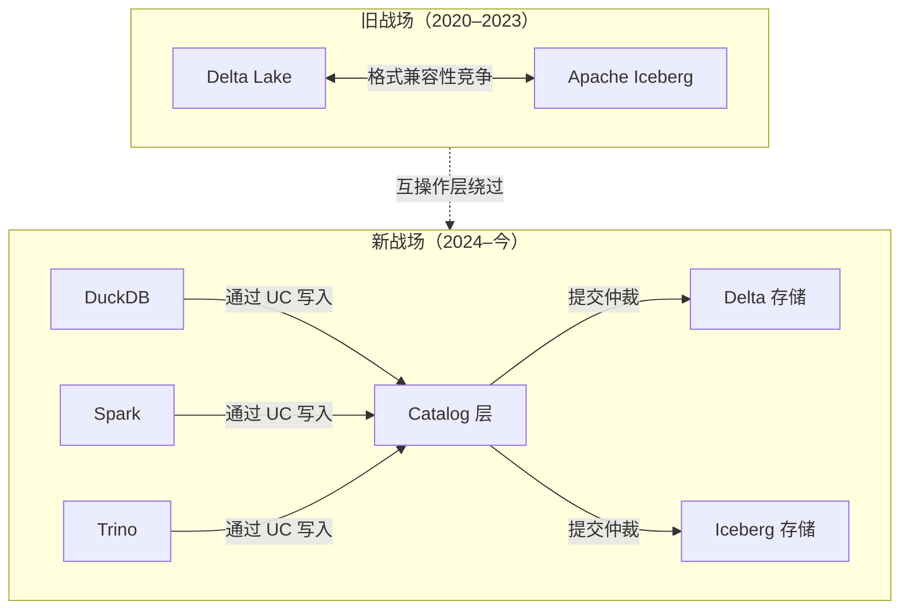
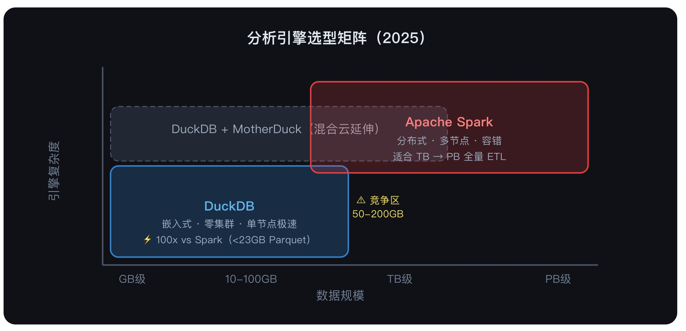
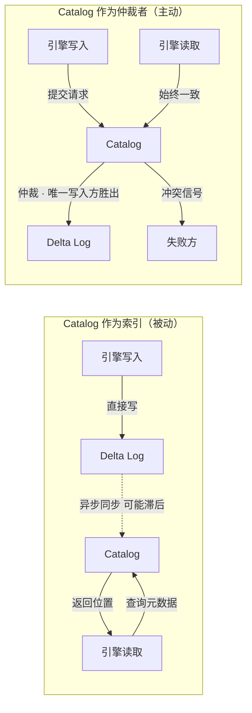

## 格式战已死, DuckDB 面临自由与生态的选择
  
### 作者  
digoal  
  
### 日期  
2026-05-22   
  
### 标签  
DuckDB , Delta , Iceberg , 格式 , 控制面 , catalog , catalog commits , databricks , unity catalog 
  
----  
  
## 背景  

格式战已死，但新的战场没人告诉你

五年前，数据工程师最常做的选择题是：Delta 还是 Iceberg？

这个问题已经失去意义。不是因为有了赢家，而是因为战场被悄悄换了。

 

## 一场没有打完就结束的仗

截至 2025 年 4 月，Delta Lake 的 GitHub 仓库有 7,900 颗星、364 名贡献者；Apache Iceberg 有 7,100 颗星、572 名贡献者。两者几乎打平。与此同时，Apache XTable（前身 OneTable）和 Delta UniForm 已经让两种格式之间的元数据互转成为日常操作——你写 Delta，Snowflake 读 Iceberg，两边都不需要知道对方在用什么。

格式战的底层假设，是"写入格式决定读取生态"。这个假设在 2023 年之前大致成立。但互操作层的成熟，让存储格式本身变成了接近透明的基础设施——就像你不会因为磁盘用 NTFS 还是 ext4 而影响 Python 能不能跑。

真正有意思的问题因此变成：如果格式不重要，**谁来决定哪条 INSERT 语句最终写进去**？

 

## 控制平面才是真正的护城河

DuckDB 最近为 Delta 扩展加入写入支持，技术层面没有悬念：INSERT 语句、事务提交、Parquet 文件生成。但让这件事变得有战略分量的，不是写入本身，而是写入**通过 Unity Catalog 完成**这个细节。

具体机制是：每次 DuckDB 写入一张被 Unity Catalog 管理的表，数据不会直接落到 Delta log，而是先在 `_staged_commits/` 目录暂存，再向 Unity Catalog 注册，由 Catalog 仲裁这个版本归属哪个写入方。20 个并发 worker 同时写同一张表，最终只有 5 个成功，其余 15 个收到明确的冲突信号。

这个机制有个名字：Catalog Commits（目录提交）。Databricks 在 2025 年将其正式上线，描述它解决的问题时用了一个词——"split-brain"（脑裂）：外部引擎直接写 Delta 存储，绕过 Catalog，导致 Catalog 的元数据与真实表状态悄悄分叉，其他引擎看到的是过期视图，审计日志出现漏洞。

脑裂问题本质上是**事务可见性问题**：谁是提交的权威判断者？Delta 格式本身选择了"文件系统"做仲裁——谁先写进 `_delta_log` 谁赢。这在单引擎场景下没问题，在多引擎并发场景下会产生幻觉——明明有两个引擎都以为自己成功写入了。

Iceberg 的设计从一开始就把这个职责放在 Catalog 层，Catalog 原子性地交换元数据指针，存储层只存数据。Unity Catalog 的 Catalog Commits 事实上是在让 Delta 追上这个架构——把仲裁权从文件系统移交给 Catalog。

DuckDB 接入这套机制，意味着它愿意让出"直接写存储"的自由，换取在多引擎生态中成为一等公民的资格。

 

## 嵌入式分析引擎的真实位置

DuckDB 的性能数据已经被广泛引用：在 16GB 内存的笔记本上，处理本地 Parquet 的简单聚合查询，它比 Spark 快约 100 倍；50GB 到 500GB 的 OLAP 聚合场景，端到端延迟通常比 Spark 低 3 到 10 倍，主要收益来自省掉了集群调度和 shuffle 的开销。

但这些数字有个前提：**数据已经在本地或近端**。

Spark 的设计起点是"数据太大，单机放不下"。DuckDB 的设计起点是"单机比你想象的强大得多，而且大多数查询根本不需要集群"。两者的分歧不在于谁更快，而在于对"数据规模分布"的不同预判。2025 年的工作站标配 128GB 内存，NVMe 顺序读取速度超过 7GB/s，DuckDB 的向量化执行引擎能把 CPU 缓存利用率推到极限——这个硬件基础在五年前并不存在。

<svg viewBox="0 0 680 320" xmlns="http://www.w3.org/2000/svg" font-family="sans-serif">
  <!-- 背景 -->
  <rect width="680" height="320" fill="#0f1117" rx="12"/>
  <!-- 标题 -->
  <text x="340" y="36" text-anchor="middle" fill="#e2e8f0" font-size="15" font-weight="bold">分析引擎选型矩阵（2025）</text>
  <!-- 坐标轴 -->
  <line x1="100" y1="260" x2="600" y2="260" stroke="#4a5568" stroke-width="1.5"/>
  <line x1="100" y1="260" x2="100" y2="60" stroke="#4a5568" stroke-width="1.5"/>
  <!-- 轴标签 -->
  <text x="340" y="295" text-anchor="middle" fill="#718096" font-size="12">数据规模</text>
  <text x="55" y="165" text-anchor="middle" fill="#718096" font-size="12" transform="rotate(-90,55,165)">引擎复杂度</text>
  <!-- X轴刻度 -->
  <text x="130" y="278" text-anchor="middle" fill="#718096" font-size="11">GB级</text>
  <text x="250" y="278" text-anchor="middle" fill="#718096" font-size="11">10-100GB</text>
  <text x="400" y="278" text-anchor="middle" fill="#718096" font-size="11">TB级</text>
  <text x="560" y="278" text-anchor="middle" fill="#718096" font-size="11">PB级</text>
  <!-- DuckDB 区域 -->
  <rect x="108" y="160" width="240" height="92" fill="#3182ce" fill-opacity="0.25" rx="8" stroke="#3182ce" stroke-width="1.5"/>
  <text x="228" y="205" text-anchor="middle" fill="#63b3ed" font-size="13" font-weight="bold">DuckDB</text>
  <text x="228" y="222" text-anchor="middle" fill="#a0aec0" font-size="10">嵌入式 · 零集群 · 单节点极速</text>
  <text x="228" y="238" text-anchor="middle" fill="#a0aec0" font-size="10">⚡ 100x vs Spark（&lt;23GB Parquet）</text>
  <!-- DuckDB + MotherDuck 延伸 -->
  <rect x="108" y="100" width="340" height="55" fill="#2d3748" fill-opacity="0.6" rx="8" stroke="#4a5568" stroke-width="1" stroke-dasharray="5,3"/>
  <text x="278" y="127" text-anchor="middle" fill="#a0aec0" font-size="12">DuckDB + MotherDuck（混合云延伸）</text>
  <!-- Spark 区域 -->
  <rect x="310" y="75" width="280" height="92" fill="#e53e3e" fill-opacity="0.2" rx="8" stroke="#e53e3e" stroke-width="1.5"/>
  <text x="450" y="120" text-anchor="middle" fill="#fc8181" font-size="13" font-weight="bold">Apache Spark</text>
  <text x="450" y="138" text-anchor="middle" fill="#a0aec0" font-size="10">分布式 · 多节点 · 容错</text>
  <text x="450" y="154" text-anchor="middle" fill="#a0aec0" font-size="10">适合 TB → PB 全量 ETL</text>
  <!-- 重叠区标注 -->
  <text x="378" y="198" text-anchor="middle" fill="#f6e05e" font-size="10">⚠ 竞争区</text>
  <text x="378" y="212" text-anchor="middle" fill="#f6e05e" font-size="10">50-200GB</text>
</svg>

这张图描述的是静态快照。动态趋势是：DuckDB 的可用区间在向右扩张，MotherDuck 的云原生版本已经把单次查询的数据上限推到了数 TB。Spark 的左边界同样在收缩——越来越多的团队发现，100GB 以下的日常分析任务用 Spark 是在用大炮打蚊子。

两者的收敛点大约在 200GB 到 1TB 之间。在这个区间里，哪个引擎赢不取决于引擎本身，而取决于**数据在哪儿、治理层支不支持、延迟要求是多少**。

 

## Catalog 层的隐藏假设

现在的技术叙事喜欢把 Unity Catalog 描述为"治理工具"——管权限、做审计、看血缘。这个描述没有错，但遮住了更重要的一件事：Catalog 正在成为**数据湖的提交仲裁者**，而不只是查询时的元数据索引。

这两个角色的差别极大。

查询时索引是被动的：引擎来问，Catalog 告诉它表在哪里、有哪些列、谁有权限。引擎拿到信息自己去读数据，Catalog 不介入后续过程。

提交仲裁者是主动的：每一次写入，在数据对外可见之前，必须经过 Catalog 的确认。Catalog 掌握的不只是"现在的状态"，还有"下一个状态由谁来决定"。这个权力，在分布式系统里叫做**控制平面**。

Databricks 在 Catalog Commits 的上线公告里承认了旧模式的问题：多引擎并发写入时，Unity Catalog 的元数据会"悄悄偏离真实表状态"。这句话翻译过来是：旧版本的 Unity Catalog 在写入路径上不是控制平面，只是附属物。

Catalog Commits 把这个漏洞补上了，但同时带来一个约束：**跨表原子性目前不存在**。同一个 BEGIN/COMMIT 块里写两张表，每张表各自独立提交，没有两段提交（2PC）保证整体原子性。这对需要跨表事务的业务来说，仍然是个需要在应用层手工处理的问题。

这个约束是不是致命的，取决于你的数据架构。宽表设计（把多个实体的字段合并成一张大表）可以规避跨表原子性问题，但会牺牲模式灵活性。规范化设计（多张小表）在一致性上有更高要求，目前要么依赖 Spark 的分布式事务，要么自己写补偿逻辑。

 

## 可观测的未来信号

上面的分析建立在一个推断上：数据湖的竞争重心已经从格式层转移到 Catalog 层。这个推断能不能成立，可以观测以下几个信号：

**信号一：Catalog 锁定程度**
如果未来两年，企业迁移数据湖的主要障碍从"格式转换"变成"Catalog 元数据迁移"，说明 Catalog 成功地成为了新的护城河。反之，若格式转换工具（XTable、UniForm）继续商品化，Catalog 只是透明层，则说明控制平面的竞争还没有收敛到某个玩家。

**信号二：非 Spark 引擎的写入占比**
Databricks 生态目前 96% 的 Iceberg 用户在用 Spark。若 DuckDB、Trino、Flink 等引擎通过 Catalog Commits 写入的比例在 2026 年显著上升（比如超过 20%），说明"引擎多元化写入"的叙事成立，Catalog 真正扮演了协调者角色。

**信号三：跨表事务支持的优先级**
Unity Catalog 目前只支持单表级 Catalog Commits。若 Databricks 或 OSS 社区在 2026 年把跨表原子性列为高优先级，说明多表事务的用户需求已经超过了架构成本；若没有推进，说明宽表设计路线已经成为事实标准，跨表事务被视为 edge case。

 

## 一个没有答案的问题

DuckDB 接入 Unity Catalog，是嵌入式分析引擎第一次在写入路径上服从 Catalog 的仲裁权。这个选择代价明确：放弃直接写存储的自由，换取在多引擎环境中的一致性保证。

问题是：**一旦 Catalog 成为提交的守门人，Catalog 的选择就决定了数据生态的边界。**

DuckDB 押注的是 OSS Unity Catalog 的开放性——它基于 Apache 2.0 协议，可以自托管，不绑定 Databricks。但 OSS Unity Catalog 和 Databricks Unity Catalog 之间的功能差距是真实存在的，两者的商业利益也并不总是一致。

开放格式解决了数据的可迁移性。Catalog 层的开放性还没有被充分验证。

当存储层的锁定被消除之后，治理层的锁定会不会悄悄填补那个空位？

  
  
#### [PostgreSQL 解决方案集合](../201706/20170601_02.md "40cff096e9ed7122c512b35d8561d9c8")
  
  
#### [德哥 / digoal's Github - 公益是一辈子的事.](https://github.com/digoal/blog/blob/master/README.md "22709685feb7cab07d30f30387f0a9ae")
  
  
#### [About 德哥](https://github.com/digoal/blog/blob/master/me/readme.md "a37735981e7704886ffd590565582dd0")
  
  

  
