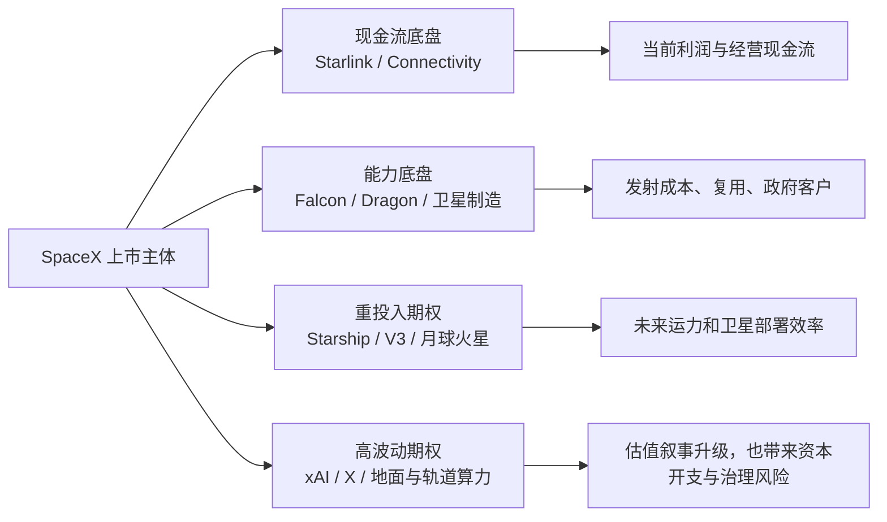
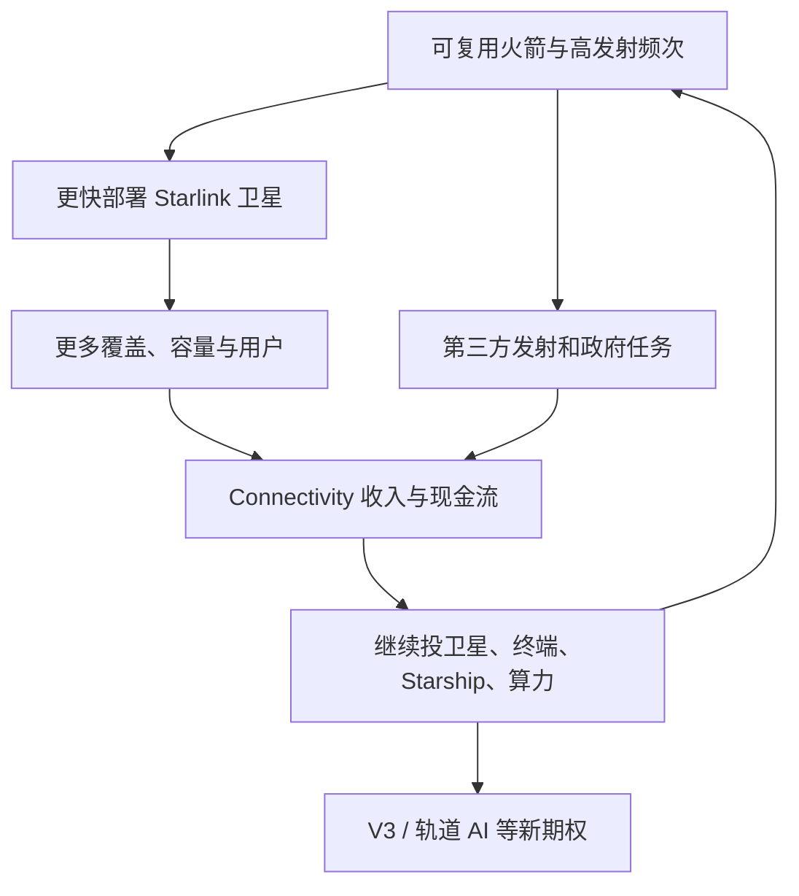
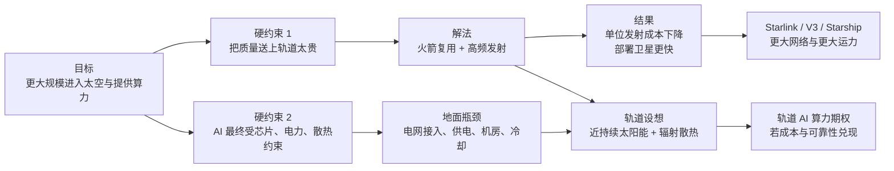
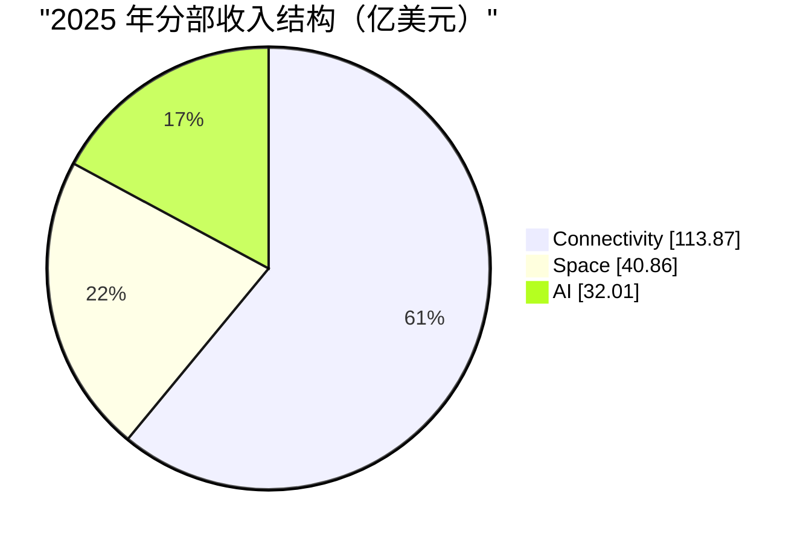
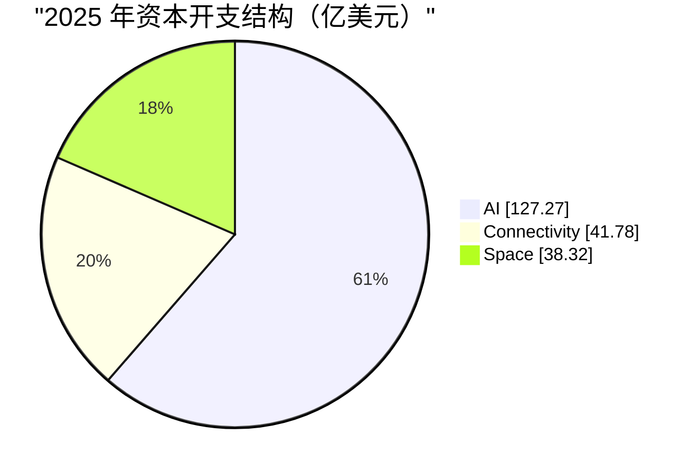
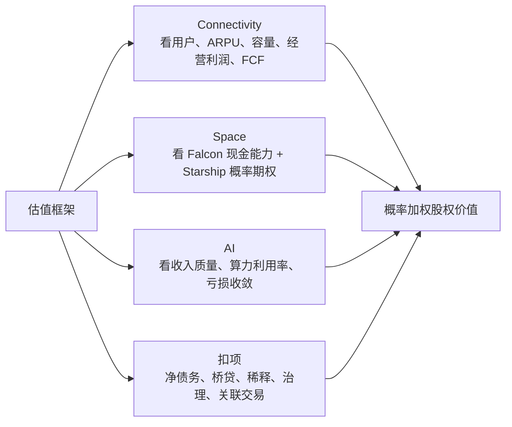

## 人类史上最大IPO: SpaceX招股书最全解读
  
### 作者  
digoal  
  
### 日期  
2026-05-22  
  
### 标签  
马斯克 , IPO , SpaceX , Space , StarLink , AI  
  
----  
  
## 背景  
  
  

> 分析对象：Space Exploration Technologies Corp. 于 2026 年 5 月 20 日公开提交的 Form S-1 初版招股书  
> 分析日期：2026 年 5 月 22 日  
> 口径提醒：本文是投资研究参考，不构成个性化投资建议。SpaceX 当前披露的是初版 S-1，发行股数、发行价区间、募资规模等关键定价字段仍留空，估值结论只能先给框架与条件，不能假装已经知道安全边际。  
> 数据单位：除特别说明外，财务金额均为亿美元，百分比、股份数和每股数据按原披露口径展示。

## 0. 结论先行

### 一句话结论

SpaceX 的 S-1 不是一份“火箭公司上市材料”，而是一份把 **Starlink 现金流底盘、Falcon/Dragon 航天能力、Starship 超重型运力期权、xAI/算力叙事** 放进同一上市主体的资本市场说明书。

### 投资判断

当前阶段给出 `中性观望，重点研究定价`。

- **值得研究**：Connectivity 分部主要由 Starlink 驱动，2025 年收入 `113.87` 亿美元、经营利润 `44.23` 亿美元、Segment Adjusted EBITDA `71.68` 亿美元，说明 SpaceX 已经不只是“长期烧钱的技术梦想”，而是拥有一块规模化、高利润、可继续扩张的经营资产。
- **不能只看梦想买单**：2025 年合并收入 `186.74` 亿美元，但经营亏损 `25.89` 亿美元、净亏损 `49.37` 亿美元；AI 分部 2025 年经营亏损 `63.55` 亿美元，资本开支 `127.27` 亿美元，把 SpaceX 的风险画像从“航天制造和卫星网络”扩展到“高杠杆、高算力投入、强监管、强创始人控制”的复合体。
- **IPO 定价决定回报**：一家公司可以很强，但股票仍可能很贵。初版 S-1 尚未给出发行价格和发行后股份数，现阶段无法严肃计算每股内在价值与安全边际。

### 先把投资命题拆开

普通投资者最容易犯的错，是把四块资产揉成一句“SpaceX 改变世界”。投资研究必须反过来做：成熟业务先估，远期业务按概率估，治理和财务负担单独扣分。

## 1. 这家公司到底靠什么赚钱

### 1.1 三个分部，不是一个故事

| 分部 | 招股书里的核心内容 | 投资者应如何理解 |
| --- | --- | --- |
| Space | Falcon 9、Falcon Heavy、Dragon、政府与商业发射、Starship 研发 | 航天能力底座。Falcon 已验证，Starship 尚在决定未来弹性 |
| Connectivity | Starlink 消费者宽带、企业、政府、移动连接等 | 当前最重要的利润池和经营杠杆来源 |
| AI | xAI、Grok、X 相关订阅、广告、AI 解决方案与算力基础设施 | 刚并入的高投入高波动业务，估值想象力与亏损同时放大 |

### 1.2 它的经济飞轮

这个飞轮里最关键的一环不是“能不能把火箭送上天”，而是 **新增资本能否继续换来更高的网络容量、更多付费用户和更高的自由现金流**。

### 1.3 第一性原理：先问物理约束，再问商业模式

SpaceX 的业务组合看上去跨度很大：火箭、卫星互联网、AI、轨道算力。把它们放回马斯克常用的第一性原理框架，逻辑会更清楚：**先找到最硬的物理约束，再围绕约束重做成本结构**。

#### 为什么做可回收火箭

如果把火箭看成一次性消耗品，发射成本里很大一块就是每次重新制造昂贵硬件。SpaceX 在 S-1 中明确把复用定义为成本优势的核心：Falcon 9 早期版本把每公斤发射成本较历史平均水平压低约 `85%`；Starship 的目标，则是依靠完全且快速复用，把到轨成本相对历史平均水平再降低 `99%` 或更多。

复用不只解决“每次发射更便宜”，还解决“能不能更频繁地发”。这对投资者很关键：

- 发射频率高，第三方任务收入和工程迭代速度都可能受益。
- 自己部署 Starlink、V3 卫星和未来移动连接时，不必完全受制于昂贵稀缺的运力。
- 当发射成本与频率被重写后，原本不经济的轨道基础设施才有机会进入商业讨论。

#### 为什么会想到把 AI 算力搬到太空

如果从第一性原理拆 AI，最后不只是模型和芯片，还要落到 **能源、散热、建设速度和网络连接**。地面数据中心越大，越会遇到电力接入、许可、机房建设、冷却和社区约束。

SpaceX 在 S-1 中把轨道 AI 的设想写得很直接：轨道算力卫星希望利用接近持续的太阳能供电，并利用辐射散热架构；它还声称太空芯片运行的能源、冷却和数据分发成本结构，可能与地面数据中心不同。这里用户直觉里的“太阳能”和“散热”方向是对的，但要精确一点：

- 太空不是“自动没有散热问题”。真空里没有空气对流，热仍然必须通过散热器等设计以辐射方式排出去。
- 真正的设想是：如果太阳能供电、卫星散热、Starlink 网络、芯片可靠性、发射频率和规模制造一起成立，轨道算力可能绕开部分地面电网和机房约束。
- 这也解释了为什么火箭复用和轨道 AI 不是两条孤立叙事。没有低成本、高频次、大运力发射，把大量算力卫星送上轨道本身就可能不经济。

#### 投资者该怎么用这个框架

第一性原理能解释“为什么这条路值得尝试”，但不能替代商业验证。轨道 AI 仍然要回答成本、可靠性、维修困难、辐射风险、芯片迭代、监管和地面能源技术进步这些问题。更稳妥的投资处理是：

1. 把复用火箭和 Starlink 已经形成的能力当作现实资产研究。
2. 把 Starship 扩运力、V3 卫星和轨道 AI 当作由物理约束推导出的远期期权。
3. 只有当单位成本、发射频率、供电散热方案和商业收入逐步被验证，才提高这些期权在估值中的权重。

## 2. 收入结构与增长质量

### 2.1 合并收入在增长，但增长质量要分层看

| 期间 | 收入（亿美元） | 经营利润/亏损（亿美元） | 净利润/亏损（亿美元） |
| --- | ---: | ---: | ---: |
| 2023 | 103.87 | -35.05 | -46.28 |
| 2024 | 140.15 | 4.66 | 7.91 |
| 2025 | 186.74 | -25.89 | -49.37 |
| 2026 Q1 | 46.94 | -19.43 | -42.76 |

收入从 2023 年到 2025 年增长很快，但利润没有同步稳定下来。原因不是 Starlink 一块业务突然失效，而是主体同时承担了更重的研发、AI 投入、折旧和利息负担。

### 2.2 2025 年收入结构：当前重心已经是 Starlink

| 2025 分部 | 收入（亿美元） | 占合并收入约比 | 经营利润/亏损（亿美元） | Segment Adjusted EBITDA（亿美元） |
| --- | ---: | ---: | ---: | ---: |
| Connectivity | 113.87 | 61.0% | 44.23 | 71.68 |
| Space | 40.86 | 21.9% | -6.57 | 6.53 |
| AI | 32.01 | 17.1% | -63.55 | -12.37 |

这张表比愿景更重要：

- `Connectivity` 已经是第一收入来源，也是合并主体当前最清楚的利润中心。
- `Space` 的 EBITDA 为正，但经营利润为负，说明折旧、研发等投入仍然重。火箭复用降低了单位任务成本，不等于新一代运力研发马上变成会计利润。
- `AI` 目前不是利润中心，而是估值叙事与资本消耗中心。

### 2.3 2026 Q1 的边际信息

2026 年一季度合并收入同比增长 `15.4%`。管理层解释为 Connectivity 收入增加 `7.82` 亿美元，AI 收入增加 `0.91` 亿美元，但 Space 收入减少 `2.46` 亿美元，原因包括发射服务任务减少以及政府合同工作确认节奏变化。

这说明看 SpaceX 不能只盯季度发射收入：

1. 发射和政府开发合同有任务节奏，季度波动会很大。
2. Starlink 的订阅和企业采用增长，给收入曲线提供更连续的部分。
3. AI 并表后，合并主体的营收增速、亏损、资本开支都更难用“纯航天公司”口径解释。

## 3. 毛利率、费用率与盈利能力

### 3.1 简化利润表：真正的压力来自 R&D 与 AI 扩张

| 2025 项目 | 金额（亿美元） | 占收入约比 | 读法 |
| --- | ---: | ---: | --- |
| Revenue | 186.74 | 100.0% | 规模已大 |
| Cost of revenue | 94.51 | 50.6% | 毛利底子不差 |
| Research and development | 86.43 | 46.3% | 研发投入接近收入一半 |
| SG&A | 26.44 | 14.2% | 规模不小 |
| Operating loss | -25.89 | -13.9% | 合并主体尚未形成稳定经营利润 |

`毛利率` 可以粗略理解为卖出服务和产品后，扣掉直接成本还剩多少。SpaceX 2025 年按合并口径的粗略毛利率约为 `49.4%`，并不差。问题在于它没有停在“收获期”，而是在同一主体内继续高强度投研发和算力。

### 3.2 三个分部的盈利质量完全不同

| 分部 | 2025 经营利润率约比 | 2025 Segment Adjusted EBITDA Margin 约比 | 解读 |
| --- | ---: | ---: | --- |
| Connectivity | 38.8% | 62.9% | 利润质量最值得研究，网络规模效应明显 |
| Space | -16.1% | 16.0% | 经营上有能力，Starship 等投入压住 GAAP 利润 |
| AI | -198.5% | -38.6% | 仍处建设期，不能按成熟软件业务估值 |

这里要防止一个常见误读：`Adjusted EBITDA` 不是现金，也不是最终股东收益。它会剔除折旧、股权激励、利息等项目。对于卫星、火箭、数据中心这样资本密集的业务，折旧和资本开支恰恰是经济现实的一部分。

### 3.3 口径雷区：xAI 与 X 被追溯重列

招股书明确说，因 SpaceX 与 xAI、X Holdings 的交易属于同一控制下组合，历史期间数据被追溯重列，2025、2024、2023 的合并数据已经包含相应历史结果。

这件事对投资者有两个含义：

- 不能把现在的 SpaceX 财务表简单拿来和旧媒体报道中的“纯 SpaceX”数字对比。
- 2025 年合并亏损既包含航天与网络投入，也承载了 AI/X 业务历史财务包袱。研究时应优先看分部数据。

## 4. 现金流与利润质量

### 4.1 经营现金流为正，是亮点；自由现金流仍承压，是事实

| 期间 | 经营活动现金流 OCF（亿美元） | 投资活动现金流（亿美元） | 融资活动现金流（亿美元） |
| --- | ---: | ---: | ---: |
| 2023 | 45.20 | -48.67 | 4.22 |
| 2024 | 57.76 | -107.96 | 118.30 |
| 2025 | 67.85 | -195.75 | 263.50 |
| 2026 Q1 | 10.47 | -167.24 | 71.25 |

`经营活动现金流 OCF` 是主营经营活动实际带来的现金净流入。它和净利润不同：客户预付款、递延收入、应付账款拉长都会改善 OCF。

招股书披露，2025 年 OCF 上升与应付账款及其他负债增加、客户预付款和递延收入增长有关；2026 年一季度 OCF 增长也明显受递延收入带动。这不是坏事，但说明现金流质量要继续拆：

- 来自 Starlink 和客户订单的真实预收现金，价值高。
- 来自供应商付款节奏和负债扩张的现金改善，不能等同于可永久分配给股东的现金。

### 4.2 粗算自由现金流

`自由现金流 FCF = 经营活动现金流 - 资本开支`。它近似回答“经营带来的钱扣掉继续建网络、火箭和算力基础设施后还剩多少”。

| 期间 | OCF（亿美元） | 分部资本开支合计（亿美元） | 粗算 FCF（亿美元） |
| --- | ---: | ---: | ---: |
| 2025 | 67.85 | 207.37 | -139.52 |
| 2026 Q1 | 10.47 | 101.07 | -90.60 |

资本开支拆分更能说明问题：

AI 在 2025 年资本开支占比已经超过六成。也就是说，投资者买到的不是一个“Starlink 现金流自动落袋”的主体，而是一个把成熟现金流继续投向 Starship、卫星容量和 AI 基建的复合资本分配机器。

### 4.3 巴菲特式问题：Owner Earnings 现在难算

巴菲特看重 `Owner Earnings`，可以理解为真正可归属于所有者的经济收益。难点在于 SpaceX 的资本开支里混着两类钱：

1. **维持性资本开支**：不投就会影响卫星网络、发射设施和服务质量。
2. **成长性资本开支**：为 V3、Starship、数据中心和轨道算力押注未来。

招股书没有把两类资本开支完整切开。于是当前阶段不应把 Adjusted EBITDA 直接当成 Owner Earnings，也不应把全部资本开支都视为“浪费”。更稳妥的做法，是在上市后的连续披露中观察：

- Starlink 容量、用户与 ARPU 是否跟随投入继续增长。
- AI 投入能否带来订阅、企业合同、算力利用率和正向分部 EBITDA。
- Starship 是否把每单位运力和卫星部署效率拉到新台阶。

## 5. 资产负债表健康度

### 5.1 流动性很厚，负债也不轻

招股书披露，截至 2026 年 3 月 31 日：

- 现金及现金等价物 `158.52` 亿美元。
- 短期有价证券 `78.23` 亿美元。
- 可用 SpaceX 循环信贷额度 `15.00` 亿美元，5 月后该额度被提高到 `50.00` 亿美元。
- 公司及子公司债务本金合计 `291.32` 亿美元。

这是一种“有现金、有融资能力、也有重投入和重债务”的资产负债表，而不是传统高质量消费股那种轻资产复利机器。

### 5.2 债务结构中，xAI/X 迁移进来很关键

2026 年 3 月，SpaceX 签下 `200.00` 亿美元的 bridge loan，用于偿还 X 和 xAI 相关贷款及票据，并约定合格 IPO 的净现金收益在收取后六个月内按要求偿还相关金额。

投资含义：

- IPO 不只是给增长加油，也可能承担再融资和债务结构整理功能。
- AI 业务并入后，SpaceX 的信用分析不能只看 Falcon 与 Starlink，还要看 AI 基建开支、X/xAI 财务承诺和利息负担。

### 5.3 资产负债表里值得盯的科目

| 科目 | 2025 年末（亿美元） | 2024 年末（亿美元） | 投资者读法 |
| --- | ---: | ---: | --- |
| Total assets | 920.79 | 570.62 | 扩张很快 |
| Goodwill | 118.09 | 111.29 | 并购与组合交易后要看减值 |
| Accounts payable | 117.92 | 44.13 | 基建扩张与付款节奏共同影响现金流 |
| Deferred revenue, current + long-term | 121.16 | 101.79 | 预收款体现订单和履约义务 |
| Debt and finance leases | 228.96 | 137.93 | 杠杆上升 |
| Shareholders' equity | 25.73 | 48.63 | 净亏损和资本结构变化压缩普通股权益 |

`递延收入` 可以理解为客户钱先收了、服务以后交付。它在 Starlink、政府合同和企业客户场景里能改善现金流，但也代表未来必须履约。

## 6. 财报里的坑与反常信号

### 6.1 不是财务造假结论，而是研究优先级

| 信号 | 招股书表现 | 为什么重要 |
| --- | --- | --- |
| 合并报表口径变化大 | xAI/X 历史数据被追溯重列 | 历史趋势需重建，不能拿旧 SpaceX 数字硬比 |
| OCF 很强但 FCF 很弱 | 2025 OCF `67.85` 亿美元，粗算 FCF `-139.52` 亿美元 | 成熟现金流正在支持重投入 |
| 应付与递延收入对现金流贡献大 | 2025 应付及其他负债、递延收入推动 OCF | 经营现金流要分“经营盈利”与“营运资本” |
| AI 分部亏损和 capex 巨大 | 2025 经营亏损 `63.55` 亿美元、capex `127.27` 亿美元 | AI 成功率会显著改变估值 |
| 创始人控制极强 | A 股一票、B 股十票，Musk 控制董事选举 | 公共股东治理权弱 |

### 6.2 相关方与治理需要更高审慎度

SpaceX 在 S-1 中把 xAI 并入上市主体，招股书也列示了相关方利息费用并指向 Related Party Transactions 附注。对于普通投资者，重点不是先下结论，而是建立检查清单：

- 后续 S-1 修订版是否补充更清晰的发行结构、关联交易、承诺和资本用途。
- SpaceX、xAI、X、Tesla 之间是否出现新增交易、资产转移、算力或服务采购安排。
- 高管治理是否有足够透明度来约束“创始人愿景优先于少数股东回报”的可能性。

## 7. 业务前景与关键变量

### 7.1 护城河判断

| 维度 | 当前判断 | 依据 |
| --- | --- | --- |
| 低成本/规模优势 | 强 | 火箭复用、高发射频次、卫星制造和网络部署协同 |
| 高进入壁垒 | 强 | 发射可靠性、监管许可、频谱、地面网络、卫星运营经验 |
| 网络效应 | 中等 | Starlink 更像容量、覆盖和服务质量驱动，不是社交网络式强网络效应 |
| 切换成本 | 消费者端中等，企业/政府端更高 | 企业、航空、海事、政府场景接入和履约复杂 |
| 定价权 | 待继续验证 | 竞争、区域监管、频谱和容量供需都会影响价格 |

### 7.2 护城河不是一句“别人追不上”

从第一性原理看，SpaceX 的护城河不只是“火箭做得好”，而是它试图把几个物理瓶颈串成同一套系统：火箭复用降低到轨成本，高频发射扩大部署速度，Starlink 提供轨道网络和运营经验，AI 算力再去寻找能源和散热的新边界。

对 SpaceX，真正要问的是：

1. Falcon 时代形成的成本和可靠性优势，能否顺利过渡到 Starship 时代。
2. Starlink 容量扩张后，新增用户和企业客户是否仍能维持足够高的单位经济性。
3. 轨道 AI 的太阳能、辐射散热、卫星制造、芯片可靠性和 Starlink 网络能否共同形成成本优势。
4. AI 业务是否强化了 SpaceX 的能力边界，还是把资本分配从已验证飞轮拉向另一个高竞争赛道。

### 7.3 关键催化剂与反证条件

| 变量 | 正向催化 | 反证信号 |
| --- | --- | --- |
| Starship | 按计划形成有效运力，支撑 V3、移动连接和更高频发射 | 研发延迟、许可证受阻、飞行测试和复用不达预期 |
| Starlink | 用户、企业和政府场景继续增长，容量利用率提升 | 容量瓶颈、ARPU 下滑快于成本下降、竞争加剧 |
| AI | 收入、算力利用率和分部 EBITDA 改善；轨道算力的供电、散热和发射成本路线逐步可验证 | capex 继续膨胀但商业化证据不足；地面能源或数据中心效率进步削弱轨道优势 |
| 资本结构 | IPO 后 bridge loan 压力下降，利息负担可控 | 债务滚续依赖市场窗口，融资成本抬升 |
| 治理 | 透明披露和资本分配可追踪 | 关联交易复杂化，少数股东约束更弱 |

## 8. 估值与投资参考

### 8.1 先拒绝一个错误估值法

错误做法：用“这是马斯克 + 火箭 + AI + 火星”的故事，直接给一个超级高销售倍数。

更稳妥的做法：**分部估值 + 第一性原理校验 + 概率折价 + 治理折价 + 定价纪律**。第一性原理校验问的是“这条技术路线解决了哪一个硬约束”，概率折价问的是“解决约束之后，商业化已经兑现到哪一步”。

### 8.2 三种情景

| 情景 | 核心假设 | 估值含义 |
| --- | --- | --- |
| Bear | Starship 延迟，AI 高投入难变现，Starlink 增长放缓，IPO 定价过热 | 成熟资产价值被远期叙事透支 |
| Base | Starlink 保持增长和利润，Falcon 稳定，Starship 分阶段兑现，AI 仍需大量投入 | 价值主要来自 Connectivity，远期期权只给部分权重 |
| Bull | Starship 带来卫星部署效率跃迁，Starlink/V3/移动连接扩市场，AI 形成商业化现金流 | 分部协同被验证，估值中远期期权权重上升 |

### 8.3 巴菲特式筛选

| 问题 | 当前回答 |
| --- | --- |
| 能否一句话说明赚钱方式 | 可以，但上市主体已跨 Space、Connectivity、AI，复杂度上升 |
| 十年后是否仍可能更强 | 有可能，前提是 Starlink 和发射优势不被技术、监管和资本分配失误削弱 |
| 护城河是否真实 | Space 与 Connectivity 有较强证据，AI 护城河尚未由本主体财务验证 |
| 利润是否变成现金 | OCF 强，但 Owner Earnings 仍被高 capex 和口径复杂度遮住 |
| 债务是否安全 | 流动性厚，但债务、桥贷和 AI 投入要求更高安全边际 |
| 管理层是否像所有者 | Musk 深度绑定长期愿景，但公共股东治理权弱，需以披露和资本分配结果验证 |
| 当前价格是否合理 | 初版 S-1 定价未披露，暂时不能回答 |

### 8.4 适合哪类投资者

- 适合愿意研究高不确定科技基础设施、能接受分部估值和概率思维的投资者。
- 不适合只看稳定股息、低波动现金流、治理权对称的保守投资者。
- 对普通投资者，最重要的不是“首日会不会涨”，而是等修订版 S-1 补齐定价后问：**我是在为已验证的 Starlink 付钱，还是提前把 Starship 和 AI 的成功全价买进了？**

## 9. 小白投资者应该学会的分析方法

### 9.1 看科技巨头招股书，先分“现实”和“期权”

| 层次 | SpaceX 例子 | 分析方法 |
| --- | --- | --- |
| 已验证现实 | Starlink 收入和利润、Falcon/Dragon 履约能力 | 看收入、利润、现金流、客户与资本回报 |
| 在建增长 | Starship、V3、移动连接 | 看进度、监管、单位经济性和交付时间 |
| 高远期叙事 | 轨道 AI、月球/火星、人类增强等 | 先问它解决了什么物理约束，再给概率，不要直接当确定利润 |

### 9.2 净亏损不等于公司没价值，正 EBITDA 也不等于股票便宜

- 净亏损公司可能有正在成型的高价值资产。
- EBITDA 好看，仍可能被资本开支、利息、折旧和稀释吞掉。
- 股票回报最终取决于买入价和未来兑现，不取决于故事激动程度。

### 9.3 看现金流要问三遍

1. 经营现金流为何为正？
2. 资本开支有多少是维持现状，多少是下注未来？
3. 融资活动现金流是不是在支撑一个尚未自我供血的增长计划？

## 10. 关键风险、反证条件与后续跟踪清单

### 10.1 三个最重要风险

1. **Starship 执行风险**  
   SpaceX 自己把 Starship 视为下一代卫星、移动连接和轨道 AI 等战略的关键使能器。它若延迟，低成本大规模到轨这一前提就会变弱，远期期权会一起后移。
2. **AI 资本分配风险**  
   2025 年 AI 分部在收入 `32.01` 亿美元的基础上承担巨大经营亏损和 capex。轨道 AI 即使逻辑上瞄准能源与散热约束，也仍需验证成本、可靠性和商业需求；AI 若不能尽快形成商业证据，Starlink 的现金流会被更高不确定性消耗。
3. **治理和定价风险**  
   双重股权结构使 Musk 对董事会和重大事项拥有很强控制力。即便公司很强，少数股东仍需要用更高披露要求和更大估值安全边际保护自己。

### 10.2 后续跟踪清单

| 跟踪项 | 为什么看 |
| --- | --- |
| 修订版 S-1 的发行价区间、发行股数、募资用途 | 决定估值与稀释 |
| Connectivity 收入、经营利润、用户、ARPU、企业客户 | 决定现金流底盘 |
| Starship 飞行、许可、复用和商业载荷进展 | 决定高运力期权是否兑现 |
| 轨道 AI 供电、辐射散热、卫星制造和芯片可靠性验证 | 判断第一性原理推导能否走到工程与商业现实 |
| 分部 capex 与分部 EBITDA | 判断谁在造血，谁在烧钱 |
| 债务偿还、bridge loan 再融资和利息费用 | 判断融资压力 |
| 关联交易与治理披露 | 判断公共股东利益保护 |

### 10.3 会让我上修判断的证据

- IPO 价格没有把 AI 与 Starship 成功全部提前定价。
- Starlink 在容量扩张后继续维持高利润率和现金创造能力。
- Starship 的有效商业运力验证推进，且 V3 部署效率可量化改善。
- 轨道 AI 逐步披露可验证的供电、散热、单位部署成本和收入证据。
- AI 分部商业化指标改善快于资本开支扩张。

### 10.4 会让我下修判断的证据

- 定价明显依赖远期愿景，却缺少可验证兑现节点。
- AI capex 继续激增，亏损不收敛，且债务或股权融资依赖升高。
- Starship 或频谱/许可关键环节出现持续延误。
- 地面电力、核能、冷却或数据中心建设效率改善，明显削弱轨道算力的相对优势。
- 关联交易或治理安排进一步削弱公共股东的经济利益可追踪性。

## 数据来源与局限

### 主要来源

1. [SpaceX Form S-1, filed May 20, 2026, SEC](https://www.sec.gov/Archives/edgar/data/1181412/000162828026036936/spaceexplorationtechnologi.htm)
2. S-1 中的 `Summary Historical Consolidated Financial Data`、`Management's Discussion and Analysis`、`Liquidity and Capital Resources`、`Risk Factors`、`Reusable Launch and Industrialized Space Operations`、`Orbital AI Compute`、合并财务报表及附注。

### 局限

- 初版 S-1 的发行价、发行股数、募资规模等字段仍未补齐，本文不做每股买入价判断。
- 2026 年一季度数字为未经审计口径。
- 2025、2024、2023 历史数据因 xAI 与 X Holdings 同一控制下交易被追溯重列，研究时必须优先依赖招股书分部口径。
- 本文把复用火箭和轨道 AI 的逻辑放进第一性原理框架解释，但没有把招股书中的 TAM、轨道 AI、月球与火星愿景直接折算为确定现金流；这些更适合作为概率期权处理。

  
  
#### [PostgreSQL 解决方案集合](../201706/20170601_02.md "40cff096e9ed7122c512b35d8561d9c8")
  
  
#### [德哥 / digoal's Github - 公益是一辈子的事.](https://github.com/digoal/blog/blob/master/README.md "22709685feb7cab07d30f30387f0a9ae")
  
  
#### [About 德哥](https://github.com/digoal/blog/blob/master/me/readme.md "a37735981e7704886ffd590565582dd0")
  
  

  
