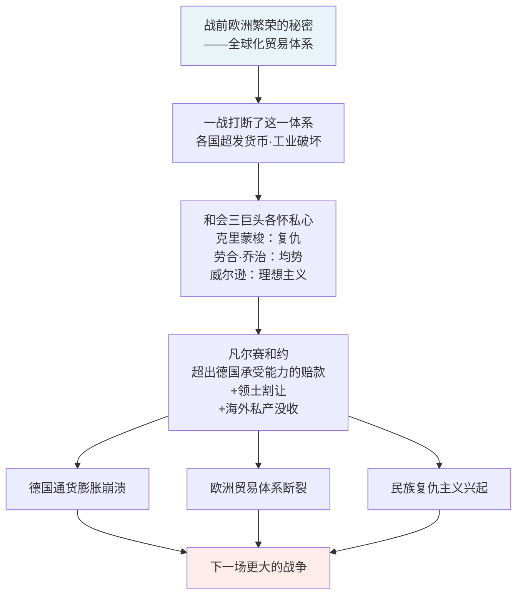

## 《〈凡尔赛和约〉的经济后果》读书笔记
  
### 作者  
digoal  
  
### 日期  
2026-05-23  
  
### 标签  
读书笔记 , 〈凡尔赛和约〉的经济后果     
  
----  
  
## 背景  

---
书名: 《〈凡尔赛和约〉的经济后果》  
作者: [英] 约翰·梅纳德·凯恩斯  
译者: 李井奎  
出版年份: 1919（原著）/ 2017（中译本）  
出版社: 中国人民大学出版社  
ISBN: 9787300236773  
笔记日期: 2026-05-23  
豆瓣链接: https://book.douban.com/subject/27034335/  
标签: [经济史, 国际关系, 一战, 凯恩斯, 政治经济学]  
---

  

> **一句话**：一个掌握着真相的人，愤而离席，用笔写下了一场灾难的剧本——而这场灾难，二十年后果真上演。  
>   
> **适合谁读**：对一战、二战、全球化经济或凯恩斯主义感兴趣的读者；对当下贸易保护主义、地缘政治紧张有困惑的人。  
>    
> **阅读难度**：⭐⭐⭐☆☆  
>    
> **推荐指数**：⭐⭐⭐⭐⭐  

---

## 一、时代坐标：一个人的愤怒，一本书的预言

1919年5月，巴黎凡尔赛宫。

一战已经结束，但世界并未因此平静。英国财政部代表约翰·梅纳德·凯恩斯坐在谈判桌旁，看着三位主宰世界命运的人物——法国总理克里蒙梭、英国首相劳合·乔治、美国总统威尔逊——以各自的私心和盘算，一条条地写下将套在德国脖子上的枷锁。

凯恩斯所经历的不仅是一场外交谈判，而是一场他眼中道德与智识的双重失败。他看得很清楚：眼前这份和约将给欧洲带来灾难，而没有人在意。同年5月底，他愤然辞职。留给劳合·乔治的信写道："我输了。现在就让他们对着已被毁灭殆尽的欧洲沾沾自喜去吧。"

回到剑桥仅几个月，1919年12月，凯恩斯出版了《〈凡尔赛和约〉的经济后果》。这本薄薄的书——不足两百页——迅速风行全世界，让一个35岁的经济学家一夜成名，也让那个时代的决策者们颜面尽失。

彼时，他写下的是预言。二十年后，我们知道那是历史。

```
1919年1月   巴黎和会开幕，三巨头主导
     ↓
1919年5月   凯恩斯愤然辞职，撂下预警之语
     ↓
1919年12月  《凡尔赛和约的经济后果》出版，震动世界
     ↓
1923年      德国恶性通货膨胀，马克崩溃
     ↓
1929年      大萧条席卷全球
     ↓
1933年      希特勒上台，凯恩斯一语成谶
     ↓
1939年      第二次世界大战爆发
     ↓
1944年      凯恩斯主导布雷顿森林体系，吸取教训
     ↓
1947年      马歇尔计划，凯恩斯思想终于得到实践
```

---

## 二、核心命题：作者在说什么？

这本书表面上是对《凡尔赛和约》的经济分析，骨子里是三个深刻的命题。

### 命题一：战前欧洲的繁荣，来自一个脆弱而伟大的全球化体系

凯恩斯开篇并不急着批判和约，而是先带读者回望1914年之前的欧洲。那个世界令人惊叹：北美粮食源源不断输入欧洲，各国货币稳定挂钩黄金，德国工业欣欣向荣，资本自由流动，护照几乎是多余之物。这一切不是天降神迹，而是一套精密的贸易与金融分工体系的产物——其中，德国是欧洲大陆经济的发动机，是这套体系不可或缺的核心齿轮。

他这样写是有用意的：**如果你想摧毁这台发动机，你就是在摧毁整台机器。**

### 命题二：凡尔赛和约是一份"迦太基式的和平"，在经济上根本无法执行

凯恩斯用数据冷静地拆穿了协约国的狮子大开口。他估算德国的实际赔款承受能力约为20亿英镑，而和约要求的数字远超于此，且附带了剥夺海外私有财产、强制转让工业产能等条款，实质上是在掘断德国经济的根基。

他将这种处置方式称为"迦太基式和平"——古罗马在第三次布匿战争后彻底摧毁了迦太基，犁平其土地，撒上盐以绝生机。凯恩斯认为，这样的和约不会带来和平，只会孕育下一场战争。

更深的批判在于：这种方式连资本主义最基本的原则——财产权——都破坏了。国家可以没收私人在海外的资产，这种先例本身就是对文明秩序的伤害。

### 命题三：经济互依的世界，没有赢家通吃的零和游戏

这是凯恩斯最超前的洞见，也许也是本书至今仍被反复引用的核心原因。他指出，德国的经济崩溃不会只是德国的麻烦——它会通过贸易萎缩、汇率混乱、信贷断裂，把整个欧洲拖入衰退。

他是那个时代里极少数真正理解"经济相互依存"的政治思考者。他提出，战胜国应该大幅削减战争债务，给德国留下喘息空间，同时建立"欧洲自由贸易同盟"（——是的，他在1919年就构想了欧盟的雏形），还应与苏俄和解，将其纳入欧洲经济体系，而非切割在外。

没有一条建议被采纳。

---

## 三、论证地图：凯恩斯怎么说服你的？



**他的论证武器有三种：**

**一是数字。** 凯恩斯用详细的统计表格，计算德国的工业产能、出口能力、煤炭储量，推算出其赔款极限。这在当时是罕见的严谨——大多数政治讨论不过是气话与口号。

**二是人物素描。** 书中对三巨头的刻画令人难忘。他笔下的克里蒙梭是"老虎"，目光中只有法国的复仇与安全，对欧洲的整体经济命运漠不关心；威尔逊像一个迷路的教授，带着十四点原则的理想蓝图来到巴黎，却在狡猾的欧洲政客面前一次次被耍弄；劳合·乔治则是个精明的机会主义者，随时在调整立场。凯恩斯的人物素描犀利而刻薄，以至于有人批评他是在用文学手法代替论证。

**三是历史类比。** 他以迦太基的覆灭、拿破仑战争后维也纳会议的相对宽容，来反衬凡尔赛和约的冷酷短视。

---

## 四、前提假设与边界：什么情况下这不成立？

凯恩斯的分析非常有力，但并非无懈可击。百年来，历史学家和经济学家对这本书有持续的修正和质疑：

**假设一：德国的赔款能力远低于协约国要求。**

这一点有一定争议。部分修正主义历史学家（如巴里·艾肯格林）指出，魏玛德国并非没有能力支付赔款，而是有意制造超级通货膨胀来赖账，甚至以此作为政治筹码。德国的"无力偿还"在某种程度上是政治选择，而非经济必然。

**假设二：苛刻的和约直接导致了希特勒的上台。**

凯恩斯的"凡尔赛导致二战"叙事深入人心，但也被部分历史学家质疑。1925年道威斯计划之后，德国经济曾经历短暂复苏，直到1929年大萧条才使纳粹运动真正爆发。换言之，经济大萧条或许才是决定性变量，和约的恶劣效果可能被夸大了。

**假设三：凯恩斯代表"理性"，协约国代表"贪婪"。**

这是本书最受批评的地方。凯恩斯对法国的苛责格外重，却对法国在战争中付出的惨烈代价相对轻描淡写——法国北部大片工业区被夷为平地，160万法国士兵阵亡。从法国的角度看，寻求赔偿并非无理，而是对真实损失的追偿。凯恩斯站在英国（乃至全欧洲）视角写作，这是他观察的局限。

---

## 五、思想谱系：这本书在哪个传统里？

凯恩斯师承新古典经济学大师马歇尔，但这本书与其说是经济学著作，不如说是一部政治经济学批判——它继承了亚当·斯密关于自由贸易与互利分工的传统，也延续了大卫·李嘉图关于比较优势的洞见，同时融入了大量第一手政治观察。

```
亚当·斯密 → 自由贸易、互利分工
      ↓
大卫·李嘉图 → 比较优势理论
      ↓
阿尔弗雷德·马歇尔（凯恩斯恩师）→ 新古典经济学
      ↓
凯恩斯《经济后果》→ 经济全球化 + 政治现实主义批判
      ↓
      ├→ 布雷顿森林体系（1944，凯恩斯主导）
      ├→ 马歇尔计划（1947，凯恩斯思想的迟到实践）
      └→ 欧洲经济一体化（20世纪中后期）
```

这本书在知识史上有一个特殊地位：它几乎是**最早把经济相互依存作为国际和平基石**加以系统阐述的著作。凯恩斯说的"没有繁荣稳定的德国，就没有繁荣稳定的欧洲"，今天听来是常识，但在1919年是异端。

这一思想后来流淌进了二战后的整个国际秩序建构之中——从马歇尔计划的"帮助敌人重建"，到欧洲煤钢共同体的"用经济互依消弭战争冲动"，都是凯恩斯逻辑的延伸。

---

## 六、我学到了什么？

读这本书有一种奇特的时间错位感：凯恩斯在1919年描述的困境——贸易保护主义抬头、经济民族主义、大国各谋私利、多边体系崩溃——像是从今天的新闻里抄来的。

**收获一：经济相互依存是和平的基础设施，不是可以随意拆卸的奢侈品。**

全球化的好处我们习以为常，但凯恩斯提醒我们，战前那套体系的崩溃有多具体：货币贬值、贸易断裂、粮食短缺、工业停滞。一旦这套"隐形基础设施"被政治暴力打断，恢复所需的代价往往超出所有人的预期。这不是抽象的经济原理，而是活生生的历史教训。

**收获二：短期政治利益与长期结构稳定之间，永远存在一个致命的裂缝。**

克里蒙梭要的是法国安全，劳合·乔治要的是选民满意，威尔逊要的是理想主义留名——没有一个人在认真思考二十年后欧洲的样子。这个裂缝不是坏人造成的，而是政治激励机制造成的。政客的任期是四年，历史的后果是几十年。

**收获三：一个持异见的人，在权力中枢辞职，用笔比用权更有力量。**

凯恩斯在权力面前没有屈服，也没有沉默。他离开，然后他写作。这本书改变了公众舆论，影响了下一代政策制定者，最终以一种迂回的方式改变了历史。这是知识分子参与公共事务的一种范本。

---

## 七、举一反三：这个框架还能用在哪？

凯恩斯的核心方法论可以提炼为：**"当政治决策忽视经济结构时，寻找必然的连锁后果。"**

这个框架在今天依然适用：

**场景一：贸易摩擦与关税战。** 当一国以惩罚性关税打击对手时，凯恩斯的逻辑会问：被打击方的经济反应会如何？通过什么传导路径影响全球体系？贸易伙伴会在什么时间点被迫做出非理性的政治选择？

**场景二：战争赔偿与制裁。** 这是最直接的类比。任何试图通过经济绞杀来达成政治目的的方案，都需要面对"被绞杀方是否真的会乖乖就范，还是会走向更极端选项"这一根本问题。

**场景三：债务危机处理。** 2010年代欧债危机中，德国对希腊的强硬立场，被不少经济学家类比为凡尔赛时法国对德国的立场——要求过度赔偿，忽视对方实际承受能力，反而威胁整个欧元区的稳定。历史在结构上重演，只是演员换了一拨。

---

## 八、批判与反思

这本书有一个根本性的矛盾：**它用经济理性来批判政治非理性，但政治从来不只是经济的。**

凯恩斯太相信数字了。他以为，只要拿出充分的经济论据，证明这份和约不可行，理性的决策者就会修正它。但克里蒙梭要的不只是钱——他要的是法国的安全感，而法国在1870年和1914年已经两度被德国入侵，这种历史创伤不是经济计算能够化解的。

更值得反思的是：凯恩斯将二战的种子几乎完全归因于凡尔赛和约，这是一种过于整洁的因果叙事。纳粹的兴起是多因素的：1929年大萧条的冲击、魏玛共和国政治制度的脆弱、德国内部的意识形态生态，都同样重要。历史不是一条从"苛刻和约"到"二战爆发"的直线，而是无数偶然与结构交织的结果。

凯恩斯写这本书时只有35岁。他的愤怒是真实的，他的预言是准确的，但他的分析框架也带着年轻人特有的确定性——世界比他想象的更混乱，也比他想象的更顽固。

---

## 九、金句与记忆点

> **"迦太基式的和平"**
> 凯恩斯用来形容《凡尔赛和约》的词汇，指彻底摧毁对手而非寻求共存的和平策略。这个词今天仍是国际关系讨论中的常用概念。

> **"他们是在要求实现一种根本无可实现的事情，反而对真正的利益视而不见。"**
> 凯恩斯对协约国的判断。用来描述任何陷入零和思维、忽视共同利益的谈判方，依然精准。

> **"没有繁荣稳定的德国，就没有繁荣稳定的欧洲。"**
> 这句话是整本书最核心的洞见，也是战后欧洲秩序建构的底层逻辑。

> **关于货币通胀的警告**
> 凯恩斯指出，超发货币虽能短期维持战时经济，但会摧毁储蓄者的财富，引发社会不稳定。他对通货膨胀的政治后果的分析，至今仍是教科书级的阐述。

> **关于威尔逊的素描**
> 凯恩斯笔下的威尔逊是个带着漂亮蓝图却毫无谈判技巧的教授，被欧洲老政客们玩弄于股掌之间。这幅画像刻薄但真实，提醒我们：好的理想需要配上能落地的政治手腕。

> **凯恩斯辞职时的话**
> "我已经彻底累垮了，一方面是由于不停的工作，另一方面是由于对周围的邪恶感到沮丧。和平安排令人无法容忍，而且根本不可能行得通。"
> 一个内心燃烧的知识分子在权力面前的真实独白。

---

## 十、延伸阅读

**《缔造和平》，玛格丽特·麦克米伦**
劳合·乔治曾外孙女所著，还原了巴黎和会的人物与细节，是《经济后果》最好的历史背景补充读物，帮你理解凯恩斯所处的现场。

**《就业、利息与货币通论》，凯恩斯**
凯恩斯最重要的理论著作，写于1936年大萧条期间。读完《经济后果》，再读《通论》，能感受到凯恩斯思想演化的完整弧线——从批判到建构。

**《二十年危机》，卡尔**
英国国际关系理论家E·H·卡尔1939年出版，系统分析了一战到二战间国际秩序崩溃的原因，是理解凯恩斯所处时代背景的另一部必读经典。

**《价格的历史》，扎卡里·卡特**
凯恩斯的传记，英文原名《The Price of Peace》，深入描述了从《经济后果》到布雷顿森林体系，凯恩斯一生的政策实践与思想挣扎。

**《大转型》，卡尔·波兰尼**
从经济嵌入社会的视角，解释了为什么纯粹市场秩序在20世纪初崩溃，与凯恩斯的分析形成精彩的对话。

---

*笔记写于 2026-05-23 | 基于公开资料、学术评论与深度思考整理*
  
  
#### [PostgreSQL 解决方案集合](../201706/20170601_02.md "40cff096e9ed7122c512b35d8561d9c8")
  
  
#### [德哥 / digoal's Github - 公益是一辈子的事.](https://github.com/digoal/blog/blob/master/README.md "22709685feb7cab07d30f30387f0a9ae")
  
  
#### [About 德哥](https://github.com/digoal/blog/blob/master/me/readme.md "a37735981e7704886ffd590565582dd0")
  
  

  
