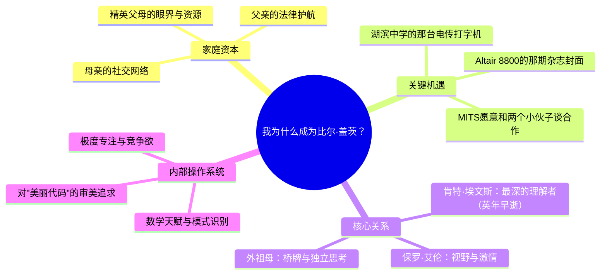

## 《源代码：我的起点》读书笔记
  
### 作者  
digoal  
  
### 日期  
2026-05-23  
  
### 标签  
读书笔记 , 源代码：我的起点     
  
----  
  
## 背景  
  
---
书名: 《源代码：我的起点》（Source Code: My Beginnings）   
作者: 比尔·盖茨   
出版年份: 2025   
笔记日期: 2026-05-23   
豆瓣链接: https://book.douban.com/subject/37212965/   
出版社: 中信出版集团（中文版）/ Alfred A. Knopf（英文版）   
ISBN: 9787521768770   
标签: [传记, 科技史, 创业, 成长, 微软]   
---

  

> **一句话**：一个特权少年如何把天赋、运气与偏执熔铸成改变世界的操作系统。   
> **适合谁读**：对科技史感兴趣的人；正在摸索人生方向的年轻人；想理解"天才是怎么来的"的父母。   
> **阅读难度**：⭐⭐☆☆☆（叙事流畅，不需要技术背景）   
> **推荐指数**：⭐⭐⭐⭐☆   

---

## 一、时代坐标：这本书从哪里来？

2025年，比尔·盖茨将满70岁。他选择在这个时间节点出版首部自传，绝非偶然。

彼时，科技巨头们正以前所未有的姿态介入公共事务——马斯克、贝索斯、扎克伯格轮番登上政治舞台，科技亿万富翁的"放飞"引发全球范围内的审视与争议。《纽约时报》在书评中敏锐地指出：盖茨此刻出书，构成了一种鲜明的反差——"他是这些新闻里的那些大亨的对立面……写自传，是盖茨和同辈们不同的又一个地方，那些人几乎没有一个表现出如此内省的一面。"

这本书覆盖的时间段是1955年到1978年——从盖茨出生，到23岁的他率领十几名微软员工从阿尔伯克基迁回西雅图。这只是计划三部曲的第一部，第二部将讲述微软岁月，第三部聚焦慈善事业。

换言之，这部书并不是关于Windows的，不是反垄断诉讼的，更不是离婚的——那些更复杂、更难面对的历史，还没到算账的时候。

```
1955      1968       1973       1975         1978
  │         │          │          │             │
出生于   进入湖滨   高中毕业   与保罗·艾伦   微软迁回
西雅图   中学，     就读哈佛   创办微软      西雅图
       遇见电脑
       遇见保罗·艾伦
```

---

## 二、核心命题：作者在说什么？

这本书的英文副标题是"My Beginnings"——我的起点。盖茨真正想探索的问题只有一个：**我，为什么偏偏是我？**

### 命题一：天才是被"装配"出来的，而非天降神迹

盖茨在书中对自己的特权有异常清醒的认知。他的父亲是顶级律师，母亲来自西雅图显赫的银行世家，且是当地最具影响力的社交女主人之一。他就读的湖滨中学（Lakeside School）是西雅图最好的男校，母亲们组织义卖筹款，给学生们买来了那台改变盖茨命运的电传打字机——那是1968年，全美几乎没有哪所高中拥有这样的计算机资源。

书中有一句话让人印象深刻，盖茨写道：出生为美国白人直男，本身就是中了彩票。

这不是客套的谦虚。这是一个70岁老人回望自己的出发点时，罕见的、清醒的坦白。

### 命题二：偏执是一种生产力，但它有代价

年轻的盖茨是一个极其难相处的人。他和保罗·艾伦会因为谁说了算而激烈争吵，吵到艾伦一怒之下把他赶出机房。他会通宵写代码，然后直接倒在键盘上睡着。他和母亲玛丽的关系一度剑拔弩张，双方经历了漫长的心理咨询才找到某种平衡——父母最终选择给他更大的自由空间，而不是硬掰。

这种偏执是他的超能力，也几乎是一种诅咒。书里的盖茨并不可爱，却令人信服。

### 命题三：关键节点是一系列微小偶然的叠加

微软的诞生，源于一个被保存在记忆里的"公式求值器"。那是盖茨在一次夏令营徒步时写下的代码片段，多年后当保罗·艾伦冲进他在哈佛的宿舍，拿着那期刊登Altair 8800微型计算机的《大众电子》封面大喊"就是它"的时候，盖茨想到的第一件事就是那段代码：

> "我在脑海里把它找了出来，输入计算机，就这样种下了种子——种下了后来成为世界上最大的公司之一和一个新产业的起点。"

没有那次徒步，没有那段被记住的代码，没有保罗·艾伦那本随时翻阅的杂志，历史可能完全是另一个样子。

---

## 三、论证地图：盖茨如何重建自己的起点？



书中论证方式以**具体细节+情感重建**为主。盖茨不像在做案例分析，更像在把一张发黄的旧照片染上颜色。他记住了1968年第一次用电脑时打出井字棋程序的感受，记住了徒步时在山上想出公式求值器时的兴奋，也记住了好友肯特·埃文斯在登山事故中去世时自己的震惊——"我从未想过，一个朋友会就这样消失。这是我童年唯一的负面经历。"

这种叙事方式让这本书成为一份优质的情感文本，但也意味着论证的局限：我们只得到了盖茨自己选择分享的那一层。

---

## 四、前提假设与边界：什么情况下这不成立？

**假设一：特权 + 天赋 + 偏执 = 成功**

盖茨试图解构自己的成功公式，但这个公式本身就难以复制。全球有无数有天赋、有偏执的孩子，没有那台电传打字机，没有那位主动分享资源的母亲，没有那个偶然出现的保罗·艾伦。成功学读者如果试图从这本书里提炼"可操作的成功方法论"，会令人失望。

**假设二：这是一本诚实的自传**

盖茨的自我剖析确实比同类书籍更坦率，但这毕竟是第一部——讲的是无忧无虑的成长岁月和创业的蜜月期。微软的垄断诉讼、管理风格的争议、婚姻的破裂……这些都不在本书的时间轴上。卫报书评人史蒂文·普尔的观察很犀利："那位年长而智慧的作者，似乎在努力通过理解过去来救赎过去。"救赎，意味着还有未竟的功课。

**假设三：个人叙事可以穿透时代局限**

盖茨坦承自己出生为白人男性是"彩票"，但书的视角本质上仍是个体英雄叙事。真正结构性的东西——计算机产业为什么在那个时间节点爆发，为什么爆发在美国而非别处——书中着墨甚少。

---

## 五、思想谱系：这本书站在哪里？

《源代码》属于"科技创始人溯源"这一子类型，可以和沃尔特·艾萨克森写的《乔布斯传》以及乔布斯的精神对话。但相比艾萨克森那种充满戏剧冲突的叙事，盖茨的自述更克制，更内省，也更愿意承认偶然性的作用。

在思想传统上，盖茨的世界观更接近实证主义：他相信问题可以被分解、被测量、被解决。这在《源代码》里体现为他对代码之"美"的痴迷——不是感性的美，而是逻辑的优雅、算法的精简。这种世界观贯穿他整个人生，从微软到盖茨基金会的全球卫生项目，逻辑是一以贯之的。

影响脉络上，这本书明显受到马尔科姆·格拉德威尔《异类》（Outliers）的启发——都在探讨成功里"时代与机遇"那一层被忽视的因素。但盖茨提供了第一手视角，格拉德威尔提供的是结构性框架，两书可以互读互证。

---

## 六、我学到了什么？

**收获一：真正的痴迷不需要意志力**

书里最令我动容的不是盖茨的聪明，而是他对编程的那种动物性的迷恋——凌晨偷溜去机房，睡着在键盘上，把一段徒步时想到的代码记了三年多。这不是刻意练习的结果，而是一种更原始的、几乎不可自控的驱动力。这让我重新思考"努力"这个词：真正改变世界的人，往往不是靠意志力撑过去的，而是停不下来。

**收获二：关键的朋友会改变你的轨迹**

肯特·埃文斯的死改变了盖茨。不是因为这个打击让他更努力，而是因为他失去了一个真正理解他的人，并因此在悲痛中更深地扑向保罗·艾伦。关系的偶然性在这本书里比任何成功学大道理都更有说服力。

**收获三：承认特权，比假装没有更有力量**

盖茨在书中对自身优越出身的坦白，让这本书避开了许多励志传记的虚伪陷阱。他没有说"只要努力，人人都能成为比尔·盖茨"。他说的是：我，恰好在那个时间，恰好在那个地方，恰好有那些人在身边。这种诚实本身，就是一种力量。

---

## 七、举一反三：这个框架还能用在哪？

盖茨在书中提炼了一个隐含框架：**内部操作系统 × 外部关键资源 = 个人的可能性边界**。

这个框架可以迁移到任何领域：

一位设计师的"内部操作系统"或许是对色彩的天然敏感，加上恰好遇见了一位会严格批改作业的老师（外部关键资源），才真正被激活。

一个公司的竞争优势，同样是内部能力（技术、文化、执行力）与外部时机（行业风口、政策窗口）共同作用的结果——只谈内功或只谈风口，都是残缺的分析。

这个框架最大的价值：它提醒我们在回顾成功时，不要只归因于个人，也不要全部推给运气，而是去认真辨析两者的交织。

---

## 八、批判与反思

这本书有一个显而易见的盲区：**它太舒适了**。

1978年以前的盖茨是一个幸运儿——家境好，学校好，遇到好的朋友，在一个无比正确的时间节点入场了计算机革命。书里的矛盾冲突，最激烈的也不过是和母亲争论要不要收拾房间，或者和保罗·艾伦抢谁说了算。

真正的"比尔·盖茨难题"——如何在商战中不择手段，如何面对垄断指控，如何在婚姻和公众形象管理中出现深重的矛盾——这些等待着第二部、第三部来回答。一个人如何讲述自己的黑暗面，比如何讲述自己的青春期有趣得多，也重要得多。

此外，书中几乎没有女性的视角。除了母亲玛丽（以管教者的形象出现）和外祖母，整个少年盖茨的世界里，女性是缺席的。这未必是刻意回避，但在2025年这个时间节点出版，这个缺席本身就值得被注意。

---

## 九、金句与记忆点

1. **"出生为美国白人直男，本身就是中了彩票。"**
   ——盖茨对自身特权的罕见坦白，颠覆了自我奋斗神话的叙事范式。

2. **"我在脑海里把那段代码找了出来……就这样种下了微软的种子。"**
   ——说明真正的积累不是刻意为之，而是让有价值的东西在记忆里驻留。

3. **"肯特的死是我童年唯一的负面经历，它塑造了我——一个人可以就这样消失，一个你爱的、本来会和你共同前进的人。"**
   ——最动人的一段。提醒我们，人生的转折往往是失去，而非得到。

4. **"湖滨中学的母亲们义卖筹款，买来了那台电传打字机。"**
   ——微软帝国的远端起点，不是什么宏大叙事，而是一群妈妈的义卖摊位。历史往往是这样开始的。

5. **"我倾向于隐藏我的努力——在学校如此，在哈佛亦如此。"**
   ——一个意味深长的自我揭露。天才人设的背后，往往有刻意构建的成分。

6. **"代码里有一种美，不是感性的美，而是逻辑的优雅。"**
   ——这句话解释了盖茨的世界观：世界是可以被精确描述和优化的，这是他毕生信念的源头。

---

## 十、延伸阅读

**《异类》（Outliers）—— 马尔科姆·格拉德威尔**
格拉德威尔用结构性视角拆解"成功"，与《源代码》的第一人称自述形成互补——先读盖茨，再读格拉德威尔，你会对"时代红利"有更立体的理解。

**《乔布斯传》—— 沃尔特·艾萨克森**
同样是科技创始人的成长叙事，但艾萨克森的笔下，乔布斯的阴暗面被放大得更充分。两书对读，是一个关于"自传VS传记"、"自述VS他述"的绝佳思维实验。

**《硅谷之火》（Fire in the Valley）—— 保罗·弗雷贝格 & 迈克尔·斯旺因**
想了解盖茨出场的那个大时代——个人计算机革命的全景——这本书是最好的背景墙。

**《穷查理宝典》—— 查理·芒格**
盖茨最重要的思想伙伴是巴菲特，而芒格是理解巴菲特思维体系的入口。盖茨书中展示的多元思维框架，在芒格这里有更系统的表达。

**《成为》（Becoming）—— 米歇尔·奥巴马**
同时代顶级人物的自传，但视角完全不同：一个黑人女性的成长故事，把特权与局限的对比推到了极致。与《源代码》并排阅读，是一堂关于"起点决定什么"的公开课。

---

*笔记写于 2026-05-23 | 基于英文原版评论、豆瓣书评及公开资料整理*
  
  
#### [PostgreSQL 解决方案集合](../201706/20170601_02.md "40cff096e9ed7122c512b35d8561d9c8")
  
  
#### [德哥 / digoal's Github - 公益是一辈子的事.](https://github.com/digoal/blog/blob/master/README.md "22709685feb7cab07d30f30387f0a9ae")
  
  
#### [About 德哥](https://github.com/digoal/blog/blob/master/me/readme.md "a37735981e7704886ffd590565582dd0")
  
  

  
