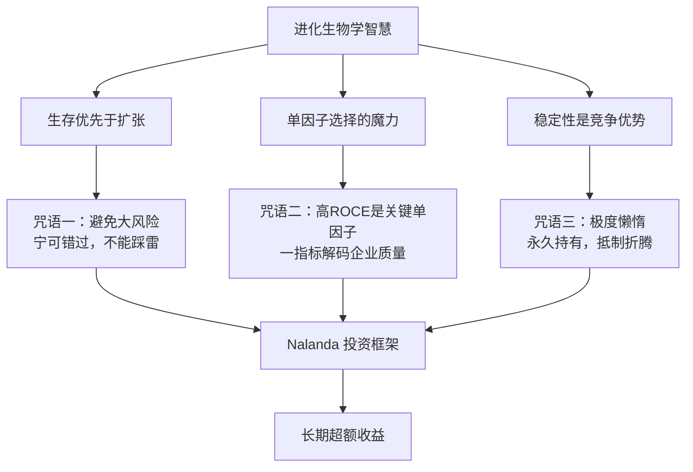

## 《我从达尔文那里学到的投资知识》读书笔记
  
### 作者  
digoal  
  
### 日期  
2026-05-23  
  
### 标签  
读书笔记 , 我从达尔文那里学到的投资知识     
  
----  
  
## 背景  
  
---
书名: 《我从达尔文那里学到的投资知识》  
原名: What I Learned About Investing from Darwin  
作者: 普拉克·普拉萨德（Pulak Prasad）  
译者: 彭相珍  
出版社: 哥伦比亚大学出版社 / 中译出版社（中文版）  
出版年份: 2023（英文）/ 2025（中文）  
页数: 461页（中文版）  
笔记日期: 2025-05-23  
豆瓣评分: 暂无中文版评分  
标签: [投资, 进化生物学, 长期主义, 价值投资, 行为金融]  
---

  

> **一句话**：用进化生物学的视角重新理解投资——成功不在于抓住最多机会，而在于活得足够久。  
> **适合谁读**：对长期价值投资感兴趣的普通投资者、职业基金经理、跨学科思考者  
> **阅读难度**：⭐⭐⭐☆☆  
> **推荐指数**：⭐⭐⭐⭐☆  

---

## 一、时代坐标：这本书从哪里来？

2023年，当主动管理基金在全球范围内持续跑输被动指数时，一位在新加坡默默管理着50亿美元印度股票的基金经理写了这本书。

普拉克·普拉萨德（Pulak Prasad）的履历颇为传统：麦肯锡咨询出身，后任华平投资印度联席负责人，2007年在新加坡创立 Nalanda Capital，专注长期持有印度上市公司股票。但他写的这本书，切入点相当不寻常——达尔文的进化生物学。

投资行业正处于某种集体焦虑之中：主动管理者大量跑输基准，资金持续流向被动指数基金，量化策略和高频交易让市场越来越像一台无法战胜的机器。在这个时代背景下，普拉萨德想说的是：也许我们找错了方向。真正的答案，达尔文早就写下来了。

这本书的写作动机很直接——把 Nalanda Capital 近二十年的实战哲学系统化，用自然界最古老的生存智慧，重新阐释为什么"少即是多"在投资中行得通。

---

## 二、核心命题：作者在说什么？

全书围绕三个相互递进的核心命题展开，作者称之为"三个咒语"：

### 命题一：投资的第一要义是活下去，而非跑赢

自然界的生存逻辑是非对称的：一次致命失误足以终结一切，而无数次小的成功也无法挽回。投资亦然。

普拉萨德引入了统计学中**I型错误**（误杀好公司）与**II型错误**（误买烂公司）的框架。他的结论颇为反直觉：**宁可错过好公司（II型错误），也要极力避免投进坏公司（I型错误）**。

这背后是他对"不对称损失"的深刻理解：一只股票最多跌100%，但你错过的机会最多让你少赚而已，永远不会让你归零。"避免大风险"是他三个投资咒语的第一条，也是最重要的一条。

他列出了一份明确的"拒绝清单"：诚信有瑕疵的管理层、高负债公司、靠并购驱动的企业、扭亏转型故事……这些都是自然界里的"遗传缺陷"，一旦进入组合，就是埋下的定时炸弹。

### 命题二：用一个指标解码企业质量——ROCE

这是本书最精彩的类比。

1959年，苏联科学家德米特里·别利亚耶夫（Dmitri Belyaev）在西伯利亚启动了一项旷世实验：对野生银狐进行选择性繁殖，唯一筛选标准是**对人类的温顺程度**。

结果令人震惊——仅仅选择一个特征，几代之后，被选出的银狐不但变得温顺，还自发出现了耷拉的耳朵、卷起的尾巴、花斑的皮毛，宛如家养犬。选择了一个核心特质，却获赠了一整套配套特质。

普拉萨德的灵感由此而来：投资选股时，也应该寻找那个"关键单因子"——一旦命中，其他好特质便会伴随而来。他的答案是**历史资本回报率（ROCE）**。

一家企业长期保持高 ROCE，背后几乎必然意味着：优秀的管理层、高效的资本配置、清晰的竞争护城河、可持续的盈利能力。就像银狐实验，你只需问一个问题，答案里藏着所有你想知道的。

### 命题三：不要勤劳——要非常懒惰

这是全书最反人性、也最有力的一条建议。

"不要懒惰——要非常懒惰（Don't be lazy—be very lazy）"是他第三个咒语的原话。意思是：找到好公司之后，**什么都不做就是最好的操作**。

他自我定位为"永久持有人"（permanent owner），Nalanda 典型的持股周期以十年计。他明确表示从不投主题，从不追热点，从不因宏观情绪调仓。这与进化生物学中的"物种稳定性"如出一辙——越是成功的物种，越不需要在短时间内大幅改变。

---

## 三、论证地图：作者怎么说服你的？



**核心论证方式**：普拉萨德不依赖复杂模型，而是大量使用"生物学类比+真实投资案例"的双线叙事。每章开头都有一句达尔文语录和一句巴菲特语录，暗示两人的思维其实是同源的。

**代表性案例**：
- **蜜蜂与特斯拉**：蜜蜂采花时，不会因为没采到最大的花而焦虑。Nalanda 错过了特斯拉式的高增长公司，但这不是失误，而是策略选择的代价。
- **小青蛙的叫声**：某些小青蛙会模仿大青蛙的叫声欺骗天敌，类比那些用漂亮财报包装劣质公司的管理层。企业发出的信号，不总是真实的。
- **银狐实验**：见上文，是全书最亮眼的类比。

---

## 四、前提假设与边界：什么情况下这不成立？

这套体系的成立，依赖几个关键假设，值得审视：

**假设一：历史 ROCE 对未来有预测力**
这在相对稳定的行业（消费品、金融服务）中成立较好，但在技术革命面前可能失效。柯达、诺基亚曾经都有极高的历史 ROCE。当范式转移发生，过去的护城河可能成为转型的枷锁。

**假设二：印度市场的特殊性**
Nalanda 专注印度上市股票，而印度市场的散户化程度高、机构博弈少、信息效率偏低——这为长期持有高质量公司提供了丰厚的超额回报土壤。这套策略在中国 A 股、美国纳斯达克是否同样有效，书中并未充分讨论。

**假设三："永久持有"的前提是公司护城河不变**
作者坚决不卖，但进化论本身告诉我们，没有物种能永久不变。当公司的竞争优势出现根本性动摇时，"极度懒惰"可能从美德变成致命的固执。

这本书的边界很清晰：它是一套**拒绝大多数机会、深度持有少数优质公司**的体系，并非一套发现下一个颠覆者的方法论。它帮你守住财富，未必帮你实现财富的飞跃。

---

## 五、思想谱系：这本书在哪个传统里？

普拉萨德在思想上是标准的"**巴菲特-芒格传统**"的继承者，但加入了跨学科的外衣：

```
格雷厄姆（安全边际）
      ↓
巴菲特（买优质公司而非便宜公司）
      ↓
芒格（多元思维模型 / 跨学科框架）
      ↓
普拉萨德（进化生物学视角 + 印度实践）
```

他引用的"永久持有人"概念直接来自巴菲特，"一个核心指标解码一切"的思路与芒格的"清单"哲学一脉相承。与同类书籍相比，它不如《聪明的投资者》严谨，但比大多数投资回忆录更有系统性。

与同类书的对话：
- 比 《彼得·林奇的成功投资》更理论化、更反行动
- 比《反脆弱》更聚焦实操，跨学科类比没有塔勒布那么宏大
- 与《穷查理宝典》精神最近，但更聚焦单一策略

---

## 六、我学到了什么？

**收获一：重新定义"好的决策"**

投资里有一个认知陷阱：我们倾向于用结果评价决策。但进化生物学告诉我们，在不确定的环境下，好的决策过程不等于好的结果，坏的结果不等于坏的决策。普拉萨德的"容忍错过"哲学，让我重新理解了一件事：焦虑来自拿结果衡量策略，平静来自相信过程。

**收获二：拒绝是能力，不是失败**

"伟大的投资者也是伟大的拒绝者"——这句话改变了我看待"错过机会"的方式。每一次严格的拒绝，都是在保护你不被淘汰出局。筛选的价值不在于你选中了什么，而在于你筛掉了什么。

**收获三：单因子的奥义**

"找一个好的主因子，其他优质特征会自动跟来"——这个思维方式不只适用于投资。在评估任何复杂系统时，过度加权指标只会制造噪声。找到那个"银狐驯化基因"式的关键变量，是一种需要练习的判断力。

---

## 七、举一反三：这个框架还能用在哪？

**场景一：个人职业选择**
别问"这份工作薪资如何"，而是问"这家公司的人才密度如何"——用一个核心指标（人才密度、管理层声誉、公司文化）作为主因子，其他因素往往随之而来。

**场景二：合作伙伴筛选**
与其列出十几个考察维度，不如找到那个"一票否决项"。做生意时，一个诚信有问题的合伙人足以摧毁一切，正如一个高负债公司足以毁掉任何经营优势。"避免大风险"先于"寻找大机会"。

**场景三：知识管理**
不要焦虑于"有没有错过某本重要的书"，而是专注深度阅读少量经典——极度懒惰地持有知识，而非频繁地追逐信息风口。

---

## 八、批判与反思

这本书有几处让我觉得可以更诚实：

**问题一：结果偏差的幸存者效应**
普拉萨德的策略确实出色，但我们只看到了成功的案例。有多少采用同样策略的基金经理跑输了市场？书中几乎没有反例，这让他的"方法论"更像是个人经验的合理化，而非严格的统计验证。

**问题二：生物学类比有时过于牵强**
并不是所有的比喻都站得住脚。把"青蛙模仿叫声"类比成"财务造假"，固然生动，但两者的机制完全不同。读者需要把这些类比当作记忆工具，而非严密的论证链条。

**问题三：忽略了时代的赋予**
Nalanda 成立于2007年，赶上了印度经济腾飞的黄金二十年。在一个快速增长的市场里"永久持有优质公司"，难度远低于在一个成熟甚至衰退的市场里。这套策略的有效性，有多少来自方法本身，有多少来自时代的顺风，值得追问。

---

## 九、金句与记忆点

1. **「Nalanda的投资三步：避免大风险→以合理价格买入高质量→不要懒惰，要非常懒惰。」**
   → 三步骤看似简单，每一步都是反人性的。最难的不是选股，而是什么都不做。

2. **「伟大的投资者也是伟大的拒绝者。」**
   → 拒绝能力是护城河，也是心理素质的核心。

3. **「我虽自称投资者，但进化生物学家可能会称我为'信号解码员'。」**
   → 投资的本质是在噪声中识别真实信号，与其说是预测未来，不如说是读懂现在。

4. **「I型错误是买入坏公司；II型错误是错过好公司。前者要尽一切努力避免，后者可以接受。」**
   → 不对称的容忍度，是长期生存的关键认知。

5. **「我们从不投资主题，也永远不会。」**
   → 这句话像一道符咒，抵御了无数次市场情绪的诱惑。主题投资的逻辑看起来永远对，但时机永远难以把握。

6. **「选择一个正确的核心特质，其他好特质会免费附赠。」**
   → 银狐实验的启示：简化才是深刻，而非复杂才是深刻。

7. **「债务压缩战略灵活性，从而破坏长期价值创造。」**
   → 对于永久持有人而言，任何削弱公司长期选择权的因素都是隐患。

---

## 十、延伸阅读

1. **《穷查理宝典》（Poor Charlie's Almanack）** — 查理·芒格
   推荐理由：本书的精神前辈。芒格的多元思维模型与普拉萨德的跨学科方法高度呼应，读完《达尔文》再读芒格，会有更深的共鸣。

2. **《喜悦的复利》（The Joys of Compounding）** — 高拉夫·拉斯托吉
   推荐理由：同为哥伦比亚大学出版社出版的长期主义投资经典，与本书风格相近，都是对巴菲特智慧的深度整理。

3. **《自私的基因》（The Selfish Gene）** — 理查德·道金斯
   推荐理由：如果你被普拉萨德的生物学类比激发了兴趣，这本书是最好的下一步。理解基因选择理论，会让你对"长期竞争优势"有更底层的直觉。

4. **《反脆弱》（Antifragile）** — 纳西姆·塔勒布
   推荐理由：与本书互补。普拉萨德教你如何"避免被摧毁"，塔勒布教你如何"从混乱中获益"。两者合读，形成更完整的风险认知图谱。

5. **《文明、现代化、价值投资与中国》** — 李录
   推荐理由：同为亚洲视角下的长期主义投资，李录的思考更具哲学深度，且对新兴市场有独到见解，与本书构成有趣的对话。

---

*笔记写于 2025-05-23 | 基于公开书评、作者访谈与深度思考整理*
*作者：普拉克·普拉萨德 | 出版：哥伦比亚大学出版社（2023）/ 中译出版社（2025）*
  
  
#### [PostgreSQL 解决方案集合](../201706/20170601_02.md "40cff096e9ed7122c512b35d8561d9c8")
  
  
#### [德哥 / digoal's Github - 公益是一辈子的事.](https://github.com/digoal/blog/blob/master/README.md "22709685feb7cab07d30f30387f0a9ae")
  
  
#### [About 德哥](https://github.com/digoal/blog/blob/master/me/readme.md "a37735981e7704886ffd590565582dd0")
  
  

  
