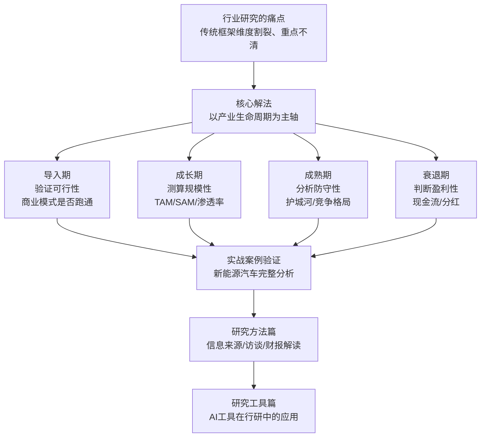

## 《如何快速了解一个行业》读书笔记
  
### 作者  
digoal  
  
### 日期  
2026-05-23  
  
### 标签  
读书笔记 , 如何快速了解一个行业     
  
----  
  
## 背景  
  
---
书名: 《如何快速了解一个行业》  
作者: 肖璟  
出版年份: 2025-8  
笔记日期: 2026-05-23  
出版社: 人民邮电出版社 / 图灵新知  
ISBN: 9787115674937  
豆瓣评分: 9.0  
标签: [行业研究, 投资分析, 商业方法论, 咨询思维, AI工具]  
---
  
  

> **一句话**：一套从麦肯锡提炼、经创业淬炼的行业研究操作系统——它不教你"看什么"，而是教你"在什么时候看什么"。  
> **适合谁读**：投资人、分析师、创业者、职场新人、想换行的人，任何需要快速进入陌生领域的人  
> **阅读难度**：⭐⭐☆☆☆（写法通俗，框架清晰，但内容密度高，需要边读边练）  
> **推荐指数**：⭐⭐⭐⭐☆  

---

## 一、时代坐标：这本书从哪里来？

我们活在一个"行业半衰期"急速缩短的时代。

十年前，一个人在一个行业深耕十年，积累的认知可以保值很久。今天，新能源汽车用五年时间颠覆了百年汽车工业的格局，生成式AI在十八个月内重写了咨询、法律、教育等无数行业的基本逻辑。跨行不再是少数人的跳槽选择，而成了每个人的生存必修课。

与此同时，行业研究的"传统路数"正在失效。过去，券商研究员靠十几年的行业积累、密集的专家访谈和昂贵的数据库，才能输出一份像样的研究报告。这套方式成本高、周期长，普通人根本用不起。

肖璟写这本书，正是在填补这个空缺。他的身份很有意思：香港中文大学金融专业出身，在麦肯锡金融机构组做了三年分析师，之后连续创业近十年，还开了"很帅的投资客"这个财经公众号。这个经历让他同时拥有了顶级咨询的方法论训练、一线创业的市场感知，以及内容创作者对"如何讲清楚一件复杂事"的执念。

```
时间线：
2012 ──────────→ 2015 ──────────────────────────→ 2025
加入麦肯锡      离开麦肯锡，连续创业            《如何快速了解一个行业》出版
金融机构组      9年创业+投资+内容               豆瓣9.0分
```

这本书不是学术著作，也不是励志读物，它是一本**实践者写给实践者的操作手册**。

---

## 二、核心命题：作者在说什么？

### 命题一：行业研究的真正难点不是"看什么"，而是"什么时候看什么"

市面上大多数行业研究框架的问题，是把商业模式、市场规模、竞争格局这些维度**机械地并排**，好像给所有行业做一次体检，每项都查一遍。肖璟指出，这样的分析往往面面俱到却重点不清——煤炭行业和新能源汽车明明处于完全不同的历史阶段，却用同一张问卷来审视，能得出什么有用结论？

他的解法是引入**产业生命周期**作为主轴。一个行业按营收增速分为四个阶段：导入期、成长期、成熟期、衰退期。不同阶段，分析的核心问题完全不同：

```
导入期 → 问"能不能跑通？"（可行性）
成长期 → 问"能长多大？"（规模性）
成熟期 → 问"谁能守住？"（防守性 + 盈利性）
衰退期 → 问"怎么死得慢？"或"谁能转型？"
```

这个框架的聪明之处在于：它是**动态的**，不是静态模板，要求分析者先判断行业所处阶段，再决定研究重心。

### 命题二：行业边界是流动的，分析单位的选择本身就是判断

肖璟花了相当篇幅讨论"行业是什么"这个看似简单的问题。横向来看，行业是同类业务的平行集合；纵向来看，行业是产业链不同环节的集合。以半导体为例，"设计→制造→封测"每一环都是独立行业，却同属半导体大行业。

选错了分析单位，所有后续推论都会跑偏。这提醒我们：行业研究的第一步，其实是**厘清你在研究什么**。

### 命题三：渗透率是判断行业阶段最实用的量化锚点

书中提出一个具体的判断标准：当市场渗透率达到15%~20%时，行业通常从导入期跨入快速成长期；当渗透率超过35%~40%，增速开始放缓，行业进入成熟期。这个数字来自对多个行业历史数据的归纳（如智能手机普及曲线），虽然不是铁律，却给了分析者一个可以检验和修正的起点。

---

## 三、论证地图：作者怎么说服你的？



**论证方式评价：**

肖璟的说服路径是**归纳而非演绎**——他不从经济学理论出发推导框架，而是从大量实际案例中提炼出模式，再用新能源汽车这个完整案例回过头来验证。这种方式可读性强，实操感强，但理论深度相对有限。书中对"为什么15%-20%是分水岭"没有给出严格的理论推导，更多是经验归纳，读者应留意这一点。

---

## 四、前提假设与边界：什么情况下这不成立？

**假设一：行业存在清晰的生命周期曲线**

现实中，有些行业的生命周期极难判断。AI大模型是"导入期"还是"成长期"？加密货币算哪个阶段？当行业本身在颠覆既有分类体系时，这个框架的应用难度会大幅上升。肖璟在书中也承认，渗透率有时难以获取，需要用替代指标推算。

**假设二：分析者能获取可靠的数据**

整套框架高度依赖数据：渗透率、市场规模、财报数字……但在中国市场，大量行业（尤其是非上市公司主导的行业、新兴赛道）的数据质量堪忧，甚至根本无公开数据可查。书中虽然提供了丰富的信息来源指引，但数据缺失和失真的问题仍然是实操中的真实障碍。

**假设三：框架本身是中性工具，不会产生认知偏差**

任何框架都是一副有色眼镜。当你拿着"产业生命周期"框架去看一个行业，你会倾向于把它"套进"某个阶段，从而产生过度确定的幻觉。真正危险的不是不用框架，而是用了框架之后忘记框架本身的局限。

---

## 五、思想谱系：这本书站在哪个传统里？

这本书的理论底色是**战略管理 + 金融分析**的混合体。

产业生命周期理论来自经济学，由雷蒙德·弗农（Raymond Vernon）等人发展，后被BCG、麦肯锡等咨询公司大量使用。竞争格局分析明显受到波特五力框架影响，但肖璟的处理更偏向实操，去掉了学院气。创新扩散理论（埃弗里特·罗杰斯）用于解释渗透率与用户群体变化，也是显性引用。

```
学术传统                    咨询实践
弗农产业周期 ──→ 麦肯锡框架 ──→ 本书（"用人话说"版）
波特五力     ──→ 战略分析
罗杰斯扩散理论 ─→ 渗透率判断
```

书的创新不在于理论原创，而在于**整合与降低使用门槛**——把分散在商学院课堂、咨询手册里的工具，重新组织成一个普通人可以直接上手的工作流程。这一点，与《聪明的投资者》（葛拉罕）之于价值投资有几分相似：不发明新工具，而是让已有工具变得可操作。

---

## 六、我学到了什么？

**最大的收获是：分析的有效性取决于"问对问题"，而不是"看全维度"。**

我以前对行业研究的理解是"尽量多收集信息、多看几个维度"，总觉得越全面越好。读完这本书后，我意识到这其实是一种懒惰——用信息量的堆积来回避真正的判断：这个行业现在处于哪个阶段？最关键的问题是什么？

这个思路的转变让我想起一个工程领域的说法：好的问题比好的答案更值钱。肖璟的框架，本质上是一个帮你**把对的问题摆在面前**的系统。

第二个收获是对"行业边界"的敏感。我以前习惯用通用名称谈行业，读完才意识到，"电动汽车行业"是非常模糊的说法——你在分析整车厂、电池厂、充电桩运营商，还是锂矿？不同子行业可能处于完全不同的生命周期阶段，混在一起分析会得出严重误导性的结论。

第三个收获是，AI工具已经可以真正改变行业研究的信息获取效率，但判断力依然是人类的护城河。书中这部分写得克制而诚实。

---

## 七、举一反三：这个框架还能用在哪？

**场景一：换工作选行业**

很多人换行时的错误是：看当下热门行业，而不是看行业所处阶段。一个处于成熟期末尾、内卷严重的行业，即使当下薪资高，未来的上升空间也可能极为有限。用产业生命周期框架，可以帮自己更冷静地评估"这个行业五年后能给我什么"。

**场景二：评估供应商或合作伙伴**

当你的业务需要依赖某个上游供应商时，对方所在行业的阶段，直接决定了它的定价权和稳定性。成长期的供应商可能扩产激进但质量不稳；成熟期的供应商议价能力强但创新意愿低。

**场景三：个人投资决策（非炒股）**

买房、买基金、甚至选择在哪个城市定居，都可以借用行业研究的逻辑。一个城市的主导产业处于什么阶段，直接影响房价走势和就业机会。

---

## 八、批判与反思

**这本书偏向金融投资视角，非投资场景的迁移成本不低。**

全书最丰富的案例集中在新能源汽车行业，且分析逻辑天然倾向于"是否值得投资"的判断框架。对于想用这套方法做市场调研、做产品策略的读者，很多分析维度（尤其是估值部分）需要自行翻译转化。肖璟虽然声称这套方法适用于"择业、创业、咨询"等多种场景，但书中给出的操作示例，大多数还是穿着投资人的眼镜。

**时效性风险：AI工具部分可能是全书最快过时的章节。**

书中专门讨论了生成式AI在行业研究中的应用，这是难得的加分项。但AI工具迭代速度之快，让任何成书的推荐都面临两三年即过时的压力。肖璟自己也开发了一个叫TermsAI的工具用于快速行业入门，但工具层面的推荐，读者应把它当作"思路启发"而非"操作手册"来读。

**框架的"确定性幻觉"需要警惕。**

书中将渗透率15%-20%作为阶段切换的参考值，这类具体数字非常抓人，传播性强，但也最容易被误用——直接拿来当判断标准，而不去追问这个数字在不同行业、不同地区是否适用。好的分析工具，用对了是放大镜，用错了是哈哈镜。

---

## 九、金句与记忆点

> **"只要掌握正确、系统的方法论，大多数人都能得出准确率很高的分析结果。"**
> 解析：这是全书最重要的底层假设——行业研究的能力是可以后天习得的，而不是少数精英的专属。这个信念，直接决定了这本书的写作取向：不炫技，只传法。

> **"分析煤炭行业和新能源汽车如果套用同一个模板，很难得出有用的结论。"**
> 解析：反对"模板思维"的最好比喻。行业研究最大的陷阱，是用相同的眼镜看不同的世界。

> **渗透率15%-20%：导入期 → 成长期的分水岭**
> 解析：一个可观测、可量化的阶段判断锚点。它不完美，但总比"感觉"要可靠。

> **"先抓核心产业链：上游供应商、中游玩家、下游客户"**
> 解析：行业研究的第一步，是画出资源流动的地图，搞清楚谁向谁收钱。

> **本书四种用法：模板 / 地图 / 培训材料 / 案例集**
> 解析：作者给自己的书划定了清晰的使用方式，这种元认知能力值得学习——知道自己的工具适合解决什么问题，不夸大，不掩饰。

> **"持续学习，只有一直站在技术的前沿，才能找到方法让自己不掉队。"**
> 解析：框架是起点，不是终点。这本书真正想传递的，是一种持续更新自己"认知操作系统"的习惯。

---

## 十、延伸阅读

1. **《竞争战略》— 迈克尔·波特**
   想更深入理解行业竞争格局、护城河理论的源头，这是必读的"上游"。肖璟的分析框架，很多来自波特的经典体系，但读原著会理解得更透。

2. **《聪明的投资者》— 本杰明·格雷厄姆**
   从投资视角理解行业分析的经典。与本书形成互补：格雷厄姆教你如何看"公司"，肖璟教你如何看"行业"。

3. **《创新者的窘境》— 克莱顿·克里斯滕森**
   理解行业跨越"导入期"到"颠覆期"时，在位者为何失败。本书的产业生命周期框架，遇到颠覆性创新时会面临挑战，而《创新者的窘境》正是讨论这个盲区的。

4. **《风口上的猪》— 肖璟**
   同一作者的早期作品，从金融科技视角理解行业机遇，与《如何快速了解一个行业》形成配套，可以看到作者思想的演进脉络。

5. **《麦肯锡方法》— 伊森·拉塞尔**
   想更系统了解肖璟方法论出处的麦肯锡咨询思维，这本书是一个入口，虽然视角更偏咨询项目管理，但与行研的底层思维互通。

---

*笔记写于 2026-05-23 | 基于公开书评、豆瓣评分、作者访谈及深度思考整理*
  
  
#### [PostgreSQL 解决方案集合](../201706/20170601_02.md "40cff096e9ed7122c512b35d8561d9c8")
  
  
#### [德哥 / digoal's Github - 公益是一辈子的事.](https://github.com/digoal/blog/blob/master/README.md "22709685feb7cab07d30f30387f0a9ae")
  
  
#### [About 德哥](https://github.com/digoal/blog/blob/master/me/readme.md "a37735981e7704886ffd590565582dd0")
  
  

  
