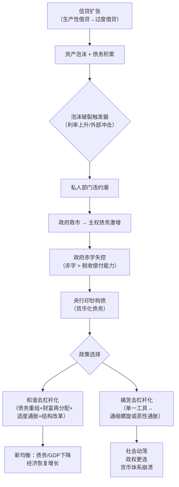

## 《国家为什么会破产：大周期》读书笔记
  
### 作者  
digoal  
  
### 日期  
2026-05-23  
  
### 标签  
读书笔记 , 国家为什么会破产：大周期     
  
----  
  
## 背景  

---
书名: 《国家为什么会破产：大周期》  
作者: [美] 瑞·达利欧  
译者: [美] 立雯  
出版社: 中信出版集团  
出版年份: 2025-6  
原书名: How Countries Go Broke: The Big Cycle  
笔记日期: 2025-05-23  
豆瓣ISBN: 9787521776829  
标签: [宏观经济, 债务周期, 国际金融, 历史, 世界秩序]  
---

  

> **一句话**：帝国会死于债务，文明会死于遗忘——达利欧用50年投资经验，还原了那条几乎无人能在有生之年亲眼看完的毁灭之路。  
>  
> **适合谁读**：对宏观经济、地缘政治感兴趣的投资者、政策研究者、历史爱好者；想理解"美国债务为何是全球定时炸弹"的普通读者。  
>  
> **阅读难度**：⭐⭐⭐☆☆（数据密集，但逻辑清晰，不需要经济学背景）  
>  
> **推荐指数**：⭐⭐⭐⭐☆  

---

## 一、时代坐标：这本书从哪里来？

2025年初，当这本书的英文版正式面世时，美国联邦债务已突破36万亿美元，财政赤字占GDP的比例接近6%——这是和平时期罕见的危险水位。与此同时，民粹主义浪潮席卷西方，中美博弈持续升温，AI技术引发生产关系再造。这不是偶然的背景，而是达利欧选择在此刻出书的核心动机。

达利欧是桥水基金创始人，管理规模最高时超过1500亿美元。他曾在2008年全球金融危机和2010-2012年欧债危机前准确预判风险。他的方法论不是看盘，而是构建"宏观机器"——用历史数据还原因果规律，再用规律推演当下。

这本书是他"原则系列"的收官之作，也是他自认为最重要的一本。前几本讲个人原则、债务危机机制、世界秩序演变，这本直接指向终极问题：**国家是怎么从繁荣走向破产的，以及今天的我们身处这条路的哪个位置。**

值得一提的是：大周期平均约80年一个轮回（上下浮动25年），接近一个人的寿命上限。这正是为什么大多数人对此毫无警惕——他们从未亲身经历过上一次。

---

## 二、核心命题：作者在说什么？

### 命题一：债务是国家破产的根本机制

达利欧研究了过去100年中35个货币市场的数据，得出一个贯穿全书的结论：**每个国家最终遭遇债务危机，不是因为意外，而是因为循环。**

债务周期的起点是健康的：借贷用于生产性投资，推动增长与繁荣。但回报会滋生贪婪，借贷变得过度，资产泡沫形成。当泡沫破裂，债务重压之下，国家面临两个选择：痛苦地削减开支（通缩性去杠杆，代价是经济衰退、社会撕裂），或是印钱稀释债务（通胀性去杠杆，代价是货币贬值、储蓄缩水）。两条路都很痛苦，区别只在于痛苦的分配方式。

最优解是达利欧所说的"**和谐的去杠杆化**"——四种工具协同使用：债务重组、财富再分配、适度货币宽松、结构性改革。1930年代的美国罗斯福新政是成功案例，日本1990年代后过度依赖货币宽松而忽略结构改革，则是失败的教训。

### 命题二：债务危机有九个可识别的阶段

这是本书最具操作价值的部分。达利欧将一场完整的债务危机分解为**九个阶段**，每个阶段都有可识别的信号：

```
阶段一～四：私人部门与政府双双深陷债务泥潭
           → 政府赤字持续，债务远超税收偿付能力

阶段五～六：危机蔓延至央行
           → 央行被迫"印钞"购债
           → 若利率持续上升，央行本身开始亏损

阶段七～九：去杠杆化完成，新均衡建立，新周期开启
           → 货币贬值减轻偿债压力
           → 旧秩序解体，新秩序诞生
```

达利欧认为，美国目前处于第四阶段末期，正向第五阶段迈进——这是财政状况恶化、阶级冲突迫近的临界前夜。

### 命题三：债务周期只是"整体大周期"的一部分

这是本书相比达利欧早期作品最大的理论升级。债务危机不是孤立发生的，它与另外四种力量共同构成**整体大周期**：

1. **债务/信贷/货币/经济周期**（本书主线）
2. **内部秩序与混乱周期**（贫富分化→民粹主义→内部冲突）
3. **外部秩序与混乱周期**（霸权更替→地缘博弈→战争风险）
4. **自然力量**（气候灾害、瘟疫）
5. **技术力量**（AI等颠覆性技术重塑生产关系）

这五种力量相互强化，共同决定一个国家乃至整个世界秩序的兴衰节律。

---

## 三、论证地图：达利欧怎么说服你的？



**关键数据支撑：**
- 研究覆盖过去100年、35个货币市场的历史数据
- 美国当前财政赤字约占GDP的6%，达利欧认为需削减至3%才可持续
- 削减路径：每年削减联邦支出3%、增加税收3%、央行下调实际利率1个百分点

**代表性案例：**
- 美国1930年代（成功的和谐去杠杆）
- 日本1990年代至今（失败的过度货币宽松）
- 历史上多个储备货币国家的贬值轨迹（荷兰盾→英镑→美元）

**论证方式的评价：** 达利欧的强项是用宏大数据建立"模式识别"，而非精确预测。他的逻辑链条严密，但批评者指出——历史从未简单重复，模板套用有过度决定论的风险。哈佛经济学家肯尼思·罗格夫在《金融时报》书评中肯定了达利欧的历史数据运用，但指出其未充分借鉴同类学术研究成果（如罗格夫与莱因哈特合著的《这次不同了》）。

---

## 四、前提假设与边界：什么情况下这不成立？

### 假设一：历史模式会重复

达利欧的整个框架建立在"规律可重复"的信念上。但当前世界有几个前所未有的变量：美元的全球储备货币地位（无先例的特权）、AI驱动的生产力革命、全球核威慑下的冲突克制。这些变量有没有可能打破"债务→破产"的路径？或许有，但达利欧认为这只是延迟，不是取消。

### 假设二：政策工具可以理性使用

"和谐去杠杆化"要求政策制定者协调债务重组、税收改革、货币政策——这在现实政治生态中极为困难。民主制度的短视激励、既得利益集团的阻力、党派极化，都可能让"合理方案"变成"不可能完成的任务"。

### 假设三：美国债务问题主要是技术问题

达利欧提供了一份精确的"3%-3%-1%"财政修复方案，但批评者认为，美国债务问题的核心不是不知道怎么做，而是没有政治意愿去做。技术解方案在结构性政治困境面前，价值有限。

**这本书的适用边界：** 用于理解"为什么会到这一步"，是极佳的历史框架工具。用于精准预测"什么时候崩溃"，则要保持谨慎——达利欧本人也承认无法准确预测时间窗口。

---

## 五、思想谱系：这本书在哪个传统里？

达利欧的思想根植于**宏观周期学派**——他与熊彼特（创造性破坏）、明斯基（金融不稳定假说）、基钦-朱格拉-康德拉季耶夫（多重周期叠加）共享同一个智识传统：**市场不是均衡的，而是周期的**。

与同时代思想的对话：
- vs. **现代货币理论（MMT）**：达利欧直接反驳"拥有主权货币的国家不会破产"的论断，认为印钞会侵蚀货币信用，终将引发危机
- vs. **罗格夫/莱因哈特**：结论相近（过度债务必有代价），但达利欧更强调周期的可操作性，而非纯粹的历史描述
- vs. **基辛格地缘政治学派**：达利欧将经济周期与权力转移整合，是少有的跨学科综合框架

对后来者的影响：本书登上《纽约时报》非虚构类畅销书榜，成为2025年政策圈、投资圈的必读参考文本。

---

## 六、我学到了什么？

**收获一：用"周期坐标"替代"当下直觉"**

最颠覆我认知的一点：我们对经济形势的判断，往往是在一个短周期（5-10年）的坐标系里做出的。达利欧的框架逼迫你把时间轴拉到80年甚至500年——在这个尺度上，很多"前所未有"的事其实都有先例，很多"稳如磐石"的结构其实都处于周期晚段。

**收获二：债务不只是财务问题，是权力问题**

债权国和债务国之间的关系从来不是中性的。当一国债务积累到不可持续的水平，财富会通过通胀、违约、货币贬值等方式被隐性再分配。理解这一点，才能理解为什么美元贬值不只是汇率问题，而是全球财富格局的重新洗牌。

**收获三：出路存在，但窗口会关闭**

达利欧反复强调这不是宿命论——问题有解，但解的条件是足够早、足够协调。历史上每一次"和谐去杠杆"的成功，都有一个共同点：在危机全面爆发之前，决策者采取了令人不适但必要的行动。拖延只会让代价指数级增长。

---

## 七、举一反三：这个框架还能用在哪？

**个人资产配置的周期视角**

当一个国家进入债务周期晚段（阶段四以后），历史数据显示：黄金、大宗商品、实物资产的表现往往优于国债和法定货币。这不是预测，而是在不确定性中的分散配置逻辑。

**理解新兴市场危机**

阿根廷、土耳其、斯里兰卡近年的债务危机，都可以用达利欧的九阶段框架逐一对应。这不是"他们的问题"，而是周期规律在不同国家的不同时序呈现。

**组织管理中的"去杠杆"思维**

"和谐去杠杆化"的四要素（债务重组、财富再分配、适度宽松、结构改革）在企业层面同样适用。一家资产负债表压力过大的公司，靠单一工具（只裁员或只借债）往往比靠组合手段更容易陷入死局。

---

## 八、批判与反思

**批评一：决定论的幽灵**

达利欧的框架有一种令人不安的"命运感"——周期似乎是不可抗拒的。但历史上确实存在打破惯例的时刻：战后布雷顿森林体系的建立、1990年代东欧的平稳转型，都不完全符合任何既有的周期模板。过度相信模板，可能遮蔽真正的结构性突破。

**批评二：缺乏对"例外"的深入处理**

美元作为全球储备货币，享有其他货币没有的"过度特权"（exorbitant privilege）。这究竟能在多大程度上延缓或改变周期？全书对这一核心问题的处理略显粗糙，基本结论是"只是延迟"，但论证不够深入。

**批评三：解方的政治可行性被低估**

达利欧给出了精确的财政修复公式，但对政治执行难度着墨甚少。现实是：在一个极化的民主政治生态中，"3%-3%-1%"这样的方案，光是达成共识就可能需要十年。

**时代已经变了的部分：** AI对生产力的重构，是达利欧框架中最大的变数。如果AI能带来20年代的第二次工业革命级别的生产力跃升，债务/GDP比率的可持续上限可能被重新定义。这是书中未能充分展开的可能性。

---

## 九、金句与记忆点

1. **"债务危机既能摧毁帝国，也能为投资者提供绝佳的投资机会。"**
   — 残酷的二重性：别人的破产，是有准备者的财富重分配时刻。

2. **"长期债务周期通常横跨约80年——接近一个人的一生。这致使我们难以通过亲身经历认知其规律。"**
   — 人类天生的认知盲区：我们只相信自己活过的历史。

3. **"信贷是一种兴奋剂，人们偏向于创造信贷，而债务随着时间的推移将上升。"**
   — 债务积累是人性的必然，不是政策失误的偶然。

4. **关于"有毒组合"：巨大财政困境 + 悬殊贫富差距 + 剧烈经济冲击 = 重大内部冲突的火药桶**
   — 三个条件单独出现都可以管控，三者叠加则危险质变。

5. **"必须重视经验与规律，不能因历史上的重大危机从未在有生之年出现过就轻视了其深层力量，因为它们很可能即将发生。"**
   — 这是全书最核心的警示：无知不是借口，而是风险。

6. **"和谐的去杠杆化"：债务增速低于经济增速，同时通胀温和上升**
   — 走钢丝的艺术：通缩的重力和通胀的离心力之间，有一条极窄的生路。

7. **"我凭借这套大债务周期模型准确判断市场走向并屡获收益。如今我步入人生新阶段，我愿将这些助我成功的核心方法论公之于众。"**
   — 一位亿万富翁的告别赠礼，动机是真诚的，也可能是傲慢的。

---

## 十、延伸阅读

1. **《债务危机》/ 瑞·达利欧** — 本书的前传，专注债务危机的微观机制，适合在读完本书后补充细节。

2. **《这次不同了：800年金融危机史》/ 莱因哈特 & 罗格夫** — 同样基于历史数据，但更具学术严谨性，与本书形成互补参照。

3. **《原则：应对变化中的世界秩序》/ 瑞·达利欧** — 本书的姐妹篇，将时间轴拉到500年，聚焦帝国兴衰的地缘政治维度。

4. **《明斯基时刻》/ 麦卡利** — 专门解析"金融不稳定假说"，是理解达利欧框架理论根基的最佳辅助读物。

5. **《大国政治的悲剧》/ 米尔斯海默** — 从地缘政治角度理解"外部秩序混乱周期"，与达利欧的五大力量框架形成对话。

---

## 附：大债务周期九阶段速查图

```
┌─────────────────────────────────────────────────────────┐
│              大债务周期：九个阶段                         │
├────────┬───────────────────────────────────────────────┤
│ 阶段1-4 │ 私人部门 + 政府双陷债务危机                    │
│         │ → 赤字持续 → 债务/GDP比率失控                  │
├────────┼───────────────────────────────────────────────┤
│ 阶段5-6 │ 危机蔓延至央行                                  │
│         │ → 央行印钞购债 → 央行资产负债表恶化            │
├────────┼───────────────────────────────────────────────┤
│ 阶段7-9 │ 去杠杆化 → 新均衡 → 新周期开启               │
│         │ → 货币贬值 → 债务负担减轻 → 旧秩序终结        │
└────────┴───────────────────────────────────────────────┘

  关键节点：美国当前约处于 阶段4 → 阶段5 的过渡区
```

---

*笔记写于 2025-05-23 | 基于公开资料、学术书评与深度思考整理*
*参考来源：《财经》书评、新浪财经洪灝书评、FT/Kenneth Rogoff评论、Wikipedia、虎嗅、36氪*
  
  
#### [PostgreSQL 解决方案集合](../201706/20170601_02.md "40cff096e9ed7122c512b35d8561d9c8")
  
  
#### [德哥 / digoal's Github - 公益是一辈子的事.](https://github.com/digoal/blog/blob/master/README.md "22709685feb7cab07d30f30387f0a9ae")
  
  
#### [About 德哥](https://github.com/digoal/blog/blob/master/me/readme.md "a37735981e7704886ffd590565582dd0")
  
  

  
