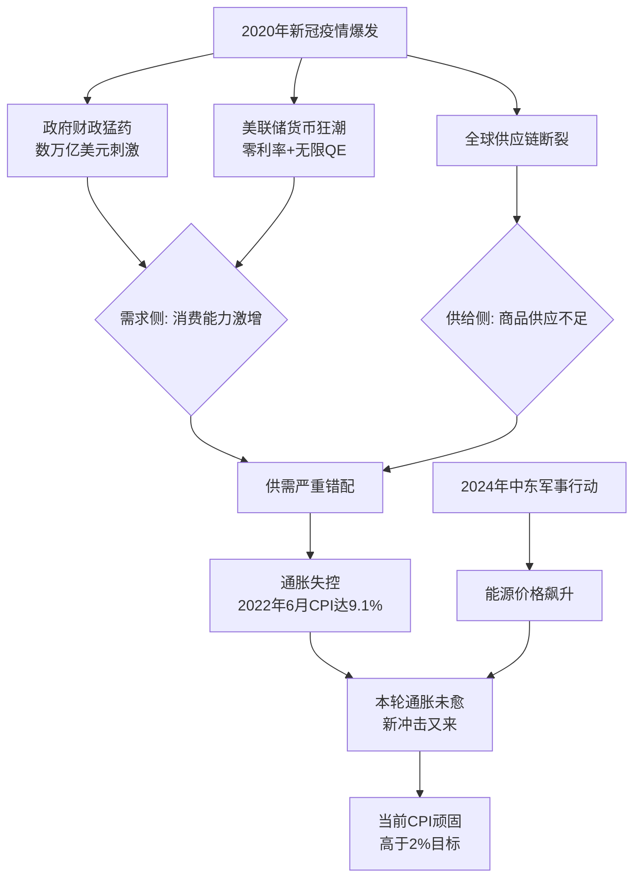
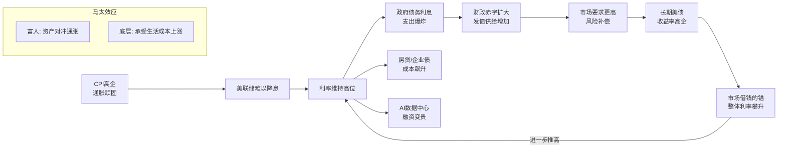
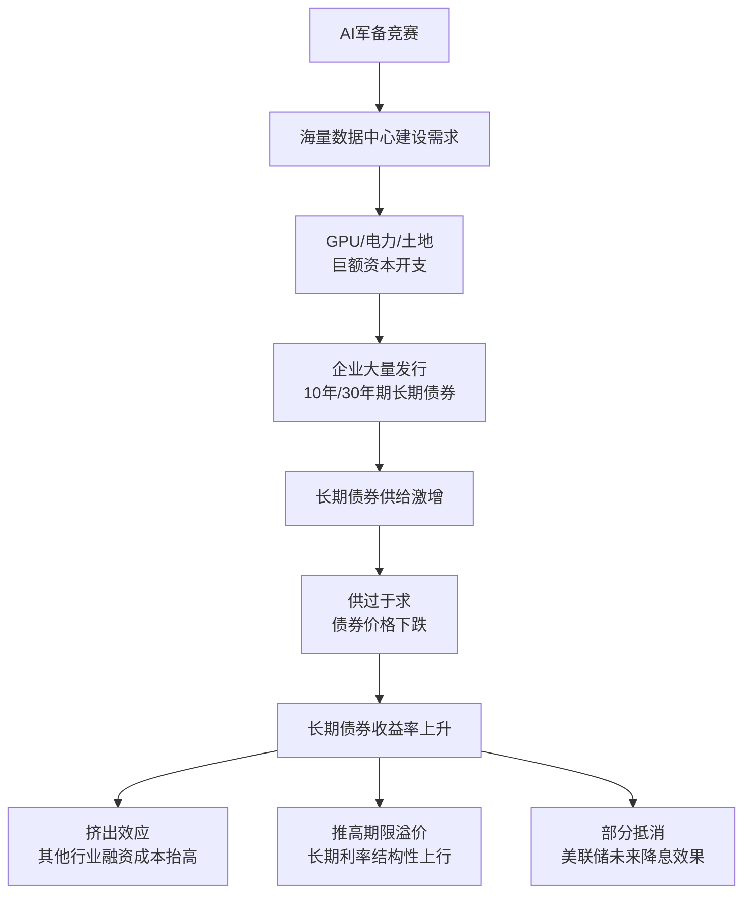
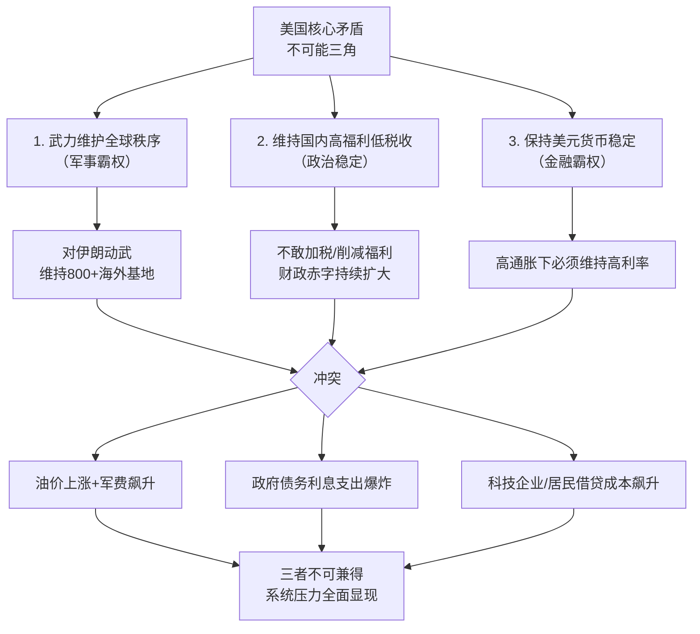
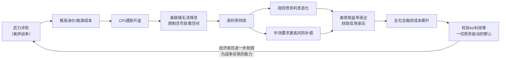
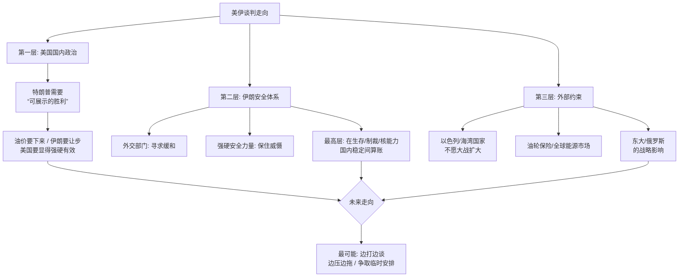

## 德说-第480期, 美国运转的齿轮卡住了  
  
### 作者  
digoal  
  
### 日期  
2026-05-23  
  
### 标签  
通胀 , CPI , 油价 , 战争 , 石油美元 , 财政赤字 , AI军备竞赛 , 能源冲击    
  
----  
  
## 背景  
  
美国现在进入了一个危险阶段：能源冲击、通胀压力、长期利率、财政赤字、AI军备竞赛和中东战争风险，开始互相咬住。  
  
## 先说背景  
  
过去美国靠美元体系、科技资本市场和军事联盟，把许多矛盾往外转移(过去美国能转移矛盾，部分靠的是美元回流买美债，让低成本融资得以持续。现在这个闭环正在被高通胀和地缘不确定性冲击)。  
  
现在看到的美国通胀, “病根”实际上在打伊朗之前就埋下了，甚至可以说，通胀是美国经济体系里周期性发作的“老毛病”。  
  
这轮通胀不是从2024年打击伊朗开始的，它的起点要追溯到**2020年新冠疫情爆发之后**，并在**2021年**开始全面抬头。原因主要来自两方面的“放水”和随后的供需失衡：  
  
**1. 史上最大规模的“撒钱”**  
疫情一来，美国政府和美联储为了托住经济，开启了史无前例的刺激政策：  
*   **财政猛药**：特朗普和拜登两届政府先后推出了数万亿美元的刺激法案，直接给民众发支票、补贴企业。  
*   **货币狂潮**：美联储不仅把利率降到零，还启动了“无限量”量化宽松（QE），也就是开动印钞机大量“放水”。  
  
**2. 供需的严重错配**  
另一边，实体经济却因为疫情被卡住了脖子：  
*   **供应链断裂**：全球工厂停工、运输瘫痪，商品供应不上。  
*   **消费反弹**：经济一重启，之前憋坏了的民众拿着政府发的钱疯狂消费，需求瞬间爆炸，远远超过了供给恢复的速度。  
  
这样一来，物价自然像坐了火箭一样飙升。美国CPI（居民消费价格指数）在2022年6月一度达到了**9.1%**的峰值，创下40年来的最高纪录。直到现在，虽然有所回落，但依然顽固地高于美联储2%的目标。  
  
所以，我们看到的情况是：**一轮超级通胀还没完全治好，新的地缘冲击（油价）又来了。** 本来美联储加息已经慢慢把通胀往下压了，现在美国在中东的军事行动又推高了油价，这就相当于在原本已经火烧屁股的通胀上，又浇了一勺油。  
  

## 现在呢?  
  
霍尔木兹海峡紧张、油价高企，能源价格已经影响了美国CPI(美国劳工统计局最新数据, 4月份居民物价涨幅达到3.8%)；  
  
CPI高企，美联储就难以降息(降息的目的是降低借贷成本. 美联储现在的困境是：不降息，高利率压制经济；降息，可能引爆二次通胀。降息对居民的冲击更直接 —— 持有资产（股票、房产）的富人能对冲通胀，而底层民众承受生活成本上涨的后果。)；  
  
长期美债收益率高企(为什么长期美债收益率会高企? 多因素叠加：通胀预期、财政赤字、发债供给、期限溢价、海外买家边际减少、美联储缩表、地缘风险。甚至极端的可能担心美国政府崩溃, 担心美国政府要借钱就不得不加票面利息, 导致抛售当前低票面利息的美债, 从而推高美债收益率. 最终体现在: “市场要求更高风险补偿”. ).  
  
美债收益率又是市场借钱的锚, 它高, 就会导致政府融资、房贷、企业债和AI数据中心融资都变贵(要付出更高的利息/回报才能借到钱. 打个比方: 就像银行给了一个高的固定利息, 你可以选择这种安全可靠回报还可用的理财方式借给银行, 为什么要花大风险把钱借给企业呢?)。  
  

AI军备竞赛不是空中楼阁，它要芯片、电力、土地、数据中心、长期债务和稳定现金流。钱贵了，野心就要接受物质条件的检验(也就是要求高回报)。  
  

  
再看现在的通胀: BLS公布的4月美国CPI同比为3.8%，能源同比上涨17.9%，能源项对当月CPI涨幅贡献很大。Dallas Fed也指出，AI数据中心融资可能增加长期债券久期供给，推高利率压力。这说明问题不是一个市场情绪，而是几个真实约束叠在一起：油、钱、债、战、算力。  
  
“AI数据中心融资可能增加长期债券久期供给，推高利率压力。” 这句话的核心逻辑链是：**AI数据中心建设需要巨额长期资金 → 企业大量发行长期债券融资 → 市场上长期债券供给激增 → 供过于求导致长期债券价格下跌、收益率（利率）上升 → 可能推高长期资金需求和期限溢价。**  
  
我们拆开来看：  
  
-   **AI数据中心融资**  
    建设AI数据中心极其烧钱，需要购买昂贵的GPU、土地、电力设施。企业通常无法全靠自有资金，需要外部融资。  
  
-   **增加长期债券久期供给**  
    “久期”可以简单理解为债券的平均还款期限。数据中心是重资产，回本慢（可能10-15年），企业为了匹配资金期限、降低再融资风险，自然会偏好发行10年期、30年期的**长期债券**。当大量项目同时上马，市场上这类长期债券的供给就会激增。  
  
-   **推高利率压力**  
    这是债券定价的基本原理：**债券供给增加 → 价格下跌 → 收益率（市场利率）上升**。当长期债券供应量远超投资者的需求时，发行方就必须提供更高的票面利率来吸引买家，这会直接推高市场的长期借贷成本。  
  
-   **更深层的影响**  
    达拉斯联储（Dallas Fed）担心的可能不止于此：  
  
    1.  **挤出效应**：AI浪潮的巨大融资需求，会吸走大量资金，迫使其他行业（如房地产）发债时也不得不付出更高利率，抬高全社会的融资成本。  
    2.  **推高“期限溢价”**：投资者持有长达30年的债券，会要求额外的风险补偿。海量供给会进一步推高这个溢价，让长期利率面临持续的结构性上行压力。  
    3.  **影响美联储**：这种由技术投资驱动的长期利率上升，可能会部分抵消美联储未来降息的效果，尤其会直接推高企业的长期贷款和房贷成本。  
  
美国对伊朗动武，不宜简单归结为“石油美元”一个目的。更准确地说，它同时服务于核威慑、以色列安全、霍尔木兹通道、地区秩序和美元能源体系稳定。石油美元虽然不是唯一目的，但它是这套中东秩序背后的重要金融底座。  
  
本来美国打伊朗是想速战速决, 巩固“石油美元”, 这是美国全球霸权的根基. 控制中东就控制了全球能源心脏，但是近年来，伊朗带头在石油贸易中推行非美元结算，直接动摇了美元的根基。所以，通过军事打击震慑伊朗和潜在的“去美元化”追随者，意在强行修补出现裂痕的金融霸权。  
  
现在硬生生变成了持久战, 现在的能源价格波动、美债收益率的起伏，都是在这个大背景下展开的。战争的烧钱速度和引发的连锁反应（比如油价飙升），已经反过来让美国的通胀和债务问题雪上加霜.  
  
## 美国的核心矛盾到底是啥  
首先美伊战争肯定不是核心矛盾，它更像一个**捅破窗户纸的棍子**，把美国经济肌体里更深层的病症给捅了出来。  
  
美国现在的核心矛盾，用一句话概括就是：  
**一场极其昂贵的“三重霸权”维护工程，撞上了早已透支的“财政能力”这堵墙。**  
  
美国现在的所有现象 —— 高通胀、高利率、美债被抛售、AI泡沫受检验 —— 最终都汇流到这里。  
  
我们可以把这个核心矛盾拆成三层来看：  
  

  
### 第一层：帝国的“支出”无限膨胀  
  
美国同时在为三场“战争”买单，每一场都是烧钱的无底洞：  
  
1.  **军事霸权（硬实力）**：直接打击伊朗、援助乌克兰、在全球维持800多个军事基地、更新核武库 …… 这是真金白银在燃烧。美伊战争正是这一项下的巨大新开支。  
2.  **货币霸权（软实力）**：为了维持美元信用，美联储在高通胀下不敢轻易降息，只能维持高利率。这导致美国政府自己的债务净利息支出已经接近或超过国防支出，成为财政中增长最快、最难压缩的项目之一。等于说，为了维持美元信用，反而在快速透支财政能力。  
3.  **科技霸权（未来实力）**：从《芯片法案》到AI军备竞赛，政府通过巨额补贴和税收优惠，引导资本投入芯片制造和数据中心。但高利率让AI公司的融资成本飙升，直接检验这项野心的可行性。  
  
### 第二层：帝国的“收入”无以为继  
  
这正是我们之前讨论的，过去美国解决内部矛盾的“外挂”失灵了：  
  
-   **石油美元闭环正在松动**：过去，中东产油国赚了美元后，会乖乖地买美债，让低成本资金回流美国。现在，中东局势紧张，油价不降反升，加剧通胀；同时，产油国和新兴大国（如金砖国家）开始推行本币结算，**这些石油利润不再百分百回流美债市场**，导致美债最大的海外买家群体在撤退。  
-   **替代买家缺失，内部接盘乏力**：过去15年，东大是美债的主要增持者，现在也在持续减持。美联储自己为了对抗通胀，正在缩表，也是净卖家。当全球的“闲钱”都不再涌入时，财政赤字（支出远超税收）就只能硬着陆，直接体现为市场用脚投票，推高美债收益率。  
  
### 第三层：这就是财政、货币与地缘的“不可能三角”  
  
这才是终极的核心矛盾，对应当下就是：  
  
**“武力维护全球秩序” + “维持国内高福利低税收” + “保持美元货币稳定” = 不可能同时做到**  
  
-   你要打伊朗**（武力）**，就得忍受油价上涨(油价这个事, 打赢了另说)和更高的军费开支。  
-   你要维持国内稳定**（福利/税收）**，就不敢加税、不敢削减社保，导致财政赤字继续扩大。  
-   你要对抗通胀**（货币稳定）**，就得维持高利率，结果就是政府利息支出爆炸，科技企业（AI）和普通人的借贷成本飙升，最终可能引爆衰退。  
  
**美伊战争正是这个三角矛盾的引爆点。** 它强行把三个目标捆在一起，逼迫市场来算总账：你的武力行动，正在让你的货币稳定和财政可持续性同时崩溃。  
  
## 美伊战争深度分析  

美伊战争一场简单的战争，而是一个帝国进入“高成本维护期”后，各个维度的正反馈循环同时走向逆转。过去是“美元越强，美军越强；美军越强，美元越强”，现在这个循环正在变成：**“武力冲突 → 推高通胀 → 限制货币空间 → 恶化债务 → 动摇信用 → 成本全面飙升 → 检验一切野心”。**  
  
那美伊谈判有用吗? 有句话叫“战场上拿不到的，谈判桌上更拿不到”. 现在很显然美国拖不下去了, 美国只有“打赢”这条路!  
  
但必须解释一下“打赢”这个词，在今天的背景下含义已经变了。它不再意味着占领德黑兰、实现政权更迭，而变成了 “以战逼和” ，用局部的、有限度的军事胜利，去换取一个在谈判桌上体面退出的台阶。  
  
美国不能无成果地退，但也承受不起全面战争，所以最现实的路线是有限打击、制造筹码、以战逼谈。  
  
### 为什么说“以战逼和”是美国的现实选择？  
  
前面说的美国的所有经济矛盾（通胀、利率、债务），正是美国“拖不下去”的根本原因，也恰恰是它急切希望通过谈判来止血的动力。  
  
1.  **军事上的“打赢”有严格边界**  
    美国追求的不是一场全面战争，而是在**短时间内、以可控成本**，达成几个硬指标：  
  
    -   **摧毁核能力**：彻底端掉伊朗的核设施，确保至少5-10年内无法重启。  
    -   **打掉反击力量**：消灭弹道导弹部队和海军快艇，解除对霍尔木兹海峡的即时威胁。  
    -   **震慑代理人**：通过定点清除，重创伊朗对“抵抗轴心”的指挥能力。  
    完成这些，就创造了“拳头”的威慑力。但接下来，靠军事手段是没法让伊朗政府签字投降的，那是个无底洞。  
  
2.  **谈判是兑现军事红利的唯一途径**  
    战场上拿不到的，谈判桌上更拿不到；但战场上拿到的东西，必须通过谈判来**固定下来**。  
  
    -   美国想停：油价高企、债市动荡、无法降息，这些内部压力（你之前分析的）要求冲突必须尽快收场。  
    -   伊朗想停：基础设施和军事能力遭重创，政权安全受威胁，需要喘息。  
    所以，当美国的“拳头”把伊朗打到痛处，而伊朗又知道美国不敢（也无力）陷入地面持久战时，双方就有了谈的默契。这个谈判的目标不是建立和平，而是**在美国军事实力创造的优势窗口期内，敲定一份不稳定的停火协议**。  
  
### “拳头决定谈判结果”的新逻辑  
  
不是谁的拳头大谁就赢，而是谁的拳头能打出一个对自己有利的“现状”，并以此为筹码逼迫对方接受。  
  
美国就是要用拳头打出一个新现状：**伊朗的核与常规威慑被暂时解除**。然后拿着这个战果，在谈判桌上逼迫伊朗承诺永久弃核、限制导弹、切断代理人链条。如果伊朗不答应，美国就保留继续空袭的“兜底”选项。  
  
### 为什么说美国必须“打赢”才能谈，且只能选择“谈”？  
  
因为如果美国在军事上没有取得你所说的那种决定性的“打赢”（即摧毁预设目标），它就毫无谈判筹码，此次行动就彻底失败。但如果它在取得这些战果后，拒绝谈判、选择继续升级，那就会陷入我们之前讨论的“帝国过度扩张”的泥潭——高昂的后续成本（财政、政治、人员伤亡）会直接引爆其内部矛盾。所以，**“只能打赢才能开启谈判”**，是它内外部压力共同作用下的唯一理性路径。  
  
总结：**美伊谈判有用，但此“谈判”非彼“谈判”。** 它不是两个平等对手间的友好协商，而是强者在达成有限军事目标后，为了体面脱身并固定战果，用“拳头”逼出来的城下之盟。它也许能换来暂时的停火，但很难带来持久的和平。这个结局，完美地验证了最初的判断：物质的约束力，最终会检验并修正美国的野心。  
  
## 美伊谈判  
那么谁决定美伊谈判走向？不是某一个谈判代表。决定权在三层。  
  

第一层是美国国内政治。特朗普要的不是抽象和平，而是可展示的胜利：油价要下来，伊朗要让步，美国要显得强硬有效。若谈判能给他这个结果，他会要交易；若谈判让他显得软弱，他会重新抬高军事威胁。  
  
第二层是伊朗的安全体系。伊朗也不是单一声音。外交部门要缓和，强硬安全力量要保住威慑，最高决策层要在生存、制裁、核能力和国内稳定之间算账。AP报道提到，伊朗强硬安全人物已成为谈判立场的重要塑造者，这说明它不会轻易交出核心筹码。  
  
第三层是外部约束。以色列、海湾国家、油轮保险、全球能源市场、东大和俄罗斯都会影响谈判空间。中东盟友不愿大战扩大，因为战火烧起来，首先烧的是地区航运和能源设施。美国也不愿被拖进长期战争，因为战争会反过来推高油价和通胀，伤到特朗普自己的国内政治。  
  
所以我看美伊走向，最可能不是马上全面和平，也不是马上总崩，而是“边打边谈、边压边拖、争取临时安排”。如果未来几周油路逐步恢复、冻资或制裁出现阶段性安排、伊朗核问题进入下一轮框架谈判，那就是降温路线。反过来，如果油轮继续受阻、美国或以色列遭遇重大袭击、伊朗核设施或军事目标被大规模打击，那局面就会转入升级。  
  
沃什作为新任美联储主席，下一步最可能不是急着降息，而是在第一次关键FOMC会议上先守信用。通胀还高，能源冲击未消，若为了配合白宫而过早降息，短端利率也许能压一压，但长期美债收益率可能因通胀预期和美联储独立性疑虑反而上行。那就是形式上宽松，实质上更贵。沃什真正要处理的是一个两难：不降息，特朗普和市场施压；降太快，美元信用和长债市场施压。  
  
插一条备注： FOMC 是 Federal Open Market Committee，中文叫美国联邦公开市场委员会。它是美联储内部最关键的货币政策决策机构，决定美国联邦基金利率目标区间，也就是市场常说的“美联储加息、降息或按兵不动”。它还决定缩表、扩表和公开市场操作方向。2026年6月16日至17日有一次FOMC会议，这个日期是确定的；  
  
特朗普下一步会怎样？我看是两手并用：嘴上更硬，手里找交易。他会逼伊朗让步，也会逼美联储配合，还会利用访华成果向国内证明自己能“让东大帮忙稳定局面”。他的弱点也在这里：他需要一个快结果。但中东问题不是房地产谈判，核、制裁、安全保证、代理人网络、能源通道，任何一项都不能用一句话成交。  
  
再看特朗普和普京先后访华。AP报道显示，特朗普访华后不久，普京也到北京，双方强调战略关系和能源贸易。这个排列本身就是信号：东大在美国和俄罗斯之间，不会简单选边，而是争取主动。对美国，东大要稳住贸易、技术和金融风险；对俄罗斯，东大要稳住能源、欧亚战略纵深和反制西方压力的筹码。  
  
中俄后续会怎么行动？不会公开组成军事同盟式的硬集团，但会继续深化“背靠背”的实际合作。俄罗斯需要东大市场、能源出口和外交支撑；东大需要俄罗斯提供战略缓冲、能源安全和牵制美国的外部变量。但东大也会防止被俄罗斯拖进不可控冲突，所以合作会加强，绑定会有边界。  
  
## 总结  
  
美国正在从“低成本霸权扩张期”进入“高成本霸权维护期”. 它仍有强大的金融、科技和军事能力，但这些能力不再便宜。油价推高通胀，通胀压住降息，长债收益率抬高财政和AI融资成本，中东冲突又反过来加重这一切。美伊战争不是核心矛盾本身，而是把美国财政、货币、科技和地缘成本同时暴露出来的触发器。  
  
  
参考来源：  
[BLS 4月CPI](https://www.bls.gov/news.release/cpi.htm?rel=outbound)、[Dallas Fed AI融资与利率](https://www.dallasfed.org/research/economics/2026/0210-searls-aifinancing)、[美联储FOMC日程](https://www.federalreserve.gov/newsevents/2026-june.htm)、[美联储沃什宣誓](https://www.federalreserve.gov/newsevents/pressreleases/other20260522a.htm)、[Axios美伊谈判](https://www.axios.com/2026/05/22/trump-iran-meeting-resume-war-deal)、[AP中俄北京会晤](https://apnews.com/article/5b7304bc1604cbb7135cb96f217b8b3e)  
  
  
  
#### [PostgreSQL 解决方案集合](../201706/20170601_02.md "40cff096e9ed7122c512b35d8561d9c8")
  
  
#### [德哥 / digoal's Github - 公益是一辈子的事.](https://github.com/digoal/blog/blob/master/README.md "22709685feb7cab07d30f30387f0a9ae")
  
  
#### [About 德哥](https://github.com/digoal/blog/blob/master/me/readme.md "a37735981e7704886ffd590565582dd0")
  
  

  
