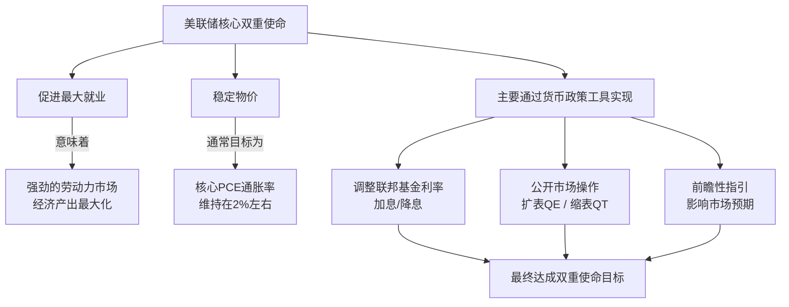
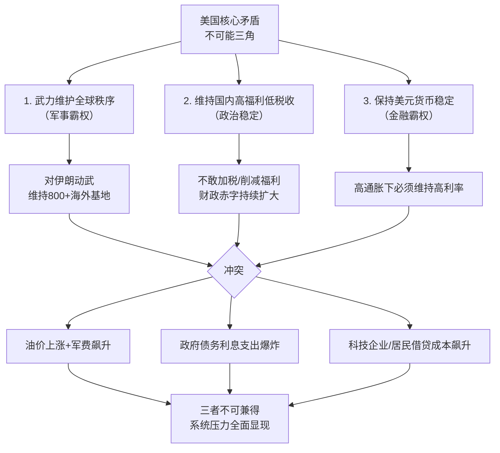

## 德说-第481期, 美联储的哪些行为会导致美元信用受损  
  
### 作者  
digoal  
  
### 日期  
2026-05-23  
  
### 标签  
美联储 , 美元信用 , 通胀 , 就业  
  
----  
  
## 背景  
美联储导致美元信用受损的行为，本质上就是**在“不可能三角”中做出了错误选择，或者被迫违背了其最核心的使命。**  
  

  

  
美元信用建立在两根支柱上：**对内购买力稳定（低通胀）**和**对外无违约风险的“避风港”地位（国债信用）**。美联储的行为只要同时严重伤害这两根支柱，美元信用就会受损。  
  
具体来说，以下行为和情境是致命的：  
  
### 1. 行为：为配合财政而屈服于政治压力，过早降息或停止缩表  
  
这是当前沃什面临的最直接风险，也就是“财政支配货币”。  
  
-   **为什么这会损害信用？**  
    这会打破美联储“通胀斗士”的承诺，制造**通胀预期失控**。市场会认为，美联储不再以控制通胀为首要目标，而是变成了政府的提款机。  
  
-   **直接后果：**  
    -   **对内失信**：通胀预期一旦失控，工人会要求更高工资，企业会提前涨价，形成“工资-物价螺旋”，美元的国内购买力被迅速稀释。  
    -   **对外失信**：长期美债会被全球投资者抛售。因为持有美债赚取的固定利息，将跑不赢因美联储纵容而飞涨的通胀。所以“抛售当前低票息美债，推高收益率”就是这个逻辑。长债收益率飙升，意味着市场在用脚投票，表明对美联储管理通胀的能力和意愿失去了信心。  
  
### 2. 行为：实施“金融压抑”或直接干预债市，人为压低利率  
  
这比第一点更进一步。当政府债务高到无法承受市场利率时，美联储可能会被要求直接或间接地**限制利率上行**，也就是“金融压抑”。  
  
-   **为什么这会损害信用？**  
    这是一种变相的违约。债券的真实价值会被通胀侵蚀。当美联储用印出来的钱去强行购买国债（重启QE，但目的不是应对危机，而是为了帮政府还债），就等于将政府债务货币化。  
  
-   **直接后果：**  
    这是对美元信用的致命打击。国际投资者会发现，他们持有的美债收益率被人为压低，无法补偿通胀和风险，而美元本身又被超发稀释。这会引发储备货币地位的加速崩塌，各国央行会加速去美元化，寻找其他资产（如黄金、其他货币）来替代美元储备。  
  
### 3. 行为：在系统性危机中无法履行最后贷款人职能  
  
美元信用的另一面是美国国债作为全球“终极安全资产”的地位。这个地位不仅依靠政府信用，也依靠美联储在危机时刻提供流动性的能力。  
  
-   **为什么这会损害信用？**  
    如果未来美债市场因供需严重失衡（如无人接盘）而出现流动性危机（想卖都卖不掉），而美联储因为害怕通胀，或者国会不及时提高债务上限而无法介入，导致美债市场冻结，这会让美债的安全性瞬间消失。  
  
-   **直接后果：**  
    全球金融体系的基石会动摇。美债不再是无风险资产，其定价之锚的作用会消失，引发全球金融海啸，美元体系的核心功能失效。这是一种被动失信，因为美联储作为稳定器的承诺被证明失效了。  
  
### 4. 行为：资产负债表永久化与正常化失败  
  
美联储在2008年和2020年两次大规模扩张资产负债表（QE），吸收了天量国债和抵押贷款支持证券（MBS）。它一直承诺这是“临时性”措施，会逐步缩表恢复正常。  
  
-   **为什么这会损害信用？**  
    如果美联储永远无法缩表，甚至一遇到压力就重新扩表，就坐实了它已经陷入“QE依赖”。这意味着金融体系永远在吃“政策鸦片”，货币政策空间名存实亡。  
  
-   **直接后果：**  
    市场会发现，美联储没有退出策略。这扭曲了所有资产价格，让市场无法形成真实的价格信号。这同样是美元信用的内伤，表明其货币纪律和独立性已严重丧失。  
  
### 总结：沃什的困局与美元的命运  
  
沃什面临的正是**第1种行为的考验**。  
  
他如果顶住压力，坚守独立性，拒绝过早降息，那会加剧短期的经济痛苦，引发白宫和市场的不满，甚至可能导致美债市场因高利率而持续动荡。  
  
但他如果屈服于压力，用降息来配合政治和财政需求，那市场就会立刻解读为美联储开始走上“财政支配货币”之路。  
  
沃什只是一个缩影。他的选择，无论进退，都将暴露在“高成本霸权维护期”的裂痕。而他最大的悲剧在于，**维持信用可能引爆近在眼前的危机，而屈从压力则会埋下美元信用慢性死亡的种子。** 这个两难，就是美国现在最真实的困境。  
  
  
#### [PostgreSQL 解决方案集合](../201706/20170601_02.md "40cff096e9ed7122c512b35d8561d9c8")
  
  
#### [德哥 / digoal's Github - 公益是一辈子的事.](https://github.com/digoal/blog/blob/master/README.md "22709685feb7cab07d30f30387f0a9ae")
  
  
#### [About 德哥](https://github.com/digoal/blog/blob/master/me/readme.md "a37735981e7704886ffd590565582dd0")
  
  

  
