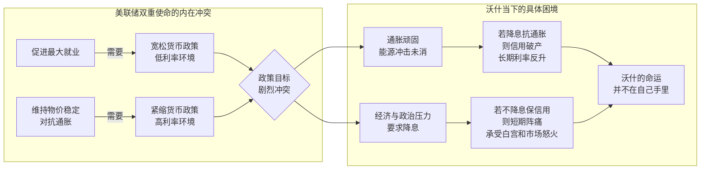

## 德说-第482期, 美联储新主席沃什的困境  
  
### 作者  
digoal  
  
### 日期  
2026-05-23  
  
### 标签  
美联储 , 美元信用 , 通胀 , 就业  
  
----  
  
## 背景  
**沃什的命运并不在自己手里**  
  
2026年6月，新任美联储主席凯文·沃什将主持他的第一次关键FOMC会议。这位曾经的市场派经济学家，如今坐在这把椅子上，面对的不是教科书式的货币政策考题，而是一道几乎无解的困局。  
  
他的命运，从一开始就不在自己手里。  
  
## 三重枷锁  
  
第一道枷锁，来自通胀。美国劳工统计局公布的最新数据显示，4月份CPI同比上涨3.8%，其中能源价格同比飙升17.9%，是推动物价上涨的最大推手。霍尔木兹海峡的紧张局势持续推高油价，而油价又通过运输、生产、消费各个环节渗入经济肌体的毛细血管。通胀这只猛兽只是被暂时关进了笼子，远没有被驯服。  
  
第二道枷锁，来自债务。长期美债收益率持续高企，市场用真金白银表达了对美国财政纪律的深度不信任。财政赤字看不到收敛的迹象，政府为了借钱，不得不付出越来越高的票面利息，这反过来又恶化了赤字 —— 一个标准的恶性循环。美债收益率是整个市场借贷成本的锚，它居高不下，意味着政府融资、住房贷款、企业债券、乃至AI数据中心的建设资金，全部变贵。  
  
第三道枷锁，来自一场不该由美联储主席负责的战争。美国在中东的军事行动，原本设想的是速战速决，用有限的打击换取伊朗在核问题上的让步，从而巩固石油美元的金融底座。但现在，战事拖延，油价飙升，供应链受阻，通胀预期重新抬头。这场战争不是核心矛盾本身，却是一根捅破窗户纸的棍子，把所有被掩盖的财政、货币和地缘成本全部暴露在阳光下。  
  
三重枷锁，锁住的是沃什的每一个政策选项。  
  
## 降息的陷阱  
  
沃什最可能面临的诱惑 —— 或者说压力 —— 是降息。  
  
白宫需要降息。特朗普需要一场“可展示的胜利”，他需要油价回落、经济平稳、股市向好，为他的政治议程提供弹药。美联储维持高利率，在他看来不是审慎，而是障碍。  
  
市场也需要降息。AI军备竞赛正进行到白热化阶段，科技巨头们动辄宣布千亿美元级别的数据中心投资计划。这些计划建立在大量长期债务融资的基础上，利率每高一个百分点，商业模型的可行性就要重新被检验。钱贵了，野心就要接受物质条件的检验。  
  
但沃什如果过早降息，会发生什么？  
  
短期来看，联邦基金利率也许能压下去一点。但问题是，市场看的不只是今天的美联储，市场看的是美联储的信用。如果市场认为美联储在白宫的压力下放弃了对抗通胀的承诺，通胀预期就会立刻抬头。而通胀预期一旦抬头，长期美债的持有者就会要求更高的风险补偿——也就是更高的收益率。  
  
于是出现一个悖论：沃什降息，短期利率可能下降，但长期利率反而可能上升。形式上宽松了，实质上更贵。这恰恰是美联储信誉受损后最典型的市场反应：你越想用宽松来讨好市场，市场越会用更高的溢价来惩罚你。  
  

  
## 帝国的账单  
  
更深层的问题在于，沃什面对的困局不是技术性的，而是结构性的。  
  
美国正在从“低成本霸权扩张期”进入“高成本霸权维护期”。过去，美国靠美元体系、科技资本市场和军事联盟，能够把许多矛盾向外转移。石油美元环流让中东产油国的利润回流美债市场，为美国的财政赤字提供了廉价融资。东大持续增持美债，为这个闭环再添一块压舱石。  
  
现在，这个闭环正在断裂。产油国不再百分百将石油利润换回美元、买入美债，中东的动荡反而成了美债市场的利空而非利多。东大也在减持。美联储自己在缩表。当全球的闲钱都不再涌入时，美国政府却依然在以创纪录的规模发债融资。  
  
这就是沃什真正的困境：他接手的不是一个正常的央行，而是一个正在为帝国透支买单的清算所。  
  
帝国的支出无限膨胀——军事霸权要在中东和全球维持存在，货币霸权要求高利率捍卫美元信用，科技霸权要求低利率滋养AI产业。三场“战争”同时烧钱，但收入无以为继。这是财政、货币与地缘的“不可能三角”，沃什坐在这个三角的交叉点上，手里只有一把利率工具。  
  
## 谁在决定沃什的命运？  
  
所以，决定沃什命运的，不是他本人的学术倾向或政策偏好。  
  
是他的前任鲍威尔在疫情期间的零利率加无限量QE，埋下了通胀的种子。是美国财政部的赤字预算，绑住了他的左手。是五角大楼在中东的行动，绑住了他的右手。是华尔街和硅谷的AI野心，要求他为繁荣担保。是白宫的政治周期，要求他为选票负责。  
  
而他唯一能做的——调整联邦基金利率——恰恰是所有选项中束缚最多的那一个。  
  
第一层决定权在美国国内政治。特朗普要的不是抽象的货币稳定，而是可以展示的经济成绩。如果沃什配合，也许能换来一段短暂的蜜月期；如果他抗拒，政治压力将接踵而至。  
  
第二层决定权在外部地缘。霍尔木兹海峡的每一次擦枪走火，都会立刻传导为能源价格波动，然后是通胀数据，然后是市场对美联储的预期。沃什的会议桌，连接着半个地球之外的战场。  
  
第三层决定权在市场信心。美债收益率不是一个数字，它是全世界投资者对美国国力的押注。一旦市场开始怀疑美国的偿债能力或货币信用，沃什将面临比任何一位前任都更棘手的选择：是捍卫美元的国内购买力，还是捍卫美元的国际信用？  
  
这两者在过去是一回事，现在却正在分叉。  
  
## 边压边拖  
  
沃什最可能采取的策略，不是果断降息，也不是强硬加息，而是“边压边拖”。  
  
他会竭力守住美联储的信用，至少在第一次关键会议上传递出独立和审慎的信号。他不会想成为那个被市场标记为“屈服于白宫”的美联储主席，因为一旦失去信用，他就真的一无所有了。  
  
但他也不会完全关上降息的大门。他会留出模糊的空间，让市场自行解读。他会强调“数据依赖”，把推迟降息的责任推给顽固的通胀和不确定的油价，而不是自己的主观判断。  
  
这本质上是一种防守策略。不是主动塑造局面，而是被动应对。  
  
这也正是沃什命运的缩影：他不是棋手，他是棋盘上最重要但最不自由的那枚棋子。  
  
“物质的约束力，最终会检验并修正所有人的野心。” 这不仅适用于在AI赛道上烧钱的科技巨头，也适用于试图用武力维护中东秩序的美国军方，更适用于坐在美联储主席位置上的沃什。  
  
他的履历、他的理论、他的信念，在油、钱、债、战、算力这五重真实约束面前，都只是次要变量。  
  
沃什的命运并不在自己手里。它攥在拜登和特朗普的财政账单里，漂在霍尔木兹海峡的油轮上，系在东大和布鲁塞尔的美债持仓决策中，埋在得克萨斯州的AI数据中心工地下。  
  
他只是一面镜子，照出了美国从低成本霸权走向高成本维护时，那些被掩盖的裂痕。  
  
  
#### [PostgreSQL 解决方案集合](../201706/20170601_02.md "40cff096e9ed7122c512b35d8561d9c8")
  
  
#### [德哥 / digoal's Github - 公益是一辈子的事.](https://github.com/digoal/blog/blob/master/README.md "22709685feb7cab07d30f30387f0a9ae")
  
  
#### [About 德哥](https://github.com/digoal/blog/blob/master/me/readme.md "a37735981e7704886ffd590565582dd0")
  
  

  
