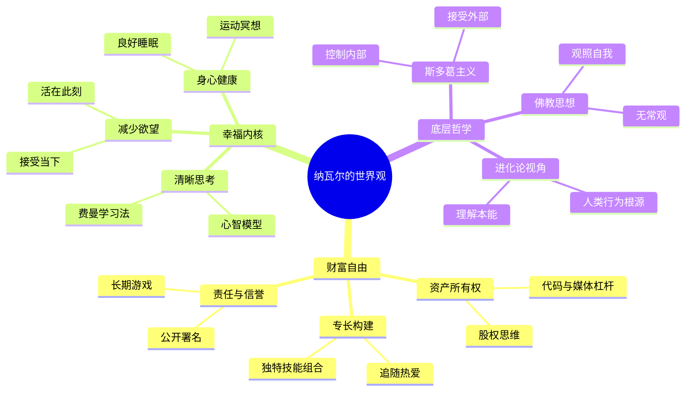

## 《纳瓦尔宝典：财富与幸福指南》读书笔记
  
### 作者  
digoal  
  
### 日期  
2026-05-23  
  
### 标签  
读书笔记 , 纳瓦尔宝典：财富与幸福指南     
  
----  
  
## 背景  
  
  
---
书名: 《纳瓦尔宝典：财富与幸福指南》  
作者: [美] 埃里克·乔根森（整理）/ 纳瓦尔·拉维坎特（原著）  
译者: 赵灿  
出版年份: 2020（英文）/ 2022（中文）  
出版社: 中信出版社  
笔记日期: 2026-05-23  
豆瓣链接: https://book.douban.com/subject/35876121/  
ISBN: 9787521741124  
标签: [财富自由, 人生哲学, 硅谷思维, 斯多葛主义, 投资]  
---

  
## ——一位硅谷游牧哲学家的财富与自由操作系统

> **一句话**：财富不是目的，自由才是；幸福不是追求，而是回归。  
> **适合谁读**：想脱离"时间换金钱"循环的年轻人、对财富与意义关系有困惑的职场人、对东西方哲学融合感兴趣的思考者  
> **阅读难度**：⭐⭐☆☆☆（碎片化语录，读起来轻松，吃透却不易）  
> **推荐指数**：⭐⭐⭐⭐☆  

---

## 一、时代坐标：这本书从哪里来？

2018年，纳瓦尔·拉维坎特在推特上发了一条长达40条的连续推文，标题叫《如何不靠运气致富》。那条推文在短短几天内被转发数十万次，成为硅谷创业圈的现象级内容。

这不是一个偶然时刻。

彼时，**知识经济正在撕裂传统的财富逻辑**。代码开始以零边际成本复制，播客和YouTube让个人媒体与电视台分庭抗礼，移动互联网让一个人在卧室里可以触达全球数百万用户。旧的财富模式——努力工作、积累资历、等待晋升——在这一代人眼前慢慢失效。

与此同时，"贩卖焦虑"的自媒体大行其道：理财课、副业课、成功学充斥市场，本质都是在出卖"速成"的幻觉。人们读了很多书，却越来越焦虑，越来越不知道到底该怎么活。

纳瓦尔的出现是一种异类——他不卖课，不讲速成，甚至不提供具体的操作步骤，只是冷静地说出几个他认为"正确的真相"。

2019年，产品策略师埃里克·乔根森作为一个普通粉丝，系统整理了纳瓦尔散落在推特、播客、访谈中的文字，在征得纳瓦尔同意后，编成了这本书。书名《The Almanack of Naval Ravikant》致敬富兰克林的《穷理查年鉴》——作者将纳瓦尔定位为"数字化时代的富兰克林"。

2020年，英文版上市即登顶亚马逊年度财经类畅销榜第一。2022年，中信出版社引进中文版。

---

## 二、核心命题：作者在说什么？

全书分两大部分：**财富**与**幸福**。这两个词放在一起并非偶然——纳瓦尔认为，它们的底层逻辑惊人地相似：都是可以习得的技能，而非靠运气或天赋得到的东西。

### 命题一：财富≠金钱，财富=睡后收入

纳瓦尔对"财富"有一个反直觉的重新定义：

> 财富是在你睡觉时也能为你赚钱的资产。金钱只是转移时间和财富的方式。地位是你在社会等级中的位置。

普通人追求的是工资——用时间换钱，一旦停止工作收入归零。纳瓦尔说这是个陷阱，无论时薪多高，本质上都是在出租自己的人生。

真正的财富来自**资产的所有权**：企业股权、代码产品、媒体内容、知识版权……这些东西可以被无限复制，边际成本趋近于零。

他提出了三种杠杆：
- **劳动力杠杆**（让别人为你工作）——古老但门槛高
- **资本杠杆**（用钱生钱）——需要本金
- **零边际成本杠杆（代码+媒体）**——这是当代普通人最可触达的机会

一行代码可以服务一百万人，一篇文章可以被阅读无数次，一个视频可以永远在互联网上流传。这是过去任何时代都不曾有过的杠杆形式。

### 命题二：独特知识+责任感=定价权

如何找到自己值得被付报酬的地方？纳瓦尔给出了"专长"（Specific Knowledge）的概念：

**专长是你无法被培训出来、却可以通过追随热爱自然习得的东西。**

如果市场可以轻松培训出替代你的人，你就没有谈判筹码。真正的稀缺性来自那些别人学不来、或者不愿学的独特能力组合——比如同时懂技术和销售，同时懂金融和写作。

他还强调，要对自己的工作署名，承担公开责任。因为名声是一种可以复利积累的资产，而规避责任就是在逃避这种资产。

### 命题三：幸福是一种默认状态，欲望是干扰项

书的第二部分从财富转向内心，气质陡然变化，纳瓦尔开始引用斯多葛哲学、佛教冥想乃至量子物理。

他对幸福的定义是：**幸福不是一种需要追求的情感，而是当欲望被满足时短暂浮现的内心平和——而那种平和，其实本来就在那里，是我们的默认状态。**

问题在于，我们不断制造新的欲望，把自己从平和的状态中拉出来，以为获得某样东西才能幸福。这是幸福最大的谎言。

纳瓦尔的解法是：**减少欲望，而不是增加满足**。学会活在当下，接受现实，把每一刻当作它本来的样子而非它应该成为的样子。

---

## 三、论证地图：他是怎么说服你的？

纳瓦尔不用数据，不堆案例，他用的是**自洽的内在逻辑**和**反直觉的类比**。



他最有力的论证武器是**"你现在做的事情，如果复制一千份，结果会怎样？"**——这个思想实验把抽象的"可扩展性"变得触手可及。

另一个常被引用的论证：**"如果你是世界上最好的外科医生，你可以按小时收费；但如果你是世界上最好的外科医生，同时写了一本外科医学教材，书就可以替你工作。"**

---

## 四、前提假设与边界：什么情况下这不成立？

任何智慧都有它成立的边界条件。纳瓦尔的体系也有几个隐含前提，值得认真审视：

**假设一：市场是自由且公平的**

纳瓦尔的财富理论建立在"个人可以自由交换劳动成果"的市场基础上。"把自己产品化"、"利用代码和媒体杠杆"——这些建议在一个允许个人自由创业、版权保护健全的市场中才能充分发挥。正如豆瓣上一位读者犀利指出的：*"处境不同，拿着中级攻略是通关不了地狱副本的。"*

**假设二：你已经有了认知资本**

纳瓦尔式的成功需要一个前提：你有足够的认知资源和思维习惯，能够识别机会、坚持长期游戏。他在书里说"每周无论多忙都要挤出一天时间思考"——这种认知特权本身，就是需要长期积累才能拥有的。对于大多数正在为生存挣扎的普通人，"停下来思考"本身就是一种奢侈。

**假设三：内心平和先于物质问题**

幸福部分的建议——减少欲望、冥想、活在当下——在有基本物质保障的前提下才有意义。一个为房贷和家庭压力窒息的人，读到"幸福是默认状态"，感受到的可能不是开悟，而是疏离。

---

## 五、思想谱系：这本书站在哪个传统里？

纳瓦尔不是凭空出现的，他是多条思想河流的汇聚点：

```
古希腊斯多葛派（马可·奥勒留、爱比克泰德）
        ↓
  控制二分法 → 接受无法控制的，专注可控的
        ↓
佛教思想（冥想、无常观、减少执著）
        ↓
  去欲 → 幸福是默认状态而非追求的目标
        ↓
芒格式心智模型（跨学科思维、进化论、经济学）
        ↓
  思维工具 → 从底层原理理解世界
        ↓
硅谷创业文化（Y Combinator、AngelList生态）
        ↓
  零边际成本、代码杠杆、权益思维
        ↓
      纳瓦尔宝典
```

这本书和以下几本书形成有趣的思想对话：
- **《穷查理宝典》**——更强调商业分析和反向思维，纳瓦尔更强调个人自由
- **《被讨厌的勇气》**——同样讨论"此刻"和"接受"，但前者更有对话结构和论证深度
- **《思考，快与慢》**——纳瓦尔的"清晰思考"与卡尼曼的认知偏差框架高度互补

---

## 六、我学到了什么？

读这本书让我真正震动的，不是那些具体的"如何致富"建议，而是纳瓦尔提出的一个根本问题：

**你是在玩别人设定的游戏，还是在设计自己的游戏？**

大多数人的人生轨迹是这样的：好好上学→找个好工作→升职加薪→存钱买房。这套剧本本身没有问题，但如果这是你唯一知道的存在方式，你就把人生的主导权交了出去。纳瓦尔的价值，不在于告诉你一套新的成功公式，而在于让你意识到：**你可以换一套游戏规则。**

第二个收获来自幸福部分。纳瓦尔说，"欲望是你与自己签的一份合同，内容是在你实现它之前让你保持不开心。"这句话在我脑子里停留了很久。我们设定目标，把幸福推后到目标达成之后——然后达成了又设新目标。这个循环不是驱动力，是监狱。

第三个收获：**长期游戏的复利不只发生在金融上**。人际关系、声誉、知识、技能，都是复利资产。而短期思维——频繁切换工作、为了短期利益破坏信任——本质上是在以高息借贷未来的资源。

---

## 七、举一反三：这个框架还能用在哪？

纳瓦尔的"专长×杠杆×责任"框架，有很强的迁移性：

**内容创作者**：专注某个细分领域（专长）→ 用图文/视频触达大量受众（媒体杠杆）→ 用真名真脸公开做内容（责任）。这就是头部博主的基本模型。

**学术研究者**：深耕某个研究方向（专长）→ 发表论文、建立开源工具（代码/内容杠杆）→ 署名发表、积累学术信誉（责任）。

**传统职业中的人**：即使在大公司打工，也可以通过"把手艺产品化"——写内部文档、分享方法论、建立个人品牌——为自己积累可携带的资产，而不只是给公司打工。

---

## 八、批判与反思

**这本书最大的问题，是它本身就是幸存者偏差的产物。**

纳瓦尔的建议之所以有说服力，是因为他成功了。但他成功的路径，有多少是可复制的方法论，又有多少是个人机遇、硅谷生态和时代红利的叠加，很难分清。书里对这一点几乎没有诚实地讨论。

另一个批评：<b>碎片化智慧的局限性</b>。一条推文的密度，决定了它无法展开论证。书中很多观点——"只和正直的人合作"、"选择有内在满足感的工作"——说起来动听，但它们成立的条件、失败的边界、实际操作的路径，书里几乎不涉及。用知乎上一位读者的评价来说：*"这本书讲了很多正确的废话，道理明白却做不到，才是常态。好的书讲道理，最好的书还告诉你怎么做到。"*

最后，纳瓦尔的财富哲学高度依赖科技和互联网语境，对技术圈以外的职业几乎没有具体映射。农业、制造业、护理业——这些同样创造价值的领域，在书中几乎是隐形的。

这不是否定这本书，而是说：把它当作一部"重新思考财富与自由"的启发读物，它极好；把它当作一部可以照单全收的人生手册，你可能需要自行做大量"情景适配"。

---

## 九、金句与记忆点

> **"财富是在你睡觉时也能为你赚钱的资产。"**
> ——重新定义了财富的本质，让人从追求收入转向追求资产。

> **"你无法靠出卖时间变富。"**
> ——工资是天花板，资产是阶梯。

> **"欲望是你和自己签订的合同，内容是让你在实现它之前保持不快乐。"**
> ——幸福哲学的精髓，比任何心灵鸡汤都犀利。

> **"专长是无法被培训出来的知识，否则社会就可以培训别人来替代你。"**
> ——稀缺性的真正来源。

> **"一个健康的身体，一个平静的心灵，充满爱的家。这些东西无法被购买，只能被赢得。"**
> ——书中少有的、真正触及人情温度的时刻。

> **"玩长期游戏，和长期游戏的人玩。"**
> ——信任和声誉是慢变量，但它们是最高回报的资产。

> **"幸福是一种技能，就像健身一样。"**
> ——把幸福从"等待的结果"变成"主动的练习"，这个认知转变影响深远。

---

## 十、延伸阅读

**《穷查理宝典》**（查理·芒格）——同样是语录合集，但论证更深入，智识含量更高。如果纳瓦尔是入门，芒格是进阶。

**《被讨厌的勇气》**（岸见一郎、古贺史健）——关于"活在当下"和"接受自我"的阿德勒哲学对话录，幸福观与纳瓦尔高度呼应，但有更扎实的哲学论证。

**《思考，快与慢》**（丹尼尔·卡尼曼）——纳瓦尔谈"清晰思考"、"克服认知偏差"，卡尼曼是提供底层科学框架的人。

**《反脆弱》**（纳西姆·塔勒布）——同样讨论杠杆、不确定性和长期思维，但视角更犀利，更愿意直接说出那些让人不舒服的真相。

**《刻意练习》**（安德斯·艾利克森）——纳瓦尔说"追随热爱自然习得专长"，艾利克森说"刻意练习才是技能积累的真相"。这两本放在一起读，张力很有趣。

---

*笔记写于 2026-05-23 | 基于公开资料、书评与深度思考整理*
  
  
#### [PostgreSQL 解决方案集合](../201706/20170601_02.md "40cff096e9ed7122c512b35d8561d9c8")
  
  
#### [德哥 / digoal's Github - 公益是一辈子的事.](https://github.com/digoal/blog/blob/master/README.md "22709685feb7cab07d30f30387f0a9ae")
  
  
#### [About 德哥](https://github.com/digoal/blog/blob/master/me/readme.md "a37735981e7704886ffd590565582dd0")
  
  

  
