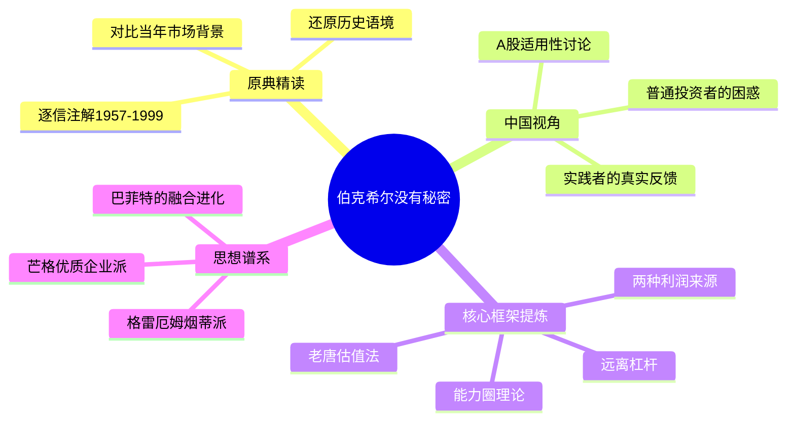

## 《投资研习录：伯克希尔没有秘密》读书笔记
  
### 作者  
digoal  
  
### 日期  
2026-05-23  
  
### 标签  
读书笔记 , 投资研习录：伯克希尔没有秘密     
  
----  
  
## 背景  
  
---
书名: 《投资研习录：伯克希尔没有秘密》  
作者: 唐朝  
出版年份: 2024  
出版社: 中国经济出版社  
笔记日期: 2026-05-23  
ISBN: 9787513677332  
页数: 756  
标签: [价值投资, 巴菲特, 伯克希尔, 投资研习, 股东信, 唐朝]  
---

  

> **一句话**：手把手陪你读完巴菲特1957—1999年致股东信，在跨越时空的对话里，把"没有秘密"的价值投资体系活生生地拆给你看。  
> **适合谁读**：对价值投资有所了解、想深入巴菲特原典的普通投资者；希望建立独立思考投资框架的A股散户  
> **阅读难度**：⭐⭐⭐☆☆（需要一点财务基础，但唐朝的语言足够口语化）  
> **推荐指数**：⭐⭐⭐⭐⭐  

---

## 一、时代坐标：这本书从哪里来？

2024年春天，一本定价168元、精装厚达756页的投资书，在预售开始后5分钟内，3000套签名版全部售罄。这个场面，放在任何一个出版类目里都是异象。

这本书的作者唐朝，70后，曾是标准的"反面教材"——1995年入场期货，1996年爆仓破产，从此得到四字真言：远离杠杆。此后二十多年，他靠房产和股票翻身，2006年底关掉公司，成为全职宅男，以读书、运动、投资为业，在雪球和微信公众号上积累了数十万追随者，人称"老唐"。他的上一本书《巴芒演义》用小说形式讲述巴菲特和芒格的思想轨迹，已让圈内读者大为惊叹。

这本《投资研习录》则更为野心勃勃：它覆盖了1957—1999年共43年的巴菲特致股东信，逐字逐段加以注解、引申与批评，同时穿插唐朝本人和一群中国普通投资者的学习、实践记录。这不是一本简单的"解读"，而是一场持续几十年的真实学习现场。

> **时代背景**：2024年，A股市场经历了漫长的熊市周期，大量散户在热门赛道上亏损惨重，"价值投资在中国到底管不管用"的争议再次高涨。正是在这样的背景下，唐朝选择回到原典，用最笨的方式——逐信精读——重新回答这个问题。

---

## 二、核心命题：作者在说什么？

### 命题一：价值投资没有秘密，有的只是认知的门槛

书名"伯克希尔没有秘密"，暗含一个挑衅：巴菲特从来不藏着掖着，每年的股东信就是他最诚实的公开课。他反复解释自己为什么买、怎么买、买了什么、哪里错了。但大多数读者看完依然学不会，原因不在于方法复杂，而在于缺乏"真知"——没有把认知内化为可操作的行为框架。

唐朝做的事，就是帮你跨越这道认知门槛。他的解读方式非常中国化：不用生涩的金融术语，大量使用生活类比，甚至把复杂的估值逻辑拆解成"一亩地一年产多少粮食，该值多少钱"这样的问题。

### 命题二：股市只有两种利润来源，投资者要搞清楚自己在赚哪种钱

唐朝借助巴菲特在股东信中的一段核心论述，揭示了股票投资的底层逻辑：

```
股市利润来源只有两种：
  ① 企业的真实产出（经营增值）
  ② 对"傻子口袋"的利用（情绪博弈）
```

前者是价值投资的根基，后者是投机的本质。两者并无道德高下之分，但前者可以复制、可以系统化，后者高度依赖运气和心理博弈，难以长期持续。

唐朝把这个区分贯穿全书，帮助读者在面对每一次市场波动时，都能冷静地问自己：**我现在的持仓，是在等待企业产出兑现，还是在等下一个接盘侠？**

### 命题三：巴菲特的进化史，是每一个投资者的参照系

书中覆盖的43年（1957—1999），恰好是巴菲特从格雷厄姆式"捡烟蒂"到芒格式"买优质企业"的完整蜕变过程。唐朝没有回避这种进化，而是正面呈现它：

- 1950年代-1960年代：格雷厄姆门徒，量化安全边际，大量持有低估资产
- 1970年代：开始被芒格影响，理解"好企业"的价值
- 1980年代-1990年代：彻底转型，以合理价格买入优质企业并长期持有

这条进化轨迹提醒读者：没有一套一成不变的"正确方法"，认知的成长才是投资最大的护城河。

---

## 三、论证地图：唐朝怎么说服你的？



**关键论证方式**：

唐朝最擅长的是**"中翻中"**——把巴菲特的英文原文翻译成中文后，再用更接地气的语言重新阐述一遍。例如，巴菲特在股东信里讲"市场先生"的隐喻，唐朝会把它转化为："你开了一家杂货铺，邻居每天来报价，今天说你的店值一百万，明天说只值五十万。你会因为他报价低就觉得自己亏了吗？"

这种翻译方式极其有效，它不是简化，而是**换了一个坐标系**，让读者用自己熟悉的生活经验来理解抽象的投资原则。

**关键案例**：巴菲特1986年购入农地的故事被唐朝反复引用，这个案例几乎是全书的"定锚点"——你买的是产出，不是价格波动，这句话一旦真正内化，投资者的整个心理框架就会改变。

---

## 四、前提假设与边界：什么情况下这不成立？

### 假设一：企业的盈利可以被预测

价值投资的核心是对企业未来现金流的估算。但这个前提在很多行业并不成立——科技颠覆、监管变化、商业模式突变都会让任何盈利预测失效。唐朝承认这点，他的解法是"只在能力圈内选标的"，但能力圈的边界本身就难以精确划定。

### 假设二：A股市场具有足够的有效性来实现价值回归

价值投资在理论上依赖"市场终将回归合理估值"。在成熟市场，这个假设基本成立。但A股散户占比高、政策干预多、信息不对称严重，有些低估的股票可以低估十年而价格毫无反应。这本书大量内容基于美国市场，这个前提在中国能否成立，是全书最大的隐含风险。

### 假设三：投资者能保持理性和耐心

整个价值投资体系的运作，依赖投资者在市场暴跌时不恐慌、不割肉，在市场狂热时不追涨、不贪婪。这是一个极高的心理要求。唐朝本人能做到，但把这个体系推广给大众投资者时，"知易行难"的鸿沟始终存在。

> **边界结论**：这本书的方法论最适合**有稳定现金流来源（不靠投资为生）、愿意长期持有（5年以上视野）、专注于少数几个能力圈内的企业**的投资者。如果你是职业交易者、资金量很大、或需要频繁变现，这套框架的适用性会大打折扣。

---

## 五、思想谱系：这本书站在哪个传统里？

```
格雷厄姆（1930s）
  "烟蒂股"策略
  量化安全边际
      ↓
  巴菲特早期（1957-1969）
  合伙人时代，捡便宜货
      ↓
  芒格影响（1972起）
  "以合理价格买优质企业"
      ↓
  巴菲特成熟期（1980-1999）
  喜诗糖果→可口可乐→吉列
      ↓
  唐朝的中国化诠释（2010s-2024）
  老唐估值法 + 中国A股实战
```

唐朝本人属于彻底的"巴芒信徒"，他的整个体系都建立在巴菲特-芒格的思想基础上，几乎没有独立的理论创造，但他的贡献在于**极强的翻译能力和中国化落地实践**。

这本书与同类书籍（如《巴菲特致股东的信》坎宁安版、《滚雪球》等）的最大区别，是它不只是介绍大师思想，而是记录了一群中国普通人学习和实践这套思想的过程——包括困惑、错误和修正。

---

## 六、我学到了什么？

**收获一：把股票想象成农地，是改变投资心理的最有效工具**

读完这本书，我对"持有股票"这件事的感受发生了质变。以前每次股价下跌都会心跳加速；现在我会问自己：这家企业每年的"粮食产量"变了吗？如果没变，价格下跌只是别人在出售廉价的农地，和我无关，甚至是好消息（可以继续买入）。

这个思维切换看起来简单，但唐朝用整本书的篇幅来反复强化它，因为它真的非常非常难内化。

**收获二："知易行难"是一个伪命题**

唐朝在书里反复强调：如果你真的"知"了，"行"就不难。那些说"我知道价值投资对但就是做不到"的人，其实只是"听说"了价值投资，并没有真正理解它。

这句话对我很有冲击力。它把责任从"人性弱点"拉回到"认知是否真正到位"——这是一个更有建设性的起点。

**收获三：巴菲特的每一次失败都是宝贵的课**

书中覆盖的43年里，巴菲特犯了很多错误：持有伯克希尔纺织业务太久、高价收购某些企业、错过科技股的机会……唐朝没有美化这些，而是用它们来说明：价值投资不是"完美预测"，而是在反复犯错中建立更健壮的体系。这个视角比任何只讲成功案例的书都更真实。

---

## 七、举一反三：这个框架还能用在哪？

**场景一：个人职业选择**

"买优质企业，而非便宜企业"——这个逻辑完全可以迁移到职业发展。选择去哪家公司工作，不应该只看当前工资高低（估值便宜），更应该看这家公司的护城河（持续竞争力）和管理层（人品+能力）。一个有护城河的平台，才值得长期投入自己的时间和精力。

**场景二：商业决策中的"能力圈"**

很多创业者亏损，是因为把钱投入了自己不理解的领域（追热点）。唐朝说的"能力圈"，在商业决策中同样适用：不要做你没有认知优势的生意，哪怕看起来利润丰厚。

**场景三：认识"市场先生"背后的人性规律**

"市场先生"的隐喻不只适用于股市。在任何一个有定价机制的市场（二手房、艺术品、甚至人才市场），都存在情绪驱动的非理性价格波动。学会识别这种波动，而不是被它卷走，是一种可以广泛应用的生存智慧。

---

## 八、批判与反思

**批评一：这本书在某种程度上是"成功者的自我叙事"**

唐朝长期持有茅台等消费类白马，在2016—2021年间享受了极为顺畅的价值回归红利。他的方法在那段时间确实有效，但2021年后的市场走势让很多"价值投资者"深度套牢多年。"价值投资在A股长期有效"的论断，目前仍缺乏足够长的统计验证。

**批评二：756页的篇幅是否真的必要？**

全书厚达756页，覆盖43年股东信，内容极其丰富，但也因此显得冗长。很多章节的注解可以更简洁。对于时间有限的读者，这本书的"性价比"取决于你愿意投入多少时间——它更像一套课程资料，而非一本可以快速阅读的方法论书籍。

**批评三：中国化落地的部分仍然有限**

书中大量内容直接对标美国市场的历史背景，对A股特有的制度风险（退市机制不健全、信息披露质量参差不齐、政策周期影响）讨论相对较少。这是所有"巴菲特在中国"类书籍的共同短板。

---

## 九、金句与记忆点

**1. "股市只有两种利润来源：企业的产出，和对傻子口袋的利用。"**
→ 这句话是整本书的底层逻辑。每次入市前问问自己：我在赚哪种钱？

**2. "任何股票都只有一个真正的买家，那就是公司自己。"**
→ 将全体股东视为一个整体，其回报唯一来源是企业真实利润。提醒你不要把"市场接盘"当成最终依赖。

**3. "所谓知易行难，其实是没有真知。真知了，行就不难了。"**
→ 这句话把"做不到"的责任从人性拉回到认知，是一个更有建设性的诊断。

**4. "你买入时关注的是产出，不是价格。"（农地比喻）**
→ 唐朝转述巴菲特的核心比喻，是理解"持有≠炒作"最简洁有力的句子。

**5. "投资就是把钱放到能比银行更好地帮你生钱的地方。"**
→ 极简定义，却能帮你过滤掉市场上99%的噪声。

**6. "市场先生是你的仆人，不是你的向导。"**
→ 格雷厄姆原典，经巴菲特和唐朝反复强调。股价是用来利用的，不是用来跟随的。

**7. "能力圈不在于大小，而在于是否清楚自己的边界在哪里。"**
→ 比起扩大能力圈，清楚边界在哪更重要——大量亏损来自越界操作。

---

## 十、延伸阅读

**1. 《巴菲特致股东的信》（坎宁安编）**
→ 如果想看原典的主题化整理，坎宁安版是标准配置。唐朝书更适合逐年精读，两者互补。

**2. 《穷查理宝典》（芒格）**
→ 理解巴菲特后期转变的关键，芒格的多元思维模型是另一个维度的补充。

**3. 《巴芒演义》（唐朝）**
→ 唐朝的上一本书，用小说体梳理巴菲特与芒格的思想互动，读完本书后回头看这本，体验会完全不同。

**4. 《价值投资实战手册》（唐朝）**
→ 唐朝最核心的方法论书，"老唐估值法"在这里有最系统的阐述，是本书的配套工具书。

**5. 《滚雪球》（艾丽斯·施罗德）**
→ 最权威的巴菲特传记，有助于理解他在不同时期决策背后的人生背景。

---

*笔记写于 2026-05-23 | 基于公开资料、唐朝历年公众号文章及二手书评综合整理*
*本笔记不构成投资建议，一切投资决策后果由读者自负*
  
  
#### [PostgreSQL 解决方案集合](../201706/20170601_02.md "40cff096e9ed7122c512b35d8561d9c8")
  
  
#### [德哥 / digoal's Github - 公益是一辈子的事.](https://github.com/digoal/blog/blob/master/README.md "22709685feb7cab07d30f30387f0a9ae")
  
  
#### [About 德哥](https://github.com/digoal/blog/blob/master/me/readme.md "a37735981e7704886ffd590565582dd0")
  
  

  
