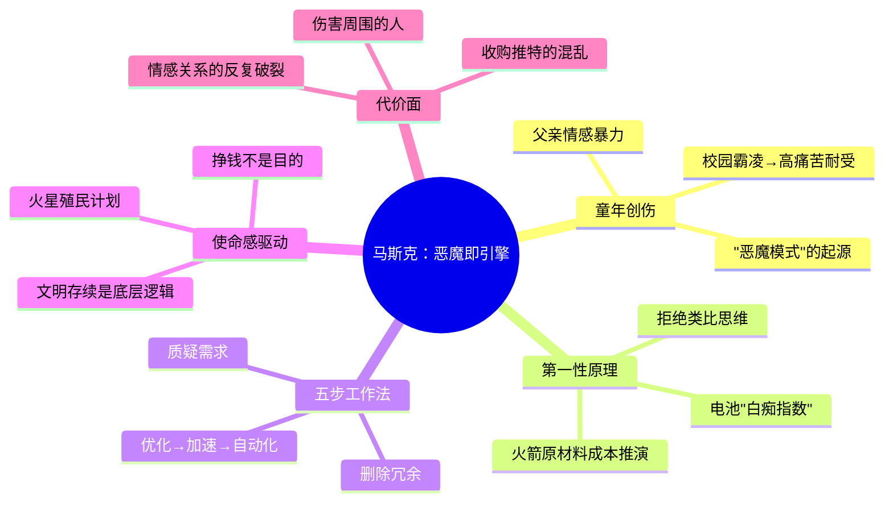

## 《埃隆·马斯克传》读书笔记
  
### 作者  
digoal  
  
### 日期  
2026-05-23  
  
### 标签  
读书笔记 , 埃隆·马斯克传     
  
----  
  
## 背景  
  
---
书名: 《埃隆·马斯克传》  
作者: [美]沃尔特·艾萨克森  
译者: 孙思远 / 刘家琦  
出版社: 中信出版社 / 漫游者  
出版年份: 2023-9-12  
笔记日期: 2025-05-23  
豆瓣链接: https://book.douban.com/subject/36518892/  
豆瓣评分: 8.6（约17000人评价）  
标签: [传记, 商业, 科技, 马斯克, 创新]  
---

  

> **一句话**：一部关于"恶魔驱动天才"的商业史诗——它揭示了那个让人类走向火星的疯子，究竟是怎样被塑造出来的。  
> **适合谁读**：对创业、科技产业、天才人格感兴趣的读者；想理解"为什么硅谷会诞生这种人"的思考者；管理者和工程师。  
> **阅读难度**：⭐⭐☆☆☆（叙事流畅，不需要专业背景）  
> **推荐指数**：⭐⭐⭐⭐☆  

---

## 一、时代坐标：这本书从哪里来？

2021年，艾萨克森宣布开始撰写马斯克传记，彼时的马斯克刚从"钢铁侠"式偶像悄然转向——推特风波、政治极化、Neuralink争议，他的形象开始在两极之间剧烈震荡。这部传记的出版恰逢2023年9月，AI爆发元年、马斯克收购推特一年后、全球对科技权力的讨论空前激烈的节点。

艾萨克森此前写过乔布斯、爱因斯坦、达·芬奇、富兰克林——都是改变历史进程的天才。选择马斯克作为下一位传主，本身就是一个判断：他认为这个人足以与那些名字并列，值得同样的篇幅和凝视。

这本书要回答的核心问题，艾萨克森在书中明确写出：**那个在马斯克心底驱使着他的恶魔，是不是也是推动创新与进步所必需的呢？** 这不只是一个人的传记，更是一次对"破坏性天才"这一历史模型的深度拷问。

```
时间轴：马斯克的几个关键时代节点

1971   出生于南非，童年饱受校园霸凌与父亲情感创伤
       │
1995   移民加拿大→美国，进入互联网创业浪潮
       │
1999   以3亿美元出售Zip2，初尝财富
       │
2002   创立SpaceX，走上"终极疯子"之路
       │
2008   特斯拉/SpaceX濒临破产，双线火上浇油
       │
2012   Model S上市，特斯拉起死回生
       │
2022   440亿美元收购推特，舆论两极爆裂
       │
2023   艾萨克森传记出版，历史盖棺……尚未论定
```

---

## 二、核心命题：作者在说什么？

### 观点一：童年创伤是燃料，不是借口

马斯克的父亲埃罗尔是一个情感控制欲极强、会用语言暴力摧毁孩子自信的人。马斯克成年后曾说，他父亲"几乎每次和我说话，都让我感觉很糟"。校园里，他是那个因为走进人群就被推倒、踢头、踢到失去意识的孤僻书呆子。

艾萨克森的解读是：正是这段经历，塑造了马斯克对痛苦的极高耐受阈值，以及他对"混乱"和"危险"反常的亲近感。普通人经历创伤会收缩，马斯克经历创伤后学会了向外爆发。书中用了一个词——**"恶魔模式"（demon mode）**：当马斯克被压力逼到极限时，不是崩溃，而是进入一种近乎冷酷的超常运转状态。

这个解读框架危险又诱人。它在解释"为什么他能成"的同时，也悄悄为"为什么他伤害他人"提供了合理化通道。

### 观点二：第一性原理是一把手术刀，不是一套哲学

马斯克最广为人知的思维方法是"第一性原理"——拒绝类比，直接从物理本质出发推导答案。书中最生动的例子是他造火箭的决定。2002年，他去俄罗斯买二手火箭，谈判破裂。他在飞机上打开Excel，一行行列出火箭的原材料成本：铝合金、钛、铜、碳纤维……最终发现：一枚火箭的原材料成本，只是市场价的**2%**。剩下98%，是"规则"、"惯例"、"中间层"收走的。

这催生了SpaceX。而在特斯拉，同样的逻辑用在了电池上：业界认定电动车电池成本约600美元/千瓦时，马斯克用第一性原理拆解，得出原材料成本约80美元/千瓦时，差距达到7.5倍——这就是他定义的"**白痴指数**"，衡量一家公司的制造效率离物理极限有多远。

第一性原理不是什么玄学，它本质上是**拒绝把"以前就是这么做的"当作理由**。这是工程师思维里最锋利的部分，但也最容易被滥用——当权力加持后，"质疑一切需求"可能变成"我的直觉高于一切证据"。

### 观点三：马斯克的企业文化是一种"极端达尔文主义"工程实验

书中记录了马斯克著名的"五步工作法"，这是他在多家公司反复应用的管理哲学：

1. **质疑每项需求**——所有需求都必须说清楚来自谁、为什么
2. **删除一切可删的**——宁可删错，也不要留冗余
3. **优化剩下的**——但优化必须排在删除之后
4. **加速迭代**——用速度代替完美
5. **自动化**——前四步都做完了，再考虑自动化

第三步尤其反常识：他特别强调，绝大多数人犯的错误是**在删除之前就急着优化**——把精力花在一件根本不该存在的事上。

这套方法论的代价是：人是可以被"删除"的，情感是冗余的，边界是待质疑的需求。SpaceX和特斯拉的员工流失率居高不下，但留下来的人，往往完成了被外界认为不可能的事。

---

## 三、论证地图：艾萨克森怎么说服你的？



艾萨克森的论证方式有三个特点：

**贴身跟访，素材第一手。** 他花了两年时间跟着马斯克开会、进工厂、深夜聊天，采访了129位相关人士，包括前妻、老员工、竞争对手。素材的新鲜度是这本书最大的竞争力，很多场景和对话是首次公开。

**用故事代替论断。** 书中几乎没有"马斯克是个XX的人"这样的直接评价，而是用一个接一个场景让你自己判断：他深夜睡在特斯拉工厂的地板上、他当着全体员工的面骂哭一位工程师、他凌晨三点发推特、他和孩子们吃饭时眼神空洞沉默不语。读者的情感是在故事里被调动的，而非被作者说服的。

**用结构代替立场。** 艾萨克森并没有明确告诉你"他是好人还是坏人"，而是把荣耀与丑陋交替排列，把SpaceX的史诗级成功和推特的混乱管理放在同一本书里。这是他高明的地方，也是他被批评"太袒护"的地方——中立有时候等于默许。

---

## 四、前提假设与边界：什么情况下这不成立？

**假设一：个性缺陷与创新成就是因果关系，而非相关关系。**
艾萨克森的隐含逻辑是：正因为马斯克"极端"，他才能做到常人做不到的事。但这个推断忽略了一个反事实：也许有人可以同样伟大，但不那么具有破坏性。乔布斯的暴戾被写入传奇，但同期苹果有大量悄无声息的工程师贡献了同样关键的发明。"天才必须有缺陷"是一种叙事偏好，不是经过检验的规律。

**假设二：马斯克的使命感是真实的，而非工具性的。**
书中大量篇幅呈现他对火星殖民的执念，仿佛这是驱动一切决策的纯粹信念。但批评者指出，这种叙事恰好也是最好的品牌包装：一个"救人类"的理由可以掩盖一个"控制市场"的动机。究竟哪个是底层驱动，无法从这本传记里得到答案，因为作者并没有真的试图戳穿它。

**假设三：这本书仍然是马斯克主导的叙事。**
美国媒体人亚当·拉辛斯基的批评最为精准：艾萨克森虽然采访了129个人，但写出来的书有一种"口述传记"的感觉——马斯克的声音统治全篇。毕竟，主人公不仅提供了采访便利，还在出版前审阅了部分内容。在一本关于世界最有权势商人之一的传记里，这不是小事。

---

## 五、思想谱系：这本书在哪个传统里？

艾萨克森属于美国传记写作的"天才崇拜"传统。他写过富兰克林（建国英雄中的技师）、爱因斯坦（科学奇才与人道主义者的结合）、达·芬奇（艺术与科学不可分割的象征）、乔布斯（破坏性创新的定义者）。每一位都有相似的叙事结构：非凡的天赋 × 某种特殊的创伤或边缘身份 × 近乎偏执的专注 = 改变历史。

马斯克是这个系列的最新版本，也是最具争议的一版。因为前几位都已成为历史，他们的"缺陷"已被时间洗净。而马斯克还活着，还在推文，还在行使权力，还在继续伤害和感动不同的人。

```
艾萨克森"天才传记"谱系

富兰克林（1706–1790）  →  爱因斯坦（1879–1955）  →  乔布斯（1955–2011）  →  马斯克（1971– ）
政治/外交天才              物理/人道天才              设计/产品天才              工程/使命天才
历史盖棺论定              历史盖棺论定              身后10年已神话化            仍在进行时，争议未定
```

这本书还可以与阿什利·万斯2015年的《硅谷钢铁侠》对照阅读。万斯的版本更有批判性距离，艾萨克森的版本更有现场感和内幕深度。两者加在一起，才构成一个更完整的马斯克。

---

## 六、我学到了什么？

读完这本书，最难忘的不是那些商业成就，而是一个关于"代价"的问题。

**第一个收获：极端执行力的本质，是把"不可能"变成一个待解的工程问题。**
马斯克面对"火箭太贵"，不是接受它，而是把它分解：贵在哪里？能不能换一种方式？他的思维里没有"行业惯例"这个概念，只有"物理定律是否允许"。这种思维方式，我认为可以迁移到任何领域的瓶颈突破——把"这件事很难"分解成"哪一步最难，为什么，能不能绕过去"。

**第二个收获：马斯克是一个关于"边界成本"的警示。**
他把工厂人员当成可迭代的模块，把员工情感算作待删除的冗余，把亲密关系变成承受"混乱"测试的场域。这套方法在物理系统里有效，在人类系统里制造了大量无法量化的损耗——离开的天才、被伤害的伴侣、被剥夺父亲陪伴的孩子。成功的果子摆在那里，但背后那些不在报表上的代价，没有人结算。

**第三个收获：对"使命感"保持审慎。**
马斯克用"让人类成为多星球物种"来统摄一切。这句话既是他的真实信仰，也是他最强大的盾牌——任何质疑都可以被这个宏大目标消解。但历史上打着宏大叙事行动的人，并非都是英雄。使命感是最难辨别的动机，因为它往往同时是真的，也是自我欺骗的。

---

## 七、举一反三：这个框架还能用在哪？

**第一性原理 × 白痴指数**，可以用来审视你所在行业里的任何一个"天经地义"：
- 为什么会议要开一小时？谁规定的？物理上需要多久？
- 为什么这份报告要十页？哪三页有决策价值？
- 为什么招聘要三轮面试？两轮能筛出什么，第三轮真正筛出什么？

**五步工作法**的最反常识之处，值得反复应用：**先删，再优化。** 绝大多数团队的效率问题，不是因为没有优化不该优化的东西，而是因为把本该删掉的东西优化得越来越精致。

**"恶魔模式"的启示**是悲剧性的：高度的创造力和高度的破坏力，常常共享同一个神经回路。这不是说我们要接受破坏，而是说：在推崇某种"战斗文化"之前，要先诚实地问——我们愿意承担什么，我们愿意让谁承担。

---

## 八、批判与反思

这本书最大的问题，是**艾萨克森和马斯克之间过于舒适的权力关系**。作者采访了129人，但读完全书，你记住的几乎全是马斯克的声音、马斯克的逻辑、马斯克的感受。那些被他开除的员工说了什么？前妻贾斯汀如何描述他们婚姻的崩溃？被他称为"恶魔"的副手们，在他不在场时怎么评价他？这些声音要么被一笔带过，要么被植入马斯克的叙事框架里解读。

纽约时报书评人的评价恰如其分：艾萨克森是一个有耐心的记录者，但面对马斯克，他有时显得过于有耐心了。这种耐心，很容易演化成对权力的温柔体谅。

另一个局限在于**时间**：这是一本活人传记，而马斯克2023年之后的故事（收购推特后的政治转向、DOGE、与特朗普政府的关系等）都不在其中。这本书在某种意义上，记录的是"马斯克1.0"——此后他的形象已经发生了深刻的裂变，而这本书来不及见证。

最后，关于传记本身的叙事伦理：**一个人的伟大成就，是否能为他对周围人造成的伤害开脱？** 艾萨克森把这个问题留给了读者，而没有给出自己的答案。这既是他的克制，也是他的回避。

---

## 九、金句与记忆点

1. **"那个驱使马斯克的恶魔，是不是也是推动创新所必需的？"**
   艾萨克森的中心问题。没有答案，但问出这个问题本身，就已经揭示了天才与破坏的共生结构。

2. **"白痴指数"**：某产品成本 ÷ 原材料成本的比值。比值越高，代表制造体系越低效，改造空间越大。这是一个可以随时拿出来使用的思考工具。

3. **"质疑需求，尤其是聪明人提出的需求——因为你最不会去质疑聪明人。"**
   五步工作法第一步的真正威力：权威不是理由，物理才是。

4. **"删除要排在优化之前。"**
   最被忽视的管理原则。很多公司在优化一件本该消失的事。

5. **"动荡的环境和剧烈的冲突对他有着莫大的吸引力。"**
   这不是一个可以复制的成功要素，而是一个需要理解的心理事实。

6. **"如果他能更放松一点儿，更可亲一点儿，他还会是那个要把我们送上火星的人吗？"**
   艾萨克森反问，既是辩护，也是一个不舒服的开放式问题。

7. **人类文明的多星球化——这个目标的奇特之处在于**：它足够宏大，以至于任何短期的残忍都可以在它面前显得微不足道。这是马斯克的逻辑，也是历史上所有以"伟大目标"为由行动的人共享的逻辑。

---

## 十、延伸阅读

1. **《硅谷钢铁侠：埃隆·马斯克》** 阿什利·万斯著（2015）
   第一本严肃的马斯克传记，采访更独立，批判性更强，可与本书对照阅读，看同一个人在不同作者镜头下的差异。

2. **《创新者》** 沃尔特·艾萨克森著
   同一作者的另一部作品，记录了计算机革命背后的人物群像。读懂这本书，才能理解艾萨克森眼中"天才"的完整谱系。

3. **《极限高压：特斯拉、马斯克与世纪之赌》** 提姆·希金斯著（2021）
   专注于特斯拉一家公司的深度报道，对制造、管理、财务危机有更细致的还原，是理解马斯克"工厂模式"的最佳辅助读物。

4. **《乔布斯传》** 沃尔特·艾萨克森著
   读马斯克传，几乎无法不对照乔布斯。两人共享太多特质，也有根本的差异。比较阅读能让你看清艾萨克森的写作模板，以及两种天才的本质区别。

5. **《零号冲动》（Zero to One）** 彼得·蒂尔著
   马斯克的前同事（PayPal黑帮创始成员之一）对"从0到1"创新的哲学阐述，代表了与马斯克共享某种信念体系的硅谷精英的世界观。

---

*笔记写于 2025-05-23 | 基于公开资料、多方书评与深度思考整理*
*主要参考来源：豆瓣书评、21财经书评（杨吉）、《信息》(The Information) 亚当·拉辛斯基评论、PBS NewsHour 采访、维基百科词条*
  
  
#### [PostgreSQL 解决方案集合](../201706/20170601_02.md "40cff096e9ed7122c512b35d8561d9c8")
  
  
#### [德哥 / digoal's Github - 公益是一辈子的事.](https://github.com/digoal/blog/blob/master/README.md "22709685feb7cab07d30f30387f0a9ae")
  
  
#### [About 德哥](https://github.com/digoal/blog/blob/master/me/readme.md "a37735981e7704886ffd590565582dd0")
  
  

  
