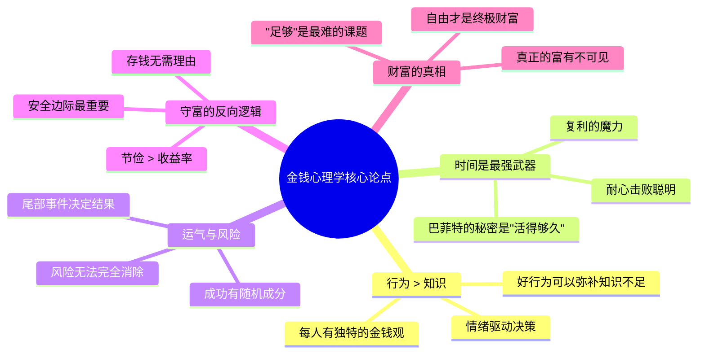

## 《金钱心理学：财富、人性和幸福的永恒真相》读书笔记
  
### 作者  
digoal  
  
### 日期  
2026-05-23  
  
### 标签  
读书笔记 , 金钱心理学：财富、人性和幸福的永恒真相     
  
----  
  
## 背景  
  
---
书名: 《金钱心理学：财富、人性和幸福的永恒真相》  
作者: 摩根·豪泽尔（Morgan Housel）  
译者: 李青宗  
出版年份: 2023（中文版）/ 2020（原版）  
笔记日期: 2025-05-23  
豆瓣链接: https://book.douban.com/subject/36415996/  
标签: [行为金融, 个人理财, 心理学, 财富管理, 人性]  
---

  

> **一句话**：财务成功从来不是数学题，而是一道关于人性的哲学题。  
> **适合谁读**：所有对金钱有困惑的人——无论你是月光族、焦虑的投资者，还是已经小有积蓄却依然不安的中产。  
> **阅读难度**：⭐⭐☆☆☆（无门槛，故事性极强）  
> **推荐指数**：⭐⭐⭐⭐⭐  

---

## 一、时代坐标：这本书从哪里来？

2020年9月，《金钱心理学》在全球金融市场最动荡的时期之一悄然出版。彼时，新冠疫情刚刚让市场经历了历史最快速的崩盘与反弹，散户投资者第一次大规模涌入股市，GameStop逼空事件即将引爆社交媒体……人们比任何时候都更困惑：市场究竟由什么驱动？

摩根·豪泽尔在这个节点写下这本书，并非偶然。他长期担任《华尔街日报》和"傻瓜基金"（Motley Fool）的专栏作者，观察到一个令他着迷的现象：**最聪明的人，经常在金钱上犯最愚蠢的错误；而一些受过极少金融教育的普通人，却能积累起令人惊讶的财富**。

这种反差让他开始追问：财务成功的真正变量是什么？答案并非投资技巧、市场时机或财经知识——而是行为。是那些在餐桌边、在情绪波动时做出的、看似微小却日积月累的选择。

```
时代背景 ──────────────────────────────────────►
                                              
2008年  2013年    2017年     2020年     2023年
金融危机  牛市起点  加密热潮    疫情崩盘   全球通胀
   │        │        │         │           │
   └────────┴────────┴─────────┘           │
        豪泽尔观察人类金钱行为的15年         │
                                         《金钱心理学》
                                         中文版引进
```

这本书诞生于行为经济学兴起的大背景下，站在卡尼曼（《思考，快与慢》）、塔勒尔（《错误的行为》）等人的肩膀上，但豪泽尔选择了一条更亲民的路径：不用学术框架，只用故事。

---

## 二、核心命题：作者在说什么？

全书19篇独立短文，表面上各自为战，实则围绕三个核心命题展开。

### 命题一：没有人是疯子——每个财务决策背后都有其合理性

豪泽尔用一个问句打开全书：**为什么受过良好教育的人会买彩票？**

答案是：因为每个人成长的时代、家庭和经历不同，导致对"风险"和"机会"的感知完全不同。一个在大萧条中长大的老人，和一个在2010年牛市中入市的年轻人，面对同一只股票，做出截然相反的判断，双方都没有错——他们只是活在不同的平行宇宙里。

这个命题让人立刻放松下来：不要轻易评判别人的财务选择，也不要苛责自己。理解这一点，是改变的第一步。

### 命题二：致富与守富，是两种截然不同的技能

这是全书最具冲击力的洞见之一。

> 致富需要的是冒险精神、乐观心态，以及放手一搏的勇气。
> 但守富需要的却恰恰相反——谦逊、节俭，以及对财富随时可能消失的深刻敬畏。

豪泽尔举了大量例子证明：许多人擅长其中一种，却在另一种上一败涂地。杰西·利弗莫尔（Jesse Livermore）是美国历史上最成功的交易员之一，却在1940年代破产自杀。问题不是他不会赚钱，而是他无法接受"我已经赚得足够多了"这件事。

**"足够"（Enough）**，是本书最难掌握却最重要的概念。

### 命题三：财富是你看不见的东西

书中有个颠覆性的定义：**真正的财富不是你买了什么，而是你没有花的钱**。

停车场里那辆豪车，可能属于一个资产负债表一团糟的人。隔壁那个开破旧本田的中年男人，银行账户里可能有你难以想象的数字。我们看到的是"收入"，看不见的是"财富"。而财富恰恰存在于那些克制、延迟和沉默之中。

---

## 三、论证地图：作者怎么说服你的？



**关键案例一：罗纳德·里德（Ronald Read）的传奇**
一个在佛蒙特州加油站工作了25年的普通工人，2014年去世时留下了800万美元财产，大部分捐给了图书馆和医院。秘密？他从未卖出一只好股票，几十年如一日地坚持持有。

**关键案例二：巴菲特的真正秘密**
巴菲特拥有约845亿美元净资产，其中814亿是在他60岁以后获得的。他不是最好的投资者（收益率上有人超过他），他的秘密是**从11岁开始投资并活到了90多岁**——复利需要的是时间，不只是智慧。

**论证方式评价：** 豪泽尔几乎完全依赖故事和历史案例，刻意回避了学术引用和数学公式。这让书极易读懂，但也意味着论证深度有限——很多观点更接近"智慧格言"而非"经过严格检验的理论"。

---

## 四、前提假设与边界：什么情况下这不成立？

### 假设一：市场长期向上（美国视角）

全书的乐观底色建立在"长期持有终会获胜"的前提上，而这个前提背后是美国股市过去100年的历史数据。但对于日本投资者（1990年以来失去的三十年）、对于持有特定行业股票的人、或者在错误时点大量买入的人，这个结论未必成立。

书中的"保持乐观、长期持有"建议，隐含了"你投资的市场会长期增长"这个巨大假设。中国读者需要警惕直接套用。

### 假设二：个人行为是财务命运的主要变量

豪泽尔将大量篇幅用于讨论"行为"的重要性，但一定程度上低估了结构性因素——所在国家的经济周期、家庭出身带来的起点差异、系统性不平等。对于一个月薪三千、生活在高房价城市的年轻人，"改变行为"的边际效用非常有限。

书中的很多建议更适合已经有一定财务基础的中产阶级，而非那些被结构性贫困困住的人。

### 假设三："合理"优于"理性"——但边界在哪里？

豪泽尔建议不必追求完全理性的财务决策，"合理"（可执行的）比"理性"（理论最优的）更重要。这个观点有道理，但也可能成为坏决策的挡箭牌——"我觉得买这套房子合理"和"我觉得炒币合理"同样都是"合理"的自我感觉。

---

## 五、思想谱系：这本书站在谁的肩膀上？

```
行为经济学奠基
卡尼曼《思考，快与慢》（2011）
塔勒尔《错误的行为》（2015）
        │
        ▼
    大众化传播层
豪泽尔《金钱心理学》（2020）← 故事化、去学术化
        │
        ├── 同期影响
        │   芒格《穷查理宝典》（道德+智慧视角）
        │   纳西姆·塔勒布《黑天鹅》（尾部风险）
        │
        └── 后继者
            《纳瓦尔宝典》（财富 + 幸福哲学）
            《钱的心理》（同类但更实操）
```

豪泽尔的思想来源清晰：他深受查理·芒格"多元思维模型"的影响，同时站在行为经济学的宽厚地基上，但选择了截然不同的写作风格——不引用学术论文，只讲故事。

这使得本书成为行为金融学最成功的大众化作品，但也意味着它更接近"智慧书"而非"知识书"。它改变的是你的思维框架，而非传授具体技能。

---

## 六、我学到了什么？

读完这本书，我最深的感受是：**它让我对自己的财务焦虑产生了一种奇特的宽容**。

过去我总觉得自己在金钱上的决策不够理性——买了不该买的东西，错过了某些机会，为市场波动失眠。但豪泽尔告诉我，这不是我的失败，而是人类进化出来的默认设置。情绪不是投资的天敌，它是人类的一部分，关键是建立能在情绪驱动下依然"不作死"的系统。

**收获一：存钱比赚钱更可控**
投资回报率受市场控制，但储蓄率受自己控制。一个收益率8%、储蓄率50%的人，比一个收益率15%、储蓄率10%的人更可能积累财富。这个简单的算术彻底改变了我对"努力提升投资能力"的执念。

**收获二："足够"是一种主动选择**
我以前以为"知足"是消极的，是对失去的合理化。豪泽尔让我看到，主动定义"够了"是一种力量——它让你从无止境的比较游戏中退出，专注于真正重要的事情。越来越多的研究表明，超过一定收入水平后，更多的钱对幸福感的边际贡献接近于零。

**收获三：时间是可以购买的最昂贵商品**
全书中最让我震撼的一句话大意是：财富最高的形式，是能够在早上醒来说"今天我可以做任何我想做的事"。不是豪车，不是豪宅，而是**对自己时间的掌控权**。

---

## 七、举一反三：这个框架还能用在哪？

豪泽尔的核心方法论其实是：**用行为视角替代技术视角，去理解那些看起来是"知识问题"的事情**。

**场景一：职业发展**
我们习惯于把职业成功归因于能力，但豪泽尔的逻辑同样适用——坚持（相当于长期持有）、避免毁灭性错误（不要因为一时冲动毁掉职业声誉）、以及理解运气的作用（不要把好机遇完全归功于自己），往往比纯粹的"努力提升技能"更关键。

**场景二：健康管理**
同样的结构：知道健康的正确方法（理性）vs. 实际能长期坚持下去的方法（合理）。健身打卡App屡屡失败的原因，和财务计划失败一模一样——都是设计了一个"理论最优"却"执行不可持续"的方案。

**场景三：人际关系**
"每个人都不是疯子"的视角，同样可以用于理解那些做出我们无法理解的选择的人。当你用"他有他的成长背景和信息茧房"替代"他真是个蠢货"时，沟通会变得完全不同。

---

## 八、批判与反思

**这本书最大的问题，是它太让人舒适了。**

豪泽尔的笔触非常温柔。他不批评任何人，不提供艰难的建议，不要求你做任何痛苦的改变。读完你会感觉良好——"原来我没那么差，我只是人类嘛"。这种感觉很治愈，但可能也很危险。

真正的财务改善需要的不只是理念更新，还需要具体、有时令人不舒服的行动：砍掉生活开销、拒绝同伴消费压力、面对自己真实的支出数据。这些"硬核"内容，书中几乎付之阙如。

另一个值得警惕的地方：**书中大量案例来自美国语境**——美国股市的长期回报、401K养老账户制度、美国特殊的经济地位。这些背景在中国、东南亚、或者任何非美国市场，适用性都需要打折扣。

最后，豪泽尔对"运气"的讨论虽然诚实，却也可能成为一种精神鸦片——如果成功有很大程度上来自运气，那么努力的意义何在？书中没有给出令人满意的回答。

---

## 九、金句与记忆点

1. **"没有人是疯子"**——每个财务决策在当事人自己的背景下都有内在逻辑，批评之前先理解。

2. **"致富与守富是两种完全不同的技能"**——一个需要进攻性，另一个需要防御性。大多数人只练了其中一种。

3. **"财富是你看不见的东西"**——真正的富人不靠消费证明自己，而靠未花出去的自由积累权力。

4. **"巴菲特的秘密是他活了这么久"**——复利的本质不是高收益，而是足够长的时间。大多数人低估时间、高估收益率。

5. **"存钱无需理由"**——存钱的价值不在于为特定目标储备，而在于它给你的选择权和在意外来临时的从容。

6. **"合理优于理性"**——一个你能长期坚持的"次优"方案，远胜一个理论完美却无法执行的"最优"方案。

7. **"尾部事件决定一切"**——在投资和历史中，少数极端事件贡献了大部分的结果。做好准备迎接意外，比预测正确更重要。

8. **"自由是财富的最高形式"**——能够掌控自己时间的人，才是真正的富人。这个定义让很多"高收入囚徒"重新审视自己的选择。

---

## 十、延伸阅读

1. **《思考，快与慢》——丹尼尔·卡尼曼**
   本书的理论根基。豪泽尔讲故事，卡尼曼讲原理。想真正理解"为什么人类在金钱上这么不理性"，需要读这本。

2. **《穷查理宝典》——查理·芒格**
   豪泽尔的精神导师之一。芒格的多元思维模型是豪泽尔风格的深层来源，但芒格更尖锐、更犀利，读完会有被"敲打"的感觉。

3. **《黑天鹅》——纳西姆·塔勒布**
   与豪泽尔对"尾部风险"的讨论形成深度呼应，但更激进、更反传统。如果你读完《金钱心理学》觉得太温和，这本书会让你彻夜难眠。

4. **《漫步华尔街》——伯顿·麦基尔**
   豪泽尔的书解决"态度问题"，这本书解决"技术问题"。两本配合，才是完整的个人投资教育。

5. **《纳瓦尔宝典》——埃里克·乔根森（整理）**
   与《金钱心理学》在"财富与幸福"的交叉地带形成对话，但纳瓦尔更强调主动创造财富的路径，视角更激进，适合有创业倾向的读者。

---

*笔记写于 2025-05-23 | 基于公开资料与深度思考整理*
*核心素材来源：Goodreads书评、FT/Forbes书评、豆瓣长评、学术批评文献（ResearchGate）*
  
  
#### [PostgreSQL 解决方案集合](../201706/20170601_02.md "40cff096e9ed7122c512b35d8561d9c8")
  
  
#### [德哥 / digoal's Github - 公益是一辈子的事.](https://github.com/digoal/blog/blob/master/README.md "22709685feb7cab07d30f30387f0a9ae")
  
  
#### [About 德哥](https://github.com/digoal/blog/blob/master/me/readme.md "a37735981e7704886ffd590565582dd0")
  
  

  
