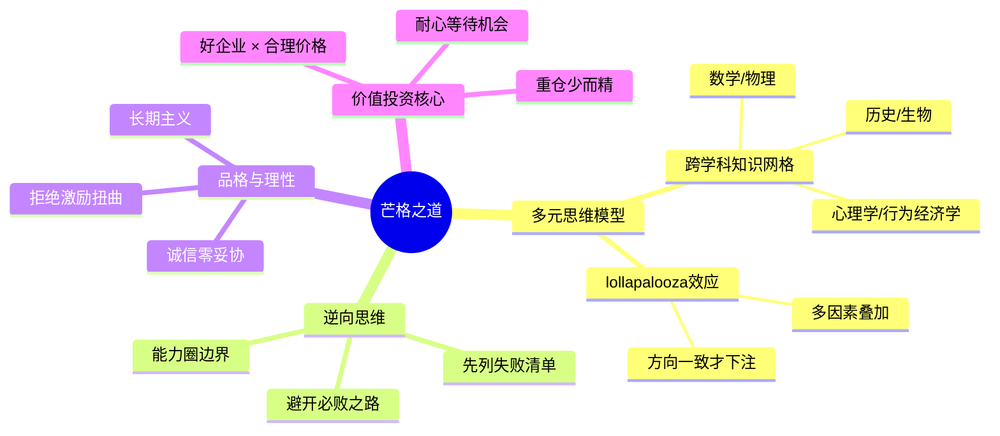

## 《芒格之道》读书笔记
  
### 作者  
digoal  
  
### 日期  
2026-05-23  
  
### 标签  
读书笔记 , 芒格之道     
  
----  
  
## 背景  
  
---
书名: 《芒格之道——查理·芒格股东会讲话 1987—2022》  
作者: [美] 查理·芒格  
译者: RanRan  
出版社: 中信出版集团 / 大方 / 芒格书院  
出版年份: 2023  
页数: 772  
笔记日期: 2025-05-23  
豆瓣链接: https://book.douban.com/subject/36438791/  
标签: [投资, 价值投资, 思维模型, 人生哲学, 商业智慧]  
---

  

> **一句话**：一个99岁老人用35年的真实讲话，证明了智慧比聪明更值钱。  
> **适合谁读**：投资者、终身学习者、对人生哲学感兴趣的任何人  
> **阅读难度**：⭐⭐☆☆☆（语言直白，但思想需要咀嚼）  
> **推荐指数**：⭐⭐⭐⭐⭐  

---

## 一、时代坐标：这本书从哪里来？

1987年，查理·芒格63岁。那一年，美国股市经历了"黑色星期一"，道琼斯指数单日暴跌22.6%，是史上最大单日跌幅。而芒格在西科金融的股东会上，依然淡定地和股东们聊天——不预测市场，不恐慌，只谈商业本质和企业质量。

这就是这本书的起点。

《芒格之道》收录了芒格在两家他担任董事长的公司——西科金融（1987—2010）和每日期刊（2014—2022）——股东会上的全部讲话。25篇、68万字，跨越35年。这不是一本刻意写就的书，而是一个人在真实商业战场中，对着真实股东，年复一年说出的真心话。

这35年里发生了什么？储贷危机、互联网泡沫、9·11、次贷危机、比特币狂潮、新冠疫情……芒格几乎用讲话亲历并评点了美国乃至全球近半个世纪的重大事件。他没有回避，也没有表演，只是一如既往地直言，一如既往地思考。

和《穷查理宝典》那种精选演讲集不同，这本书的价值在于**连续性**：你能看到一个人的思想如何随时间演化，看到他在不同历史节点的判断是否被验证，看到他如何在公开场合面对自己的错误（比如对航空业的错误投资）。这是一部真正的年鉴，也是一部真正的人生实录。

```
时间轴：芒格的35年讲话历程

1987  ──┬──  西科金融股东会开始
        │    美国储贷危机
1990s ──┼──  互联网泡沫
2000  ──┼──  科技股崩盘
2008  ──┼──  次贷危机（芒格预判正确）
2010  ──┼──  西科金融被伯克希尔完全收购
2014  ──┼──  每日期刊股东会开始
2020  ──┼──  新冠疫情（芒格谈应对与理性）
2022  ──┴──  最后一次每日期刊讲话（时年98岁）
2023       《芒格之道》中文版出版
```

---

## 二、核心命题：芒格在说什么？

芒格的讲话从不绕弯子，但他的核心思想需要从字里行间提炼。我认为这本书有三个最重要的命题：

### 命题一：用多元思维模型武装自己，对抗"铁锤人"陷阱

芒格说过一句话，是他思想的精髓：**"在手里拿着铁锤的人看来，世界就像一颗钉子。"**

他批评的正是绝大多数人的思维方式——只用一个学科、一套框架、一种工具来理解世界。经济学家用经济学解释一切，心理学家用心理学解释一切，结果都是只见部分，不见全貌。

芒格的解法是建立"多元思维模型"：从数学、物理学、心理学、生物学、历史学、工程学中提炼出重要的基础理论，形成一个互相印证的知识网格。当你用10种模型分析同一个问题，得到相同结论的时候，你的确信度才是真实的。他称这种多因素叠加产生的巨大效应为 **"lollapalooza效应"**——就像多个力量同向叠加，产生的合力远大于各部分之和。

投资比亚迪就是这个框架的实践：芒格不只看财报，他看技术护城河（工程学视角）、中国制造业崛起（历史与宏观视角）、王传福的人格特质（心理学视角）、新能源趋势（物理学与生态视角）。多个模型同指一个方向，才下注。

### 命题二：逆向思维——先想清楚不能做什么

芒格最有名的逆向思维名言是："如果我知道自己会死在哪里，那我永远不会去那里。"

这听起来像玩笑，但背后是一套严肃的决策逻辑：**想要成功，先把通往失败的路列清楚，然后避开它们。**

在35年的讲话中，芒格反复列举各种"愚蠢的必败之道"：

- 在不理解的领域投资（超出能力圈）
- 因为市场便宜就买入平庸的企业
- 相信自己能预测宏观经济走势
- 让激励机制扭曲了自己的判断
- 频繁交易，让摩擦成本侵蚀收益

这些"不能做的事"，比"应该做的事"更容易执行，也更有价值。因为人类的认知偏差让我们更容易犯错，而主动构建负面清单，是对抗偏差最实用的武器。

### 命题三：品格与理性是长期复利的真正来源

芒格在讲话中谈投资，但更多时候在谈做人。他始终坚持：**真正可持续的成功，不来自技巧，而来自品格与理性。**

他对诚信近乎执念。他多次批评那些通过激励机制扭曲行为的公司、那些在会计上动手脚的管理层、那些用复杂工具欺骗投资者的金融机构。他说，如果一家公司需要用复杂性来隐藏其本质，那复杂性本身就是个危险信号。

他对"合理的不诚实"零容忍——无论是企业还是个人。他相信，长期来看，品格会被市场识别和奖赏，而投机性的聪明只是短暂的套利。

---

## 三、论证地图：芒格的思维是如何运转的？



芒格的论证方式非常独特：他**极少用数据**，却极擅长用**故事和反例**。他会讲一个企业衰败的故事，然后抽出其中的普遍规律；他会批评一种金融工具的荒谬，然后解释为什么激励机制会让人集体犯傻。

他的论证不依赖权威引用，而是依赖**常识的极度纵深**。这是一种很难被反驳的论证方式，因为他的结论往往不是"A导致B"，而是"这是显而易见的，如果你想得足够清楚的话"。

---

## 四、前提假设与边界：什么情况下这不成立？

芒格的思想极具说服力，但我们需要看清楚它成立的前提：

**前提一：你有足够长的时间维度**
芒格的投资哲学需要10年乃至20年才能充分验证。对于需要短期回报的人（比如养老金需要固定分红的受益人），他的框架不完全适用。

**前提二：你所在的市场存在足够的信息不对称**
芒格的能力圈优势建立在信息深度上。在一个信息极度透明、算法交易主导的市场，"想得更清楚"的优势是否还能维持同等量级，值得怀疑。2020年代的市场结构和1980年代已大不相同。

**前提三：你能做到真正的情绪隔离**
芒格多次提到理性与情绪分离。但他自己是个极罕见的心理特质者——在极端恐慌（2008年危机）或极端贪婪（互联网泡沫）时，能保持完全的平静。对大多数普通人而言，这种理性不是"学到"的，而更像是一种天赋。

**他的边界**：芒格的框架对长期、稳健、高确定性的投资极有效；对高度创新、高度不确定、需要快速迭代的领域（如早期科技投资），他自己也承认能力不足，并多次坦承错误（比如错过谷歌）。

---

## 五、思想谱系：芒格站在哪些巨人的肩膀上？

```
本杰明·格雷厄姆 ──→ 安全边际、低价买入
       ↓ 芒格继承了价值投资基础框架
菲利普·费雪 ──→ 企业质量、长期持有优秀公司
       ↓ 芒格融入了"好企业优先于便宜"的思想
查理·芒格 ──→ 多元思维模型 + 逆向思维 + 心理学偏差
       ↓ 深刻影响
沃伦·巴菲特 ──→ 从"捡烟蒂"转向"买优质企业"
       ↓ 共同影响
当代价值投资者群体（李录、莫尼什·帕伯莱等）
```

芒格对格雷厄姆是继承与超越：格雷厄姆更重视"便宜"，芒格更重视"好"。这个转变不是背离，而是在格雷厄姆框架上叠加了费雪的质量视角，再加上芒格自己的多学科工具箱。

芒格热爱本杰明·富兰克林，热爱儒家思想——他欣赏一种"通过持续积累美德和知识来获得成就"的人生路径，这与他投资哲学中的"慢慢变富"高度一致。

---

## 六、我学到了什么？

**第一个收获：知识必须变成"可随时调用的工具"，而不是"考试时能写出来的答案"**

读这本书前，我知道"心理学偏差"这个词，也读过卡尼曼，但那是"知道"，不是"用到"。芒格在讲话里，对着一个具体的市场案例，拿出"激励效应扭曲判断"这把刀，干净利落地解剖出来。我才意识到：知识只有当你能在真实场景中本能地调用它，才算真正掌握。这改变了我对"学习"的定义。

**第二个收获：能力圈的边界比能力圈本身更重要**

芒格知道自己能力圈的边界在哪里，并且公开承认。他说自己错过了谷歌，承认自己看不懂科技公司的长期护城河，但他不因此焦虑，也不去强行进入陌生领域。这种"清醒地知道自己不知道什么"，比很多人吹嘘的"什么都懂"，要难得多，也有用得多。

**第三个收获：逆向思维不只是投资工具，更是生活工具**

我开始把"如果我想把这件事搞砸，最可靠的方法是什么？"这个问题用在工作和生活决策上。这个框架惊人地有效——它让你快速看清风险，而不是在乐观情绪中忽视它们。

---

## 七、举一反三：芒格的框架还能用在哪？

**场景一：职业选择**
用逆向思维列出"最容易让我职业失败的路径"：频繁跳槽不积累深度、在不擅长的领域强行发展、为了短期薪资放弃长期能力积累……然后主动避开。芒格对人才的判断，和对企业的判断一样：找能力圈清晰、诚实、有长期价值的人，避开靠包装而非实力出位的人。

**场景二：信息消费**
芒格对"假知识"深恶痛绝——那种听起来有道理但经不起推敲的理论。把他的多元检验框架用在日常信息消费上：一个观点，如果只有一个学科能解释它，就要怀疑它的完整性；如果多个独立学科都指向同一结论，可信度才算高。

**场景三：团队管理**
芒格反复强调激励机制的力量："告诉我激励是什么，我就告诉你结果是什么。"设计团队规则时，先问：这个规则会让人产生什么行为动机？它是否会制造我不想要的副作用？把激励机制的设计放在管理的核心，而不是说教或文化建设。

---

## 八、批判与反思

**问题一：芒格是一个难以复制的特例**

他的成功结合了极罕见的智力特质、出生在美国历史上最好的经济扩张周期、以及和巴菲特的绝妙搭档关系。把他的方法论当作普遍可复制的路径，本身就忽略了"幸存者偏差"这个他自己最喜欢批判的偏差。他的智慧是真实的，但他的结果不是普通人努力就能达到的。

**问题二：他对新技术的抵触有时变成了偏见**

芒格对比特币、对大部分科技公司的负面态度，有合理的成分（很多确实是泡沫），但也有过度泛化的地方。他晚年错过了很多真正有护城河的新兴科技企业，而这些企业完全符合他自己的"多元思维模型"——只是他没有在那个领域建立足够的知识储备。这提醒我们：方法论正确，不等于每一次应用都正确。

**问题三：书中部分讲话读起来有些重复**

作为35年的讲话全收录，有些主题在不同年份反复出现（比如对金融业激励机制的批评，对华盛顿官僚主义的抨击）。这是原始文献的必然特点，但对读者来说可能略感疲倦。建议跳读，或把它当作"随时翻阅的参考书"而非一次性通读的文学作品。

---

## 九、金句与记忆点

1. **"我只想知道我会死在哪里，这样我就永远不会去那里。"**
   → 逆向思维的最佳注脚。解决问题最有效的方式，往往是先消除错误路径。

2. **"在手里拿着铁锤的人看来，世界就像一颗钉子。"**
   → 对单一思维框架的终极批判。专业化的代价，是丧失对复杂世界的感知能力。

3. **"告诉我激励是什么，我就告诉你结果是什么。"**
   → 理解人类行为最有效的一把钥匙。任何系统的失败，往往都能在激励机制的扭曲中找到根源。

4. **"我没有什么资格去预测宏观经济，我只会分析单个企业。"**
   → 能力圈的谦逊宣言。最好的投资者，往往是最清楚自己不知道什么的人。

5. **"每天起床，力求比昨天聪明一点点。"**
   → 他关于个人成长的核心哲学。不是要"顿悟"，而是通过日复一日的微小进步，实现复利式的知识积累。

6. **"价值投资永不过时。以较低的价格，买入较高的价值，这是投资的本质。"**
   → 剥除所有花哨，投资的本质从未改变。

7. **"那些耐心等待的人，那些理性的人，那些量入为出的人，终究会好起来。"**
   → 他对"新手如何变富"最直接的回答，不性感，但管用。

8. **"找出并模仿生活中你最欣赏的人——不是他的成就，而是他的品格和行为。"**
   → 芒格的人生方法论：把值得尊敬的人当作行为模板，而不只是成功模板。

---

## 十、延伸阅读

**《穷查理宝典》（Poor Charlie's Almanack）**
芒格精选演讲集，是《芒格之道》的最佳"入门前传"。如果嫌本书篇幅太大，先读这本。

**《巴菲特致股东的信》（The Essays of Warren Buffett）**
和《芒格之道》形成最佳互补——一个是主席讲，一个是副主席讲，两者放在一起读，才能看清伯克希尔思想体系的全貌。

**《聪明的投资者》（The Intelligent Investor）—— 本杰明·格雷厄姆**
芒格思想的根源之一。理解格雷厄姆，才能真正理解芒格在哪些地方继承了他，在哪些地方超越了他。

**《思考，快与慢》（Thinking, Fast and Slow）—— 丹尼尔·卡尼曼**
芒格多次提到心理学偏差，而卡尼曼是这个领域最系统的学术总结。两本书结合读，芒格的直觉性判断会有更深的理论根基。

**《更富有、更睿智、更快乐》（Richer, Wiser, Happier）—— 威廉·格林**
采访了全球顶尖投资人（包括深受芒格影响的李录、莫尼什·帕伯莱等）的传记式投资之书，是芒格哲学在当代投资者身上的活化版本。

---

*笔记写于 2025-05-23 | 基于《芒格之道》原书及公开资料整理*
*"去获取智慧，无论代价几何。" —— 箴言篇，查理·芒格最爱引用的圣经段落*
  
  
#### [PostgreSQL 解决方案集合](../201706/20170601_02.md "40cff096e9ed7122c512b35d8561d9c8")
  
  
#### [德哥 / digoal's Github - 公益是一辈子的事.](https://github.com/digoal/blog/blob/master/README.md "22709685feb7cab07d30f30387f0a9ae")
  
  
#### [About 德哥](https://github.com/digoal/blog/blob/master/me/readme.md "a37735981e7704886ffd590565582dd0")
  
  

  
