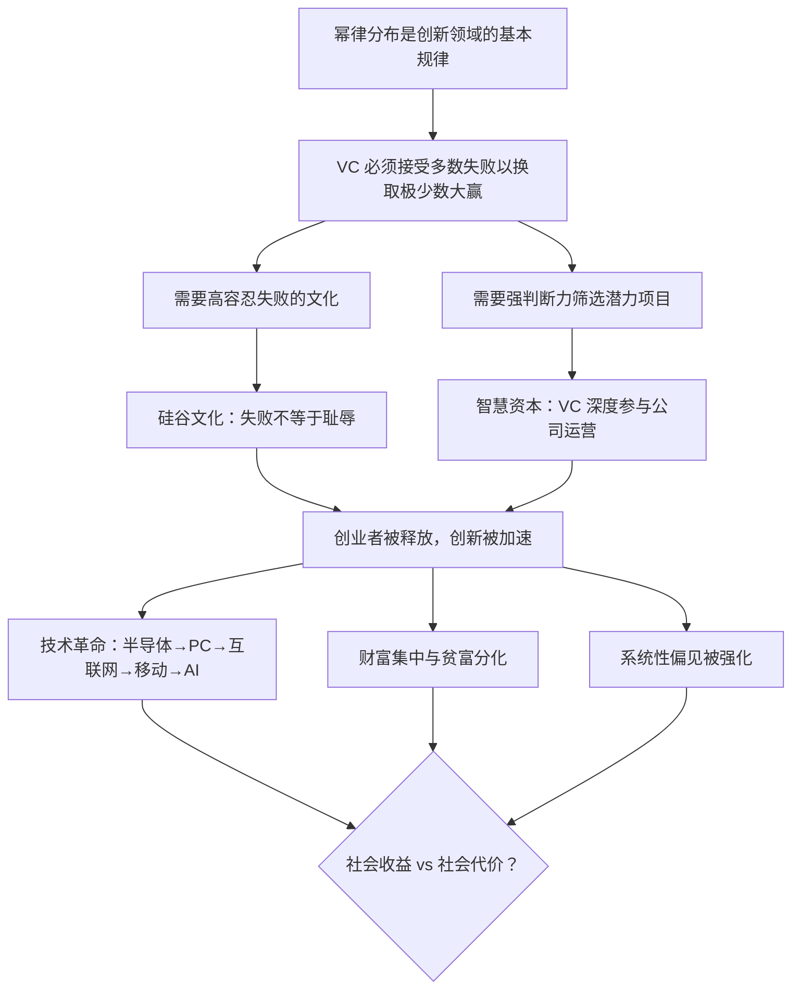

## 《风险投资史》读书笔记
  
### 作者  
digoal  
  
### 日期  
2026-05-23  
  
### 标签  
读书笔记 , 风险投资史   
  
----  
  
## 背景  
  

---
书名: 《风险投资史》  
原作名: The Power Law: Venture Capital and the Making of the New Future  
作者: [英] 塞巴斯蒂安·马拉比（Sebastian Mallaby）  
译者: 田轩  
出版社: 浙江教育出版社 / 湛庐文化  
出版年份: 2022  
笔记日期: 2026-05-23  
豆瓣评分: 8.7  
标签: [风险投资, 硅谷, 金融史, 创新, 科技, 创业]  
---

  

> **一句话**：风险投资不只是一门生意，它是人类社会主动制造未来的一种方法论——通过拥抱极端不确定性，让少数疯狂的赌注重塑所有人的生活。  
>  
> **适合谁读**：创业者、投资人、科技从业者；对"钱从哪里来，世界因此往哪里去"这个问题感兴趣的任何人  
>  
> **阅读难度**：⭐⭐⭐☆☆  
>  
> **推荐指数**：⭐⭐⭐⭐⭐  

---

## 一、时代坐标：这本书从哪里来？

2022年，当这本书出版时，风险投资正处于一个奇特的历史节点：一方面，全球科技创业的繁荣已经把硅谷的 VC 模式变成了从以色列到深圳、从班加罗尔到拉各斯都在模仿的"全球模板"；另一方面，WeWork、Uber 等独角兽的暴雷让外界开始质疑，VC 到底是在推动创新，还是在批量制造泡沫？

作者塞巴斯蒂安·马拉比的履历本身就是这本书可信度的背书。他毕业于伊顿公学和牛津大学（历史系一等荣誉），在《经济学人》工作13年，后加入《华盛顿邮报》担任专栏作家和编委会成员，现为美国外交关系委员会保罗·沃尔克国际经济学高级研究员，两度获得美国新闻界最高荣誉普利策奖。他的上一本书《富可敌国》堪称对冲基金行业史诗级的记录，《格林斯潘传》同样入选《金融时报》年度最佳商业图书。

写作这本书，马拉比历时四年，对风险投资界的重要人物和机构进行了超过 300 次采访——Sequoia、Kleiner Perkins、Accel、Benchmark、Andreessen Horowitz，乃至中国的启明创投和今日资本，几乎没有一家主流 VC 机构缺席。这本书一出版，便获得了《金融时报》/麦肯锡年度最佳商业图书提名，并登上《经济学人》世界读书日书单。

马拉比写这本书，想回答两个问题：风险投资的思维方式是什么？它对社会的影响是好是坏？

---

## 二、核心命题：作者在说什么？

### 命题一：指数法则（Power Law）才是 VC 世界的第一原理

这是全书的核心洞见，也是书名的来源。

在风险投资领域，回报分布不是钟形曲线（正态分布），而是"幂律分布"——绝大多数投资归零，极少数的投资创造出超额的、几何级数增长的回报，而这少数成功者的收益往往等于或超过基金所有其他投资的总和。

霍斯利-布里奇公司（Horsley Bridge）1985年至2014年间支持了7000家初创企业，但仅仅5%的资本配置，就创造了60%的总回报。Y Combinator、彼得·蒂尔、约翰·杜尔都描述过同一个现象：最佳投资的回报，等于甚至超越基金其他所有项目的总和。

这意味着，VC 的核心任务从来不是"避免失败"，而是"不惜一切代价找到那个极端成功者"。这催生了一套截然不同于传统金融的思维方式：接受并拥抱失败，对失败者不吝宽容，因为唯有如此，才有机会押中那匹改变世界的黑马。

```
正态分布世界（银行贷款）:
[失败] [失败] [失败] [中等] [中等] [成功] [成功]
→ 风控逻辑：尽量减少坏的

幂律分布世界（风险投资）:
[失败×10] [失败×20] ... [平庸×5] ... [Google×1]
→ 风投逻辑：Google 的收益 > 所有失败之和，所以拼命找 Google
```

### 命题二：VC 提供的不只是钱，而是"智慧资本"（Smart Money）

马拉比强调，真正的 VC 与单纯的财务投资者有本质区别。VC 提供的是"智慧资本"：他们在早期介入，带来的不仅是资金，还有：
- **人脉网络**：帮助创始人找到关键的工程师、律师、客户和下一轮投资人
- **运营经验**：在董事会层面提供战略建议，协调公司内部冲突
- **勇气传导**：帮助那些有才华但缺乏胆量的工程师和科学家迈出创业那一步——马拉比称 VC 是"制造勇气的机器"（a machine for manufacturing courage）

1957年，阿瑟·洛克（Arthur Rock）说服了后来被称为"八叛将"的工程师们离开威权专横的肖克利半导体实验室，创立仙童半导体。没有洛克的介入，这八个人可能永远不会迈出那一步。到2014年，硅谷70%的上市科技公司都能追溯到仙童的血脉。这是 VC 作为"智慧资本"最早的、也是最有说服力的例证。

### 命题三：VC 模式代表了一种可复制的创新方法论，但并非没有代价

马拉比在赞美 VC 模式的同时，也诚实地指出了它的系统性代价：

**一、偏见的制度化**：由于 VC 依赖强信任的人际网络（"谁介绍你来的？"），这天然地将女性和少数族裔排除在外，导致 VC 圈至今仍是白人男性的俱乐部。

**二、独角兽崇拜的毒化**：对"下一个 Google"的执念，让 VC 给某些创始人赋予了近乎不受监督的权力，结果催生了 WeWork 和 Uber 式的治理灾难。

**三、"去大"压力**：指数法则要求 VC 必须"go big, always"，这让他们天然排斥那些稳健但不性感的小而美公司，形成了对特定创新路径的系统性偏好。

---

## 三、论证地图：作者怎么说服你的？



**关键案例脉络**（全书的叙事骨架）：

马拉比用编年史的方式，将 VC 史分为几个时代：
1. **起源期（1950s-60s）**：阿瑟·洛克与八叛将、仙童半导体的诞生——VC 作为"解放资本"的发明
2. **制度化期（1970s）**：红杉资本（Sequoia）与凯鹏华盈（Kleiner Perkins）的创立——合伙制 VC 基金的标准化
3. **扩张期（1980s-90s）**：苹果、思科、基因泰克——VC 进入生物技术和消费电子
4. **互联网泡沫（1990s-2000s）**：雅虎、谷歌、亚马逊——泡沫与精华并存的年代
5. **社交与移动（2010s）**：Facebook、Uber、Airbnb——VC 与"平台经济"的共谋
6. **全球化期（2010s-今）**：中国风险投资的崛起（软银、今日资本、启明创投）——VC 模式的输出

这种叙事方式的最大优点是"可读性强"。最大的缺点，批评者也指出，是马拉比过于依赖当事人的第一手叙述，难以区分回忆录与历史真相的边界——当多恩·瓦伦丁（Don Valentine）和史蒂夫·乔布斯1976年那次见面的"原话"被重现时，究竟有几分真实？

---

## 四、前提假设与边界：什么情况下这本书的逻辑不成立？

**假设一：创新本质上是非线性的、难以预测的**

这是整个幂律逻辑成立的前提。马拉比引用了那句名言："未来无法被预测，只能被发现。"但这个假设本身值得追问——在某些领域（如芯片制造、大型基础设施、航天），"难以预测的天才创业者"并不比"有计划的国家研发"更有效。硅谷 VC 模式在软件和消费互联网领域大放异彩，但在核能、铁路、量子计算等资本密集且周期漫长的领域，是否同样有效，书中着墨不多。

**假设二：失败文化是可以移植的**

马拉比认为，中国的风险投资成功证明了 VC 模式可以脱离硅谷文化独立运作。但值得追问的是：中国 VC 的成功，究竟有多少得益于那种"对失败宽容"的文化，又有多少得益于中国独特的市场规模、政策保护，以及模仿而非原创的商业策略？

**假设三：VC 带来的社会正收益大于代价**

这是全书最具争议的隐含立场。马拉比对 VC 整体持乐观态度，但批评者（如LSE的学者）指出，书中对不平等、垄断、数据隐私侵蚀等系统性副产品的讨论，相对蜻蜓点水。

---

## 五、思想谱系：这本书在哪个传统里？

马拉比属于**"制度性金融史"**这一写作传统，继承了沃尔特·贝杰霍特（Walter Bagehot）、查尔斯·金德伯格（Charles Kindleberger）等人把金融史写得像侦探小说的功力。

```
金融史写作谱系：
贝杰霍特《伦巴第街》(1873) ─ 制度描写的范本
          ↓
金德伯格《疯狂、惊恐和崩溃》 ─ 周期叙事
          ↓
马拉比三部曲：
《富可敌国》→ 对冲基金史
《格林斯潘传》→ 央行人物史
《风险投资史》→ VC 行业史
```

在思想立场上，马拉比是温和的**市场自由主义者**，他相信市场机制和私人资本在推动创新上有政府难以企及的优势，但他不是盲目的 VC 布道者——他在书中诚实呈现了 VC 的阴暗面，尤其是对性别多样性的系统性伤害。

这本书与彼得·蒂尔《从0到1》（创业者视角的思想书）、本·霍洛维茨《创业维艰》（创始人的实操回忆录）形成了互补的三角：马拉比提供的是外部历史学家的全景式视角。

---

## 六、我学到了什么？

**收获一：重新理解"失败"的意义**

在看这本书之前，我对风险投资的想象是"聪明的钱挑聪明的项目"。读完之后，我意识到更准确的描述是：**聪明的钱通过大量失败，买入了触达极端成功的机会**。这不只是一种投资逻辑，更是一种认知框架——在一个回报服从幂律分布的领域（无论是投资、科研还是创作），对失败保持宽容并不是美德，而是数学上的必要条件。

**收获二：VC 是一种权力结构，不只是金融工具**

马拉比有一个令我印象深刻的描述：VC 是"制造勇气的机器"。有多少改变世界的工程师和科学家，如果没有一个早期信任他们的投资人，可能永远不会踏出那一步？这意味着 VC 的决策不只是财务决策，而是在决定"谁的疯狂有资格被尝试"——这是一种巨大的社会权力，而这种权力目前还非常集中于一个同质化的群体。

**收获三：中国 VC 的故事折射出更大的问题**

书中对中国风险投资的描绘（今日资本的徐新、启明创投等）让我看到一个被国内商业报道忽略的视角：中国 VC 是在极短的时间内，跳过了美国30年的"技术积累"阶段，直接进入互联网应用层。这种"借道"的成功令人惊叹，但它也意味着中国 VC 至今在底层技术投资上存在结构性的路径依赖——这个问题，在中美科技竞争加剧的今天，已经成为最重要的国家课题之一。

---

## 七、举一反三：幂律思维还能用在哪？

马拉比揭示的幂律逻辑，其实是一个可以迁移的底层框架：

**在职业发展上**：知识积累也服从幂律。在一个领域深入到顶尖，带来的影响力往往远超在多个领域保持平均水平。所谓"T型人才"的竞争力，来自那个"T"字的竖线——深度，而非横线的宽度。

**在内容创作上**：平台上的流量分配也是幂律——头部内容吃掉绝大多数注意力。这意味着"持续创作"的重要性不在于每一篇都成功，而在于维持出手频率，直到那篇"出圈"的作品出现。

**在科学研究上**：论文引用量、学术影响力同样符合幂律。这也部分解释了为什么学术资源应该适当向头部项目集中，而不是"平均分配"。

---

## 八、批判与反思

**批评一：新闻性叙事掩盖了分析的浅薄**

马拉比是一流的叙事者，但他首先是一位记者，其次才是历史学家。书中大量的直接对话、戏剧性场景，读起来引人入胜，但也引发了方法论上的质疑：1976年那次乔布斯与多恩·瓦伦丁的谈话，能被"还原"到半页对话的精度吗？历史的精彩与历史的准确，有时候是彼此的敌人。

**批评二：美国中心主义视角**

书名号称"风险投资史"，但实际上是"硅谷风险投资史"。对于欧洲、以色列、印度 VC 生态的描述相当简略，中国部分虽然比较丰富，但仍然是作为"硅谷模式学习者"的角色出现的。这个视角预设了一个"中心-外围"的权力结构，在今天这个多极创新格局的时代，显得稍显过时。

**批评三：对 VC 模式批判的回避**

马拉比承认 VC 带来了性别偏见和独角兽崇拜等问题，但他始终将这些视为"可以改进的缺陷"，而非对 VC 模式本身的结构性批判。事实上，VC 催生的平台经济带来的垄断问题、数据隐私侵蚀、劳动者权利剥夺，是当今政策讨论的核心议题，而这些在书中几乎缺席。

---

## 九、金句与记忆点

> **"未来无法被预测，只能被发现。"**
> ——书中引用的一位传奇 VC 的话。这句话道出了创新的本质：不是规划，而是探索。

> **"风险投资是一台制造勇气的机器。"**
> ——马拉比对 VC 最精准的定义之一。VC 最重要的功能，不是提供资金，而是给那些有才华却缺乏胆量的人一个开始的理由。

> **"VC 的最大秘密是：最佳投资所创造的回报，等于或超过基金其他所有投资的总和。"**
> ——幂律的现实意义：这不是一个统计事实，而是一种行动指南——永远去找那个可能改变一切的投资，不要满足于"足够好"。

> **"敢于冒风险的'短钱'很常见，敢于冒风险的'长钱'才是稀缺的。"**
> ——译者田轩教授在推荐序中的话，折射出中国投资文化与硅谷 VC 文化之间最根本的差异。

> **"Go big, always."**
> ——VC 行业的非正式座右铭。幂律分布意味着，一个平庸的小成功，还不如一个大赌注的失败有价值，因为前者关闭了你找到下一个 Google 的可能性。

> **"八叛将"（The Traitorous Eight）离开肖克利半导体这一刻，不只是一次创业，而是硅谷"反权威"精神基因的原点。**
> ——1957年，阿瑟·洛克说服这八个工程师集体辞职，成为现代 VC 历史的第一章。没有这次"叛逆"，就没有仙童半导体，就没有英特尔，就没有今天的硅谷。

---

## 十、延伸阅读

1. **《从0到1》彼得·蒂尔** ——与本书互补的创业者视角。蒂尔的"垄断才是好生意"理论，是幂律思维在商业战略上的延伸。

2. **《富可敌国》塞巴斯蒂安·马拉比** ——马拉比的前一部大作，以同样的笔法记录对冲基金的历史，两本书合读，可以看清现代另类投资的全貌。

3. **《创业维艰》本·霍洛维茨** ——Andreessen Horowitz 联合创始人的创业回忆录，与本书的 VC 视角形成了互补的创业者视角，读完这本书，再看马拉比书中对 a16z 的描述，别有一番滋味。

4. **《幂次法则》（The Power of Networks）弗兰克·法博兹等** ——从经济学角度深入理解幂律分布在金融市场中的含义，是本书的数学"续集"。

5. **《硬球》（Hardball）克里斯·马修斯** ——理解"连接者"在权力网络中的作用，与 VC 作为"聪明媒介人"的角色有深刻的共鸣。

---

```
风险投资的本质，
不是在对的时间押注正确的答案，
而是在没有答案的时候，
给那些敢于寻找答案的人一张船票。
```

---

*笔记写于 2026-05-23 | 基于公开资料、多方书评与深度思考整理*
*原书评分：豆瓣 8.7 / 得到用户推荐指数 4.4*
  
  
#### [PostgreSQL 解决方案集合](../201706/20170601_02.md "40cff096e9ed7122c512b35d8561d9c8")
  
  
#### [德哥 / digoal's Github - 公益是一辈子的事.](https://github.com/digoal/blog/blob/master/README.md "22709685feb7cab07d30f30387f0a9ae")
  
  
#### [About 德哥](https://github.com/digoal/blog/blob/master/me/readme.md "a37735981e7704886ffd590565582dd0")
  
  

  
