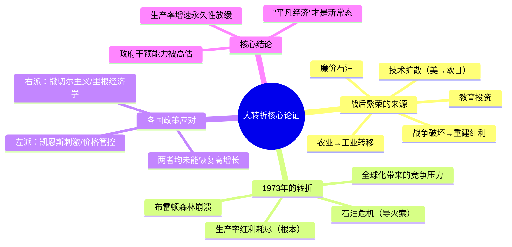

## 《大转折：危机因何而生 繁荣为何不可持续》读书笔记
  
### 作者  
digoal  
  
### 日期  
2026-05-23  
  
### 标签  
读书笔记 , 大转折：危机因何而生 繁荣为何不可持续   
  
----  
  
## 背景  
  
---
书名: 《大转折：危机因何而生 繁荣为何不可持续》  
作者: [英] 马克·莱文森  
原作名: An Extraordinary Time  
出版年份: 2016（英文）/ 2022（中文）  
译者: 多绥婷  
出版社: 民主与建设出版社·后浪  
笔记日期: 2025-05-23  
豆瓣链接: https://book.douban.com/subject/35750270/  
标签: [经济史, 战后繁荣, 滞胀, 生产率, 政治经济学]  
---

  
## ——那个曾经存在的"黄金时代"，为什么一去不复返？

> **一句话**：战后那25年的经济奇迹，不是人类智慧的胜利，而是历史的偶然——而我们，至今仍活在它破碎的阴影里。  
> **适合谁读**：想理解当代经济困局根源的人；对政策万能论持怀疑态度的人；关心贫富分化、政治极端主义为何盛行的人。  
> **阅读难度**：⭐⭐⭐☆☆  
> **推荐指数**：⭐⭐⭐⭐☆  

---

## 一、时代坐标：这本书从哪里来？

2016年，特朗普喊出"让美国再次伟大"，英国脱欧公投震惊世界。这两件事背后有一个共同的幻觉：曾经有过一个更好的时代，只要找到正确的政策，就能把它找回来。

马克·莱文森写《大转折》，正是要拆穿这个幻觉。

莱文森并非书斋里的学者。他是记者出身，先后供职于《时代》《新闻周刊》《经济学人》，后担任摩根大通经济学家，现为美国外交关系委员会研究员。他有一种罕见的能力：把枯燥的经济数据写成引人入胜的故事。他的上一本书《集装箱改变世界》已经证明了这一点——那本书告诉我们，一个铁皮箱子如何重塑了全球贸易格局。

这一次，他选择了一个更宏大的命题：1948年至1973年，西方世界经历了史无前例的经济腾飞。这25年，有人称之为"光辉三十年"（Les Trente Glorieuses），有人叫它"黄金时代"。随后，1973年，一切戛然而止。

半个世纪过去了，我们依然没有找回那种增长速度。

这本书要回答的问题，正是我们今天仍在追问的那些：**繁荣为什么突然终结？政府的干预究竟能做什么、又做不了什么？我们还能回到那个时代吗？**

```
时间轴：战后经济史的三个阶段

1945          1973          1990          2008          2016
  │             │             │             │             │
  ▼             ▼             ▼             ▼             ▼
[重建期]  →  [黄金时代]  →  [滞胀应对]  →  [金融危机]  →  [民粹反扑]
 战后废墟      年均增长      撒切尔/里根    量化宽松        特朗普/脱欧
 马歇尔计划    4-5%          减税/私有化    负利率时代       "Make...Great"
```

---

## 二、核心命题：作者在说什么？

### 观点一：战后繁荣是历史的"偶然"，而非人类政策的"必然"

莱文森最颠覆性的论断，在于他认为战后的经济奇迹并非源于某种高明的治国方略——不是凯恩斯主义、不是福利国家、不是计划经济，更不是某个政党的功劳。

真正的原因，是一组独特的"低垂果实"同时出现：

- **战争破坏催生的重建红利**：大规模物质损毁之后，重建本身就是增长。
- **农村人口向城市工业的大转移**：生产率低的农业劳动力涌入制造业，整体效率自然提升。
- **技术扩散红利**：美国已经发展成熟的技术（汽车、家电、化工），在欧洲和日本快速普及，效率提升立竿见影。
- **教育大跃进**：战后各国大规模推广基础教育和高等教育，人力资本迅速积累。
- **廉价石油**：整个工业体系建立在超低能源成本之上。

这些条件同时成立，制造了一个"非凡时代"（Extraordinary Time）。但这些果实只能摘一次。一旦摘完，增长自然放缓。

### 观点二：1973年是转折点，但石油危机只是导火索

很多人把1973年的衰退归咎于石油危机：阿拉伯国家石油禁运，油价暴涨，工业世界措手不及。

莱文森的分析更细腻。他指出，生产率增长的放缓其实在1973年之前就已开始。石油危机是一根稻草，但稻草压垮的那头骆驼，早已疲态尽显。

更根本的原因是：此前驱动增长的那些结构性红利，在1970年代初期基本耗尽。城市化完成了，技术扩散完成了，教育红利短期内难以再复制，劳动力从低效转向高效的迁移基本结束。于是，当外部冲击到来时，西方经济没有了此前的抗冲击弹性。

数据触目惊心：12个富裕国家1950-1973年的劳动生产率年增长率为**4.6%**；1973年之后的二十多年，这个数字降至**2%**。美国1960至1973年多重要素生产率增长了**34%**，而1973至1986年的同等时段仅增长**7%**。

### 观点三：无论左派还是右派，都没有找到破解困局的钥匙

这是全书最发人深省的部分，也是最得罪人的部分。

危机之后，各国政府纷纷出招。左派用凯恩斯主义刺激需求、价格管控、扩张财政；右派用撒切尔主义削减政府、私有化、放松管制。莱文森逐一检视这些政策的实际效果，结论令人沮丧：

**没有一种方案真正奏效。**

撒切尔夫人上台后，货币主义实验前两年以失败告终，英国经历了二十世纪三十年代以来最惨烈的经济收缩。里根减税之后，赤字扩大，增长的恢复更多依赖货币政策宽松，而非减税本身。法国密特朗的社会主义实验同样折戟，两年内被迫逆转。

莱文森援引英国议员基思·约瑟夫的话作为全书的精神结语："增长固然可喜，但事实是，**我们无法知道如何才能加快增长的速度。**"

---

## 三、论证地图：作者怎么说服你的？



莱文森的论证方式，是经济史的经典路数：用大量跨国比较数据建立基准，再用具体国家的政策实验作为"天然对照组"。他广泛引用了英国、法国、德国、日本、美国、加拿大等国的案例，横向对比在相似外部冲击下，不同意识形态政策的实际效果。

这种方法的优势是直观有力；劣势在于，各国历史情境差异巨大，简单比较难免粗糙。部分学术评论者（如圣塔克拉拉大学的亚历山大·菲尔德）也指出，莱文森对劳动收入份额下降的解释存在一定内在矛盾：他一方面说生产率增速放缓，另一方面又引用技术加速变化来解释劳动力议价能力下降——而这两个说法难以同时成立。

尽管如此，其核心叙事——繁荣有结构性原因、终结也有结构性原因、政策能力被高估——仍然令人信服。

---

## 四、前提假设与边界：什么情况下这不成立？

**假设一：生产率放缓是"永久性"的**

莱文森写作此书时（2016年），AI尚未爆发。他的悲观结论建立在"技术创新红利已被耗尽"的假设上。但2023年以来大语言模型的突破，让部分经济学家重新讨论新一轮生产率革命的可能性。他的结论可能需要重新检验。

**假设二：政府政策对增长的影响有限**

这个结论在1973-2000年的历史中有说服力，但它可能低估了制度差异的长期作用。同样面对石油危机，东亚"发展型国家"（韩国、台湾）的表现明显优于西欧，这背后的产业政策因素值得深究。

**假设三：战后繁荣不可复制**

莱文森的论证是针对"成熟的发达经济体"。对于仍处于追赶阶段的经济体（如中国1980-2010年的高速增长），战后西欧那种"技术扩散+城镇化"的逻辑依然适用。这本书的边界，是关于"已经到达高收入阶段的国家"的故事。

---

## 五、思想谱系：这本书在哪个传统里？

莱文森的工作，接续的是经济史"大叙事"传统——戈登（Robert Gordon）的《美国增长的兴衰》、皮凯蒂的《21世纪资本论》、埃文斯（Peter Evans）的发展国家理论，都在讨论增长的结构性基础与天花板。

他的核心观点与罗伯特·戈登高度呼应：戈登认为19世纪末到20世纪中叶的技术革命（电力、内燃机、自来水、室内管道）是一次性的，之后的创新很难再制造同等量级的生产率跃升。莱文森从历史叙事角度，为这一理论提供了大量实证支撑。

```
思想脉络

凯恩斯主义 ─────────────────► 被莱文森质疑其万能性
弗里德曼货币主义 ─────────────► 同上
          ↓
      结构主义视角
          ↓
Robert Gordon《美国增长的兴衰》── 技术创新的天花板论
Marc Levinson《大转折》──────── 战后繁荣是历史偶然
          ↓
对"政策决定论"的集体反思
```

---

## 六、我学到了什么？

读完这本书，有三件事让我久久不能释怀。

**第一，区分"偶然的繁荣"与"必然的政策效果"，是一种极其重要的认知能力。**

战后那一代政治家，凯恩斯主义者也好，保守派也好，都从那段高速增长中汲取了错误的教训——他们把结构性红利的果实，归功于自己的治理智慧。等到红利消失，他们发现自己其实从未真正"掌控"过经济，只是在顺风里开船。这种认知错觉，今天的政治家同样难以摆脱。

**第二，"让XX再次伟大"是一种危险的历史虚构。**

特朗普、英国脱欧、各国民粹运动，其情感基础都是对那个"曾经更好的时代"的怀念。但莱文森告诉我们：那个时代的条件是历史性的、一次性的，不可能靠换一个政党、换一种政策重现。用怀旧驱动的政治，注定要让人失望。

**第三，悲观主义有时候才是真正的负责任。**

莱文森没有给出解药，没有"五步走向繁荣"。他选择诚实地告诉我们：我们不知道怎么做。这在以"解决方案"为卖点的非虚构写作市场里，是一种难能可贵的知识诚实。

---

## 七、举一反三：这个框架还能用在哪？

**框架核心**：区分"结构性红利"与"政策效果"，警惕把前者误认为后者。

**场景一：中国经济的"增长减速"**

2010年代之后，中国经济增速从10%以上放缓至6%左右，各种政策讨论随之兴起。用莱文森的框架看：此前高速增长，有多少来自城镇化、技术引进、人口红利（结构性因素）？这些因素耗尽后，"政策能做什么"的边界在哪里？

**场景二：企业管理中的"创始人效应"**

很多企业在某个阶段高速增长，管理层容易把成功归因于自己的战略决策，而忽视行业风口、人口红利、监管套利等结构性因素。等行业红利消退，往往措手不及。

**场景三：个人职业的"赛道判断"**

一个人在某个行业升职顺利、薪资飞涨，究竟是因为个人能力，还是因为行业本身处于扩张期？行业红利终结后，个人该如何重新校准自己？

---

## 八、批判与反思

莱文森这本书有一个结构上的问题：他用大量篇幅描写1973-1990年代的政策应对，却相对简短地处理了战后繁荣的成因分析。对于"为什么繁荣"的回答，不如"繁荣为何终结"来得翔实。

更根本的挑战，来自AI时代的冲击。本书2016年写就，2022年GPT-3.5横空出世，之后大语言模型的扩散速度超出所有人预期。如果生成式AI真的能在制造业、服务业、知识工作中大规模提升生产率，莱文森"增长永久性放缓"的悲观结论，可能需要修正。历史不重复，但会押韵——也许新的"低垂果实"正在出现，只是我们还无法确认。

此外，书中对于发展中国家的视角略显不足。东亚奇迹（韩国、台湾、新加坡）在某种程度上复制了战后西欧的路径，但在政府角色上差异显著。这些"例外"值得更深入的讨论。

---

## 九、金句与记忆点

> **"增长固然可喜，但事实是，我们无法知道如何才能加快增长的速度。"**
> ——基思·约瑟夫（引自书中）
> *解析：这句话是全书的灵魂。政策制定者的傲慢，在于以为自己能控制经济增长的节奏。这句话是一次罕见的坦诚。*

> **"20世纪50年代到70年代初是经济发展的黄金时期。它超越了任何合理的预期。我们短时间内不会看到相似的情况了。"**
> ——保罗·萨缪尔森，1981年
> *解析：这是诺奖级别的经济学家说的。"超越任何合理预期"六个字，是对那个时代最精准的定性。*

> **"战后繁荣的终结与平凡经济的回归"**
> ——书名原文副标题
> *解析："平凡经济"才是正常状态，"非凡时代"才是例外。我们把例外当成了标准，这才是所有焦虑的起点。*

> **从4.6%到2%**
> *解析：12个富裕国家，战后劳动生产率年增长率从4.6%跌至2%。这两个数字之间，是数代人的生活水准预期落差，是今天政治极端主义的情感根源。*

> **"它只是在已经受到各种因素影响的生产率水平上压下来的一根稻草"**
> ——书中对石油危机的定性
> *解析：关于因果分析最重要的提醒：导火索不等于根本原因。*

---

## 十、延伸阅读

1. **《美国增长的兴衰》** Robert Gordon
   ——莱文森观点的学术版，聚焦美国，数据更扎实。读完这本，再看《大转折》会有豁然开朗之感。

2. **《21世纪资本论》** 托马斯·皮凯蒂
   ——同样关注二战后的经济黄金期，但切入角度是不平等。两书合读，可以理解分配与增长的双重困局。

3. **《下沉年代》** 乔治·帕克
   ——用人物故事讲述美国普通人如何在经济停滞中沉沦。莱文森告诉你宏观数据，帕克告诉你这些数据里住着什么样的人。

4. **《集装箱改变世界》** 马克·莱文森（本书作者前作）
   ——理解全球化如何在战后繁荣中扮演角色，以及它如何在某种程度上加速了制造业转移、压低了西方工人工资。

5. **《大停滞》** 泰勒·科文
   ——简短版的类似论证：美国摘完了"低垂果实"，进入增长瓶颈期。适合快速了解这一思潮的核心论点。

---

*笔记写于 2025-05-23 | 基于公开资料、学术书评与深度思考整理*
*核心参考：EH.net学术书评（Alex Field）、Barnes & Noble书评、豆瓣长评、Financial Sense采访*
  
  
#### [PostgreSQL 解决方案集合](../201706/20170601_02.md "40cff096e9ed7122c512b35d8561d9c8")
  
  
#### [德哥 / digoal's Github - 公益是一辈子的事.](https://github.com/digoal/blog/blob/master/README.md "22709685feb7cab07d30f30387f0a9ae")
  
  
#### [About 德哥](https://github.com/digoal/blog/blob/master/me/readme.md "a37735981e7704886ffd590565582dd0")
  
  

  
