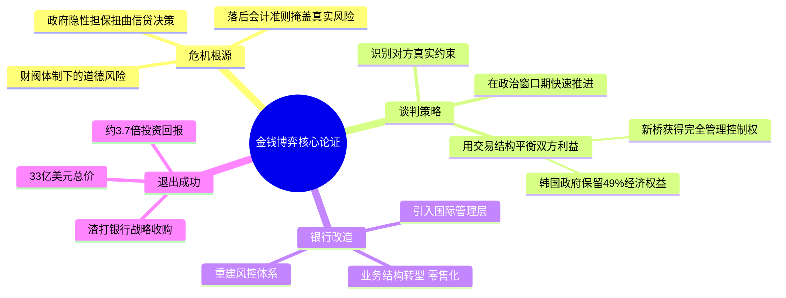

## 《金钱博弈：重振韩国第一银行内幕》读书笔记
  
### 作者  
digoal  
  
### 日期  
2026-05-23  
  
### 标签  
读书笔记 , 金钱博弈：重振韩国第一银行内幕   
  
----  
  
## 背景  
  
---
书名: 《金钱博弈：重振韩国第一银行内幕》  
作者: 单伟建  
原作名: Money Games: The Inside Story of How American Dealmakers Saved Korea's Most Iconic Bank  
出版年份: 2022-05  
出版社: 中信出版集团  
笔记日期: 2025-05-23  
豆瓣评分: 9.1（2496评价）  
微信读书推荐值: 92.9%  
标签: [私募股权, 并购, 亚洲金融危机, 商业谈判, 韩国, 回忆录]  
---

  

> **一句话**：一个中国人，率美国资本，在韩国金融危机的废墟上，与政府、民族主义、官僚体制博弈五年，把一家濒死的银行变成了价值33亿美元的资本奇迹。  
>  
> **适合谁读**：金融从业者、创业者、对谈判与政商关系感兴趣的人，以及任何想看懂"钱是怎么在国与国之间流动"的人。  
>  
> **阅读难度**：⭐⭐⭐☆☆（有金融背景更佳，但完全可以当商战故事读）  
>  
> **推荐指数**：⭐⭐⭐⭐⭐  

---

## 一、时代坐标：这本书从哪里来？

1997年，一场金融海啸席卷亚洲。泰铢崩溃引发连锁反应，韩国成为重灾区。年底，韩国外汇储备几乎耗尽，被迫向IMF求援，代价是接受一系列羞辱性的结构性改革条件——包括向外资开放此前铁板一块的金融业。

韩国第一银行（Korea First Bank，KFB），这家拥有百年历史、象征韩国金融主权的大银行，此时已是烂账缠身，技术上已经破产。政府一边往里注资（先期已注入超过1.5万亿韩元纳税人的钱），一边被迫答应IMF：必须把它卖给外资。

正是在这个历史节点，单伟建嗅到了机会。

单伟建的人生本身就是一部传奇。北京文官家庭出身，文化大革命中被发配内蒙古戈壁劳动七年，此后辗转赴美求学，拿到经济学博士，在沃顿商学院任教，再转身投入私募股权行业。1998年，他以新桥资本（Newbridge Capital）联席主管合伙人的身份，把目光锁定在这家韩国最具象征意义的银行上——彼时新桥的第二期基金（4亿美元）还在募集中。

这本书，就是他对那五年岁月的亲历还原。

```
时间轴：从危机到奇迹

1997年底 ──→ 韩国金融危机爆发，KFB技术性破产
1998年初 ──→ 单伟建开始接触韩国金融监督委员会（FSC）
1998年12月 ──→ 双方签署意向书（MoU）→ 标普上调韩国信用评级展望
↓↓↓（长达一年多的谈判拉锯）↓↓↓
2000年初 ──→ 新桥正式完成收购，投资约9亿美元，获得完全控制权
2000-2004 ──→ 改造管理层、重建风控、转型零售银行
2004年 ──→ 以33亿美元出售给渣打银行
结果：投资回报约3.7倍，渣打接手后称"KFB的风控比我们自己的还好"
```

---

## 二、核心命题：作者在说什么？

### 观点一：金融危机是制度腐败的后果，不只是运气不好

单伟建在书中揭示了韩国银行业崩溃的根本逻辑：财阀（Chaebol）体系下，银行不是商业机构，而是政府的政策工具。银行贷款给政府钦定的"战略性企业"，潜台词是"出了事政府兜底"，于是信用评估形同虚设。

韩国会计准则更是火上浇油——只要借款人还在付利息，贷款就算"正常"，不管这家公司是否其实已经资不抵债。这种"粉饰太平"的会计逻辑，让危机在账面上消失，却在现实中不断积累。

这不只是韩国的问题。这是所有政府主导型经济的通病：当银行和政治权力深度捆绑，市场的价格发现功能就会失灵，风险在黑暗中静悄悄堆成山。

### 观点二：谈判的本质，是理解对方的真正约束

书中最精彩的部分，是长达一年多与韩国金融监督委员会（FSC）的谈判拉锯战。这场谈判之所以如此艰难，不是因为双方利益完全对立，而是因为FSC官员面临一个结构性困境：

- **必须卖**（IMF条件 + 纳税人资金无底洞）
- **不敢卖便宜**（贱卖国有资产的政治风险）
- **谈判者随时可能被换掉**（政治动荡导致对手方换了一拨又一拨）

单伟建的应对策略，是始终锚定"对方真正的约束条件是什么"，而不是"对方说了什么"。这是商业谈判中最难、也最关键的元认知。

### 观点三：改造一家银行，就是重建一种文化

收购完成只是开始。新桥面对的是一个从价值观到操作流程都已僵化的官僚机构。书中记录了新桥如何引入国际化管理层（包括从花旗挖来的CEO），建立现代风控体系，把原本单一的企业贷款业务转向零售和消费金融，以及如何处理贷款账面"藏雷"（如Hynix半导体的200亿韩元坏账）。

这部分内容证明：私募股权投资的价值不只在于"买低卖高"，更在于真实的运营改造能力。渣打银行接手后的评价，是对这种能力最好的背书。

---

## 三、论证地图：作者怎么说服你的？



**关键数据支撑：**

- 新桥收购时与韩国政府共同出资约9亿美元
- KFB总资产在5年内翻倍至400亿美元以上
- 最终出售价格33亿美元（约为收购时新桥出资的近4倍）
- Hynix坏账导致损失约2亿美元，几乎抹去一年利润（诚实记录失败）
- 新桥签署MoU后，S&P当即上调韩国信用评级展望——信号效应之强可见一斑

**论证方式评价：**
单伟建是亲历者叙事，优点是细节极度翔实（具体到某次谈判某人说了什么、作者当时心里怎么想）；局限是视角单一——我们只听到了新桥这一侧的心理活动，韩国谈判者的真实想法只能从行为中推断。这是所有"胜利者回忆录"的结构性盲区。

---

## 四、前提假设与边界：什么情况下这不成立？

**假设一：韩国经济会复苏**
新桥押注的底层逻辑，是韩国不会长期沉沦。如果韩国像日本那样陷入"失去的二十年"，这笔交易可能亏得很惨。单伟建在书中承认了这个赌注的存在，但并未深入分析他当时如何评估这一风险的——这是叙事上的一个缺口。

**假设二：外资可以在主权国家实现真实控制**
书中最有价值的部分之一，是展示了"名义控制"和"实质控制"之间的漫长拉锯。新桥要的是完全的管理控制权，不仅仅是财务股权。这在民族自尊心极强的韩国是极大的政治挑战。能成功，很大程度上依赖于金大中政府在政治上的压力（IMF协议）——这是一个不可复制的历史条件。

**假设三：改造能带来价值**
这本书有一个隐含前提：外资管理团队带入的现代银行业规范，对韩国是好事。这大体是成立的，但书中对改造过程中的文化冲突和员工视角着墨不多。外国投资者"拯救"本国银行的叙事框架，在本地往往会遭到挑战。

---

## 五、思想谱系：这本书在哪个传统里？

《金钱博弈》属于一个独特的"亲历者商业史"写作传统，同类作品包括《门口的野蛮人》（KKR收购RJR纳贝斯科）和迈克尔·刘易斯的《说谎者的扑克牌》。区别在于：单伟建写的是亚洲金融危机背景下的跨国交易，更多涉及政治经济学维度，而非纯粹的华尔街内部文化。

在私募股权的文献谱系中，这本书填补了一个重要空白：完整记录了从收购 → 运营改造 → 退出的全周期，而非只聚焦于交易本身。这使它同时具有学术案例价值（哈佛商学院已将相关案例收录）和大众阅读价值。

单伟建的另一本书《走出戈壁》（Out of the Gobi）是他的个人成长史，两本书构成一个完整的人物弧线：从文化大革命的受害者，到操盘数十亿美元交易的玩家。理解了《走出戈壁》，才能理解他在《金钱博弈》中表现出的那种"大风大浪见过了，没什么了不得"的定力。

```
影响脉络

《门口的野蛮人》(1989) ──┐
                          ├──→ 私募股权"内幕叙事"传统
《说谎者的扑克牌》(1989) ──┘
                                    ↓
                          《金钱博弈》(2020/2022中文版)
                          ┌─────────────────────────────┐
                          │ 新增维度：跨国交易 + 政商博弈 │
                          │ + 亚洲金融危机历史背景        │
                          │ + 全周期（收购+运营+退出）    │
                          └─────────────────────────────┘
                                    ↓
                          《金钱机器》（深圳发展银行篇，未来续集）
```

---

## 六、我学到了什么？

**1. "懂对方的约束"比"懂自己的目标"更重要**

书中最让我印象深刻的谈判细节，是新桥始终没有把FSC官员当成"障碍"，而是当成"也被困住的人"。FSC官员不是不想成交，是成交本身对他们有政治风险。单伟建的应对，是主动帮对方设计"可以交代过去的叙事"——比如让韩国政府保留49%经济权益，让外界觉得这不是贱卖，而是合作。

这个思路可以迁移到任何谈判场景：客户为什么拖着不签单？上级为什么不批预算？对方的犹豫背后，永远有一个你不知道的约束。找到它，比说服更有效。

**2. 信号有时比行动更有力**

MoU签署后，标普当天就上调了韩国的评级展望，把这笔交易视为韩国政府改革意愿的信号。交易还没完成，市场就已经反应了。这让我重新审视"信号"这个概念：很多时候，宣告一件事的意图，比完成这件事本身影响更大。

**3. 诚实记录失败，是最高级的自信**

书中记录了Hynix坏账导致几乎抹去一整年利润、CEO被迫引咎辞职的细节。一个只想塑造成功形象的人，不会把这段写进书里。单伟建的自信来自于：整个故事的结局足够好，局部的失败反而增加了可信度。

---

## 七、举一反三：这个框架还能用在哪？

**场景一：初创公司融资谈判**
融资谈判本质上也是政治博弈——投资人有自己的LP、有自己的投委会压力、有自己的行业偏见。创始人如果只想着"我怎么讲好故事"，而不去想"投资人的约束是什么"，往往会在无谓的方向上浪费精力。

**场景二：企业文化改造**
新桥改造KFB的路径（换管理层 → 重建流程 → 改变激励机制）与任何组织变革的逻辑高度一致。核心教训是：文化不能靠口号改变，只能靠人事和制度改变。

**场景三：理解政府与市场的关系**
书中关于韩国财阀体制的分析，是理解"政府主导型经济"内在逻辑和内在风险的一个极好教材。危机前的韩国，和今天某些新兴市场经济体的结构并无二致。历史的参照系，往往比任何理论都更直接。

---

## 八、批判与反思

**这本书缺少的声音**

这是一本胜利者写的历史。韩国政府谈判官员的视角、银行员工的视角、韩国普通民众的感受——这些声音在书中几乎是缺席的。当单伟建描述民族主义情绪和反对声音时，那些声音是作为"需要克服的阻力"出现的，而不是作为"值得倾听的观点"出现的。

**"拯救"的叙事框架值得质疑**

书名的英文原版叫"American Dealmakers Saved Korea's Most Iconic Bank"——"拯救"这个词本身就预设了立场。事实是：新桥是为了获利才来的，恰好这次获利和韩国的利益基本一致。这不是批评，而是需要还原的本来面目：商业逻辑，而非慈善逻辑。当两者恰好一致时，才是最好的资本故事。

**时代背景的不可复制性**

1998年后的韩国，是一个高速恢复的经济体，这是交易成功的底层条件之一。在增长停滞的市场，同样的并购+改造策略，能否复制同样的回报，是一个开放的问题。

---

## 九、金句与记忆点

> **"资本对我们来说不是问题。"**
> ——单伟建在新桥二期基金还在募集时，在FSC官员面前说出这句话。这不是吹牛，这是谈判中的锚定策略：让对方觉得你不急，你才有议价空间。

> **"在官僚机构里谈判，耐心是唯一的通货。"**
> ——书中没有这句原话，但这是整本书最核心的隐含智慧。新桥谈了整整一年多，对手换了好几拨，他们没有崩溃，而是每次都重新建立关系。

> **"MoU签署后，标普上调了韩国的信用评级展望。交易本身成了信号，信号先于交易发挥了作用。"**
> ——关于"信号效应"的最好案例。

> **"银行出了问题，从来不只是银行的问题。"**
> ——韩国金融危机的深层教训。银行是经济体的镜子，反映的是信用分配的政治逻辑。

> **"渣打接手后说，KFB的风险管理体系比渣打自己的还要好。"**
> ——这是对整个改造项目最有力的背书，也是单伟建写这本书最底气十足的地方。

---

## 十、延伸阅读

1. **《走出戈壁》（单伟建）** ——本书的前传，理解单伟建个人成长史的必读之作，两本合读才能理解他的判断力从何而来。

2. **《门口的野蛮人》（Bryan Burrough & John Helyar）** ——私募股权领域最经典的叙事非虚构，与《金钱博弈》互为镜像：同样是并购战场，但发生在华尔街而非首尔。

3. **《当音乐停止之后》（Alan Blinder）** ——2008年金融危机的深度复盘，与1997年亚洲金融危机对照阅读，能看清"金融危机的普遍规律"。

4. **《失控的银行》（Liaquat Ahamed）** ——1929年大萧条前夕，四位央行行长如何把世界拖向深渊。历史对照，理解银行体系脆弱性的起源。

5. **《韩国株式会社》（经济学人类相关报告）** ——如果想深入理解财阀体制和韩国政治经济学，这类报告是很好的补充。

---

*笔记写于 2025-05-23 | 基于公开资料、书评与深度思考整理*
*参考来源：微信读书书评、The Credit Balance专业评论、Goodreads读者评价、Five Books推荐、Wiley出版社介绍*
  
  
#### [PostgreSQL 解决方案集合](../201706/20170601_02.md "40cff096e9ed7122c512b35d8561d9c8")
  
  
#### [德哥 / digoal's Github - 公益是一辈子的事.](https://github.com/digoal/blog/blob/master/README.md "22709685feb7cab07d30f30387f0a9ae")
  
  
#### [About 德哥](https://github.com/digoal/blog/blob/master/me/readme.md "a37735981e7704886ffd590565582dd0")
  
  

  
