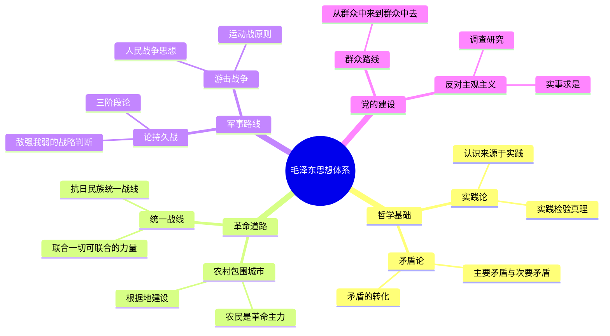

## 《毛泽东选集一至五卷》读书笔记
  
### 作者  
digoal  
  
### 日期  
2026-05-24  
  
### 标签  
读书笔记 , 毛泽东选集一至五卷   
  
----  
  
## 背景  
  
  
---
书名: 《毛泽东选集》（一至五卷）  
作者: 毛泽东  
编纂出版: 1951年（一卷）至1977年（五卷）  
笔记日期: 2026-05-24  
参考来源: https://www.marxists.org/chinese/maozedong/index.htm  
豆瓣评分: 9.3  
标签: [马克思主义中国化, 革命理论, 辩证法, 军事战略, 政治哲学]  
---

  

> **一句话**：一个农民之子用笔和枪重写了中国命运，而这部书就是那支笔留下的全部弹痕。  
> **适合谁读**：想理解20世纪中国革命逻辑的人；想学习在极端复杂环境下做决策的人；对辩证思维方法感兴趣的人。  
> **阅读难度**：⭐⭐⭐☆☆（文字并不艰深，但背景知识越厚读来越有滋味）  
> **推荐指数**：⭐⭐⭐⭐☆  

---

## 一、时代坐标：这本书从哪里来？

1919到1949，整整三十年。中国在这三十年里经历了五四运动、北伐、国共分裂、长征、抗日战争、内战，每一场都是生死赌局。毛泽东在这三十年里从湖南的一个小学教员，变成了一个掌握数百万军队、即将建立新国家的领导者。

《毛泽东选集》不是他坐在书斋里写成的，而是在战争间隙、政治危机、路线斗争的夹缝里挤出来的。第一卷第一篇《中国社会各阶级的分析》写于1925年，彼时他三十二岁；最后一篇收录于五卷的文章写于建国后的建设时期。这部书横跨半个世纪的风云，是一份活生生的历史档案，也是一套边打仗边形成的思想体系。

有一点值得特别注意：这部书是经过编辑和修订的。毛泽东本人参与了文章的筛选与改订，部分篇章删去了后来看来"不合时宜"的内容，加入了注释。马克思主义文库（marxists.org）收录的版本保留了一些被官方版本删去的原始段落，读者对照阅读，可以感受到历史的另一个维度。

他写作的问题意识始终如一：**中国革命为什么会失败？怎样才能成功？** 这不是书斋里的哲学问题，而是他的同志不断在战场上死去所逼出来的真实追问。

---

## 二、核心命题：作者在说什么？

### 命题一：马克思主义必须中国化

这是《毛选》最根本的方法论立场。毛泽东不满足于照搬苏联模式和共产国际指令，他在《反对本本主义》（1930年）里明确说："没有调查，没有发言权。"

这句话背后是一个深刻的认识论立场：任何理论都必须从具体实践中生长出来，脱离中国实际的马克思主义是没有用处的。正是基于这个判断，他发展出"农村包围城市"的道路——这在当时的共产国际看来几乎是异端，因为马克思主义的经典理论是以工人阶级为革命主体的，而中国工人阶级数量极少，农民才是社会的绝大多数。毛泽东不是不知道这个理论困境，但他选择相信中国土地上的事实。

### 命题二：矛盾无处不在，认清主要矛盾才能破局

《矛盾论》（1937年）是《毛选》哲学部分的核心，也是最值得单独深读的一篇。他继承了马克思主义辩证法，但做了大幅度的中国化改造：

- 任何事物内部都存在矛盾，矛盾是推动发展的根本动力；
- 矛盾有主要矛盾和次要矛盾之分；
- 主要矛盾中又有矛盾的主要方面和次要方面；
- 矛盾在一定条件下会发生转化。

这套分析框架的实践价值极强。比如，抗日战争期间他认定"中日矛盾是主要矛盾"，因此必须建立抗日民族统一战线，哪怕暂时搁置与国民党的阶级矛盾。这不是机会主义，而是基于矛盾论的战略判断。

### 命题三：知行合一，实践是检验真理的唯一标准

《实践论》（1937年）是对认识论的系统阐述。核心逻辑：认识来源于实践，认识反过来指导实践，实践再检验认识，如此循环上升。

这篇文章既是对党内教条主义的批判（那些只会背马列语录、不懂实际情况的干部），也是对经验主义的批判（那些只靠直觉和经验、拒绝理论提升的干部）。他把这两种偏向都称为"主观主义"，认为是党最危险的敌人之一。

### 命题四：群众路线是革命的生命线

贯穿全书的一个政治主张是：领导者必须深入群众，"从群众中来，到群众中去"。这不只是口号，而是他对如何在没有正规军队、没有稳定后方的条件下赢得战争的根本答案——依靠人民群众的自发力量和主动性。

---

## 三、论证地图：作者怎么说服你的？



毛泽东的论证方式有几个显著特点：

**大量使用历史案例和军事案例**。他几乎不做纯抽象的推演，每一个论点背后都跟着具体的战役、历史事件或实地调查。《湖南农民运动考察报告》（1927年）就是一个范本——他亲自去湖南农村调查了32天，带回来一份翔实的田野报告，用事实击退了那些认为农民运动"过激"的质疑者。

**善用比喻和口语化表达**。"星星之火，可以燎原"、"枪杆子里面出政权"、"没有调查，没有发言权"——这些话之所以流传至今，是因为它们把复杂的政治判断压缩成了一句能让文盲农民也能理解的话。这是一种罕见的政治传播能力。

**以批驳对手论点来建立自己的论点**。《论持久战》（1938年）开篇就点名批驳了两种错误论调：速胜论（认为中国能速战速决打败日本）和亡国论（认为中国必然灭亡）。通过否定两个极端，他在中间建立起自己的"持久战"判断，显得尤为有说服力。

---

## 四、前提假设与边界：什么情况下这不成立？

### 假设一：农民具有革命性，能够成为先进的革命力量

这个假设在特定历史条件下是成立的——当土地矛盾极端尖锐、农民面临生存威胁时。但它不是普遍真理。农民的革命性往往是被逼出来的，是现实压迫的产物，而不是天然的阶级意识。一旦土地问题解决、生活稳定，这种力量会迅速消散。毛泽东自己后来在建国后的种种运动中也遭遇了这个矛盾。

### 假设二：矛盾分析框架可以无限适用

《矛盾论》的框架极其灵活，强大到几乎可以用来解释任何事情——灵活到有时过于灵活。当"主要矛盾"的判断取决于领导者的主观认定，而缺乏客观标准时，这个工具可能被用来为任何政治决策提供事后的理论合理化。大跃进和文化大革命的部分决策，都可以找到某种"矛盾论"式的论证包装，这恰恰暴露了这一框架的边界。

### 假设三：党的领导与群众路线天然统一

毛泽东认为，正确的党的领导本质上是群众意志的集中体现。但这个假设存在一个内在张力：谁来判断领导是否"正确"？谁来保证"从群众中来"的过程不被扭曲？理论上的群众路线与实践中的权力集中，是《毛选》政治哲学里一个未被完全解决的矛盾。

---

## 五、思想谱系：这本书在哪个传统里？

```
马克思、恩格斯（唯物辩证法）
        ↓
列宁（帝国主义理论、党的建设）
        ↓
毛泽东（马克思主义中国化）
    ├── 吸收：中国兵法传统（《孙子兵法》）
    ├── 吸收：儒家民本思想（"水能载舟"）
    ├── 改造：以农民为主体，而非工人
    └── 发展：游击战争理论、持久战理论
        ↓
后续影响：
    ├── 越南胡志明的革命实践
    ├── 拉美游击战争思想（切·格瓦拉）
    ├── 非洲民族解放运动
    └── 邓小平理论（对其部分修正与继承）
```

西方学界对《毛选》的研究从20世纪40年代开始。哈佛大学费正清（John K. Fairbank）是奠基者，他的学生史华慈（Benjamin Schwartz）1952年提出"毛主义"（Maoism）这一概念，强调毛泽东思想有别于苏联正统马克思主义的独创性。施拉姆（Stuart R. Schram）是西方最重要的毛泽东著作研究者，主持编纂了英文版《毛泽东集》，他的研究强调毛泽东思想中中国传统文化的深层底色——许多看似马列主义的表述，骨子里有儒家和法家的影子。

---

## 六、我学到了什么？

读《毛选》最让我震撼的，不是它的结论，而是它的**问题意识**。

毛泽东在每一篇文章里都在回答一个极其具体的问题：我们现在处于什么处境？主要矛盾是什么？下一步该怎么办？这种思维方式——先诊断，再开方，拒绝脱离实际的泛论——放在任何决策场景里都有价值。

第二个收获是关于**长期主义**。《论持久战》的核心不是军事策略，而是一种在极端不利条件下保持战略清醒的能力。他判断：中国不能速胜，但也不会亡国，战争将会是漫长的，必须在精神上接受这一点，然后才能制定有效的战术。在今天，一个组织或个人在面对远超自身能力的竞争对手时，这个框架依然适用。

第三个收获有点反直觉：《毛选》让我更清楚地看到了**理论的局限性**。正因为这套理论太过系统、太过自洽，它后来才会被滥用。一个能解释一切的理论，往往也能为错误的决策提供掩护。这是任何意识形态体系都面临的内在危险。

---

## 七、举一反三：这个框架还能用在哪？

**矛盾论的决策应用**：面对复杂问题时，先列出所有矛盾，然后判断哪一个是主要矛盾——解决它是否能带动其他矛盾松动？这个思维步骤可以防止在次要问题上浪费资源。比如一家陷入困境的创业公司，同时面对融资不足、团队分裂、产品不好三个问题，必须判断哪个是根本性的，集中精力先解决它。

**持久战思维**：当资源和能力显著弱于对手时，不要幻想速胜，而是要建立"防御—相持—反攻"的长周期思维，在维持生存的前提下积累相对优势，等待敌方犯错或局势变化。

**群众路线的现代翻译**：在产品设计、组织管理中，"从用户中来，到用户中去"——深入一线了解真实需求，归纳成系统方案，再回到一线检验，是有效的研发迭代逻辑。

---

## 八、批判与反思

《毛选》是一部有着巨大历史成就的著作，但它也是一部需要批判性阅读的著作。

**关于文本的可靠性**：现存通行版本经过编辑整理，并非原始文本的完整呈现。部分文章删去了当时的政治判断，加入了后来的注释，这使得文本本身成为一种历史叙事的建构，而非纯粹的历史记录。马克思主义文库保留的"未删节版"提供了难得的对照。

**关于理论与实践的背离**：《实践论》反复强调调查研究，反对主观主义；《矛盾论》强调具体分析具体情况。但毛泽东晚年的部分重大决策——大跃进期间拒绝采纳来自基层的真实粮食数据，文化大革命期间对知识分子的政治清洗——恰恰违反了他自己在《毛选》里确立的原则。这个背离不仅是历史教训，也是对一切政治思想体系的警示：理论的高度并不免疫于实践中的权力腐败。

**关于暴力的合法化**：《毛选》对武装斗争和革命暴力的肯定，在特定历史条件下有其逻辑自洽性。但这套语言在后来被用来为政治运动中的大规模人身迫害提供正当性，是《毛选》思想遗产中最沉重的部分。

---

## 九、金句与记忆点

**1. "没有调查，没有发言权。"**
——《反对本本主义》（1930年）。认识论的起点，反对一切脱离实际的空谈。今天的意义：在没有深入了解一个领域之前，保持谦逊，先调查再判断。

**2. "星星之火，可以燎原。"**
——《星星之火，可以燎原》（1930年）。在力量最弱小的时候维持战略信心，相信局部的积累会产生全局性的质变。这是一种对非线性变化的直觉。

**3. "知己知彼，百战不殆。"**
——毛泽东在《中国革命战争的战略问题》等文中多次援引孙子，表明他对中国传统军事哲学的高度重视，也说明马克思主义在他手里从来不是孤立的舶来品。

**4. 矛盾的普遍性与特殊性**
——《矛盾论》的核心概念对。理解任何问题都要把握"这个矛盾"而非"矛盾一般"，这是防止教条主义的认识论工具。

**5. "战略上藐视敌人，战术上重视敌人。"**
——贯穿军事著作的基本态度。两个相反的认知同时存在于一个决策框架里，既不因弱小而丧失斗志，也不因自信而轻敌冒进。

**6. 持久战的三阶段：战略防御—战略相持—战略反攻**
——《论持久战》中最具操作性的框架，把宏观战略压缩成了可执行的路线图。

**7. "从群众中来，到群众中去。"**
——群众路线的核心表述。一种朴素的迭代认识论：信息输入→加工提炼→输出验证→再次输入。

---

## 十、延伸阅读

**1. 《毛泽东的思想》— 施拉姆（Stuart R. Schram）著**
西方汉学界最权威的毛泽东思想分析，从比较政治哲学的角度梳理其思想来源与原创性，是进入西方学术视角的最佳入口。

**2. 《红星照耀中国》— 埃德加·斯诺（Edgar Snow）著**
1936年延安实地采访，是西方了解毛泽东的第一手叙事文本，可与《毛选》对照阅读，看政治领袖如何在历史叙述中塑造自己的形象。

**3. 《毛泽东传》— 特里尔（Ross Terrill）著**
政治传记，有助于把《毛选》里的文章放回它们被写作时的具体历史场景，理解每篇文章背后的危机与抉择。

**4. 《孙子兵法》**
读《毛选》的军事著作，应同时读《孙子兵法》。毛泽东的游击战思想、持久战框架，大量继承并改造了中国传统军事哲学，两书对读，可以更清晰地看到他的思想来源。

**5. 《历史的终结与最后之人》— 福山（Francis Fukuyama）著**
作为对读材料。福山的自由主义历史观与毛泽东的革命辩证法是二十世纪最具代表性的两种宏大叙事，了解它们的对立，有助于理解二十世纪政治思想的全貌。

---

*笔记写于 2026-05-24 | 基于 marxists.org 全文及多方学术资料整理*

---

> **附：《毛泽东选集》主要篇目索引（按主题）**
>
> | 主题 | 代表篇目 | 写作时间 |
> |------|----------|----------|
> | 社会分析 | 《中国社会各阶级的分析》《湖南农民运动考察报告》 | 1925–1927 |
> | 哲学方法论 | 《实践论》《矛盾论》 | 1937 |
> | 军事战略 | 《中国革命战争的战略问题》《论持久战》 | 1936–1938 |
> | 政治路线 | 《新民主主义论》《论联合政府》 | 1940–1945 |
> | 党的建设 | 《改造我们的学习》《整顿党的作风》 | 1941–1942 |
> | 建国时期 | 《论人民民主专政》 | 1949 |
  
  
#### [PostgreSQL 解决方案集合](../201706/20170601_02.md "40cff096e9ed7122c512b35d8561d9c8")
  
  
#### [德哥 / digoal's Github - 公益是一辈子的事.](https://github.com/digoal/blog/blob/master/README.md "22709685feb7cab07d30f30387f0a9ae")
  
  
#### [About 德哥](https://github.com/digoal/blog/blob/master/me/readme.md "a37735981e7704886ffd590565582dd0")
  
  

  
