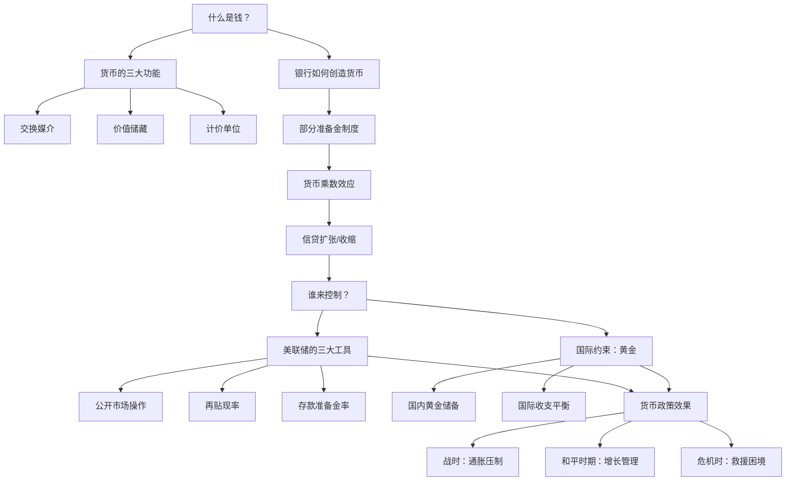
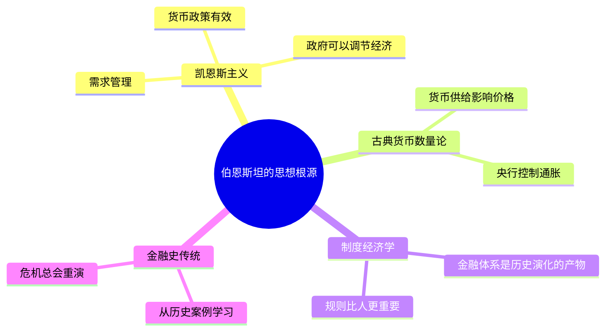

## 《伯恩斯坦金融三部曲3：金融简史》读书笔记
  
### 作者  
digoal  
  
### 日期  
2026-05-24  
  
### 标签  
读书笔记 , 伯恩斯坦金融三部曲3：金融简史   
  
----  
  
## 背景  
  
---
书名: 《伯恩斯坦金融三部曲3：金融简史》  
原著书名: A Primer on Money, Banking, and Gold  
作者: [美] 彼得·伯恩斯坦（Peter L. Bernstein）  
译者: 田唯 / 穆瑞年  
出版社: 中国人民大学出版社（湛庐文化·财富汇）  
出版年份: 2009（原版首版1965年，纪念版2008年）  
笔记日期: 2026-05-24  
豆瓣链接: https://book.douban.com/subject/4143532/  
标签: [货币银行学, 金融史, 美联储, 黄金, 货币政策, 伯恩斯坦]  
---

  
## ——一本写于1965年、今天依然刺骨的货币启蒙书  

> **一句话**：货币不是财富，而是组织经济活动的「语言」——这门语言一旦失控，整个社会都要付出代价。  
> **适合谁读**：想搞清楚「钱从哪来」「美联储到底在干什么」「黄金凭什么值钱」的普通读者；以及想找一本薄而硬的货币入门书的人。  
> **阅读难度**：⭐⭐⭐☆☆  
> **推荐指数**：⭐⭐⭐⭐☆  

---

## 一、时代坐标：一本写给「战后美国人」的货币课

1965年，美国正处于战后黄金时代最辉煌的尾声。道琼斯指数创新高，大学入学率节节上升，中产阶级开始涌入股市。但绝大多数美国人——包括大量受过教育的人——并不清楚一个最基础的问题：**口袋里的钱，是怎么来的？**

彼得·伯恩斯坦在那一年写下这本小书。他当时44岁，已在华尔街摸爬滚打二十多年：先是在纽约联邦储备银行做研究员，二战中在伦敦担任情报官员，战后继承父亲的投资顾问公司，既懂学院里的经济学理论，又见过市场里的真实博弈。

他写这本书的动机很简单，也很必要：**当时没有一本写给普通人的货币银行入门书**。教科书太厚，术语太多；报纸的金融版太肤浅，一遇到利率就打马虎眼。伯恩斯坦想填补这个空白——用一本251页的小书，把货币、银行、美联储和黄金的底层逻辑，讲得让任何人都能看懂。

原版出版于1965年，那是布雷顿森林体系即将走向终结前夕。彼时黄金依然锚定美元，美元依然是全球储备货币的绝对中心。书中伯恩斯坦花了相当大篇幅谈黄金的作用，读来有一种历史的讽刺感——因为就在他写完这本书后的六年，尼克松宣布关闭黄金窗口，布雷顿森林体系轰然倒塌。

2008年再版时，前美联储主席保罗·沃尔克为本书作序，他的评语意味深长：那个更简单的世界，已经一去不返了。

```
时间轴：这本书的「三个时刻」

1965 ──────── 初版：布雷顿森林体系下，黄金锚定美元
                     ↓ 6年后
1971 ──────── 尼克松关闭黄金窗口，书中大量分析「过时」
                     ↓ 37年后
2008 ──────── 金融危机爆发同年，纪念版重出
               沃尔克作序：「金融体系已复杂得超乎想象」
                     ↓ 1年后
2009 ──────── 伯恩斯坦辞世，享年90岁
```

---

## 二、核心命题：作者在说什么？

这本书表面是一本货币银行学入门，骨子里其实在回答三个根本问题。

### 命题一：货币是「有组织的信任」，不是印出来的纸

伯恩斯坦在第一章就抛出一个让人警醒的思想实验：**如果没有了钱，会发生什么？**

答案不是「大家回到以物易物」——而是整个社会的协作网络会崩溃。农民无法把粮食换成铁器，工厂无法支付工资，税收无法征收，国家无法运转。货币不是财富本身，而是**让财富可以流动的基础设施**。

更深的一层：货币的本质是信任。硬币、纸币、存款，本质都是「一种承诺」——社会承诺这张纸可以换到价值。这个承诺一旦崩溃（通货膨胀、银行挤兑、货币危机），财富就像潮水退去，什么都不剩。

### 命题二：银行「凭空创造」货币，但这并非魔术，而是系统性风险的来源

本书最精彩的部分在第二部分——解释商业银行如何创造货币。

伯恩斯坦用极简的方式讲清楚了「货币乘数」原理：你存入银行100元，银行留20元准备金，贷出80元；接受贷款的人再存入另一家银行，又贷出64元……如此循环，最初的100元可以在系统里「变出」数倍的存款货币。

这个机制的天才之处在于：它让经济能用比实际储蓄更多的钱运转，推动投资和增长。但它的危险之处也在于此：**整个系统建立在「大多数人不会同时取款」的假设上**。一旦恐慌发生，银行挤兑便是系统性崩溃。

> 央行最终决定全社会货币量：通过再贷款和再贴现扩大商业银行信贷规模，通过准备金率设定商业银行贷款上限，通过公开市场操作直接调节银行准备金。

### 命题三：黄金不是货币的「天然基础」，而是一种历史性约束

书的第四部分是黄金，这也是最具时代局限性的部分——但恰恰因此，最值得今天重新审视。

伯恩斯坦写作时，黄金还是国际货币体系的锚点。他分析了黄金为何能扮演这个角色：稀缺、不腐烂、不能无限生产、跨国界被普遍认可。但他也清醒地指出，黄金制约货币供给，在经济快速增长时会成为「枷锁」。

历史后来给出了答案：1971年金本位终结，但世界并没有崩溃。这究竟是证明了伯恩斯坦的担忧是多余的？还是意味着我们进入了一个更大的、更脆弱的信任游戏？这个问题至今争论不休。

---

## 三、论证地图：从基础出发，一层一层往上



**论证方式评价**：伯恩斯坦最大的长处是「类比能力」。他把复杂的货币机制翻译成日常生活的语言，既不失准确性，又让外行人真正能理解。比如他解释银行信贷创造时，会先从你我存款这个熟悉的场景入手，再逐步放大到整个银行体系。这种叙事技巧，后来成为他所有著作的标志。

**不足**：受制于时代，书中对通货膨胀的分析显得过于乐观，对金融创新（衍生品、影子银行）完全未能预见。保罗·沃尔克在序言中也承认：今天的金融体系复杂程度已远超伯恩斯坦写书时的想象。

---

## 四、前提假设与边界：这本书在哪里会失效？

**假设一：银行是金融体系的核心**

1965年确实如此。但今天的影子银行、货币市场基金、货币基金ETF已经创造了大量「准货币」，游走于美联储的监管视野之外。2008年金融危机的核心，恰恰是这些在传统银行体系之外运作的机构。

**假设二：中央银行能有效调控货币供给**

伯恩斯坦对美联储抱有相当的信心——这在凯恩斯主义盛行的60年代完全可以理解。但1970年代的滞胀告诉我们，货币政策面对供给侧冲击（石油危机）时，几乎束手无策。

**假设三：黄金是国际货币体系的自然锚点**

这是本书最大的「时代局限」。1971年金本位终结后，整个关于黄金的分析框架都需要重写。今天的国际货币体系是什么？依赖美元的信任，依赖地缘政治的力量，依赖IMF的协调——这比黄金锚定更复杂、也更脆弱。

**这本书的适用边界**：理解货币银行运作的底层机制，以及1965年之前的金融历史。进入1970年代之后的金融演变，需要配合其他读本补充。

---

## 五、思想谱系：伯恩斯坦站在谁的肩膀上？



伯恩斯坦是彻头彻尾的凯恩斯主义者，但他从不满足于停留在理论层面。他的独特之处在于**用历史学家的眼光看金融**——他相信，理解金融体系的最好方式，是追溯它的演化史。这与同时代的米尔顿·弗里德曼（货币主义）形成鲜明对照：弗里德曼信公式，伯恩斯坦信故事。

他的这本书直接影响了后来大量的「金融科普写作」传统——包括《货币战争》《大空头》等书的叙事方式，都能看到伯恩斯坦的影子：用叙事驱动分析，用故事承载逻辑。

---

## 六、我学到了什么？

读完这本书，我最强烈的感受是：**我们每天使用的货币体系，是一个精心维护的集体幻觉——但这个幻觉，是人类迄今最伟大的制度发明之一。**

**收获一：银行体系的脆弱性不是缺陷，而是设计权衡**

部分准备金制度创造了流动性，让经济能够超越真实储蓄的限制去扩张。但这个设计天然脆弱——它的运转依赖于「信任的连续性」。2008年金融危机让我亲历了这种脆弱的爆发：当雷曼兄弟倒下，整个全球信贷市场在数周内冻结。伯恩斯坦在1965年描述的机制，在2008年以极端的方式再次验证了自己。

**收获二：「货币的未来」永远是开放问题**

伯恩斯坦在结论章写下他对货币未来的展望，带着一种60年代知识分子特有的审慎乐观。但历史一次次证明，没有人能预测货币体系的走向——黄金的退场、美元的霸权、数字货币的崛起，每一次都超出了前人的想象。这让我对「专家预测」保持一种根本性的怀疑。

**收获三：基本面的重要性**

在金融衍生品泛滥、量化交易主导市场的今天，回到这本60年代的小书，反而产生了一种清醒感：货币是什么，银行在干什么，中央银行如何运作——这些「枯燥的基本面」，才是理解所有金融现象的地基。没有地基，摩天大楼不过是空中楼阁。

---

## 七、举一反三：这本书的框架，还能用在哪？

**1. 理解加密货币的本质**

比特币的支持者声称「去中心化的货币才是真正的自由」。但用伯恩斯坦的框架看：货币需要三大功能（交换媒介、价值储藏、计价单位），比特币在前两项勉强及格，在第三项（计价单位）几乎完全不及格——没有哪家企业用比特币来核算成本和利润。真正的货币革命，还没到来。

**2. 理解央行数字货币（CBDC）的意义**

当各国央行开始推出数字货币，本质上是把伯恩斯坦书里的「货币创造机制」重新改写：如果央行能直接向公众发放数字货币，商业银行的货币创造功能就会被大大削弱。这不只是技术变革，而是整个金融体系权力结构的重组。

**3. 分析任何国家的货币危机**

土耳其里拉崩溃、阿根廷比索危机、津巴布韦恶性通胀——这些现象背后，都可以用伯恩斯坦的框架来分析：政府的货币供给失控，信任崩溃，货币失去其作为「组织经济活动语言」的功能。理解机制，就能理解危机的逻辑。

---

## 八、批判与反思

**时代局限不可回避**

这是1965年写就的书，黄金章节在1971年后即已部分「过时」。保罗·沃尔克的序言写得诚实：「那个更简单的世界已经不再存在。」今天读这本书，需要时刻记住：金融衍生品、影子银行、量化宽松、负利率……书里通通没有。

**对美联储过于乐观**

伯恩斯坦行文中对美联储的信任，带着60年代知识精英对「专家治理」的普遍乐观。但1970年代的滞胀、2008年的金融危机、2020年代的通胀——每一次都证明央行的能力有边界，有时是相当硬的边界。中央银行不是神，而是在巨大不确定性中摸索的人类机构。

**缺乏对金融不平等的关注**

这是伯恩斯坦这一代金融经济学家的共同盲区：书里完全没有谈货币体系如何影响财富分配。货币宽松的受益者是资产持有者，受损者往往是储蓄者和低收入群体——这个视角在整本书中几乎缺席。今天，这已经是金融讨论中最核心的政治议题之一。

---

## 九、金句与记忆点

**1. 「如果没有了钱……」**
第一章的思想实验永远有效：一旦你真正想象货币消失后的世界，就会明白货币不是「可有可无的方便」，而是现代文明的基础设施。

**2. 「货币不是财富，而是财富流动的媒介」**
区分「货币」和「财富」，是理解通货膨胀、金融危机的第一步。印钱不创造财富，只改变财富的分配方式。

**3. 「银行贷出去的钱，比它收进来的钱更多」**
货币乘数效应——这个反直觉的事实，是理解现代金融体系运作最重要的一块砖。

**4. 「中央银行是最后贷款人」**
美联储存在的根本意义：防止信心崩溃引发系统性危机。但「最后贷款人」的角色，也意味着道德风险——有人会因此更愿意冒险。

**5. 「黄金的力量来自于大家都相信它有力量」**
这句话的有趣之处在于：把「黄金」换成「美元」「比特币」，同样成立。货币的价值，最终都来自集体信任。

**6. 「货币政策不是万能药」**
伯恩斯坦通过战时和战后的货币政策史告诉读者：货币政策有效，但有边界。对供给侧问题（供应链中断、生产率下降），货币政策基本无力。

**7. 「物价未上涨，而人均收入上涨，才是真正地变得富裕」**
区分名义财富增长和实际财富增长，是理解通货膨胀最简洁的方式。

---

## 十、延伸阅读

**1. 《与天为敌》（Against the Gods）——彼得·伯恩斯坦**
伯恩斯坦最著名的作品，讲人类如何学会认识和管理风险。与《金融简史》互为补充，共同构成他对金融世界的完整观察。

**2. 《货币野史》——德斯蒙德·劳曼**
聚焦货币制度的演变史，特别是布雷顿森林体系的建立与终结，可以和《金融简史》的黄金章节对照阅读。

**3. 《这次不一样》（This Time Is Different）——莱因哈特、罗格夫**
用800年数据研究金融危机，证明「这次不一样」永远是幻觉。是伯恩斯坦货币史视角的当代延伸。

**4. 《伯南克回忆录》（The Courage to Act）——本·伯南克**
2008年金融危机的亲历者叙述。读完伯恩斯坦的货币机制论，再读伯南克如何在机制崩溃时操盘，有非常强烈的对照感。

**5. 《21世纪资本论》——托马斯·皮凯蒂**
补充伯恩斯坦几乎完全缺席的视角：货币体系与财富不平等的关系。两本书加在一起，才是相对完整的金融世界图景。

---

*笔记写于 2026-05-24 | 基于公开资料、原著结构与深度思考整理*
*原著首版1965年，纪念版2008年 | 中文版2009年出版*
  
  
#### [PostgreSQL 解决方案集合](../201706/20170601_02.md "40cff096e9ed7122c512b35d8561d9c8")
  
  
#### [德哥 / digoal's Github - 公益是一辈子的事.](https://github.com/digoal/blog/blob/master/README.md "22709685feb7cab07d30f30387f0a9ae")
  
  
#### [About 德哥](https://github.com/digoal/blog/blob/master/me/readme.md "a37735981e7704886ffd590565582dd0")
  
  

  
