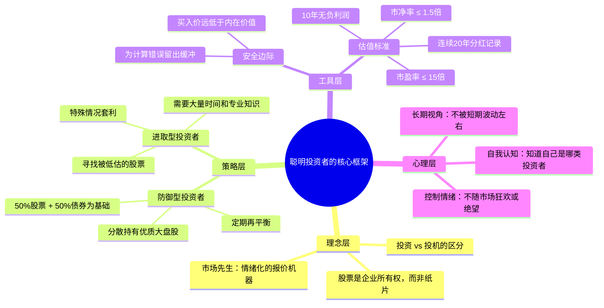

## 《聪明的投资者》读书笔记
  
### 作者  
digoal  
  
### 日期  
2026-05-24  
  
### 标签  
读书笔记 , 聪明的投资者   
  
----  
  
## 背景  
  
---
书名: 《聪明的投资者》（第4版注疏点评版）  
作者: 本杰明·格雷厄姆（[美]）/ 贾森·兹威格（注疏）  
出版年份: 1949（原著）/ 1973（第4版）/ 2016（此译本）  
笔记日期: 2026-05-24  
豆瓣链接: https://m.douban.com/book/subject/26752026/  
豆瓣评分: 9.1  
标签: [价值投资, 投资哲学, 个人理财, 行为金融, 经典著作]  
---

  

> **一句话**：在市场的喧嚣中保持清醒，用安全边际对抗不确定性——这不只是投资方法，更是一种理性的人生哲学。  
> **适合谁读**：想在股市中长期生存的普通人；被市场情绪反复收割的"老韭菜"；以及任何想搞懂"投资"和"投机"区别的人。  
> **阅读难度**：⭐⭐⭐☆☆（原著部分稍显年代感，兹威格的注疏大幅降低了理解难度）  
> **推荐指数**：⭐⭐⭐⭐⭐  

---

## 一、时代坐标：这本书从哪里来？

1929年，美国股市崩盘，格雷厄姆几乎倾家荡产。他亲眼目睹了人类贪婪与恐惧的极端面貌——人们在狂欢中失去理性，在崩溃后万念俱灰。这场浩劫没有击垮他，反而成为他用一生去追问的问题：**投资究竟应该怎么做才是对的？**

1934年，他和多德合著《证券分析》，奠定了证券分析学的基础。1949年，《聪明的投资者》出版，这是一本专为**普通个人投资者**所写的书——不是给专业分析师看的，而是给那些在市场中摸爬滚打、容易被情绪左右的普通人看的。

格雷厄姆写这本书的时代背景，与今天惊人地相似：股市泡沫与崩溃交替出现，散户屡遭套牢，"消息"满天飞，真假难辨。他想给普通人一套**朴素但稳固的投资框架**，让他们不依赖内幕消息、不追逐市场热点，也能在市场的长河中活下来、赚到钱。

到了2003年，贾森·兹威格在保留格雷厄姆1973年第4版全部原文的基础上，加入大量注疏和章后点评，结合互联网泡沫破灭（1999–2002年）的惨烈教训，把格雷厄姆的思想与新时代对话。这个版本，是对经典最好的致敬——原著是骨架，注疏是血肉。

```
时间轴：
1929 ──── 格雷厄姆股市惨败，开始反思
1934 ──── 《证券分析》问世，价值投资诞生
1949 ──── 《聪明的投资者》首版，面向大众
1973 ──── 第4版修订，成为最终经典版本
2000 ──── 互联网泡沫破灭，格雷厄姆被重新"发现"
2003 ──── 兹威格注疏版出版
2016 ──── 中文注疏点评版发行
```

---

## 二、核心命题：作者在说什么？

### 命题一：投资与投机，是两种完全不同的游戏

格雷厄姆给出了一个至今无人超越的定义：**"投资是以深入分析为基础，确保本金安全，并获得适当回报的操作。不符合这些条件的，就是投机。"**

这个定义冰冷、务实，甚至有些不近人情。它的意思是：大多数人以为自己在"投资"，其实只是在"投机"——他们没有做分析，也没有保住本金的意识，他们只是在赌价格会涨。

这个区分很重要，因为它决定了你的心态。投机者问的是"这只股票会不会涨"，投资者问的是"这家公司值多少钱"。前者在赌，后者在买生意。

### 命题二：安全边际——买便宜货，才有犯错的资本

这是全书的灵魂，也是格雷厄姆留给后人最核心的武器：**以远低于内在价值的价格买入，这中间的差价就是你的"安全边际"。**

安全边际的本质是**对自己不够聪明的承认**。没有人能精确计算一家公司的内在价值，没有人能预测未来——但如果你买入价格足够低，即使你的判断有偏差，也还有足够的缓冲空间不亏大钱。

这是一种防御性的智慧：不是寻求最大利润，而是首先确保不犯大错。

### 命题三：市场先生——把波动当朋友，而不是向导

格雷厄姆用一个绝妙的比喻来描述股票市场：假设你有一个生意伙伴叫"市场先生"，他每天都来敲门，报出一个买卖价格。有时他非常乐观，开价离谱地高；有时他又极度悲观，甚至愿意把股份贱卖给你。

**你完全没有义务接受他的报价。** 如果价格不合理，就不理他。只有当他报价极低（远低于你对公司的判断）时，你才出手买入；当他报价极高时，你才考虑卖出。

这个比喻的价值在于：它把市场从"权威"变成了"情绪化的生意伙伴"。市场的涨跌不再是你应该崇拜或恐惧的神谕，而只是一个为你提供买卖机会的价格展示板。

---

## 三、论证地图：格雷厄姆怎么说服你的？



格雷厄姆的论证方式是典型的**历史归纳法**：他用1920–1970年间五十年的美国股市数据，反复验证同一个结论——买便宜的好公司，等待市场回归理性，长期下来优于投机。

兹威格的注疏则用1999–2002年互联网泡沫的惨败案例，进一步证明格雷厄姆的逻辑跨越时代依然成立。历史一再重演，只是演员换了。

---

## 四、前提假设与边界：什么情况下这不成立？

格雷厄姆的体系建立在几个关键假设上，有必要认真审视：

**假设一：市场长期是有效的，短期是无效的**
格雷厄姆相信价格终将回归价值，只是时间问题。这个假设在成熟市场基本成立，但在以散户为主、政策影响巨大的A股市场，"回归"的时间可以拉得非常长，长到让持有者失去耐心或资金。

**假设二：内在价值是可计算的**
格雷厄姆给出了具体的估值公式和标准（PE不超过15倍，PB不超过1.5倍等），但这些数字产生于1970年代以前的美国市场环境。在今天轻资产的科技公司面前，这套量化标准几乎完全失效——按他的标准，苹果、腾讯在早期都该被排除在外。

**假设三：投资者有足够的理性和耐心**
格雷厄姆的策略在理论上近乎完美，但需要一种极其罕见的心理素质：在市场暴跌时不恐慌，在市场暴涨时不贪婪，在长期横盘时不厌倦。人性决定了绝大多数人做不到这一点，包括读完这本书的人。

**边界总结**：格雷厄姆的方法最适合**成熟市场中的价值股**，对成长股、新兴市场、高波动资产的适用性有限。此外，他的量化标准需要随时代调整，不可生搬硬套。

---

## 五、思想谱系：这本书在哪个传统里？

```
道氏理论（技术分析）←→ 格雷厄姆（基本面/价值投资）← 哥伦比亚商学院传统
         ↓
  沃伦·巴菲特（价值+成长，集中持股）
         ↓
  查理·芒格（好公司比便宜货更重要）
         ↓
  赛思·卡拉曼（《安全边际》，更极端的价值主义）
         ↓
  现代价值投资者（芒格、霍华德·马克斯等）
```

格雷厄姆处于**现代投资学的源头**。他之前，华尔街没有"分析"，只有消息和直觉。他之后，基本面分析成为标准。

有趣的是，他最著名的学生巴菲特后来超越了他：格雷厄姆只买"便宜货"（哪怕公司质量一般），巴菲特则愿意以合理价格买"伟大公司"。这是芒格的影响，也是格雷厄姆体系进化的方向。

---

## 六、我学到了什么？

读这本书有一种奇特的体验：道理你都懂，但你知道自己做不到。

**收获一：投资首先是一门"不亏钱"的学问**

格雷厄姆反复强调"本金安全"优先于"获取高收益"。这和大多数人的直觉相反——进入市场，人们首先想的是"怎么赚更多"，而不是"怎么不亏"。但事实是，避免大亏损对最终财富积累的贡献，往往大于追求高收益。一个亏了50%的账户，需要涨100%才能回本。

**收获二："市场先生"这个比喻改变了我对市场的看法**

把每天的股价涨跌看作一个情绪化的疯子在报价，而不是市场对公司价值的精确判断——这个思维框架一旦建立，你就很难再被日常波动所绑架。它把本该焦虑的事变成了"观察情绪的游戏"。

**收获三：聪明不等于投资成功，情绪控制才是护城河**

格雷厄姆引用牛顿投资南海泡沫的故事：这位发现万有引力的天才在泡沫初期赚了钱，卖出，然后眼看股价继续暴涨，忍不住重仓杀回，最终亏损惨重。牛顿事后说："我能计算天体的运动，却无法计算人类的疯狂。" 高智商与投资智慧是两回事，这一点，格雷厄姆说得比任何人都清楚。

---

## 七、举一反三：安全边际的迁移

格雷厄姆的"安全边际"思想远不止于股票投资，它是一种通用的**风险管理哲学**：

- **职业选择**：不要只看最好的情况，要问"如果最坏的情况发生，我还能不能活着"。留有余地的职业规划比全押一个赛道更有韧性。
- **工程设计**：桥梁承重设计留出三倍安全系数，不是工程师懦弱，而是对不确定性的尊重。
- **个人财务**：在能力范围内消费，保留足够的流动性储备，是"安全边际"在生活中的直接应用。

核心逻辑都是一样的：**为自己的错误预留空间，比追求完美的精确更重要。**

---

## 八、批判与反思

这本书有些地方，我读完并不完全认同。

**格雷厄姆对"成长性"关注不足。** 他的估值框架高度依赖历史数据（过去10年利润、过去20年分红），但历史表现最好的投资——苹果、谷歌、腾讯——在早期都不满足他的标准。一味追求"便宜"，可能错过那些改变世界的公司。巴菲特和芒格对此做出了修正，但格雷厄姆本人从未彻底更新。

**他低估了信息不对称问题。** 格雷厄姆生活的年代，普通投资者获取公司财务信息是很困难的，他的方法是在"信息稀缺"环境下设计的。今天信息极度充裕，但同时也充满噪音和造假——他的框架需要配合现代的信息甄别能力才能使用。

**对新兴市场，他的定量标准需要大量调整。** A股的PE中枢、行业结构、政策影响机制与美股完全不同。直接套用他的"PE不超过15倍、PB不超过1.5倍"，在某些时期会错过整个市场。

---

## 九、金句与记忆点

1. **"投资是以深入分析为基础，确保本金安全，并获得适当回报的操作。"**
   ——定义清晰到残忍。你对照一下自己，大多数操作都是投机。

2. **"安全边际永远取决于你付出的价格。"**
   ——不是公司好不好，是你买贵了没有。同一家公司，价格不同，风险天壤之别。

3. **"聪明的投资者绝不能只靠过去的推测来预测未来。"**
   ——"过去涨了很多"不是买入的理由，"过去跌了很多"也不是卖出的理由。

4. **"股票市场未来看起来越糟，其结果通常会越好。"**
   ——逆向思维的经典表达。悲观预期已被充分定价，乐观的空间反而更大。

5. **"你付出的价格越高，你的回报就越少。"**
   ——不管是买股票还是买房子，这句话永远成立。

6. **"我能计算天体的运动，却无法计算人类的疯狂。"（牛顿语，格雷厄姆引用）**
   ——投资中，情商比智商更重要。这是对所有"聪明人"的警告。

7. **"投机本身并非违法，也无关道德——只是对大多数人来说，无法充实你的荷包。"**
   ——格雷厄姆不是在道德上谴责投机，而是在逻辑上指出它不划算。这种冷静让人佩服。

---

## 十、延伸阅读

1. **《证券分析》（格雷厄姆 & 多德）**
   《聪明的投资者》的"学术版"，更系统、更深入，适合进阶。如果觉得《聪明的投资者》意犹未尽，这是下一站。

2. **《安全边际》（赛思·卡拉曼）**
   把格雷厄姆的安全边际理念发扬到极致的现代版本，被誉为"价值投资者的圣经"，绝版已久，流传甚广。

3. **《穷查理宝典》（芒格）**
   格雷厄姆体系的进化版。芒格引入了"护城河"和"优质公司"的概念，是对格雷厄姆"只买便宜货"策略的重要修正。

4. **《非理性繁荣》（罗伯特·希勒）**
   从行为经济学视角解释格雷厄姆所描述的市场疯狂从何而来，是理解"市场先生"心理基础的最佳读本。

5. **《投资最重要的事》（霍华德·马克斯）**
   当代价值投资大师对格雷厄姆思想的继承与发展，语言更现代，对当代市场的洞察更直接。

---

*笔记写于 2026-05-24 | 基于公开资料与深度思考整理*
*本书评不构成投资建议，市场有风险，入市需谨慎。*
  
  
#### [PostgreSQL 解决方案集合](../201706/20170601_02.md "40cff096e9ed7122c512b35d8561d9c8")
  
  
#### [德哥 / digoal's Github - 公益是一辈子的事.](https://github.com/digoal/blog/blob/master/README.md "22709685feb7cab07d30f30387f0a9ae")
  
  
#### [About 德哥](https://github.com/digoal/blog/blob/master/me/readme.md "a37735981e7704886ffd590565582dd0")
  
  

  
