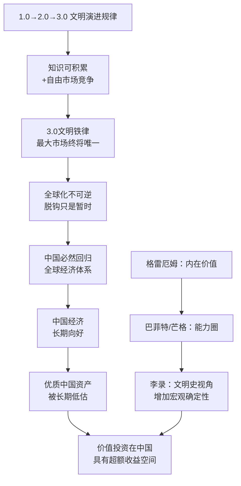

## 《文明、现代化、价值投资与中国》读书笔记
  
### 作者  
digoal  
  
### 日期  
2026-05-24  
  
### 标签  
读书笔记 , 文明、现代化、价值投资与中国   
  
----  
  
## 背景  
  
---
书名: 《文明、现代化、价值投资与中国（增订版）》  
作者: 李录  
出版年份: 2025年3月  
出版社: 中信出版社 · 芒格书院  
笔记日期: 2026-05-24  
豆瓣链接: https://book.douban.com/subject/37348724/  
豆瓣评分: 8.1（初版）  
标签: [价值投资, 文明史, 现代化理论, 中国经济, 芒格, 喜马拉雅资本]  
---

  

> **一句话**：一个从唐山穿越天安门事件、流亡美国的少年，用三十年投资实践反推出了一套文明演进的大叙事——这本书既是他的世界观说明书，也是一封写给中国的长信。  
>  
> **适合谁读**：想理解中国经济底层逻辑的投资人；对现代化路径有困惑的思考者；价值投资信奉者；以及任何在中美博弈中找不到坐标的人。  
>  
> **阅读难度**：⭐⭐⭐☆☆  
>  
> **推荐指数**：⭐⭐⭐⭐☆  

---

## 一、时代坐标：这本书从哪里来？

2020年，一场疫情把全球化拉进了最严峻的考场。中美脱钩的讨论甚嚣尘上，价值投资者们在中国市场的信心开始动摇。就在这个节点，李录出版了这本文集的初版，五年内加印24次，销量近30万册——对于一本讲文明史和投资哲学的严肃读物而言，这个成绩出乎意料。

2025年增订版的出版，背景更为复杂：芒格刚刚去世（2023年11月，享年99岁），DeepSeek横空出世引发AI大讨论，中国经济陷入通缩与地产危机的双重压力，特朗普关税战的阴影又一次笼罩。李录在增订版中正面回应这些困惑：新增了2024年12月在北大光华管理学院的演讲实录《全球价值投资与时代》、芒格去世一周年专访，以及《论常识》。

李录是谁？简要说：1966年生于唐山，经历过唐山大地震，亲历1989年天安门事件后流亡美国，在哥伦比亚大学同时拿到经济学学士、MBA和法学博士三个学位，1997年创立喜马拉雅资本。2003年感恩节，他与查理·芒格长谈四五小时，此后成为芒格家族资产的唯一外部管理人。芒格在2019年的股东大会上说：**"我已经找到了李录，用不着找别人了。"**

这本书不是一个投资人的回忆录，也不是方法论教科书。它的雄心更大——李录试图用文明史的宏观框架，为中国的现代化前途做出判断，进而为价值投资在中国的可行性提供理论基础。

---

## 二、核心命题：作者在说什么？

本书有三个相互咬合的核心命题：

### 命题一：文明演进遵循三阶段规律，现代化是不可逆的历史铁律

李录借鉴贾雷德·戴蒙德（《枪炮、病菌与钢铁》）和伊恩·莫里斯的研究框架，将人类文明划分为：

- **1.0文明**：采集狩猎时代，人均能量消耗极低，受制于自然
- **2.0文明**：农业畜牧时代，可以积累财富，但受制于土地的边际报酬递减，存在天花板
- **3.0文明**：现代科技文明，其本质是"**现代科技 × 自由市场经济 = 经济无限累进增长**"

关键洞见在于：商品交换产生"1+1>2"的增量；而知识和思想的交换产生"1+1>4"的效应——双方不仅保留了自己的思想，还碰撞出新思想。知识的可积累性叠加自由市场的竞争机制，创造了近乎无限的经济增长潜能。

从这个推论自然生出**"3.0文明铁律"**：在相互竞争的市场中，最大的市场进化速度最快，并最终成为唯一的市场。任何国家一旦脱离这个全球市场，就会加速落后，直至被迫重新加入。闭关锁国是饮鸩止渴。这个铁律，李录认为是可以被历史反复验证的客观规律，而非价值判断。

### 命题二：中国正处于2.5阶段，跨越中等收入陷阱是历史必然，路径因人而异

在他的框架里，从2.0文明向3.0文明的过渡存在一个"2.5盘整阶段"。德国、日本、韩国成功跨越了；南美和部分东南亚国家至今还困在中等收入陷阱里。

中国今天正经历的种种困惑——产能过剩、内卷、房地产危机、贫富分化——在他看来都是这个盘整期的普遍症状，而非中国特有的病理。他对中国的预判是审慎乐观的：基于3.0文明铁律，中国没有能力和意愿永久退出全球市场，经济逻辑最终会推着它走向更加开放的方向。

他同时指出，在新的3.0文明时代，人类历史上从未有过两个同等量级的文明大国并存的经验——中美之间的关系没有历史先例可循，但核武器的相互确保毁灭（MAD）机制和3.0文明铁律，共同约束着大规模冲突的可能性。

### 命题三：价值投资是理性在资本市场的应用，在中国尤具空间

李录是格雷厄姆（内在价值理论创立者）→ 巴菲特/芒格（能力圈理论）这一价值投资谱系的第三代传人。他的核心贡献在于把文明史和价值投资打通：正是因为相信3.0文明不可逆，相信中国会持续融入全球经济，他才敢长期持有中国优质资产。

他对中国市场的判断有一种反直觉的自信：中国A股市场散户比例高，噪音大，导致优质公司的定价长期偏离内在价值——这恰恰是价值投资者的机会窗口。

他一再强调价值投资的底层要求：**知识上的绝对诚实**。不能骗自己，严守能力圈边界，只做真正理解的投资。这不是谦虚，是生存法则。

---

## 三、论证地图：从文明史到投资决策



**关键论证节点评析：**

李录的论证有一个最漂亮的地方：他用历史实证驳斥了"华盛顿共识"。英国工业革命的历史表明，自由市场本身是"昂贵的公共品"，需要强政府主导建设，民主法治是工业化的**结果**而非**前提**。这个颠覆性判断，为观察中国的经济实践提供了不同的解读框架，也解释了西方为何长期误判中国。

他援引的数据和案例涵盖跨度长达数万年的人类历史，气魄宏大。但正是这种宏大，也带来了相应的论证风险（后文批判部分详谈）。

---

## 四、前提假设与边界：什么情况下这不成立？

**假设一：3.0文明铁律具有普适性和不可逆性**

李录的整个框架建立在"市场竞争会确保最优体系胜出"的假设上。但历史中存在大量反例：前苏联维持了70年，中世纪欧洲封建割据持续数百年。短期来看，政治意志、国家安全逻辑、民粹主义都可以覆盖经济理性。所谓"铁律"在时间尺度上可能是百年级别的，对于投资者而言，这个时间跨度有时并不实用。

**假设二：中国会持续推进市场化改革**

他的乐观预判依赖中国政策的内在约束。然而，2020年以来监管对互联网行业的整治、地产行业的大调整、资本市场的反复波动，都说明政策的不确定性始终是一个变量。他的框架更多是结构性判断，对短中期的政策周期给出的解释空间有限。

**假设三：价值投资的"知识诚实"可以被绝大多数人习得**

他讲的价值投资方法论，在认知上要求极高——你需要比公司管理层更了解那家公司。这个门槛决定了这套方法对普通投资者而言更多是精神指引，而非可操作的操作手册。

---

## 五、思想谱系：这本书站在哪里？

```
[宏观历史]
贾雷德·戴蒙德《枪炮、病菌与钢铁》
伊恩·莫里斯《西方将主宰多久》
       ↓
   李录：文明三阶段框架
       +
[价值投资]
本杰明·格雷厄姆（内在价值创始人）
       ↓
巴菲特 + 查理·芒格（能力圈、护城河）
       ↓
   李录：第三代——加入文明史的宏观叙事
       ↓
   得出：在中国做价值投资的理论依据
```

李录的独特性在于他是极少数能把宏观文明史与微观投资决策真正打通的实践者。芒格的"普世智慧"是跨学科的，李录则将这种跨学科扩展到了历史哲学层面。

他的思想最接近"历史决定论"与"市场信仰"的混合体——相信历史有规律，相信规律最终会胜过短期噪音。这与索罗斯的"反身性"理论形成对照：索罗斯强调市场会偏离基本面并自我强化；李录则相信市场长期会回归理性均衡。

---

## 六、我学到了什么？

**收获一：用文明史的尺子量经济现象**

李录给了我一个新的思维工具：当我们被每天的经济数据和政策噪音淹没时，不妨退后几步，问自己"这是哪个文明阶段的问题？"中国今天的内卷、房价下行、消费不振，放到2.5阶段的历史语境里，反而变得可理解——这不是中国特有的病，而是所有现代化国家都走过的路。

**收获二：价值投资的本质是认知套利**

李录说，市场是发现你身上弱点的机制。这句话比任何投资教科书都更深刻。真正的价值投资不是找到被低估的股票，而是诚实地知道自己什么时候真的懂，什么时候只是以为自己懂。"能力圈"的本质是认知边界管理，而大多数亏损来自不知道自己不知道。

**收获三：结构乐观 vs. 情绪悲观**

李录身上有一种特质：无论外部环境多么嘈杂，他的判断始终基于结构性逻辑而非情绪反应。增订版在中美关系最紧张、中国经济预期最差的时候出版，他仍然对中国持审慎乐观态度——不是盲目的爱国情怀，而是基于对历史规律的判断。这种定力，本身就是一种投资素养。

---

## 七、举一反三：这个框架还能用在哪？

**场景一：判断一个行业是否值得长期投入**

3.0文明铁律的核心是"网络效应叠加知识累积"。这个逻辑同样适用于企业判断：一家公司是否具备"越大越强"的飞轮结构？它的壁垒是否来自于知识的积累和网络效应，而非单纯的资本壁垒？

**场景二：理解地缘政治的中长期走向**

李录对中美关系的判断——核威慑 + 3.0文明铁律 + 共同面临的全球挑战（气候变化等），共同约束大规模冲突——是一个可以检验的预测框架。每一次中美摩擦升级时，问自己：这次是否触动了这三个约束条件？

**场景三：个人学习的优先级**

他对"知识诚实"的强调，可以直接用于自我管理：定期清点自己真正理解的领域，对于只是"听说过"的领域保持谦逊，拒绝在能力圈之外发表强烈观点。

---

## 八、批判与反思

**批评一：文明史部分的学术严谨性不足**

豆瓣上不少读者（包括具有历史学背景的）指出，上篇的历史论述存在过度简化、与引用原著出入较大的问题。李录的强项是投资，不是史学。他引用了大量二手文献，却未能充分呈现学界的争议。这让上篇更像一篇论述严密的散文，而非真正的学术研究。

**批评二：对全球化的判断在2025年面临更大考验**

3.0文明铁律预言全球化不可逆，但特朗普的关税战、供应链重构、"去风险化"浪潮让这个铁律在短中期遭遇了空前挑战。李录的回应是"历史尺度够长的话，铁律终究会胜出"——这话从逻辑上无法证伪，但也正因如此，对于10年以内的投资决策帮助有限。

**批评三：这是一本立场先行的文集，而非价值中立的分析**

李录是一个重仓中国的投资人。他对中国未来的乐观判断，在某种程度上也是在为自己的持仓立言。这并不代表他的判断是错的，但读者应该意识到：这本书更像是一位身处其中的参与者的世界观表达，而非第三方观察者的客观分析。

**批评四：下篇结构较为松散**

多篇演讲的合集缺乏系统性。期待看到一套完整投资体系的读者可能会感到失望——书中有价值的洞见星星点点，但没有形成一个易于操作的投资框架。

---

## 九、金句与记忆点

1. **"现代化的本质，是现代科技与市场经济相结合时所产生的经济无限累进增长的现象。"**
   ——这是全书最核心的定义，简洁却有力。用一句话解释了过去200年为什么是人类历史上最特殊的200年。

2. **"知识和思想的交换，产生1+1>4的效应。"**
   ——交换商品，双方分享增量；交换思想，双方还额外创造新思想。这解释了为什么开放社会在知识生产上永远更有优势。

3. **"自由市场，其实既不自由也不免费，而是一个非常昂贵的公共品。"**
   ——颠覆了很多人对"自由市场"的天真理解。市场需要法律体系、基础设施、信用体系的支撑，这些都要钱，都要强政府。

4. **"市场本身就是发现你身上弱点的机制。你身上但凡有一点点不明白的地方，一定会在某一个状态下被无限放大。"**
   ——这是对价值投资"知识诚实"要求最精准的阐述。市场的残酷在于它的公正：你骗不了它。

5. **"凡是把圈画得超过自己能力的人，最终一定会在某一个市场环境下把他自己彻底毁掉。"**
   ——能力圈不是限制，是保命符。大多数投资失败，不是因为判断错了，而是因为在不懂的地方做了判断。

6. **"中国今天正处于2.5阶段——这不是中国特有的病，而是所有现代化国家都走过的路。"**
   ——这句话的价值在于祛魅：把对中国现状的焦虑，从"中国是不是特别糟糕"换成了"中国走到了哪一步"。视角的转换，带来完全不同的情绪底色。

7. **"真知即是意义。"**（自序标题）
   ——这四个字是全书的精神内核。知识不是工具，是目的本身；诚实不是策略，是存在方式。

---

## 十、延伸阅读

1. **《穷查理宝典》查理·芒格**
   李录引荐到国内并为之作序的书。芒格的多元思维模型是理解李录投资框架的基础，是本书的思想母体。

2. **《枪炮、病菌与钢铁》贾雷德·戴蒙德**
   李录文明史框架的重要参考来源。如果你对上篇的宏观叙事有兴趣，这本书的历史考证更为扎实。

3. **《当下的启蒙》史蒂芬·平克**
   与李录的文明乐观主义高度共鸣。平克用数据论证现代文明正在让人类变得更好，可以与本书对读。

4. **《投资最重要的事》霍华德·马克斯**
   价值投资实践者的另一本思想文集，风格与李录最为接近——都是以文字梳理自己的投资哲学，两本书放在一起读，能看出价值投资圈内不同的侧重点。

5. **《历史的终结与最后的人》福山**
   与李录的3.0文明铁律有对话关系，但结论路径不同。福山的"历史终结论"在后冷战时代遭到挑战，如何回应这些挑战，是理解全球化与现代化争论的重要背景。

---

*笔记写于 2026-05-24 | 基于公开资料、增订版序言及多篇演讲实录整理*
*增订版新增内容：《全球价值投资与时代》（2024北大光华演讲）、芒格去世一周年专访、《论常识》*
   
  
#### [PostgreSQL 解决方案集合](../201706/20170601_02.md "40cff096e9ed7122c512b35d8561d9c8")
  
  
#### [德哥 / digoal's Github - 公益是一辈子的事.](https://github.com/digoal/blog/blob/master/README.md "22709685feb7cab07d30f30387f0a9ae")
  
  
#### [About 德哥](https://github.com/digoal/blog/blob/master/me/readme.md "a37735981e7704886ffd590565582dd0")
  
  

  
