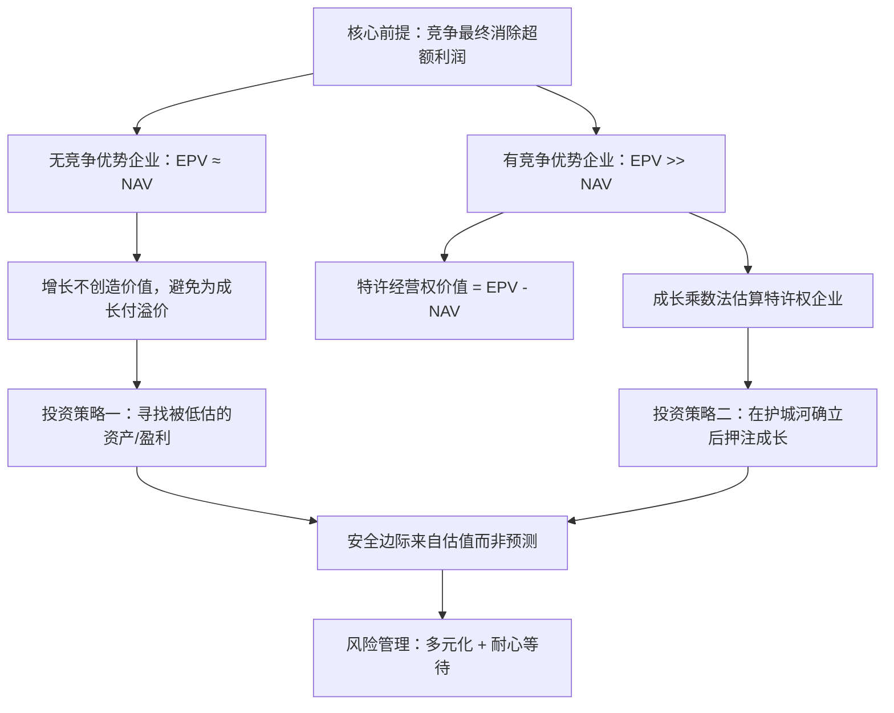

## 《价值投资：从格雷厄姆到巴菲特》读书笔记
  
### 作者  
digoal  
  
### 日期  
2026-05-24  
  
### 标签  
读书笔记 , 价值投资：从格雷厄姆到巴菲特   
  
----  
  
## 背景  
  
  
---
书名: 《价值投资：从格雷厄姆到巴菲特（第2版）》  
作者: 布鲁斯·C.格林沃尔德 等  
出版年份: 2024（中文版）/ 2021（英文第2版）  
笔记日期: 2026-05-24  
豆瓣链接: https://book.douban.com/subject/36955258/  
豆瓣评分: 9.6  
标签: [价值投资, 证券分析, 估值, 格雷厄姆, 巴菲特, 哥伦比亚商学院]  
---

  

> **一句话**：这不是一本讲"买便宜股票"的书，而是一套完整的认识论——教你在不确定中找到确定性。  
> **适合谁读**：有一定财务基础、希望系统建立投资框架的人；讨厌DCF玄学的理工科投资者；想从"听消息炒股"进化到"独立估值"的普通投资者  
> **阅读难度**：⭐⭐⭐⭐☆（需要一定财务和经济学基础）  
> **推荐指数**：⭐⭐⭐⭐⭐  

---

## 一、时代坐标：这本书从哪里来？

1934年，本杰明·格雷厄姆和戴维·多德在哥伦比亚大学完成了《证券分析》——这是价值投资的创世纪。

第一版的这本书问世于2001年，彼时互联网泡沫刚刚破裂，成长股神话崩塌，市场重新开始认真讨论"公司到底值多少钱"这个问题。格林沃尔德在哥伦比亚商学院主讲的价值投资课程已声名大噪，被《纽约时报》称为"华尔街大师的宗师"，他的学生遍布各大顶级基金。

第二版于2021年出版（中文版2024年落地），此时又是另一番天地：过去二十年，以苹果、谷歌、亚马逊为代表的科技巨头横扫市场，传统价值投资者错过了史上最大的一轮财富增值，"价值投资已死"的声音不绝于耳。格林沃尔德团队不得不正面回答：这套诞生于工业时代的框架，如何面对一个轻资产、高成长的数字经济世界？

第二版最重要的更新就是：**正面接受挑战，新增了两章专门处理成长股估值问题**，并对风险管理做了大幅扩展。这是一次诚实的自我迭代，而非固守门派。

```
时间轴：

1934 ──────── 2001 ──────────── 2021 ────── 2024
  格雷厄姆        第1版问世           第2版         中文版
  《证券分析》    (互联网泡沫后)    (科技股十年后)
```

---

## 二、核心命题：作者在说什么？

### 命题一：价值估算有三个层次，越往后越不可靠

格林沃尔德构建了一个"可靠性递减"的估值金字塔：

**第一层 — 资产价值（Asset Value, NAV）**
公司今天如果被清算或复制，值多少钱？这是最硬的估值，依赖资产负债表，确定性最高。适用场景：传统制造业、资产密集型企业。

**第二层 — 盈利能力价值（Earnings Power Value, EPV）**
假设公司维持当前盈利水平永续经营，且增长率为零，折现后值多少？公式简洁：**EPV = 调整后当期收益 ÷ 资本成本**。关键词是"当期"和"零增长"——你不需要预测未来，只需要判断现在的盈利是否可持续。

**第三层 — 成长价值**
如果公司拥有可持续的竞争优势，未来的成长才会真正创造价值（而不是销毁价值）。但这个层次需要最多的判断力，也最容易出错。

这三层结构的洞见在于：**大多数人直接跳到第三层**，对着DCF模型调参数，而格林沃尔德说，如果你连第一层和第二层都搞不清楚，第三层只是在放大你的无知。

### 命题二：DCF不是不好，是被滥用了

书中对DCF（折现现金流）提出了犀利的批评——不是否定估值逻辑本身，而是指出**DCF对远期增长率的细微变动极度敏感**，导致估值区间可以宽达数倍，丧失实操意义。

格林沃尔德的替代方案（EPV）把"未来"的不确定性切掉，聚焦于"现在"。如果EPV已经高于市价，你甚至不需要讨论成长，就有安全边际。成长只是锦上添花，而非定价基础。

### 命题三：只有特许经营权企业的成长才创造价值

这是全书最反直觉的核心论断之一：

> **对于没有竞争优势的普通企业，增长不创造价值，甚至会销毁价值。**

道理是：如果一个行业没有壁垒，任何高回报都会吸引竞争者涌入，直到利润率均值回归。公司把钱用于扩张，实际上是在为竞争对手最终蚕食自己的市场提前买单。

只有当公司拥有真正的"特许经营权"（Franchise）——即竞争优势构成的护城河——成长才能持续创造超额回报，估值中才值得为成长付费。

---

## 三、论证地图：格林沃尔德如何说服你？



**关键论证细节：**

- **经济学根基**：格林沃尔德是MIT博士经济学家，他把产业组织经济学中的"进入壁垒理论"直接嫁接进估值框架，这是本书区别于所有"技术面"或"情绪面"分析的根本所在。

- **案例穿透**：书中对巴菲特早年的伯克希尔、可口可乐，以及沃尔特·施洛斯等12位价值投资者的实战分析，展示了同一框架在不同风格下的落地——有人只做烟蒂股，有人专注特许权企业，但底层逻辑相通。

- **竞争优势来源**：格林沃尔德将真正的壁垒精炼为三类：①需求侧的客户黏性（如品牌、网络效应、转换成本）；②供给侧的成本优势（如规模经济、专有资源）；③监管壁垒。注意：他对"优质产品"作为壁垒持高度怀疑态度——因为好产品会被模仿，只有结构性优势才是持久的。

---

## 四、前提假设与边界：什么情况下这套逻辑会失效？

**假设一：盈利可以被"正常化"**
EPV的核心是"调整后当期收益"。但如果一家公司的商业模式正处于结构性变革中（比如传统媒体遭遇数字化冲击），历史盈利无法代表未来，EPV就会误导你。

**假设二：资本成本是稳定的**
格林沃尔德用当期资本成本折现，但在利率剧烈波动的环境（如2022年的急速加息）中，所有资产的EPV都会同步重置，这不是估值失效，而是市场整体重定价。

**假设三：竞争优势是可识别的**
这是最难的地方。书中提供了判断框架，但"这家公司有没有真正的护城河"永远是一个需要深度行业研究的定性判断。格林沃尔德承认，大多数大家耳熟能详的特许权企业往往已经被定价充分，机会往往藏在"没人看的地方"。

**这套框架最适合**：成熟行业、有稳定盈利历史、竞争格局清晰的企业。
**需要大幅修正**：早期科技公司、平台经济、生物医药等依赖未来现金流兑现的企业。第二版新增章节专门处理了这个痛点，但坦率说，这仍是整个价值投资传统的软肋。

---

## 五、思想谱系：这本书在哪个传统里？

```
格雷厄姆/多德（1934）
    ↓
《证券分析》：安全边际、内在价值概念
    ↓
格林沃尔德（2001/2021）
    ↓
用产业经济学重构价值框架
引入EPV替代DCF 
竞争优势决定成长是否有价值
    ↓           ↓
巴菲特实践       芒格"好生意"哲学
（格林沃尔德    （与本书形成
 将其学术化）     双向呼应）
    ↓
《竞争优势：透视企业护城河》（格林沃尔德，2005）
——本书在竞争分析层面的配套深化
```

格林沃尔德的独特贡献在于：他是经济学家出身，把格雷厄姆的"烟蒂股"哲学和巴菲特的"特许权企业"哲学用严谨的分析框架统一在同一个理论体系下。在他之前，两者被视为不同风格；在他之后，它们是同一估值架构在不同条件下的应用。

---

## 六、我学到了什么？

**一、"不预测未来"本身就是一种智慧**

很多投资者（包括我自己）习惯于构建复杂的模型，预测三年后的收入、五年后的利润率。格林沃尔德的EPV法像一盆冷水：你越依赖远期假设，误差就越大，而你的自信心往往和准确性完全无关。

把"不知道"变成工具的一部分，反而是更诚实、更有效的方法。

**二、成长是一把双刃剑**

"这家公司在高速增长"——听起来像好事，但如果没有竞争优势，这意味着公司在把大量资本砸进一个无法获得超额回报的市场。这个洞见让我重新审视很多"成长股"：增长背后的资本效率，才是真正值得追问的问题。

**三、安全边际不是"买便宜"，而是"知道自己不知道什么"**

格雷厄姆发明了安全边际的概念，很多人把它简化成"低PE才能买"。格林沃尔德把它还原成本质：安全边际是对自己估值误差的缓冲——你越不确定，需要的缓冲就越大。这是一种认识论上的谦逊，而不只是一个折扣数字。

---

## 七、举一反三：这个框架还能用在哪？

**场景一：评估自己的职业价值**
你作为一个"人力资产"，你的NAV是你的技能积累，你的EPV是你当前薪资水平的永续价值，而你的"特许经营权"是别人难以替代你的壁垒。如果EPV远高于NAV（你的薪资远超技能重置成本），说明你目前有很强的议价能力，但需要警惕壁垒是否可持续。

**场景二：评估创业项目**
一个新产品能不能成功，很大程度上取决于它能否构建客户黏性（需求侧壁垒）或规模效应（供给侧壁垒）。没有壁垒的好产品，迟早面临价格战。格林沃尔德的框架直接切入这个核心问题。

**场景三：判断行业是否值得进入**
一个行业里的公司普遍EPV >> NAV（长期高于平均资本回报），说明这个行业存在结构性壁垒。反过来，如果行业内公司普遍EPV ≈ NAV，说明是充分竞争市场，任何超额利润都是暂时的。

---

## 八、批判与反思

**批评一：EPV对周期性行业有先天缺陷**
"调整后当期收益"听起来中性，但在周期行业（能源、大宗商品、银行），什么是"正常盈利"本身就是一个巨大的判断难题。格林沃尔德给出了指引，但实操中的模糊性依然很高。

**批评二：第二版对科技成长股的处理仍然不够彻底**
新增的两章确实试图回答"如何给科技成长股估值"，但坦率说，对于一家早期平台公司（比如2015年的拼多多或2012年的Netflix），格林沃尔德的框架仍然很难给出确定性的答案。这不是批评他不够聪明，而是那类公司的价值本质上依赖对未来竞争格局的判断，而这正是这套框架主动回避的领域。

**批评三：案例大多是美国公司，文化可迁移性有限**
中国市场中，政策风险、信息不透明、监管突变等因素，会让"竞争优势可持续性"的判断复杂得多。本书的框架是普适的，但应用时需要大幅度本土化修正。

---

## 九、金句与记忆点

1. **"增长只有在特许经营权的保护下才能创造价值。"**
   — 这是反直觉的真理。很多人买成长股，却忽视了没有护城河的成长只是在为竞争对手铺路。

2. **"竞争最终会消除超额利润——这不是悲观，而是估值的起点。"**
   — 格林沃尔德用经济学的均值回归逻辑，给EPV打下了理论基础。

3. **"EPV和NAV之差，就是特许经营权的价值。"**
   — 这个等式把"护城河"从定性概念变成了可量化的数字，极具操作性。

4. **"不要预测你不能预测的事情。"**
   — 格林沃尔德整个EPV框架的哲学内核：用零增长假设切掉最大的不确定源。

5. **"优质产品不是持久的竞争优势，因为产品可以被复制。"**
   — 护城河必须是结构性的，而非功能性的。

6. **"价值投资者总是在找没有人关注的地方。"**
   — 大家都知道的好公司，往往已经被定价充分。超额回报来自信息不对称，而不是判断力不对称。

7. **"安全边际的本质是对无知的补偿。"**
   — 你越确定，需要的安全边际越小；你越不确定，越应该要求更大的折扣。

---

## 十、延伸阅读

1. **《竞争优势：透视企业护城河》** — 布鲁斯·格林沃尔德
   本书在竞争分析层面的配套深化，专门讲如何判断护城河是否真实存在。强烈建议两书同读。

2. **《证券分析》** — 本杰明·格雷厄姆 & 戴维·多德
   价值投资的源头经典，理解格林沃尔德必须知道他的思想从哪里来。第六版增加了当代价值投资者的注释。

3. **《聪明的投资者》** — 本杰明·格雷厄姆
   格雷厄姆最通俗易懂的著作，安全边际、市场先生等核心概念在此定义。是理解本书的必要前置读物。

4. **《巴菲特致股东的信》（合集）**
   格林沃尔德书中大量引用巴菲特，与其读别人对巴菲特的解读，不如直接读原文。特别推荐1977-2000年的信件。

5. **《穷查理宝典》** — 查理·芒格
   芒格的"多元思维模型"和"好生意"哲学，与格林沃尔德的特许经营权理论高度互补，代表了价值投资从"买便宜"到"买好公司"的哲学演进。

---

*笔记写于 2026-05-24 | 基于公开资料、学术评论与深度思考整理*
*参考来源：哥伦比亚大学商学院课程资料、豆瓣长评、英文版专业书评及Greenwald本人访谈*
  
  
#### [PostgreSQL 解决方案集合](../201706/20170601_02.md "40cff096e9ed7122c512b35d8561d9c8")
  
  
#### [德哥 / digoal's Github - 公益是一辈子的事.](https://github.com/digoal/blog/blob/master/README.md "22709685feb7cab07d30f30387f0a9ae")
  
  
#### [About 德哥](https://github.com/digoal/blog/blob/master/me/readme.md "a37735981e7704886ffd590565582dd0")
  
  

  
