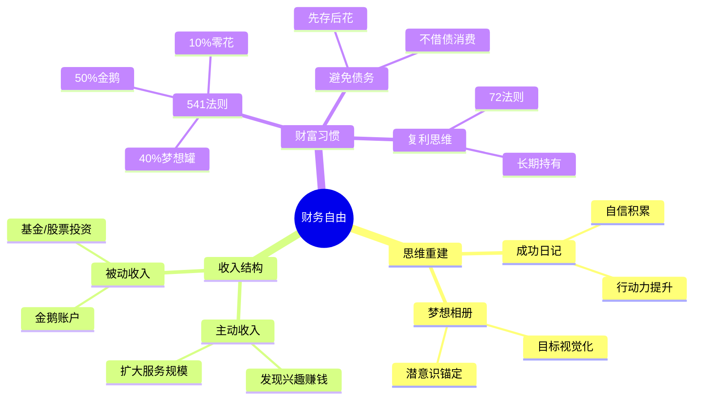

## 《小狗钱钱》读书笔记
  
### 作者  
digoal  
  
### 日期  
2026-05-24  
  
### 标签  
读书笔记 , 小狗钱钱   
  
----  
  
## 背景  
  
---
书名: 《小狗钱钱》  
作者: [德] 博多·舍费尔  
译者: 文燚  
出版年份: 2001（德文原版）/ 2021（中信新译本）  
笔记日期: 2025-05-24  
豆瓣链接: https://book.douban.com/subject/35295592/  
原作名: Ein Hund Namens Money  
标签: [理财启蒙, 儿童读物, 财务自由, 心理建设, 投资入门]  
---

  

> **一句话**：一只会说话的小狗，用童话包装了一套真实可执行的财富思维系统。    
> **适合谁读**：对金钱有焦虑或困惑的普通人；想给孩子做财商启蒙的父母；刚入社会、月光族、想改变财务习惯的年轻人    
> **阅读难度**：⭐☆☆☆☆（故事性极强，小学生可读）    
> **推荐指数**：⭐⭐⭐⭐☆  

---

## 一、时代坐标：这本书从哪里来？

1999年，德国经济正处于两德统一后的深度调整期。普通家庭债务问题日趋普遍，但"谈钱"在德国中产文化里依然是件略显粗俗的事。正是在这个背景下，一个有过惨痛亲身经历的人写下了这本书。

博多·舍费尔的故事本身就是这本书最好的注脚：6岁立志成为百万富翁，16岁只身赴美，26岁贸易公司倒闭、债台高筑，陷入人生最低谷。在一位财务顾问的帮助下，他用不到4年时间还清债务，30岁时靠资产产生的利息过上了财务自由的生活。这段经历，直接构成了《小狗钱钱》的思想内核。

他不想写一本枯燥的理财教科书。他用一个12岁女孩吉娅和一只会说话的小狗，把自己悟到的财富规律包成了一个暖心童话——献给"希望孩子富裕一生的父母"，也献给那些仍在为钱发愁的成年人。

这本书首版登上德国销售排行榜榜首，后被翻译成十几种语言，全球销量逾**千万册**，成为欧洲最畅销的理财图书之一。2002年进入中国，2021年由中信出版集团推出新译本，再度引发广泛关注。

```
  1999                2001               2021
   │                   │                   │
德文出版            登上德国畅销榜        中信新译本
博多亲历财务危机     翻译成十几种语言     在中国引发第二波热潮
    ↓                  ↓                   ↓
  童话诞生           千万销量            又一代读者入门
```

---

## 二、核心命题：作者在说什么？

全书可以提炼出三个相互咬合的核心观点，它们共同构成了一套"普通人的财富操作系统"。

### 观点一：思维方式决定财富，而非智商与出身

书中最反复强调的一句话是：**"你能否挣到钱，最关键的因素不在于你是否有好点子，也不在于你多聪明，决定因素是你的自信程度。"**

这听起来像心灵鸡汤，但背后有具体的操作支撑——成功日记。每天至少记录5件"今天做成的事"，哪怕再小都算。这个方法的逻辑是：**大脑会相信它反复看到的东西**。当你持续向自己证明"我能行"，面对机会时才不会因为恐惧而退缩。

舍费尔的洞察是：穷人思维和富人思维最大的差异，不在于知识量，而在于**行动阈值**。穷人等待"感觉准备好了再开始"，富人在恐惧中依然行动。吉娅的成长弧线，正是一个被成功日记逐渐激活的普通孩子。

### 观点二：先养"会下金蛋的鹅"，再谈享受

书中最精华的比喻：**鹅与金蛋**。

> 鹅 = 你的本金资产  
> 金蛋 = 本金产生的利息/收益  

农夫因为贪心杀了鹅，从此再也没有金蛋。这个寓言在说：**消费掉本金，是最愚蠢的行为**。只要鹅还在，金蛋就会源源不断。

具体到操作，书中给出了著名的**"5-4-1"收入分配法则**：
- **50%** → 投入"金鹅账户"（长期储蓄/投资）
- **40%** → 放入"梦想储蓄罐"（具体目标储蓄）
- **10%** → 日常零花

这个比例对普通工薪族来说非常激进，但核心逻辑无懈可击：**先储蓄，后消费**，而不是用"剩下的才存"。

### 观点三：用兴趣赚钱，让金钱服务于梦想

舍费尔反对"忍受工作来换取金钱"的逻辑。书中借达瑞（一个靠洗车赚了很多钱的男孩）的故事说明：**找到你喜欢做且能帮助别人的事，这就是你赚钱的起点。**

他还区分了"主动收入"和"被动收入"——前者是用时间换钱，后者是让钱自己工作。财务自由的本质，是被动收入覆盖日常开支的那一天。这是整本书最成人化、也最深刻的一个命题。

---

## 三、论证地图：作者怎么说服你的？



作者的论证策略非常聪明：**把抽象原则嵌入具体情节**。每一个财务概念，都附着在吉娅的一次真实困境上——

- 她想买电脑，学到了"梦想储蓄罐"
- 父亲失业，学到了"债务处理"
- 遇到邻居金先生，学到了"股票基金"
- 想放弃时，翻开"成功日记"重新振作

这种"即时反馈式"的叙事，让读者不知不觉把方法论内化为情感记忆。这是这本书比普通理财书更能被执行的真正原因。

关于投资，书中着重推荐**指数基金**，并给出了判断标准：安全性高、收益稳定、操作简单。甚至提到了"每年12%以上的长期收益"作为参考——考虑到德国股市和欧美长期指数的历史回报，这个数字在原著写作年代具有一定参考性。

---

## 四、前提假设与边界：什么情况下这不成立？

这本书的方法论很有力，但我需要诚实地指出几个隐含假设：

**假设一：你有持续稳定的收入可以储蓄**

书中的所有建议，都以"有收入"为前提。对于低收入群体、失业者、或者收入极不稳定的人来说，"存50%"不是方法论问题，而是生存问题。鹅和金蛋的比喻美好，但你得先有钱买鹅。

**假设二：长期持有股票基金会带来正回报**

书中默认了一个较长时间维度下"股市整体向上"的信念。这在欧美发达市场历史数据上基本成立，但在特定国家、特定市场环境下并不总是如此。日本失落的三十年就是活生生的反例。

**假设三：个人意志力可以持续克服消费欲望**

成功日记、梦想相册这些工具，需要长期坚持才有效。书中的吉娅是一个虚构的"高度自律小孩"。现实中，成年人的执行力受到社会压力、同伴影响、营销轰炸等多重干扰。认知上懂，行为上做到，是两回事。

**这本书最适用的群体**：有稳定收入、处于理财认知空白期、需要一个简单起点的普通人。对于已经有一定财富基础、需要深度资产配置的人来说，这本书显然太初级。

---

## 五、思想谱系：这本书在哪个传统里？

《小狗钱钱》在思想上站在两个传统的交叉点：

**传统一：欧美大众理财运动**

与同时代的罗伯特·清崎的《富爸爸穷爸爸》（1997年）高度呼应——两者都强调"资产"vs"负债"的区分，都倡导被动收入，都反对用时间换钱的线性思维。区别在于清崎更冒进（鼓励房产投资、自己创业），舍费尔更稳健（推荐指数基金、长期持有）。

**传统二：积极心理学与自我效能理论**

成功日记的底层，其实是阿尔伯特·班杜拉（Albert Bandura）"自我效能感"理论的大众化版本。梦想相册呼应了"心理预演"（mental rehearsal）在运动心理学中的应用。舍费尔将心理建设与财务行动打包，是这本书比纯理财书"更能执行"的关键。

```
《富爸爸穷爸爸》(1997) ──── 资产/负债框架
        │
        ├── 共同影响
        │
《小狗钱钱》(1999) ──────── 更温和、更系统、适合儿童
        │
积极心理学传统 ──────────── 自我效能、成功日记、梦想可视化
```

这本书对后来的财商教育影响深远。在中国，它与《穷爸爸富爸爸》一起，构成了2000年代理财启蒙的双子星。

---

## 六、我学到了什么？

读完这本书，我有三个真实的收获——不是"复述"，是被改变的认知。

**第一，成功日记不是励志噱头，是认知训练工具。**  
我以前把"记录成功"当成自我感觉良好的心灵按摩，觉得没什么实际意义。但仔细想想，大脑的注意力具有过滤性——你关注什么，就会更容易看到什么。每天记录5件做成的事，本质是在训练大脑的"机会雷达"，让它开始默认"我是一个能做成事情的人"。这个设定改变了我对"自信"的理解：自信不是天生的，是被行动记录堆出来的。

**第二，"先储蓄后消费"是一个彻底颠覆的顺序。**  
绝大多数人的习惯是：收入 - 消费 = 储蓄。结果储蓄永远是零或者接近零。书中的逻辑是：收入 - 储蓄 = 可消费金额。这个顺序调换，表面上只是把减法的位置换了，实际上是彻底改变了你和金钱的权力关系。

**第三，财务自由的本质是"时间的自由"，而不是"有很多钱"。**  
书中定义财务自由的方式很简洁：当你的被动收入 ≥ 日常生活开支，你就自由了。不是要成为亿万富翁，只是要让金钱为你工作，而不是你为钱工作。这个目标，对普通人来说是可够到的——如果足够早开始的话。

---

## 七、举一反三：这个框架还能用在哪？

书中的核心方法论，不只适用于金钱管理。

**成功日记框架 → 学习新技能时的心理支撑**  
学编程、学语言、学乐器，最难熬的是"没有进展感"的中间期。每天记录"今天学会了一个语法/写出了一个函数/弹准了一个小节"，能有效对抗学习焦虑，让坚持变得有据可查。

**鹅与金蛋框架 → 时间管理**  
把"注意力"理解为你的"鹅"——高质量的深度工作时间是你的核心资产。把它消费在刷视频和无效会议上，就是在杀鹅取蛋。保护好你注意力的"本金"，才有可能产生持续的高价值输出。

**541法则 → 精力分配**  
不只是钱，精力也可以这样分配：50%给最重要的核心目标，40%给有明确成长路径的中期目标，10%给日常杂务。先问"鹅"够不够肥，再谈其他。

---

## 八、批判与反思

我对这本书有两个真实的保留意见。

**第一，它对"品格与金钱的关系"处理得太理想化。**  
书中暗示：只要你诚实、善良、有爱心，财富自然会向你靠拢。但现实中，财富积累和道德品质之间的关系远没有这么线性。很多时候，早期资本的积累发生在灰色地带，或者依赖结构性优势。把"好人必然致富"作为前提，是一种可能会伤害读者的过度简化。

**第二，它对风险的讨论严重不足。**  
书中对股票基金几乎是无条件推荐，提到"长期持有5-10年一定安全"。这个判断依赖特定的市场环境假设。对于一个把全部储蓄投入基金、却赶上了长达十年熊市的普通投资者来说，"等待"的代价可能是生活质量的全面下降。理财启蒙书不该省略风险教育这一课。

当然，这些不足不减损这本书作为**入门启蒙读物**的价值。它解决的是"从0到1"——让完全没有财商概念的人，有了第一次认真思考金钱的契机。这个功能，它完成得非常好。

---

## 九、金句与记忆点

> **1. "假如我没有了我的'鹅'，我就总是得为了赚钱而工作。但是一旦我有了一只'鹅'，我的钱就会自动为我工作了。"**  
> 📌 这是全书最核心的一句话。财务自由的本质，就是让资产替你打工。

> **2. "你能否挣到钱，最关键的因素不在于你是否有好点子，决定因素是你的自信程度。"**  
> 📌 行动力来自自信，自信来自小小的成功积累。成功日记的意义就在于此。

> **3. "只有当你把股票实际卖出的时候，才会有损失。"**  
> 📌 长期投资者最常见的错误，是在账面亏损时恐慌性卖出，把"浮亏"变成"实亏"。

> **4. "财物问题一直存在，忽视财物问题就是放弃成功的机会。并非困难使我们放弃，而是因为我们放弃，才显得如此困难。"**  
> 📌 逃避金钱问题不会让它消失，只会让它在黑暗里变得更大。

> **5. "当你决定做一件事情，必须在72小时内开始行动，否则你很可能永远不会再做了。"**  
> 📌 72小时法则——拖延的本质是用"以后"代替"现在"。决定了就立刻开始。

> **6. "金钱魔法师的咒语：确定目标，相信自己，将钱分为三部分，进行明智投资，享受生活。"**  
> 📌 这五步构成了舍费尔体系的完整闭环。

> **7. "富裕是人们与生俱来的权利。认为一个人必须忍受拮据的生活，这是人类犯下的重大错误之一。"**  
> 📌 这是整本书最底层的价值观：不应该为贫穷感到羞耻，也不应该以贫穷为荣。

---

## 十、延伸阅读

**1.《富爸爸穷爸爸》—— 罗伯特·清崎**  
思想上的"同源书"。更多聚焦于资产/负债的概念辨析，以及通过房地产和创业实现财务自由。风格比小狗钱钱更激进，适合读完本书后进阶。

**2.《财务自由之路》—— 博多·舍费尔**  
小狗钱钱的成人版、进阶版。同一个作者，把童话中的方法论展开为严肃的理财体系，包括投资策略、资产配置等更深层的内容。

**3.《聪明的投资者》—— 本杰明·格雷厄姆**  
书中鼓励长期持有指数基金，这背后的哲学来自格雷厄姆的价值投资理论。这本书是价值投资者的圣经，是"鹅与金蛋"思维的深度版本。

**4.《纳瓦尔宝典》—— 埃里克·乔根森整理**  
关于"如何致富"的当代思考。纳瓦尔的核心观点与小狗钱钱高度共鸣：用特定知识+杠杆+长时间复利，实现被动收入。适合想理解"21世纪版金鹅"是什么的读者。

**5.《行为投资学》—— 丹尼尔·卡尼曼 / 相关行为经济学书目**  
小狗钱钱没有深入讨论投资中的心理陷阱。补充一些行为经济学读物，能让你更清醒地认识自己在面对市场波动时的非理性反应。

---

*笔记写于 2025-05-24 | 基于公开资料与深度思考整理*  
*本文力求独立思考，所有观点为笔者个人解读，不构成投资建议*
  
  
#### [PostgreSQL 解决方案集合](../201706/20170601_02.md "40cff096e9ed7122c512b35d8561d9c8")
  
  
#### [德哥 / digoal's Github - 公益是一辈子的事.](https://github.com/digoal/blog/blob/master/README.md "22709685feb7cab07d30f30387f0a9ae")
  
  
#### [About 德哥](https://github.com/digoal/blog/blob/master/me/readme.md "a37735981e7704886ffd590565582dd0")
  
  

  
