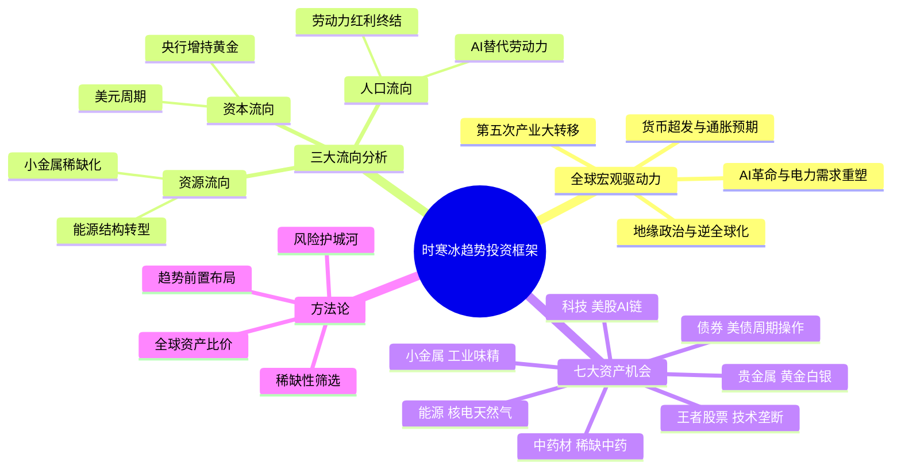

## 《时寒冰说：全球视野下的投资机会》读书笔记
  
### 作者  
digoal  
  
### 日期  
2026-05-24  
  
### 标签  
读书笔记 , 时寒冰说：全球视野下的投资机会   
  
----  
  
## 背景  
  
---
书名: 《时寒冰说：全球视野下的投资机会》  
作者: 时寒冰  
出版年份: 2025  
出版社: 中信出版集团  
页数: 384  
笔记日期: 2026-05-24  
豆瓣链接: https://book.douban.com/subject/37483198/  
标签: [趋势投资, 全球宏观, 黄金白银, 产业转移, 稀缺资产, 财经]  
---

  

> **一句话**：这是一本教你站在全球棋盘上，用"资本、资源、人口的流向"来锁定未来十年稀缺资产的趋势投资指南。  
> **适合谁读**：有一定投资经历、想建立宏观框架、不满足于短线操盘的中长期投资者  
> **阅读难度**：⭐⭐⭐☆☆  
> **推荐指数**：⭐⭐⭐⭐☆  

---

## 一、时代坐标：这本书从哪里来？

2025年8月，时寒冰用这本书回答了一个令无数人焦虑的问题：**在大国博弈、逆全球化、AI颠覆、货币超发同时发生的年代，普通人的财富该往哪里放？**

这不是时寒冰第一次预测"大趋势"。2014年出版的《未来二十年经济大趋势》已精准预判了人口红利衰退、房地产泡沫和贵金属上涨——事实上，书中写下"黄金白银价格将大幅上涨，幅度超出以往经验"之后，金价从约1200美元一路涨破4300美元。白银也从不到20美元涨到50美元以上。这种跨越十年的预判被市场验证，给了他极高的声望，也奠定了这本新书的立场：**"趋势是可以研究和预判的，前提是你用正确的框架。"**

写作背景上，2025年是一个极为特殊的时间节点：特朗普关税冲击已重塑全球贸易格局；AI革命带来电力与芯片需求爆炸；全球央行不断增持黄金；"去美元化"讨论从边缘变为主流。这本书，就是时寒冰对这个"旧秩序崩解、新格局初建"历史节点的系统性回应。

```
时间轴：时寒冰著作脉络与市场验证
─────────────────────────────────────────────────────
2008 ──→ 《中国怎么办》（次贷危机判断）
2012 ──→ 专职趋势研究，退出媒体
2014 ──→ 《未来二十年经济大趋势》（预判黄金大涨、房产泡沫）
2016 ──→ 《第五次产业大转移与未来30年国运》（文章）
2025 ──→ 《全球视野下的投资机会》（七大资产全景布局）
          |
          ↓ 历史验证：黄金 1200→4300+，白银 18→50+
─────────────────────────────────────────────────────
```

---

## 二、核心命题：作者在说什么？

### 命题一：投资的本质是"交易未来"，而非预测现在

时寒冰的核心方法论叫做**"趋势投资"**：在趋势明朗之前提前布局，而非等到众人皆知时才入场。他的名言是——"当金价涨到3000时很多人开始做空，4000时更多人做空，而金价已经快到5000了。"这句话刀刀见血：多数人用"过去的经验"评估"未来的趋势"，本质上永远是后知后觉。

所谓"势"，在他的框架里是**资本、资源、人口三种力量的流向**。谁在增加，谁在转移，谁在枯竭——跟踪这三股力量，就能比市场早一步看见机会。

### 命题二：稀缺性是价值的终极来源

全书贯穿一个选资产的核心标准：**稀缺性**。稀缺性分三种——地域稀缺（茅台的离地酒香）、技术垄断（英伟达的AI芯片）、资源不可再生（黄金、白银、小金属）。凡符合其中一条，便值得长期持有；凡无稀缺性支撑，涨幅皆是泡沫。

他将七大资产——**黄金、白银、核电、美股、美债、中药材、小金属**——逐一拆解稀缺逻辑，构建起一张"全球资产稀缺地图"。

### 命题三：第五次产业大转移正在发生，输出国是中国

这是全书中最宏观的判断。时寒冰认为历史上共有五次全球产业大转移，当前正经历第五次：中国从劳动力红利受益者，转变为产业转移输出国——低端制造向东南亚迁移，高端技术向美欧日回流。这一判断意义深远：意味着中国国内的"强者恒强"逻辑开始生效，存量市场中寻找竞争优势更重要。

---

## 三、论证地图：作者怎么说服你的？



**关键论证路径：**

以黄金为例，他的论证分三层：①货币层——全球央行持续超发货币，法币购买力系统性下降；②供给层——黄金开采成本上升，新矿发现越来越少，供给端天花板清晰；③需求层——中俄土等央行大规模增持，叠加避险与去美元化需求。三层叠加，结论是黄金牛市未终。

对核电的论证则是AI逻辑链：AI数据中心爆炸式扩张→电力需求急剧攀升→太阳能风能有间歇性缺陷→核电是唯一的稳定清洁基荷能源→核电资产被长期低估→价值回归。

这种论证的优点是逻辑清晰、层层递进；弱点是把多个"正确的趋势"叠加，有时候忽视了每个环节的实现时间和路径风险。

---

## 四、前提假设与边界：什么情况下这不成立？

这本书的结论建立在几个隐含假设之上，值得审慎对待：

**假设一：货币超发是不可逆的长期趋势。** 这一假设大概率成立，但如果某个主要经济体实现了货币纪律（如加密货币基础设施成熟、财政自律约束加强），通胀预期可能被打断，贵金属逻辑将承压。

**假设二：AI不会颠覆稀缺性逻辑。** 若AI和新材料技术大幅降低了某些小金属的使用需求（例如替代稀土的磁性材料），"工业味精"的稀缺性可能被技术化解。

**假设三：地缘政治持续分裂。** 若中美关系出现阶段性缓和，"逆全球化"节奏可能放缓，第五次产业大转移的时间表也会随之拉长。

此外，这本书明确不适合：短线交易者、依赖杠杆的投机者、期望快速致富的读者。它的框架是十年级别的战略视角，对于需要季度级别收益的资金来说，框架再正确，实用性也有限。

---

## 五、思想谱系：这本书站在哪个传统里？

时寒冰的思想有两根主线：

**第一根：奥地利经济学派的影子。** 他对货币超发的长期通胀效应、对政府干预的结构性担忧，与哈耶克、米塞斯的"通胀是货币现象"一脉相承。他不是奥派学者，但这条线索清晰可辨。

**第二根：全球宏观交易的实践传统。** 乔治·索罗斯的"反射理论"、瑞·达利奥的"全天候资产配置"、吉姆·罗杰斯的大宗商品周期论——这些都与时寒冰的全球视野有精神共鸣。他说"投资者要像全球猎人一样比较各类资产的性价比"，这几乎是达利奥"全球资产比价"思想的中国本土化表达。

与国内同类财经书相比，这本书的特点是**敢于给出明确的方向性判断**，而非流行的"既有可能……也有可能……"式骑墙写法。这是他的招牌，也是他的风险所在。

---

## 六、我学到了什么？

读完这本书，对我影响最深的有三点。

**第一：框架先于个股。** 我过去投资时总是先找个股，再去合理化买入理由。时寒冰提醒我，应该先确认"在正确的市场里"，再去找"有稀缺性的品种"——前者决定了你是顺风还是逆风飞翔。就像他说的，在产业大转移的浪潮中，连普通选手也能赢；逆势而为，连高手也会失败。

**第二：稀缺性是投资的"护城河检测仪"。** 任何时候评估一个资产，先问自己：它的稀缺性来自哪里？地域？技术？资源？若说不清楚，那么即便上涨也不该重仓持有。这个标准简单粗暴，但非常有效地过滤掉了大量"故事驱动"的投机机会。

**第三：长周期的正确，不等于短周期的盈利。** 时寒冰的多次预判被历史验证，但他自己也坦承，2014年给出判断，到2022-2023年才真正兑现。在这期间，持有需要极大的耐心和定力。**趋势正确，但买入时机、仓位管理、中途的市场波动——这些"术"的问题，书里给的答案相对简略。** 框架很好，执行很难。

---

## 七、举一反三：这个框架还能用在哪？

时寒冰的"三流向+稀缺性"框架，其实是一个通用的趋势判断工具：

**应用场景一：行业选择。** 在某个新兴行业进入成长期时，问：资本是否在大规模流入？这个行业有没有不可替代的核心资源或技术壁垒？比如生物医药行业中的创新药，稀缺性来自专利保护期，窗口期内有强护城河。

**应用场景二：职业规划。** "人口流向哪里，机会就在哪里"这个逻辑同样适用于个人职业选择。AI带来的人才需求转移，意味着某些传统岗位正在经历"产业大转移"的个人版本——哪些技能稀缺，哪些技能可被替代，与其等到浪潮来临，不如提前布局。

**应用场景三：城市选择。** 第五次产业转移中，接收高端制造回流的地区（美欧日部分城市）与承接低端制造外溢的地区（越南、印度某些城市），将会拥有迥异的未来。如果你考虑长期定居城市，这个框架值得参考。

---

## 八、批判与反思

时寒冰是一个有大局观、有人文关怀的财经分析者，他对弱势群体的关注、对社会公平的发声，在财经圈里颇为难得。但这本书作为投资指南，有几处值得审慎：

**第一，预判的"验证偏差"。** 他的黄金预判、房产预判确实被验证了，但如何评估他同期那些"没被验证"甚至"预判错误"的部分？比如欧元区解体论，在2025年仍未发生。高亮正确案例、淡化错误判断，是大众财经书的通病，这本书也未完全免疫。

**第二，"15年经济三九天"过于宏观。** 他预判2025年底起进入15年经济低迷期，这个判断跨度极长。经济历史上，技术革命往往能在短周期内打破悲观预期——AI究竟是推手还是抑制者，本书的答案并不完整。

**第三，七大资产缺乏明确的"止损逻辑"。** 趋势投资的真正考验不在于"何时买入"，而在于"出现什么信号应该退出"。对每个资产，如果趋势逆转，作者并未给出清晰的反转标志，这对个人执行来说是个缺口。

总体而言，这本书更像是一本**宏观战略地图**，而非战术执行手册。地图给的足够清晰，但如何走，读者还需自己摸索。

---

## 九、金句与记忆点

1. **"当趋势尚未形成时布局，当众人皆知时离场。"**
   — 趋势投资的精髓，拒绝追热点，要做"先知型"投资者。

2. **"势，即资本、资源、人口的流向。"**
   — 方法论的骨架，三种流向定趋势，找到流向，机会就在前方。

3. **"稀缺性是长期定价的核心变量。"**
   — 评估任何资产的第一标准，没有稀缺性的上涨都是噪音。

4. **"黄金是对法币信用的不信任票。"**
   — 对贵金属本质的精炼定义，每次央行超发货币，都是黄金上涨的"选票"。

5. **"缩表比加息的杀伤力更大——加息是提高资金成本，缩表是釜底抽薪。"**
   — 对美联储货币政策的关键区分，影响债券和流动性资产的底层逻辑。

6. **"在存量市场里，强者恒强。"**
   — 第五次产业大转移背景下的中国市场选股逻辑，不再是"赛道广阔"，而是"谁是剩者"。

7. **"世界上没有哪个国家是靠与民生有关的行业称雄世界的。"**
   — 这是他在早年著作中反复强调的结构性判断，隐含着对产业升级路径的深刻理解。

---

## 十、延伸阅读

1. **《下一波全球经济浪潮》— 哈里·登特**
   同样以人口结构预测长周期经济走势，与时寒冰的"人口流向"逻辑有共鸣，但视角更偏人口统计学。

2. **《原则》— 瑞·达利奥**
   达利奥的"债务周期"和"全天候配置"是时寒冰全球资产比价思想的系统化版本，更有框架深度。

3. **《货币战争》— 詹姆斯·瑞卡兹**
   关注货币体系重构和黄金角色，对理解时寒冰"货币终极保险"论断有很好的补充。

4. **《大宗商品超级周期》— 吉姆·罗杰斯**
   资源稀缺视角下的大宗商品长周期论，与本书"资源为王"的判断逻辑高度一致。

5. **《投资最重要的事》— 霍华德·马克斯**
   在宏观趋势之外，关注"第二层思维"和风险控制——时寒冰的框架告诉你"买什么"，马克斯告诉你"怎么买才不被淘汰"。

---

*笔记写于 2026-05-24 | 基于公开书评、微信读书简介、知乎讨论及深度分析整理*
*注：本文为读书笔记，所有投资判断仅代表作者观点，不构成投资建议。*
  
  
#### [PostgreSQL 解决方案集合](../201706/20170601_02.md "40cff096e9ed7122c512b35d8561d9c8")
  
  
#### [德哥 / digoal's Github - 公益是一辈子的事.](https://github.com/digoal/blog/blob/master/README.md "22709685feb7cab07d30f30387f0a9ae")
  
  
#### [About 德哥](https://github.com/digoal/blog/blob/master/me/readme.md "a37735981e7704886ffd590565582dd0")
  
  

  
