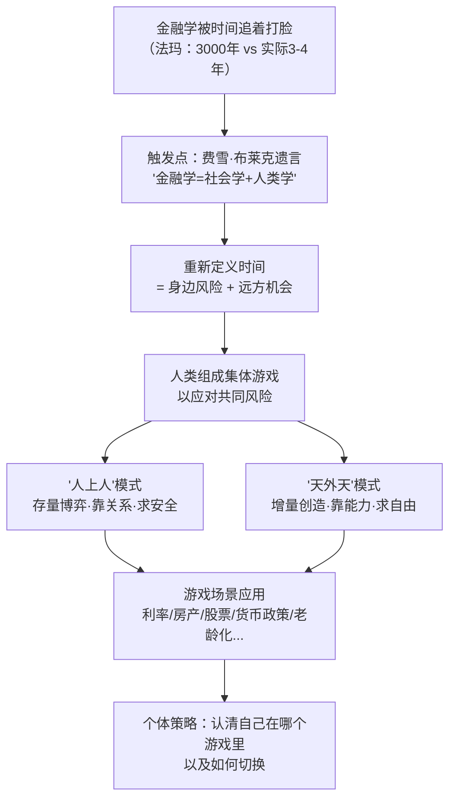
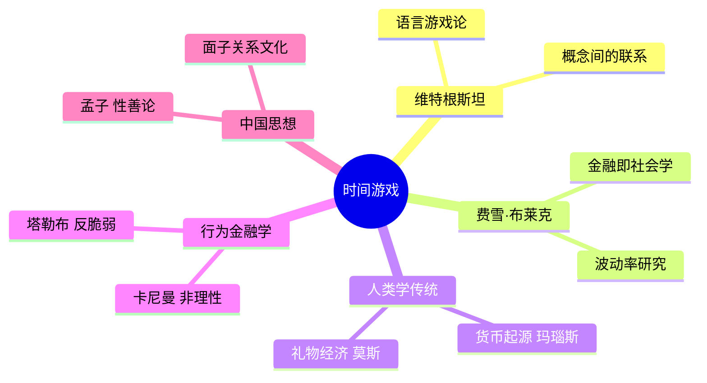

## 《时间游戏》读书笔记
  
### 作者  
digoal  
  
### 日期  
2026-05-24  
  
### 标签  
读书笔记 , 时间游戏   
  
----  
  
## 背景  
  
---
书名: 《时间游戏》  
作者: 周洛华  
出版年份: 2024  
笔记日期: 2026-05-24  
出版社: 上海财经大学出版社  
ISBN: 9787564243418  
标签: [金融哲学, 时间, 集体游戏, 社会学, 人上人, 天外天, 维特根斯坦]  
---

  

> **一句话**：金融不是数学，而是人类与时间的集体博弈——你在哪种游戏里，决定了你的命运。  
> **适合谁读**：对经济/金融感到困惑的普通人；想理解"内卷"与"躺平"背后逻辑的人；读过《货币起源》《市场本质》《估值原理》的老读者  
> **阅读难度**：⭐⭐⭐☆☆  
> **推荐指数**：⭐⭐⭐⭐☆  

---

## 一、时代坐标：这本书从哪里来？

2024年，中国经济正处于一个微妙的转折点：房市下行、青年失业率高企、"躺平"与"内卷"成为主流叙事。与此同时，全球金融市场在量化模型横行多年后，依然每隔几年就爆发一次"百年一遇"的危机。

周洛华写这本书，有一个很私人的起点——他41岁那年，在担任上海大学经济学院副院长期间，面试一位海归年轻人时，被公开指出对某篇重要论文一无所知。他形容那一刻是对自己学术生涯的"公开处决"。他随后辞职，离开体制，转而用社会学和人类学的眼光重新打量金融世界。

这本书是他"金融哲学四部曲"的终章——前三部分别是《货币起源》（货币银行）、《市场本质》（资本市场）、《估值原理》（资产估值），而《时间游戏》则是一份融合前三部、面向普通读者的"玩家攻略"。

还有一个重要的思想触发点：费雪·布莱克（Black-Scholes 模型的发明者之一）临终前说了一句话，让周洛华彻底转向——**"金融学应该是社会学和人类学的一部分。"**

```
《货币起源》 → 机制原理
《市场本质》 → 交通规则
《估值原理》 → 旅游指南
《时间游戏》 → 玩家攻略  ← 我们在读这本
```

---

## 二、核心命题：作者在说什么？

### 观点一：时间不是线性的，而是"风险与机会的组合"

大多数人把时间理解为一条单向流逝的线——"时间就是金钱"。周洛华彻底颠覆了这一认知。

他认为，从金融的视角看，**时间 = 身边的风险 + 远方的机会**。波动率并非数学家发明的抽象参数，它本质上是时间中"危险分量"和"机会分量"此消彼长的体现。所谓管理时间，不是提高效率，而是在风险与机会之间动态寻找平衡。

这个定义有一个深远的推论：一个让人觉得"未来有机会"的社会，才能激发个体的创造力；反之，一个未来封闭、机会固化的社会，就会充斥内卷与哀怨，走向衰退。

### 观点二：人类社会存在两种根本性的集体游戏

全书最核心、最有冲击力的洞见，就是将人类一切社会组织形态归纳为两种游戏模式：

**"人上人"模式**：将个人自由限制在某个上限之内，以便集体更容易实现安全。这是体制化的存量博弈——晋升靠熬资历、靠关系、靠面子，游戏的目标是爬到他人之上。弱者在这种游戏里相互依赖、抱团取暖。

**"天外天"模式**：将集体安全保持在某个底线之上，以便让个人更容易实现自由。这是面向市场的增量创造——通过能力、创新、冒险去开拓新领域。强者在这种游戏里彼此竞争、各自独立。

两种模式没有绝对的好坏，但会深刻影响参与者的心态、策略乃至命运。书中以深圳特区的崛起为例：几十年来的奇迹，恰好是"人上人"游戏被"天外天"游戏逐渐替代的过程。

### 观点三：金融危机是游戏规则失效，而非数学模型出错

这是对整个主流金融学的一次宣战。周洛华认为，每一次金融危机，本质上不是模型算错了，而是人类用来对抗时间不确定性的集体游戏发生了规则崩溃。每次危机后打出新补丁、建立新模型，不过是在为下一轮危机招募新的受害者。

真正的问题在于：金融学用数学语言处理的，是本质上属于社会学和人类学范畴的现象。

---

## 三、论证地图：作者怎么说服你的？



**论证特点**：这本书几乎没有数学公式和统计数据，却大量使用**类比与案例**：

- 用"鱼货码头上不断融化的冰块"比喻时间的本质（机会+风险）
- 用"3000年才有一次5倍标准差"vs"现实3-4年一次"来揭示模型的荒谬
- 用深圳特区、日本失去的三十年、美联储量化宽松等宏观案例来支撑理论
- 用"面子与孝子与种子"这类中国文化特有的现象，来讲游戏中的人性

这是这本书的优点，也是它的局限——可读性高，但实证基础较弱。

---

## 四、前提假设与边界：什么情况下这不成立？

**假设一：人们能够识别自己处于哪种游戏之中。**

现实是，很多人长期处于"人上人"游戏的惯性中，却用"天外天"的话语包装自己。认知偏差使得"切换游戏"远比书中描述的困难。

**假设二："天外天"模式优于"人上人"模式。**

书中对"天外天"有明显的价值倾向。但在某些社会结构下（极端不平等、缺乏社会安全网），没有"人上人"的缓冲，弱势群体未必能在"天外天"的市场竞争中存活。北欧的高福利体制，是在"人上人"的安全保障之上，才激活了"天外天"的创新动力。

**假设三：维特根斯坦的"语言游戏"框架可以直接平移到金融领域。**

周洛华把维特根斯坦当作方法论基础，但维特根斯坦本人并未研究经济学。这种跨学科的平移，需要更严格的论证支撑，而书中基本是以"点到为止"的方式处理的。

**这本书的适用边界**：它更适合帮人建立宏观认知框架，而非提供具体的投资策略或政策分析工具。

---

## 五、思想谱系：这本书在哪个传统里？



周洛华明确站在"金融学应回归人文社科"的旗帜下，与塔勒布（《黑天鹅》《反脆弱》）、席勒（《非理性繁荣》）等行为金融学者有精神上的呼应，但走得更远——他不只是修正主流模型，而是主张用社会学重新奠基金融学。

他的前三部曲已建立起一套完整的"哲学金融"体系，《时间游戏》是这个体系面向大众的收官之作。在国内，这种"野生"的跨学科金融思考路径，颇为罕见。

---

## 六、我学到了什么？

**收获一：重新理解"内卷"的根因。**

内卷不是个人选择，是游戏规则的必然产物。当一个社会整体运行在"人上人"的存量博弈逻辑中，个体的拼命努力并不会创造新价值，只是抢夺已有蛋糕。破解内卷的路径，不是个人更努力，而是改变游戏——要么找到"天外天"的赛道，要么推动社会创造新的增量机会。

**收获二：理解投资的本质不是"买便宜的资产"，而是"买时间"。**

这个视角让我对金融行为有了新的解读：买股票是在购买企业未来的时间（机会）；借高利贷则是在透支自己未来的时间（风险）。好的投资，是让你的时间结构变得更有利——身边的风险降低，远方的机会增加。

**收获三：对"强者"的重新定义。**

书中说，强者有能力抓住向上的机会，也有实力扛住向下的风险——波动对强者有利。这让我想起塔勒布的"反脆弱"。真正的强者不是避开波动，而是能从波动中获益，因为他们有足够的冗余去扛住极端风险。

---

## 七、举一反三：这个框架还能用在哪？

**场景一：职业规划**

你所在的公司，是"人上人"文化（论资排辈、关系优先）还是"天外天"文化（业绩说话、能者居之）？认清这一点，比努力本身更重要。如果是前者，你的策略是经营关系；如果是后者，你的策略是打磨能力。两种游戏里用错了策略，再努力也白费。

**场景二：理解宏观政策**

量化宽松本质上是政府在购买时间——用债务换取当下不崩溃，赌未来能创造出足够的新价值来填补这段时间。这个赌注能否成功，取决于这段时间里能否真正产生新质生产力，而不只是资产泡沫。

**场景三：理解代际冲突**

老一辈人大多生活在"人上人"游戏的胜利经验里；年轻一代面对的是规则已经变化的"天外天"时代。两代人之间的价值冲突，本质上是两种游戏规则的碰撞——不是谁对谁错，而是在玩不同的游戏。

---

## 八、批判与反思

**这本书最大的问题，是观点大于论证。**

周洛华的洞察力毋庸置疑，但他自己也承认，这本书"没有任何理论，没有任何模型，没有任何分析"。这既是这本书的勇气——拒绝用数学伪装确定性——也是它的软肋：很多核心命题停留在"说得通"的层面，缺乏可供检验的实证路径。

**"人上人"与"天外天"的二分法过于简化。**

现实中，大多数社会结构是两种模式的复杂混合体，且在动态演变中。把深圳经济特区的成功完全归结为"天外天"游戏的胜利，可能忽略了其中大量"人上人"逻辑（关系网络、政策红利）的作用。

**时代背景的局限性**：这本书浓墨重彩地讨论中国的发展路径，不可避免地带有2024年特定历史语境的印记。随着时代变化，部分论断的有效性需要重新审视。

但话说回来，一本没有缺陷的书往往也是一本没有观点的书。周洛华敢于立靶子，本身就值得尊重。

---

## 九、金句与记忆点

> **"时间是身边风险和远方机会的组合。"**
> ——这是全书的核心公理，一旦接受它，你看待投资、职业、政策的眼光都会改变。

> **"金融学简直是被时间追着打脸：用新的数学方法解释了一个现象，打上了一个新补丁，创造了一个新模型——其实，这是在为下一次危机招募新的受害人。"**
> ——对主流金融学最辛辣的批判。

> **"借高利贷买时间并不能改变命运，实际上是对不需要买时间的强者的鼓励。"**
> ——揭示了一个残酷逻辑：穷人越借越穷，不只是利率的问题，而是游戏规则的问题。

> **"强者有能力抓住向上的机会，也有实力扛住向下的风险，波动对强者有利。"**
> ——与塔勒布的"反脆弱"遥遥呼应，但从游戏论的角度给出了新的诠释。

> **"你在游戏中的角色决定了你的人设，别人就根据这个人设来评价你的表现。"**
> ——人生是一场角色扮演游戏，认清自己的角色，才能把握主动权。

> **"公平社会为大家创造一个'远方和未来有机会'的念头，让人感觉未来值得期待，值得奋斗，值得创造；反之，社会就会充斥内卷和哀怨，最终走向衰退。"**
> ——这大概是这本书最有温度的一句话，也是它写作的终极动机。

---

## 十、延伸阅读

1. **《反脆弱》——纳西姆·塔勒布**
   与"强者从波动中获益"的逻辑高度呼应，是从不同角度切入同一主题的好书，两本放在一起读会形成绝妙的互文。

2. **《货币起源》——周洛华**
   四部曲的起点，讲"货币是道德的补丁"，有助于理解《时间游戏》底层的人类学基础。

3. **《非理性繁荣》——罗伯特·希勒**
   行为金融学视角的经典，与周洛华共同站在批判"有效市场假说"的阵营，但路径截然不同。

4. **《宽客人生》——伊曼纽尔·德尔曼**
   书中被周洛华直接引用，一个物理学家从华尔街量化宽客的亲历视角，写出了数学模型与真实市场之间的鸿沟。

5. **《枪炮、病菌与钢铁》——贾雷德·戴蒙德**
   用人类学和地理学解释文明差异，与周洛华用社会学解释金融的路径有异曲同工之妙，是理解"集体游戏演化"的宏观背景读物。

---

*笔记写于 2026-05-24 | 基于公开访谈、书评及深度思考整理*
  
  
#### [PostgreSQL 解决方案集合](../201706/20170601_02.md "40cff096e9ed7122c512b35d8561d9c8")
  
  
#### [德哥 / digoal's Github - 公益是一辈子的事.](https://github.com/digoal/blog/blob/master/README.md "22709685feb7cab07d30f30387f0a9ae")
  
  
#### [About 德哥](https://github.com/digoal/blog/blob/master/me/readme.md "a37735981e7704886ffd590565582dd0")
  
  

  
