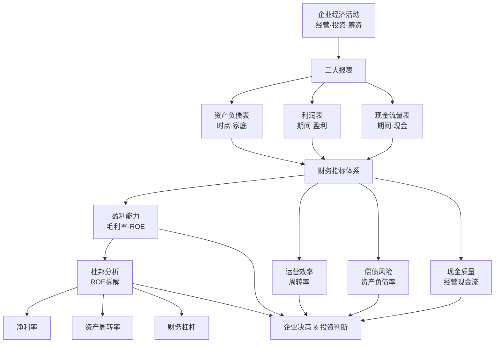

## 《一本书读懂财报》读书笔记
  
### 作者  
digoal  
  
### 日期  
2026-05-24  
  
### 标签  
读书笔记 , 一本书读懂财报   
  
----  
  
## 背景  
  
---
书名: 《一本书读懂财报（第三版）》  
作者: 肖星  
出版年份: 2022  
笔记日期: 2025-05-24  
豆瓣链接: https://book.douban.com/subject/36076424/  
豆瓣评分: 8.9  
标签: [财务报表, 财务分析, 投资, 管理, 入门]  
---

  

> **一句话**：三张报表是一面镜子——照出企业过去做了什么、现在有多少钱、未来能不能活下去。  
> **适合谁读**：非财务背景的管理者、初入职场者、个人投资者、想读财报却被数字劝退的所有人  
> **阅读难度**：⭐⭐☆☆☆  
> **推荐指数**：⭐⭐⭐⭐☆  

---

## 一、时代坐标：这本书从哪里来？

2014年，中国个人投资者数量正在爆发式增长，A股散户化严重，绝大多数普通人投资靠"消息"、靠感觉，却完全看不懂上市公司年报。与此同时，国内MBA教育普及，越来越多非财务背景的中层管理者需要与财务部门打交道，却在面对报表时如看天书。

这一背景下，肖星——清华大学经济管理学院教授、会计系系主任，同时在国内MOOC平台开设了覆盖201个国家和地区、数十万学习者的明星课程《财务分析与决策》——决定把课堂内容转化为一本人人都能读懂的书。

她的问题意识非常清晰：**财报不是给会计看的，而是给决策者看的。** 但现有的财务教材要么过于专业枯燥，要么流于表面口诀。于是这本书的定位是：用"讲故事"而非"背公式"的方式，让非专业读者建立起财报的完整思维框架。

从2014年第一版，到2019年修订版，再到2022年第三版（全面改写案例），这本书常年占据各大平台经管类畅销榜，被众多企业列为中层及以上管理者必读书目，累计影响了无数财务初学者、投资人和企业管理层，堪称中文财报入门领域的经典之作。

---

## 二、核心命题：作者在说什么？

### 命题一：财报是企业经济活动的"白话文翻译"

肖星开篇就拆穿了一个常见误解：很多人以为财报是会计的专业工具，其实财报不过是企业经济活动的记录文本。任何一家企业，无论规模大小，一辈子只做三件事——**经营、投资、筹资**。三张报表，就是从不同角度描述这三件事：

- **资产负债表**：某一时刻企业"家底"的快照——我有什么资产，欠了多少债，股东出了多少钱
- **利润表**：一段时间内企业"赚钱能力"的摘要——收了多少钱，花了多少，最终剩多少利润
- **现金流量表**：同一时间内企业"真实现金进出"的流水账——利润可以造假，现金难以伪造

这个框架有个重要启示：**三张表不是孤立的，是同一个企业故事的三种叙述视角。** 一家公司利润表漂亮但现金流量表难看，往往意味着应收账款堆积、利润质量存疑。

### 命题二：财务分析的核心是"比较"而非"数字"

肖星在书中反复强调一个反直觉的观点：财务报表上的绝对数字意义有限，分析的本质是比较——与自身历史比（趋势分析），与竞争对手比（横向对标），与行业均值比（结构判断）。

她引入了一套实用的分析指标体系：
- **盈利能力**：毛利率、净利率、ROE（净资产收益率）
- **运营效率**：应收账款周转率、存货周转率、总资产周转率
- **偿债能力**：流动比率、速动比率、资产负债率
- **现金健康**：经营活动现金流 vs 净利润的匹配度

这些指标彼此咬合，构成一个"体检套餐"，可以系统地诊断一家企业的管理效率、盈利能力、抗风险能力和发展前景。

### 命题三：用杜邦分析法打穿ROE的秘密

全书最有"一招鲜"价值的部分，是对**杜邦分析框架**的讲解：

```
ROE（净资产收益率）
 = 净利率 × 资产周转率 × 权益乘数（杠杆）
```

同样是15%的ROE，可能代表截然不同的商业模式：
- **茅台型**：高净利率 + 低资产周转率 + 低杠杆 → 品牌溢价驱动
- **零售型**：低净利率 + 高资产周转率 + 中等杠杆 → 规模效率驱动
- **地产型**：低净利率 + 低资产周转率 + 高杠杆 → 金融杠杆驱动

这个框架让读者能够透过ROE这个数字，看清企业是用哪条路径在赚钱——是靠产品溢价，是靠运营效率，还是靠借债放大。

---

## 三、论证地图：作者怎么说服你的？

肖星采用的论证方式是 **"概念→公式→真实案例→决策应用"** 的四步结构，每一个知识点都落到具体的中国上市公司案例上（第三版全部换用新案例，贴合新会计准则）。



论证的优点：逻辑链条清晰，案例接地气（国内上市公司），读者不需要记公式也能理解背后的商业直觉。每个章节都有"利润表是这样告诉你……""现金流量表是这样告诉你……"的清晰模块切换。

论证的弱点：案例多为制造业和传统消费品，互联网/科技公司的资产结构（大量无形资产、递延收入、股权激励费用）处理较少；此外篇幅控制严格（256页），有些指标点到即止，深度有限。

---

## 四、前提假设与边界：什么情况下这不成立？

### 假设一：会计数字是可信的

杜邦分析和所有财务指标的前提是报表数字基本可信。但现实中，财务造假（如康美药业的货币资金造假、瑞幸的虚增收入）会让所有分析失效。这本书对财务造假的识别着墨不多，读者不能天真地以为看懂了报表结构就能看穿造假。

### 假设二：历史财务数据能预测未来

财务报表天然是"后视镜"——它描述过去已经发生的事。对于高速变化的行业（AI算力公司、平台经济、创新药），历史财务数据的预测价值极为有限。肖星的框架在成熟行业、稳定商业模式下最为有效，但用它分析初创公司或颠覆性企业，可能得出误导性的结论。

### 假设三：中国会计准则与IFRS大致可比

书中主要使用中国上市公司案例，适用中国会计准则（CAS）。在比较中概股（适用US GAAP）或港股（IFRS）时，某些科目处理有所差异，读者需留意。

---

## 五、思想谱系：这本书在哪个传统里？

肖星的思想来源是标准的**美式财务分析学派**——杜邦分析、自由现金流、DCF估值框架，均源自20世纪美国财务学的经典积累（亨利·福特时代的杜邦公司管理实践，后经学者系统化）。

她翻译过《财务报表分析：估值方法》（Penman），这本书在国际学术界是财务分析的权威教材，代表了将会计数字与企业价值评估打通的现代范式。肖星的贡献在于将这套国际范式**本土化**——用A股企业案例、用中国读者熟悉的语言，完成了一次有效的知识翻译工作。

```
国际学术范式
（Penman / Palepu财务分析框架）
          ↓
    肖星的本土化工作
  （清华MBA课程 → MOOC → 书籍）
          ↓
  中文财报入门读物的范式建立
（影响：财务初学者 · 投资人 · 管理者）
```

与同类中文书相比，本书最大的差异在于：它不是"如何做账"的会计书，而是"如何读懂账"的决策书，视角始终站在信息使用者一侧，而非信息生产者一侧。

---

## 六、我学到了什么？

读完这本书，我最深的感受是：**财报本质上是一种语言，而不是一堆数字。** 学会这种语言，你才能听懂企业在说什么。

**三个真实收获：**

**1. "利润可以造假，现金很难造假"是一个可操作的原则。** 每次分析一家公司，把净利润与经营活动现金流做对比，是最快的"体检"。如果一家公司年年利润高涨，但经营现金流持续为负，一定有问题值得深挖。

**2. 杜邦框架让我不再比较苹果和橙子。** 以前我会觉得超市的净利率只有2%很低，现在我知道高周转低利润是零售业的本质，判断超市好不好不该看净利率，该看存货周转率和同店增长。不同商业模式用不同的指标量尺，这个认知改变了我看行业的方式。

**3. 资产负债表是战略的结果，不是结果的结果。** 一家公司的资产构成，是它过去战略选择的沉淀。重资产、轻资产、无形资产占比……每一个比例背后都是管理层对竞争优势的判断。读懂资产负债表，等于读懂了一家公司过去十年的战略方向。

---

## 七、举一反三：这个框架还能用在哪？

肖星的"三张表 + 指标体系 + 杜邦分析"框架，其实是一个**系统性诊断**的通用方法论，迁移价值很高：

**场景一：个人求职 / 职场选择**
加入一家公司前，去看它的财报。资产负债率超过80%的公司，抗风险能力极弱；经营现金流持续为负的公司，随时可能"猝死"。这不是杞人忧天，而是用数据做理性判断。

**场景二：供应商/合作方评估**
和一家公司签大合同前，看它的应收账款周转率和流动比率。一家收不回账、还不起债的合作方，会把风险传导给你。

**场景三：理解宏观经济新闻**
当你看到"某某行业资产负债率高企""某某公司自由现金流转正"这类新闻时，不再是懵的——你能感受到背后的含义。财报思维是理解商业世界的基础语法。

---

## 八、批判与反思

**我不同意的地方：**

书名叫"一本书读懂财报"，实际上是夸大了。读完这本书，你能建立一个清晰的框架，但**远未达到"读懂"的程度**。真正读懂一张财报，需要了解行业背景、竞争格局、会计政策选择偏好、管理层诚信历史……这本书给的是入门语法，不是翻译能力本身。

**时代已经变了的地方：**

本书的分析框架在传统制造业、消费品行业非常适用，但在新经济领域面临结构性挑战。互联网平台的核心资产（用户数据、网络效应、算法）完全不在报表上体现；亏损扩张型企业（早期的京东、拼多多、滴滴）按传统财务分析是"不合格的公司"，但这些公司实际上正在建设护城河。财报框架在新经济估值面前有显著的局限，读者需要引入用户增长、LTV/CAC等互联网原生指标做补充。

**本书的核心局限：**

一本256页的入门书注定只能覆盖80%的使用者80%的需求。对想做专业股票研究、并购分析或信用分析的读者，这本书只是起点，后面还需要学习行业建模、会计准则细节、报表重构等进阶技能。

---

## 九、金句与记忆点

1. **"企业一辈子只做三件事：经营、投资、筹资。"**
   → 三张报表对应三件事，这个框架一旦建立，财报就不再令人恐惧。

2. **"利润表是收益视角，现金流量表是风险视角。"**
   → 两张表一起读，才是完整的企业健康报告。利润展示好坏，现金揭示安危。

3. **"应收账款是利润表和资产负债表之间的一道裂缝。"**
   → 销售出去了但没收回钱，利润是"纸面富贵"。应收账款越高，利润质量越存疑。

4. **"杜邦分析告诉你：同样的ROE，讲的是不同的故事。"**
   → 高端品牌靠利润率赚钱，零售超市靠周转率赚钱，房地产靠杠杆赚钱——路径决定了脆弱性。

5. **"资产负债表是一张快照，但快照背后是企业战略的胶卷。"**
   → 资产构成不是随机的，是管理层一次次投资决策堆积的结果。

6. **"一家公司选择不在它有竞争优势的领域去投资，就是在浪费钱。"**
   → 这句话是ROE框架的策略延伸——核心逻辑是：资本应该流向回报率最高的地方。

7. **"现金流量表是风险的早期预警系统。"**
   → 很多公司倒闭不是因为亏损，而是因为现金断流。经营现金流恶化，往往先于利润恶化出现。

---

## 十、延伸阅读

| 书名 | 推荐理由 |
|------|----------|
| **《财务报表分析》（Penman著，中译本）** | 肖星的学术来源之一，更系统、更深入，适合想做专业分析的读者 |
| **《巴菲特的护城河》（帕特·多西）** | 将财务分析与竞争战略结合，解释为什么某些财务数字能持续优秀 |
| **《世界上最简单的会计书》（大卫·西尔兹）** | 本书的理想前置读物，用卖柠檬水的故事解释三张报表的"从无到有" |
| **《手把手教你读财报》（唐朝）** | 中文财报分析进阶读本，面向投资者，有大量A股实战案例，补充本书的深度 |
| **《欺诈的会计》（Howard Schilit）** | 财务造假识别的经典之作，补上本书最大的盲区——如何发现数字背后的谎言 |

---

## 附：三大财务报表结构速查

```
┌─────────────────────────────────────────────┐
│              资产负债表（某一时点）              │
├──────────────────┬──────────────────────────┤
│  资产             │  负债 + 所有者权益         │
│  流动资产         │  流动负债                  │
│   货币资金        │  非流动负债                │
│   应收账款        ├──────────────────────────┤
│   存货            │  所有者权益                │
│  非流动资产        │   实收资本                 │
│   固定资产        │   留存收益                 │
│   无形资产        │                            │
└──────────────────┴──────────────────────────┘

┌─────────────────────────────────────────────┐
│              利润表（某一时期）                  │
├─────────────────────────────────────────────┤
│  营业收入                                       │
│ - 营业成本                                      │
│ = 毛利润                                        │
│ - 三项费用（营业/管理/财务）                     │
│ = 营业利润                                      │
│ +/- 营业外收支                                  │
│ = 利润总额                                      │
│ - 所得税                                        │
│ = 净利润  ✓                                     │
└─────────────────────────────────────────────┘

┌─────────────────────────────────────────────┐
│           现金流量表（某一时期）                 │
├─────────────────────────────────────────────┤
│  经营活动现金流  ← 最重要，反映主业造血能力      │
│  投资活动现金流  ← 花了多少钱扩张/买资产         │
│  筹资活动现金流  ← 借了多少钱/还了多少钱         │
│  ─────────────────                            │
│  期末现金 = 期初现金 + 三类净流量之和            │
└─────────────────────────────────────────────┘
```

---

*笔记写于 2025-05-24 | 基于公开资料、书评及深度思考整理*
*配套资源：B站搜索"肖星 财务分析与决策"可找到配套MOOC视频，与本书互补效果极佳*
  
  
#### [PostgreSQL 解决方案集合](../201706/20170601_02.md "40cff096e9ed7122c512b35d8561d9c8")
  
  
#### [德哥 / digoal's Github - 公益是一辈子的事.](https://github.com/digoal/blog/blob/master/README.md "22709685feb7cab07d30f30387f0a9ae")
  
  
#### [About 德哥](https://github.com/digoal/blog/blob/master/me/readme.md "a37735981e7704886ffd590565582dd0")
  
  

  
