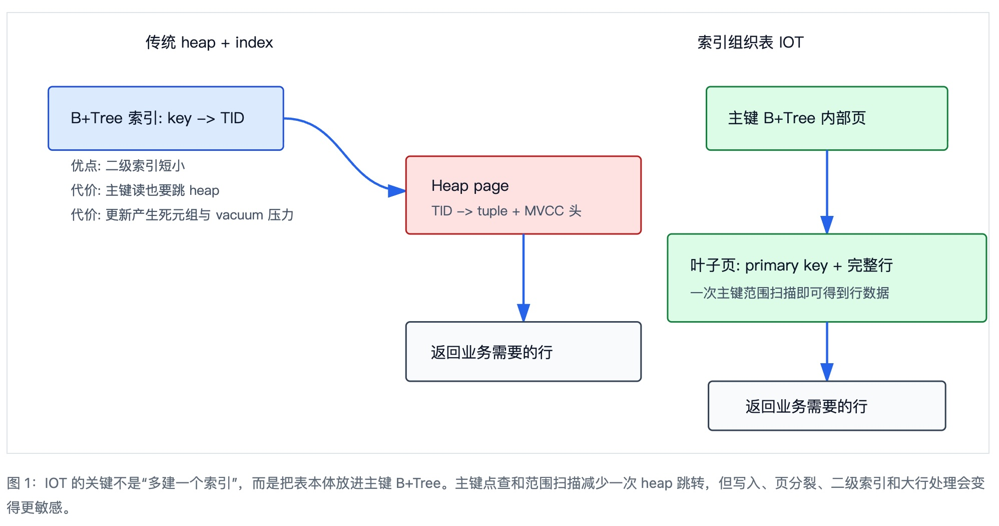
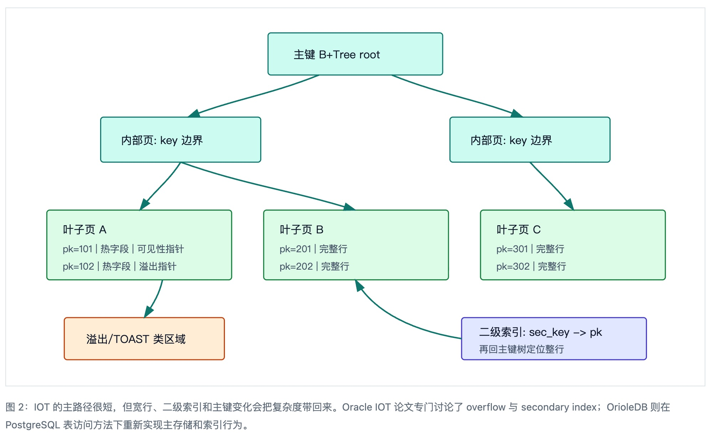
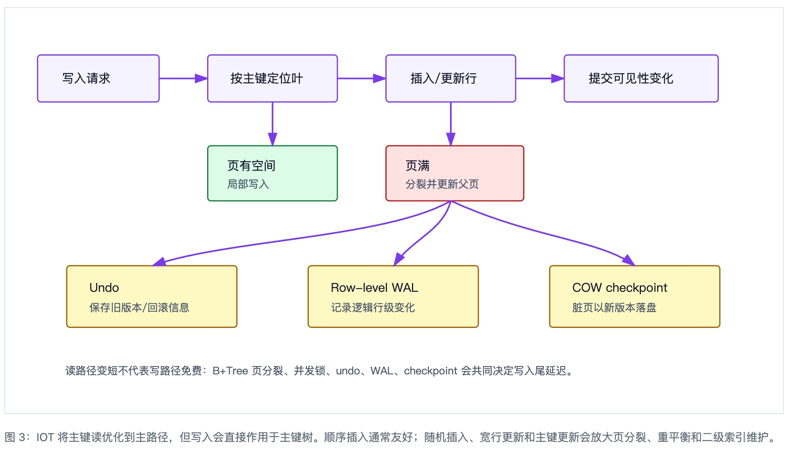
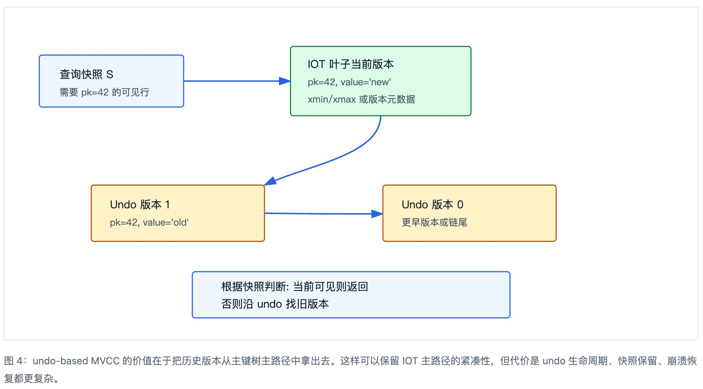
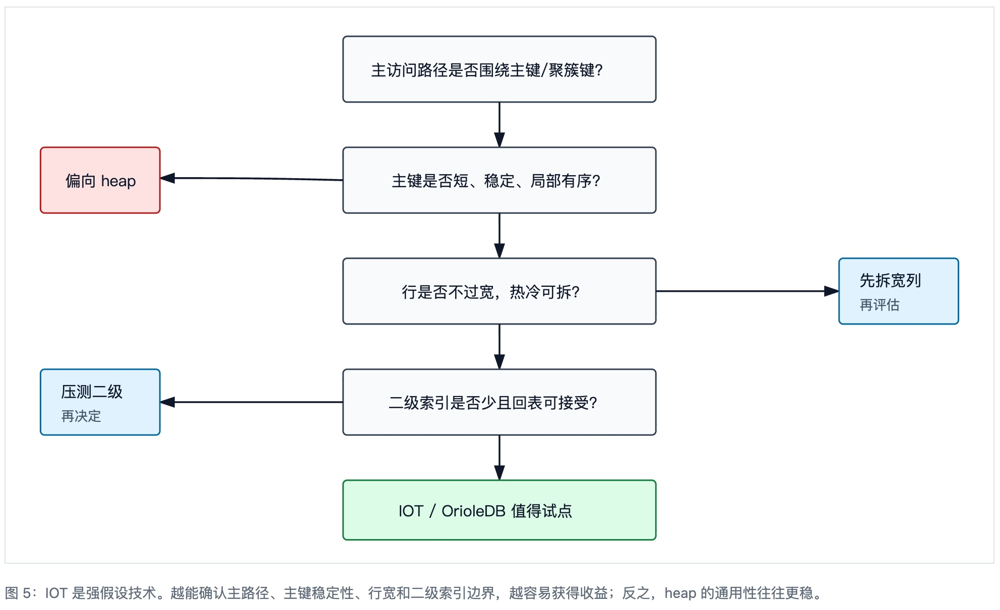

## 数据库筑基课 - 索引组织表(Index-Organized Table, IOT)   
                                                                                            
### 作者                                                                
digoal                                                                
                                                                       
### 日期                                                                     
2026-05-24                                                      
                                                                    
### 标签                                                                  
PostgreSQL , OrioleDB , Oracle IOT , B+Tree , 表存储 , 索引结构 , MVCC , 数据库筑基课    
                                                                                           
----                                                                    

## 背景

本节属于“表存储”和“索引结构”的交叉基础能力。课程大纲链接未在输入资料中提供，因此本文先从工程问题切入：如果业务访问路径长期围绕主键或天然聚簇键展开，为什么还要让数据先落在 heap，再通过索引二次跳转到 heap？这一次跳转看似只是一次定位，实质上会放大缓存压力、随机 IO、MVCC 可见性判断和索引维护成本。

索引组织表(Index-Organized Table, IOT)的核心思路是：表不再以 heap 作为主存储，表行按照主键顺序直接存放在 B+Tree 的叶子页里。Oracle 8i 的 IOT 论文把它定义为“表数据按主键组织在 B-tree index 中”，并讨论了溢出段、二级索引、对象表、嵌套表等新应用域。OrioleDB 则把这个方向带入 PostgreSQL 扩展生态：本地源码的 `sql/orioledb--1.0_prod.sql` 第 9-15 行注册了 `orioledb` table access method；`doc/architecture/overview.mdx` 第 8、12、21、25 行明确说明 OrioleDB 使用 index-organized tables，主键索引叶子元组就是表行，二级索引通过逻辑值与主键树连接。

    <svg viewBox="0 0 960 430" role="img" aria-labelledby="fig1-title fig1-desc">
      <title id="fig1-title">Heap 表与索引组织表的定位路径对比</title>
      <desc id="fig1-desc">左侧展示传统二级索引先找到 TID 再访问 heap 行；右侧展示 IOT 通过主键 B+Tree 叶子直接得到整行。</desc>
      <defs>
        <marker id="arrow1" markerWidth="10" markerHeight="10" refX="8" refY="3" orient="auto" markerUnits="strokeWidth">
          <path d="M0,0 L0,6 L9,3 z" fill="#2563eb"></path>
        </marker>
        <style>
          .box{fill:#f8fafc;stroke:#334155;stroke-width:1.5}
          .idx{fill:#dbeafe;stroke:#1d4ed8;stroke-width:1.5}
          .heap{fill:#fee2e2;stroke:#b91c1c;stroke-width:1.5}
          .iot{fill:#dcfce7;stroke:#15803d;stroke-width:1.5}
          .txt{font:15px sans-serif;fill:#0f172a}
          .small{font:13px sans-serif;fill:#475569}
          .line{stroke:#2563eb;stroke-width:2.2;fill:none;marker-end:url(#arrow1)}
        </style>
      </defs>
      <text x="135" y="34" class="txt">传统 heap + index</text>
      <rect x="40" y="72" width="230" height="62" rx="4" class="idx"></rect>
      <text x="62" y="108" class="txt">B+Tree 索引: key -> TID</text>
      <path d="M270 103 C330 103 330 174 390 174" class="line"></path>
      <rect x="390" y="140" width="230" height="76" rx="4" class="heap"></rect>
      <text x="415" y="174" class="txt">Heap page</text>
      <text x="415" y="198" class="small">TID -> tuple + MVCC 头</text>
      <path d="M505 216 C505 262 505 266 505 302" class="line"></path>
      <rect x="390" y="302" width="230" height="58" rx="4" class="box"></rect>
      <text x="414" y="337" class="txt">返回业务需要的行</text>
      <text x="62" y="154" class="small">优点: 二级索引短小</text>
      <text x="62" y="178" class="small">代价: 主键读也要跳 heap</text>
      <text x="62" y="202" class="small">代价: 更新产生死元组与 vacuum 压力</text>
      <text x="675" y="34" class="txt">索引组织表 IOT</text>
      <rect x="684" y="72" width="236" height="62" rx="4" class="iot"></rect>
      <text x="705" y="108" class="txt">主键 B+Tree 内部页</text>
      <path d="M802 134 C802 170 802 185 802 216" class="line"></path>
      <rect x="646" y="216" width="312" height="86" rx="4" class="iot"></rect>
      <text x="668" y="252" class="txt">叶子页: primary key + 完整行</text>
      <text x="668" y="278" class="small">一次主键范围扫描即可得到行数据</text>
      <path d="M802 302 C802 328 802 334 802 360" class="line"></path>
      <rect x="686" y="360" width="232" height="48" rx="4" class="box"></rect>
      <text x="722" y="390" class="txt">返回业务需要的行</text>
    </svg>
  
  

## 一、它解决什么问题？

传统 PostgreSQL heap 表的物理位置由 heap block 和 tuple offset 决定，B-tree 索引叶子保存的是指向 heap tuple 的 TID。这个模型有很强的通用性：没有主键也能存，更新通常可以在 heap 层追加新版本，二级索引不必保存整行。但是当 workload 主要是“按主键点查、按主键范围读、按业务聚簇键翻页、按时间线连续扫描”时，heap 模型会出现几个具体痛点：

- **读放大：** 索引页命中后，还要访问 heap 页，缓存局部性被拆成两套结构。
- **空间放大：** 主键索引保存 key + TID，heap 另存完整行；多个索引会继续叠加。
- **维护放大：** MVCC 更新产生旧版本，vacuum 要回收 heap 和索引里的垃圾引用。
- **顺序业务不顺序：** 逻辑主键相邻的行，在 heap 中不一定物理相邻，范围扫描可能变成索引有序、heap 随机。

IOT 把问题转换成：是否愿意牺牲一部分写入简单性、二级索引轻量性和非主键访问弹性，换取主键路径上的更强局部性和更少跳转。Oracle 8i 的 IOT 论文强调，IOT 对主键访问、范围扫描和空间利用有优势，同时需要处理行溢出、二级索引定位、主键更新等问题。OrioleDB 的设计进一步把 IOT 与 undo MVCC、row-level WAL、copy-on-write checkpoint 放在一起，试图减少 heap 传统 vacuum 负担。

## 二、它是什么？

索引组织表是以主键 B+Tree 作为表主存储的数据组织方式。内部节点保存分隔 key 和指向子页的下行指针，叶子节点保存按主键排序的表行。换句话说，主键不是“表外面的访问结构”，而是“表本身的物理组织方式”。

这个定义有三个容易混淆的点：

- **IOT 不等于普通索引：** 普通索引用来找行；IOT 的主键树直接存行。
- **IOT 不等于只有主键：** 仍然可以有二级索引，只是二级索引通常不能再简单保存 heap TID，而要保存主键值、逻辑行标识或可修正的物理猜测。
- **IOT 不自动更快：** 只有访问路径、行宽、更新模式、主键稳定性与 B+Tree 组织匹配时才会更好。

B-tree 之所以能承担这个角色，是因为它是数据库和文件系统里最常见的外存搜索树之一。《The Ubiquitous B-Tree》把 B-tree 放在外存索引结构的核心位置讨论：高扇出降低树高，节点按页组织，点查和范围扫描都能稳定工作。IOT 只是把“索引叶子指向数据”改成“索引叶子就是数据”。

    <svg viewBox="0 0 960 520" role="img" aria-labelledby="fig2-title fig2-desc">
      <title id="fig2-title">IOT 主键树、溢出存储与二级索引</title>
      <desc id="fig2-desc">展示 IOT 的主键 B+Tree 存储完整行，宽行可把冷字段放到溢出区域，二级索引通过主键或逻辑行标识回到主树。</desc>
      <defs>
        <marker id="arrow2" markerWidth="10" markerHeight="10" refX="8" refY="3" orient="auto" markerUnits="strokeWidth">
          <path d="M0,0 L0,6 L9,3 z" fill="#0f766e"></path>
        </marker>
        <style>
          .root{fill:#ccfbf1;stroke:#0f766e;stroke-width:1.5}
          .leaf{fill:#dcfce7;stroke:#15803d;stroke-width:1.5}
          .sec{fill:#e0e7ff;stroke:#4338ca;stroke-width:1.5}
          .ov{fill:#ffedd5;stroke:#c2410c;stroke-width:1.5}
          .txt2{font:15px sans-serif;fill:#0f172a}
          .small2{font:13px sans-serif;fill:#475569}
          .line2{stroke:#0f766e;stroke-width:2;fill:none;marker-end:url(#arrow2)}
        </style>
      </defs>
      <rect x="360" y="34" width="240" height="58" rx="4" class="root"></rect>
      <text x="395" y="69" class="txt2">主键 B+Tree root</text>
      <rect x="130" y="150" width="220" height="62" rx="4" class="root"></rect>
      <text x="158" y="187" class="txt2">内部页: key 边界</text>
      <rect x="610" y="150" width="220" height="62" rx="4" class="root"></rect>
      <text x="638" y="187" class="txt2">内部页: key 边界</text>
      <path d="M430 92 C360 120 310 126 250 150" class="line2"></path>
      <path d="M530 92 C600 120 650 126 710 150" class="line2"></path>
      <rect x="56" y="278" width="254" height="96" rx="4" class="leaf"></rect>
      <text x="78" y="310" class="txt2">叶子页 A</text>
      <text x="78" y="336" class="small2">pk=101 | 热字段 | 可见性指针</text>
      <text x="78" y="360" class="small2">pk=102 | 热字段 | 溢出指针</text>
      <rect x="354" y="278" width="254" height="96" rx="4" class="leaf"></rect>
      <text x="376" y="310" class="txt2">叶子页 B</text>
      <text x="376" y="336" class="small2">pk=201 | 完整行</text>
      <text x="376" y="360" class="small2">pk=202 | 完整行</text>
      <rect x="652" y="278" width="254" height="96" rx="4" class="leaf"></rect>
      <text x="674" y="310" class="txt2">叶子页 C</text>
      <text x="674" y="336" class="small2">pk=301 | 完整行</text>
      <text x="674" y="360" class="small2">pk=302 | 完整行</text>
      <path d="M240 212 C222 240 205 250 184 278" class="line2"></path>
      <path d="M240 212 C330 244 390 250 480 278" class="line2"></path>
      <path d="M720 212 C744 238 760 250 780 278" class="line2"></path>
      <rect x="80" y="426" width="220" height="58" rx="4" class="ov"></rect>
      <text x="110" y="461" class="txt2">溢出/TOAST 类区域</text>
      <path d="M215 374 C210 396 202 407 190 426" class="line2"></path>
      <rect x="626" y="426" width="254" height="58" rx="4" class="sec"></rect>
      <text x="650" y="451" class="txt2">二级索引: sec_key -> pk</text>
      <text x="650" y="474" class="small2">再回主键树定位整行</text>
      <path d="M626 455 C545 442 500 410 480 374" class="line2"></path>
    </svg>
  
  

## 三、核心原理

### 1. B+Tree 为什么适合做表本体？

B+Tree 的外存友好性来自三个性质：第一，节点大小通常贴近页大小，单次 IO 搬运多个 key；第二，高扇出让树高较低；第三，叶子层天然按 key 排序，适合范围扫描。Comer 的 B-tree 综述强调了 B-tree 在文件组织和数据库索引中的普遍性；Lehman 与 Yao 的 B-link tree 思路则解决了高并发下页分裂与搜索路径稳定性问题，通过右链接和 high key 让并发搜索在结构变化时仍能前进。

IOT 利用这些性质，把点查变成“root -> internal -> leaf -> row”，把范围查变成“定位第一个 leaf 后沿叶子链扫描”。因此它特别适合主键有序、范围访问稳定、行相对不宽、更新不过度打乱主键顺序的表。

### 2. OrioleDB 中的 IOT 取向

OrioleDB 的本地 README 和架构文档把它描述为 PostgreSQL 的新存储引擎，目标包括：使用 undo log 处理 MVCC，减少主存储中的旧版本膨胀；使用 row-level WAL；通过 copy-on-write checkpoint 获得结构一致的树快照。`doc/architecture/overview.mdx` 第 105-145 行把 undo、row-level WAL、TOAST tree、primary key tree、secondary keys trees 的关系放在同一套恢复模型里；`include/orioledb.h` 第 173-183 行也能看到 OrioleDB 明确定义了 toast、primary、unique、regular 等索引类型。

这说明 OrioleDB 不是简单给 PostgreSQL 增加一种索引，而是以 table access method 的方式接管表的物理组织、MVCC 存储、写前日志和检查点路径。`src/tableam/handler.c` 第 2476-2529 行列出了 OrioleDB 接入 PostgreSQL table AM 的 scan、index fetch、insert、delete、update、vacuum、relation_size 等回调。对 IOT 主题来说，最重要的工程启发是：一旦主键树变成表本体，MVCC、WAL、checkpoint、vacuum、二级索引都不能再沿用 heap 的简单假设。

    <svg viewBox="0 0 960 500" role="img" aria-labelledby="fig3-title fig3-desc">
      <title id="fig3-title">IOT 中一次主键写入的结构影响</title>
      <desc id="fig3-desc">展示写入或更新在 IOT 中经过定位、页内插入、可能页分裂、undo/WAL 记录和 checkpoint 刷新的路径。</desc>
      <defs>
        <marker id="arrow3" markerWidth="10" markerHeight="10" refX="8" refY="3" orient="auto" markerUnits="strokeWidth">
          <path d="M0,0 L0,6 L9,3 z" fill="#7c3aed"></path>
        </marker>
        <style>
          .stage{fill:#f5f3ff;stroke:#7c3aed;stroke-width:1.5}
          .side{fill:#fef9c3;stroke:#a16207;stroke-width:1.5}
          .bad{fill:#fee2e2;stroke:#b91c1c;stroke-width:1.5}
          .ok{fill:#dcfce7;stroke:#15803d;stroke-width:1.5}
          .txt3{font:15px sans-serif;fill:#0f172a}
          .small3{font:13px sans-serif;fill:#475569}
          .line3{stroke:#7c3aed;stroke-width:2;fill:none;marker-end:url(#arrow3)}
        </style>
      </defs>
      <rect x="40" y="58" width="150" height="58" rx="4" class="stage"></rect>
      <text x="70" y="92" class="txt3">写入请求</text>
      <path d="M190 87 L250 87" class="line3"></path>
      <rect x="250" y="58" width="160" height="58" rx="4" class="stage"></rect>
      <text x="278" y="92" class="txt3">按主键定位叶</text>
      <path d="M410 87 L470 87" class="line3"></path>
      <rect x="470" y="58" width="160" height="58" rx="4" class="stage"></rect>
      <text x="500" y="92" class="txt3">插入/更新行</text>
      <path d="M630 87 L690 87" class="line3"></path>
      <rect x="690" y="58" width="190" height="58" rx="4" class="stage"></rect>
      <text x="720" y="92" class="txt3">提交可见性变化</text>
      <rect x="250" y="170" width="160" height="68" rx="4" class="ok"></rect>
      <text x="274" y="200" class="txt3">页有空间</text>
      <text x="274" y="222" class="small3">局部写入</text>
      <path d="M330 116 L330 170" class="line3"></path>
      <rect x="470" y="170" width="170" height="68" rx="4" class="bad"></rect>
      <text x="494" y="200" class="txt3">页满</text>
      <text x="494" y="222" class="small3">分裂并更新父页</text>
      <path d="M550 116 L550 170" class="line3"></path>
      <rect x="76" y="318" width="210" height="76" rx="4" class="side"></rect>
      <text x="104" y="350" class="txt3">Undo</text>
      <text x="104" y="374" class="small3">保存旧版本/回滚信息</text>
      <rect x="374" y="318" width="210" height="76" rx="4" class="side"></rect>
      <text x="402" y="350" class="txt3">Row-level WAL</text>
      <text x="402" y="374" class="small3">记录逻辑行级变化</text>
      <rect x="672" y="318" width="210" height="76" rx="4" class="side"></rect>
      <text x="700" y="350" class="txt3">COW checkpoint</text>
      <text x="700" y="374" class="small3">脏页以新版本落盘</text>
      <path d="M550 238 C470 284 270 286 182 318" class="line3"></path>
      <path d="M550 238 C540 276 500 286 480 318" class="line3"></path>
      <path d="M550 238 C650 284 735 286 777 318" class="line3"></path>
      <text x="74" y="452" class="small3">读路径变短不代表写路径免费：B+Tree 页分裂、并发锁、undo、WAL、checkpoint 会共同决定写入尾延迟。</text>
    </svg>
  
  

### 3. MVCC 与 undo：为什么 IOT 更需要重新设计版本存储？

heap 模型里，新版本通常追加到 heap，索引再指向可见版本或通过链式关系判断可见性。IOT 中主键树叶子既是定位结构又是数据结构，如果把所有历史版本都塞进主树叶子，热更新会直接污染主键树；如果把历史版本外置，就需要 undo 或版本链来支撑快照读与回滚。OrioleDB 架构文档明确说事务和 MVCC 使用 UNDO log，row-level undo records 组成行版本链，头部在数据页，其余元素在 undo log 中；`include/orioledb.h` 第 203-224 行把 undo 分成 row-level regular、page-level regular 和 system 三类。这个设计与 IOT 的冲突点相匹配：当前版本保留在主键树上，旧版本和回滚信息交给 undo 管理。

    <svg viewBox="0 0 960 460" role="img" aria-labelledby="fig4-title fig4-desc">
      <title id="fig4-title">IOT 与 undo MVCC 的可见性路径</title>
      <desc id="fig4-desc">展示当前版本位于主键树叶子，旧版本位于 undo 链，快照读根据事务时间选择当前版本或旧版本。</desc>
      <defs>
        <marker id="arrow4" markerWidth="10" markerHeight="10" refX="8" refY="3" orient="auto" markerUnits="strokeWidth">
          <path d="M0,0 L0,6 L9,3 z" fill="#2563eb"></path>
        </marker>
        <style>
          .snap{fill:#eff6ff;stroke:#2563eb;stroke-width:1.5}
          .leaf4{fill:#dcfce7;stroke:#15803d;stroke-width:1.5}
          .undo{fill:#fef3c7;stroke:#b45309;stroke-width:1.5}
          .txt4{font:15px sans-serif;fill:#0f172a}
          .small4{font:13px sans-serif;fill:#475569}
          .line4{stroke:#2563eb;stroke-width:2;fill:none;marker-end:url(#arrow4)}
        </style>
      </defs>
      <rect x="48" y="66" width="200" height="72" rx="4" class="snap"></rect>
      <text x="76" y="98" class="txt4">查询快照 S</text>
      <text x="76" y="122" class="small4">需要 pk=42 的可见行</text>
      <path d="M248 102 C320 102 340 102 396 102" class="line4"></path>
      <rect x="396" y="54" width="250" height="96" rx="4" class="leaf4"></rect>
      <text x="420" y="84" class="txt4">IOT 叶子当前版本</text>
      <text x="420" y="108" class="small4">pk=42, value='new'</text>
      <text x="420" y="132" class="small4">xmin/xmax 或版本元数据</text>
      <path d="M521 150 C520 205 420 218 360 246" class="line4"></path>
      <rect x="120" y="246" width="240" height="78" rx="4" class="undo"></rect>
      <text x="146" y="278" class="txt4">Undo 版本 1</text>
      <text x="146" y="302" class="small4">pk=42, value='old'</text>
      <path d="M360 285 C430 286 464 286 524 286" class="line4"></path>
      <rect x="524" y="246" width="240" height="78" rx="4" class="undo"></rect>
      <text x="550" y="278" class="txt4">Undo 版本 0</text>
      <text x="550" y="302" class="small4">更早版本或链尾</text>
      <rect x="260" y="366" width="440" height="64" rx="4" class="snap"></rect>
      <text x="300" y="392" class="txt4">根据快照判断: 当前可见则返回</text>
      <text x="300" y="416" class="txt4">否则沿 undo 找旧版本</text>
    </svg>
  
  

## 四、横向对比

| 维度 | IOT / OrioleDB 取向 | PostgreSQL heap + B-tree | Oracle IOT |
| --- | --- | --- | --- |
| 主要目标 | 让主键 B+Tree 成为表本体，主键点查/范围读更短；OrioleDB 还希望降低 vacuum 与 WAL 放大。 | 通用 heap 存储，索引用 TID 定位 tuple，适配无主键、多索引和频繁更新。 | 将表行按主键存储在 B-tree index 中，面向主键访问、范围访问和空间效率。 |
| 写入代价 | 插入要维护主键树；随机插入可能页分裂；更新可能触发 undo、二级索引维护和 COW 写放大。 | heap 追加较自然；但索引也要维护，旧版本需要 vacuum 回收。 | 主键树维护成本明确；宽行和溢出段需要额外管理。 |
| 读取代价 | 主键路径少一次 heap 跳转；二级索引通常要回主键树。 | 索引扫描后常要访问 heap；index-only scan 依赖可见性条件。 | 主键查询和范围扫描是核心优势；二级索引可能使用逻辑 rowid 和物理猜测。 |
| 空间成本 | 主键树保存行，避免 heap + 主键索引双写；但二级索引可能保存主键，宽主键会放大。 | heap 保存行，索引保存 key + TID；多索引空间成本可预测但总量不低。 | 通过 overflow 控制宽行；二级索引设计决定额外空间。 |
| 事务/MVCC | OrioleDB 使用 undo-based MVCC，目标是减少 vacuum 依赖。 | tuple 多版本位于 heap，vacuum 是生命周期核心。 | Oracle 体系中 undo 是一致性读和回滚基础，与 IOT 配合使用。 |
| 适合场景 | 主键点查、主键范围扫描、顺序写入、冷热分明、希望降低 vacuum 压力的 OLTP 表。 | 访问路径多变、无稳定聚簇键、频繁非主键更新、需要最大 PostgreSQL 兼容性的表。 | 主键访问主导、对象表/嵌套表/空间或文本域中需要聚簇主路径的场景。 |
| 不适合场景 | 宽随机主键、主键频繁变化、二级索引很多、行很宽且更新频繁、扩展兼容性要求极高。 | 主键范围读极重且 heap 随机跳转成为瓶颈的表。 | 与 IOT 通用限制类似：主键不稳定、宽行和二级索引密集时收益下降。 |

这个表的重点不是判断谁先进，而是判断“主访问路径是否值得变成物理组织”。heap 是最通用的底座；IOT 是把主键路径优化到极致后的专用底座。OrioleDB 的特别之处，是它没有只复制 Oracle IOT，而是试图在 PostgreSQL 扩展边界内重做表访问方法、MVCC 和恢复路径。

## 五、效果如何？

IOT 的收益要按 workload 拆开看，不能用“索引组织表更快”这种一句话概括。

- **主键点查：** 通常减少一次 heap 访问。行较窄、缓存命中较好时收益可能不明显；随机 IO 或缓存紧张时收益更明显。
- **主键范围扫描：** 叶子页顺序性更好，尤其适合订单流水、时间线、租户内序列号这类天然顺序访问。
- **插入：** 顺序主键友好；随机主键会让页分裂和缓存污染变多。
- **更新：** 非主键小字段更新如果能保持当前位置，代价可控；主键更新接近“删除旧 key + 插入新 key”，代价高。
- **二级索引：** 二级索引回表路径从 heap TID 变成主键或逻辑定位，宽主键会让二级索引膨胀。
- **vacuum/undo：** OrioleDB 的 undo MVCC 目标是减少 vacuum 依赖，但这不是免费午餐，长事务会延长 undo 保留，恢复逻辑也更复杂。

本地源码和文档没有给出可直接复现本文结论的一组统一 benchmark，因此本文不编造吞吐或延迟数字。生产评估应该用自己的 schema、索引、行宽、事务长度、主键分布和热点比例做压测。还要注意 README 的状态说明：当前 OrioleDB 是 public beta，推荐用于实验、测试和 benchmark，不推荐直接生产使用。

## 六、实操 DEMO

以下 SQL 是最小验证思路，当前环境没有运行 OrioleDB 实例，因此未执行。请在已安装 OrioleDB 扩展的 PostgreSQL 环境中验证，实际语法以 OrioleDB 当前版本文档为准。

```sql
-- 1. 创建扩展
CREATE EXTENSION IF NOT EXISTS orioledb;

-- 2. 用 OrioleDB table access method 创建表
CREATE TABLE iot_order_event (
  tenant_id   bigint      NOT NULL,
  event_id    bigint      NOT NULL,
  event_ts    timestamptz NOT NULL,
  status      text        NOT NULL,
  payload     jsonb,
  PRIMARY KEY (tenant_id, event_id)
) USING orioledb;

-- 3. 主键范围查询: IOT 最核心的验证路径
EXPLAIN (ANALYZE, BUFFERS)
SELECT event_id, event_ts, status
FROM iot_order_event
WHERE tenant_id = 42
  AND event_id BETWEEN 100000 AND 101000
ORDER BY tenant_id, event_id;

-- 4. 二级索引回表路径: 观察二级索引条件下的计划与 IO
CREATE INDEX ON iot_order_event (tenant_id, status, event_ts);

EXPLAIN (ANALYZE, BUFFERS)
SELECT event_id, event_ts, payload
FROM iot_order_event
WHERE tenant_id = 42
  AND status = 'paid'
ORDER BY event_ts DESC
LIMIT 50;
```

验证时不要只看耗时。至少要同时看：访问方法、buffer 命中、read block 数、WAL 量、表和索引大小、长事务下 undo 保留、批量更新后的空间回收情况。IOT 的优势通常体现在主键路径和 vacuum 压力上；它的风险通常暴露在二级索引、随机写和宽行更新上。

## 七、最佳实践

### 面向数据库架构师

- 先选主路径，再选存储组织。只有当主键/聚簇键访问占主要业务价值时，IOT 才值得进入候选。
- 让主键短、稳定、递增或局部递增。宽主键会进入主树和二级索引，更新主键会破坏 IOT 的基本收益。
- 把宽冷字段从主路径中拆出去。可以用垂直拆表、对象存储、TOAST/溢出类机制降低叶子页膨胀。

### 面向 DBA

- 监控页分裂、WAL、checkpoint 抖动、undo 保留和长事务。IOT 的运维核心不是 vacuum 一项，而是版本生命周期与树结构变化。
- 压测二级索引查询，不要只压主键查询。许多 IOT 事故来自“主键路径很美，业务实际走二级索引”。
- 升级前确认扩展兼容性。OrioleDB 是 PostgreSQL 扩展和 table access method，不等于 PostgreSQL heap 的全量行为复制。

### 面向业务开发者

- 避免频繁改主键。把可变业务状态放在普通列，把稳定身份放在主键。
- 分页尽量沿主键或聚簇键走，不要用大 offset 扫二级索引再回表。
- 用真实查询形态验收：点查、范围查、状态查、最近 N 条、批量更新、删除归档，都要覆盖。

    <svg viewBox="0 0 960 540" role="img" aria-labelledby="fig5-title fig5-desc">
      <title id="fig5-title">是否选择 IOT 的决策路径</title>
      <desc id="fig5-desc">从访问路径、主键稳定性、行宽、二级索引和运维约束五个问题判断是否适合选择 IOT。</desc>
      <defs>
        <marker id="arrow5" markerWidth="10" markerHeight="10" refX="8" refY="3" orient="auto" markerUnits="strokeWidth">
          <path d="M0,0 L0,6 L9,3 z" fill="#0f172a"></path>
        </marker>
        <style>
          .q{fill:#f8fafc;stroke:#334155;stroke-width:1.5}
          .yes{fill:#dcfce7;stroke:#15803d;stroke-width:1.5}
          .no{fill:#fee2e2;stroke:#b91c1c;stroke-width:1.5}
          .mid{fill:#e0f2fe;stroke:#0369a1;stroke-width:1.5}
          .txt5{font:15px sans-serif;fill:#0f172a}
          .small5{font:13px sans-serif;fill:#475569}
          .line5{stroke:#0f172a;stroke-width:1.8;fill:none;marker-end:url(#arrow5)}
        </style>
      </defs>
      <rect x="328" y="28" width="304" height="64" rx="4" class="q"></rect>
      <text x="355" y="66" class="txt5">主访问路径是否围绕主键/聚簇键?</text>
      <path d="M480 92 L480 136" class="line5"></path>
      <rect x="328" y="136" width="304" height="64" rx="4" class="q"></rect>
      <text x="375" y="174" class="txt5">主键是否短、稳定、局部有序?</text>
      <path d="M328 168 C250 166 220 166 150 166" class="line5"></path>
      <rect x="34" y="136" width="116" height="64" rx="4" class="no"></rect>
      <text x="58" y="174" class="txt5">偏向 heap</text>
      <path d="M480 200 L480 244" class="line5"></path>
      <rect x="328" y="244" width="304" height="64" rx="4" class="q"></rect>
      <text x="385" y="282" class="txt5">行是否不过宽，热冷可拆?</text>
      <path d="M632 276 C710 276 740 276 810 276" class="line5"></path>
      <rect x="810" y="244" width="116" height="64" rx="4" class="mid"></rect>
      <text x="830" y="271" class="txt5">先拆宽列</text>
      <text x="830" y="294" class="small5">再评估</text>
      <path d="M480 308 L480 352" class="line5"></path>
      <rect x="328" y="352" width="304" height="64" rx="4" class="q"></rect>
      <text x="372" y="390" class="txt5">二级索引是否少且回表可接受?</text>
      <path d="M328 384 C250 384 220 384 150 384" class="line5"></path>
      <rect x="34" y="352" width="116" height="64" rx="4" class="mid"></rect>
      <text x="54" y="379" class="txt5">压测二级</text>
      <text x="54" y="402" class="small5">再决定</text>
      <path d="M480 416 L480 460" class="line5"></path>
      <rect x="328" y="460" width="304" height="58" rx="4" class="yes"></rect>
      <text x="382" y="495" class="txt5">IOT / OrioleDB 值得试点</text>
    </svg>
  
  
  
## 八、适合与不适合场景

### 适合

- **租户内流水：** `(tenant_id, event_id)` 或 `(tenant_id, ts)` 作为主键，常做租户内连续扫描。
- **账户余额/订单主表：** 主键点查极重，行不宽，状态更新不改变主键。
- **冷热明确的事件表：** 热字段沿主键读写，冷 payload 可拆分或溢出。
- **vacuum 压力很重的 OLTP：** 愿意评估 OrioleDB undo MVCC 与 PostgreSQL 兼容边界。

### 不适合

- **随机 UUID 主键且写入极高：** 页分裂和缓存局部性可能抵消主键读收益。
- **主键经常变：** IOT 中主键变化接近行搬迁。OrioleDB 文档和源码都能看到这一点：`doc/architecture/row-level-concurrency.mdx` 第 12 行说明主键更新按 delete + insert 实现，`src/tableam/operations.c` 第 1358-1367 行也把主键不变的 overwrite 路径和主键变化的 reinsert 路径分开。
- **二级索引很多：** 二级索引保存主键会放大空间，回表也未必便宜。
- **宽行频繁更新：** 叶子页膨胀、溢出管理和写放大都会加重。
- **强依赖 PostgreSQL heap 生态特性：** 某些扩展、工具、运维经验可能默认 heap 行为。

## 九、常见坑

1. **把 IOT 当成“免费的聚簇索引”。** 它不是多一个索引，而是换了表本体，恢复、MVCC、二级索引都会受影响。
2. **主键太宽。** 主键不只出现在主树，还可能进入每个二级索引。
3. **只测主键点查。** 生产中二级索引、分页、批量更新、归档删除往往才是瓶颈。
4. **忽视长事务。** undo MVCC 仍然要处理旧版本生命周期，长事务会推迟清理。
5. **把 Oracle IOT 经验直接搬到 PostgreSQL 扩展。** 概念相通，但 redo/undo、优化器、锁、工具链和兼容性边界不同。
6. **没有回退方案。** 引入 OrioleDB 这类新存储引擎前，应保留 heap 表结构、迁移脚本、压测报告和版本回退窗口。

## 十、扩展问题

1. 如果二级索引保存主键而不是 TID，宽复合主键会怎样影响每个二级索引的大小？
2. 主键范围扫描很快，但按状态查询很慢时，是应该加二级索引、改主键，还是拆冷热表？
3. undo-based MVCC 减少 vacuum 依赖后，新的瓶颈会落在 undo 保留、checkpoint，还是恢复时间？
4. B-link tree 的 right-link/high-key 思想如何帮助并发页分裂下的读路径保持正确？
5. IOT 与 LSM-tree 都在改变读写放大结构：一个优化主键读路径，一个优化顺序写路径，如何按 workload 取舍？

## 十一、扩展阅读

- `orioledb/README.md`：OrioleDB 项目定位、public beta 状态、table access method 使用方式、undo、row-level WAL、copy-on-write checkpoint 的总体说明。
- `orioledb/doc/architecture/overview.mdx`：本地架构文档，说明 index-organized tables、主键叶子元组是表行、二级索引元组包含二级键和主键、undo、checkpoint、row-level WAL、TOAST/primary/secondary tree 关系。
- `orioledb/doc/architecture/row-level-concurrency.mdx`：本地并发文档，说明 OrioleDB 因 index-organized table 带来的主键更新并发差异。
- `orioledb/src/tableam/index_scan.c`：本地源码显示二级索引扫描取出主键 key bound 后回 primary tree 查找原始 tuple。
- `orioledb/include/tableam/descr.h`：本地源码说明 secondary index tuple 尾部包含 primary key values，并处理与主键共享属性时的空间节省。
- [DeepWiki: orioledb/orioledb](https://deepwiki.com/orioledb/orioledb)：作为源码导航辅助，重要结论已回到本地源码和文档核验。
- [Oracle8i Index-Organized Table and its Application to New Domains](https://www.vldb.org/conf/2000/P285.pdf)：Oracle IOT 的定义、overflow、secondary index 和应用域。
- [The Ubiquitous B-Tree](https://dl.acm.org/doi/10.1145/356770.356776)：B-tree 作为外存索引结构的经典综述。
- [Efficient Locking for Concurrent Operations on B-Trees](https://dl.acm.org/doi/10.1145/319628.319663)：B-link tree、right link 和 high key 背后的并发 B-tree 思路。
- [PostgreSQL Table Access Method Interface](https://www.postgresql.org/docs/current/tableam.html)：理解 OrioleDB 作为 PostgreSQL table access method 的接口背景。

验证声明：本文 SQL 示例未执行；性能数字未编造。关于 OrioleDB 的实现细节，本文已优先依据当前项目 `orioledb` 下的 README、架构文档和源码进行核验；具体生产行为仍应以目标 OrioleDB 版本源码、文档和本地压测为准。
  
  
#### [PostgreSQL 解决方案集合](../201706/20170601_02.md "40cff096e9ed7122c512b35d8561d9c8")
  
  
#### [德哥 / digoal's Github - 公益是一辈子的事.](https://github.com/digoal/blog/blob/master/README.md "22709685feb7cab07d30f30387f0a9ae")
  
  
#### [About 德哥](https://github.com/digoal/blog/blob/master/me/readme.md "a37735981e7704886ffd590565582dd0")
  
  

  
