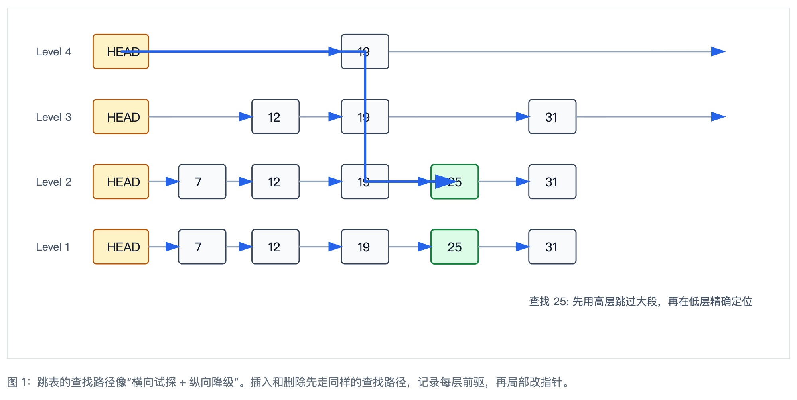
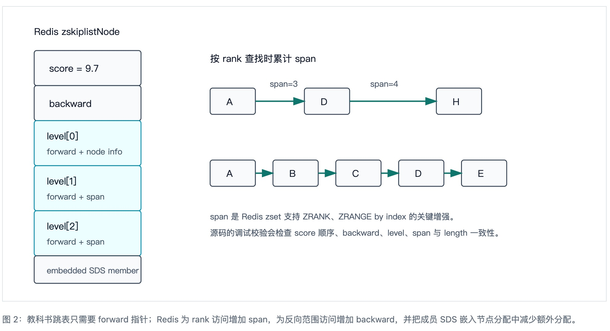
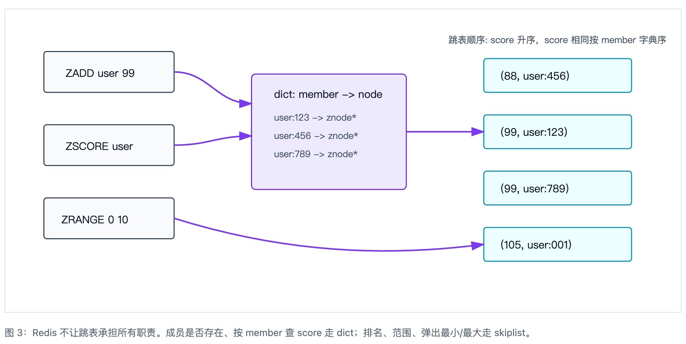
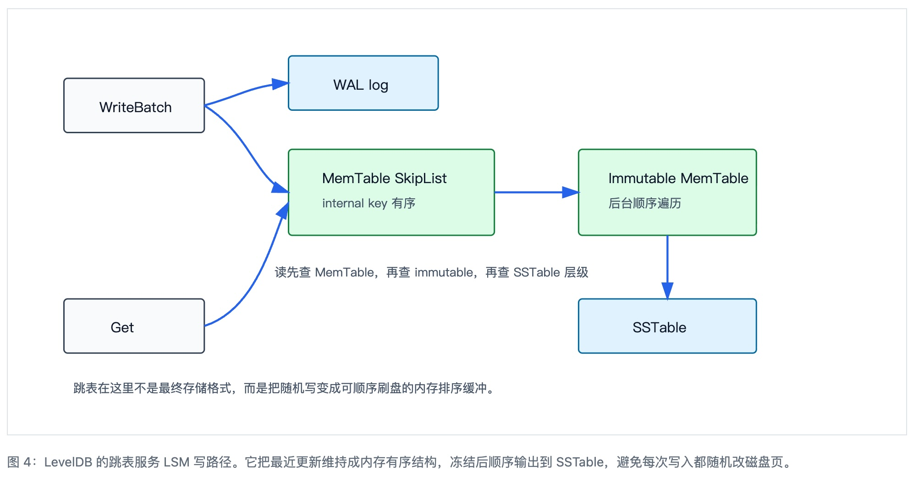

## 数据库筑基课 - 跳表(skip list)   
                                                                                            
### 作者                                                                
digoal                                                                
                                                                       
### 日期                                                                     
2026-05-24                                                      
                                                                    
### 标签                                                                  
PostgreSQL , Redis , LevelDB , RocksDB , LSM , MemTable , 有序集合 , 索引结构 , 数据库筑基课    
                                                                                           
----                                                                    

## 背景

本节属于“索引结构”和“内存表结构”的基础能力。课程大纲链接未在输入资料中提供，因此本文直接从工程问题切入：很多数据库系统需要维护一个随时可插入、可删除、可按顺序扫描的数据集合。平衡树能做这件事，但旋转、重平衡、并发修改和内存管理都不便宜；普通链表插入简单，却只能线性查找。

跳表(skip list)给了第三种选择：保留链表的局部拼接特性，用随机层高制造“高速通道”，让查找、插入、删除在期望意义上接近 `O(log N)`。William Pugh 在论文 *Skip Lists: A Probabilistic Alternative to Balanced Trees* 中把它定位为平衡树的概率替代方案：不通过旋转维持严格平衡，而是在插入节点时随机决定节点出现在多少层。

这不是只存在于教材里的结构。Redis 的有序集合在大对象编码下使用“哈希表 + 跳表”；LevelDB 的 MemTable 直接用跳表作为最近写入的有序内存结构。两者选择跳表的理由不同：Redis 需要同时支持按成员定位和按 score/rank/range 有序访问；LevelDB 需要一个追加写入友好、读路径可并发遍历、内存可整体释放的有序结构。

## 一、它解决什么问题？

如果只看抽象数据类型，跳表解决的是“动态有序字典”的问题：插入一个 key、删除一个 key、寻找第一个大于等于目标 key 的节点、从某个位置开始顺序扫描。数据库里这个问题会出现在多处：

- **排行榜、延迟队列、时间线：** 需要按 score 或时间排序，还要频繁更新单个成员。
- **LSM MemTable：** 写入先进入内存有序结构，刷盘时按 key 顺序生成 SSTable。
- **范围查询：** 先定位下界，再沿底层链表连续读出结果。
- **并发读写：** 节点插入只改局部指针，比树旋转更容易拆出单写多读或非阻塞读路径。

它牺牲的是严格最坏情况保证和缓存连续性。B+Tree 的节点是页，适合磁盘和 SSD 的块访问；跳表是指针结构，更适合内存。把跳表放到磁盘页上通常不是最自然的选择，除非再做块化、压缩或分层改造。

## 二、它是什么？

跳表是一组从稀疏到密集的有序链表。最底层包含所有节点；越往上层节点越少。查找时从最高层出发，能向右走就向右走，走过头之前下沉一层；到达底层后，当前位置的下一个节点就是候选结果。

节点层高通常服从几何分布。以概率 `p` 继续升高：所有节点都有第 1 层，约 `p` 的节点有第 2 层，约 `p^2` 的节点有第 3 层。Pugh 原文用 `p = 1/2` 解释算法；Redis 和 LevelDB 都使用 `p = 1/4`，只是常量命名不同：Redis 源码中 `ZSKIPLIST_P` 是 0.25，LevelDB 的 `kBranching` 是 4，也就是以 1/4 的概率升高。


<svg viewBox="0 0 960 430" role="img" aria-labelledby="fig1-title fig1-desc">
  <title id="fig1-title">跳表的分层链表与查找路径</title>
  <desc id="fig1-desc">跳表从最高层向右查找，遇到将超过目标的位置后下沉一层，最终在底层定位目标或插入点。</desc>
  <defs>
    <marker id="arrow" markerWidth="10" markerHeight="10" refX="8" refY="3" orient="auto" markerUnits="strokeWidth">
      <path d="M0,0 L0,6 L9,3 z" fill="#2563eb"></path>
    </marker>
    <style>
      .node{fill:#f8fafc;stroke:#334155;stroke-width:1.4}
      .head{fill:#fef3c7;stroke:#b45309;stroke-width:1.4}
      .target{fill:#dcfce7;stroke:#15803d;stroke-width:1.8}
      .txt{font:15px sans-serif;fill:#0f172a}
      .small{font:13px sans-serif;fill:#475569}
      .link{stroke:#94a3b8;stroke-width:2;marker-end:url(#arrow)}
      .path{stroke:#2563eb;stroke-width:3;fill:none;marker-end:url(#arrow)}
    </style>
  </defs>
  <text x="35" y="58" class="small">Level 4</text>
  <text x="35" y="138" class="small">Level 3</text>
  <text x="35" y="218" class="small">Level 2</text>
  <text x="35" y="298" class="small">Level 1</text>
  <rect x="105" y="32" width="68" height="42" rx="4" class="head"></rect>
  <text x="122" y="59" class="txt">HEAD</text>
  <rect x="410" y="32" width="58" height="42" rx="4" class="node"></rect>
  <text x="430" y="59" class="txt">19</text>
  <line x1="173" y1="53" x2="410" y2="53" class="link"></line>
  <line x1="468" y1="53" x2="880" y2="53" class="link"></line>
  <rect x="105" y="112" width="68" height="42" rx="4" class="head"></rect>
  <text x="122" y="139" class="txt">HEAD</text>
  <rect x="300" y="112" width="58" height="42" rx="4" class="node"></rect>
  <text x="320" y="139" class="txt">12</text>
  <rect x="410" y="112" width="58" height="42" rx="4" class="node"></rect>
  <text x="430" y="139" class="txt">19</text>
  <rect x="640" y="112" width="58" height="42" rx="4" class="node"></rect>
  <text x="660" y="139" class="txt">31</text>
  <line x1="173" y1="133" x2="300" y2="133" class="link"></line>
  <line x1="358" y1="133" x2="410" y2="133" class="link"></line>
  <line x1="468" y1="133" x2="640" y2="133" class="link"></line>
  <line x1="698" y1="133" x2="880" y2="133" class="link"></line>
  <rect x="105" y="192" width="68" height="42" rx="4" class="head"></rect>
  <text x="122" y="219" class="txt">HEAD</text>
  <rect x="210" y="192" width="58" height="42" rx="4" class="node"></rect>
  <text x="230" y="219" class="txt">7</text>
  <rect x="300" y="192" width="58" height="42" rx="4" class="node"></rect>
  <text x="320" y="219" class="txt">12</text>
  <rect x="410" y="192" width="58" height="42" rx="4" class="node"></rect>
  <text x="430" y="219" class="txt">19</text>
  <rect x="520" y="192" width="58" height="42" rx="4" class="target"></rect>
  <text x="540" y="219" class="txt">25</text>
  <rect x="640" y="192" width="58" height="42" rx="4" class="node"></rect>
  <text x="660" y="219" class="txt">31</text>
  <line x1="173" y1="213" x2="210" y2="213" class="link"></line>
  <line x1="268" y1="213" x2="300" y2="213" class="link"></line>
  <line x1="358" y1="213" x2="410" y2="213" class="link"></line>
  <line x1="468" y1="213" x2="520" y2="213" class="link"></line>
  <line x1="578" y1="213" x2="640" y2="213" class="link"></line>
  <rect x="105" y="272" width="68" height="42" rx="4" class="head"></rect>
  <text x="122" y="299" class="txt">HEAD</text>
  <rect x="210" y="272" width="58" height="42" rx="4" class="node"></rect>
  <text x="230" y="299" class="txt">7</text>
  <rect x="300" y="272" width="58" height="42" rx="4" class="node"></rect>
  <text x="320" y="299" class="txt">12</text>
  <rect x="410" y="272" width="58" height="42" rx="4" class="node"></rect>
  <text x="430" y="299" class="txt">19</text>
  <rect x="520" y="272" width="58" height="42" rx="4" class="target"></rect>
  <text x="540" y="299" class="txt">25</text>
  <rect x="640" y="272" width="58" height="42" rx="4" class="node"></rect>
  <text x="660" y="299" class="txt">31</text>
  <line x1="173" y1="293" x2="210" y2="293" class="link"></line>
  <line x1="268" y1="293" x2="300" y2="293" class="link"></line>
  <line x1="358" y1="293" x2="410" y2="293" class="link"></line>
  <line x1="468" y1="293" x2="520" y2="293" class="link"></line>
  <line x1="578" y1="293" x2="640" y2="293" class="link"></line>
  <path d="M139 53 H439 V133 H439 V213 H549" class="path"></path>
  <text x="640" y="365" class="small">查找 25: 先用高层跳过大段，再在低层精确定位</text>
</svg>

  


## 三、核心原理

### 1. 查找：寻找第一个大于等于目标 key 的节点

Pugh 原文中的搜索算法很短：从 header 开始，按层从高到低遍历；当前层下一个 key 小于目标 key 就继续向右，否则下降一层。LevelDB 的 `FindGreaterOrEqual` 正是这个形状：读取当前层 `next`，如果 `next` 仍小于目标就右移，否则记录前驱并下降；到第 0 层返回候选节点。

```
search(target):
  x = header
  for level = max_level - 1 downto 0:
    while x.forward[level] != nil and x.forward[level].key < target:
      x = x.forward[level]
  return x.forward[0]  -- 第一个 key >= target 的节点
```

### 2. 插入：随机层高 + update[] 前驱数组

插入时先查找插入位置，并把每层的前驱保存到 `update[]`。然后随机生成新节点层高，把新节点挂到这些前驱之后。没有旋转，没有递归回溯，修改范围就是新节点参与的那些层。

Redis 的 `zslInsertNode` 不仅维护 forward 指针，还维护 `span`，用来支持按 rank 定位；删除时 `zslUnlinkNode` 会把 span 调整回去。LevelDB 更简单：MemTable 不删除单个跳表节点，删除语义通过内部 key 里的 deletion marker 表达，节点内存交给 Arena 在 MemTable 生命周期结束时整体释放。

### 3. 复杂度：期望对数，不是绝对最坏

如果层高以概率 `p` 继续增长，那么层数期望约为 `log(1/p) N`，每层横向移动的期望是常数，所以查找期望为 `O(log N)`。Pugh 同时提醒：跳表有坏的最坏情况，但随机层高让固定输入序列无法稳定制造退化结构。工程上通常还会设置 `MaxLevel`，避免极端层高无限增长。

Redis 选择 `ZSKIPLIST_MAXLEVEL = 32`，注释说明足以覆盖 `2^64` 级别元素；LevelDB 选择 `kMaxHeight = 12`，更贴近 MemTable 规模，不试图让一个内存表无限膨胀。


<svg viewBox="0 0 960 470" role="img" aria-labelledby="fig2-title fig2-desc">
  <title id="fig2-title">Redis 跳表节点的 span 与 rank</title>
  <desc id="fig2-desc">Redis 在跳表 forward 指针旁维护 span，使按排名查找可以沿高层累计跨越的节点数。</desc>
  <defs>
    <marker id="arrow2" markerWidth="10" markerHeight="10" refX="8" refY="3" orient="auto" markerUnits="strokeWidth">
      <path d="M0,0 L0,6 L9,3 z" fill="#0f766e"></path>
    </marker>
    <style>
      .node2{fill:#f8fafc;stroke:#334155;stroke-width:1.4}
      .meta2{fill:#ecfeff;stroke:#0891b2;stroke-width:1.4}
      .txt2{font:15px sans-serif;fill:#0f172a}
      .small2{font:13px sans-serif;fill:#475569}
      .link2{stroke:#0f766e;stroke-width:2.2;marker-end:url(#arrow2)}
    </style>
  </defs>
  <text x="50" y="45" class="txt2">Redis zskiplistNode</text>
  <rect x="50" y="70" width="170" height="56" rx="4" class="node2"></rect>
  <text x="74" y="104" class="txt2">score = 9.7</text>
  <rect x="50" y="126" width="170" height="56" rx="4" class="node2"></rect>
  <text x="74" y="160" class="txt2">backward</text>
  <rect x="50" y="182" width="170" height="72" rx="4" class="meta2"></rect>
  <text x="70" y="212" class="txt2">level[0]</text>
  <text x="70" y="236" class="small2">forward + node info</text>
  <rect x="50" y="254" width="170" height="72" rx="4" class="meta2"></rect>
  <text x="70" y="284" class="txt2">level[1]</text>
  <text x="70" y="308" class="small2">forward + span</text>
  <rect x="50" y="326" width="170" height="72" rx="4" class="meta2"></rect>
  <text x="70" y="356" class="txt2">level[2]</text>
  <text x="70" y="380" class="small2">forward + span</text>
  <rect x="50" y="398" width="170" height="44" rx="4" class="node2"></rect>
  <text x="70" y="426" class="small2">embedded SDS member</text>
  <text x="330" y="88" class="txt2">按 rank 查找时累计 span</text>
  <rect x="330" y="130" width="72" height="42" rx="4" class="node2"></rect>
  <text x="356" y="157" class="txt2">A</text>
  <rect x="480" y="130" width="72" height="42" rx="4" class="node2"></rect>
  <text x="506" y="157" class="txt2">D</text>
  <rect x="690" y="130" width="72" height="42" rx="4" class="node2"></rect>
  <text x="716" y="157" class="txt2">H</text>
  <line x1="402" y1="151" x2="480" y2="151" class="link2"></line>
  <line x1="552" y1="151" x2="690" y2="151" class="link2"></line>
  <text x="425" y="128" class="small2">span=3</text>
  <text x="585" y="128" class="small2">span=4</text>
  <rect x="330" y="245" width="72" height="42" rx="4" class="node2"></rect>
  <text x="356" y="272" class="txt2">A</text>
  <rect x="430" y="245" width="72" height="42" rx="4" class="node2"></rect>
  <text x="456" y="272" class="txt2">B</text>
  <rect x="530" y="245" width="72" height="42" rx="4" class="node2"></rect>
  <text x="556" y="272" class="txt2">C</text>
  <rect x="630" y="245" width="72" height="42" rx="4" class="node2"></rect>
  <text x="656" y="272" class="txt2">D</text>
  <rect x="730" y="245" width="72" height="42" rx="4" class="node2"></rect>
  <text x="756" y="272" class="txt2">E</text>
  <line x1="402" y1="266" x2="430" y2="266" class="link2"></line>
  <line x1="502" y1="266" x2="530" y2="266" class="link2"></line>
  <line x1="602" y1="266" x2="630" y2="266" class="link2"></line>
  <line x1="702" y1="266" x2="730" y2="266" class="link2"></line>
  <text x="330" y="340" class="small2">span 是 Redis zset 支持 ZRANK、ZRANGE by index 的关键增强。</text>
  <text x="330" y="366" class="small2">源码的调试校验会检查 score 顺序、backward、level、span 与 length 一致性。</text>
</svg>
  
  


## 四、横向对比

| 维度 | 跳表 | 红黑树/AVL | B+Tree | 哈希表 |
| --- | --- | --- | --- | --- |
| 主要目标 | 内存有序字典，支持范围扫描 | 严格平衡的内存有序字典 | 页/块友好的外存有序索引 | 按 key 快速等值定位 |
| 查找复杂度 | 期望 `O(log N)` | 最坏 `O(log N)` | 最坏 `O(log_B N)` 页访问 | 期望 `O(1)`，无顺序 |
| 写入维护 | 局部指针拼接，随机层高 | 可能旋转、重平衡 | 页分裂、合并、重分布 | 哈希冲突和扩容 |
| 范围扫描 | 定位下界后沿底层链表扫描 | 中序遍历，节点跳转多 | 叶子页顺序扫描，适合块 IO | 不适合 |
| 并发友好性 | 插入局部，读路径容易无锁化；删除更难 | 旋转影响祖先路径，并发控制复杂 | 工程成熟，但 latch 协议复杂 | 分片和无锁方案成熟，顺序能力弱 |
| 空间局部性 | 指针结构，缓存局部性一般 | 指针结构，缓存局部性一般 | 页内紧凑，缓存/IO 局部性好 | 数组桶较好，但冲突链或开放寻址有代价 |
| 典型数据库位置 | Redis zset、LevelDB/RocksDB MemTable | 内存索引、语言运行库 map | 关系数据库主索引/二级索引、SSTable 索引 | 字典、缓存、元数据表 |

这张表的核心原因是硬件形态：跳表把复杂性压到概率和指针上，适合内存里的动态有序集合；B+Tree 把复杂性压到页管理上，适合外存和块缓存；哈希表放弃顺序换取等值定位。

## 五、效果如何？

### Redis：为有序集合组合两种索引

Redis 官方文档说明 sorted set 使用“skip list + hash table”的双结构，因此添加元素要做 `O(log N)` 的有序结构维护；`ZRANGE` 的复杂度为 `O(log N + M)`，其中 `M` 是返回元素数。源码 `src/t_zset.c` 的文件头也写明：元素同时加入哈希表和跳表，哈希表用于成员到节点的定位，跳表用于按 score 的有序视图。

Redis 的工程改造点很具体：允许重复 score；score 相同再按成员字典序比较；增加 level 1 backward 指针支持反向遍历；增加 span 支持 rank；节点中嵌入 SDS，减少成员字符串重复分配。它不是“教科书跳表照搬”，而是围绕 sorted set 命令表面做过增强的跳表。


<svg viewBox="0 0 960 430" role="img" aria-labelledby="fig3-title fig3-desc">
  <title id="fig3-title">Redis sorted set 的 dict + skiplist 双结构</title>
  <desc id="fig3-desc">哈希表按 member 定位节点，跳表按 score 和 member 排序；两者共享成员字符串或节点信息。</desc>
  <defs>
    <marker id="arrow3" markerWidth="10" markerHeight="10" refX="8" refY="3" orient="auto" markerUnits="strokeWidth">
      <path d="M0,0 L0,6 L9,3 z" fill="#7c3aed"></path>
    </marker>
    <style>
      .dict{fill:#ede9fe;stroke:#6d28d9;stroke-width:1.5}
      .skip{fill:#ecfeff;stroke:#0891b2;stroke-width:1.5}
      .cmd{fill:#f8fafc;stroke:#334155;stroke-width:1.5}
      .txt3{font:15px sans-serif;fill:#0f172a}
      .small3{font:13px sans-serif;fill:#475569}
      .line3{stroke:#7c3aed;stroke-width:2.2;marker-end:url(#arrow3);fill:none}
    </style>
  </defs>
  <rect x="55" y="60" width="185" height="58" rx="4" class="cmd"></rect>
  <text x="86" y="96" class="txt3">ZADD user 99</text>
  <rect x="55" y="164" width="185" height="58" rx="4" class="cmd"></rect>
  <text x="86" y="200" class="txt3">ZSCORE user</text>
  <rect x="55" y="268" width="185" height="58" rx="4" class="cmd"></rect>
  <text x="80" y="304" class="txt3">ZRANGE 0 10</text>
  <rect x="350" y="92" width="220" height="164" rx="6" class="dict"></rect>
  <text x="382" y="126" class="txt3">dict: member -> node</text>
  <text x="382" y="158" class="small3">user:123 -> znode*</text>
  <text x="382" y="184" class="small3">user:456 -> znode*</text>
  <text x="382" y="210" class="small3">user:789 -> znode*</text>
  <rect x="680" y="70" width="210" height="48" rx="4" class="skip"></rect>
  <text x="704" y="100" class="txt3">(88, user:456)</text>
  <rect x="680" y="150" width="210" height="48" rx="4" class="skip"></rect>
  <text x="704" y="180" class="txt3">(99, user:123)</text>
  <rect x="680" y="230" width="210" height="48" rx="4" class="skip"></rect>
  <text x="704" y="260" class="txt3">(99, user:789)</text>
  <rect x="680" y="310" width="210" height="48" rx="4" class="skip"></rect>
  <text x="704" y="340" class="txt3">(105, user:001)</text>
  <path d="M240 89 C290 89 300 134 350 134" class="line3"></path>
  <path d="M240 193 C290 193 300 180 350 180" class="line3"></path>
  <path d="M570 174 C620 174 625 174 680 174" class="line3"></path>
  <path d="M240 297 C410 350 555 350 680 334" class="line3"></path>
  <text x="630" y="48" class="small3">跳表顺序: score 升序，score 相同按 member 字典序</text>
</svg>
  
  

### LevelDB：MemTable 的有序写缓冲

LevelDB 文档说明，每个 log file 的最近更新有一份内存结构 MemTable，读操作会查询它；log 到达阈值后，旧 MemTable 冻结并后台写成 SSTable。源码里 `MemTable::Table` 是 `SkipList<const char*, KeyComparator>`，写入时 `MemTable::Add` 把 internal key 和 value 编码进 Arena 分配的连续 buffer，再插入跳表。

LevelDB 的跳表不负责删除节点，也不处理多写者并发插入。它的线程安全注释很明确：写入需要外部同步；读者只要求跳表不被销毁，除此之外不需要内部锁。实现上，节点 `next_[]` 是原子指针，发布新节点时使用 release store，读 next 指针时使用 acquire load。这样做的前提是：节点一旦链接进跳表，key 内容不可变，节点不会被单独释放。


<svg viewBox="0 0 960 455" role="img" aria-labelledby="fig4-title fig4-desc">
  <title id="fig4-title">LevelDB MemTable 中跳表的位置</title>
  <desc id="fig4-desc">写入先进入 WAL 和 MemTable 跳表，MemTable 冻结后顺序遍历跳表生成 SSTable；读请求会先查 MemTable。</desc>
  <defs>
    <marker id="arrow4" markerWidth="10" markerHeight="10" refX="8" refY="3" orient="auto" markerUnits="strokeWidth">
      <path d="M0,0 L0,6 L9,3 z" fill="#2563eb"></path>
    </marker>
    <style>
      .stage{fill:#f8fafc;stroke:#334155;stroke-width:1.5}
      .mem{fill:#dcfce7;stroke:#15803d;stroke-width:1.5}
      .disk{fill:#e0f2fe;stroke:#0369a1;stroke-width:1.5}
      .txt4{font:15px sans-serif;fill:#0f172a}
      .small4{font:13px sans-serif;fill:#475569}
      .line4{stroke:#2563eb;stroke-width:2.2;marker-end:url(#arrow4);fill:none}
    </style>
  </defs>
  <rect x="60" y="74" width="150" height="58" rx="4" class="stage"></rect>
  <text x="98" y="110" class="txt4">WriteBatch</text>
  <rect x="300" y="50" width="160" height="58" rx="4" class="disk"></rect>
  <text x="348" y="86" class="txt4">WAL log</text>
  <rect x="300" y="150" width="220" height="92" rx="4" class="mem"></rect>
  <text x="336" y="186" class="txt4">MemTable SkipList</text>
  <text x="336" y="212" class="small4">internal key 有序</text>
  <rect x="610" y="150" width="190" height="92" rx="4" class="mem"></rect>
  <text x="642" y="186" class="txt4">Immutable MemTable</text>
  <text x="642" y="212" class="small4">后台顺序遍历</text>
  <rect x="610" y="310" width="190" height="58" rx="4" class="disk"></rect>
  <text x="668" y="346" class="txt4">SSTable</text>
  <rect x="60" y="310" width="150" height="58" rx="4" class="stage"></rect>
  <text x="110" y="346" class="txt4">Get</text>
  <path d="M210 103 C250 92 260 82 300 79" class="line4"></path>
  <path d="M210 103 C260 134 265 184 300 196" class="line4"></path>
  <path d="M520 196 H610" class="line4"></path>
  <path d="M705 242 V310" class="line4"></path>
  <path d="M210 339 C270 320 285 235 300 207" class="line4"></path>
  <text x="285" y="286" class="small4">读先查 MemTable，再查 immutable，再查 SSTable 层级</text>
  <text x="70" y="410" class="small4">跳表在这里不是最终存储格式，而是把随机写变成可顺序刷盘的内存排序缓冲。</text>
</svg>
  
  


## 六、实操 DEMO

当前工作区没有可直接运行的 `redis-server`/`redis-cli` 二进制，也没有 LevelDB build 目录中的可执行测试文件；因此本节命令作为可复现实验脚本给出，本文未声称已执行输出。

Redis 侧可以用下面的命令观察 listpack 到 skiplist 的编码转换，以及 `ZRANGE` 的 score/字典序行为：

```
redis-server --save "" --appendonly no

redis-cli CONFIG SET zset-max-listpack-entries 1
redis-cli DEL z
redis-cli ZADD z 10 alice 10 bob
redis-cli OBJECT ENCODING z
redis-cli ZRANGE z 0 -1 WITHSCORES
redis-cli ZRANGE z 10 10 BYSCORE
redis-cli ZRANK z alice
```

预期现象不是具体耗时，而是结构行为：当元素数超过 `zset-max-listpack-entries` 阈值后，Redis 会使用 skiplist 编码；相同 score 的成员按字典序排列；rank 查询依赖跳表 span 维护。

LevelDB 侧可编译并运行 `skiplist_test`，重点看并发测试：单写线程持续插入，多读线程随机 seek/next，测试要求读者不漏掉迭代器创建时已经存在的数据。它验证的是 LevelDB 跳表的“单写、多读、节点不删除”并发假设。

## 七、最佳实践

### 面向数据库架构师

- 把跳表放在内存路径优先考虑：MemTable、排行榜、调度队列、临时有序结构，而不是直接替代磁盘 B+Tree。
- 明确是否需要 rank。如果需要按排名跳转，普通跳表不够，要像 Redis 一样维护 span 或类似统计信息。
- 删除策略要先定。LevelDB 通过“不单独删除节点 + tombstone + 整体释放 Arena”规避复杂删除；Redis 必须真实删除节点，因此需要维护 forward、backward、span 和 dict 的一致性。

### 面向 DBA

- 在 Redis 中，大 sorted set 不只是一个集合，还包含 dict 和 skiplist 两套结构；内存容量评估要考虑成员字符串、节点指针、span、dict entry。
- 避免深分页滥用。Redis `ZRANGE ... LIMIT offset count` 在 offset 很大时仍要跳过 offset 个元素，官方文档提示可能累积到 `O(N)`。
- 监控对象编码。小 zset 使用 listpack 更省内存，大 zset 才切 skiplist；阈值调小会换来更早的有序结构能力和更高内存成本。

### 面向业务开发者

- Redis sorted set 适合“分数变化 + 范围查询 + 排名查询”的模型，例如排行榜、延迟任务、滑动窗口索引。
- 相同 score 的排序不是插入顺序，而是成员字典序；需要稳定时间顺序时，把时间或唯一序列编码进 score/member。
- 不要把每个过滤维度都建成一个巨大的 sorted set 后再频繁交并集。先估算集合规模、交集代价和结果集大小。

## 八、适合与不适合场景

| 场景 | 是否适合跳表 | 原因 |
| --- | --- | --- |
| 内存排行榜、延迟队列、时间窗口索引 | 适合 | 需要动态插入、更新、按 score 范围扫描，Redis zset 的双结构正好匹配。 |
| LSM MemTable | 适合 | 写入在内存排序，冻结后顺序刷盘；节点生命周期和 Arena 可以绑定。 |
| 磁盘主索引 | 通常不适合 | 指针跳转多，页局部性弱；B+Tree 更适合块设备和 buffer pool。 |
| 纯等值查找缓存 | 不优先 | 哈希表更直接，跳表的顺序维护会成为额外成本。 |
| 需要严格最坏情况延迟上界 | 谨慎 | 跳表是概率平衡。高概率足够好不等于硬实时最坏情况保证。 |
| 向量 ANN 检索 | 不是同一问题 | HNSW 借鉴“随机层级 + 上层粗导航”的思想，但底层是近邻图，不是有序链表。 |

## 九、常见坑

- **把期望复杂度说成最坏复杂度：** 跳表通常是期望 `O(log N)`，不是红黑树那种严格最坏 `O(log N)`。
- **忽略随机数质量和可测试性：** 层高分布会影响高度和指针数。Redis、LevelDB 都把最大层高写死，并有结构校验或测试覆盖。
- **忘记 rank 需要额外维护：** 只维护 forward 指针无法高效回答“第 k 个元素是谁”。Redis 的 span 是为 rank 系列命令付出的空间和维护成本。
- **并发删除低估难度：** 插入只发布新节点相对容易；删除涉及逻辑删除、物理摘链、内存回收和 ABA 风险。Harris 的非阻塞链表论文正是围绕线性化插入/删除和 CAS 设计展开，不能简单套用到带多层索引的跳表。
- **在 Redis 中深分页：** 大 offset 的范围查询仍要跳过大量元素，应该改成“记住上次 score/member 作为游标”的 seek-after 模式。
- **把 HNSW 当作普通跳表：** HNSW 使用随机最高层和分层导航图，论文明确提到与 skip list 的相似性，但它解决的是近似最近邻，不提供有序字典语义。

## 十、扩展问题

1. 如果 Redis zset 只用 B+Tree，不用 dict + skiplist，会牺牲哪些命令复杂度？
2. 如果 LevelDB MemTable 改成红黑树，读并发和节点生命周期会更简单还是更复杂？
3. Redis 为什么给 `ZSKIPLIST_MAXLEVEL` 设为 32，而 LevelDB 只设为 12？这个差异背后是数据结构上限不同，还是 workload 生命周期不同？
4. 如果要支持多写线程无锁跳表，删除节点时如何保证读者不会访问已释放内存？hazard pointer、epoch reclamation、RCU 各有什么代价？
5. HNSW 的“上层长连接、下层细搜索”与跳表的“高层稀疏、底层完整”相似，但为什么 HNSW 不能支持严格的 score 范围查询？

## 十一、扩展阅读

- William Pugh, [Skip Lists: A Probabilistic Alternative to Balanced Trees](https://www.cs.ucdavis.edu/~amenta/w04/skiplists.pdf)：跳表原始论文，给出搜索、插入、删除、随机层高和期望复杂度分析。
- William Pugh, [A Skip List Cookbook](https://drum.lib.umd.edu/items/56c44671-3973-46b6-9e52-f71dc95af178)：扩展到 finger、merge、split、concatenate 和线性列表操作。
- Tim Harris, [A Pragmatic Implementation of Non-Blocking Linked Lists](https://www.microsoft.com/en-us/research/publication/a-pragmatic-implementation-of-non-blocking-linked-lists/)：非阻塞有序链表的插入/删除设计，是理解并发跳表删除难点的基础资料。
- Yu. A. Malkov, D. A. Yashunin, [Efficient and robust approximate nearest neighbor search using Hierarchical Navigable Small World graphs](https://arxiv.org/abs/1603.09320)：HNSW 的分层随机思想与跳表相似，但应用于近似最近邻图搜索。
- Redis 官方文档：[Sorted sets](https://redis.io/docs/latest/develop/data-types/sorted-sets/) 和 [ZRANGE](https://redis.io/docs/latest/commands/zrange/)。文档说明 sorted set 的双结构、复杂度和大 offset 风险。
- Redis 本地源码：`/Users/digoal/new/redis/src/t_zset.c`、`/Users/digoal/new/redis/src/server.h`、`/Users/digoal/new/redis/redis.conf`。重点看 `zskiplistNode`、`zslRandomLevel`、`zslInsertNode`、`zslUnlinkNode`、`span` 和 listpack 阈值。
- LevelDB 本地源码：`/Users/digoal/new/leveldb/db/skiplist.h`、`/Users/digoal/new/leveldb/db/memtable.cc`、`/Users/digoal/new/leveldb/db/skiplist_test.cc`、`/Users/digoal/new/leveldb/doc/impl.md`。重点看单写多读假设、Arena 分配、release/acquire 指针发布和 MemTable 刷盘路径。
- DeepWiki：[redis/redis Core Data Types Implementation](https://deepwiki.com/redis/redis/3.1-lua-scripting)、[google/leveldb Implementation Details](https://deepwiki.com/google/leveldb/4-implementation-details)，用于快速定位 Redis sorted set、LevelDB SkipList、MemTable、Arena 和并发控制；关键结论已回到本地源码核验。
- 未核验引用：用户提供的 *Logarithmic-Time Updates and Robustness in Itinerary Refinement Using Concurrent Skip Lists* 未能在公开搜索中找到可靠论文入口，本文未用它支撑关键结论。

## 附录  
  
1、问 gemini  
```  
skip list 跳表结构的相关论文, 使用了 skip list 跳表结构的开源数据库项目.  
```  
  
2、克隆代码  
```  
git clone --depth 1 https://github.com/google/leveldb  
git clone --depth 1 https://github.com/redis/redis  
```  
  
3、启用 codex, 使用 [数据库筑基课 skill](../skills/README.md).  
```  
文章标题:  
  数据库筑基课 - 跳表(skip list)  
项目源码(已克隆到当前项目如下目录中):  
  redis  
  leveldb  
项目 deepwiki reponame:  
  redis/redis  
  google/leveldb  
参考论文:  
  Skip Lists: A Probabilistic Alternative to Balanced Trees  
  A Skip List Cookbook  
  A Pragmatic Implementation of Non-Blocking Linked-Lists  
  Logarithmic-Time Updates and Robustness in Itinerary Refinement Using Concurrent Skip Lists  
  Efficient and Robust Approximate Nearest Neighbor Search Using Hierarchical Navigable Small World Graphs  
```  
   
  
#### [PostgreSQL 解决方案集合](../201706/20170601_02.md "40cff096e9ed7122c512b35d8561d9c8")
  
  
#### [德哥 / digoal's Github - 公益是一辈子的事.](https://github.com/digoal/blog/blob/master/README.md "22709685feb7cab07d30f30387f0a9ae")
  
  
#### [About 德哥](https://github.com/digoal/blog/blob/master/me/readme.md "a37735981e7704886ffd590565582dd0")
  
  

  
