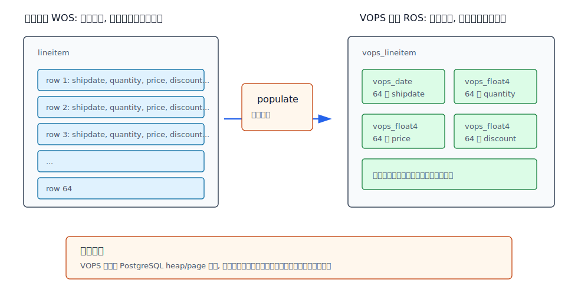
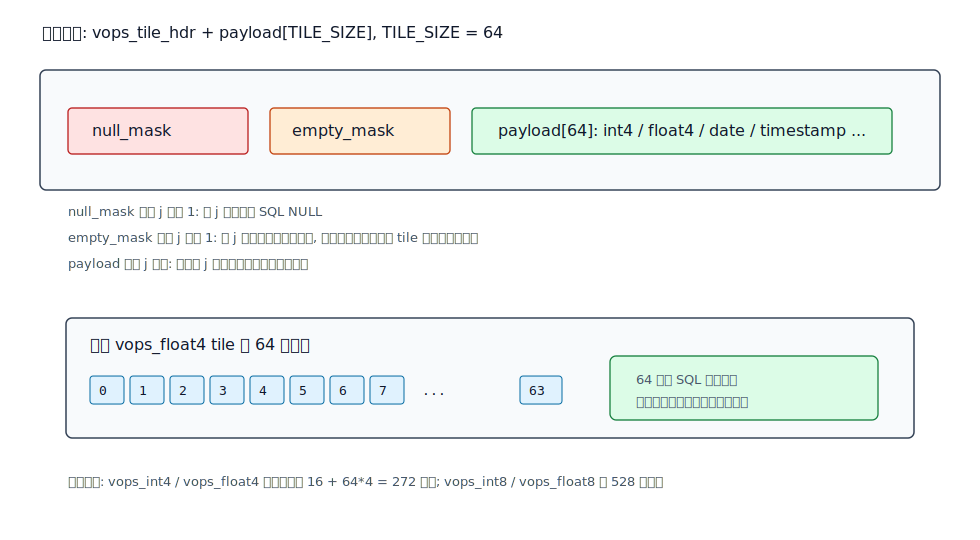
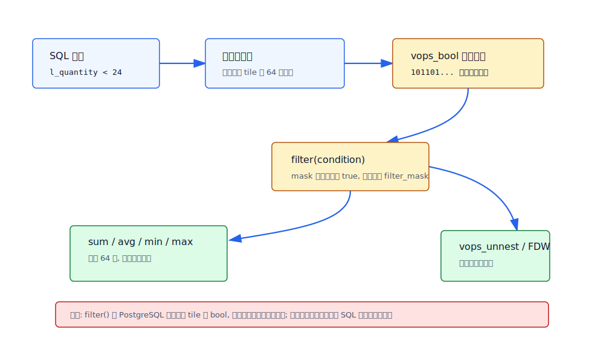
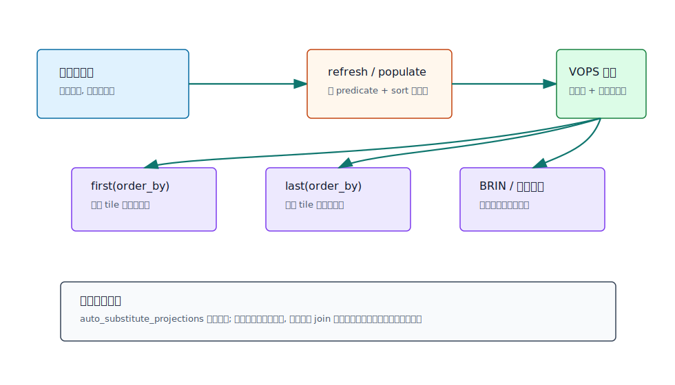

## 数据库筑基课 - 瓦片表存储 VOPS
                                                                                            
### 作者                                                                
digoal                                                                
                                                                       
### 日期                                                                     
2026-05-24                                                      
                                                                    
### 标签                                                                  
PostgreSQL , Postgres Pro , VOPS , 表存储 , 向量化执行 , OLAP , 数据库筑基课    
                                                                                           
----                                                                    

## 背景
  

本节属于“表存储”和“执行模型”的交叉基础能力。课程大纲链接未在输入资料中提供，因此本文从工程问题切入：PostgreSQL 的 heap 行存储非常适合 OLTP，但在 TPC-H Q1/Q6 这类大批量过滤、表达式计算、聚合的 OLAP 查询里，CPU 时间会被 tuple deform、表达式解释、函数调用、pull 模型和 MVCC 可见性判断吃掉。VOPS 的问题意识很直接：不改 PostgreSQL executor 和 heap page，能不能先用扩展类型模拟“瓦片化列存 + 向量化算子”，验证这条路的收益？

VOPS，全称 Vectorized Operations，是 `postgrespro/vops` 仓库里的 PostgreSQL 扩展。本地源码当前指向提交 `8259b30`，扩展版本为 `1.1`。Postgres Pro Enterprise 17 官方文档已经把 `vops` 标为 deprecated，并明确不推荐新使用；所以本文把它作为数据库内核基础课案例，而不是生产新选型建议。它的价值在于把几个核心概念压缩到一个很小的代码库里：tile、bit mask、projection、vector aggregate、FDW 展开、parse hook 改写。

## 一、它解决什么问题？

行存储的基本单位是 tuple。执行器每拿到一行，就要把需要的列从 tuple 里解出来，再逐行执行表达式和聚合。对 OLTP 来说，这个模型通用、事务语义清楚、单行更新便宜；对 OLAP 来说，它会产生三个具体痛点：

- **列读取放大：** 查询只需要 4 个列，但 heap tuple 仍然按行读取，宽表尤其吃亏。
- **CPU 调用放大：** 同一个表达式对每一行重复走解释执行和函数调用路径。
- **可见性与解包放大：** 每行都有 MVCC 头和 tuple deform 成本，读多写少的分析场景里这些成本很难摊薄。

VOPS 的解法不是重写 PostgreSQL 存储引擎，而是把“64 行同一列的值”塞进一个 PostgreSQL 自定义类型里。业务上仍然是一张普通表，物理上每个字段已经变成一个小向量。这样一次 SQL 函数调用可以处理最多 64 个值，条件结果也可以用一个 64 位位图传递给后续聚合。



图 1 说明：VOPS 把普通行表看作写优化存储 WOS，把 tile 表看作读优化投影 ROS。它没有改变 PostgreSQL heap 格式，只是把投影表字段定义成 `vops_float4`、`vops_date` 等扩展类型，让一个字段内部保存最多 64 个原始行值。

代价也很明确：源表和投影表可能有两份数据；投影需要批量刷新；单行实时写入到 tile 会造成大量未满瓦片；优化器无法天然理解 tile 内部真实选择性。

## 二、它是什么？

VOPS 的“瓦片表存储”可以这样定义：

> VOPS 是一种通过 PostgreSQL 扩展类型实现的微型列向量投影。一个 tile 类型值保存同一列最多 64 个标量值，并配套位图记录 NULL、空槽和过滤结果；算子、聚合、`unnest` 和 FDW 都围绕这 64 个槽位工作。

它不是 Parquet 这种独立文件格式，也不是 DuckDB 那样完整的向量化执行器，更不是 pgvector 的 embedding 向量相似搜索。VOPS 的“vector”指分析执行中的批量标量处理：把 `price * discount` 从逐行函数调用，变成一个 tile 函数内部循环 64 次。

源码里的几个核心事实：

- `vops.h` 定义 `TILE_SIZE 64`，并给所有普通 tile 统一加上 `vops_tile_hdr`。
- `vops_tile_hdr` 只有两个 64 位字段：`null_mask` 和 `empty_mask`。
- `vops_bool` 的 payload 本身也是一个 64 位位图，用来表示每个槽位的布尔结果。
- `vops--1.1.sql` 注册了 `vops_bool`、`vops_int4`、`vops_float4`、`vops_date`、`vops_timestamp`、`vops_text` 等类型，以及比较、算术、聚合、`filter`、`populate`、`import`、`vops_unnest`、`create_projection` 等函数。



图 2 说明：VOPS 的 tile 是“固定批量 + 位图元数据”。64 的选择来自两个约束：一是一个 64 位整数正好可以表示每个槽位的 NULL、EMPTY、过滤状态；二是 tile 不宜太大，否则复杂表达式的多个操作数和中间结果放不进 CPU cache。

## 三、核心原理

### 1. 从行表打包成 tile

`populate(destination, source, predicate, sort)` 是 VOPS 的装载入口。源码 `vops.c` 的 `vops_populate` 通过 SPI 拼出 `select ... from source`，可附加 `where predicate` 和 `order by sort`，然后逐行取源表数据。每读到一行，就把第 `j` 个源行值写入目标 tile 的第 `j` 个 payload 槽；当 `j == TILE_SIZE` 时插入一条目标投影行。

最后一个 tile 不满 64 行时，`empty_mask` 会把未填槽位标出来。若投影表同时包含普通标量列和 tile 列，源码还会在标量列值发生变化时提前切断当前 tile：这就是混合投影能按标量分组列聚合的基础。

这一步解释了为什么 VOPS 要求批量刷新，而不适合每来一行就立刻写一行投影。单行插入会让大多数 tile 只有一个有效槽，既浪费空间，也失去向量化摊薄函数调用成本的意义。

### 2. 条件过滤不是普通 WHERE

VOPS 的比较算子返回 `vops_bool`，也就是 64 位结果位图。PostgreSQL 的 `WHERE` 需要普通 `bool`，所以 VOPS 定义了 `filter(vops_bool) returns bool`。它的语义很特别：对 PostgreSQL executor 来说，`filter()` 只判断这个 tile 是否至少有一个命中槽位；对 VOPS 扩展内部来说，它把精确位图写入全局 `filter_mask`，后续聚合和展开函数再根据这个 mask 处理命中的槽位。



图 3 说明：VOPS 把过滤选择性从 executor 层搬进扩展内部。这样做能在 tile 内部快速跳过不匹配槽位，但也带来优化器不可见的问题：普通 planner 无法直接知道 `filter_mask` 最终会留下多少元素。

源码里同一个模式反复出现：`vops_unnest` 在首次调用时保存 `filter_mask`，然后循环 `j = tile_pos .. 63`，只有对应位命中且不是 empty/null 时才形成普通 tuple；`vops_fdw.c` 的 Foreign Scan 展开路径也按类似方式把 tile 拆回标量行。

### 3. 聚合有两条路径

VOPS 支持 `sum`、`avg`、`min`、`max`、`count`、方差、标准差和 `wavg`。大聚合最简单：直接对 tile 列聚合。

```sql
select sum(l_extendedprice * l_discount) as revenue
from vops_lineitem
where filter(
    betwixt(l_shipdate, '1996-01-01', '1997-01-01')
    & betwixt(l_discount, 0.08, 0.1)
    & (l_quantity < 24)
);
```

分组聚合有两种做法。第一种是 `map/reduce`，把分组 key 和多个同类型聚合表达式交给 VOPS 的 hash table，再用 `reduce()` 展开结果。它能工作，但 SQL 不自然，且聚合表达式类型受 variadic array 限制。第二种是混合投影：把低基数分组列保留为普通标量列，把度量列做成 tile；这样 PostgreSQL 负责普通 `GROUP BY`，VOPS 负责每组内部的 tile 聚合。README 的 TPC-H Q1 示例显示混合投影通常更快。

### 4. 标准 SQL 改写和 FDW

VOPS 后期又提供了更接近普通 SQL 的用法。源码 `_PG_init` 注册 `post_parse_analyze_hook`；`vops_expression_tree_mutator` 会把多个 `filter()` 组合改写成 `vops_bool_and/or/not`，并在部分场景中把查询自动替换到投影表。README 也提醒：如果没有把 `vops` 放入 `shared_preload_libraries`，第一次执行相关查询时扩展可能在 parse analyze 之后才加载，导致改写没有发生。可以显式调用 `vops_initialize()` 触发初始化。

FDW 则解决另一个问题：如果用户不想直接面对 tile 类型，可以把 VOPS 投影包装成 foreign table。`vops_fdw.c` 的扫描逻辑从底层 VOPS 表取 tile，再根据 `filter_mask` 展开成普通标量行；能下推的过滤和聚合尽量用 VOPS 操作完成，不能下推的交还 PostgreSQL 上层节点。



图 4 说明：`create_projection()` 会生成投影表和刷新函数，并能为排序列的 `first()`、`last()` 建 BRIN 边界索引。这个索引像 BRIN/zone map 一样只能做粗过滤，精确条件仍要在 tile 内通过 `filter()` 复查。

## 四、横向对比

| 维度 | VOPS 瓦片投影 | PostgreSQL heap 行表 | CStore FDW 类列存 | DuckDB/HyPer 类向量化引擎 |
|---|---|---|---|---|
| 主要目标 | 在 PostgreSQL 内用扩展类型验证向量化 OLAP | 通用 OLTP 与事务一致性 | 列式读取、压缩、分析扫描 | 从执行器到存储都按向量批量设计 |
| 存储单位 | 普通 heap 行里的 tile 字段，每字段最多 64 个值 | 一行一个 tuple | 外部列式分片/stripe | column/vector/chunk |
| 写入代价 | 需要批量 `populate` 或 `refresh`，单行写入不划算 | 单行写入友好 | 通常偏批量装载 | 批量分析友好，事务模型视系统而定 |
| 读取代价 | tile 内少函数调用，少 tuple deform，但仍在 PostgreSQL executor 框架内 | 逐行解包和表达式执行 | 只读需要列，压缩收益更强 | executor 原生批处理，算子融合更充分 |
| 事务/MVCC | 投影与源表一致性由刷新策略保证 | 原生 MVCC | FDW/外部存储语义依实现 | 通常不是 PostgreSQL heap MVCC |
| SQL 兼容 | 直接 tile SQL 有特殊函数；FDW/parse hook 改善兼容 | 最高 | 取决于 FDW 能力 | 系统自身 SQL 方言 |
| 适合场景 | 读多写少、批量刷新、过滤聚合、教学验证 | OLTP、混合负载、频繁更新 | 大宽表列裁剪和压缩分析 | 专业 OLAP、嵌入式分析、列式计算 |
| 不适合场景 | 强实时更新、复杂 join、任意字符串处理、投影滞后不可接受 | 大规模扫描聚合性能要求极高 | 需要 PostgreSQL 原生事务细节 | 必须完全保留 PostgreSQL 扩展生态与事务语义 |

这张表的关键不是“谁更快”，而是边界不同。VOPS 在 PostgreSQL 内保持了扩展可试验性，但也因此受 executor、planner、heap 和 SQL 类型系统约束；真正的向量化数据库通常要从存储、执行、优化器、统计信息到内存管理一起设计。

## 五、效果如何？

README 给出过 TPC-H scale factor 10、约 8GB 数据、16GB RAM、i7-4770、warm cache、`shared_buffers=8GB` 的对比结果。这里直接引用其结论性数据，注意这不是本文重新跑出的实验：

| Query | 顺序执行 ms | 8 worker 并行 ms |
|---|---:|---:|
| Original Q1 for `lineitem` | 38028 | 10997 |
| Original Q1 for `lineitem_projection` | 33872 | 9656 |
| Vectorized Q1 for `vops_lineitem` | 3372 | 951 |
| Mixed Q1 for `vops_lineitem_projection` | 1490 | 396 |
| Original Q6 for `lineitem` | 16796 | 4110 |
| Original Q6 for `lineitem_projection` | 4279 | 1171 |
| Vectorized Q6 for `vops_lineitem` | 875 | 284 |

可以看到两个层次的收益：

- 只做普通列裁剪投影，Q6 已从 16796 ms 降到 4279 ms，说明“少读无关列”本身就有效。
- 换成 VOPS tile 后，Q6 进一步降到 875 ms，说明“少函数调用 + tile 内批处理”继续有效。
- Q1 的 mixed projection 比 `reduce(map(...))` 更快，说明让 PostgreSQL 做标量分组、让 VOPS 做度量聚合，是更贴近系统边界的用法。

但不要把这些数字机械外推到生产。它们来自 README 的特定硬件、数据规模、warm cache 和无 join 的 TPC-H 子集。Postgres Pro 17 官方文档已经把模块标为 deprecated，这说明它更适合用来理解机制和历史探索，而不是替代现代列存/向量化产品。

## 六、实操 DEMO

下面是最小实践骨架。本文没有在当前环境执行，因为本地只有 `vops` 扩展源码，没有已编译的 PostgreSQL contrib 环境和 TPC-H 数据文件；SQL 来自 README 和扩展 SQL 定义，作为可迁移实验脚本参考。

```sql
create extension vops;

-- 如果没有配置 shared_preload_libraries = 'vops',
-- 先显式初始化 parse hook, 避免第一次查询未被改写。
select vops_initialize();

create table lineitem(
  l_quantity real,
  l_extendedprice real,
  l_discount real,
  l_tax real,
  l_returnflag "char",
  l_linestatus "char",
  l_shipdate date
);

create table vops_lineitem(
  l_shipdate vops_date not null,
  l_quantity vops_float4 not null,
  l_extendedprice vops_float4 not null,
  l_discount vops_float4 not null,
  l_tax vops_float4 not null,
  l_returnflag vops_char not null,
  l_linestatus vops_char not null
);

select populate(
  destination := 'vops_lineitem'::regclass,
  source := 'lineitem'::regclass
);

select sum(l_extendedprice * l_discount) as revenue
from vops_lineitem
where filter(
  betwixt(l_shipdate, '1996-01-01', '1997-01-01')
  & betwixt(l_discount, 0.08, 0.1)
  & (l_quantity < 24)
);
```

更推荐的分组模式是混合投影：

```sql
create table vops_lineitem_projection(
  l_shipdate vops_date not null,
  l_quantity vops_float4 not null,
  l_extendedprice vops_float4 not null,
  l_discount vops_float4 not null,
  l_tax vops_float4 not null,
  l_returnflag "char" not null,
  l_linestatus "char" not null
);

select populate(
  destination := 'vops_lineitem_projection'::regclass,
  source := 'lineitem'::regclass,
  sort := 'l_returnflag,l_linestatus'
);

select
  l_returnflag,
  l_linestatus,
  sum(l_quantity) as sum_qty,
  sum(l_extendedprice) as sum_base_price,
  avg(l_discount) as avg_disc,
  countall(*) as count_order
from vops_lineitem_projection
where filter(l_shipdate <= '1998-12-01'::date)
group by l_returnflag, l_linestatus
order by l_returnflag, l_linestatus;
```

验证时至少看三件事：`populate()` 返回的装载行数；`EXPLAIN` 是否走到预期的 VOPS 表、FDW 或投影；同一查询在原表和投影上的聚合结果是否一致。

## 七、最佳实践

**数据库架构师：** 把 VOPS 当成“读优化投影”，而不是主表。先确认业务能接受源表和投影之间的刷新延迟，再决定 projection 维度。分组列如果低基数且常出现在 `GROUP BY` 中，优先保留为标量列；度量列和时间过滤列适合作为 tile 列。

**DBA：** 不要逐行维护 VOPS 投影。用批量窗口刷新，保证 tile 填充率。按时间或批次刷新时，可利用 `predicate` 限制增量数据，利用 `sort` 让同组数据集中。若启用自动投影替换，必须明确投影滞后风险，因为 `vops.auto_substitute_projections` 默认关闭正是为了避免结果和源表不一致。

**业务开发者：** 写直接 VOPS SQL 时注意 `filter()`、`betwixt()`、`& | !` 的特殊性；字符串字面量经常需要显式类型转换，例如 `'1998-12-01'::date`。如果希望写普通 SQL，优先让 DBA 封装 FDW 或投影替换，但仍要知道哪些谓词和聚合能下推。

## 八、适合与不适合场景

适合：

- 大表批量扫描、过滤、聚合，尤其类似 TPC-H Q1/Q6 的无 join 或少 join 分析。
- 读多写少、可批量刷新、允许投影滞后的报表场景。
- 需要在 PostgreSQL 生态内教学、验证 tile/vector execution 机制。
- 度量列是数值、日期、时间戳，分组列基数不高。

不适合：

- 高频单行写入后要求投影实时一致。
- 查询核心是复杂 join、窗口、排序和多表优化，而不是单表过滤聚合。
- 大量变长字符串处理；README 也建议字符串标识优先字典化为整数。
- 需要长期生产支持的新系统。官方文档已标记 deprecated。
- 需要优化器精确理解列统计、tile 内选择性和复杂代价模型。

## 九、常见坑

- **把 VOPS 当 pgvector：** 它不是向量相似搜索扩展，不能解决 embedding ANN 检索问题。
- **第一次查询未改写：** 没有 `shared_preload_libraries` 或 `vops_initialize()` 时，parse hook 可能加载太晚。
- **投影不自动同步：** `create_projection()` 生成刷新函数，但不会自动保证源表和投影强一致。
- **tile 填充率太低：** 单行维护会让 64 槽只有少数有效值，空间和性能都变差。
- **布尔运算符优先级：** 直接 VOPS SQL 使用 `& | !`，优先级不同于 `AND OR NOT`，复杂条件要加括号。
- **索引只能粗过滤：** `first()`、`last()`、`low()`、`high()` 只能定位候选 tile，精确条件必须复查。
- **分组聚合类型限制：** `map()` 的 variadic 参数要求聚合表达式类型一致，混合投影通常更实用。
- **性能数字不可外推：** README 的 10 倍级提升来自特定查询、硬件和 warm cache。

## 十、扩展问题

1. 如果 PostgreSQL executor 原生支持 vector batch，VOPS 的 `filter_mask` 还需要藏在扩展全局变量里吗？
2. 如果 tile size 从 64 改成 128 或 1024，位图、cache、tuple 大小和 page 局部性会怎样变化？
3. VOPS 的投影一致性更接近物化视图、列存副本，还是 LSM 的 memtable/segment 分层？
4. 为什么 mixed projection 让 PostgreSQL 做 `GROUP BY` 反而比 `reduce(map(...))` 更自然？
5. 如果要把 VOPS 变成生产级列存，需要补哪些东西：统计信息、压缩、MVCC、WAL、事务一致性、自动刷新，还是优化器代价模型？

## 十一、扩展阅读

- 本地源码：`vops/README.md`，项目动机、类型、算子、投影、TPC-H 示例和性能表。
- 本地源码：`vops/vops.h`，`TILE_SIZE`、`vops_tile_hdr`、各 tile 结构定义。
- 本地源码：`vops/vops.c`，`vops_populate`、`vops_unnest`、parse hook、projection substitution。
- 本地源码：`vops/vops_fdw.c`，VOPS FDW 的 tile 展开和过滤路径。
- 本地源码：`vops/vops--1.1.sql`，扩展类型、函数、算子、聚合和投影 SQL 定义。
- GitHub 项目页：[postgrespro/vops](https://github.com/postgrespro/vops)。
- 官方文档：[Postgres Pro Enterprise 17: vops — support for vector operations](https://postgrespro.com/docs/enterprise/17/vops.html)。
- DeepWiki 入口：[postgrespro/vops](https://deepwiki.com/postgrespro/vops)。本次写作中 DeepWiki 页面可访问但正文主要由客户端渲染，关键技术结论均以本地源码、README 和官方文档核验。
- 相关背景：MonetDB/X100、HyPer、CStore FDW、IMCS，可用于继续比较“瓦片化列存”和“原生向量化执行器”的系统差异。
  
## 附录  
  
  
1、克隆代码  
```  
git clone --depth 1 https://github.com/postgrespro/vops
```  
  
2、启用 codex, 使用 [数据库筑基课 skill](../skills/README.md).  
```  
文章标题:  
  数据库筑基课 - 瓦片表存储 VOPS  
项目源码(已克隆到当前项目如下目录中):  
  vops 
项目 deepwiki reponame:  
  postgrespro/vops
```  
  
  
#### [PostgreSQL 解决方案集合](../201706/20170601_02.md "40cff096e9ed7122c512b35d8561d9c8")
  
  
#### [德哥 / digoal's Github - 公益是一辈子的事.](https://github.com/digoal/blog/blob/master/README.md "22709685feb7cab07d30f30387f0a9ae")
  
  
#### [About 德哥](https://github.com/digoal/blog/blob/master/me/readme.md "a37735981e7704886ffd590565582dd0")
  
  

  
