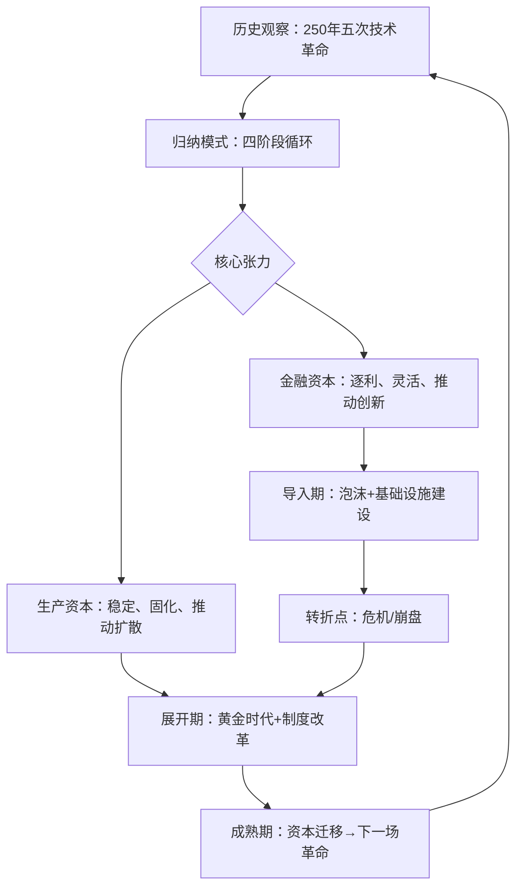

## 《技术革命与金融资本：泡沫与黄金时代的动力学》读书笔记
  
### 作者  
digoal  
  
### 日期  
2026-05-24  
  
### 标签  
读书笔记 , 技术革命与金融资本：泡沫与黄金时代的动力学   
  
----  
  
## 背景  
   
---
书名: 《技术革命与金融资本：泡沫与黄金时代的动力学》   
作者: [英] 卡洛塔·佩雷斯   
出版年份: 2002（原版）/ 2025（中文新版）   
笔记日期: 2025-05-24   
豆瓣链接: https://book.douban.com/subject/2326852/   
标签: [演化经济学, 技术革命, 金融资本, 创新周期, 熊彼特, 长波理论]   
---

   

> **一句话**：泡沫不是意外，黄金时代也不是偶然——每一场技术革命都在重演同一个剧本，而懂得这个剧本的人，才能不被历史愚弄。   
> **适合谁读**：对经济周期、科技投资、创新政策感兴趣的人；想理解为什么每隔几十年就有一波"改变世界"然后又泡沫破裂的读者；以及正在思考 AI 时代我们身处何处的人。   
> **阅读难度**：⭐⭐⭐☆☆   
> **推荐指数**：⭐⭐⭐⭐⭐   

---

## 一、时代坐标：这本书从哪里来？

2002年，互联网泡沫刚刚破灭一年。纳斯达克从5000点的顶峰跌去了四分之三，无数被吹捧为"改变世界"的".com"公司灰飞烟灭，投资者损失惨重。人们茫然地问：这是一次普通的泡沫，还是有更深的规律？

就在这个时刻，一位英籍委内瑞拉裔学者卡洛塔·佩雷斯（Carlota Perez）出版了这本书。她的回答是：**这不是意外，这是历史的必然重演**。

佩雷斯1939年生于加拉加斯，在委内瑞拉度过成长岁月，后来辗转于拉丁美洲、欧洲学界，研究技术变革与经济社会发展的关系。她曾在委内瑞拉工业部工作，深刻感受过技术引进与制度滞后的落差；之后进入苏塞克斯大学SPRU（科学与技术政策研究所），师从克里斯托弗·弗里曼（Christopher Freeman）——后者正是将熊彼特长波理论带入现代经济学的关键人物。

这本书的问题意识非常清晰：**为什么金融泡沫总是伴随技术革命而来？为什么泡沫破灭后有时是灾难，有时却能迎来真正的黄金时代？政策制定者和投资者能从历史中学到什么？**

写作时机也极为巧妙。互联网泡沫后，人们急需一个框架来消化这场浩劫。佩雷斯给出的，不是一次事件的分析，而是横跨250年、涵盖五次技术革命的历史规律。

---

## 二、核心命题：作者在说什么？

### 命题一：技术革命以50-60年为周期循环，且结构高度相似

佩雷斯识别出过去两个多世纪的五次技术革命：

```
1771年  英国  第一次工业革命（机械棉纺、运河水力）
1829年  英国  蒸汽机与铁路时代
1875年  美国/德国  钢铁、电力与重工业时代
1908年  美国  石油、汽车与大规模生产时代
1971年  美国  信息技术与电信时代（芯片、互联网）
```

每次革命都起于一个"大爆炸"时刻——一个足够廉价、足够可见的技术突破点（比如1771年阿克莱特纺纱厂的开张，比如1971年英特尔第一块微处理器的发布）。这些革命不只是单一技术，而是技术族群的集体爆发，并且会渗透进整个经济体的组织逻辑，形成佩雷斯所说的"**技术-经济范式**"（Techno-Economic Paradigm）。

**所谓范式，不只是技术，而是一整套被社会广泛接受的最优实践。** 工厂制、流水线生产、互联网思维，都是各自时代的范式——它像空气一样弥漫，让所有人都觉得"理所当然"。

### 命题二：每次技术革命都分为"导入期"和"展开期"，中间有一个转折点（往往是危机）

这是全书最具操作价值的模型。佩雷斯将每次技术革命的扩散过程分为四个阶段：

**导入期（Installation Period）**
- 爆发阶段（Irruption）：新技术初现，金融资本闻风而动，开始大量投入新兴领域
- 狂热阶段（Frenzy）：投机盛行，金融资本与实体经济脱钩，资产泡沫膨胀，贫富差距拉大，社会进入"镀金时代"（Gilded Age）

**转折点（Turning Point）：泡沫破裂，危机爆发，社会开始反思**

**展开期（Deployment Period）**
- 协同阶段（Synergy）：监管介入，金融资本与生产资本重新联结，技术红利真正惠及大众，进入"黄金时代"（Golden Age）
- 成熟阶段（Maturity）：市场饱和，资本开始向新领域迁徙，为下一场革命埋下种子

关键洞见是：**泡沫不是失败，而是技术基础设施的"超前建设"机制**。铁路泡沫破灭留下的是全国铁路网；互联网泡沫崩盘留下的是光纤基础设施——Google、Amazon 正是在这张廉价的网络上起飞的。

### 命题三：金融资本与生产资本是不同的生命体，两者的张力驱动了周期

佩雷斯明确区分了两种资本的行为逻辑：

- **金融资本**（Financial Capital）：逐利、灵活、去物质化，擅长在不确定性中寻找高回报，是技术革命早期的"风险投资者"
- **生产资本**（Production Capital）：固化于设备、厂房、供应链，追求稳定、可预期的回报，是技术成熟期的主体

导入期是金融资本的狂欢，展开期是生产资本的天下。两者必须在危机后重新"结婚"，社会才能进入真正的繁荣。而这场重新联结，往往需要政治力量（监管、新政、制度改革）来撮合。

---

## 三、论证地图：佩雷斯怎么说服你的？



佩雷斯的论证方法是**历史比较法**：把五次技术革命的数据和事件并排对比，找到结构性相似点。她没有大量依赖数学模型，而是用案例的密度来积累说服力。

代表性论据：
- 19世纪40年代英国铁路狂热（Railway Mania）中，股票价格脱离实际盈利能力，随后崩盘，但留下的铁路网推动了维多利亚时代的工业繁荣
- 20世纪20年代美国的"咆哮的二十年代"（汽车、电气化狂热）→ 1929年大萧条 → 新政制度改革 → 战后黄金时代（1950-1970年代）
- 1995-2000年互联网泡沫 → 2001年纳斯达克崩盘 → （她预测）监管介入后将迎来信息时代的黄金时代

论证的强项在于**历史跨度的厚重**，弱项在于单个案例的论证深度有时不够——有些读者批评书中"描述多、论证少"，概括性语言掩盖了反例的存在。

---

## 四、前提假设与边界：什么情况下这不成立？

### 假设一：技术革命在资本主义体制内运作

佩雷斯的模型建立在市场经济和自由流动的金融资本基础上。在计划经济或国家主导型资本主义中，金融资本与生产资本的关系逻辑完全不同，周期节奏也会被政策大幅改变。

**是否仍然成立？** 部分成立。中国的互联网科技爆发（2010-2021年）也呈现出类似的导入期特征（投机+基础设施建设），但转折点的触发机制（监管整顿）更多来自政治意志而非市场自发调整。

### 假设二：周期长度大约为50-60年

这个估计是从历史归纳而来，并非严格的数理推导。实际上每次革命的节奏差异颇大，受到战争、地缘政治、文化因素的显著影响。把"大约50年"过度机械化使用，容易陷入伪精确性。

### 假设三：黄金时代的到来需要制度改革，并不是自动发生的

这是书中最重要的政策含义，也是最容易被乐观读者忽略的：**泡沫破灭后不会自动迎来黄金时代**，必须有意识的政治行动来重建金融与生产的联结，否则可能陷入长期停滞甚至社会动荡。20世纪30年代德国的法西斯化，就是这种联结重建失败的极端案例。

---

## 五、思想谱系：这本书站在哪个传统里？

```
康德拉季耶夫（Kondratieff）
长波理论（50年周期）
      ↓
熊彼特（Schumpeter）
创造性破坏 + 创新族群
      ↓
克里斯托弗·弗里曼（Freeman）
技术-经济范式（佩雷斯老师）
      ↓
卡洛塔·佩雷斯
金融资本 × 技术革命的互动模型
      ↓
当代影响：
马里亚纳·马祖卡托（Mazzucato）→《创业型国家》
彼得·泰尔、本尼迪克特·埃文斯等科技投资圈
绿色新政理论框架
```

佩雷斯属于**新熊彼特学派**（Neo-Schumpeterian），她继承了熊彼特对创新重要性的强调，但增加了金融资本的视角——而这恰恰是熊彼特本人忽视的盲区。2009年，经济学界为她专门出版了一部纪念文集《技术-经济范式》，收录各路学者的致敬论文。

她对后来创新政策研究的影响极为深远：马里亚纳·马祖卡托的国家创新理论、绿色转型政策的学术论证，很大程度上都站在佩雷斯的肩膀上。

---

## 六、我学到了什么？

读完这本书，我的三个最大收获：

**第一，"现在"的位置感**。把自己放进历史的坐标系里，是理解当下的第一步。如果佩雷斯的框架大致成立，那么AI浪潮的爆发——从2012年深度学习突破，到2022年ChatGPT引爆全球，到当下席卷各行各业的AI投资热——正处于第五次技术革命的"狂热阶段"尾声，或者说转折点前夜。这个判断不保证投资回报，但它能帮你抵抗两种极端：既不被疯狂吞噬，也不会愤世嫉俗地完全否定这场变革的真实性。

**第二，泡沫的"正当性"**。这是反直觉的洞见。泡沫是浪费的，也是有用的。铁路泡沫"浪费"了大量英国储蓄，却铺设了让维多利亚时代繁荣成为可能的基础设施。互联网泡沫"烧掉"了数千亿美元，却留下了光纤网络和一代工程师。这不是为投机辩护，而是让我对"建设性的过度投资"有了更复杂的认识。

**第三，制度改革是黄金时代的钥匙**。技术本身不会自动带来繁荣，必须有配套的制度安排——监管框架、收入分配机制、社会保障体系——来确保技术红利向社会扩散，而不是只让少数人受益。这在AI时代同样成立：如果没有有意识的政策干预，AI的生产力提升可能只会加剧不平等，而不是带来真正的黄金时代。

---

## 七、举一反三：这个框架还能用在哪？

**用于理解加密货币与区块链**：从佩雷斯框架看，2017和2021年的加密货币热潮，几乎完美复刻了导入期的"狂热阶段"：天价估值、散户跟风、与实际应用脱节。但框架也提示我们：这场泡沫中建设的基础设施（钱包、链上协议、去中心化金融工具），可能在未来某个我们还不清楚的场景里发挥作用。

**用于理解AI投资周期**：当前AI领域大量资本涌入，许多公司商业模式尚不清晰，这是典型的"狂热阶段"特征。接下来无论是否有显著泡沫破裂，真正重要的问题是：转折点过后，哪些基础设施、哪些应用层、哪些组织范式会留下来，成为下一个黄金时代的底座？

**用于理解新兴市场的追赶机会**：佩雷斯晚年明确指出，展开期是后发国家追赶的黄金窗口，因为核心技术已经成熟、成本下降，但大量市场仍未开发。这为发展中国家的产业政策提供了战略节点判断。

---

## 八、批判与反思

这本书有几个明显局限，值得诚实指出：

**论证厚度不足**。原书仅200余页，而承载的历史跨度长达250年。很多"规律"是以高度概括的形式呈现的，缺乏足够的历史细节来经受严格检验。批评者指出，作者的论据有时是选择性的——那些不符合模式的历史段落被轻描淡写带过。

**周期边界模糊**。五次技术革命的起止年份如何确定？不同革命之间的重叠如何处理？佩雷斯的答案有些循环论证的味道——用观察到的繁荣和危机来确认周期，再用周期来解释繁荣和危机。

**"黄金时代"的条件过于乐观**。书中对制度改革的叙述有些抽象，好像政策制定者只要"意识到"就能推动改革。但历史一再表明，利益集团的阻力、政治极化、国际竞争等因素，使得这种"理性转型"极为困难。1930年代证明了转折点可以通向法西斯主义而不是新政。

**全球化维度不足**。佩雷斯的模型主要以"领头国"（英国→美国）为核心，对技术革命在全球扩散中的不平等性分析不够充分。数字鸿沟、技术民族主义、全球南方的角色，在这个框架里都只是注脚。

尽管如此，这本书在框架的原创性和历史视野的宏阔上，依然无可替代。

---

## 九、金句与记忆点

1. **"技术革命是一族相互关联的技术、产品和产业的出现，它能带来整个经济中巨大的飞跃式发展。"**
   → 注意"一族"：革命不是单一技术，而是生态系统的集体爆发。

2. **"金融资本是技术革命的媒婆，也是它的债主。"**（意译）
   → 金融资本在早期是英雄，在狂热期是罪人，在展开期又要让位给生产资本——它的角色随阶段而变。

3. **"泡沫崩溃是痛苦的，但它是黄金时代的必要前提，不是黄金时代的终结。"**
   → 痛苦不等于终点。关键在于转折点之后社会如何响应。

4. **"技术-经济范式是时代的'常识'——那个让所有人都觉得理所当然的最优实践方式。"**
   → 范式不是写在教科书里的，而是内化在每个从业者的直觉里的。我们此刻也活在某个范式里，只是很难看清。

5. **"每一个镀金时代都相信自己是永恒的，每一个黄金时代都从危机的废墟中升起。"**（意译）
   → 这是佩雷斯给过度乐观者和过度悲观者同时准备的一剂清醒药。

6. **"那些建造了泡沫时期过剩基础设施的公司大多破产了，而使用这些设施盈利的公司，却是泡沫之后才出现的。"**
   → 这是互联网泡沫的标准故事：WorldCom 烧钱铺光纤，Google 借光纤起飞。

---

## 十、延伸阅读

1. **《创业型国家》马里亚纳·马祖卡托**
   → 在佩雷斯框架基础上，深入论证国家在技术革命展开期中的主导角色，是极好的配套读物。

2. **《长波与创新》尼古拉·康德拉季耶夫**
   → 佩雷斯理论的源头，理解长波理论的第一手文献，读来会感受到历史周期感的震撼。

3. **《科学革命的结构》托马斯·库恩**
   → 佩雷斯"技术-经济范式"与库恩"科学范式"高度互文。豆瓣读者也指出两书"一脉相承"，建议对照阅读。

4. **《非理性繁荣》罗伯特·希勒**
   → 从行为金融学视角解析泡沫心理，与佩雷斯的结构性分析形成互补。

5. **《资本主义、社会主义与民主》约瑟夫·熊彼特**
   → 佩雷斯理论最重要的思想来源，"创造性破坏"概念的原典，理解佩雷斯必须先读熊彼特。

---

*笔记写于 2025-05-24 | 基于公开资料、学术书评与深度思考整理*
*参考来源：Wikipedia、Goodreads书评、《Strategy+Business》佩雷斯访谈、豆瓣读者评论、e-Elgar出版社简介*
  
  
#### [PostgreSQL 解决方案集合](../201706/20170601_02.md "40cff096e9ed7122c512b35d8561d9c8")
  
  
#### [德哥 / digoal's Github - 公益是一辈子的事.](https://github.com/digoal/blog/blob/master/README.md "22709685feb7cab07d30f30387f0a9ae")
  
  
#### [About 德哥](https://github.com/digoal/blog/blob/master/me/readme.md "a37735981e7704886ffd590565582dd0")
  
  

  
