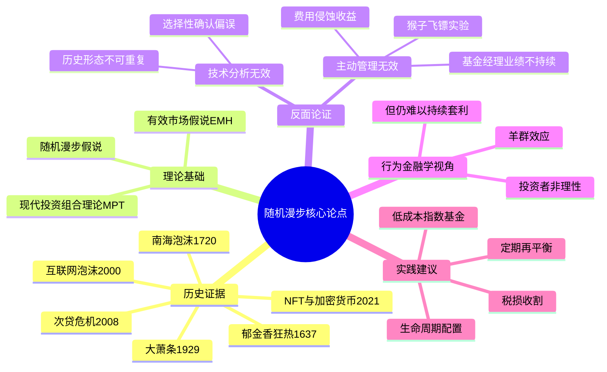

## 《漫步华尔街》读书笔记
  
### 作者  
digoal  
  
### 日期  
2026-05-24  
  
### 标签  
读书笔记 , 漫步华尔街   
  
----  
  
## 背景  
   
---
书名: 《漫步华尔街》（第13版）   
作者: 伯顿·G.马尔基尔（Burton G. Malkiel）   
译者: 张伟   
出版年份: 2024（中文版）/ 2023（英文第13版）   
笔记日期: 2026-05-24   
出版社: 机械工业出版社（中文）/ W.W. Norton & Company（英文）   
ISBN: 9787111753506   
标签: [投资, 指数基金, 有效市场假说, 随机漫步, 个人理财, 行为金融学]   
---
   
   

> **一句话**：市场是一个没有人能持续战胜的随机漫步者，而承认这一点，是普通投资者走向财务自由最诚实的起点。   
> **适合谁读**：想入门投资的普通人、被各种理财大V搞得焦虑不安的工薪族、想系统理解现代金融理论的学生   
> **阅读难度**：⭐⭐⭐☆☆   
> **推荐指数**：⭐⭐⭐⭐⭐   

---

## 一、时代坐标：这本书从哪里来？

1973年，正值美国股市最动荡的年代之一——越战泥潭、石油危机、尼克松辞职，华尔街的专业人士们却仍然信心满满地推销着各种"必胜秘诀"。就在这一年，普林斯顿大学经济学教授伯顿·马尔基尔出版了第一版《漫步华尔街》，向整个金融行业的自负开了一枪。

马尔基尔不是书斋里的纯粹学者。他拥有哈佛大学学士和MBA学位、普林斯顿博士学位，在华尔街做过股票分析师，在普林斯顿掌过教鞭，在先锋（Vanguard）基金委员会任职长达28年，与指数基金之父约翰·博格私交深厚。这种"学术 + 实战"的双重身份，让他既能看透华尔街的把戏，又能用经济学语言严密论证。

这本书的问题意识极其明确：**普通投资者能不能靠选股、择时打败市场？** 马尔基尔的回答，在1973年是异端，在2023年是常识。

五十年里，这本书历经13次更新，见证了从郁金香泡沫到比特币、从黑色星期一到新冠崩盘、从散户投机到meme股狂热的几乎所有市场疯癫时刻。每次修订，马尔基尔都用最新的数据再次验证同一个结论——核心论点岿然不动，市场的教训总在循环重演。

```
时间轴：《漫步华尔街》的半个世纪

1973 ──── 第1版：随机漫步理论，石油危机前夕
   │
1985 ──── 扩充行为金融学内容
   │
1990s ─── 互联网泡沫前后的预警
   │
2003 ──── 博士论文级别的EMH研究论文同步发表
   │
2008 ──── 金融危机版：次贷泡沫的历史印证
   │
2019 ──── 第12版：1.5百万册销量里程碑
   │
2023 ──── 第13版：50周年纪念版，纳入NFT/加密/meme股
```

---

## 二、核心命题：作者在说什么？

### 观点一：股价是"随机漫步"的，过去无法预测未来

马尔基尔的核心主张来自"随机漫步假说"（Random Walk Hypothesis）：股价的短期变动本质上是不可预测的。今天的价格已经反映了所有已知信息，明天的价格变动取决于明天的新信息——而新信息，定义上就是随机的。

这意味着技术分析（看K线、找形态、预测趋势）和基本面分析（精算PE、DCF估值、拆解财报）在统计意义上**无法持续跑赢市场均值**。马尔基尔甚至提出那个著名的比喻：一只蒙眼猴子随机投掷飞镖选出的投资组合，长期业绩不亚于专业基金经理。

### 观点二：市场接近"强有效"，信息已被充分定价

随机漫步的背后是"有效市场假说"（Efficient Market Hypothesis, EMH）——市场价格已经充分反映了所有公开可获得的信息。马尔基尔并非认为市场完全完美，他承认市场会短暂失灵（泡沫、恐慌），但他的结论是：**这种失灵无法被系统性、持续性地利用**。

他用大量数据说明：绝大多数主动管理型基金在扣除费用后，长期跑输对应的指数。而那些短暂跑赢的，很难将优势延续至下一个十年——业绩归因于运气的概率，远大于归因于能力。

### 观点三：普通人的最优解是"买入并持有低成本指数基金"

从随机漫步和有效市场出发，马尔基尔的实操建议相当简单：
- **选择宽基指数基金**（如标普500指数基金），而非主动管理基金
- **成本极简化**：每少付1%的管理费，就是真实收益的增加
- **长期持有，定期定额**，不择时，不预测
- **根据年龄调整股债比例**：年轻时激进（多股票），临近退休保守（多债券）

第13版新增内容涵盖了"税损收割"、比特币泡沫、自动化投顾（robo-advisor）以及因子投资（factor investing）的讨论，结论仍然一致：复杂策略很少能跑赢简单指数。

---

## 三、论证地图：作者怎么说服你的？



马尔基尔的论证有一个典型的"破立结合"结构：先用历史泡沫的案例摧毁"人类能预测市场"的幻觉，再用统计数据否定技术分析和基本面分析的有效性，然后引入现代投资组合理论和行为金融学提供理论框架，最后落地到具体的操作建议。

这套论证的力量在于**数据密度**——每个版本更新都会加入新的基金业绩数据比较，结论总是指向同一个方向：主动管理基金跑赢指数基金的比例，在10年以上周期内通常低于20%，扣除费用后更低。

---

## 四、前提假设与边界：什么情况下这不成立？

马尔基尔的结论建立在几个重要假设之上，值得逐一审视：

**假设一：市场流动性充足，信息传播高效**

这一假设在美国大型股市中大体成立，但在新兴市场、小盘股、流动性差的市场中，有效市场的程度明显降低。事实上，部分量化对冲基金（如文艺复兴科技的大奖章基金）的长期超额收益，就来自于发掘了某些市场的短暂低效。马尔基尔也坦承这一点，并将其归入"边缘例外"。

**假设二：普通投资者没有信息优势**

这对99%的个人投资者是成立的。但对于内部人士、专业机构的某些特定策略，信息不对称仍然存在——这也是为什么监管要求严格的内幕交易禁令。

**假设三：长期看股市整体向上**

这是被动投资策略的隐含前提。如果一国经济长期停滞甚至衰退，持有该国指数基金并不会带来预期的复利增长。这对中国投资者尤其值得思考：A股过去20年的指数表现，并非线性向上的西方教科书范本。

**在中国语境下的额外边界**

书中具体的税务建议（401k、IRA、税损收割等）几乎全部基于美国制度，中国读者需要大幅过滤和转化。中国市场的波动性更高、个人投资者比例更大、机构化程度更低，这实际上也意味着中国市场的"无效性"可能高于美国——这是一把双刃剑。

---

## 五、思想谱系：这本书在哪个传统里？

```
                    [芝加哥学派]
                    Fama 有效市场假说(1970)
                          │
        ┌─────────────────┼─────────────────┐
        │                 │                 │
  [马尔基尔]         [博格/先锋]         [萨缪尔森]
  随机漫步(1973)    指数基金实践(1976)   指数化倡导
        │                 │
        └──────┬──────────┘
               │
        [被动投资革命]
        ETF的爆发式增长(2000s-今)
               │
        ┌──────┴──────┐
  [行为金融学挑战]   [因子投资兴起]
  Thaler/Shiller    Fama-French三因子
  非理性投资者       价值/规模溢价
```

马尔基尔站在芝加哥学派的有效市场传统上，与法玛（Eugene Fama，2013年诺贝尔经济学奖）同属"市场有效"阵营。他的工作最重要的实践遗产，是与约翰·博格的相互影响——马尔基尔提供了学术背书，博格将指数基金从理论变成了先锋基金的产品，最终催生了全球被动投资的数十万亿美元浪潮。

行为金融学（罗伯特·席勒、丹尼尔·卡尼曼）提供了另一种视角：市场确实存在非理性，但马尔基尔的反驳是——**即便如此，这种非理性也无法被个人投资者系统性地利用来赚取超额收益**。这一辩论在学界至今未有定论。

---

## 六、我学到了什么？

读完这本书，最深的感受不是"原来如此"，而是"原来如此难以做到"。

**收获一：学会区分"运气"和"能力"**

当一个基金连续三年跑赢市场，我们会觉得是基金经理能力出众。但马尔基尔用统计学告诉我们：在足够多的基金里，仅靠随机运气也会出现这样的结果。真正验证能力需要跨越10年以上、跨越多个市场周期的数据——而大多数人没有这个耐心，也没有这个信息。

**收获二：成本是唯一可以控制的超额收益来源**

这个洞察看似平淡，却是最有力的武器。主动基金年费1.5%~2%，被动指数基金年费0.03%~0.2%。复利之下，50年里这1.5%的差距意味着最终资产规模差出一半以上。不必预测市场，只需要少付费用，就已经跑赢了大多数专业投资者。

**收获三：投资策略的核心是"自知"，而非"他知"**

马尔基尔的生命周期投资策略的精髓不是资产配置公式，而是强调每个人要对自己的风险承受能力诚实。你愿意为了10%的年化收益，承受账户腰斩一年还是三年不回来？这道题的答案，决定了你适合什么样的股债比例——答错了，任何理论都会失效，因为恐慌会让你在底部割肉。

---

## 七、举一反三：这个框架还能用在哪？

**场景一：职场中的"选手评估陷阱"**

我们评估一个销售员连续两年业绩第一，就倾向于认为他能力卓越。但马尔基尔的框架提醒我们：在足够大的团队中，总有人靠运气连续出彩。真正的能力评估，需要控制"市场大环境"这个变量，以及足够长的时间维度。

**场景二：消费市场中的"热门基金效应"**

同样的逻辑适用于任何"排行榜思维"——去年最火的餐厅、最热卖的产品、最多人买的理财……热门往往意味着高价，均值回归是普遍规律。别在别人已经挣到钱之后再进场。

**场景三：信息过载时代的"少即是多"**

每天有海量财经资讯轰炸投资者，每条新闻似乎都在提示"现在应该操作"。马尔基尔的随机漫步理论是最好的解毒剂：短期价格变动噪音大于信号，频繁交易只会增加成本、减少收益。

---

## 八、批判与反思

这本书不是没有局限，坦白说，有几个地方我读起来存疑：

**局限一：过于轻视"半强有效以下"的市场机会**

马尔基尔在处理新兴市场、小盘股、非流动性资产时，结论过于整齐。事实上，文艺复兴科技（Renaissance Technologies）的大奖章基金30年来年化66%的回报（扣费前），很难用"纯粹运气"解释。量化策略在特定市场的持续超额收益，是对强效率市场假说的真实挑战。马尔基尔的回答有点像"那只是特例"——这个特例也许值得更深入的分析。

**局限二：行为金融学视角的整合还不够深**

书中引入了卡尼曼、席勒的研究，承认投资者存在系统性非理性，但并没有从中推演出更精细的操作建议。如果投资者普遍在市场底部恐慌、顶部贪婪，那么是否存在逆向操作的空间？这个问题马尔基尔没有正面回答，只是说"很难持续做到"——但"很难"和"不可能"是不同的。

**局限三：中国市场适用性被读者过度借鉴**

这本书的数据和制度背景是美国市场。A股的个人投资者占比超过80%，机构化程度远低于美国，这意味着市场效率相对较低——这对"选股能不能跑赢指数"的答案可能有所不同。盲目将"买沪深300指数基金然后躺平"当成中国版漫步华尔街，可能过于简化。

---

## 九、金句与记忆点

> **"被蒙住眼睛的猴子向报纸股票行情版掷飞镖所选出的投资组合，与专家们精心选择的组合业绩相当。"**
> ——这不是在羞辱基金经理，而是说明市场定价的高效性；真正的敌人不是别人，是我们自己对"专家"的盲目崇拜。

> **"对个人投资者而言，最好的选择是将大部分资金放入低成本的宽基指数基金，其余的钱用来满足你的赌徒欲望。"**
> ——马尔基尔并不是禁欲主义者，他理解人性，只是在说明比例的重要性。

> **"股市短期是投票机，长期是称重机。"**（原为格雷厄姆语，马尔基尔多次引用）
> ——这句话是对EMH最好的通俗诠释：短期情绪主导，长期价值主导。

> **"不要试图择时；时间在市场中，比择市场的时机更重要。"**
> ——（Time in the market beats timing the market）复利的力量是数学，择时的代价是人性。

> **"成本是唯一可以事先确定的投资回报。"**
> ——这是投资领域最接近"确定性"的一条规律：少付的费用，就是真实到手的收益。

> **"我深感满意，这本书帮助无数普通人实现了财务目标——从一无所有，到逐渐积累起可观的财富。"**
> ——马尔基尔在第13版前言中的自述。五十年坚守一个观点，这种知识上的诚实本身就值得尊重。

---

## 十、延伸阅读

**同向深化：**
- 《共同基金常识》约翰·博格 —— 指数基金之父的第一视角，与本书互为表里，更注重实操和费用数学
- 《投资者的未来》杰里米·西格尔 —— 从股票长期回报的历史数据出发，与马尔基尔观点高度一致，数据更丰富

**对立视角：**
- 《非理性繁荣》罗伯特·席勒 —— 行为金融学阵营的旗帜之作，证明市场存在可预测的泡沫周期，与EMH形成对话
- 《打败市场》彼得·林奇 —— 主动选股的代表性辩护，用林奇自身的麦哲伦基金辉煌经历说话，但需结合"幸存者偏差"来读

**认知升级：**
- 《思考，快与慢》丹尼尔·卡尼曼 —— 理解为什么我们在投资中总是做出非理性决策，是读懂行为金融学的基础

---

*笔记写于 2026-05-24 | 基于公开资料、学术论文及深度阅读整理 | 不构成投资建议*
  
  
#### [PostgreSQL 解决方案集合](../201706/20170601_02.md "40cff096e9ed7122c512b35d8561d9c8")
  
  
#### [德哥 / digoal's Github - 公益是一辈子的事.](https://github.com/digoal/blog/blob/master/README.md "22709685feb7cab07d30f30387f0a9ae")
  
  
#### [About 德哥](https://github.com/digoal/blog/blob/master/me/readme.md "a37735981e7704886ffd590565582dd0")
  
  

  
