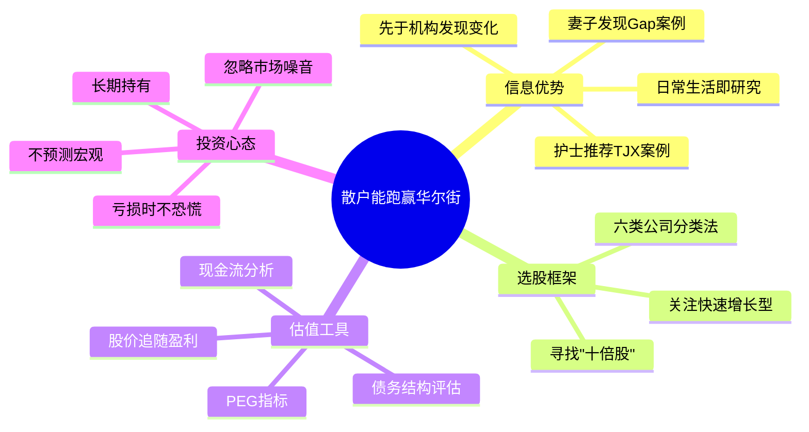

## 《彼得·林奇的成功投资》读书笔记
  
### 作者  
digoal  
  
### 日期  
2026-05-24  
  
### 标签  
读书笔记 , 彼得·林奇的成功投资   
  
----  
  
## 背景  
   
---
书名: 《彼得·林奇的成功投资》   
原名: One Up On Wall Street: How to Use What You Already Know to Make Money in the Market   
作者: 彼得·林奇（Peter Lynch）/ 约翰·罗瑟查尔德（John Rothchild）   
译者: 刘建位 / 徐晓杰   
出版社: 机械工业出版社   
出版年份: 1989（原版）/ 2018（典藏版）   
笔记日期: 2026-05-24   
豆瓣评分: 8.5   
标签: [投资, 选股, 价值投资, 散户, 10倍股]   
---

   

> **一句话**：散户最大的优势，是你比华尔街更早知道下一只牛股在哪里。   
> **适合谁读**：对股市感兴趣但没有系统方法论的普通投资者；想理解"价值投资"本质的入门者。   
> **阅读难度**：⭐⭐☆☆☆（语言轻松幽默，没有数学公式，几乎无门槛）   
> **推荐指数**：⭐⭐⭐⭐☆   

---

## 一、时代坐标：这本书从哪里来？

1989年，彼得·林奇在华尔街声名如日中天。他掌管的富达麦哲伦基金（Fidelity Magellan Fund）刚刚走过13年的黄金岁月：从1977年接手时的1800万美元，到卸任时的140亿美元，年化复合收益率29%，累计回报约27倍，同期标普500指数仅涨4.7倍。时代周刊称他为"首屈一指的基金经理人"，财富杂志封他为"投资界的超级巨星"。

这本书写于他退休前的前夜。

彼得·林奇为什么要写这本书？答案藏在1980年代美国股市的背景里。彼时，机构投资者与计算机量化交易开始崛起，普通散户普遍相信"专业人士永远比我懂"，纷纷将资金委托给基金经理。林奇对此深感不满——在他的观察中，大量普通人其实比基金经理更早接触到真正的好公司：他妻子卡罗琳发现Gap的潜力时，华尔街还没注意；给林奇做膝盖手术后的护士随口提到TJX折扣店，这只股票后来大涨数倍。

林奇想对普通投资者说的只有一件事：**你的常识，就是你最大的资产。**

```
时间轴：林奇与这本书

  1977            1989            1990
    │               │               │
    ▼               ▼               ▼
 接掌麦哲伦      出版本书         主动退休
 (1800万美元)   (纽约时报畅销书)  (140亿美元)
                    │
                    ▼
              年化29%的13年传奇
              仍是美国主动基金"天花板"
```

---

## 二、核心命题：作者在说什么？

### 观点一：散户天然拥有信息优势，只是不自知

林奇反复强调，普通人在日常消费和工作中接触到大量"第一手信息"，而这些信息恰恰是机构投资者最难获得的。一个每天逛沃尔玛的家庭主妇，比坐在曼哈顿写字楼里的分析师更早感知到这家公司的经营变化。一个在某医院工作的护士，比任何分析师都更清楚哪家医疗器械公司的产品正在被大规模采用。

林奇把这种优势称为"edge"——是的，散户是有"边"的，只是大多数人从未尝试用它。

### 观点二：股票后面是真实的公司，不要忘了这一点

林奇对"看图炒股"派保持高度警惕。他的核心信念是：**股价长期追随公司盈利**，短期可以背离，但最终一定回归。K线图背后必须有真实的业务逻辑支撑，否则什么"技术形态"都是空中楼阁。

他将股票划分为六类，每种类型适用不同的持有逻辑：

| 类型 | 特征 | 林奇的建议 |
|------|------|------------|
| **缓慢增长型** | 大型成熟企业，增长2-4%，有稳定分红 | 持有为主，期望不要太高 |
| **稳定增长型** | 可口可乐这类，年增长10-12% | 熊市避风港，牛市不如选其他 |
| **快速增长型** | 年增长20-50%，林奇最爱 | 选对了就是"十倍股"，关键看扩张复制能力 |
| **周期型** | 汽车、钢铁、航空，随经济起伏 | 时机判断至关重要，选错周期会亏大 |
| **困境反转型** | 几乎破产又活过来 | 风险极高，但回报惊人，需要深度研究 |
| **资产低估型** | 市场没有发现的隐藏价值 | 适合有耐心的投资者，常见于地产类公司 |

### 观点三：PEG才是估值的核心武器，不要单看市盈率

林奇推广了一个至今仍被广泛使用的指标：**PEG（市盈率/盈利增长率）**。

一家市盈率30倍、年增长30%的公司，其PEG=1，比一家市盈率15倍、年增长5%（PEG=3）的公司便宜得多。

他的经验法则：PEG < 1，值得关注；PEG > 2，要小心高估；PEG < 0.5，通常是极好机会。

---

## 三、论证地图：林奇如何说服你？



林奇的论证风格极为鲜活：他几乎不引用经济学模型，而是用一个又一个真实的选股故事来说服读者。Dunkin' Donuts、La Quinta汽车旅馆、塔可贝尔——这些公司无一不是普通人在日常生活中就能接触到的，而它们的股价后来都涨了许多倍。

这种叙事策略很聪明：它用"感同身受"替代了"逻辑论证"，让读者觉得"我也能做到"。但这也是一把双刃剑（见第八节）。

---

## 四、前提假设与边界：什么情况下这不成立？

林奇的整套体系建立在几个关键前提之上，值得仔细审视：

**前提一：散户的"生活观察"能转化为有效信息**
这在1980年代美国市场基本成立——信息流通缓慢，散户对本地消费市场的感知确实领先机构。但今天，信息传播速度已经发生了质变。正如投资顾问巴里·里索尔茨所说，当你发现某个产品很好时，这个信息早已通过社交媒体扩散，影响了无数人的判断——你的"边"已经消失了。

**前提二：美国市场是一个有效反映公司基本面的市场**
林奇的方法论依赖于"股价最终会反映真实价值"这一前提。在一个监管透明、信息披露充分、机构投资者主导的市场中，这大致成立。但在某些信息不对称严重、政策变量权重极高的市场，基本面分析有时会失效。

**前提三：林奇身处一个长达13年的结构性牛市**
1977-1990年，美国股市整体处于上行周期。有评论者指出，林奇的卓越成绩固然离不开选股能力，但身处大牛市的"时代红利"也不可忽视——我们从未见过他的熊市表现。

---

## 五、思想谱系：这本书在哪个传统里？

林奇属于**格雷厄姆-多德价值投资传统**的实践派，但他走了一条与巴菲特截然不同的路：

```
格雷厄姆（价值投资源头）
    │
    ├── 巴菲特：护城河 + 集中持股 + 极度长期
    │
    └── 彼得·林奇：分散持股 + 成长导向 + 生活化选股
                  （最多同时持有1400只股票！）
```

林奇的创新在于将"价值投资"从象牙塔拉回了普通人的日常生活。他不要求你读懂复杂的资产负债表，只要求你"投资你了解的东西"——这一理念极大地降低了价值投资的门槛。

这本书对后来者影响深远。彼得·林奇让无数普通人第一次相信，投资不是精英的专属游戏。在中国，他是仅次于巴菲特的最知名投资大师，《成功投资》的中文版多次再版，豆瓣评分稳定在8.5分左右。

---

## 六、我学到了什么？

**收获一：给公司分类，是投资中最被低估的一步。**

我以前总是笼统地"看股票"，没有意识到不同类型的公司需要用完全不同的眼光去评估。一家周期型的钢铁公司，你不能用对待快速增长型科技公司的方式去持有它；一家缓慢增长型的公用事业公司，你也不必苛求它像初创公司一样爆发。分类先于一切，这个框架我觉得终生受用。

**收获二：PEG指标，让"贵"和"便宜"有了更准确的定义。**

单看市盈率其实是一种懒惰。一家市盈率50倍的公司，如果它每年增长60%，实际上可能"比市盈率10倍、增长4%的公司便宜"。PEG将增长速度纳入估值，让比较变得更公平。这是林奇送给散户最实用的工具之一。

**收获三：投资的本质是对公司未来的判断，不是对价格的预测。**

林奇反复强调：没有人能预测市场短期走势，包括他自己。既然如此，把精力放在"这家公司的利润会继续增长吗"上，远比盯着K线图有意义。这个认知转变，让我对投资的焦虑感降低了很多。

---

## 七、举一反三：这个框架还能用在哪？

林奇的"六类分类法"不只是股票分类工具，它本质上是一套**评估任何机会的增长属性框架**。

**用在职业选择上**：你所在的行业是"缓慢增长型"还是"快速增长型"？你的公司是"稳定增长型"还是"困境反转型"？不同性质的公司和行业，对应不同的个人发展策略——在缓慢增长行业里，个人的努力边际效益可能远低于在快速增长行业里跳槽的收益。

**用在创业判断上**：林奇最爱的是"快速增长型"——一家公司在一个城市验证了商业模式后，能否在全国复制？连锁业态的核心就是可复制性。在决定投资或加入一家初创公司时，问自己：这个模式被复制的成本高不高？复制后还能保持同样的利润率吗？

**用在消费决策上**：林奇的"生活观察"方法，其实也是一种训练注意力的方式。观察哪家店越来越拥挤、哪款产品突然在身边爆火——这种习惯的本身，就是在锻炼"发现机会"的能力。

---

## 八、批判与反思

**林奇的方法在信息时代打折了。**

1989年，一个普通消费者在商场发现一家火爆的新店，确实可能领先于机构分析师半年甚至一年。但今天，一条关于某品牌排队两小时的短视频，可能在三小时内被一千万人看到，分析师的报告在次日就会更新。"散户信息优势"在某种程度上已经被互联网压缩殆尽。

**他的成功有不可复制的时代背景。**

13年年化29%，这个数字令人窒息。但需要注意，这13年恰好是美国战后最长的股市上行周期之一。更值得玩味的是一个著名悖论：林奇自己指出，麦哲伦基金绝大多数投资者，实际上并没有赚到基金本身赚到的钱——因为他们在下跌时赎回、在上涨时追入，活生生把29%的收益变成了7%的个人收益。**选对了基金，也选错了持有方式，结果依然糟糕。** 这说明心理管理才是投资的终极难题，而林奇在书中对此的关注相对有限。

**"买你了解的"被过度简化了。**

很多人读完这本书后的结论是："我喜欢喝可乐，就买可口可乐"。但林奇的原意是：你对某个领域的熟悉，只是**开始研究**的理由，而非**买入**的理由。这个细节差异巨大。真正的林奇方法，是从生活中发现线索，然后再做扎实的基本面研究——两步缺一不可。

---

## 九、金句与记忆点

**① "股票市场中，最危险的事就是相信股票的涨势会一直持续下去。"**
→ 林奇本人是乐观主义者，但他深知乐观主义最容易在牛市顶部变成贪婪。

**② "你无法从后视镜中驾驶汽车。"**
→ 用过去的股价数据预测未来，就像开车只看后视镜——危险且无效。

**③ "在股市中，关键不在于你聪不聪明，而在于你有没有耐心。"**
→ 这句话是对"散户为什么亏钱"的最精准诊断：不是选错了，是跑太早了。

**④ "如果你因为股价下跌了50%就卖掉，那你就不应该买股票。"**
→ 持有成长股，必须在心理上接受极大幅度的波动，这是进场之前就要想清楚的事情。

**⑤ PEG < 1 = 你在打折买未来**
→ 林奇最重要的量化工具，简洁而实用。

**⑥ "投资你了解的公司，永远强过投资你不了解的公司。"**
→ 这句话的潜台词是：如果你连这家公司卖什么都说不清楚，就不要买它的股票。

**⑦ "即使是最好的基金经理，也不可能每次都选对。"**
→ 林奇自认选股胜率约六成——也就是说有四成是错的，但只要对的比错的涨得多，就能跑赢市场。

---

## 十、延伸阅读

**① 《战胜华尔街》（彼得·林奇）**
本书的姐妹篇，更侧重实战案例，直接展示林奇如何在现实中做选股决策，适合读完本书后进阶。

**② 《聪明的投资者》（本杰明·格雷厄姆）**
林奇思想的源头。想理解"价值投资"为什么成立，这本书是必读的理论基础，但需要更强的阅读耐心。

**③ 《穷查理宝典》（查理·芒格）**
与林奇路径不同但殊途同归——从心理学和思维模型的角度理解为什么大多数人投资会失败，是对林奇选股方法的极好补充。

**④ 《随机漫步的傻瓜》（纳西姆·塔勒布）**
林奇的"反面教材"级读物。塔勒布会告诉你，那些看起来归因清晰的成功故事，有多少是运气在起作用。读完林奇之后再读塔勒布，你会对投资有更立体的认知。

**⑤ 《巴菲特致股东的信》（沃伦·巴菲特）**
与林奇同属价值投资传统，但巴菲特更强调企业护城河和管理层品质。对比阅读，能看清两种价值投资路径的异同。

---

*笔记写于 2026-05-24 | 基于公开资料与深度思考整理*
*参考来源：Wikipedia、新浪财经、豆瓣书评、知乎、集思录等公开资料*
  
  
#### [PostgreSQL 解决方案集合](../201706/20170601_02.md "40cff096e9ed7122c512b35d8561d9c8")
  
  
#### [德哥 / digoal's Github - 公益是一辈子的事.](https://github.com/digoal/blog/blob/master/README.md "22709685feb7cab07d30f30387f0a9ae")
  
  
#### [About 德哥](https://github.com/digoal/blog/blob/master/me/readme.md "a37735981e7704886ffd590565582dd0")
  
  

  
