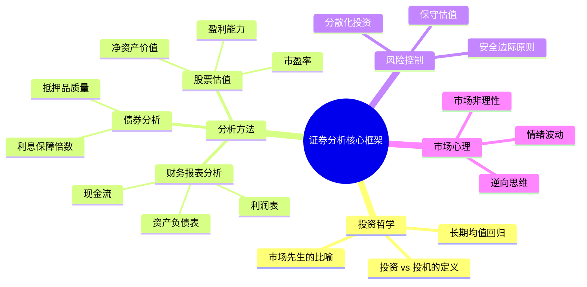

## 《证券分析》读书笔记
  
### 作者  
digoal  
  
### 日期  
2026-05-24  
  
### 标签  
读书笔记 , 证券分析   
  
----  
  
## 背景  
   
---
书名: 《证券分析》Security Analysis   
作者: 本杰明·格雷厄姆 / 戴维·多德   
出版年份: 1934（原著）/ 2013（中译本）   
笔记日期: 2026-05-24   
豆瓣链接: https://book.douban.com/subject/24869358/   
标签: [价值投资, 证券分析, 投资哲学, 金融经典, 巴菲特]   
---
   
   

> **一句话**：用工程师的严谨取代赌徒的直觉，将投资从"艺术"变成"科学"。   
> **适合谁读**：有一定财务基础的投资者、金融从业者、对价值投资感兴趣的进阶读者   
> **阅读难度**：⭐⭐⭐⭐☆（技术性强，篇幅近千页，需要耐心）   
> **推荐指数**：⭐⭐⭐⭐⭐   

---

## 一、时代坐标：这本书从哪里来？

1929年10月，华尔街股市崩盘，史称"黑色星期二"。美国股市在随后数年内蒸发了近90%的市值，无数人倾家荡产。其中有一个人叫本杰明·格雷厄姆——他在20世纪20年代是华尔街炙手可热的明星基金经理，大崩盘几乎将他彻底摧毁。

他没有选择逃离，而是选择思考：**为什么人们会赔钱？**

答案让他震惊：那个年代，"投资"根本没有科学的方法论。买股票靠小道消息，靠故事，靠感觉，靠无从验证的成长预期。当时华尔街流行的"智慧"是：「挑选那些最有可能快速成长的公司。」这句废话没有任何操作指南，却被奉为圭臬。

格雷厄姆在哥伦比亚大学开始讲授证券分析课程——他答应讲课的条件是要有人帮他记笔记，年轻助教大卫·多德承担了这个任务。五年后，这些课堂笔记和研究积累成了1934年出版的《证券分析》。

这本书诞生的背景极为特殊：**大萧条**。这意味着作者不是在牛市中讲如何追逐收益，而是在废墟中追问如何**保住本金、不再犯错**。这一出发点，塑造了整本书骨子里的保守气质，也让它穿越时代依然有效。

```
时间轴
──────────────────────────────────────────────────────────
1920s         1929         1928-1934        1934
华尔街狂热    黑色星期二    格雷厄姆反思     《证券分析》出版
股市泡沫膨胀  崩盘         哥大授课/多德记录  价值投资诞生
──────────────────────────────────────────────────────────
                  ↑
          格雷厄姆的"受难记"
          也是本书的精神起点
```

---

## 二、核心命题：作者在说什么？

### 命题一：投资与投机，必须泾渭分明

这是全书最重要的一道分水岭，也是格雷厄姆最犀利的一刀。

他给"投资"下了一个精确定义：**经过深入分析，能够确保本金安全并获得满意回报的操作，才叫投资；其他一切都是投机。**

这个定义有三个关键词：分析（Analysis）、本金安全（Safety of Principal）、满意回报（Adequate Return）。缺少其中任何一条，就滑入了投机的范畴。

这在今天仍有震撼力。大多数人买股票，心里想的是"这只股票会涨"，而不是"这家企业值多少钱"。前者是投机，后者才是投资。格雷厄姆的贡献，是让这条界线从哲学变成了可操作的方法。

### 命题二：内在价值是北极星

如果说格雷厄姆的方法论有一个核心，那就是**内在价值（Intrinsic Value）**。

内在价值不是一个精确的数字，而是一个基于企业资产、盈利能力、现金流、股息等客观因素估算出来的**合理价值区间**。它与市场价格是两回事——市场价格每天都在变，而内在价值相对稳定，由企业的基本面决定。

格雷厄姆的逻辑很简单：**市场短期是投票机，长期是称重机。** 短期价格可以偏离价值很远，但长期终将回归。因此，聪明的投资者只需要做一件事：在价格远低于价值时买入，耐心等待回归。

### 命题三：安全边际是护城河

这是格雷厄姆最重要的操作原则，也是《证券分析》送给所有投资者最实用的礼物。

安全边际（Margin of Safety）的含义是：**买入价格必须显著低于内在价值**，通常需要30%至50%的折扣。这个折扣不是为了赚取更多利润，而是为了对冲分析误差——因为没有人能精确计算内在价值，这个缓冲空间是承认人类认知局限性的智慧设计。

安全边际的逻辑类似于工程设计中的"安全系数"：建一座桥，设计承重10吨，你会造能承受30吨的结构。不是因为你预期10辆卡车同时过桥，而是因为**不确定性本身需要被定价**。

---

## 三、论证地图：格雷厄姆如何说服你？



格雷厄姆的论证方式很独特：他大量引用1920年代至1930年代的真实案例——那些在大萧条中崩溃的公司，那些看似繁荣却根基脆弱的股票。每一个数据，都是用真实的破产和亏损换来的教训。

书中对**财务报表**的解读尤其精彩。他教读者看穿会计游戏：哪些盈利是真实的，哪些是人为操纵的；哪些资产能在清算时变现，哪些只是账面数字。这种"法医级"的财务分析，在1934年是革命性的创新，至今仍是基本功。

---

## 四、前提假设与边界：什么情况下格雷厄姆不成立？

格雷厄姆的体系建立在几个重要假设上，理解这些假设，才能知道他的边界在哪里。

**假设一：市场长期会回归理性**
格雷厄姆相信，价格偏离价值是暂时的，终将修正。这在大多数情况下成立，但"暂时"可能是几年甚至更长。凯恩斯有句名言：「市场保持非理性的时间，可以比你保持偿付能力的时间更长。」价值陷阱（Value Trap）就是这个假设失效时的产物。

**假设二：内在价值可以被合理估算**
格雷厄姆专注于"可知的"信息：有形资产、历史盈利、现金流。但在互联网时代，亚马逊早期的市盈率高达数百倍，按格雷厄姆的方法毫无价值，却成了史上最伟大的商业帝国之一。当企业的核心价值来自于**无形资产、网络效应、平台生态**时，传统估值框架的局限性凸显。

**假设三：财务信息是可信的**
格雷厄姆时代的会计准则远不如今天规范，但他仍假设审计后的财务数据基本可信。安然、瑞幸等造假事件提醒我们，这个假设有时会被打破。

**适用边界**：格雷厄姆的方法最适合**重资产、成熟行业、盈利稳定**的传统企业，对轻资产、高速成长的科技公司效果有限。这不是方法的失败，而是工具适用场景的限制。

---

## 五、思想谱系：这本书在哪个传统里？

```
思想影响脉络

古典经济学（客观价值论）
         ↓
    格雷厄姆·多德
    《证券分析》1934
    ┌──────┴──────┐
    ↓              ↓
沃伦·巴菲特      沃尔特·施洛斯
（价值+成长）    （纯格雷厄姆派）
    ↓
查理·芒格加持
（护城河+品质）
    ↓
现代价值投资
（塞斯·卡拉曼等）
```

格雷厄姆的思想根植于**古典经济学的客观价值论**：商品有其内在价值，价格围绕价值波动。他将这一哲学嫁接到金融市场，奠定了基本面分析的整个学术传统。

他的弟子中最著名的当然是**沃伦·巴菲特**。巴菲特称格雷厄姆是他人生中除父亲外影响最深的人。但巴菲特后来在芒格的影响下，对格雷厄姆的框架做了重要升级：从"捡烟蒂"（买极度低估的垃圾公司）转向"以合理价格买优秀公司"。这一演进本身就是对格雷厄姆体系局限性的最好注脚。

《证券分析》与之后的**有效市场假说（EMH）**形成了思想上的根本对立。学术界一度认为价格已经反映所有信息，分析毫无意义；但格雷厄姆学派用几十年的实战业绩证明：市场并不总是有效的，耐心的分析者是可以持续获益的。

---

## 六、我学到了什么？

读完这本书，我最大的感受是：**格雷厄姆真正教的不是选股技巧，而是一种思维方式**。

**收获一：用"企业主"的眼光看股票**

格雷厄姆说，买一只股票，就是成为这家企业的小股东。没有人购买农场时，会因为昨天邻居的农场报价低了就恐慌抛售自己的田地。股票背后是真实的企业，这个朴素的认知，在市场狂热时极难坚守，却是价值投资的基石。

**收获二：无知是最大的风险**

格雷厄姆对"安全边际"的强调，本质上是对人类认知局限性的谦卑承认。我们永远无法精确预测，但我们可以在价格足够便宜时，让错误的代价变得可以承受。这个逻辑可以迁移到任何决策场景：为不确定性留出余地，是智慧的普遍形式。

**收获三：情绪管理是投资的隐性技能**

格雷厄姆的"市场先生"比喻至今绝妙：把市场想象成一个情绪不稳定的合伙人，他每天敲门给你报价，有时狂喜出高价，有时沮丧出低价。你不必跟着他的情绪走，你只需要在他报价合理甚至离谱便宜时交易，其他时候，忽略他即可。

---

## 七、举一反三：这个框架还能用在哪？

**场景一：买房决策**
格雷厄姆的框架完全可以套用在房产上：租金收益率（内在价值的代理指标）与房价的比值，就是安全边际的衡量工具。当房价是年租金的60倍时，安全边际为负；当房价是年租金的20倍时，安全边际充裕。

**场景二：个人职业选择**
把"自己"当做一只股票来分析：你的核心能力（资产）、长期可持续的收入能力（盈利）、你在市场上的稀缺性（护城河）。在哪个行业、哪家公司，你的价值被低估了？那就是值得"买入"的机会。

**场景三：企业并购谈判**
战略买家评估标的公司时，格雷厄姆的财务分析框架依然是基础：清算价值是底线，持续经营价值是合理价，协同效应是溢价空间。任何超出内在价值太多的收购，都是在用股东的钱冒险。

---

## 八、批判与反思

格雷厄姆的体系有一个根本性的**偏见**：他更信任过去，而不信任未来。

他的估值方法以历史数据为主——历史盈利、历史资产、历史现金流。这在工业时代是合理的，因为成熟企业的护城河来自规模、设备、品牌，这些都体现在资产负债表上。

但在数字时代，最有价值的东西往往**不在财报上**：用户数据、算法、网络效应、开发者生态……谷歌2004年上市时，格雷厄姆的方法会告诉你它严重高估；亚马逊连续多年几乎零盈利，按传统估值是废纸一张。

更深层的问题是：**格雷厄姆的方法需要极大的耐心和心理强度，而这正是普通人最欠缺的**。知道安全边际的概念是一回事，在股市暴跌时坚持持有"被低估"的股票，又是另一回事。方法论的传授是可能的，心理素质的训练却不在书本里。

最后，《证券分析》写于信息极度不对称的年代。今天，财务数据人人可得，量化模型在毫秒级筛选低估值股票，纯机械执行格雷厄姆策略的超额收益空间已大幅压缩。它的方法论仍然有效，但超额收益比格雷厄姆时代要难得多。

---

## 九、金句与记忆点

**1. 投资的定义**
> 经过深入分析，能够确保本金安全并获得满意回报的操作，才是投资；其余皆为投机。

这是格雷厄姆最锋利的一刀，切断了大多数人自以为在"投资"实则在"赌博"的幻觉。

**2. 市场先生**
> 把市场想象成一个每天敲你门的情绪化合伙人——你不必跟随他的喜怒，你只需要在他恐慌割肉时买入，在他狂热高价时卖出。

这个比喻将市场非理性具象化，是格雷厄姆最伟大的修辞发明，影响了巴菲特几十年的投资框架。

**3. 安全边际**
> 安全边际是价格对价值的显著折扣，它是为了对冲分析误差，而非为了保证盈利。

这句话的深刻在于：它承认人类的认知局限，并将谦卑编写进了操作规则。

**4. 内在价值的模糊性**
> 内在价值不是一个精确数字，而是一个区间——聪明的分析师只需要判断价格是否偏离价值"足够远"。

这是格雷厄姆对伪精确主义的警告：不要追求不存在的精确，要追求足够正确。

**5. 投机的本质**
> 那些不了解自己在做什么的人，永远是在投机，哪怕他们用了最精密的图表。

技术分析盛行的今天，这句话仍像一盆冷水。

**6. 分散的智慧**
> 安全边际的真正意义，在于它允许你在某些判断失误时，组合整体依然盈利。

这是概率思维的精髓：不是每笔交易都要对，而是整体期望值为正。

---

## 十、延伸阅读

**1. 《聪明的投资者》—— 本杰明·格雷厄姆**
《证券分析》的"普及版"，更适合个人投资者。巴菲特称其为"有史以来最好的投资书籍"。如果《证券分析》太厚，先读这本。

**2. 《安全边际》—— 塞斯·卡拉曼**
现代价值投资的扛鼎之作，是对格雷厄姆思想的当代诠释与升级，原版绝版二手书已卖到数千美元。

**3. 《巴菲特致股东的信》—— 沃伦·巴菲特**
格雷厄姆体系的"使用说明书"，看巴菲特如何在实战中演绎和修正了老师的思想。免费可获取，性价比极高。

**4. 《查理·芒格的投资思维》—— 彼得·考夫曼编**
了解为什么巴菲特会从"格雷厄姆式烟蒂投资"转向"买优秀企业"，芒格的思想是理解这一转变的关键。

**5. 《漫步华尔街》—— 伯顿·马尔基尔**
这本书持有与格雷厄姆截然相反的立场（有效市场）。读完两本，再形成自己的判断，才是真正的独立思考。

---

*笔记写于 2026年5月24日 | 基于公开资料、书评与深度思考整理*
*核心素材来源：Amazon书评、Goodreads、知乎专栏、新浪财经、Wikipedia*
  
  
#### [PostgreSQL 解决方案集合](../201706/20170601_02.md "40cff096e9ed7122c512b35d8561d9c8")
  
  
#### [德哥 / digoal's Github - 公益是一辈子的事.](https://github.com/digoal/blog/blob/master/README.md "22709685feb7cab07d30f30387f0a9ae")
  
  
#### [About 德哥](https://github.com/digoal/blog/blob/master/me/readme.md "a37735981e7704886ffd590565582dd0")
  
  

  
