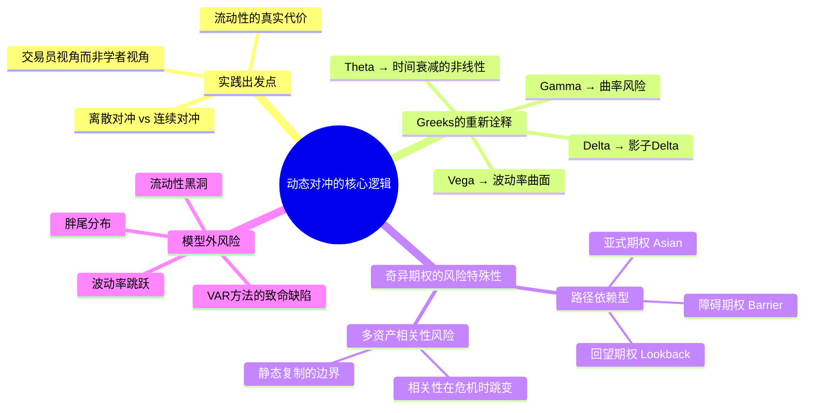

## 《动态对冲：管理普通期权与奇异期权》读书笔记
  
### 作者  
digoal  
  
### 日期  
2026-05-24  
  
### 标签  
读书笔记 , 动态对冲：管理普通期权与奇异期权   
  
----  
  
## 背景  
   
---
书名: 《动态对冲：管理普通期权与奇异期权》   
原名: Dynamic Hedging: Managing Vanilla and Exotic Options   
作者: Nassim Nicholas Taleb（纳西姆·尼古拉斯·塔勒布）   
出版年份: 1997（中译本：2016）   
笔记日期: 2024-05-24   
出版社: 中国财政经济出版社（中译本）/ John Wiley & Sons（原版）   
ISBN: 9787509544815   
标签: [期权, 衍生品, 风险管理, 对冲, 金融工程, 塔勒布]   
---

   

> **一句话**：这不是一本教你赚钱的书，而是一本教你**不死**的书——当市场动荡撕裂所有模型假设时，真正懂得风险的交易员靠的是什么？   
>   
> **适合谁读**：期权交易员、衍生品风险管理者、量化研究员、金融工程学生、以及任何想真正理解"风险"而非"定价公式"的人   
>   
> **阅读难度**：⭐⭐⭐⭐⭐（五星满分，极硬核，不建议零基础读者直接上手）   
>   
> **推荐指数**：⭐⭐⭐⭐⭐（从业者案头必备，无可替代的孤本）   

---

## 一、时代坐标：这本书从哪里来？

1997年，正是金融衍生品市场的"黄金时代"与"危险时代"并存的节点。

1987年的"黑色星期一"刚刚过去十年，那场单日暴跌22%的市场崩溃，用残酷的方式证明了一件事：**华尔街的风险模型在极端事件面前几乎是废纸**。而当时主导市场的投资组合保险策略（Portfolio Insurance），恰恰在理论上依赖"连续动态对冲可以完美复制期权"——一个在现实中根本不成立的假设。

与此同时，场外衍生品市场（OTC Derivatives）正以爆炸式速度扩张。亚洲金融危机即将到来（1997年7月），长期资本管理公司（LTCM）正在走向1998年的崩溃边缘。整个金融体系充斥着一种幻觉：模型越精妙，风险越可控。

正是在这个背景下，Taleb——一个同时持有博士学位（巴黎第九大学）和Wharton MBA、又在纽约、伦敦、芝加哥交易场内摸爬滚打多年的"学者交易员"——写出了这本书。他的愤怒很明显：**学术界在教连续时间金融数学，而真实的交易台在处理离散跳跃、流动性黑洞和胖尾分布**。两个世界之间，没有翻译器。

他要写一本给真实交易员看的书。

```
时间轴（Taleb的思想演进）

1987 ──────── 1997 ──────── 2001 ──────── 2007 ──────── 2012
黑色星期一    《动态对冲》   《随机致富的   《黑天鹅》    《反脆弱》
期权胖尾被    实践手册成型   傻瓜》问世     成为全球
真实感受到                               畅销书
                  ↑
          本书写于此时
          技术性最强、实践性最深
          Taleb思想的"地基"
```

---

## 二、核心命题：作者在说什么？

### 命题一：Delta不是一个数，而是一段区间

教科书告诉我们，期权的Delta是期权价格对标的资产价格的一阶导数 `∂V/∂S`，一个精确的连续导数。

Taleb的反驳是：**没有交易员能在连续时间里对冲**。现实中，所有对冲都发生在离散的时间点之间——每隔几分钟、几小时，或者每天重新平衡一次。这意味着真正重要的不是某一点的导数，而是**在一个有限价格区间内，delta实际会移动多少**。

他引入"影子Delta"（Shadow Delta）和"影子Gamma"（Shadow Gamma）的概念，本质是把连续导数替换成有限差分：当价格移动1%时，期权价格到底变化了多少？这个数字才是交易台每天真正在用的东西。

这个看似微小的区别，在靠近到期日或靠近障碍（Barrier）时会变得致命——理论Delta可能是0.5，而实际上价格稍微一动，Delta就从0跳到1，整个对冲策略瞬间失效。

### 命题二：波动率不是一个参数，而是整张曲面

Black-Scholes模型有一个内隐假设：波动率是常数。但任何交易过期权的人都知道，市场上不同行权价、不同到期日的期权，隐含的波动率（Implied Volatility）完全不同，形成一张凹凸不平的"波动率曲面"（Volatility Surface）。

Taleb对这张曲面投入了大量篇幅，因为这正是**定价模型与现实之间的裂缝**所在。曲面的斜率（Skew）告诉你市场对尾部风险的实际定价；曲面的弯曲程度（Smile）反映了市场对跳跃风险的集体判断。

理解波动率曲面，就是理解"市场真正在为什么买单"——而不是模型说的那个东西。

### 命题三：模型是工具，不是真理；真正的风险在模型之外

这是全书最根本的哲学立场，也是Taleb后来整个"Incerto"系列的起点。

他将风险分为两类： **"模型内风险"（on-model risk）** ——用Greeks可以量化和对冲的那部分；以及 **"模型外风险"（off-model risk）** ——模型根本没有办法捕捉的那部分，比如流动性突然消失、相关性在危机中突然跳变、市场微观结构的失灵。

Taleb认为，大多数金融灾难不是因为模型算错了，而是因为人们忘记了模型的**前提假设在现实中并不成立**：正态分布、连续交易、固定波动率、充足流动性……这些假设在平静时期看起来无害，在极端事件面前会同时崩塌。

---

## 三、论证地图：Taleb怎么说服你的？



**Taleb的论证方式非常特别**：他不从理论推导，而是从**交易场景**出发。书中充满了"假设你是一个做市商，此刻你持有XX头寸，市场突然发生YY变化，你会怎么办"式的情景分析。

这种叙事方式让书的价值非常持久——金融市场在变，但交易员面临的基本困境没有变。

**关键数据与案例**：Taleb在书中专门讨论了障碍期权（Barrier Options）靠近障碍价格时的Gamma爆炸问题。以一个敲出期权为例，当价格靠近障碍时，Delta可能在几分钟内从0.8跳到接近0，任何基于连续Delta假设的对冲策略都会产生灾难性的追踪误差。这不是理论上的极端情况，而是每个做市商都会遇到的日常风险。

---

## 四、前提假设与边界：什么情况下这不成立？

```
Taleb框架的隐含假设 vs 现实检验

假设1: 你是做市商/自营交易员，持有大量期权头寸
       → 如果你只是偶尔交易期权，很多内容用不上

假设2: 你能访问实时报价和流动性信息
       → 在流动性极差的市场，很多对冲策略根本无法执行

假设3: 基础产品还在正常交易
       → 熔断、交易所故障、系统性危机下，假设不成立

假设4: 波动率曲面存在且可观察
       → 新兴市场、小众合约往往没有足够的期权深度
```

这本书有一个重要的边界：它主要讨论**权益期权（Equity Options）和外汇期权（FX Options）**，对利率衍生品和大宗商品的覆盖相对有限。如果你在这些领域工作，需要补充其他材料。

此外，算法交易和高频交易的崛起已经改变了市场微观结构。Taleb讨论的很多流动性问题，在今天的自动化做市商（AMM）环境下有了新的面向——书中的洞见仍然成立，但具体机制需要重新映射。

---

## 五、思想谱系：这本书站在哪个传统里？

```
金融工程思想谱系

Black-Merton-Scholes (1973)
    ↓ 连续时间对冲理论
    ↓
Harrison & Pliska (1981)
    ↓ 鞅定价理论
    ↓
Dupire / Derman-Kani (1994)
    ↓ 局部波动率 → 解释波动率微笑
    ↓
    ├──→ 学院派：继续完善连续时间模型
    │         (随机波动率：Heston模型等)
    │
    └──→ Taleb (1997)
              ↓ 批判：这些模型在真实交易中如何使用？
              ↓ 实践者视角：离散、胖尾、流动性
              ↓
         后续影响：
         - 压力测试方法论
         - 尾部风险对冲策略
         - Empirica Capital / 通过买入远期虚值看跌期权获利于2000年科技股崩溃
         - 《黑天鹅》普及版思想
```

Taleb的思想来源是多元的：他吸收了Mandelbrot的分形几何（胖尾分布的数学基础）、Popper的证伪主义哲学（对模型的怀疑主义），以及古典斯多葛哲学（对不确定性的接受与准备）。

在金融界，他与Bruno Dupire（波动率曲面先驱）、Emanuel Derman（高盛量化老将）有深度对话，但他的立场更接近"怀疑论者"而非"建模者"。

---

## 六、我学到了什么？

读这本书，最大的震撼不是某个具体技巧，而是**一种对风险的认知方式的颠覆**。

**收获一：把Greeks从公式变成直觉**

在读这本书之前，我理解Gamma是"Delta对价格的二阶导数"——一个数学概念。读完之后，Gamma变成了一种**物理感受**：它是期权头寸在价格运动时"加速"或"减速"的程度。做多Gamma的交易员喜欢大波动，做空Gamma的交易员会在剧烈波动时流血。理解这一点，才能理解为什么障碍期权在靠近障碍时如此危险，也才能理解为什么2008年金融危机中那些做空波动率的策略会在数天内归零。

**收获二：模型之外才是真正的战场**

Taleb反复强调：定价是科学，对冲是艺术。模型给你一个起点，但真实市场里的流动性成本、冲击成本、执行摩擦，都是模型无法量化的。一个交易员如果只会"按照模型对冲"，在平静时期看起来很专业，在危机时期会被市场无情惩罚。

**收获三：尾部风险不是"小概率事件"，而是"被低估的大概率事件"**

这是Taleb思想中最深刻的部分。正态分布假设告诉你，5个标准差的事件概率可以忽略不计。但真实金融市场的回报分布有"胖尾"——极端事件发生的频率，远超正态分布的预测。这意味着：不是要不要担心黑天鹅，而是要认识到**你每天的定价已经在系统性地低估尾部风险**。

---

## 七、举一反三：这个框架还能用在哪？

**场景一：任何存在非线性回报的决策**

Taleb引入了一个宏大的"广义期权"概念：任何**凸性回报（Convex Payoff）**的东西，都可以用期权框架来理解。一个创业者的股权激励？凸性的。一个银行贷款员的薪酬结构（稳定工资+奖金上限）？凹性的（偏向做空波动率）。理解自己处于哪种回报结构，是做出更好决策的基础。

**场景二：认识"模型依赖"的陷阱**

不只在金融，任何依赖复杂模型做决策的领域——医疗AI、气候预测、宏观经济政策——都面临同样的问题：模型在正常状态下表现良好，在极端状态下可能系统性失效。Taleb的"on-model / off-model"框架，提醒我们永远要问：**我的决策有多少依赖于模型假设？如果假设失效，结果如何？**

**场景三：凸性思维（Convexity Thinking）**

跨越金融，这本书教会你欣赏"凸性"的价值：如果你的损失有上限，收益没有上限，那么你处于对自己有利的位置。在职业规划、投资组合构建、甚至人际关系管理上，寻找"正凸性"（做多期权）、回避"负凸性"（做空期权）是一种通用的决策框架。

---

## 八、批判与反思

**批评一：可读性真的很糟糕**

即使是专业读者，这本书也不容易读。章节之间逻辑跳跃，叙述风格随意，有时一个重要概念藏在不起眼的小节里。Taleb本人似乎并不在乎你是否读得下去——这是优点（不迎合读者），也是缺点（让真正有价值的内容难以提取）。

**批评二：部分内容被时代改写**

书中对VAR（风险价值模型）的批评在今天已经是主流共识，2008年金融危机之后，监管机构和学界都已经承认VAR模型的局限性，并引入了压力测试（Stress Testing）和预期损失（Expected Shortfall）等补充工具。但书中的技术细节——比如对特定期权结构的讨论——部分已被市场实践迭代更新。

**批评三：Taleb的"愤怒"有时过于情绪化**

他对学术金融经济学的批评是有道理的，但有时显得过于轻蔑。很多他批评的模型，在适当假设下仍有重要的启发价值。绝对的"模型无用论"，和绝对的"模型万能论"一样，都是危险的单边信仰。

---

## 九、金句与记忆点

> **"交易员最不应该做的事，就是在上班时间扮演科学家或计量经济学家。"**
> — 解析：模型是事前的工具，不是事中的枷锁。真实市场需要的是直觉、经验和对情境的感知，而非实时地套公式。

> **"如果定价是科学，那么对冲就是艺术。"**（Bruno Dupire 为本书所作评语，代表了业界对本书的定位）
> — 解析：模型可以标准化，但执行不能。市场冲击、交易时机、流动性管理，这些永远无法被公式完全捕捉。

> **"广义期权：任何具有凸性回报的工具，包括交易员的潜在奖金。"**
> — 解析：Taleb把期权框架扩展到所有凸性收益结构——这是从金融工具到通用思维框架的关键一跃。

> **"胖尾不意味着更高的方差，而是不同类型的方差。"**
> — 解析：极端事件不是"超出预期的波动"，而是一种根本不同的概率结构——不能用均值和方差来描述，需要全分布来理解。

> **"真正的风险不在模型里，而在模型的假设里。"**
> — 解析：任何定量风险管理体系的致命弱点，都藏在建模者写下的第一个假设中，而不在之后的数学推导里。

---

## 十、延伸阅读

**读完本书之后，推荐按以下顺序拓展：**

1. **《随机致富的傻瓜》（Fooled by Randomness）— Taleb**
   同一作者，但面向大众，是《动态对冲》哲学思想的普及版。理解了技术层面，再读哲学层面，Taleb的体系才完整。

2. **《期权、期货及其他衍生品》— John Hull**
   如果《动态对冲》是给老手看的，Hull的书是这个领域最系统的入门教材。两本书互补，Hull给基础，Taleb给深度。

3. **《波动率交易》（Volatility Trading）— Euan Sinclair**
   专注于波动率策略的实践手册，是对Taleb关于波动率曲面讨论的很好补充，更接近当代市场实践。

4. **《黑天鹅》（The Black Swan）— Taleb**
   本书思想的哲学深化版，从期权市场的胖尾观察，扩展到人类认知在极端事件面前的系统性盲区。

5. **《市场的错位》（The Misbehavior of Markets）— Benoit Mandelbrot & Richard Hudson**
   Mandelbrot是Taleb最重要的思想来源之一，这本书从分形几何视角解释金融市场的胖尾结构，是理解为何正态分布在金融中失效的最佳读物。

---

```
本书地位小结

                    实践性
                      ↑
              ★《动态对冲》
                （高实践 + 高深度）
              /
             /
            /——————————————→ 理论深度
           /
  Hull《期权、期货及其他衍生品》
  （高实践 + 适中深度）

  《黑天鹅》《反脆弱》
  （高影响力 + 通俗性）
```

*笔记写于 2024-05-24 | 基于公开资料、学界评价与深度思考整理*
*核心参考：Wiley出版社原版简介、Goodreads专业读者评论、NYU Taleb学术主页、Grokipedia、financetrainingcourse.com*
  
  
#### [PostgreSQL 解决方案集合](../201706/20170601_02.md "40cff096e9ed7122c512b35d8561d9c8")
  
  
#### [德哥 / digoal's Github - 公益是一辈子的事.](https://github.com/digoal/blog/blob/master/README.md "22709685feb7cab07d30f30387f0a9ae")
  
  
#### [About 德哥](https://github.com/digoal/blog/blob/master/me/readme.md "a37735981e7704886ffd590565582dd0")
  
  

  
