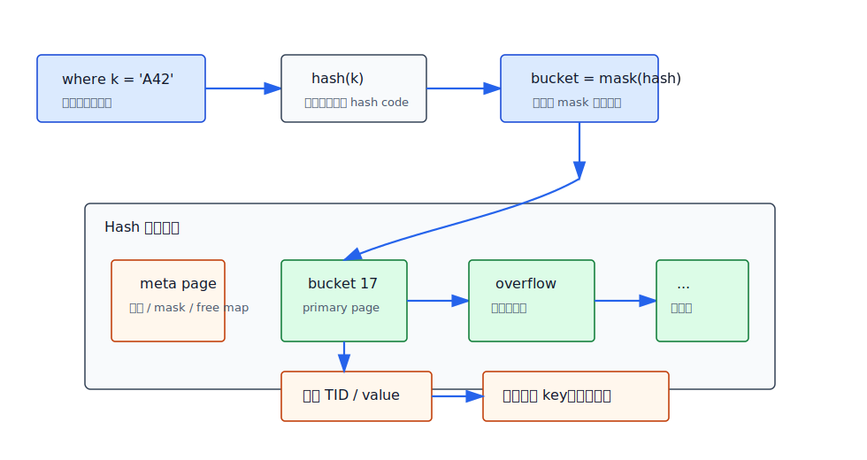
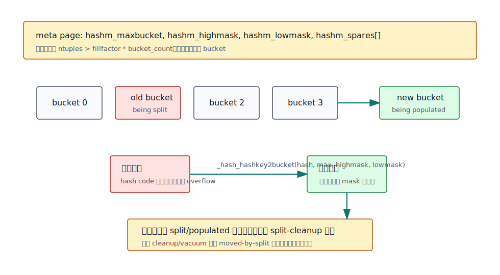
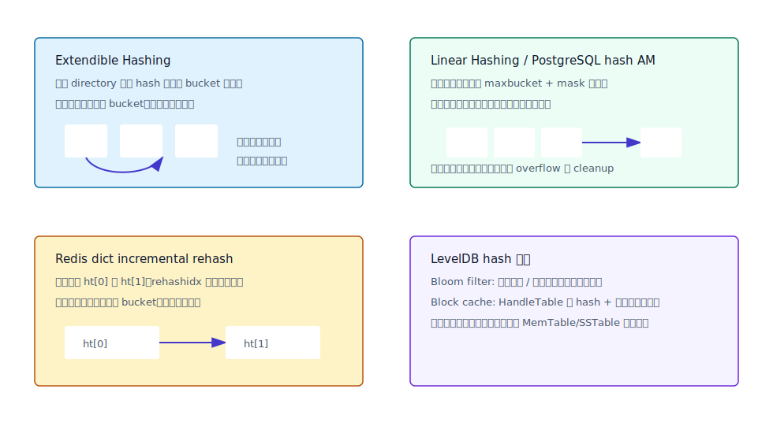
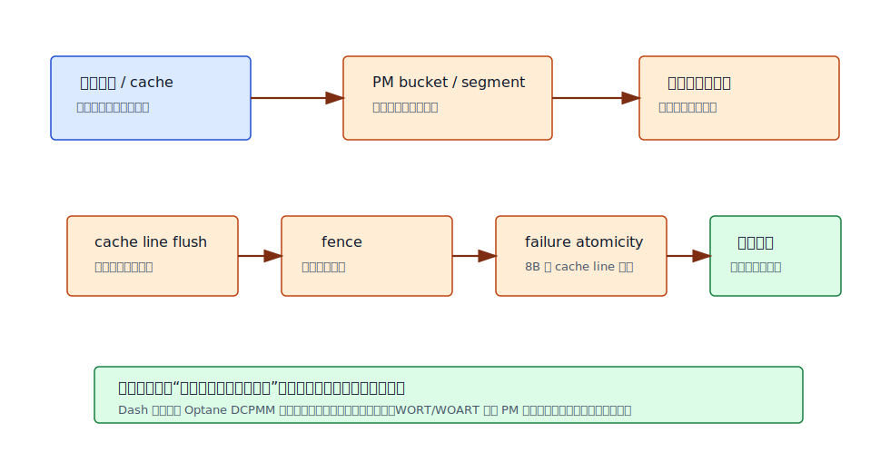

## 数据库筑基课 - hash 索引结构
                                                                                            
### 作者                                                                
digoal                                                                
                                                                       
### 日期                                                                     
2026-05-24                                                      
                                                                    
### 标签                                                                  
PostgreSQL , Redis , LevelDB , Hash Index , Dynamic Hashing , Persistent Memory , 索引结构 , 数据库筑基课      
                                                                                           
----                                                                    

## 背景
  


本节属于“索引结构”的基础能力。课程大纲链接未在输入资料中提供，因此本文直接从工程问题切入：业务里大量访问是 `id = ?`、`token = ?`、`device_id = ?`、`session_key = ?` 这样的等值查找。B+Tree 也能做等值查找，但它为了顺序、范围扫描、排序和页分裂维护了更多结构；如果 workload 明确只要等值定位，hash 索引把问题改写成“先把 key 压缩成 hash code，再用 hash code 找桶”。

这个改写很诱人，也很危险。诱人之处是理论上等值查找接近 `O(1)`，桶定位路径短；危险之处是 hash 不保序，不支持范围扫描，碰撞必须处理，扩容可能造成停顿或写放大，磁盘页和持久内存还会把“桶分裂、overflow、WAL、flush、恢复”变成真正的工程成本。

本文以 PostgreSQL 磁盘 hash index 为主线，结合 Redis 的内存 dict、LevelDB 的 Bloom filter/cache hash、以及 Extendible Hashing、Linear Hashing、Cuckoo Hashing、Hopscotch Hashing、Dash、WORT/WOART 等论文，解释 hash 索引结构该怎么理解、怎么用、边界在哪里。

## 一、它解决什么问题？

hash 索引解决的是“动态集合里的等值定位”问题：给定一个 key，快速判断它在哪个桶里，然后在桶内确认目标项。它不解决“按 key 排序”“找大于某个 key 的第一条记录”“分页范围扫描”这些问题。

数据库里会出现三类典型需求：

- **磁盘索引：** PostgreSQL `CREATE INDEX ... USING hash` 把被索引列的值转成 32-bit hash code，查询计划器只在等号谓词上考虑 hash index。源码和文档都明确了这一点：hash index 存储的是 hash code，不是原始值，因此 scan 后还要回表重检。
- **内存字典：** Redis `dict` 用 power-of-two 桶数组、链地址法、双表渐进 rehash 支撑 key-value store、expire dict、command table、hash object 等内部结构。
- **读路径过滤和缓存：** LevelDB 不把 hash 作为主数据索引；它用 Bloom filter 减少无效 SSTable/block 读取，用 block cache 的 hash table 定位缓存块，主数据结构仍然是 MemTable 跳表和 SSTable 有序 block。

所以 hash 的第一原则是：**用顺序能力换等值定位速度**。如果你的查询天然是范围、排序、前缀、最近邻、模糊匹配，hash 索引通常不是第一选择。

## 二、它是什么？

hash 索引可以抽象为四层：

1. **hash function：** 把原始 key 映射为固定宽度 hash code。
2. **bucket addressing：** 用目录、mask、取模或多 hash 函数把 hash code 映射到桶。
3. **collision handling：** 一个桶里可能有多个 key，常见方式包括链地址、开放寻址、cuckoo 搬迁、hopscotch 邻域位图等。
4. **growth and recovery：** 数据增长后如何扩桶，崩溃后如何恢复，删除后如何回收空间。



图 1 说明：hash 索引不是“直接从 key 到行”。它先把 key 变成 hash code，再定位桶，桶内可能有 primary page 和 overflow page。由于 hash 碰撞以及 PostgreSQL hash index 只保存 hash code，命中索引后仍要回表或重检原始谓词。

## 三、核心原理

### 1. 静态 hash：简单，但扩容代价高

最朴素的 hash table 是固定桶数：`bucket = hash(key) % N`。问题是 `N` 一变，大量 key 的桶号都会改变，整表 rehash 很贵。内存里可以接受一次性搬迁，磁盘索引和在线数据库通常不能接受长时间停顿。

因此数据库课程里最重要的不是“hash 怎么算”，而是“桶怎么增长”。

### 2. Extendible Hashing：目录换局部分裂

Fagin、Nievergelt、Pippenger、Strong 在 1979 年提出 Extendible Hashing，用一个 directory 保存 hash 前缀到 bucket 的映射。每个 bucket 有 local depth，directory 有 global depth。桶满时只分裂相关 bucket；如果 local depth 已经等于 global depth，才把 directory 翻倍。

它的优点是定位路径清晰，论文摘要强调唯一键定位最多两次页访问这一类目标；代价是 directory 可能变大，并且 directory 本身要被并发和恢复机制保护。

### 3. Linear Hashing：不用目录，按顺序分裂桶

Litwin 在 1980 年提出 Linear Hashing，核心是地址空间动态增长，保持负载稳定，同时避免一次性全表 rehash。它不靠全局目录翻倍，而是维护当前轮次和 split pointer：每次扩容只新增一个桶，并按线性顺序分裂某个旧桶。

PostgreSQL hash index 更接近这个家族。`src/backend/access/hash/README` 明确说 PostgreSQL hash index 可增量扩展；新 bucket 添加时只需要 split 一个已有 bucket，把其中一部分 tuple 转移到新 bucket。源码里 `_hash_hashkey2bucket()` 的核心逻辑是：

```c
bucket = hashkey & highmask;
if (bucket > maxbucket)
    bucket = bucket & lowmask;
```

这对应 `hashm_maxbucket`、`hashm_highmask`、`hashm_lowmask` 这三个元数据字段。它避免了全局目录，但会带来 overflow page、bitmap free space、split-cleanup、WAL 和并发锁顺序等复杂性。



图 2 说明：PostgreSQL 每次扩容尝试新增一个 bucket。旧桶打上 `LH_BUCKET_BEING_SPLIT`，新桶打上 `LH_BUCKET_BEING_POPULATED`；属于新桶的 tuple 被复制过去并标记 `INDEX_MOVED_BY_SPLIT_MASK`，完成后旧桶进入 split-cleanup 状态，后续清理旧副本。

### 4. PostgreSQL 磁盘 hash index 的物理结构

PostgreSQL hash index 有四类页面：

- **meta page：** block 0，保存 `hashm_ntuples`、`hashm_ffactor`、`hashm_maxbucket`、`hashm_highmask`、`hashm_lowmask`、`hashm_spares[]`、`hashm_mapp[]` 等控制信息。
- **primary bucket page：** 每个 bucket 的起始页，永久归属该 bucket。
- **overflow page：** 桶内放不下时追加到桶链，双向链表挂在 page special space。
- **bitmap page：** 记录可复用的 overflow page。

源码里的 `HashPageOpaqueData` 保存 `hasho_prevblkno`、`hasho_nextblkno`、`hasho_bucket`、`hasho_flag`。README 特别说明：bucket page 的 `hasho_prevblkno` 在主桶页上复用为“上次分裂时的 bucket count”，用于判断 backend 缓存的 meta page 是否过旧。

PostgreSQL 8.4 之后 hash index entry 只存 hash code，不存原始 indexed value。这样 index tuple 更小，页内可以按 hash code 排序并二分查找；代价是碰撞不能在 index 内完全判定，`_hash_checkqual()` 当前总是返回 true，依赖主扫描代码重检。

### 5. Redis 与 LevelDB 给数据库工程的对照

Redis `dict` 是内存 hash table，不是磁盘索引。它用两个表 `ht_table[0]`、`ht_table[1]` 支撑渐进 rehash，`rehashidx` 表示旧表迁移到哪里。普通读写会顺手做 `_dictRehashStep()`，避免单次 rehash 阻塞主线程。碰撞用链地址法，桶数组大小是 2 的幂，用 mask 定位。

LevelDB 则展示了另一个边界：hash 未必是主索引。Bloom filter 的 `KeyMayMatch()` 只回答“可能存在/一定不存在”，允许 false positive，不允许 false negative；block cache 的 `HandleTable` 用 hash + 链表定位缓存块。主数据路径仍然依赖 MemTable/SSTable 的有序结构，因为 LSM 需要范围扫描和 compaction。



图 3 说明：Extendible Hashing 用目录换局部分裂；Linear Hashing 用 mask 和线性分裂减少目录成本；Redis 用双表渐进 rehash 降低内存搬迁停顿；LevelDB 把 hash 放在过滤和缓存层，而不是主有序索引层。

### 6. PM hash：持久化写放大成为第一约束

持久内存把 hash 结构的问题换了一个维度：不是只看查找次数，还要看每次更新需要多少 cache line flush、fence、日志或 CoW。WORT/WOART 论文讨论 radix tree 在 persistent memory 上为何要以 failure-atomic write 为核心约束；HMEH/OP-HMEH 这类 radix-tree-assisted dynamic hashing 把 bucket 放在 NVM、把目录放在 DRAM，并用持久 radix tree 支撑崩溃后目录恢复；Dash 论文则在真实 Intel Optane DCPMM 上把 extendible hashing 和 linear hashing 适配为可扩展、动态增长、可即时恢复的 PM hash 方案，并报告了高负载因子和恢复时间目标。

这说明未来的 hash 索引不只是“桶更多、冲突更少”。在 PM、NVM、RDMA、分布式 KV 场景里，扩容元数据、桶迁移、恢复路径和并发协议往往比单次 hash 计算更重要。



图 4 说明：PM hash 要同时控制易失目录、持久 bucket、恢复元数据、flush/fence 和失败原子写。传统磁盘 hash 关心页访问和 WAL；PM hash 还要把每次结构修改压缩到少量可证明的持久写。

## 四、横向对比

| 维度 | PostgreSQL hash index | B+Tree | Redis dict | LevelDB Bloom/cache hash | Cuckoo/Hopscotch |
|---|---|---|---|---|---|
| 主要目标 | 磁盘等值索引 | 通用有序索引 | 内存 key-value 字典 | 过滤无效读、定位缓存块 | 内存 hash table 高性能变体 |
| 查询能力 | 等号谓词 | 等值、范围、排序、前缀类操作 | 等值查找 | Bloom 是概率判断，cache 是等值定位 | 等值查找 |
| 顺序能力 | 无 | 强 | 无 | 无主索引顺序能力 | 无 |
| 冲突处理 | 桶页链 + hash code 重检 | key 顺序分隔 | 链地址法 | Bloom 多 probe；cache 链地址 | 多位置搬迁 / 邻域探测 |
| 扩容方式 | 线性分裂，一个 bucket 一次 | 页分裂/合并 | 双表渐进 rehash | filter 随 SSTable 构建；cache resize | 常需 rehash 或局部搬迁 |
| 删除回收 | VACUUM 删除 dead tuple，overflow 可复用，bucket 不收缩 | VACUUM/页回收，具体看实现 | 删除 entry，可 shrink | filter 不原地删；cache evict | 实现相关 |
| 适合场景 | 大量等值查询且不需要排序范围 | 默认主力索引 | 内存对象字典 | 读放大控制和缓存 | 内存低延迟字典 |
| 不适合场景 | 范围查询、排序、唯一约束依赖、低选择性列 | 纯等值且极端追求常数因子时可能偏重 | 磁盘页索引 | 需要准确存在性判断 | 持久化/并发恢复复杂 |

这张表的关键不是谁“更快”，而是它们牺牲了什么。hash 牺牲顺序；B+Tree 保留顺序但维护成本更高；Bloom filter 牺牲精确性换少读磁盘；cuckoo/hopscotch 常为内存 cache locality 和常数查找服务，但扩容、并发、持久化不是免费的。

## 五、效果如何？

不要编造 hash 索引一定更快。更可靠的判断方式是看 workload：

- **高选择性等值查询：** hash index 可能缩短索引定位路径，但 PostgreSQL B-tree 对等值查询也很成熟，实际差距要用 `EXPLAIN (ANALYZE, BUFFERS)` 验证。
- **低选择性等值查询：** 如果一个值命中大量行，瓶颈通常是 heap 访问和可见性判断，hash index 帮助有限。
- **频繁插入：** PostgreSQL hash index 插入可能触发 overflow page 或 bucket split，并伴随 WAL、cleanup lock、bitmap page 管理。
- **删除更新频繁：** hash index 需要 VACUUM 清理 dead tuple；README 明确说 bucket 数没有 shrink 机制，只能通过 `REINDEX` 缩小整个 index。
- **范围查询：** hash index 不提供顺序，无法替代 B-tree。

## 六、实操 DEMO

下面示例是最小验证脚本，本文未在本机启动 PostgreSQL 实例执行，因此不提供伪造输出。读者可以在自己的环境中执行，并重点比较计划和 buffer。

```sql
CREATE TABLE hash_demo (
    id bigint GENERATED ALWAYS AS IDENTITY PRIMARY KEY,
    uid text NOT NULL,
    payload text,
    created_at timestamptz DEFAULT now()
);

INSERT INTO hash_demo(uid, payload)
SELECT md5(i::text), repeat('x', 80)
FROM generate_series(1, 1000000) AS s(i);

CREATE INDEX hash_demo_uid_btree_idx ON hash_demo(uid);
CREATE INDEX hash_demo_uid_hash_idx ON hash_demo USING hash(uid);
ANALYZE hash_demo;

-- 等值查询：观察 planner 选择哪个索引，以及 heap 访问量
EXPLAIN (ANALYZE, BUFFERS)
SELECT * FROM hash_demo WHERE uid = md5('424242');

-- 范围查询：hash index 不适用，B-tree 才有顺序能力
EXPLAIN (ANALYZE, BUFFERS)
SELECT * FROM hash_demo WHERE uid >= 'a' AND uid < 'b';

-- 查看 index 大小
SELECT
    relname,
    pg_size_pretty(pg_relation_size(oid)) AS size
FROM pg_class
WHERE relname IN ('hash_demo_uid_btree_idx', 'hash_demo_uid_hash_idx');
```

验证时不要只看耗时。更重要的是：

- 计划是否使用 `Index Scan using ...`。
- `Buffers: shared hit/read` 是否降低。
- 返回行数是否很小。
- 插入和更新后的 index 膨胀是否可接受。
- `REINDEX`、`VACUUM`、备份恢复窗口是否符合运维约束。

## 七、最佳实践

**数据库架构师：** 把 hash index 作为“等值专用索引”评估，不要作为默认索引。建模阶段先问：未来是否需要范围、排序、前缀、分页、唯一性、外键辅助访问？只要答案可能是“需要”，B-tree 往往更稳。

**DBA：** 对 PostgreSQL hash index 重点监控 index size、`idx_scan`、`idx_tup_read`、`idx_tup_fetch`、VACUUM 状态和写入延迟。删除大量数据后，如果 hash index 明显膨胀，单靠 VACUUM 不会减少 bucket 数，需要考虑 `REINDEX CONCURRENTLY`。

**业务开发者：** 不要因为“hash 是 O(1)”就盲建。低基数字段如 status、type、gender 不适合；长文本等值查询可以测试 hash index，但要和 B-tree、公用表达式索引、规范化字段一起比较。

## 八、适合与不适合场景

适合：

- 高基数字段的等值查询。
- 查询只关心是否等于某个 key，不需要顺序。
- key 很宽，hash code 存储能显著缩小索引项，但仍能接受回表重检。
- 内存字典、缓存、过滤器等不承担范围扫描的结构。

不适合：

- 范围查询、排序、`ORDER BY`、`MIN/MAX`、前缀匹配。
- 需要唯一性约束的主索引路径。PostgreSQL hash index 不能替代 unique B-tree。
- 低选择性字段，命中行太多时瓶颈不在索引定位。
- 删除/更新极多且无法安排 `REINDEX` 的表。
- 需要稳定最坏情况延迟但无法控制 hash 碰撞或扩容时机的场景。

## 九、常见坑

1. **把 hash index 当成 B-tree 的更快版本。** 这是错误模型。hash index 没有顺序，不支持范围。
2. **忽略重检成本。** PostgreSQL hash index 存 hash code，不存原始 key。碰撞和 MVCC 可见性最终还要回到 heap。
3. **忽略扩容和 overflow。** 桶链过长会把一次查找变成多个页访问。插入触发 split 时还会产生 WAL 和锁竞争。
4. **删除后期待自动缩小。** PostgreSQL hash index 的 overflow page 可以复用，但 bucket 数不缩，只能 `REINDEX` 缩小。
5. **把 Bloom filter 当索引。** LevelDB Bloom filter 是读路径过滤器，不是精确索引。它可以 false positive，不能单独返回数据。
6. **只谈平均 O(1)。** 工程系统真正关心 tail latency、恢复路径、并发、缓存局部性、写放大和可观测性。

## 十、扩展问题

1. 如果把 PostgreSQL hash index 改成 extendible hashing，需要怎样保护 directory 的并发和 WAL 恢复？
2. Redis 渐进 rehash 为什么适合单线程事件循环？如果放到多线程数据库内核，会新增哪些锁和可见性问题？
3. Cuckoo hashing 查找路径短，但插入可能搬迁多个元素。它适合磁盘页索引吗？为什么？
4. Hopscotch hashing 改善 cache locality，但要求邻域内移动元素。它适合 PM 吗？flush/fence 会放大到哪里？
5. 如果表上同时有 B-tree 和 hash index，怎样用 `pg_stat_user_indexes` 证明 hash index 值得保留？

## 十一、扩展阅读

- PostgreSQL 源码：[`src/backend/access/hash/README`](../postgres/src/backend/access/hash/README)，[`src/include/access/hash.h`](../postgres/src/include/access/hash.h)，[`src/backend/access/hash/hashinsert.c`](../postgres/src/backend/access/hash/hashinsert.c)，[`src/backend/access/hash/hashpage.c`](../postgres/src/backend/access/hash/hashpage.c)，[`src/backend/access/hash/hashutil.c`](../postgres/src/backend/access/hash/hashutil.c)，[`src/backend/access/hash/hashsearch.c`](../postgres/src/backend/access/hash/hashsearch.c)。
- PostgreSQL 文档：[`doc/src/sgml/indices.sgml`](../postgres/doc/src/sgml/indices.sgml) 中 Hash index 章节。
- Redis 源码：[`src/dict.h`](../redis/src/dict.h)，[`src/dict.c`](../redis/src/dict.c)，重点看 `dict`、`dictRehash()`、`dictFind()`、`rehashidx`。
- LevelDB 源码：[`util/hash.cc`](../leveldb/util/hash.cc)，[`util/bloom.cc`](../leveldb/util/bloom.cc)，[`table/filter_block.cc`](../leveldb/table/filter_block.cc)，[`util/cache.cc`](../leveldb/util/cache.cc)。
- Ronald Fagin, Jurg Nievergelt, Nicholas Pippenger, H. Raymond Strong, [*Extendible Hashing: A Fast Access Method for Dynamic Files*](https://research.ibm.com/publications/extendible-hashinga-fast-access-method-for-dynamic-files), ACM TODS, 1979。
- Witold Litwin, [*Linear Hashing: A New Tool for File and Table Addressing*](https://www.sigmod.org/publications/dblp/db/conf/vldb/Litwin80.html), VLDB, 1980。
- Rasmus Pagh, Flemming Friche Rodler, [*Cuckoo Hashing*](https://tidsskrift.dk/brics/article/view/21692), BRICS Report Series, 2001。
- Maurice Herlihy, Nir Shavit, Moran Tzafrir, [*Hopscotch Hashing*](https://people.csail.mit.edu/shanir/publications/disc2008_submission_98.pdf), DISC, 2008。
- Baotong Lu, Xiangpeng Hao, Tianzheng Wang, Eric Lo, [*Dash: Scalable Hashing on Persistent Memory*](https://www.vldb.org/pvldb/vol13/p1147-lu.pdf), PVLDB, 2020。
- Se Kwon Lee 等, [*WORT: Write Optimal Radix Tree for Persistent Memory Storage Systems*](https://www.usenix.org/system/files/conference/fast17/fast17-lee.pdf), FAST, 2017。
- OP-HMEH/HMEH 相关论文：[A write-optimal and concurrent persistent dynamic hashing with radix tree assistance](https://www.sciencedirect.com/science/article/pii/S1383762122000522), Journal of Systems Architecture, 2022。输入中的 “Write-Optimal Radix Tree-Based Extendible Hashing for Persistent Memory” 与该方向高度重合，但本文未找到完全同名开放全文。
- DeepWiki：[`postgres/postgres`](https://deepwiki.com/search/postgresql-hash-index-layout-a_9977067f-5b50-4420-af89-c6dc6a907db6)，[`redis/redis`](https://deepwiki.com/search/explain-redis-dict-hash-table_c07e27cd-1478-443b-879e-43a3f07f4fd4)，[`google/leveldb`](https://deepwiki.com/search/explain-where-leveldb-uses-has_49f186a4-b7ab-41c4-85a2-ab544570f715)。DeepWiki 用于架构梳理，关键结论已回到本地源码核验。
  
## 附录  
  
1、问 gemini  
```  
hash 索引结构的相关论文, 使用了 hash 索引结构的开源数据库项目.  
```  
  
1、克隆代码  
```  
git clone --depth 1 https://github.com/postgres/postgres  
git clone --depth 1 https://github.com/google/leveldb  
git clone --depth 1 https://github.com/redis/redis  
```  
  
2、启用 codex, 使用 [数据库筑基课 skill](../skills/README.md).  
```  
文章标题: 
  数据库筑基课 - hash 索引结构  
项目源码(已克隆到当前项目如下目录中):  
  postgres 
  leveldb
  redis
论文: 
  Extendible Hashing — A Fast Access Method for Dynamic Files
  Linear Hashing: A New Tool for File and Table Addressing
  Cuckoo Hashing
  Hopscotch Hashing
  Write-Optimal Radix Tree-Based Extendible Hashing for Persistent Memory
  Dash: Scalable Hashing on Persistent Memory with Dynamic Growth
项目 deepwiki reponame:  
  postgres/postgres
  google/leveldb
  redis/redis 
```  
   
  
#### [PostgreSQL 解决方案集合](../201706/20170601_02.md "40cff096e9ed7122c512b35d8561d9c8")
  
  
#### [德哥 / digoal's Github - 公益是一辈子的事.](https://github.com/digoal/blog/blob/master/README.md "22709685feb7cab07d30f30387f0a9ae")
  
  
#### [About 德哥](https://github.com/digoal/blog/blob/master/me/readme.md "a37735981e7704886ffd590565582dd0")
  
  

  
